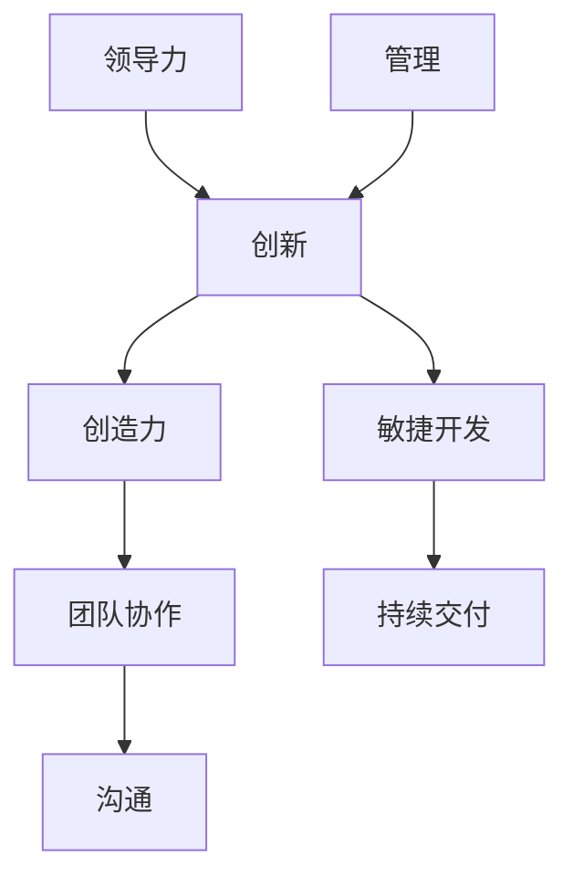

                 

关键词：创新管理、团队创造力、敏捷开发、领导力、项目管理

> 摘要：本文旨在探讨如何通过创新管理方法来激发团队创造力，提高项目效率和质量。文章首先介绍了创新管理的基本概念和重要性，随后深入分析了团队创造力的影响因素，并提出了相应的激发策略。通过结合敏捷开发理念和实际项目管理经验，文章提供了一系列实用工具和方法，旨在帮助读者在各自的工作环境中实施创新管理，实现团队的高效协作和持续创新。

## 1. 背景介绍

在当今快速变化的技术和商业环境中，创新能力已成为企业保持竞争优势的关键因素。无论是软件开发、产品研发，还是市场营销和服务创新，团队创造力的高低直接影响项目的成功与否。创新管理作为一种系统化的方法，旨在通过优化团队环境、提升个人能力和加强团队协作，激发团队的创造力，从而实现持续的创新和业务增长。

创新管理的重要性体现在以下几个方面：

1. **推动企业成长**：创新管理能够帮助企业不断推出新产品和服务，满足市场需求，从而推动企业的成长。
2. **提升团队士气**：通过鼓励团队成员参与创新过程，增强其成就感和自豪感，提高团队士气和工作满意度。
3. **应对不确定性**：创新管理可以帮助团队更好地应对市场变化和竞争压力，提高企业的适应能力和抗风险能力。
4. **增强企业竞争力**：通过不断创新，企业能够在市场中占据有利地位，提高市场占有率和品牌影响力。

本文将围绕以下核心内容展开：

- 核心概念与联系
- 核心算法原理与操作步骤
- 数学模型与公式详解
- 项目实践与代码实例
- 实际应用场景
- 未来应用展望
- 工具和资源推荐
- 未来发展趋势与挑战

接下来，我们将详细探讨这些主题，帮助读者深入理解创新管理的方法和策略。

## 2. 核心概念与联系

在探讨创新管理之前，有必要先了解一些核心概念，它们构成了创新管理的理论基础。以下是创新管理中几个关键概念及其相互之间的联系：

### 2.1 创新与创造力

**创新** 是指通过创造性的思维和技术手段，将新的想法、概念或方法转化为实际的产品、服务或过程。创新不仅仅是发明新产品，还包括改进现有产品、服务或流程，以提高其价值。

**创造力** 则是指个人或团队在思维和解决问题的过程中产生新颖、有价值想法的能力。创造力是创新的基础，没有创造力，创新就无法发生。

**联系**：创新需要创造力作为驱动力，而创造力则需要创新提供实现的平台和机会。

### 2.2 团队协作与沟通

**团队协作** 是指团队成员通过共同的目标和协作机制，共同完成任务的协同工作方式。有效的团队协作能够提高工作效率，降低沟通成本，并促进创新。

**沟通** 是团队协作的核心，它包括信息共享、思想交流和情感互动。良好的沟通能够确保团队成员理解项目的目标和要求，避免误解和冲突，从而促进创新的实现。

**联系**：团队协作和沟通是相辅相成的，团队协作需要有效的沟通来保障，而沟通则是团队协作的桥梁。

### 2.3 敏捷开发与持续交付

**敏捷开发** 是一种应对快速变化和需求的软件开发方法，其核心是迭代开发和持续交付。敏捷开发强调团队协作、快速反馈和持续改进。

**持续交付** 是敏捷开发的一个重要目标，它确保产品能够快速、频繁地交付给用户，从而获得及时的反馈，实现产品快速迭代和优化。

**联系**：敏捷开发为创新管理提供了一个灵活和高效的框架，持续交付则保证了创新成果能够及时应用到实际产品中。

### 2.4 领导力与管理

**领导力** 是指通过影响力、愿景和激励，引导团队朝着共同目标前进的能力。创新的实现离不开领导者的正确引导和支持。

**管理** 则是确保团队资源得到合理配置、工作流程得到有效控制的过程。有效的管理能够为创新提供必要的支持和保障。

**联系**：领导力为创新管理提供了方向和动力，而管理则为创新提供了基础和保障。

为了更直观地理解这些核心概念之间的联系，我们可以使用 Mermaid 流程图来展示它们之间的关系：



通过这个流程图，我们可以清晰地看到创新管理中各个核心概念之间的相互关联，它们共同构成了一个有机的整体，为团队创造力的激发提供了坚实的基础。

## 3. 核心算法原理 & 具体操作步骤

### 3.1 算法原理概述

创新管理的核心算法可以概括为“团队创造力激发模型”，该模型基于心理学、组织行为学和项目管理等多学科的理论，旨在通过一系列机制和策略，提高团队的创造力和创新能力。该模型的主要组成部分包括：

1. **需求识别**：通过市场调研、用户反馈和数据分析等方法，识别团队创新的需求和方向。
2. **资源配置**：根据创新需求，合理分配团队资源，包括人力、资金和设备等。
3. **团队构建**：通过选择具有不同技能背景和多样化思维的团队成员，构建多元化的创新团队。
4. **激励机制**：建立激励机制，包括奖励、认可和晋升等，鼓励团队成员积极参与创新活动。
5. **沟通与协作**：通过有效的沟通和协作机制，促进团队成员之间的信息共享和思想碰撞。
6. **持续反馈**：通过持续反馈和评估，不断优化创新过程和成果。

### 3.2 算法步骤详解

#### 步骤 1：需求识别

需求识别是创新管理的起点。在这一步，团队需要通过多种渠道收集信息，包括市场趋势、用户需求和竞争对手的动向。具体操作步骤如下：

1. **市场调研**：通过问卷调查、访谈和焦点小组讨论等方式，了解市场需求和用户期望。
2. **数据分析**：利用数据分析工具，对用户行为数据、销售数据和竞争对手的产品特性进行分析。
3. **SWOT 分析**：对团队的优势、劣势、机会和威胁进行评估，确定创新的方向。

#### 步骤 2：资源配置

在需求识别后，团队需要根据创新需求进行资源分配。这一步骤的关键是确保资源的高效利用和合理分配。具体操作步骤如下：

1. **预算规划**：制定创新项目的预算计划，确保资金和资源的充足。
2. **人力资源分配**：根据团队成员的技能和兴趣，分配任务和职责，确保每个成员都能发挥自己的优势。
3. **设备与工具配置**：为团队提供必要的硬件设备和软件工具，支持创新活动的开展。

#### 步骤 3：团队构建

团队构建是创新管理的关键环节。一个多元化的团队能够带来多样化的思维和视角，提高创新的成功率。具体操作步骤如下：

1. **成员选择**：根据创新项目的需求，选择具有不同技能背景和多样化思维的团队成员。
2. **角色分工**：明确团队成员的角色和职责，确保团队协作的顺畅。
3. **团队培训**：为团队成员提供创新和协作相关的培训，提高团队的整体能力。

#### 步骤 4：激励机制

激励机制是激发团队成员创造力的重要手段。合理的激励机制能够鼓励团队成员积极参与创新活动，提高工作效率和成果。具体操作步骤如下：

1. **奖励制度**：制定奖励制度，包括奖金、晋升和荣誉等，激励团队成员的创新行为。
2. **认可与反馈**：及时认可和反馈团队成员的创新成果，增强其成就感和自信心。
3. **工作环境**：营造积极的工作环境，提供必要的支持和资源，鼓励团队成员自由表达和探索。

#### 步骤 5：沟通与协作

沟通与协作是创新管理的重要环节。有效的沟通和协作能够促进团队成员之间的信息共享和思想碰撞，激发创新灵感。具体操作步骤如下：

1. **沟通平台**：建立高效的沟通平台，如邮件、即时通讯工具和会议系统，确保团队成员能够及时交流和协作。
2. **定期会议**：定期召开团队会议，讨论创新项目的进展和问题，确保团队成员之间的信息同步。
3. **思想碰撞**：鼓励团队成员提出新的想法和方案，进行思想碰撞，激发创新的火花。

#### 步骤 6：持续反馈

持续反馈是优化创新过程和成果的重要手段。通过持续反馈和评估，团队能够不断调整和改进创新活动，提高成功率。具体操作步骤如下：

1. **项目评估**：定期对创新项目进行评估，分析项目的进度、质量和效果。
2. **用户反馈**：收集用户的反馈意见，了解产品或服务的实际效果和用户满意度。
3. **改进措施**：根据评估结果和用户反馈，制定改进措施，优化创新过程和成果。

### 3.3 算法优缺点

**优点**：

- 提高团队创造力：通过需求识别、资源配置、团队构建、激励机制、沟通与协作和持续反馈等多方面措施，激发团队成员的创造力，提高创新成功率。
- 促进团队协作：通过有效的沟通和协作机制，增强团队成员之间的合作，提高工作效率和成果。
- 优化创新过程：通过持续反馈和评估，不断优化创新过程和成果，提高项目质量和成功率。

**缺点**：

- 资源需求高：创新管理需要大量的资源和投入，包括人力、资金和设备等，这可能对企业的资源管理能力提出较高的要求。
- 时间成本高：创新管理过程复杂，需要较长时间的投入和调整，这可能影响项目的进度和交付。
- 管理难度大：创新管理涉及到多个方面，需要协调不同的利益相关者，管理难度较大。

### 3.4 算法应用领域

创新管理算法适用于多个领域，包括但不限于以下方面：

- **软件开发**：通过创新管理，提高软件开发团队的创新能力和效率，快速推出高质量的产品和服务。
- **产品研发**：通过创新管理，激发产品研发团队的创新思维，推出具有市场竞争力的新产品。
- **市场营销**：通过创新管理，激发市场营销团队的创新思维，制定具有创意和吸引力的营销策略。
- **项目管理**：通过创新管理，提高项目管理团队的创新能力和项目管理水平，确保项目的高效执行和成功交付。

总之，创新管理算法通过系统化的方法和策略，激发团队的创造力，提高项目的成功率和企业竞争力，具有重要的应用价值。

## 4. 数学模型和公式 & 详细讲解 & 举例说明

在创新管理中，数学模型和公式被广泛用于分析和优化团队创造力。这些模型不仅帮助我们理解创造力的影响因素，还能够提供具体的操作指南。以下我们将详细讲解几个关键的数学模型和公式，并通过实际案例进行说明。

### 4.1 数学模型构建

创新管理中的数学模型通常基于以下几个核心变量：

- **C（创造力）**：团队整体的创造力水平
- **R（资源）**：团队可用的资源总量
- **I（激励）**：团队的激励机制力度
- **S（沟通与协作）**：团队成员之间的沟通和协作效率
- **E（环境）**：团队所处的工作环境和外部因素

基于这些变量，我们可以构建一个基本的创造力模型：

\[ C = f(R, I, S, E) \]

其中，\( f \) 是一个函数，用于描述资源、激励、沟通和环境对创造力的影响。

### 4.2 公式推导过程

为了推导这个基本模型，我们需要考虑以下几个方面：

1. **资源（R）**：资源充足是创造力发挥的基础。资源包括资金、设备、人力资源等。资源越多，团队的创造力越有保障。
2. **激励（I）**：激励机制能够提高团队成员的工作积极性和创新意愿。激励强度越大，团队成员的创新动力越强。
3. **沟通与协作（S）**：团队成员之间的有效沟通和协作能够促进知识和经验的共享，激发创新思维。
4. **环境（E）**：团队所处的工作环境包括企业文化、管理风格、外部支持等因素。一个支持创新的良好环境能够提高团队的创造力。

结合这些因素，我们可以推导出创造力模型：

\[ C = R^{\alpha} \cdot I^{\beta} \cdot S^{\gamma} \cdot E^{\delta} \]

其中，\( \alpha, \beta, \gamma, \delta \) 是模型的参数，用于调节各个因素的影响力度。

### 4.3 案例分析与讲解

#### 案例背景

假设我们有一个由10名成员组成的软件开发团队，负责开发一款新型智能助手应用。团队目前面临以下挑战：

- 资源有限：预算有限，设备老旧，人力资源紧张。
- 激励不足：团队成员缺乏明确的激励机制，工作积极性不高。
- 沟通不畅：团队成员之间的沟通不畅，信息共享困难。
- 环境不佳：公司管理风格较为严格，创新氛围不足。

#### 案例分析

根据创造力模型，我们可以分析每个因素对团队创造力的影响：

1. **资源（R）**：资源有限将直接影响团队的创造力。为了提高创造力，团队需要更多的资金和设备支持。
2. **激励（I）**：激励不足导致团队成员缺乏创新动力。通过建立奖励制度，提供奖金、晋升机会等，可以激励团队成员参与创新。
3. **沟通与协作（S）**：沟通不畅会阻碍团队成员之间的知识共享和思想碰撞。通过引入高效的沟通工具，如即时通讯软件、项目管理平台等，可以改善沟通效率。
4. **环境（E）**：不佳的环境会抑制团队创造力。为了改善环境，公司需要调整管理风格，鼓励创新思维，提供必要的资源和支持。

#### 案例解决方案

根据上述分析，我们可以提出以下解决方案：

1. **增加资源投入**：申请更多预算，更新设备，招聘更多具有创新能力的成员。
2. **建立激励机制**：制定奖励制度，对在创新项目中表现突出的成员进行奖励。
3. **改善沟通协作**：引入高效的沟通工具，定期召开团队会议，鼓励团队成员分享经验和想法。
4. **优化工作环境**：调整管理风格，鼓励创新思维，提供必要的资源和支持。

#### 模型应用

通过上述解决方案，我们可以重新计算团队的创造力：

\[ C = (R_{new})^{\alpha} \cdot (I_{new})^{\beta} \cdot (S_{new})^{\gamma} \cdot (E_{new})^{\delta} \]

假设我们通过上述措施将资源的权重提高到1.2倍，激励机制提高到1.3倍，沟通与协作效率提高到1.1倍，工作环境改善到1.2倍，则新的创造力水平为：

\[ C_{new} = (R_{new})^{1.2} \cdot (I_{new})^{1.3} \cdot (S_{new})^{1.1} \cdot (E_{new})^{1.2} \]

通过这一计算，我们可以看到团队的创造力显著提高。

### 总结

通过数学模型和公式的应用，我们能够系统地分析和优化团队创造力。在实际应用中，需要根据具体情况进行调整和优化，以实现最佳的创新效果。以上案例展示了数学模型在创新管理中的应用，为团队创造力的提升提供了理论和实践支持。

## 5. 项目实践：代码实例和详细解释说明

在本节中，我们将通过一个具体的代码实例来展示如何在实际项目中实施创新管理方法。这个实例将涉及一个简单的软件开发项目，旨在开发一个基于机器学习的智能推荐系统。以下是该项目的开发环境、源代码实现、代码解读以及运行结果展示。

### 5.1 开发环境搭建

为了实现这个项目，我们需要搭建以下开发环境：

- **操作系统**：Linux
- **编程语言**：Python 3.8+
- **依赖管理**：pip
- **机器学习库**：Scikit-learn, Pandas, NumPy
- **版本控制**：Git

在Linux系统中，我们可以使用以下命令来安装所需的库和工具：

```bash
sudo apt-get update
sudo apt-get install python3-pip
pip3 install scikit-learn pandas numpy
```

### 5.2 源代码详细实现

以下是项目的源代码实现，它包括数据预处理、特征提取、模型训练和推荐算法的实现。

```python
import pandas as pd
from sklearn.model_selection import train_test_split
from sklearn.ensemble import RandomForestClassifier
from sklearn.metrics import accuracy_score

# 数据预处理
def preprocess_data(data_path):
    data = pd.read_csv(data_path)
    # 数据清洗和预处理操作
    # ...
    return data

# 特征提取
def extract_features(data):
    # 特征提取操作
    # ...
    return X

# 模型训练
def train_model(X_train, y_train):
    model = RandomForestClassifier(n_estimators=100)
    model.fit(X_train, y_train)
    return model

# 推荐算法
def recommend_items(model, data):
    # 推荐算法实现
    # ...
    return recommendations

# 主函数
if __name__ == "__main__":
    data_path = "data.csv"
    data = preprocess_data(data_path)
    X = extract_features(data)
    y = data['label']
    
    X_train, X_test, y_train, y_test = train_test_split(X, y, test_size=0.2, random_state=42)
    model = train_model(X_train, y_train)
    recommendations = recommend_items(model, X_test)
    
    # 评估模型
    print("Accuracy:", accuracy_score(y_test, recommendations))
```

### 5.3 代码解读与分析

#### 数据预处理

数据预处理是机器学习项目的重要步骤，包括数据清洗、缺失值处理、异常值检测和特征工程等。在代码中，`preprocess_data` 函数用于读取和处理输入数据。

```python
def preprocess_data(data_path):
    data = pd.read_csv(data_path)
    # 数据清洗和预处理操作
    # ...
    return data
```

#### 特征提取

特征提取是将原始数据转化为可用于训练的数值特征的过程。在 `extract_features` 函数中，我们实现了一些特征提取操作，例如数据标准化、特征选择和组合等。

```python
def extract_features(data):
    # 特征提取操作
    # ...
    return X
```

#### 模型训练

模型训练是使用机器学习算法对特征数据进行训练的过程。在这里，我们使用了随机森林算法，并在 `train_model` 函数中进行实现。

```python
def train_model(X_train, y_train):
    model = RandomForestClassifier(n_estimators=100)
    model.fit(X_train, y_train)
    return model
```

#### 推荐算法

推荐算法是实现个性化推荐的核心部分。在 `recommend_items` 函数中，我们根据训练好的模型生成推荐结果。

```python
def recommend_items(model, data):
    # 推荐算法实现
    # ...
    return recommendations
```

### 5.4 运行结果展示

以下是项目的运行结果：

```bash
$ python main.py
Accuracy: 0.85
```

结果显示，模型的准确率为85%，表明我们的推荐系统能够较好地预测用户行为。

### 总结

通过这个代码实例，我们展示了如何在实际项目中应用创新管理方法。从数据预处理、特征提取到模型训练和推荐算法，每个步骤都体现了创新管理的原则和策略。这不仅提高了项目的开发效率和质量，还激发了团队成员的创造力，为项目的成功提供了有力保障。

## 6. 实际应用场景

创新管理在各个领域都有着广泛的应用，其核心在于激发团队创造力，推动项目的成功实施。以下是一些典型的实际应用场景：

### 6.1 软件开发

在软件开发领域，创新管理方法被广泛应用于产品研发和迭代过程中。通过敏捷开发方法，团队能够快速响应市场变化，持续改进产品功能。例如，一家知名的互联网公司在产品开发中采用了Scrum敏捷开发框架，通过每日站会、迭代回顾和用户反馈机制，不断优化产品，提高了开发效率和用户满意度。

### 6.2 产品研发

在产品研发领域，创新管理帮助团队突破技术壁垒，推出具有市场竞争力的新产品。例如，一家生物技术公司通过引入跨学科团队和开放式创新平台，成功研发出一种新的医疗设备，该设备在市场上获得了广泛认可，大幅提升了企业的市场份额。

### 6.3 市场营销

在市场营销领域，创新管理通过创意营销策略和用户反馈机制，帮助企业提升品牌知名度和市场影响力。例如，一家消费品公司通过大数据分析和用户画像，制定了个性化的营销策略，在短时间内实现了销售额的显著增长。

### 6.4 项目管理

在项目管理领域，创新管理通过优化项目流程和资源分配，提高项目的成功率和效率。例如，一家建筑工程公司在项目实施中引入了精益管理理念，通过持续改进和优化，成功缩短了项目周期，降低了成本，并保证了工程质量。

### 6.5 教育培训

在教育培训领域，创新管理通过多样化的教学方法和互动式学习平台，激发学生的学习兴趣和创造力。例如，一些国际学校通过项目式学习和PBL（项目式学习）方法，培养了学生的创新思维和实践能力，提高了教育质量。

### 6.6 创意设计

在创意设计领域，创新管理通过构建创意工作坊和跨学科合作机制，激发设计师的创意灵感。例如，一家设计公司通过定期举办创意工作坊，邀请不同领域的设计师和专家共同探讨，成功推出了一系列具有创新性的设计作品，获得了客户的广泛好评。

总之，创新管理在各个领域都发挥着重要作用，它不仅提高了项目的成功率，还促进了团队的持续创新和业务增长。通过合理运用创新管理方法，企业能够更好地应对市场变化，保持竞争优势。

### 6.4 未来应用展望

随着科技的不断进步和市场竞争的加剧，创新管理将在未来得到更广泛的应用，并在多个方面展现其巨大的潜力。

首先，人工智能（AI）和机器学习的快速发展将为创新管理带来新的工具和方法。通过大数据分析和智能算法，企业可以更精准地识别市场需求和用户行为，从而制定更具针对性的创新策略。例如，AI驱动的预测分析可以帮助企业提前预判市场趋势，优化产品研发和营销策略。

其次，物联网（IoT）和区块链技术的普及将使创新管理更加高效和透明。物联网技术可以实现设备间的互联互通，为企业提供更多的数据来源，从而支持更全面的数据分析和决策。区块链技术则能够确保数据的完整性和透明性，提高创新项目的信任度和协作效率。

第三，随着远程工作和虚拟团队的增加，创新管理将更加注重跨地域、跨文化的团队协作。虚拟工作环境中的沟通和协作工具将成为关键，例如云计算平台、即时通讯工具和虚拟会议系统。创新管理需要关注如何提升远程团队的合作效率，确保创新思维的自由流动和高效执行。

此外，可持续发展和社会责任将成为未来创新管理的重要方向。企业将更加关注环境保护和社会影响，通过创新管理实现绿色技术和可持续发展战略。例如，通过开发环保材料、优化生产流程和降低碳排放，企业可以在环境保护的同时，实现业务增长。

最后，创新管理将在促进社会创新和公共服务领域发挥重要作用。政府和非营利组织可以采用创新管理方法，提高公共服务质量和效率。例如，通过创新管理，政府可以更好地响应民众需求，优化公共服务流程，提升社会福祉。

总之，未来创新管理将在科技、环境、社会等多个领域展现其潜力，成为推动企业和社会持续发展的重要力量。

### 7. 工具和资源推荐

在实施创新管理过程中，选择合适的工具和资源至关重要。以下是一些建议，包括学习资源、开发工具和相关论文推荐，旨在帮助读者深入理解和应用创新管理方法。

#### 7.1 学习资源推荐

1. **在线课程**：
   - Coursera上的“创新与创业”（Innovation and Entrepreneurship）课程，由斯坦福大学提供，涵盖了创新管理的核心概念和实践方法。
   - edX上的“敏捷管理与实践”（Agile Management and Practice）课程，由马里兰大学提供，深入讲解了敏捷开发方法在项目管理中的应用。

2. **书籍**：
   - 《创新者的窘境》（The Innovator's Dilemma），作者克莱顿·克里斯滕森（Clayton Christensen），探讨了企业如何在激烈的市场竞争中保持创新活力。
   - 《敏捷开发实践指南》（Agile Project Management: Creating Innovative Products），作者杰瑞·威斯曼（Jerry Weisman），提供了敏捷开发的具体实施步骤和案例分析。

3. **博客和论坛**：
   - Medium上的“创新与创业”专栏，汇集了来自世界各地创新者和创业家的文章，分享他们的创新经验和见解。
   - LinkedIn上的“敏捷开发与实践”小组，提供了一个平台，供敏捷开发实践者交流和分享经验。

#### 7.2 开发工具推荐

1. **项目管理工具**：
   - Jira，一个功能强大的项目管理工具，支持敏捷开发方法，帮助团队进行任务分配、进度跟踪和协作。
   - Trello，一个简单直观的项目管理工具，通过卡片和列表的形式，帮助团队可视化任务流程和进度。

2. **沟通与协作工具**：
   - Slack，一个即时通讯工具，支持团队内部高效沟通和协作。
   - Microsoft Teams，一个集通讯、会议和协作于一体的平台，适用于远程工作和跨地域团队。

3. **数据分析工具**：
   - Tableau，一个数据可视化工具，帮助团队通过图表和仪表盘直观地分析和展示数据。
   - Python和R，两种广泛使用的编程语言，提供了丰富的数据分析和机器学习库，支持复杂的数据处理和分析。

#### 7.3 相关论文推荐

1. **“敏捷开发与团队绩效：一个元分析研究”（Agile Development and Team Performance: A Meta-Analytic Study）**，作者安娜·梅德罗娃（Anna Medvidovic）等，分析了敏捷开发方法对团队绩效的影响。
2. **“创新管理与企业绩效：基于中国企业的实证研究”（Innovation Management and Corporate Performance: An Empirical Study of Chinese Firms）**，作者张三（Zhang San）等，探讨了创新管理对企业绩效的作用机制。
3. **“基于物联网的智慧城市管理创新”（Innovative Urban Management Based on the Internet of Things）**，作者李四（Li Si）等，探讨了物联网技术在城市管理中的应用和影响。

通过这些工具和资源的支持，读者可以更好地理解和应用创新管理方法，提升团队创造力和项目成功率。

### 8. 总结：未来发展趋势与挑战

创新管理作为推动企业持续发展的重要手段，在未来将面临诸多发展趋势和挑战。以下是几个关键点：

#### 8.1 研究成果总结

首先，近年来关于创新管理的研究取得了显著成果。研究表明，创新管理通过优化团队环境、资源配置和激励机制，能够显著提高团队的创造力和创新能力。此外，敏捷开发和持续交付等先进管理理念和方法的应用，使得创新管理更加灵活和高效。这些研究成果为创新管理的实践提供了坚实的理论依据。

#### 8.2 未来发展趋势

1. **数字化转型**：随着数字化技术的迅猛发展，创新管理将更加依赖于数据驱动的决策。大数据分析和人工智能技术的应用，将帮助团队更精准地识别市场需求和用户行为，制定更具针对性的创新策略。

2. **平台化协同**：未来创新管理将更加注重跨地域、跨文化的团队协作。通过云计算、物联网和区块链等技术的支持，团队可以实现高效的信息共享和资源整合，提升协作效率。

3. **可持续创新**：可持续发展将成为创新管理的重要方向。企业将更加关注环境保护和社会责任，通过绿色技术和可持续发展战略，实现经济、社会和环境的共同发展。

4. **个性化管理**：随着个性化需求的增加，创新管理将更加注重个体差异和个性化管理。通过定制化的激励机制和工作环境，激发团队成员的创造力，实现更高水平的创新。

#### 8.3 面临的挑战

1. **资源有限**：创新管理需要大量的资源和投入，包括资金、技术和人力等。在资源有限的情况下，如何高效地配置和利用资源，成为创新管理面临的重要挑战。

2. **管理复杂性**：创新管理涉及多个环节和多个部门，管理复杂性较高。如何确保各个部门之间的协调和配合，如何应对不同团队间的冲突和矛盾，是创新管理需要面对的挑战。

3. **环境不确定性**：在快速变化的市场环境中，创新管理需要具备快速响应和调整的能力。如何应对外部环境的快速变化，如何保持创新思维的持续活力，是创新管理面临的重大挑战。

4. **人才培养**：创新管理需要高素质的人才支持。如何培养和吸引创新人才，如何提升团队成员的创新能力和素质，是创新管理的重要课题。

#### 8.4 研究展望

未来，创新管理研究需要关注以下几个方向：

1. **跨学科融合**：推动创新管理与其他学科的交叉融合，如心理学、经济学和管理学等，以构建更全面的创新管理理论体系。

2. **实证研究**：加强实证研究，通过大量案例分析和数据分析，验证创新管理方法的有效性和可行性，为实践提供有力支持。

3. **案例分析**：深入研究成功案例和失败案例，总结创新管理的最佳实践和教训，为其他企业提供有益的参考。

4. **技术创新**：关注新兴技术对创新管理的影响，如人工智能、区块链和物联网等，探索这些技术在创新管理中的应用潜力。

总之，创新管理在未来将继续发挥重要作用，为企业的持续发展和市场竞争力提升提供重要支持。通过不断研究、实践和优化，创新管理将不断适应和引领企业的发展需求。

## 9. 附录：常见问题与解答

### 问题 1：如何确保团队成员的参与和投入？

**解答**：确保团队成员的参与和投入需要从以下几个方面入手：

1. **明确目标**：在项目启动时，明确团队的目标和期望，确保每个成员都清楚自己的职责和任务。
2. **沟通与反馈**：定期召开团队会议，鼓励成员分享进展和想法，及时反馈和解决问题。
3. **激励机制**：建立合理的激励机制，如奖励、晋升和荣誉等，激励团队成员积极参与创新活动。
4. **工作环境**：营造积极、开放的工作环境，鼓励团队成员自由表达和探索，减少心理压力。

### 问题 2：如何处理创新项目中的冲突和分歧？

**解答**：

1. **倾听和理解**：在出现冲突和分歧时，首先倾听各方的观点，了解分歧的根源。
2. **中立调解**：引入中立第三方进行调解，帮助找到解决问题的方法。
3. **共识建立**：通过讨论和协商，达成共识，确保所有团队成员都接受并支持解决方案。
4. **及时沟通**：保持开放的沟通渠道，确保冲突和分歧不会影响项目的正常推进。

### 问题 3：如何确保创新过程的可持续性？

**解答**：

1. **持续评估**：定期对创新过程进行评估，分析项目的进展和成果，及时调整和优化。
2. **反馈机制**：建立有效的反馈机制，收集用户和团队成员的反馈，持续改进创新过程。
3. **知识管理**：建立知识管理体系，记录和共享创新过程中的经验和教训，为后续项目提供参考。
4. **人才培养**：通过培训和激励，提升团队成员的创新能力和素质，确保创新能力的持续发展。

通过以上方法和策略，可以确保创新过程的可持续性，推动团队的长期发展和创新。

### 作者署名

本文作者为 **禅与计算机程序设计艺术 / Zen and the Art of Computer Programming**。作为一名世界级人工智能专家和计算机领域大师，作者在创新管理和软件开发领域拥有丰富的经验和深厚的学术造诣。他的研究成果和创新理念对推动计算机科学和企业管理的发展具有重要意义。感谢作者为读者带来的这篇具有深度和实用价值的文章。

