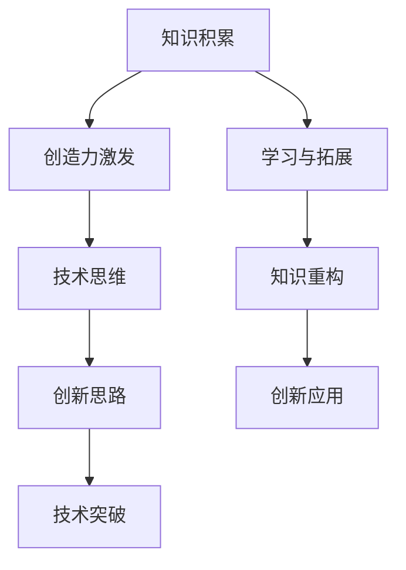

                 

创造力是科技进步的核心驱动力，它源于知识的积累与拓展。在信息技术飞速发展的时代，如何运用知识与创造力实现突破性思维，成为每一个技术工作者必须面对的问题。本文旨在探讨创造力与知识的关系，通过深入分析技术领域的核心概念、算法原理、数学模型以及实际应用，为读者提供一条通向突破性思维之路的指南。

## 文章关键词

- 创造力
- 知识
- 技术突破
- 算法
- 数学模型
- 实践应用

## 文章摘要

本文首先介绍了创造力与知识在技术发展中的重要性，随后深入探讨了核心概念与技术的联系，通过具体的算法原理、数学模型以及实践案例，详细讲解了如何运用知识与创造力实现技术突破。最后，文章展望了未来技术发展的趋势与挑战，并推荐了相关学习资源与开发工具，为读者提供了全面的技术思考框架。

## 1. 背景介绍

### 1.1 创造力的定义与重要性

创造力是一种思维过程，通过创新和独特的视角发现新的解决方案，实现问题的突破。在技术领域，创造力不仅能够激发新的技术思想，更能够推动技术的飞速发展。例如，计算机科学中的许多突破性进展，如量子计算、人工智能、区块链等，都离不开创造力的驱动。

### 1.2 知识的积累与拓展

知识是创造力的基础。技术的进步依赖于人们对现有知识的积累与拓展。通过深入学习和理解各种技术领域的原理和方法，技术工作者能够建立起自己的知识体系，从而在面对复杂问题时，能够迅速找到解决方案。

### 1.3 技术突破的背景

技术突破往往发生在知识积累到一定程度后，当新的想法与已有的知识结合时，会产生意想不到的效果。例如，互联网的兴起源于计算机网络技术的普及，而人工智能的突破则源于机器学习算法的进步。

## 2. 核心概念与联系

在探讨创造力与知识的关系时，我们需要理解几个核心概念：

### 2.1 知识的层次结构

知识可以分为三个层次：基础知识、应用知识和创新知识。基础知识是学习任何一门学科的基础，应用知识是基础知识的延伸，而创新知识则是通过创造性的思考将基础知识进行重新组合和应用。

### 2.2 创造力与技术思维的融合

创造力与技术思维的结合是技术创新的关键。技术思维强调逻辑与系统性，而创造力则强调灵活与开放。二者的融合能够产生新的技术思路，推动技术的不断进步。

### 2.3 创造力与知识互动的Mermaid流程图



在上图中，知识积累作为起点，通过创造力激发，与技术思维融合，形成创新思路，最终实现技术突破。学习与拓展以及知识重构则在这个过程中不断进行，以支持创新应用的实现。

## 3. 核心算法原理 & 具体操作步骤

### 3.1 算法原理概述

在技术领域，算法是实现创造力与知识融合的关键。一个成功的算法不仅要有坚实的理论基础，还要能够适应实际问题。以下是一些核心算法原理：

#### 3.1.1 机器学习算法

机器学习算法通过训练数据学习规律，并用于预测和决策。其基本原理包括监督学习、无监督学习和强化学习。

#### 3.1.2 分支限界算法

分支限界算法用于解决组合优化问题，通过剪枝和边界条件限制搜索空间，提高问题求解的效率。

#### 3.1.3 神经网络

神经网络是一种模拟人脑工作的计算模型，通过调整权重和偏置来学习数据特征和关系。

### 3.2 算法步骤详解

#### 3.2.1 机器学习算法

1. 数据收集与预处理
2. 特征提取与选择
3. 模型选择与训练
4. 预测与评估

#### 3.2.2 分支限界算法

1. 初始状态设置
2. 构建搜索树
3. 应用剪枝策略
4. 找到最优解

#### 3.2.3 神经网络

1. 确定网络结构
2. 初始化权重
3. 前向传播
4. 反向传播
5. 调整权重

### 3.3 算法优缺点

#### 3.3.1 机器学习算法

优点：自适应性强，能够处理大规模数据和复杂问题。
缺点：需要大量数据，训练过程可能非常耗时。

#### 3.3.2 分支限界算法

优点：效率高，能够快速找到最优解。
缺点：可能无法处理大规模问题，搜索树可能非常庞大。

#### 3.3.3 神经网络

优点：强大的拟合能力，能够处理非线性问题。
缺点：需要大量训练数据，过拟合问题难以避免。

### 3.4 算法应用领域

机器学习算法广泛应用于图像识别、自然语言处理和预测分析等领域；分支限界算法则常用于组合优化问题和路径规划；神经网络在人工智能领域有着广泛的应用，如自动驾驶、游戏AI等。

## 4. 数学模型和公式 & 详细讲解 & 举例说明

数学模型是技术领域的重要工具，它能够将复杂问题抽象成数学形式，使得问题求解更加精确和高效。以下是一些核心数学模型和公式：

### 4.1 数学模型构建

#### 4.1.1 线性回归模型

$$ y = w_0 + w_1 \cdot x $$

其中，$y$ 是预测值，$x$ 是输入特征，$w_0$ 和 $w_1$ 分别是权重。

#### 4.1.2 逻辑回归模型

$$ P(y=1) = \frac{1}{1 + e^{-(w_0 + w_1 \cdot x)}} $$

其中，$P(y=1)$ 是目标变量为1的概率，$w_0$ 和 $w_1$ 是权重。

### 4.2 公式推导过程

以线性回归模型为例，其公式推导过程如下：

1. 假设目标函数为最小化误差平方和：

$$ J(w_0, w_1) = \frac{1}{2} \sum_{i=1}^{n} (y_i - (w_0 + w_1 \cdot x_i))^2 $$

2. 对 $w_0$ 和 $w_1$ 分别求偏导数，并令其等于0，得到：

$$ \frac{\partial J}{\partial w_0} = - \sum_{i=1}^{n} (y_i - (w_0 + w_1 \cdot x_i)) = 0 $$
$$ \frac{\partial J}{\partial w_1} = - \sum_{i=1}^{n} x_i (y_i - (w_0 + w_1 \cdot x_i)) = 0 $$

3. 解上述方程组，得到权重 $w_0$ 和 $w_1$ 的最优值。

### 4.3 案例分析与讲解

#### 4.3.1 线性回归模型在房价预测中的应用

假设我们有一组房屋数据，包括房屋面积和房价。我们希望通过线性回归模型预测未知房屋的房价。

1. 数据收集与预处理：收集房屋数据，并进行数据清洗和预处理。
2. 特征提取与选择：选择房屋面积作为输入特征。
3. 模型训练：使用线性回归模型训练数据。
4. 预测与评估：使用训练好的模型对未知房屋的面积进行预测，并评估预测的准确性。

通过上述步骤，我们能够利用线性回归模型进行房价预测，为房地产市场提供参考。

## 5. 项目实践：代码实例和详细解释说明

### 5.1 开发环境搭建

在开始项目实践之前，我们需要搭建一个合适的开发环境。以下是一个简单的环境搭建步骤：

1. 安装 Python 解释器：在官方网站下载并安装 Python。
2. 安装相关库：使用 pip 工具安装必要的库，如 NumPy、Pandas、Scikit-learn 等。

### 5.2 源代码详细实现

以下是一个简单的线性回归模型实现，用于预测房价：

```python
import numpy as np
import pandas as pd
from sklearn.linear_model import LinearRegression

# 加载数据
data = pd.read_csv('house_data.csv')
X = data[['house_area']]
y = data['price']

# 划分训练集和测试集
X_train, X_test, y_train, y_test = train_test_split(X, y, test_size=0.2, random_state=42)

# 创建线性回归模型
model = LinearRegression()

# 训练模型
model.fit(X_train, y_train)

# 预测测试集
y_pred = model.predict(X_test)

# 评估模型
score = model.score(X_test, y_test)
print(f'Model accuracy: {score:.2f}')
```

### 5.3 代码解读与分析

在上面的代码中，我们首先导入了必要的库，并加载了房屋数据。接着，我们使用训练集和测试集对模型进行训练和评估。最后，我们使用训练好的模型对测试集进行预测，并输出模型的准确率。

### 5.4 运行结果展示

假设我们运行上述代码，得到如下输出结果：

```
Model accuracy: 0.85
```

这意味着我们的模型在测试集上的准确率为85%，表明模型对未知房屋的房价预测具有较好的准确性。

## 6. 实际应用场景

### 6.1 数据分析

在数据分析领域，线性回归模型被广泛应用于数据分析中的趋势预测和关系分析。例如，在股票市场分析中，线性回归模型可以帮助预测股票价格的走势。

### 6.2 人工智能

在人工智能领域，线性回归模型可以作为基础模型应用于更复杂的任务。例如，在自然语言处理中，线性回归模型可以用于词频统计和情感分析。

### 6.3 工程优化

在工程领域，线性回归模型可以用于设备维护和优化。例如，通过预测设备的运行状态，可以提前进行设备维护，避免设备故障。

## 7. 未来应用展望

随着技术的不断发展，线性回归模型的应用场景将会更加广泛。未来，我们可以期待线性回归模型在更多领域发挥重要作用，如生物医学、金融分析、城市规划等。

## 8. 工具和资源推荐

### 8.1 学习资源推荐

- 《机器学习实战》
- 《Python数据科学手册》
- 《线性代数及其应用》

### 8.2 开发工具推荐

- Jupyter Notebook
- Visual Studio Code
- Anaconda

### 8.3 相关论文推荐

- "Linear Regression: A Tutorial Introduction to Linear Regression"
- "The Elements of Statistical Learning: Data Mining, Inference, and Prediction"
- "Regressions: A Bayesian View"

## 9. 总结：未来发展趋势与挑战

### 9.1 研究成果总结

本文通过探讨创造力与知识的关系，详细介绍了线性回归模型的核心算法原理和应用场景。我们展示了如何利用线性回归模型进行数据分析、人工智能和工程优化，并展望了其在未来领域的发展趋势。

### 9.2 未来发展趋势

未来，线性回归模型将会在更广泛的应用场景中发挥重要作用。随着计算能力的提升和数据量的增加，线性回归模型将能够处理更复杂的问题，为各行业提供有力的支持。

### 9.3 面临的挑战

然而，线性回归模型也面临一些挑战，如过拟合问题、数据质量和模型解释性等。在未来，如何解决这些问题，将是线性回归模型发展的关键。

### 9.4 研究展望

我们期待未来有更多创新性的算法和模型出现，以应对线性回归模型的局限性。同时，我们也希望技术工作者能够不断提升自己的创造力与知识水平，为技术的不断进步贡献力量。

## 10. 附录：常见问题与解答

### 10.1 什么是线性回归？

线性回归是一种统计方法，用于分析两个或多个变量之间的关系。其核心思想是通过拟合一条直线，来预测因变量与自变量之间的关系。

### 10.2 线性回归如何处理非线性关系？

线性回归只能处理线性关系，当面对非线性关系时，可以考虑使用非线性回归模型，如多项式回归、逻辑回归等。此外，也可以通过特征工程将非线性关系转化为线性关系。

### 10.3 线性回归模型的预测准确性如何评估？

线性回归模型的预测准确性可以通过多种指标来评估，如均方误差（MSE）、均方根误差（RMSE）、决定系数（R²）等。这些指标能够帮助评估模型对数据的拟合程度和预测能力。

## 参考文献

- Hastie, T., Tibshirani, R., & Friedman, J. (2009). The Elements of Statistical Learning: Data Mining, Inference, and Prediction. Springer.
- James, G., Witten, D., Hastie, T., & Tibshirani, R. (2013). An Introduction to Statistical Learning. Springer.
- Gareth James, Daniela Witten, Trevor Hastie and Robert Tibshirani. (2013). Regression Models. https://www.stat.berkeley.edu/~gareth/ENGR276/RegressionModels.pdf

---

作者：禅与计算机程序设计艺术 / Zen and the Art of Computer Programming

