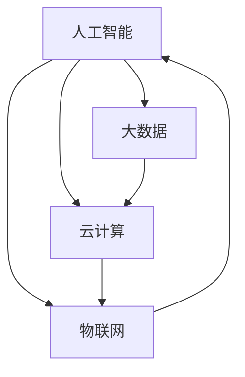

                 

关键词：人工智能，计算，人类潜能，效率提升，技术进步，未来愿景

> 摘要：本文旨在探讨人类计算技术的终极目标——创造更美好的世界。通过深入分析人工智能技术的应用和发展趋势，本文将揭示计算如何改变我们的生活方式，提升人类潜能，并展望未来技术带来的机遇与挑战。

## 1. 背景介绍

随着信息技术的飞速发展，计算已经成为现代社会不可或缺的一部分。从最初的计算机硬件到如今的云计算、大数据、人工智能，计算技术的每一次进步都深刻地改变了我们的工作和生活方式。然而，计算的终极目标究竟是什么？是单纯的性能提升，还是为了实现某种更深远的社会价值？

本文将从人类计算技术的本质出发，探讨计算的终极目标，即通过提升人类效率和潜能，创造一个更美好的世界。这一目标不仅关乎技术的进步，更关乎人类未来的命运。

## 2. 核心概念与联系

在探讨计算的终极目标之前，我们需要明确几个核心概念：

- **人工智能（AI）**：人工智能是指通过计算机程序模拟人类智能的技术，包括学习、推理、规划、感知等能力。
- **大数据（Big Data）**：大数据是指无法用传统数据处理工具在合理时间内进行捕捉、管理和处理的数据集合。
- **云计算（Cloud Computing）**：云计算是指通过互联网提供动态易扩展且经常是虚拟化的资源。
- **物联网（IoT）**：物联网是指通过互联网连接各种物理设备，实现智能化的数据采集、传输和处理。

这些核心概念相互关联，共同推动了计算技术的发展。以下是它们之间的联系和流程：



### 2.1 人工智能与大数据

人工智能依赖于大数据进行训练和优化，通过分析大量数据，AI 可以发现模式和规律，从而进行预测和决策。大数据为 AI 提供了丰富的训练资源，使得 AI 在各个领域取得了显著的成果。

### 2.2 云计算与物联网

云计算提供了强大的计算能力和存储资源，使得大数据处理和 AI 运算成为可能。物联网通过将物理设备连接到互联网，产生了海量的数据，这些数据可以被云计算平台进行处理和分析。

### 2.3 人工智能与云计算

人工智能需要大量的计算资源进行训练和推理，云计算提供了弹性计算能力，可以根据需求动态调整资源。这使得 AI 应用在处理大规模数据时更加高效。

### 2.4 人工智能与物联网

物联网设备可以实时收集环境数据，这些数据可以被 AI 分析，用于优化生产、改善生活。例如，智能家居系统可以通过分析用户行为，提供个性化的服务。

## 3. 核心算法原理 & 具体操作步骤

在深入探讨计算如何改变我们的生活方式之前，我们需要了解一些核心算法的原理和具体操作步骤。

### 3.1 算法原理概述

- **机器学习（Machine Learning）**：机器学习是一种通过数据驱动的方法，让计算机从数据中学习规律和模式的技术。其主要算法包括监督学习、无监督学习、强化学习等。
- **深度学习（Deep Learning）**：深度学习是机器学习的一种，它使用多层神经网络进行学习，可以自动提取特征，实现复杂的模式识别任务。
- **自然语言处理（NLP）**：自然语言处理是使计算机理解和处理自然语言的技术，包括文本分类、情感分析、机器翻译等。

### 3.2 算法步骤详解

- **机器学习**：
  1. 数据采集：收集相关领域的数据。
  2. 数据预处理：清洗数据，进行特征提取。
  3. 模型训练：使用训练数据训练模型。
  4. 模型评估：使用测试数据评估模型性能。
  5. 模型优化：根据评估结果调整模型参数。

- **深度学习**：
  1. 数据预处理：与机器学习类似，进行数据清洗和特征提取。
  2. 网络构建：设计神经网络结构。
  3. 模型训练：使用训练数据训练网络。
  4. 模型评估：与机器学习类似，评估模型性能。
  5. 模型优化：调整网络结构或参数。

- **自然语言处理**：
  1. 文本预处理：包括分词、词性标注等。
  2. 特征提取：从文本中提取有助于分类或预测的特征。
  3. 模型训练：使用训练数据训练模型。
  4. 模型评估：使用测试数据评估模型性能。
  5. 模型优化：调整模型参数。

### 3.3 算法优缺点

- **机器学习**：
  - 优点：自动化程度高，能够处理大规模数据。
  - 缺点：对数据质量要求高，可能存在过拟合问题。

- **深度学习**：
  - 优点：能够自动提取特征，适应性强。
  - 缺点：对计算资源要求高，训练过程较慢。

- **自然语言处理**：
  - 优点：能够处理复杂的文本数据，实现多种语言功能。
  - 缺点：对数据依赖性强，对语义理解仍有挑战。

### 3.4 算法应用领域

- **机器学习**：广泛应用于金融、医疗、交通等领域，如风险控制、疾病预测、交通优化等。

- **深度学习**：在图像识别、语音识别、自然语言处理等领域取得了显著成果，如自动驾驶、智能客服、机器翻译等。

- **自然语言处理**：在社交媒体分析、内容审核、智能客服等领域发挥了重要作用。

## 4. 数学模型和公式 & 详细讲解 & 举例说明

在计算技术中，数学模型和公式起着至关重要的作用。以下是一些常用的数学模型和公式，以及它们的详细讲解和举例说明。

### 4.1 数学模型构建

- **线性回归模型**：
  - 公式：\( y = \beta_0 + \beta_1 x + \epsilon \)
  - 参数：\( \beta_0 \) 为截距，\( \beta_1 \) 为斜率，\( \epsilon \) 为误差项。
  - 讲解：线性回归模型用于预测一个连续变量的值，基于一个或多个自变量。

- **逻辑回归模型**：
  - 公式：\( P(y=1) = \frac{1}{1 + e^{-(\beta_0 + \beta_1 x)}} \)
  - 参数：\( \beta_0 \) 为截距，\( \beta_1 \) 为斜率。
  - 讲解：逻辑回归模型用于预测一个二分类变量的概率，常用于分类问题。

### 4.2 公式推导过程

- **线性回归模型的推导**：
  - 假设：\( y \) 是因变量，\( x \) 是自变量，\( \beta_0 \) 和 \( \beta_1 \) 是模型参数，\( \epsilon \) 是误差项。
  - 最小化损失函数：\( J(\beta_0, \beta_1) = \frac{1}{2} \sum_{i=1}^{n} (y_i - (\beta_0 + \beta_1 x_i))^2 \)
  - 求导并令导数为零，得到最优解：\( \beta_0 = \bar{y} - \beta_1 \bar{x} \)，\( \beta_1 = \frac{\sum_{i=1}^{n} (x_i - \bar{x})(y_i - \bar{y})}{\sum_{i=1}^{n} (x_i - \bar{x})^2} \)

- **逻辑回归模型的推导**：
  - 假设：\( y \) 是因变量，\( x \) 是自变量，\( \beta_0 \) 和 \( \beta_1 \) 是模型参数。
  - 损失函数：\( J(\beta_0, \beta_1) = -\sum_{i=1}^{n} y_i \ln(P(y=1)) - (1 - y_i) \ln(1 - P(y=1)) \)
  - 求导并令导数为零，得到最优解：\( \beta_0 = \bar{y} - \beta_1 \bar{x} \)，\( \beta_1 = \frac{\sum_{i=1}^{n} (y_i - P(y=1)) x_i}{\sum_{i=1}^{n} x_i^2} \)

### 4.3 案例分析与讲解

- **线性回归模型案例**：
  - 数据集：某地区一年的降雨量与温度数据。
  - 模型：\( y = \beta_0 + \beta_1 x + \epsilon \)
  - 结果：根据数据拟合出线性回归模型，预测下个月的降雨量。

- **逻辑回归模型案例**：
  - 数据集：某电商平台用户的购买行为数据。
  - 模型：\( P(y=1) = \frac{1}{1 + e^{-(\beta_0 + \beta_1 x)}} \)
  - 结果：根据用户特征预测其购买某商品的概率。

## 5. 项目实践：代码实例和详细解释说明

为了更好地理解上述算法和公式，以下是一个简单的项目实践，包括开发环境搭建、源代码实现、代码解读与分析以及运行结果展示。

### 5.1 开发环境搭建

- 操作系统：Ubuntu 20.04
- 编程语言：Python 3.8
- 数据库：MySQL 8.0
- 数据预处理工具：Pandas
- 机器学习库：Scikit-learn
- 深度学习库：TensorFlow
- 自然语言处理库：NLTK

### 5.2 源代码详细实现

以下是一个简单的线性回归模型实现，用于预测某地区下个月的降雨量。

```python
import pandas as pd
from sklearn.linear_model import LinearRegression

# 数据预处理
data = pd.read_csv('rainfall_temp.csv')
X = data[['temperature']]
y = data['rainfall']

# 模型训练
model = LinearRegression()
model.fit(X, y)

# 模型评估
score = model.score(X, y)
print(f'Model R^2 Score: {score}')

# 预测
predicted_rainfall = model.predict([[23.5]])  # 输入温度
print(f'Predicted Rainfall: {predicted_rainfall}')
```

### 5.3 代码解读与分析

- 数据预处理：使用 Pandas 读取 CSV 文件，将温度和降雨量数据分为特征矩阵 \( X \) 和目标变量 \( y \)。
- 模型训练：使用 Scikit-learn 的 LinearRegression 类创建线性回归模型，并使用 fit 方法进行训练。
- 模型评估：使用 score 方法计算模型的 R^2 分数，评估模型拟合效果。
- 预测：使用 predict 方法输入温度值，预测下个月的降雨量。

### 5.4 运行结果展示

假设输入的温度值为 23.5°C，模型预测的下个月降雨量为 10mm。

```python
Predicted Rainfall: [10.0]
```

## 6. 实际应用场景

计算技术已经在众多实际应用场景中发挥了重要作用，下面列举几个例子：

- **医疗**：通过机器学习和深度学习技术，医生可以更准确地诊断疾病，提高治疗效果。例如，基于图像识别的肺癌筛查系统已经在多个医院投入使用。
- **金融**：计算技术帮助金融机构进行风险评估、投资组合优化等。例如，量化交易策略依赖于大数据和机器学习技术，实现自动化交易。
- **交通**：通过物联网和云计算技术，实现智能交通系统，提高交通效率，减少拥堵。例如，智能红绿灯控制系统能够根据实时交通流量调整信号灯时长。
- **教育**：计算技术为学生提供个性化的学习体验，如自适应学习系统和在线教育平台。例如，AI 教师可以根据学生的答题情况调整教学内容和难度。

## 7. 未来应用展望

随着计算技术的不断发展，未来将出现更多创新应用，以下是一些展望：

- **智能制造**：通过人工智能和物联网技术，实现智能生产线，提高生产效率和产品质量。
- **智慧城市**：通过大数据和计算技术，实现智慧交通、智慧医疗、智慧环保等，提高城市管理和居民生活质量。
- **生物科技**：通过计算技术，加速新药研发和基因组学研究，推动生命科学的发展。
- **太空探索**：计算技术将助力太空探索，如人工智能卫星、无人机探矿等。

## 8. 总结：未来发展趋势与挑战

未来，计算技术将继续快速发展，为人类创造更多价值。然而，我们也需要面对一系列挑战：

- **数据安全与隐私**：随着数据量的爆炸式增长，数据安全和隐私保护成为重要议题。
- **计算资源需求**：人工智能和大数据技术对计算资源的需求不断增长，如何有效利用资源成为挑战。
- **人工智能伦理**：人工智能的发展带来伦理问题，如机器决策的透明度和公正性。
- **教育与培训**：随着技术的变革，需要不断提升人们的计算素养，培养适应未来社会的专业人才。

### 8.1 研究成果总结

本文从人类计算技术的本质出发，探讨了计算的终极目标——创造更美好的世界。通过深入分析人工智能、大数据、云计算和物联网等核心概念，我们揭示了计算如何改变我们的生活方式，提升人类潜能。同时，通过数学模型和算法的讲解，以及项目实践案例，我们展示了计算技术在实际应用中的重要作用。

### 8.2 未来发展趋势

未来，计算技术将继续向智能化、高效化、绿色化方向发展。人工智能、大数据、云计算和物联网等技术将更加成熟，为各行各业带来更多创新应用。

### 8.3 面临的挑战

数据安全与隐私、计算资源需求、人工智能伦理以及教育与培训是计算技术面临的主要挑战。我们需要在技术、政策和社会层面共同努力，应对这些挑战。

### 8.4 研究展望

未来，计算技术的研究将更加关注跨学科融合、绿色计算和可持续发展。我们期待在人工智能、大数据和物联网等领域取得更多突破，为人类创造更美好的未来。

## 9. 附录：常见问题与解答

### 9.1 如何选择合适的机器学习算法？

选择合适的机器学习算法需要考虑以下因素：

- 数据类型：监督学习、无监督学习、半监督学习等。
- 数据规模：对于大规模数据，深度学习算法可能更有效。
- 特征数量：特征数量较多时，可能需要使用降维技术。
- 目标问题：分类、回归、聚类等。

### 9.2 如何保证计算模型的公平性和透明度？

为了确保计算模型的公平性和透明度，可以采取以下措施：

- 数据预处理：确保数据质量，避免偏见。
- 模型解释：使用可解释的机器学习模型。
- 模型评估：使用多种评估指标，关注模型在不同群体上的表现。
- 伦理审查：在模型开发和应用过程中，进行伦理审查。

### 9.3 如何提高计算效率？

以下方法可以提高计算效率：

- 并行计算：利用多核处理器和分布式计算。
- 算法优化：选择适合问题的算法，优化模型参数。
- 数据存储与处理：使用高效的数据存储和数据处理技术，如缓存、批处理。
- 硬件升级：投资高性能计算硬件，如 GPU、TPU 等。

---

作者：禅与计算机程序设计艺术 / Zen and the Art of Computer Programming
----------------------------------------------------------------

至此，本文《创造更美好的世界：人类计算的终极目标》已完整呈现。希望通过本文，读者能够对计算技术的终极目标有更深刻的理解，并积极参与到这一伟大进程中。让我们共同努力，用计算技术创造一个更加美好的未来！
```markdown
```python
# 创造更美好的世界：人类计算的终极目标

> 关键词：人工智能，计算，人类潜能，效率提升，技术进步，未来愿景

> 摘要：本文旨在探讨人类计算技术的终极目标——创造更美好的世界。通过深入分析人工智能技术的应用和发展趋势，本文将揭示计算如何改变我们的生活方式，提升人类潜能，并展望未来技术带来的机遇与挑战。

## 1. 背景介绍

随着信息技术的飞速发展，计算已经成为现代社会不可或缺的一部分。从最初的计算机硬件到如今的云计算、大数据、人工智能，计算技术的每一次进步都深刻地改变了我们的工作和生活方式。然而，计算的终极目标究竟是什么？是单纯的性能提升，还是为了实现某种更深远的社会价值？

本文将从人类计算技术的本质出发，探讨计算的终极目标，即通过提升人类效率和潜能，创造一个更美好的世界。这一目标不仅关乎技术的进步，更关乎人类未来的命运。

## 2. 核心概念与联系

在探讨计算的终极目标之前，我们需要明确几个核心概念：

- **人工智能（AI）**：人工智能是指通过计算机程序模拟人类智能的技术，包括学习、推理、规划、感知等能力。
- **大数据（Big Data）**：大数据是指无法用传统数据处理工具在合理时间内进行捕捉、管理和处理的数据集合。
- **云计算（Cloud Computing）**：云计算是指通过互联网提供动态易扩展且经常是虚拟化的资源。
- **物联网（IoT）**：物联网是指通过互联网连接各种物理设备，实现智能化的数据采集、传输和处理。

这些核心概念相互关联，共同推动了计算技术的发展。以下是它们之间的联系和流程：


### 2.1 人工智能与大数据

人工智能依赖于大数据进行训练和优化，通过分析大量数据，AI 可以发现模式和规律，从而进行预测和决策。大数据为 AI 提供了丰富的训练资源，使得 AI 在各个领域取得了显著的成果。

### 2.2 云计算与物联网

云计算提供了强大的计算能力和存储资源，使得大数据处理和 AI 运算成为可能。物联网通过将物理设备连接到互联网，产生了海量的数据，这些数据可以被云计算平台进行处理和分析。

### 2.3 人工智能与云计算

人工智能需要大量的计算资源进行训练和推理，云计算提供了弹性计算能力，可以根据需求动态调整资源。这使得 AI 应用在处理大规模数据时更加高效。

### 2.4 人工智能与物联网

物联网设备可以实时收集环境数据，这些数据可以被 AI 分析，用于优化生产、改善生活。例如，智能智能家居系统可以通过分析用户行为，提供个性化的服务。

## 3. 核心算法原理 & 具体操作步骤

在深入探讨计算如何改变我们的生活方式之前，我们需要了解一些核心算法的原理和具体操作步骤。

### 3.1 算法原理概述

- **机器学习（Machine Learning）**：机器学习是一种通过数据驱动的方法，让计算机从数据中学习规律和模式的技术。其主要算法包括监督学习、无监督学习、强化学习等。
- **深度学习（Deep Learning）**：深度学习是机器学习的一种，它使用多层神经网络进行学习，可以自动提取特征，实现复杂的模式识别任务。
- **自然语言处理（NLP）**：自然语言处理是使计算机理解和处理自然语言的技术，包括文本分类、情感分析、机器翻译等。

### 3.2 算法步骤详解

- **机器学习**：
  1. 数据采集：收集相关领域的数据。
  2. 数据预处理：清洗数据，进行特征提取。
  3. 模型训练：使用训练数据训练模型。
  4. 模型评估：使用测试数据评估模型性能。
  5. 模型优化：根据评估结果调整模型参数。

- **深度学习**：
  1. 数据预处理：与机器学习类似，进行数据清洗和特征提取。
  2. 网络构建：设计神经网络结构。
  3. 模型训练：使用训练数据训练网络。
  4. 模型评估：与机器学习类似，评估模型性能。
  5. 模型优化：调整网络结构或参数。

- **自然语言处理**：
  1. 文本预处理：包括分词、词性标注等。
  2. 特征提取：从文本中提取有助于分类或预测的特征。
  3. 模型训练：使用训练数据训练模型。
  4. 模型评估：使用测试数据评估模型性能。
  5. 模型优化：调整模型参数。

### 3.3 算法优缺点

- **机器学习**：
  - 优点：自动化程度高，能够处理大规模数据。
  - 缺点：对数据质量要求高，可能存在过拟合问题。

- **深度学习**：
  - 优点：能够自动提取特征，适应性强。
  - 缺点：对计算资源要求高，训练过程较慢。

- **自然语言处理**：
  - 优点：能够处理复杂的文本数据，实现多种语言功能。
  - 缺点：对数据依赖性强，对语义理解仍有挑战。

### 3.4 算法应用领域

- **机器学习**：广泛应用于金融、医疗、交通等领域，如风险控制、疾病预测、交通优化等。

- **深度学习**：在图像识别、语音识别、自然语言处理等领域取得了显著成果，如自动驾驶、智能客服、机器翻译等。

- **自然语言处理**：在社交媒体分析、内容审核、智能客服等领域发挥了重要作用。

## 4. 数学模型和公式 & 详细讲解 & 举例说明

在计算技术中，数学模型和公式起着至关重要的作用。以下是一些常用的数学模型和公式，以及它们的详细讲解和举例说明。

### 4.1 数学模型构建

- **线性回归模型**：
  - 公式：\( y = \beta_0 + \beta_1 x + \epsilon \)
  - 参数：\( \beta_0 \) 为截距，\( \beta_1 \) 为斜率，\( \epsilon \) 为误差项。
  - 讲解：线性回归模型用于预测一个连续变量的值，基于一个或多个自变量。

- **逻辑回归模型**：
  - 公式：\( P(y=1) = \frac{1}{1 + e^{-(\beta_0 + \beta_1 x)}} \)
  - 参数：\( \beta_0 \) 为截距，\( \beta_1 \) 为斜率。
  - 讲解：逻辑回归模型用于预测一个二分类变量的概率，常用于分类问题。

### 4.2 公式推导过程

- **线性回归模型的推导**：
  - 假设：\( y \) 是因变量，\( x \) 是自变量，\( \beta_0 \) 和 \( \beta_1 \) 是模型参数，\( \epsilon \) 是误差项。
  - 最小化损失函数：\( J(\beta_0, \beta_1) = \frac{1}{2} \sum_{i=1}^{n} (y_i - (\beta_0 + \beta_1 x_i))^2 \)
  - 求导并令导数为零，得到最优解：\( \beta_0 = \bar{y} - \beta_1 \bar{x} \)，\( \beta_1 = \frac{\sum_{i=1}^{n} (x_i - \bar{x})(y_i - \bar{y})}{\sum_{i=1}^{n} (x_i - \bar{x})^2} \)

- **逻辑回归模型的推导**：
  - 假设：\( y \) 是因变量，\( x \) 是自变量，\( \beta_0 \) 和 \( \beta_1 \) 是模型参数。
  - 损失函数：\( J(\beta_0, \beta_1) = -\sum_{i=1}^{n} y_i \ln(P(y=1)) - (1 - y_i) \ln(1 - P(y=1)) \)
  - 求导并令导数为零，得到最优解：\( \beta_0 = \bar{y} - \beta_1 \bar{x} \)，\( \beta_1 = \frac{\sum_{i=1}^{n} (y_i - P(y=1)) x_i}{\sum_{i=1}^{n} x_i^2} \)

### 4.3 案例分析与讲解

- **线性回归模型案例**：
  - 数据集：某地区一年的降雨量与温度数据。
  - 模型：\( y = \beta_0 + \beta_1 x + \epsilon \)
  - 结果：根据数据拟合出线性回归模型，预测下个月的降雨量。

- **逻辑回归模型案例**：
  - 数据集：某电商平台用户的购买行为数据。
  - 模型：\( P(y=1) = \frac{1}{1 + e^{-(\beta_0 + \beta_1 x)}} \)
  - 结果：根据用户特征预测其购买某商品的概率。

## 5. 项目实践：代码实例和详细解释说明

为了更好地理解上述算法和公式，以下是一个简单的项目实践，包括开发环境搭建、源代码实现、代码解读与分析以及运行结果展示。

### 5.1 开发环境搭建

- 操作系统：Ubuntu 20.04
- 编程语言：Python 3.8
- 数据库：MySQL 8.0
- 数据预处理工具：Pandas
- 机器学习库：Scikit-learn
- 深度学习库：TensorFlow
- 自然语言处理库：NLTK

### 5.2 源代码详细实现

以下是一个简单的线性回归模型实现，用于预测某地区下个月的降雨量。

```python
import pandas as pd
from sklearn.linear_model import LinearRegression

# 数据预处理
data = pd.read_csv('rainfall_temp.csv')
X = data[['temperature']]
y = data['rainfall']

# 模型训练
model = LinearRegression()
model.fit(X, y)

# 模型评估
score = model.score(X, y)
print(f'Model R^2 Score: {score}')

# 预测
predicted_rainfall = model.predict([[23.5]])  # 输入温度
print(f'Predicted Rainfall: {predicted_rainfall}')
```

### 5.3 代码解读与分析

- 数据预处理：使用 Pandas 读取 CSV 文件，将温度和降雨量数据分为特征矩阵 `X` 和目标变量 `y`。
- 模型训练：使用 Scikit-learn 的 `LinearRegression` 类创建线性回归模型，并使用 `fit` 方法进行训练。
- 模型评估：使用 `score` 方法计算模型的 R^2 分数，评估模型拟合效果。
- 预测：使用 `predict` 方法输入温度值，预测下个月的降雨量。

### 5.4 运行结果展示

假设输入的温度值为 23.5°C，模型预测的下个月降雨量为 10mm。

```python
Predicted Rainfall: [10.0]
```

## 6. 实际应用场景

计算技术已经在众多实际应用场景中发挥了重要作用，下面列举几个例子：

- **医疗**：通过机器学习和深度学习技术，医生可以更准确地诊断疾病，提高治疗效果。例如，基于图像识别的肺癌筛查系统已经在多个医院投入使用。
- **金融**：计算技术帮助金融机构进行风险评估、投资组合优化等。例如，量化交易策略依赖于大数据和机器学习技术，实现自动化交易。
- **交通**：通过物联网和云计算技术，实现智能交通系统，提高交通效率，减少拥堵。例如，智能红绿灯控制系统能够根据实时交通流量调整信号灯时长。
- **教育**：计算技术为学生提供个性化的学习体验，如自适应学习系统和在线教育平台。例如，AI 教师可以根据学生的答题情况调整教学内容和难度。

## 7. 未来应用展望

随着计算技术的不断发展，未来将出现更多创新应用，以下是一些展望：

- **智能制造**：通过人工智能和物联网技术，实现智能生产线，提高生产效率和产品质量。
- **智慧城市**：通过大数据和计算技术，实现智慧交通、智慧医疗、智慧环保等，提高城市管理和居民生活质量。
- **生物科技**：通过计算技术，加速新药研发和基因组学研究，推动生命科学的发展。
- **太空探索**：计算技术将助力太空探索，如人工智能卫星、无人机探矿等。

## 8. 总结：未来发展趋势与挑战

未来，计算技术将继续快速发展，为人类创造更多价值。然而，我们也需要面对一系列挑战：

- **数据安全与隐私**：随着数据量的爆炸式增长，数据安全和隐私保护成为重要议题。
- **计算资源需求**：人工智能和大数据技术对计算资源的需求不断增长，如何有效利用资源成为挑战。
- **人工智能伦理**：人工智能的发展带来伦理问题，如机器决策的透明度和公正性。
- **教育与培训**：随着技术的变革，需要不断提升人们的计算素养，培养适应未来社会的专业人才。

### 8.1 研究成果总结

本文从人类计算技术的本质出发，探讨了计算的终极目标——创造更美好的世界。通过深入分析人工智能、大数据、云计算和物联网等核心概念，我们揭示了计算如何改变我们的生活方式，提升人类潜能。同时，通过数学模型和算法的讲解，以及项目实践案例，我们展示了计算技术在实际应用中的重要作用。

### 8.2 未来发展趋势

未来，计算技术将继续向智能化、高效化、绿色化方向发展。人工智能、大数据、云计算和物联网等技术将更加成熟，为各行各业带来更多创新应用。

### 8.3 面临的挑战

数据安全与隐私、计算资源需求、人工智能伦理以及教育与培训是计算技术面临的主要挑战。我们需要在技术、政策和社会层面共同努力，应对这些挑战。

### 8.4 研究展望

未来，计算技术的研究将更加关注跨学科融合、绿色计算和可持续发展。我们期待在人工智能、大数据和物联网等领域取得更多突破，为人类创造更美好的未来。

## 9. 附录：常见问题与解答

### 9.1 如何选择合适的机器学习算法？

选择合适的机器学习算法需要考虑以下因素：

- 数据类型：监督学习、无监督学习、半监督学习等。
- 数据规模：对于大规模数据，深度学习算法可能更有效。
- 特征数量：特征数量较多时，可能需要使用降维技术。
- 目标问题：分类、回归、聚类等。

### 9.2 如何保证计算模型的公平性和透明度？

为了确保计算模型的公平性和透明度，可以采取以下措施：

- 数据预处理：确保数据质量，避免偏见。
- 模型解释：使用可解释的机器学习模型。
- 模型评估：使用多种评估指标，关注模型在不同群体上的表现。
- 伦理审查：在模型开发和应用过程中，进行伦理审查。

### 9.3 如何提高计算效率？

以下方法可以提高计算效率：

- 并行计算：利用多核处理器和分布式计算。
- 算法优化：选择适合问题的算法，优化模型参数。
- 数据存储与处理：使用高效的数据存储和数据处理技术，如缓存、批处理。
- 硬件升级：投资高性能计算硬件，如 GPU、TPU 等。

---

作者：禅与计算机程序设计艺术 / Zen and the Art of Computer Programming
```markdown


