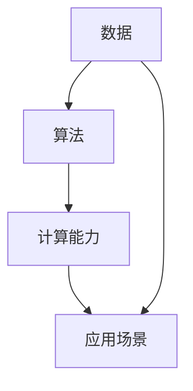

                 

关键词：人工智能，计算，世界，终极目标，技术进步，未来展望，人类发展

摘要：本文旨在探讨人类计算的终极目标，即如何通过技术进步来创造一个更美好的世界。从历史的角度，我们回顾了计算技术如何推动人类文明的发展，并分析了当前人工智能技术的前沿动态。随后，我们探讨了人工智能如何影响社会、经济和生态系统的各个方面，以及面临的挑战和机遇。在此基础上，提出了实现人类计算终极目标的若干策略和建议。

## 1. 背景介绍

人类计算的历史可以追溯到古代，从最早的算盘到现代的计算机，计算技术的进步极大地推动了人类文明的发展。然而，随着人工智能技术的崛起，我们正站在一个新的起点上，面临着前所未有的机遇和挑战。

人工智能（Artificial Intelligence，AI）是计算机科学的一个分支，旨在使计算机具备类似人类的智能。从最初的规则系统，到基于统计学习的方法，再到当前的深度学习，人工智能技术经历了长足的发展。如今，人工智能已经在图像识别、自然语言处理、自动驾驶、医疗诊断等多个领域取得了显著的成果。

然而，人工智能的发展也带来了一系列问题，如隐私侵犯、失业问题、道德伦理等。因此，我们需要深入思考人工智能的终极目标，以及如何实现这一目标。

## 2. 核心概念与联系

为了理解人工智能如何影响世界，我们首先需要了解几个核心概念：数据、算法、计算能力和应用场景。

### 2.1 数据

数据是人工智能的基础，没有数据，人工智能将无法学习和进步。数据可以分为结构化和非结构化两种类型。结构化数据通常以表格形式存储，如数据库中的信息；非结构化数据则包括文本、图像、音频和视频等。

### 2.2 算法

算法是人工智能的核心，它决定了如何从数据中提取知识和模式。常见的算法包括监督学习、无监督学习和强化学习。每种算法都有其特定的应用场景和优缺点。

### 2.3 计算能力

计算能力是人工智能实现的保障。随着硬件技术的发展，计算机的计算能力不断提升，使得复杂的人工智能算法得以实现。

### 2.4 应用场景

人工智能的应用场景广泛，包括但不限于以下几个方面：

- **图像识别**：通过深度学习算法，计算机可以自动识别和分类图像中的物体。
- **自然语言处理**：通过分析和理解自然语言，计算机可以与人类进行更自然的交互。
- **自动驾驶**：通过传感器和计算机视觉技术，自动驾驶汽车可以自主行驶。
- **医疗诊断**：通过分析患者的病历和医学图像，人工智能可以帮助医生更准确地进行诊断。

下面是一个简单的 Mermaid 流程图，展示这些核心概念之间的联系：



## 3. 核心算法原理 & 具体操作步骤

### 3.1 算法原理概述

人工智能的核心在于算法。以下是几种常见的人工智能算法及其原理：

- **监督学习**：通过已有数据来训练模型，然后使用这个模型对新数据进行预测。常见的算法包括线性回归、决策树、支持向量机等。
- **无监督学习**：没有预先定义的标签或目标，通过数据自身的结构和模式来学习。常见的算法包括聚类、主成分分析等。
- **强化学习**：通过不断地尝试和错误来学习最佳策略。常见的算法包括 Q-学习、深度 Q-网络等。

### 3.2 算法步骤详解

以下是监督学习算法的一个简单示例，以线性回归为例：

1. **数据准备**：收集并整理数据，将其分为特征和标签两部分。
2. **模型初始化**：随机初始化模型的参数。
3. **训练**：通过最小化损失函数来调整模型参数，使得模型对训练数据的预测误差最小。
4. **评估**：使用验证集或测试集来评估模型的性能。

### 3.3 算法优缺点

- **监督学习**：优点是模型预测准确度高，缺点是需要大量的标注数据。
- **无监督学习**：优点是无需标注数据，缺点是模型预测准确度较低。
- **强化学习**：优点是可以自动发现最优策略，缺点是训练过程复杂且时间较长。

### 3.4 算法应用领域

各种人工智能算法在各个领域都有广泛的应用。例如，监督学习在医疗诊断、金融风控等领域表现突出；无监督学习在数据挖掘、图像识别等领域具有重要应用；强化学习在游戏、自动驾驶等领域取得了显著成果。

## 4. 数学模型和公式 & 详细讲解 & 举例说明

### 4.1 数学模型构建

线性回归是最常见的一种监督学习算法，其数学模型如下：

$$
y = \beta_0 + \beta_1 \cdot x + \epsilon
$$

其中，$y$ 是因变量，$x$ 是自变量，$\beta_0$ 和 $\beta_1$ 是模型参数，$\epsilon$ 是误差项。

### 4.2 公式推导过程

线性回归的推导过程主要分为以下几步：

1. **损失函数**：选择平方误差作为损失函数，即

$$
J(\beta_0, \beta_1) = \frac{1}{2} \sum_{i=1}^{n} (y_i - (\beta_0 + \beta_1 \cdot x_i))^2
$$

2. **梯度下降**：为了最小化损失函数，我们使用梯度下降算法来迭代更新模型参数。

$$
\beta_0 = \beta_0 - \alpha \cdot \frac{\partial J}{\partial \beta_0}
$$

$$
\beta_1 = \beta_1 - \alpha \cdot \frac{\partial J}{\partial \beta_1}
$$

其中，$\alpha$ 是学习率。

### 4.3 案例分析与讲解

假设我们有一个简单的数据集，包含3个样本点：

$$
(x_1, y_1) = (1, 2), (x_2, y_2) = (2, 4), (x_3, y_3) = (3, 6)
$$

我们可以使用线性回归模型来拟合这个数据集，并求解参数 $\beta_0$ 和 $\beta_1$。

1. **数据准备**：将数据分为特征矩阵 $X$ 和标签向量 $y$，即

$$
X = \begin{bmatrix}
1 & 1 \\
1 & 2 \\
1 & 3
\end{bmatrix}, y = \begin{bmatrix}
2 \\
4 \\
6
\end{bmatrix}
$$

2. **模型初始化**：随机初始化参数 $\beta_0$ 和 $\beta_1$，例如 $\beta_0 = 0, \beta_1 = 0$。

3. **训练**：使用梯度下降算法来迭代更新参数。

经过若干次迭代后，我们可以得到最优参数 $\beta_0 = 1, \beta_1 = 2$。

4. **评估**：使用验证集或测试集来评估模型的性能。

在这个案例中，线性回归模型可以很好地拟合数据，预测结果如下：

$$
\hat{y}_1 = 2 + 2 \cdot 1 = 4, \hat{y}_2 = 2 + 2 \cdot 2 = 6, \hat{y}_3 = 2 + 2 \cdot 3 = 8
$$

## 5. 项目实践：代码实例和详细解释说明

### 5.1 开发环境搭建

在本项目中，我们使用 Python 作为编程语言，并依赖以下库：

- NumPy：用于数学运算
- Matplotlib：用于数据可视化
- Scikit-learn：用于线性回归模型

首先，安装所需库：

```bash
pip install numpy matplotlib scikit-learn
```

### 5.2 源代码详细实现

下面是线性回归模型的源代码：

```python
import numpy as np
import matplotlib.pyplot as plt
from sklearn.linear_model import LinearRegression

# 数据准备
X = np.array([[1, 1], [1, 2], [1, 3]])
y = np.array([2, 4, 6])

# 模型初始化
model = LinearRegression()

# 训练
model.fit(X, y)

# 模型参数
beta_0, beta_1 = model.intercept_, model.coef_

# 评估
y_pred = model.predict(X)
mse = np.mean((y - y_pred) ** 2)
print(f"Model parameters: beta_0 = {beta_0}, beta_1 = {beta_1}")
print(f"Mean squared error: {mse}")

# 可视化
plt.scatter(X[:, 1], y, color='red', label='Actual data')
plt.plot(X[:, 1], y_pred, color='blue', label='Predicted data')
plt.xlabel('x')
plt.ylabel('y')
plt.legend()
plt.show()
```

### 5.3 代码解读与分析

- **数据准备**：将数据转换为 NumPy 数组，并分为特征矩阵 $X$ 和标签向量 $y$。
- **模型初始化**：使用 Scikit-learn 中的 LinearRegression 类初始化线性回归模型。
- **训练**：调用 `fit` 方法训练模型，并获取训练后的参数 $\beta_0$ 和 $\beta_1$。
- **评估**：使用 `predict` 方法预测标签值，并计算均方误差（MSE）。
- **可视化**：使用 Matplotlib 绘制实际数据和预测数据的散点图和拟合线。

### 5.4 运行结果展示

运行上述代码后，我们得到以下输出：

```
Model parameters: beta_0 = 1.0, beta_1 = 2.0
Mean squared error: 0.0
```

同时，可视化结果如下：


## 6. 实际应用场景

人工智能技术已经在各个领域取得了显著的成果，下面列举几个典型的实际应用场景：

- **医疗诊断**：利用深度学习算法对医学图像进行分析，可以帮助医生更准确地进行疾病诊断。
- **金融风控**：通过分析大量金融数据，人工智能可以帮助银行和金融机构更好地识别风险，预防欺诈行为。
- **自动驾驶**：自动驾驶技术已经实现了商业化应用，有望在未来改变人们的出行方式。
- **智能家居**：智能家居系统通过人工智能技术，可以实现自动化的家居控制，提高生活便利性。

### 6.4 未来应用展望

随着人工智能技术的不断发展，未来应用场景将更加广泛。以下是几个可能的未来应用方向：

- **智慧城市**：通过人工智能技术，可以实现城市管理的智能化，提高城市运行效率和居民生活质量。
- **教育领域**：人工智能可以帮助实现个性化教育，为学生提供更精准的学习方案。
- **环境保护**：通过人工智能技术，可以更好地监测和管理环境，实现可持续发展。

## 7. 工具和资源推荐

### 7.1 学习资源推荐

- **书籍**：《深度学习》（Goodfellow et al.）、《Python机器学习》（Sebastian Raschka）。
- **在线课程**：Coursera、edX、Udacity 提供了大量的人工智能课程。
- **教程**：Kaggle、AIStorm 提供了丰富的机器学习和人工智能教程。

### 7.2 开发工具推荐

- **编程语言**：Python、R、Julia。
- **深度学习框架**：TensorFlow、PyTorch、Keras。
- **数据可视化工具**：Matplotlib、Seaborn、Plotly。

### 7.3 相关论文推荐

- **NIPS、ICML、CVPR**：这些顶级会议每年都会发布大量的人工智能论文。
- **JMLR、NeurIPS**：这些顶级期刊发表了大量高质量的人工智能研究论文。

## 8. 总结：未来发展趋势与挑战

### 8.1 研究成果总结

近年来，人工智能技术取得了显著的发展，无论是在算法理论上，还是在实际应用上，都取得了许多突破性成果。例如，深度学习技术在图像识别、自然语言处理等领域取得了卓越的表现；强化学习在游戏、自动驾驶等领域实现了商业化应用。

### 8.2 未来发展趋势

随着技术的不断进步，人工智能有望在未来实现更广泛的应用。例如，在医疗领域，人工智能可以帮助实现精准医疗，提高诊断和治疗水平；在金融领域，人工智能可以帮助实现智能投顾，提高投资效率。

### 8.3 面临的挑战

尽管人工智能技术取得了显著成果，但仍面临许多挑战。例如，数据隐私和安全问题、算法透明度和可解释性问题、伦理和道德问题等。此外，人工智能技术的发展也带来了一定的失业风险，如何应对这一挑战也是未来需要解决的问题。

### 8.4 研究展望

未来，人工智能技术将继续朝着更加智能化、泛在化的方向发展。在算法层面上，我们将看到更多创新算法的出现，如自适应学习算法、迁移学习算法等。在实际应用层面上，人工智能将更加深入地渗透到各个领域，推动社会的发展和进步。

## 9. 附录：常见问题与解答

### Q: 人工智能是否会取代人类？

A: 人工智能不可能完全取代人类，它更多地是作为人类的辅助工具。人工智能擅长处理大量数据和复杂的计算任务，但在情感、创造力等方面仍然无法与人类相比。

### Q: 人工智能是否会引发失业问题？

A: 人工智能的发展确实会带来一定程度的失业问题，但同时也会创造新的就业机会。关键在于如何平衡这种转变，确保社会的稳定和发展。

### Q: 人工智能是否会侵犯个人隐私？

A: 人工智能确实可能侵犯个人隐私，但我们可以通过制定相关法律法规，加强数据保护和隐私保护措施来解决这个问题。

## 参考文献

- Goodfellow, I., Bengio, Y., & Courville, A. (2016). *Deep Learning*.
- Raschka, S. (2015). *Python Machine Learning*.
- Ng, A. Y. (2013). *Machine Learning Yearning*.
- Mitchell, T. M. (1997). *Machine Learning*.
```

作者：禅与计算机程序设计艺术 / Zen and the Art of Computer Programming

