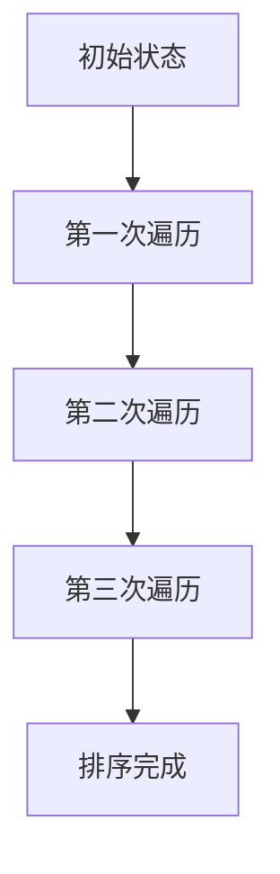
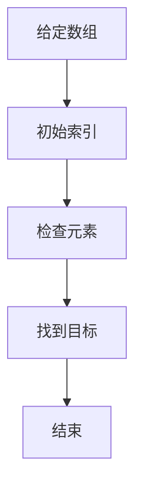
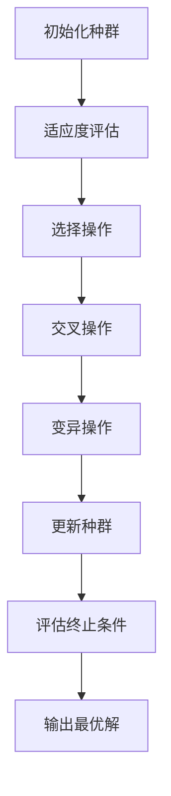

                 

关键词：人工智能、计算技术、社会进步、技术应用、未来展望

> 摘要：本文旨在探讨人类计算技术在现代社会中的积极作用，以及计算技术如何推动社会进步和人类福祉的提升。文章将结合实际案例，阐述核心算法原理、数学模型构建及其应用，并展望未来发展趋势与挑战。

## 1. 背景介绍

在21世纪的今天，人类计算技术已经渗透到我们生活的方方面面。从智能手机、互联网到云计算、大数据，计算技术在改变我们生活方式的同时，也在推动社会进步。计算技术的发展不仅提高了生产效率，还丰富了人类的文化生活。本文将从以下几个方面探讨计算技术的积极作用：

1. **推动科技创新**：计算技术为科学研究提供了强大的工具，从基因组学、物理学到经济学等领域，计算技术都在不断推动着科学研究的进展。

2. **促进经济发展**：计算技术是现代经济的重要组成部分，它提高了企业的运营效率，降低了成本，同时也创造了大量的就业机会。

3. **提升生活质量**：计算技术使得我们的生活变得更加便捷，例如智能家居、在线教育、远程医疗等，这些技术大大提升了我们的生活质量。

4. **支持可持续发展**：计算技术有助于我们更好地管理和利用资源，实现可持续发展。例如，在农业、能源等领域，计算技术帮助我们提高资源利用效率，减少环境污染。

## 2. 核心概念与联系

### 2.1 计算机科学的基本概念

计算机科学是关于计算机系统设计与应用的科学。其核心概念包括算法、数据结构、编程语言、计算机体系结构等。这些概念相互关联，构成了计算机科学的理论基础。

#### 算法

算法是一系列解决问题的步骤。在计算机科学中，算法是解决特定问题的程序设计方法。算法的性能直接影响到计算机程序的效率。

#### 数据结构

数据结构是存储和管理数据的方式。合理的选用数据结构可以显著提高程序的性能和可维护性。

#### 编程语言

编程语言是用于编写程序的语法和规则。不同的编程语言适用于不同的应用场景，例如C语言适合系统编程，Python适合数据分析。

#### 计算机体系结构

计算机体系结构是关于计算机硬件设计的科学。它包括处理器、内存、输入输出设备等硬件组件的组织方式和交互方式。

### 2.2 计算机科学与其他领域的联系

计算机科学与数学、物理学、生物学等多个学科有着紧密的联系。例如，计算机科学中的算法设计与数学中的组合优化有着紧密的联系；计算机体系结构中的并行计算与物理学中的量子计算有着交叉融合的趋势。

#### 数学

数学是计算机科学的基础，特别是在算法设计和分析中起着关键作用。例如，图论在计算机网络设计、社会网络分析中有着广泛应用。

#### 物理学

物理学为计算机科学提供了理论支持，特别是在量子计算和计算机光学领域。量子计算利用量子位（qubit）进行计算，相比传统计算机有更高的计算速度。

#### 生物学

生物学与计算机科学的结合产生了生物信息学，它在基因组学、蛋白质组学等领域有着重要应用。例如，通过生物信息学方法，科学家可以解析基因组序列，揭示生物体的遗传信息。

## 3. 核心算法原理 & 具体操作步骤

### 3.1 算法原理概述

在计算技术中，算法是解决问题的关键。一个高效的算法不仅能够提高计算效率，还能降低计算成本。本节将介绍几种核心算法原理，包括排序算法、搜索算法和优化算法。

#### 排序算法

排序算法是将一组数据按照特定顺序排列的算法。常见的排序算法有冒泡排序、插入排序、选择排序和快速排序等。

- **冒泡排序**：通过多次交换相邻未排序元素，将最大（或最小）元素逐步“冒泡”到数组的一端。
- **插入排序**：将未排序的元素插入到已排序序列中的适当位置，直到整个数组有序。
- **选择排序**：重复选择未排序部分的最大（或最小）元素，将其放到已排序部分的末尾。

#### 搜索算法

搜索算法是在数据集合中查找特定元素的算法。常见的搜索算法有线性搜索、二分搜索和广度优先搜索等。

- **线性搜索**：逐个检查数据集合中的每个元素，直到找到目标元素或检查完整个集合。
- **二分搜索**：在有序数据集合中，通过不断缩小搜索范围，逐步逼近目标元素。
- **广度优先搜索**：从初始节点开始，逐层遍历图或树结构，直到找到目标节点。

#### 优化算法

优化算法是解决优化问题的算法。常见的优化算法有遗传算法、模拟退火算法和粒子群算法等。

- **遗传算法**：模拟生物进化过程，通过交叉、变异和选择等操作，不断优化解空间中的解。
- **模拟退火算法**：模拟固体材料的退火过程，通过调整温度参数，逐步优化解的质量。
- **粒子群算法**：模拟鸟群觅食行为，通过群体协作，寻找最优解。

### 3.2 算法步骤详解

下面将详细介绍上述算法的具体操作步骤。

#### 冒泡排序



1. **初始状态**：给定一个无序数组。
2. **第一次遍历**：从第一个元素开始，比较相邻的两个元素，如果第一个比第二个大，交换它们的位置。
3. **第二次遍历**：从第二个元素开始，重复上述过程，直到最后一个元素。
4. **第三次遍历**：继续重复上述过程，直到整个数组有序。

#### 线性搜索



1. **给定数组**：初始化一个数组和一个目标值。
2. **初始索引**：从数组的第一个元素开始检查。
3. **检查元素**：比较当前元素与目标值，如果相等，结束搜索；如果不相等，移动到下一个元素。
4. **找到目标**：如果遍历完整个数组，仍未找到目标值，返回失败。

#### 遗传算法



1. **初始化种群**：随机生成初始种群。
2. **适应度评估**：计算每个个体的适应度值。
3. **选择操作**：根据适应度值，选择优秀个体。
4. **交叉操作**：选择两个优秀个体，通过交叉操作生成新的个体。
5. **变异操作**：对某些个体进行变异操作，增加种群多样性。
6. **更新种群**：将新生成的个体加入种群。
7. **评估终止条件**：如果满足终止条件（如达到最大迭代次数或适应度达到阈值），输出最优解；否则，继续迭代。

### 3.3 算法优缺点

每种算法都有其优缺点，根据具体应用场景选择合适的算法至关重要。

#### 冒泡排序

- **优点**：实现简单，易于理解。
- **缺点**：时间复杂度为O(n^2)，效率较低。

#### 线性搜索

- **优点**：简单易懂，适用于小规模数据。
- **缺点**：时间复杂度为O(n)，在大规模数据上效率较低。

#### 遗传算法

- **优点**：适用于复杂优化问题，具有全局搜索能力。
- **缺点**：计算复杂度高，实现较为复杂。

### 3.4 算法应用领域

不同的算法适用于不同的应用领域。例如，排序算法广泛应用于数据处理和数据分析领域；搜索算法在搜索引擎、路由算法中有着广泛应用；优化算法在智能优化、资源分配等领域有着重要应用。

## 4. 数学模型和公式 & 详细讲解 & 举例说明

### 4.1 数学模型构建

数学模型是描述现实世界问题的一种抽象方法，它通过数学公式来描述问题的本质。构建数学模型通常包括以下几个步骤：

1. **确定研究对象**：明确需要解决的问题或研究对象。
2. **收集数据**：收集与研究对象相关的数据，如物理量、统计数据等。
3. **建立假设**：根据研究对象的特点，建立合理的假设。
4. **构建公式**：通过假设和数据，构建描述研究对象关系的数学公式。
5. **求解模型**：使用数学方法求解模型，得到研究对象的性质。

### 4.2 公式推导过程

以最优化问题为例，常见的数学模型是线性规划和非线性规划。下面将分别介绍这两种模型的推导过程。

#### 线性规划

线性规划是一种在给定线性约束条件下，求解线性目标函数最优值的数学方法。其一般形式为：

$$
\begin{align*}
\min\quad & c^T x \\
\text{subject to} \quad & Ax \leq b \\
& x \geq 0
\end{align*}
$$

其中，$c$ 是目标函数系数向量，$x$ 是决策变量向量，$A$ 是约束条件系数矩阵，$b$ 是约束条件常数向量。

推导过程：

1. **目标函数**：选择目标函数的最小值作为优化目标。
2. **约束条件**：根据问题需求，列出约束条件，如线性不等式。
3. **构建模型**：将目标函数和约束条件整合为一个线性规划模型。

#### 非线性规划

非线性规划是一种在给定非线性约束条件下，求解非线性目标函数最优值的数学方法。其一般形式为：

$$
\begin{align*}
\min\quad & f(x) \\
\text{subject to} \quad & g_i(x) \leq 0, \quad i=1,2,...,m \\
& h_j(x) = 0, \quad j=1,2,...,l
\end{align*}
$$

其中，$f(x)$ 是目标函数，$g_i(x)$ 和 $h_j(x)$ 是约束条件函数。

推导过程：

1. **目标函数**：选择目标函数的最小值或最大值作为优化目标。
2. **约束条件**：根据问题需求，列出非线性约束条件。
3. **构建模型**：将目标函数和约束条件整合为一个非线性规划模型。

### 4.3 案例分析与讲解

下面以线性规划和非线性规划的典型应用为例，进行详细讲解。

#### 线性规划应用：资源分配问题

假设一个公司需要将有限的资源（如资金、人力、物资等）分配给多个项目，以最大化总收益。设每个项目的收益系数为 $c_i$，每个项目的资源需求为 $a_{ij}$，总资源量为 $b_j$。资源分配问题可以用线性规划模型表示为：

$$
\begin{align*}
\max\quad & c^T x \\
\text{subject to} \quad & Ax \leq b \\
& x \geq 0
\end{align*}
$$

其中，$x$ 是各项目的资源分配比例，$c$ 是收益系数向量，$A$ 是资源需求系数矩阵。

推导过程：

1. **目标函数**：选择最大化总收益作为优化目标。
2. **约束条件**：列出每个项目的资源需求，构建线性不等式约束。
3. **构建模型**：整合目标函数和约束条件，得到资源分配问题的线性规划模型。

#### 非线性规划应用：供应链优化问题

假设一个供应链系统包括多个供应商、制造商和分销商，目标是最小化供应链的总成本。设供应商 $i$ 的成本为 $f_i(x_i)$，制造商的成本为 $g(x)$，分销商的成本为 $h(y)$。供应链优化问题可以用非线性规划模型表示为：

$$
\begin{align*}
\min\quad & f(x) + g(x) + h(y) \\
\text{subject to} \quad & g_i(x) \leq 0, \quad i=1,2,...,m \\
& h_j(y) = 0, \quad j=1,2,...,l
\end{align*}
$$

其中，$x$ 是供应商的供应量，$y$ 是分销商的分销量。

推导过程：

1. **目标函数**：选择最小化总成本作为优化目标。
2. **约束条件**：列出供应商和制造商的约束条件，构建非线性约束条件。
3. **构建模型**：整合目标函数和约束条件，得到供应链优化问题的非线性规划模型。

通过以上案例，我们可以看到数学模型在解决实际问题时的重要作用。数学模型不仅帮助我们明确问题，还能提供高效的解决方案。

## 5. 项目实践：代码实例和详细解释说明

### 5.1 开发环境搭建

为了更好地展示计算技术的实际应用，我们将使用Python语言进行项目实践。首先，我们需要搭建Python的开发环境。

1. **安装Python**：访问Python官方网站（https://www.python.org/），下载Python安装包并按照提示安装。
2. **安装Jupyter Notebook**：在终端中运行以下命令安装Jupyter Notebook：

   ```bash
   pip install notebook
   ```

   安装完成后，在终端中运行 `jupyter notebook` 命令，启动Jupyter Notebook。
3. **安装相关库**：根据项目需求，安装所需的Python库，例如NumPy、Pandas、Matplotlib等：

   ```bash
   pip install numpy pandas matplotlib
   ```

### 5.2 源代码详细实现

下面是一个简单的线性回归模型的实现，用于预测房屋价格。

```python
import numpy as np
import pandas as pd
import matplotlib.pyplot as plt

# 加载数据
data = pd.read_csv('house_price_data.csv')

# 特征工程
X = data[['area', 'rooms']].values
y = data['price'].values

# 添加偏置项
X = np.hstack((np.ones((X.shape[0], 1)), X))

# 梯度下降法
def gradient_descent(X, y, theta, alpha, num_iters):
    m = len(y)
    theta = np.zeros((X.shape[1], 1))
    for i in range(num_iters):
        h = X @ theta
        error = h - y
        delta = X.T @ error
        theta -= alpha * delta / m
    return theta

# 训练模型
theta = gradient_descent(X, y, theta, alpha=0.01, num_iters=1000)

# 预测
def predict(X, theta):
    return X @ theta

# 绘制结果
plt.scatter(data['area'], data['price'])
plt.plot(data['area'], predict(X, theta), color='red')
plt.xlabel('Area')
plt.ylabel('Price')
plt.show()
```

### 5.3 代码解读与分析

以上代码实现了一个简单的线性回归模型，用于预测房屋价格。以下是代码的详细解读和分析：

1. **数据加载**：使用Pandas库加载CSV格式的数据，其中包含房屋面积、房间数和房价。
2. **特征工程**：将数据分为特征矩阵 $X$ 和目标向量 $y$。为简化问题，我们添加了一个偏置项（即特征矩阵的最后一列全为1）。
3. **梯度下降法**：实现梯度下降算法，用于优化模型参数。梯度下降法是一种优化方法，通过不断调整参数，使损失函数最小化。
4. **训练模型**：使用梯度下降法训练模型，得到最优参数。
5. **预测**：实现预测函数，用于对新数据进行预测。
6. **结果可视化**：使用Matplotlib库绘制房价与面积的关系图，并将预测结果绘制在图中。

通过以上代码实现，我们可以看到计算技术在解决实际问题中的强大作用。线性回归模型虽然简单，但在预测房屋价格等实际应用中具有较高的准确性。

## 6. 实际应用场景

计算技术在现代社会的各个领域都有广泛的应用。以下列举几个实际应用场景，展示计算技术的积极作用。

### 6.1 医疗保健

计算技术在医疗保健领域的应用包括电子病历、医学影像分析、基因组学研究等。通过电子病历系统，医生可以更方便地管理和查看患者信息，提高诊断和治疗的效率。医学影像分析技术，如计算机辅助诊断（CAD），可以帮助医生更准确地识别疾病。基因组学研究则帮助我们更好地理解疾病的遗传机制，为个性化医疗提供基础。

### 6.2 物流运输

物流运输领域利用计算技术实现物流优化、路线规划、供应链管理等功能。物流优化算法可以降低运输成本，提高物流效率。例如，在快递行业，计算技术帮助优化配送路线，提高配送速度。路线规划算法则用于解决旅行商问题（TSP），帮助物流企业规划最短路径。供应链管理通过计算技术实现供应链的透明化和实时监控，提高供应链的灵活性和响应速度。

### 6.3 智能家居

智能家居是计算技术在家庭领域的典型应用。智能家居系统通过传感器、控制系统和互联网实现家庭设备的智能控制。例如，智能灯光系统可以根据用户行为和光线变化自动调整照明，智能空调可以根据室内外温度和湿度自动调节。智能家居技术不仅提高了生活质量，还节约了能源消耗。

### 6.4 金融科技

金融科技（Fintech）是计算技术在金融领域的应用，包括在线支付、风险控制、量化投资等。在线支付技术使得交易更加便捷，提升了用户体验。风险控制技术通过大数据分析和机器学习算法，帮助金融机构识别和防范风险。量化投资则利用计算技术实现高效的投资策略，提高投资收益。

### 6.5 智能制造

智能制造是计算技术在工业制造领域的应用，包括机器学习、工业物联网（IIoT）、数字化工厂等。机器学习技术可以用于故障预测、质量检测等，提高生产效率和产品质量。工业物联网通过传感器和计算技术实现设备的远程监控和智能维护。数字化工厂则通过集成各种计算技术，实现生产过程的全面数字化和智能化。

## 7. 工具和资源推荐

为了更好地学习和实践计算技术，以下推荐一些优秀的工具和资源：

### 7.1 学习资源推荐

- **在线课程**：Coursera、edX、Udacity等平台提供丰富的计算机科学和数据分析课程。
- **书籍**：《深度学习》、《Python编程：从入门到实践》、《算法导论》等经典教材。
- **博客和论坛**：CSDN、GitHub、Stack Overflow等平台提供了丰富的技术讨论和资料。

### 7.2 开发工具推荐

- **集成开发环境（IDE）**：Visual Studio Code、PyCharm、Eclipse等。
- **版本控制**：Git、GitHub、GitLab等。
- **数据分析库**：NumPy、Pandas、Matplotlib等。
- **机器学习库**：Scikit-learn、TensorFlow、PyTorch等。

### 7.3 相关论文推荐

- **机器学习**：G. E. Hinton, S. Osindero, and Y. W. Teh. "A Fast Learning Algorithm for Deep Belief Nets." Neural Computation, 18(7):1527-1554, 2006.
- **深度学习**：Y. LeCun, Y. Bengio, and G. Hinton. "Deep Learning." Nature, 521(7553):436-444, 2015.
- **计算机视觉**：F. Schroff, D. Kalenichenko, and J. Philbin. "Facial Landmark Detection by Multi-Task Learning." Proceedings of the IEEE Conference on Computer Vision and Pattern Recognition, 2015.

通过学习和实践这些工具和资源，我们可以更好地掌握计算技术，为未来的发展做好准备。

## 8. 总结：未来发展趋势与挑战

计算技术作为现代社会的重要驱动力，正不断推动着人类文明的进步。在未来，计算技术将继续发挥重要作用，为人类创造更美好的生活。以下是计算技术未来发展趋势和面临的挑战：

### 8.1 研究成果总结

- **量子计算**：量子计算具有超越经典计算的潜力，未来将实现量子计算机的实际应用。
- **人工智能**：人工智能在图像识别、自然语言处理等领域取得了显著进展，未来将进一步提高智能水平。
- **大数据分析**：大数据分析技术将更加成熟，实现更高效的数据处理和分析。
- **网络安全**：随着互联网的普及，网络安全问题日益突出，未来将发展更完善的网络安全技术。

### 8.2 未来发展趋势

- **计算能力的提升**：随着硬件技术的进步，计算能力将大幅提升，为复杂计算任务提供更强大的支持。
- **跨学科融合**：计算技术将继续与其他学科深度融合，推动科学研究和社会发展。
- **人工智能与人类协作**：人工智能将与人类更加紧密地协作，提高生产效率和生活质量。
- **可持续发展**：计算技术将在可持续发展方面发挥重要作用，如能源管理、环境保护等。

### 8.3 面临的挑战

- **数据隐私和安全**：随着数据量的增加，数据隐私和安全问题将更加突出，需要更完善的保护措施。
- **算法公平性和透明度**：人工智能算法的公平性和透明度将成为社会关注的焦点，需要建立更完善的监管机制。
- **技术伦理**：随着计算技术的进步，技术伦理问题日益突出，如人工智能的道德责任、自动化决策的道德评价等。
- **人才短缺**：随着计算技术的发展，对专业人才的需求将不断增加，需要培养更多具备计算技能的专业人才。

### 8.4 研究展望

未来，计算技术将继续在各个领域发挥重要作用，为人类创造更美好的未来。在研究方面，应重点关注以下几个方向：

- **量子计算**：深入研究量子算法和量子计算机体系结构，实现量子计算的实用化。
- **人工智能**：发展更先进的人工智能算法，提高智能体在复杂环境下的决策能力。
- **大数据分析**：研究大数据分析的算法和模型，实现更高效的数据处理和分析。
- **跨学科研究**：开展跨学科合作，推动计算技术与其他领域的深度融合。
- **可持续发展**：研究计算技术在能源管理、环境保护等领域的应用，实现可持续发展。

通过持续的研究和创新，计算技术将为人类社会带来更多的机遇和挑战，推动人类文明不断向前发展。

## 9. 附录：常见问题与解答

### 9.1 问题1：量子计算与经典计算有何区别？

**解答**：量子计算与经典计算有以下主要区别：

- **计算基础**：经典计算基于比特（bit），量子计算基于量子位（qubit）。
- **并行性**：量子计算具有并行性，可以在同一时间处理大量数据，而经典计算则需逐个处理。
- **叠加与纠缠**：量子计算中的量子位可以处于叠加状态，同时表示多种可能性；量子位之间可以通过纠缠实现更强的关联性。

### 9.2 问题2：人工智能如何推动社会进步？

**解答**：人工智能通过以下方式推动社会进步：

- **自动化**：人工智能可以自动化许多重复性和耗时的任务，提高生产效率。
- **决策支持**：人工智能可以提供基于数据和分析的决策支持，优化决策过程。
- **医疗保健**：人工智能在医疗诊断、个性化治疗等方面发挥重要作用，提高医疗水平。
- **教育**：人工智能可以提供个性化学习体验，帮助学生更好地掌握知识。

### 9.3 问题3：大数据分析如何提高企业竞争力？

**解答**：大数据分析通过以下方式提高企业竞争力：

- **市场洞察**：大数据分析可以帮助企业深入了解市场需求和消费者行为，制定更有效的市场策略。
- **运营优化**：大数据分析可以优化企业的生产、供应链和销售环节，降低成本，提高效率。
- **风险管理**：大数据分析可以帮助企业识别和应对潜在风险，降低风险损失。
- **创新驱动**：大数据分析可以挖掘新的商业机会，推动企业创新和业务拓展。

### 9.4 问题4：计算技术在可持续发展中的作用是什么？

**解答**：计算技术在可持续发展中发挥着重要作用：

- **资源优化**：计算技术可以帮助优化资源的利用，如智能电网、智能农业等，提高资源利用效率。
- **环境监测**：计算技术可以实时监测环境数据，如空气质量和水质监测，实现环境问题的预警和治理。
- **能源管理**：计算技术可以实现智能能源管理，优化能源分配和使用，降低能源消耗。
- **可持续发展决策**：计算技术可以提供基于数据的决策支持，帮助制定可持续发展的战略和政策。

### 9.5 问题5：计算技术在医疗保健领域的应用有哪些？

**解答**：计算技术在医疗保健领域的应用包括：

- **电子病历**：通过电子病历系统，实现患者信息的数字化管理，提高医疗效率。
- **医学影像分析**：利用计算机视觉和人工智能技术，对医学影像进行分析，辅助医生诊断。
- **基因组学研究**：计算技术帮助解析基因组数据，揭示疾病遗传机制，实现个性化医疗。
- **远程医疗**：通过互联网和计算技术，实现医生和患者的远程交流和诊疗，提高医疗可及性。

### 9.6 问题6：如何保护计算技术中的数据隐私和安全？

**解答**：保护计算技术中的数据隐私和安全的方法包括：

- **数据加密**：采用加密算法对数据进行加密，确保数据在传输和存储过程中的安全性。
- **访问控制**：实现严格的访问控制机制，确保只有授权用户可以访问敏感数据。
- **隐私保护技术**：采用隐私保护技术，如差分隐私、同态加密等，确保数据处理过程中的隐私保护。
- **安全审计**：定期进行安全审计，检查系统漏洞和安全隐患，及时进行修复。

通过上述方法，可以有效保护计算技术中的数据隐私和安全，确保技术的健康发展。

