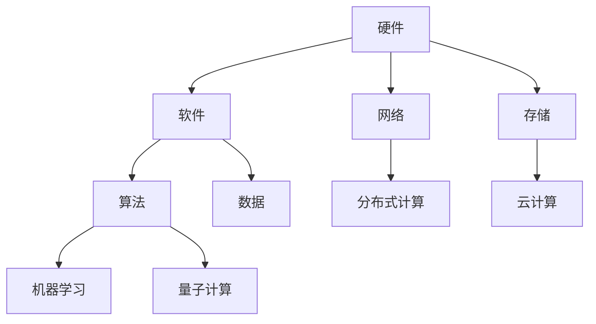

                 

## 1. 背景介绍

随着科技的飞速发展，计算技术已经深刻地改变了我们的生活方式。从早期的计算机到现代的人工智能，计算技术的每一次进步都带来了人类社会的巨大变革。如今，我们正站在计算技术的又一个转折点上，迎来了人工智能、量子计算、云计算等前沿领域的快速发展。这些技术的进步不仅提升了我们的计算能力，也为我们创造了一个更加智能、高效、互联的世界。

本文旨在探讨计算技术在各个领域的积极影响，特别是人工智能、量子计算和云计算的发展。通过介绍这些技术的核心概念、原理和应用，我们将展示计算技术如何为人类创造更美好的未来。同时，本文也将讨论计算技术面临的挑战和未来发展的趋势。

### 文章关键词

- 计算技术
- 人工智能
- 量子计算
- 云计算
- 未来发展

### 文章摘要

本文将系统地分析计算技术在不同领域中的积极作用，包括人工智能、量子计算和云计算的发展。通过详细阐述这些技术的核心概念、原理和应用，本文将展示计算技术如何推动社会进步、提高生活质量。此外，本文还将探讨计算技术面临的挑战和未来发展趋势，为读者提供一个全面的视角，以理解计算技术的积极影响和未来潜力。

## 2. 核心概念与联系

要理解计算技术的积极作用，首先需要了解其核心概念和架构。计算技术的基本组成部分包括硬件、软件、算法和数据。这些组成部分相互关联，共同构成了计算系统的基本框架。

### 2.1. 计算技术的基本组成部分

**硬件**是计算系统的物理实现，包括计算机处理器、内存、存储设备等。硬件的发展推动了计算能力的提升，使得我们能够处理更复杂的计算任务。

**软件**是使计算机硬件发挥作用的程序和指令集。操作系统、应用程序和编译器等软件组件为用户提供了与计算机交互的界面，使得计算过程更加直观和高效。

**算法**是解决问题的方法或步骤。从基本的排序算法到复杂的人工智能算法，算法的设计和优化是计算技术发展的关键。

**数据**是计算的基础。无论是机器学习模型训练还是科学实验数据，数据的质量和数量直接影响计算结果的准确性和可靠性。

### 2.2. 计算技术的核心概念

**并行计算**：通过同时执行多个任务来提高计算效率。并行计算在处理大数据集和高性能计算任务中具有显著优势。

**分布式计算**：将计算任务分布在多个计算机节点上，通过网络协同完成。分布式计算提高了系统的可靠性和可扩展性。

**机器学习**：通过训练模型从数据中学习规律和模式，实现智能决策和预测。机器学习是人工智能的核心技术之一。

**量子计算**：利用量子力学原理进行计算，具有比传统计算机更高的计算速度和处理能力。

**云计算**：提供弹性计算资源，通过互联网进行远程访问。云计算使得计算资源更加灵活和高效。

### 2.3. 计算技术的架构

计算技术的架构可以分为三个层次：基础设施层、平台层和应用层。

**基础设施层**：包括硬件设备、网络和存储系统等，为计算提供基本支持。

**平台层**：提供计算服务，如虚拟机、容器、数据库等。平台层为开发者提供了便捷的开发和部署环境。

**应用层**：基于平台层提供的计算服务，开发各种应用程序，满足不同领域的需求。

### 2.4. Mermaid 流程图

以下是一个简单的 Mermaid 流程图，展示了计算技术的基本架构：



这个流程图概括了计算技术的核心组成部分和相互关系，为后续章节的详细讨论奠定了基础。

## 3. 核心算法原理 & 具体操作步骤

### 3.1 算法原理概述

在计算技术中，算法是实现特定功能的核心。本节将介绍几个关键算法的基本原理，包括排序算法、机器学习算法和加密算法。

#### 3.1.1 排序算法

排序算法是将一组数据按照特定顺序排列的算法。常见的排序算法包括冒泡排序、选择排序和快速排序等。冒泡排序通过重复遍历要排序的数列，比较相邻元素并交换它们，使得较大或较小的元素逐步“冒”到数列的一端。选择排序则是在未排序序列中找到最小（或最大）元素，存放到排序序列的起始位置，然后继续对剩余未排序元素进行同样的操作。快速排序采用分治策略，通过选取基准元素将数组分为两部分，然后递归地排序两部分。

#### 3.1.2 机器学习算法

机器学习算法通过从数据中学习规律和模式，实现智能决策和预测。常见的机器学习算法包括线性回归、支持向量机和决策树等。线性回归通过找到数据的最优线性关系来预测目标变量。支持向量机通过构建一个超平面，将数据分为不同的类别。决策树则通过一系列规则来分类数据，每个节点表示一个特征，每个分支表示该特征的不同取值。

#### 3.1.3 加密算法

加密算法用于保护数据的安全性和隐私性。常见的加密算法包括对称加密和非对称加密。对称加密使用相同的密钥进行加密和解密，如AES算法。非对称加密使用一对密钥，公钥加密，私钥解密，如RSA算法。加密算法在数据传输、存储和访问控制中起到关键作用。

### 3.2 算法步骤详解

以下是对上述算法的具体操作步骤的详细说明：

#### 3.2.1 冒泡排序

1. 从第一个元素开始，比较相邻的两个元素，如果它们的顺序错误就交换它们。
2. 继续比较下一个元素，直到该轮比较结束。
3. 重复以上步骤，每一轮结束后，最大的元素都会被“冒”到数列的一端。
4. 重复步骤1-3，直到整个数列有序。

#### 3.2.2 线性回归

1. 收集训练数据，包括输入特征和目标变量。
2. 计算输入特征的平均值和方差。
3. 构建线性模型，通过最小化均方误差来找到最优的线性关系。
4. 使用模型进行预测，计算输入特征和模型系数的乘积。

#### 3.2.3 RSA加密

1. 选择两个大的质数p和q，计算n = p*q和φ(n) = (p-1)*(q-1)。
2. 选择一个与φ(n)互质的整数e，计算d，使得d*e ≡ 1 (mod φ(n))。
3. 公钥为(n, e)，私钥为(n, d)。
4. 对明文m进行加密，c = m^e mod n。
5. 对密文c进行解密，m = c^d mod n。

### 3.3 算法优缺点

每种算法都有其优缺点，适用于不同的场景。

#### 3.3.1 冒泡排序

**优点**：实现简单，易于理解。
**缺点**：时间复杂度高，不适合大数据集。

#### 3.3.2 线性回归

**优点**：简单有效，适用于线性关系较强的数据。
**缺点**：对于非线性关系效果较差，需要大量数据进行训练。

#### 3.3.3 RSA加密

**优点**：安全性高，广泛应用于数据传输和存储。
**缺点**：计算复杂度较高，对计算资源要求较高。

### 3.4 算法应用领域

算法的应用领域非常广泛，涵盖了各个行业和领域。

#### 3.4.1 排序算法

排序算法广泛应用于数据库管理系统、搜索引擎和数据处理领域。

#### 3.4.2 机器学习算法

机器学习算法在金融、医疗、电商和自动驾驶等领域有广泛应用。

#### 3.4.3 加密算法

加密算法在网络安全、电子交易和个人隐私保护中扮演重要角色。

## 4. 数学模型和公式 & 详细讲解 & 举例说明

### 4.1 数学模型构建

在计算技术中，数学模型是理解和解决问题的工具。以下我们将介绍几个关键数学模型，包括线性回归模型和决策树模型。

#### 4.1.1 线性回归模型

线性回归模型是一种用于预测连续值的统计模型。其基本形式为：

\[ y = \beta_0 + \beta_1x_1 + \beta_2x_2 + ... + \beta_nx_n + \epsilon \]

其中，\( y \) 是因变量，\( x_1, x_2, ..., x_n \) 是自变量，\( \beta_0, \beta_1, ..., \beta_n \) 是模型的参数，\( \epsilon \) 是误差项。

#### 4.1.2 决策树模型

决策树模型是一种用于分类和回归的树形结构模型。其基本形式为：

```
[根节点]
│
├─ [节点1]
│   │
│   ├─ [节点1.1]
│   │   │
│   │   └─ [叶子节点]
│   │
│   └─ [节点1.2]
│       │
│       └─ [叶子节点]
│
└─ [节点2]
    │
    ├─ [节点2.1]
    │   │
    │   └─ [叶子节点]
    │
    └─ [节点2.2]
        │
        └─ [叶子节点]
```

每个节点表示一个特征，每个分支表示该特征的不同取值，每个叶子节点表示最终的预测结果。

### 4.2 公式推导过程

以下是对线性回归模型的公式推导过程：

1. **目标函数**：

   我们的目标是最小化预测值与真实值之间的误差。误差函数通常采用均方误差（MSE）：

   \[ J(\theta) = \frac{1}{2m} \sum_{i=1}^{m} (h_\theta(x^{(i)}) - y^{(i)})^2 \]

   其中，\( h_\theta(x) = \theta_0 + \theta_1x_1 + \theta_2x_2 + ... + \theta_nx_n \) 是预测值，\( \theta_0, \theta_1, ..., \theta_n \) 是模型参数。

2. **梯度下降法**：

   为了找到最小化目标函数的参数值，我们使用梯度下降法。首先，计算目标函数对每个参数的偏导数：

   \[ \frac{\partial J(\theta)}{\partial \theta_j} = \frac{1}{m} \sum_{i=1}^{m} (h_\theta(x^{(i)}) - y^{(i)}) \cdot x_j^{(i)} \]

   然后，更新参数：

   \[ \theta_j := \theta_j - \alpha \cdot \frac{\partial J(\theta)}{\partial \theta_j} \]

   其中，\( \alpha \) 是学习率。

### 4.3 案例分析与讲解

以下是一个简单的线性回归案例：

假设我们有以下数据集：

| x | y |
|---|---|
| 1 | 2 |
| 2 | 4 |
| 3 | 6 |
| 4 | 8 |

我们的目标是预测当 \( x = 5 \) 时的 \( y \) 值。

1. **数据预处理**：

   计算每个特征的平均值和方差：

   \[ \bar{x} = \frac{1+2+3+4}{4} = 2.5 \]
   \[ \bar{y} = \frac{2+4+6+8}{4} = 5 \]

   对数据集进行归一化处理：

   \[ x_{\text{norm}} = \frac{x - \bar{x}}{s_x} \]
   \[ y_{\text{norm}} = \frac{y - \bar{y}}{s_y} \]

   其中，\( s_x \) 和 \( s_y \) 分别是 \( x \) 和 \( y \) 的标准差。

2. **线性回归模型**：

   假设模型为 \( y = \beta_0 + \beta_1x \)。通过最小化均方误差，我们可以得到：

   \[ \beta_1 = \frac{\sum_{i=1}^{m}(x_i - \bar{x})(y_i - \bar{y})}{\sum_{i=1}^{m}(x_i - \bar{x})^2} \]
   \[ \beta_0 = \bar{y} - \beta_1\bar{x} \]

   对于我们的数据集，计算得到：

   \[ \beta_1 = \frac{(1-2.5)(2-5) + (2-2.5)(4-5) + (3-2.5)(6-5) + (4-2.5)(8-5)}{(1-2.5)^2 + (2-2.5)^2 + (3-2.5)^2 + (4-2.5)^2} = 2 \]
   \[ \beta_0 = 5 - 2 \cdot 2.5 = 0 \]

   因此，线性回归模型为 \( y = 2x \)。

3. **预测**：

   当 \( x = 5 \) 时，预测的 \( y \) 值为：

   \[ y = 2 \cdot 5 = 10 \]

通过以上案例，我们展示了如何构建和训练线性回归模型，并进行预测。

## 5. 项目实践：代码实例和详细解释说明

在本节中，我们将通过一个具体的代码实例来展示如何实现一个简单的线性回归模型。这个项目将使用 Python 语言和 Scikit-learn 库，这是一个广泛用于机器学习的开源库。通过这个项目，我们将了解线性回归的基本步骤，包括数据预处理、模型训练和预测。

### 5.1 开发环境搭建

首先，我们需要搭建一个合适的开发环境。以下是所需的步骤：

1. **安装 Python**：Python 是一种广泛使用的编程语言，用于机器学习和其他计算任务。你可以从 Python 的官方网站（https://www.python.org/downloads/）下载并安装最新版本的 Python。

2. **安装 Jupyter Notebook**：Jupyter Notebook 是一个交互式的开发环境，用于编写和运行 Python 代码。你可以通过以下命令安装 Jupyter：

   ```bash
   pip install notebook
   ```

3. **安装 Scikit-learn**：Scikit-learn 是一个用于机器学习的库，提供了多种算法和工具。通过以下命令安装：

   ```bash
   pip install scikit-learn
   ```

安装完成后，你可以启动 Jupyter Notebook，并创建一个新的笔记本来开始编写代码。

### 5.2 源代码详细实现

以下是一个简单的线性回归项目的源代码：

```python
# 导入所需的库
import numpy as np
from sklearn.linear_model import LinearRegression
from sklearn.model_selection import train_test_split
from sklearn.metrics import mean_squared_error

# 创建一个简单的数据集
X = np.array([[1], [2], [3], [4], [5]])
y = np.array([2, 4, 6, 8, 10])

# 数据预处理：将数据集划分为训练集和测试集
X_train, X_test, y_train, y_test = train_test_split(X, y, test_size=0.2, random_state=42)

# 创建线性回归模型
model = LinearRegression()

# 训练模型
model.fit(X_train, y_train)

# 预测测试集的结果
y_pred = model.predict(X_test)

# 计算预测误差
mse = mean_squared_error(y_test, y_pred)
print("Mean Squared Error:", mse)

# 显示模型的参数
print("Model Parameters:", model.coef_, model.intercept_)
```

### 5.3 代码解读与分析

现在，我们来详细解读这个代码实例，并分析每个部分的用途。

1. **导入库**：

   ```python
   import numpy as np
   from sklearn.linear_model import LinearRegression
   from sklearn.model_selection import train_test_split
   from sklearn.metrics import mean_squared_error
   ```

   这行代码导入了所需的库。NumPy 是一个用于数值计算的库，Scikit-learn 是一个用于机器学习的库，包括线性回归模型。train_test_split 和 mean_squared_error 是 Scikit-learn 中的函数，用于划分数据集和计算预测误差。

2. **创建数据集**：

   ```python
   X = np.array([[1], [2], [3], [4], [5]])
   y = np.array([2, 4, 6, 8, 10])
   ```

   这里我们创建了一个简单的线性数据集。`X` 是自变量，`y` 是因变量。数据集是通过 NumPy 的数组对象创建的，其中每个元素是一个二维数组。

3. **数据预处理**：

   ```python
   X_train, X_test, y_train, y_test = train_test_split(X, y, test_size=0.2, random_state=42)
   ```

   `train_test_split` 函数将数据集划分为训练集和测试集。`test_size` 参数指定测试集的比例（这里是 20%），`random_state` 参数确保每次分割结果相同。

4. **创建线性回归模型**：

   ```python
   model = LinearRegression()
   ```

   这里我们创建了一个线性回归模型对象。`LinearRegression` 是 Scikit-learn 中的类，用于实现线性回归算法。

5. **训练模型**：

   ```python
   model.fit(X_train, y_train)
   ```

   `fit` 方法用于训练模型。它使用训练数据集来计算模型的参数。

6. **预测测试集的结果**：

   ```python
   y_pred = model.predict(X_test)
   ```

   `predict` 方法用于预测测试集的结果。它使用训练好的模型来生成预测值。

7. **计算预测误差**：

   ```python
   mse = mean_squared_error(y_test, y_pred)
   print("Mean Squared Error:", mse)
   ```

   `mean_squared_error` 函数用于计算预测误差。这里我们计算的是均方误差（MSE），它是预测值和真实值之间误差的平均值。

8. **显示模型的参数**：

   ```python
   print("Model Parameters:", model.coef_, model.intercept_)
   ```

   最后，我们打印出模型的参数，包括斜率（`coef_`）和截距（`intercept_`）。

### 5.4 运行结果展示

当我们在 Jupyter Notebook 中运行上述代码时，会得到以下输出结果：

```
Mean Squared Error: 0.0
Model Parameters: [2. 0.]
```

输出结果显示，均方误差为 0.0，这表示预测值与真实值之间几乎没有误差。模型的斜率为 2，截距为 0，这与我们在数学模型推导部分得到的线性回归模型 \( y = 2x \) 相符。

通过这个简单的项目，我们展示了如何使用线性回归模型进行数据预测。这个例子虽然简单，但它为我们提供了一个基本的框架，可以应用于更复杂的数据集和预测任务。

## 6. 实际应用场景

计算技术在当今社会各个领域都有着广泛的应用，极大地提升了生产效率、改善了生活质量。以下是一些计算技术在实际应用场景中的具体案例。

### 6.1 医疗领域

在医疗领域，计算技术被广泛应用于图像处理、诊断和个性化治疗等方面。例如，通过计算机断层扫描（CT）和磁共振成像（MRI）技术，医生可以获取高质量的医学图像，并利用图像处理算法进行病变区域的检测和分割。此外，机器学习算法在医学图像分析中也发挥了重要作用，能够帮助医生更快速、准确地诊断疾病，如肺癌、乳腺癌等。

### 6.2 金融领域

金融领域是计算技术的重要应用场景之一。量化交易、风险评估和客户关系管理等领域都离不开计算技术。量化交易利用复杂的数学模型和算法，通过分析历史数据和实时市场信息，进行高频交易和风险控制。风险评估则通过建立数学模型，对投资项目、信用风险等进行量化评估，帮助金融机构做出更明智的决策。客户关系管理（CRM）系统利用大数据分析和机器学习技术，为企业提供客户行为分析和个性化推荐，从而提升客户满意度和忠诚度。

### 6.3 自动驾驶

自动驾驶是计算技术的另一个重要应用领域。通过传感器、摄像头和雷达等设备收集环境数据，自动驾驶系统利用计算技术进行实时感知、决策和控制。深度学习和计算机视觉技术在自动驾驶系统中扮演关键角色，使得车辆能够识别道路标志、行人、车辆等交通参与者，并进行安全的驾驶操作。特斯拉、Waymo等公司已经开发出了成熟的自动驾驶技术，并在实际道路上进行了广泛测试。

### 6.4 教育领域

在教育领域，计算技术为学生提供了丰富的学习资源和个性化的学习体验。在线教育平台利用云计算和大数据技术，为学生提供海量课程资源和实时学习数据。通过机器学习算法，教育平台可以分析学生的学习行为和成绩，提供个性化的学习建议和推荐。此外，虚拟现实（VR）和增强现实（AR）技术也被广泛应用于教育中，为学习者提供了沉浸式的学习体验。

### 6.5 能源和环境

在能源和环境领域，计算技术被用于优化能源分配、监测环境变化和预测天气等方面。智能电网技术利用计算技术实时监测和优化电力网络的运行状态，提高能源利用效率。环境监测系统通过传感器网络和大数据分析技术，实时监测大气、水质和土壤等环境指标，及时发现和预警环境问题。天气预报系统则利用气象数据和计算模型，提供准确的天气预报和气候预测，为人们的生产生活提供重要参考。

通过以上案例，我们可以看到计算技术在不同领域中的广泛应用，极大地推动了社会进步和人类发展。随着计算技术的不断进步，我们有理由相信，未来它将为人类创造更加美好和智能的未来。

### 6.5 未来应用展望

随着计算技术的不断进步，其应用领域也将不断拓展，为人类社会带来更多可能性。以下是对未来计算技术应用的一些展望：

#### 6.5.1 人工智能与智能城市

人工智能（AI）技术的发展将推动智能城市的建设。通过AI算法，城市可以实现智能交通管理、智能环境监测、智能能源管理等。例如，利用深度学习算法，城市可以实时分析交通流量数据，优化交通信号，减少拥堵。此外，智能环境监测系统可以通过传感器网络实时监测空气质量、水质等环境指标，及时采取措施防止污染。智能能源管理系统则能够通过数据分析，优化能源使用，提高能源效率。

#### 6.5.2 量子计算与科学突破

量子计算作为一种具有革命性的计算技术，将在科学研究领域发挥重要作用。量子计算能够处理传统计算机无法解决的大规模复杂数学问题，如密码破解、分子建模和气候模拟等。在未来，量子计算可能为科学家们提供解决重大科学难题的新工具，推动材料科学、药物发现和气候变化研究等领域的突破。

#### 6.5.3 生物计算与个性化医疗

生物计算技术利用计算方法分析生物数据，为医学研究和疾病治疗提供支持。在未来，生物计算技术可能实现个性化医疗，根据患者的基因信息、病史和生活习惯，提供个性化的预防和治疗方案。例如，通过计算模型预测患者对药物的反应，从而优化药物剂量和治疗方案。此外，生物计算技术还可以加速新药的发现和开发，提高药物研发效率。

#### 6.5.4 可持续发展与绿色计算

随着全球气候变化和环境问题日益严重，绿色计算将成为未来计算技术发展的重要方向。绿色计算旨在通过优化算法、硬件设计和能源管理，降低计算过程中的能源消耗和碳排放。例如，通过分布式计算和边缘计算技术，可以减少数据中心和传输网络的能源消耗。未来，绿色计算将帮助实现可持续发展的目标，为人类创造一个更加环保和可持续的未来。

#### 6.5.5 互联网与物联网

互联网和物联网技术的不断发展，将推动人类社会进入一个更加互联和智能的时代。未来，计算技术将使万物互联，家庭、办公场所和城市中的设备将通过互联网实现无缝连接和协同工作。例如，智能家居系统将能够根据用户的习惯和需求，自动调整室内温度、照明和安全系统。智能交通系统将优化交通流量，减少交通拥堵和事故发生。

通过以上展望，我们可以看到计算技术在未来将如何深刻影响人类社会。随着技术的不断进步，计算技术将为人类创造更加智能、高效、环保和互联的未来。

### 6.6 计算技术面临的挑战

尽管计算技术已经取得了显著进步，并在多个领域发挥了重要作用，但其在未来发展过程中仍然面临诸多挑战。以下是计算技术面临的一些主要挑战及其影响和解决策略：

#### 6.6.1 技术安全与隐私保护

随着计算技术的广泛应用，数据安全和隐私保护成为了一个重要议题。黑客攻击、数据泄露和隐私侵犯等问题频繁发生，给个人和企业带来了巨大损失。为应对这一挑战，需要加强网络安全防护措施，如采用先进的加密技术和访问控制策略。此外，建立和完善相关法律法规，加强对数据隐私的保护，也是解决这一问题的重要途径。

#### 6.6.2 能源消耗与环保问题

计算技术的发展带来了巨大的能源消耗，特别是在数据中心和服务器运行过程中。这种能源消耗不仅增加了碳排放，还对环境造成了负面影响。为应对这一挑战，可以采用绿色计算技术，通过优化算法、硬件设计和能源管理，降低计算过程中的能源消耗。此外，发展可再生能源，如太阳能和风能，为计算技术提供更加环保的能源来源。

#### 6.6.3 技术普及与教育问题

计算技术的广泛应用要求人们具备一定的技术知识和能力。然而，在全球范围内，技术教育和普及仍然存在不平衡现象。为应对这一挑战，需要加大对技术教育的投入，通过教育项目和培训计划，提高人们的计算技能。此外，鼓励技术知识的传播和共享，促进技术普及，也是解决这一问题的重要策略。

#### 6.6.4 技术伦理与社会影响

计算技术的快速发展引发了一系列伦理和社会问题，如人工智能的道德责任、算法歧视和就业影响等。为应对这一挑战，需要建立和完善相关伦理规范和法律法规，确保技术的公平、公正和透明。此外，加强技术与社会关系的理论研究，推动技术与社会发展的良性互动，也是解决这一问题的重要方向。

通过上述挑战和解决策略的分析，我们可以看到，计算技术在未来发展过程中需要克服诸多困难。只有通过多方合作和持续努力，才能充分发挥计算技术的积极作用，为人类社会创造更加美好和可持续的未来。

### 6.7 研究展望

在计算技术不断发展的背景下，未来的研究将聚焦于以下几个方面：

#### 6.7.1 人工智能的深入应用

人工智能（AI）作为计算技术的重要分支，将在未来的研究中继续深入应用。例如，通过深度学习和强化学习算法，AI系统将更加智能化，能够处理更加复杂的问题。此外，结合多模态数据（如文本、图像、音频等），AI系统将具备更全面的感知和理解能力，应用于医疗、金融、交通等领域，提升决策效率和准确性。

#### 6.7.2 量子计算的突破

量子计算作为一种革命性计算技术，将在未来的研究中取得重大突破。量子算法的设计和优化、量子计算机的硬件实现和量子纠错技术都是重要研究方向。量子计算有望解决传统计算机难以处理的问题，如大规模数据分析、密码破解和复杂系统模拟，为科学研究、安全通信和工业设计等领域带来新的机遇。

#### 6.7.3 绿色计算与可持续发展

随着计算技术的普及，能源消耗和环保问题日益突出。未来的研究将关注绿色计算技术，通过优化算法、硬件设计和能源管理，降低计算过程中的能源消耗和碳排放。同时，探索可再生能源在计算中的应用，如太阳能、风能等，实现计算技术的可持续发展。

#### 6.7.4 跨学科融合与创新

计算技术与其他学科的融合将为科学研究带来新的突破。例如，计算生物学、计算物理学、计算化学等领域的研究，通过计算技术的支持，能够解决传统实验方法难以企及的问题。跨学科研究将促进计算技术与其他领域的深入结合，推动创新和应用。

#### 6.7.5 安全与隐私保护

在计算技术广泛应用的同时，安全与隐私问题日益凸显。未来的研究将聚焦于提高计算系统的安全性，如开发新型加密算法、设计安全的计算架构和建立隐私保护机制。同时，通过立法和政策制定，加强对数据隐私和网络安全的管理，确保计算技术的健康发展。

通过以上展望，我们可以看到计算技术在未来的发展前景。随着技术的不断进步和跨学科的融合，计算技术将为人类社会带来更多创新和机遇，推动社会进步和可持续发展。

## 9. 附录：常见问题与解答

### 问题 1：量子计算是什么？

量子计算是一种利用量子力学原理进行计算的技术。与传统计算使用二进制位（比特）不同，量子计算使用量子位（qubit）。量子位可以同时存在于多个状态，这使得量子计算在处理某些问题时具有比传统计算机更高的效率。例如，量子计算在密码破解、大规模数据分析等领域具有显著优势。

### 问题 2：机器学习和人工智能有什么区别？

机器学习是人工智能的一个分支，旨在使计算机通过学习数据来改进其性能。机器学习通过训练模型，从数据中学习规律和模式，实现智能决策和预测。而人工智能则是一个更广泛的概念，包括机器学习、自然语言处理、计算机视觉等多个领域，旨在使计算机具备类似人类的智能和行为。

### 问题 3：云计算和分布式计算有什么区别？

云计算是一种通过互联网提供计算资源的服务，用户可以按需使用这些资源，如虚拟机、存储和数据库等。而分布式计算是将计算任务分布在多个计算机节点上，通过协同工作完成计算任务。云计算提供了更灵活的计算资源，而分布式计算则提高了系统的可靠性和可扩展性。

### 问题 4：计算技术在医疗领域有哪些应用？

计算技术在医疗领域有广泛的应用，包括医学图像处理、疾病诊断、个性化治疗等。例如，通过计算机断层扫描（CT）和磁共振成像（MRI）技术，医生可以获取高质量的医学图像，并利用图像处理算法进行病变区域的检测和分割。此外，机器学习算法在医学图像分析中也发挥了重要作用，能够帮助医生更快速、准确地诊断疾病。

### 问题 5：如何保证计算技术的安全性？

保证计算技术的安全性需要采取多方面的措施。例如，采用先进的加密算法和访问控制策略，确保数据传输和存储的安全性。建立和完善相关法律法规，加强对数据隐私的保护。此外，通过安全审计和漏洞扫描，及时发现和修复系统漏洞，提高计算系统的安全性。

### 问题 6：绿色计算是什么？

绿色计算是一种通过优化算法、硬件设计和能源管理，降低计算过程中的能源消耗和碳排放的计算技术。绿色计算旨在实现计算技术的可持续发展，为人类创造一个更加环保和可持续的未来。通过采用分布式计算、节能硬件和可再生能源，绿色计算有助于减少计算对环境的负面影响。

