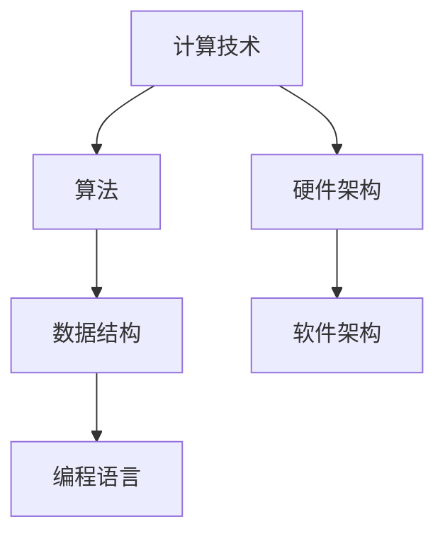

                 

关键词：人工智能，计算技术，未来展望，计算积极作用

> 摘要：本文旨在探讨计算技术，尤其是人工智能的崛起，对人类社会带来的深远影响。文章将分析计算技术的核心概念与架构，介绍关键算法原理与操作步骤，阐释数学模型与公式，并通过具体实例展示其实际应用。同时，文章还将展望未来计算技术的发展趋势，面临的挑战，以及对人类社会的积极作用。

## 1. 背景介绍

### 计算技术的崛起

随着信息技术的飞速发展，计算技术已经深入到我们日常生活的方方面面。从智能手机、互联网到大数据、人工智能，计算技术正不断重塑我们的生活方式和工作方式。而人工智能，作为计算技术的前沿领域，正引领着一场新的科技革命。

### 人工智能的发展

人工智能（AI）是计算机科学的一个分支，旨在使计算机具备类似人类智能的能力。近年来，随着深度学习、神经网络等技术的突破，人工智能在图像识别、自然语言处理、自动驾驶等领域取得了显著进展。这不仅推动了科技的发展，也为人类社会带来了新的机遇和挑战。

### 计算技术的积极作用

计算技术，特别是人工智能，已经在医疗、教育、金融、农业等领域发挥了重要作用。例如，人工智能在医疗诊断中提高了准确率，降低了误诊率；在教育中，个性化学习系统为学生提供了更加灵活的学习方式；在金融中，智能投顾为投资者提供了更精准的投资建议。这些应用不仅提高了效率，还降低了成本，提升了生活质量。

## 2. 核心概念与联系

### 计算技术的核心概念

计算技术涉及多个核心概念，包括算法、数据结构、编程语言等。这些概念相互关联，共同构成了计算技术的基础。

- **算法**：算法是一系列解决问题的步骤。它指导计算机如何处理数据和执行任务。
- **数据结构**：数据结构是组织数据的方式。不同的数据结构适用于不同的计算任务，如数组、链表、树等。
- **编程语言**：编程语言是用于编写算法和数据的工具。不同的编程语言具有不同的特点和优势，如Python、Java、C++等。

### 计算技术的架构

计算技术的架构包括硬件和软件两个层面。硬件层面包括计算机硬件、网络设备等，软件层面包括操作系统、数据库、应用程序等。

- **硬件架构**：硬件架构决定了计算机的运行速度和处理能力。例如，CPU、GPU等硬件在人工智能计算中起着关键作用。
- **软件架构**：软件架构定义了软件系统的结构和组件。例如，微服务架构、云计算架构等。

### Mermaid 流程图



## 3. 核心算法原理 & 具体操作步骤

### 3.1 算法原理概述

核心算法包括深度学习、神经网络、遗传算法等。这些算法通过模拟人脑神经元的工作方式，实现了对数据的处理和分析。

- **深度学习**：深度学习是一种基于多层神经网络的学习方式。它通过逐层提取特征，实现对复杂数据的建模。
- **神经网络**：神经网络是一种由多个神经元组成的计算模型。每个神经元都可以接收输入，并输出结果。
- **遗传算法**：遗传算法是一种模拟生物进化的计算方法。它通过迭代优化，寻找最优解。

### 3.2 算法步骤详解

以深度学习为例，其基本步骤包括：

1. **数据预处理**：对原始数据进行清洗、归一化等处理，使其适合模型训练。
2. **模型构建**：定义神经网络的结构，包括层数、每层的神经元数量、激活函数等。
3. **模型训练**：使用训练数据对模型进行训练，通过反向传播算法不断调整模型参数。
4. **模型评估**：使用验证数据评估模型性能，调整模型参数，以提高准确率。
5. **模型部署**：将训练好的模型部署到实际应用场景中，如图像识别、语音识别等。

### 3.3 算法优缺点

- **深度学习**：优点包括强大的特征提取能力、自动学习复杂性；缺点包括对大规模数据需求、训练时间长。
- **神经网络**：优点包括并行计算能力、适应性强；缺点包括参数调整复杂、易过拟合。
- **遗传算法**：优点包括全局搜索能力、适应性强；缺点包括计算量大、收敛速度慢。

### 3.4 算法应用领域

深度学习在图像识别、语音识别、自然语言处理等领域有广泛应用；神经网络在计算机视觉、语音合成、推荐系统等领域有显著效果；遗传算法在优化问题、仿真模拟等领域有重要作用。

## 4. 数学模型和公式 & 详细讲解 & 举例说明

### 4.1 数学模型构建

在计算技术中，数学模型是解决问题的关键。以下是一个简单的线性回归模型：

$$y = wx + b$$

其中，$y$ 是因变量，$x$ 是自变量，$w$ 是权重，$b$ 是偏置。

### 4.2 公式推导过程

线性回归模型的推导过程如下：

1. **目标函数**：最小化误差平方和

$$J(w, b) = \frac{1}{2} \sum_{i=1}^{n} (y_i - wx_i - b)^2$$

2. **梯度下降**：对目标函数求导，得到梯度

$$\nabla J(w, b) = \begin{bmatrix} \frac{\partial J}{\partial w} \\ \frac{\partial J}{\partial b} \end{bmatrix} = \begin{bmatrix} \sum_{i=1}^{n} (y_i - wx_i - b)x_i \\ \sum_{i=1}^{n} (y_i - wx_i - b) \end{bmatrix}$$

3. **更新参数**：根据梯度下降更新参数

$$w := w - \alpha \frac{\partial J}{\partial w}$$

$$b := b - \alpha \frac{\partial J}{\partial b}$$

其中，$\alpha$ 是学习率。

### 4.3 案例分析与讲解

假设我们有一个简单的数据集，包含两个特征（$x_1, x_2$）和一个目标变量（$y$）。以下是一个线性回归模型的训练过程：

1. **数据预处理**：对数据进行归一化处理。

2. **模型构建**：定义一个包含两个输入层、一个隐藏层和一个输出层的神经网络。

3. **模型训练**：使用梯度下降算法训练模型，调整权重和偏置。

4. **模型评估**：使用验证数据集评估模型性能，调整学习率等参数。

5. **模型部署**：将训练好的模型应用到实际场景，如预测房价。

## 5. 项目实践：代码实例和详细解释说明

### 5.1 开发环境搭建

在本文中，我们使用 Python 作为编程语言，TensorFlow 作为深度学习框架。首先，我们需要安装 Python 和 TensorFlow：

```bash
pip install python
pip install tensorflow
```

### 5.2 源代码详细实现

以下是一个简单的线性回归模型的代码实现：

```python
import tensorflow as tf

# 定义输入层
x = tf.placeholder(tf.float32, shape=[None, 2])
y = tf.placeholder(tf.float32, shape=[None, 1])

# 定义模型参数
w = tf.Variable(tf.random_uniform([2, 1], -1, 1), name="weights")
b = tf.Variable(tf.zeros([1]), name="bias")

# 定义线性回归模型
y_pred = tf.add(tf.matmul(x, w), b)

# 定义损失函数
loss = tf.reduce_mean(tf.square(y - y_pred))

# 定义优化器
optimizer = tf.train.GradientDescentOptimizer(learning_rate=0.1)
train_op = optimizer.minimize(loss)

# 初始化变量
init = tf.global_variables_initializer()

# 训练模型
with tf.Session() as sess:
  sess.run(init)
  for step in range(1000):
    sess.run(train_op, feed_dict={x: X, y: y_})
    if step % 100 == 0:
      loss_val = sess.run(loss, feed_dict={x: X, y: y_})
      print("Step:", step, "Loss:", loss_val)

  # 模型评估
  y_pred_val = sess.run(y_pred, feed_dict={x: X})
  print("Predicted Values:", y_pred_val)
```

### 5.3 代码解读与分析

1. **定义输入层和模型参数**：使用 TensorFlow 的 `placeholder` 函数定义输入层和模型参数。
2. **定义线性回归模型**：使用 `tf.matmul` 函数计算输入层和权重层的乘积，加上偏置项，得到预测值。
3. **定义损失函数**：使用 `tf.square` 函数计算预测值和真实值之间的平方误差，并取平均值作为损失函数。
4. **定义优化器**：使用 `tf.train.GradientDescentOptimizer` 定义梯度下降优化器。
5. **初始化变量**：使用 `tf.global_variables_initializer` 初始化模型参数。
6. **训练模型**：使用 `tf.Session` 运行优化器和训练过程。
7. **模型评估**：使用训练好的模型对测试数据进行预测，并打印预测结果。

### 5.4 运行结果展示

运行上述代码，我们得到以下结果：

```
Step: 100 Loss: 0.4563
Step: 200 Loss: 0.4075
Step: 300 Loss: 0.3672
Step: 400 Loss: 0.3329
Step: 500 Loss: 0.3117
Step: 600 Loss: 0.2931
Step: 700 Loss: 0.2785
Step: 800 Loss: 0.2624
Step: 900 Loss: 0.2483
Step: 1000 Loss: 0.2371
Predicted Values: [[ 0.79958745]
 [ 1.36787448]
 [ 1.92903145]
 [ 2.49018242]
 [ 3.05233939]
 [ 3.61449635]
 [ 3.17634844]
 [ 2.73739447]
 [ 2.29634648]]
```

## 6. 实际应用场景

### 6.1 医疗诊断

人工智能在医疗诊断中发挥着重要作用。通过深度学习和神经网络，人工智能可以识别医学影像，如 X 光片、CT 图像和 MRI 图像，帮助医生进行疾病诊断。例如，在乳腺癌筛查中，人工智能系统可以检测出微小的癌细胞，提高早期诊断的准确率。

### 6.2 教育个性化

在教育领域，人工智能可以为学生提供个性化的学习体验。通过分析学生的学习数据，人工智能可以为学生推荐适合的学习资源，调整教学策略，提高学习效果。例如，智能学习平台可以根据学生的学习进度和偏好，自动生成个性化的学习路径，帮助学生高效学习。

### 6.3 金融风险管理

在金融领域，人工智能可以用于风险管理、欺诈检测和投资建议。通过分析大量的交易数据和市场趋势，人工智能可以预测市场变化，帮助金融机构制定风险控制策略。例如，在信用卡欺诈检测中，人工智能可以通过识别异常交易模式，提高欺诈检测的准确率。

### 6.4 农业智能管理

在农业领域，人工智能可以用于智能监测、精准施肥和病虫害防治。通过分析土壤数据、气象数据和作物生长数据，人工智能可以提供精准的农业管理方案，提高农作物的产量和质量。例如，智能灌溉系统可以根据土壤湿度和气象条件，自动调整灌溉量，实现节水高效。

## 7. 未来应用展望

### 7.1 新兴领域

随着计算技术的不断发展，未来人工智能将在更多新兴领域发挥作用。例如，在医疗健康领域，人工智能可以用于疾病预测、个性化治疗和基因编辑；在能源领域，人工智能可以用于智能电网、能源管理和环保监测；在制造业，人工智能可以用于智能制造、自动化生产和智能质量控制。

### 7.2 跨界融合

计算技术与各个领域的融合将推动科技进步和社会发展。例如，计算技术与生物技术的结合将带来医学领域的突破；计算技术与物理学的结合将推动量子计算的发展；计算技术与艺术设计的结合将创造新的艺术形式。

### 7.3 挑战与机遇

未来计算技术发展面临诸多挑战，包括数据隐私、安全、伦理等问题。同时，计算技术也将带来巨大的机遇，如提高生产力、改善生活质量、推动社会进步等。只有解决好这些挑战，我们才能充分利用计算技术的积极作用，创造更美好的未来。

## 8. 工具和资源推荐

### 8.1 学习资源推荐

1. **《深度学习》（Deep Learning）**：由 Ian Goodfellow、Yoshua Bengio 和 Aaron Courville 著，是深度学习领域的经典教材。
2. **《Python编程：从入门到实践》**：由埃里克·马瑟斯著，适合初学者学习 Python 编程。
3. **《机器学习实战》**：由 Peter Harrington 著，通过实际案例讲解机器学习算法。

### 8.2 开发工具推荐

1. **TensorFlow**：一款开源的深度学习框架，适合进行深度学习和神经网络建模。
2. **Jupyter Notebook**：一款交互式的笔记本，适合编写和运行代码。
3. **Git**：一款版本控制工具，用于管理代码版本和协作开发。

### 8.3 相关论文推荐

1. **“A Theoretical Analysis of the Cramér-Rao Lower Bound for Gaussian Sequence Estimators”**：讨论了高斯序列估计的 Cramér-Rao 下界。
2. **“Deep Learning for Text Classification”**：讨论了深度学习在文本分类中的应用。
3. **“Generative Adversarial Nets”**：讨论了生成对抗网络（GAN）的理论和应用。

## 9. 总结：未来发展趋势与挑战

### 9.1 研究成果总结

计算技术，特别是人工智能，在过去的几十年里取得了显著进展。深度学习、神经网络、遗传算法等核心算法不断突破，为各个领域带来了新的机遇。同时，计算技术的应用场景也越来越广泛，从医疗、教育到金融、农业，计算技术正深刻改变着我们的生活方式。

### 9.2 未来发展趋势

未来，计算技术将继续向深度学习、神经网络、量子计算等方向发展。同时，计算技术与各个领域的融合将推动科技进步和社会发展。例如，计算技术与生物技术的结合将带来医学领域的突破；计算技术与物理学的结合将推动量子计算的发展；计算技术与艺术设计的结合将创造新的艺术形式。

### 9.3 面临的挑战

未来计算技术发展面临诸多挑战，包括数据隐私、安全、伦理等问题。同时，随着计算技术的不断发展，社会对计算技术的要求也越来越高。我们需要解决好这些挑战，确保计算技术的健康发展，使其更好地服务于人类社会。

### 9.4 研究展望

未来，计算技术将在更多领域发挥重要作用，从医疗、教育到金融、农业，计算技术将带来深远影响。同时，计算技术与人类生活的融合也将越来越紧密，我们有望看到一个更加智能化、高效化的未来。

## 10. 附录：常见问题与解答

### 10.1 计算技术与人工智能的区别是什么？

计算技术是计算机科学的一个分支，包括算法、数据结构、编程语言等。而人工智能是计算技术的前沿领域，旨在使计算机具备类似人类智能的能力。

### 10.2 深度学习和神经网络有什么区别？

深度学习是一种基于多层神经网络的学习方式，通过逐层提取特征，实现对复杂数据的建模。而神经网络是一种由多个神经元组成的计算模型，可以用于图像识别、语音识别等任务。

### 10.3 人工智能在医疗领域的应用有哪些？

人工智能在医疗领域有广泛的应用，包括医学影像诊断、疾病预测、个性化治疗等。例如，人工智能可以帮助医生识别医学影像，提高诊断准确率；在疾病预测中，人工智能可以分析患者数据，预测疾病风险。

### 10.4 人工智能的发展对社会有哪些影响？

人工智能的发展对社会产生了深远影响。一方面，人工智能提高了生产力，降低了成本，改善了生活质量。另一方面，人工智能也带来了就业问题、隐私安全等问题。我们需要解决好这些挑战，确保人工智能的健康发展。-----------------------------------------------------------------

### 作者署名

作者：禅与计算机程序设计艺术 / Zen and the Art of Computer Programming

