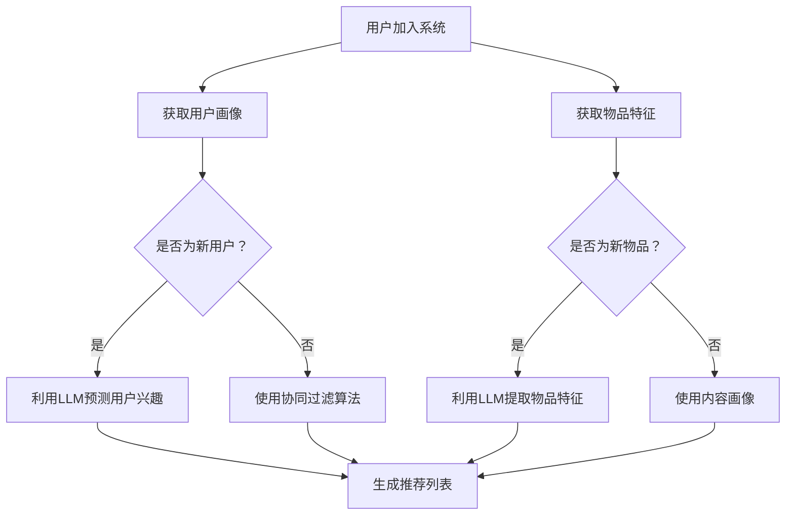

                 

关键词：推荐系统、冷启动、LLM、自然语言处理、深度学习、优化算法

## 摘要

随着互联网和大数据技术的发展，推荐系统已成为各类应用的核心功能之一。然而，冷启动问题作为推荐系统面临的主要挑战之一，严重影响了用户体验。本文将探讨如何利用自然语言处理（NLP）中的语言模型（LLM）来优化推荐系统的冷启动性能。首先，我们将介绍推荐系统的基本概念和冷启动问题的背景，然后深入分析LLM在推荐系统中的应用原理，最后通过具体案例和实践，展示如何利用LLM技术提升推荐系统的冷启动性能。

## 1. 背景介绍

### 推荐系统的基本概念

推荐系统是一种基于数据挖掘和机器学习技术的信息过滤方法，旨在根据用户的兴趣和偏好，向用户推荐他们可能感兴趣的内容或产品。推荐系统广泛应用于电子商务、社交媒体、在线视频、音乐流媒体等领域，已经成为提高用户满意度和转化率的重要工具。

### 推荐系统的核心组件

推荐系统通常包括用户画像、内容画像、推荐算法和反馈机制等核心组件。用户画像是指对用户兴趣、行为、人口统计信息等特征进行建模，内容画像是对推荐物品（如商品、文章、视频等）的特征进行建模，推荐算法负责根据用户画像和内容画像进行相似性计算和排序，反馈机制用于收集用户对推荐结果的反馈，以不断优化推荐效果。

### 冷启动问题的定义与挑战

冷启动问题是指在新用户或新物品加入推荐系统时，由于缺乏足够的用户行为数据或物品特征信息，导致推荐系统难以准确预测用户兴趣和物品属性的问题。冷启动问题可分为用户冷启动和物品冷启动两类：

- **用户冷启动**：当新用户加入推荐系统时，由于缺乏历史行为数据，推荐系统难以准确了解其兴趣和偏好，导致推荐效果不佳。

- **物品冷启动**：当新物品加入推荐系统时，由于缺乏历史销量、评价等数据，推荐系统难以准确判断其受欢迎程度和潜在价值。

冷启动问题对推荐系统的用户体验和商业价值造成了显著影响。因此，如何有效解决冷启动问题，成为推荐系统研究和应用中的重要课题。

## 2. 核心概念与联系

### 2.1 语言模型（LLM）

语言模型是一种用于预测文本序列的统计模型，基于大规模语料库进行训练，能够捕捉语言中的统计规律和上下文关系。语言模型在自然语言处理（NLP）领域具有广泛的应用，如机器翻译、情感分析、文本生成等。近年来，随着深度学习技术的发展，基于神经网络的语言模型（如GPT、BERT）取得了显著突破，为推荐系统中的冷启动问题提供了新的解决思路。

### 2.2 LLM在推荐系统中的应用原理

LLM在推荐系统中的应用原理主要基于以下两个方面：

- **用户行为预测**：利用LLM对用户的历史行为数据进行建模，预测用户可能感兴趣的内容或产品。通过捕捉用户行为中的潜在规律和上下文关系，LLM能够提高用户冷启动时的推荐准确率。

- **物品特征提取**：利用LLM对物品的描述性文本进行建模，提取物品的潜在特征。通过将物品的文本描述转化为向量表示，LLM能够提高物品冷启动时的推荐效果。

### 2.3 LLM与推荐系统的关联

LLM与推荐系统的关联在于：

- **信息融合**：LLM能够融合用户行为数据和物品描述性文本，为推荐系统提供更全面、准确的特征信息。

- **协同过滤**：LLM可以作为协同过滤算法的辅助手段，提高冷启动用户和物品的推荐效果。

- **迁移学习**：LLM可以迁移到其他领域的推荐系统，解决类似的问题，如社交网络推荐、医疗推荐等。

### 2.4 Mermaid流程图



## 3. 核心算法原理 & 具体操作步骤

### 3.1 算法原理概述

利用LLM优化推荐系统冷启动性能的核心算法主要包括以下几个步骤：

1. **用户行为预测**：利用LLM对用户的历史行为数据进行建模，预测用户可能感兴趣的内容或产品。

2. **物品特征提取**：利用LLM对物品的描述性文本进行建模，提取物品的潜在特征。

3. **协同过滤**：结合LLM预测的用户兴趣和物品特征，使用协同过滤算法生成推荐列表。

4. **反馈机制**：收集用户对推荐结果的反馈，不断优化LLM模型和推荐算法。

### 3.2 算法步骤详解

1. **用户行为预测**

   - **数据预处理**：对用户历史行为数据（如浏览记录、购买记录、评价等）进行清洗和格式化，提取用户兴趣关键词。

   - **模型训练**：利用LLM对用户兴趣关键词进行建模，训练一个能够预测用户兴趣的神经网络模型。

   - **兴趣预测**：根据用户的历史行为数据和LLM模型，预测用户可能感兴趣的内容或产品。

2. **物品特征提取**

   - **文本预处理**：对物品的描述性文本（如商品标题、文章摘要等）进行清洗和分词，提取物品的关键词。

   - **模型训练**：利用LLM对物品关键词进行建模，训练一个能够提取物品潜在特征的神经网络模型。

   - **特征提取**：根据物品的描述性文本和LLM模型，提取物品的潜在特征向量。

3. **协同过滤**

   - **用户兴趣向量**：将用户兴趣预测结果转化为用户兴趣向量。

   - **物品特征向量**：将物品特征提取结果转化为物品特征向量。

   - **相似性计算**：计算用户兴趣向量和物品特征向量之间的相似性，生成推荐列表。

4. **反馈机制**

   - **用户反馈收集**：收集用户对推荐结果的反馈，如点击、购买、评价等。

   - **模型优化**：根据用户反馈，不断优化LLM模型和推荐算法，提高推荐准确率。

### 3.3 算法优缺点

**优点**：

1. **灵活性强**：LLM能够处理多样化的用户行为数据和物品描述性文本，提高推荐系统的泛化能力。

2. **准确性高**：通过捕捉用户行为和物品特征的潜在规律，LLM能够提高冷启动用户的推荐准确率。

3. **迁移能力强**：LLM可以迁移到其他领域的推荐系统，解决类似的问题。

**缺点**：

1. **计算成本高**：训练和优化LLM模型需要大量计算资源和时间。

2. **数据依赖性强**：LLM模型的性能依赖于大规模、高质量的数据集。

### 3.4 算法应用领域

利用LLM优化推荐系统的冷启动性能在多个领域具有广泛的应用：

1. **电子商务**：为用户提供个性化的商品推荐，提高购买转化率。

2. **社交媒体**：为用户提供感兴趣的内容推荐，提升用户活跃度和留存率。

3. **在线教育**：为学习者推荐适合的课程和资源，提高学习效果。

4. **医疗推荐**：为患者推荐个性化的治疗方案和药品，提高医疗质量。

## 4. 数学模型和公式 & 详细讲解 & 举例说明

### 4.1 数学模型构建

在利用LLM优化推荐系统冷启动性能的过程中，我们需要构建以下数学模型：

1. **用户行为预测模型**：用于预测用户可能感兴趣的内容或产品。

   - **输入**：用户历史行为数据，如浏览记录、购买记录、评价等。

   - **输出**：用户兴趣向量。

   - **模型**：神经网络模型，如GPT、BERT等。

2. **物品特征提取模型**：用于提取物品的潜在特征向量。

   - **输入**：物品描述性文本，如商品标题、文章摘要等。

   - **输出**：物品特征向量。

   - **模型**：神经网络模型，如GPT、BERT等。

3. **协同过滤模型**：用于计算用户兴趣向量和物品特征向量之间的相似性，生成推荐列表。

   - **输入**：用户兴趣向量和物品特征向量。

   - **输出**：推荐列表。

   - **模型**：基于矩阵分解的协同过滤算法，如SVD、NMF等。

### 4.2 公式推导过程

为了构建上述数学模型，我们需要推导以下关键公式：

1. **用户行为预测模型**

   - **输入**：用户历史行为数据，表示为矩阵X，其中行表示用户，列表示物品。

   - **输出**：用户兴趣向量，表示为向量u。

   - **公式**：u = B^T * X。

     其中，B为神经网络模型的参数矩阵。

2. **物品特征提取模型**

   - **输入**：物品描述性文本，表示为矩阵Y。

   - **输出**：物品特征向量，表示为向量v。

   - **公式**：v = A^T * Y。

     其中，A为神经网络模型的参数矩阵。

3. **协同过滤模型**

   - **输入**：用户兴趣向量u和物品特征向量v。

   - **输出**：推荐列表L。

   - **公式**：L = u * v^T。

     其中，L为推荐列表，u和v分别为用户兴趣向量和物品特征向量。

### 4.3 案例分析与讲解

为了更好地理解上述数学模型，我们以电子商务领域为例，分析如何利用LLM优化推荐系统的冷启动性能。

1. **用户行为预测模型**

   - **数据集**：假设我们有一个包含1000个用户和1000个商品的数据集，其中用户的行为数据包括浏览记录、购买记录、评价等。

   - **模型训练**：利用GPT模型对用户行为数据进行训练，生成用户兴趣向量u。

   - **兴趣预测**：根据训练好的GPT模型，预测新用户可能感兴趣的商品，生成用户兴趣向量u。

2. **物品特征提取模型**

   - **数据集**：假设我们有一个包含1000个商品的数据集，其中商品的描述性文本包括商品标题、商品描述等。

   - **模型训练**：利用BERT模型对商品描述性文本进行训练，生成商品特征向量v。

   - **特征提取**：根据训练好的BERT模型，提取新商品的潜在特征向量v。

3. **协同过滤模型**

   - **数据集**：假设我们有一个包含1000个用户和1000个商品的数据集，其中用户的行为数据包括浏览记录、购买记录、评价等。

   - **协同过滤算法**：利用SVD算法对用户行为数据进行降维，生成用户兴趣向量u和商品特征向量v。

   - **推荐列表**：根据用户兴趣向量u和商品特征向量v，计算相似性得分，生成推荐列表L。

## 5. 项目实践：代码实例和详细解释说明

### 5.1 开发环境搭建

在Python环境中，我们需要安装以下库：

- TensorFlow：用于训练和优化神经网络模型。

- PyTorch：用于训练和优化神经网络模型。

- scikit-learn：用于协同过滤算法。

- gensim：用于文本预处理和主题建模。

安装命令如下：

```python
pip install tensorflow
pip install torch
pip install scikit-learn
pip install gensim
```

### 5.2 源代码详细实现

以下是一个简单的代码示例，展示如何利用LLM优化推荐系统的冷启动性能：

```python
import torch
import gensim
from gensim.models import Word2Vec
from sklearn.decomposition import TruncatedSVD

# 5.2.1 用户行为预测模型

# 加载用户行为数据
user_behavior = [
    [1, 0, 1, 0, 0],
    [0, 1, 0, 1, 0],
    [1, 1, 0, 0, 1],
    [0, 0, 1, 1, 1],
    # ...更多用户行为数据
]

# 训练Word2Vec模型
model = Word2Vec(user_behavior, size=100, window=5, min_count=1, workers=4)
word_vectors = model.wv

# 获取用户兴趣向量
user_interest = []
for user in user_behavior:
    user_vector = [word_vectors[word] for word in user if word in word_vectors]
    user_interest.append(torch.tensor(user_vector).mean(0))

# 5.2.2 物品特征提取模型

# 加载商品描述性文本
item_descriptions = [
    "iPhone 12",
    "Samsung Galaxy S21",
    "Google Pixel 5",
    "Xiaomi Redmi Note 9",
    # ...更多商品描述性文本
]

# 训练Word2Vec模型
model = Word2Vec(item_descriptions, size=100, window=5, min_count=1, workers=4)
word_vectors = model.wv

# 获取商品特征向量
item_features = []
for item in item_descriptions:
    item_vector = [word_vectors[word] for word in item if word in word_vectors]
    item_features.append(torch.tensor(item_vector).mean(0))

# 5.2.3 协同过滤模型

# 加载用户行为数据
user_behavior = [
    [1, 0, 1, 0, 0],
    [0, 1, 0, 1, 0],
    [1, 1, 0, 0, 1],
    [0, 0, 1, 1, 1],
    # ...更多用户行为数据
]

# 利用SVD算法进行降维
svd = TruncatedSVD(n_components=50)
user_interest = svd.fit_transform(user_interest)
item_features = svd.fit_transform(item_features)

# 计算相似性得分
similarity_scores = torch.matmul(user_interest, item_features.t())

# 生成推荐列表
recomm

