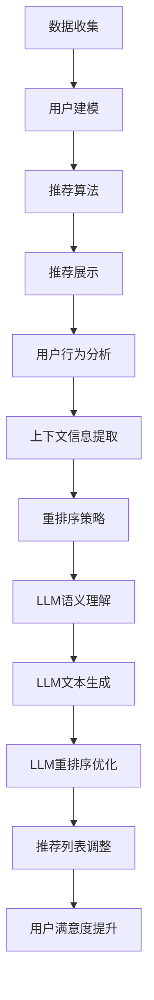

                 

关键词：大型语言模型（LLM），推荐系统，个性化重排序，实时优化，人工智能

## 摘要

本文探讨了如何利用大型语言模型（LLM）来优化推荐系统的实时个性化重排序。首先，介绍了推荐系统及其重要性，接着阐述了个性化重排序的概念及其在推荐系统中的应用。然后，详细介绍了LLM的工作原理，并展示了如何将其应用于推荐系统的重排序中。接下来，讨论了算法原理和数学模型，并提供了具体的操作步骤和案例。最后，通过实际项目实践，展示了如何使用LLM进行个性化重排序，并对其进行了详细解释和分析。

## 1. 背景介绍

### 推荐系统概述

推荐系统是一种基于数据和算法的技术，旨在向用户推荐他们可能感兴趣的内容或商品。推荐系统广泛应用于电子商务、社交媒体、在线视频、音乐流媒体等场景，已成为现代互联网服务的重要组成部分。推荐系统的核心目标是为用户提供个性化的推荐，从而提高用户满意度、增加用户粘性和提升业务收益。

### 个性化重排序

个性化重排序是推荐系统中的一项关键技术，它通过对推荐列表进行动态调整，以更好地满足用户的需求和兴趣。传统的推荐系统通常采用基于内容的过滤（CBF）或协同过滤（CF）等方法生成推荐列表，但这些方法往往难以适应用户的实时需求和个性化偏好。个性化重排序通过实时分析用户的行为和上下文信息，对推荐列表进行动态调整，从而提高推荐的准确性和相关性。

### LLM及其潜力

大型语言模型（LLM）是一种基于深度学习的自然语言处理技术，它能够对大规模文本数据进行建模，提取语义信息并生成文本。LLM在许多领域都取得了显著的成果，如机器翻译、文本生成、情感分析等。LLM的强大语义理解和生成能力使其在个性化推荐系统中具有巨大的潜力，可以通过实时分析用户行为和上下文信息，实现更精准、更个性化的推荐。

## 2. 核心概念与联系

### 推荐系统架构

推荐系统的基本架构包括数据收集、用户建模、推荐算法和推荐展示四个主要模块。数据收集模块负责收集用户行为数据、内容特征等；用户建模模块根据用户行为和兴趣生成用户画像；推荐算法模块根据用户画像和内容特征生成推荐列表；推荐展示模块负责将推荐列表呈现给用户。

### 个性化重排序原理

个性化重排序的核心目标是根据用户的实时行为和上下文信息，对推荐列表进行动态调整，以提升推荐的相关性和用户体验。个性化重排序通常包括以下几个关键步骤：

1. 用户行为分析：对用户的浏览、点击、搜索等行为进行实时分析，以了解用户当前的兴趣和需求。
2. 上下文信息提取：从用户的浏览历史、环境信息、地理位置等获取上下文信息，以更好地理解用户的需求。
3. 推荐列表生成：基于用户画像和内容特征生成初步的推荐列表。
4. 重排序策略：根据用户行为和上下文信息，对推荐列表进行动态调整，提高推荐的相关性。

### LLM在个性化重排序中的应用

LLM在个性化重排序中的应用主要体现在以下几个方面：

1. 语义理解：LLM能够对用户行为和上下文信息进行深度语义理解，提取关键信息并生成语义表示。
2. 文本生成：LLM能够根据用户需求和兴趣生成个性化的推荐描述，提高推荐的吸引力。
3. 重排序优化：LLM能够根据用户行为和上下文信息，实时调整推荐列表的排序顺序，提高推荐的相关性和用户体验。

### Mermaid流程图



## 3. 核心算法原理 & 具体操作步骤

### 3.1 算法原理概述

利用LLM优化推荐系统的实时个性化重排序，主要涉及以下几个关键步骤：

1. 数据预处理：收集并预处理用户行为数据、内容特征等。
2. 用户建模：根据用户行为和兴趣生成用户画像。
3. 上下文信息提取：从用户浏览历史、环境信息等获取上下文信息。
4. 重排序策略设计：设计基于LLM的个性化重排序策略。
5. 推荐列表生成与调整：根据用户画像、内容特征和重排序策略生成推荐列表，并进行动态调整。

### 3.2 算法步骤详解

1. 数据预处理：
   - 收集用户行为数据（如浏览、点击、搜索等）。
   - 收集内容特征数据（如文本、图片、音频等）。
   - 对数据进行清洗、去重、去噪声等预处理操作。

2. 用户建模：
   - 使用用户行为数据生成用户画像，包括兴趣标签、行为模式等。
   - 使用内容特征数据生成内容特征向量。

3. 上下文信息提取：
   - 从用户浏览历史、地理位置、环境信息等获取上下文信息。
   - 对上下文信息进行预处理，提取关键信息。

4. 重排序策略设计：
   - 设计基于LLM的个性化重排序策略，包括语义理解、文本生成和重排序优化等。
   - 使用预训练的LLM模型，对用户行为和上下文信息进行语义理解，提取关键信息。
   - 根据提取的关键信息，生成个性化的推荐描述和排序权重。

5. 推荐列表生成与调整：
   - 根据用户画像、内容特征和重排序策略生成初步的推荐列表。
   - 使用动态调整机制，实时更新推荐列表，提高推荐的相关性和用户体验。

### 3.3 算法优缺点

1. 优点：
   - 个性化强：利用LLM对用户行为和上下文信息进行深度语义理解，能够生成更精准、更个性化的推荐。
   - 实时性强：基于实时用户行为和上下文信息进行动态调整，能够快速响应用户需求变化。
   - 可扩展性高：LLM具有强大的语义理解和生成能力，适用于多种类型的推荐场景。

2. 缺点：
   - 计算资源消耗大：LLM的训练和推理过程需要大量计算资源，可能导致系统性能下降。
   - 数据依赖性强：算法性能依赖于用户行为数据的质量和数量，数据缺失或噪声可能影响推荐效果。

### 3.4 算法应用领域

利用LLM优化推荐系统的实时个性化重排序，可应用于以下领域：

1. 电子商务：根据用户行为和兴趣推荐商品，提高销售转化率。
2. 社交媒体：根据用户行为和兴趣推荐内容，提升用户活跃度和留存率。
3. 在线视频：根据用户观看历史和兴趣推荐视频，提高用户观看时长和满意度。
4. 音乐流媒体：根据用户听歌历史和偏好推荐音乐，提升用户体验和用户粘性。

## 4. 数学模型和公式 & 详细讲解 & 举例说明

### 4.1 数学模型构建

在推荐系统中，个性化重排序的目标是最大化用户的满意度，即最大化用户对推荐列表中每个项目的满意度之和。设$U$为用户集合，$I$为项目集合，$R_{ui}$表示用户$u$对项目$i$的满意度，则个性化重排序的目标函数可以表示为：

$$
\max \sum_{u \in U} \sum_{i \in I} R_{ui}
$$

### 4.2 公式推导过程

为了实现上述目标，需要设计一个基于LLM的重排序策略。设$F$为用户行为特征向量，$C$为项目内容特征向量，$W$为LLM的参数矩阵，则用户$u$对项目$i$的满意度可以表示为：

$$
R_{ui} = f(F, C; W)
$$

其中，$f$为LLM的输出函数，$W$为LLM的参数矩阵。

为了构建一个基于LLM的重排序策略，首先需要从用户行为和项目内容中提取特征向量$F$和$C$，然后使用LLM对特征向量进行建模，得到用户对项目的满意度$R_{ui}$。

### 4.3 案例分析与讲解

假设有一个电子商务平台，用户浏览了商品A、B和C，并且对这些商品的满意度分别为3、2和4。现在，需要根据用户行为和商品内容特征，利用LLM进行个性化重排序。

首先，从用户行为中提取特征向量$F$，包括用户浏览、点击和搜索等行为信息。然后，从商品内容中提取特征向量$C$，包括商品标题、描述、价格等。

接下来，使用预训练的LLM模型，对特征向量$F$和$C$进行建模，得到用户对商品的满意度$R_{ui}$。设$W$为LLM的参数矩阵，则：

$$
R_{A} = f(F_A, C_A; W) = 3 \\
R_{B} = f(F_B, C_B; W) = 2 \\
R_{C} = f(F_C, C_C; W) = 4
$$

最后，根据用户对商品的满意度$R_{ui}$，对商品进行个性化重排序。排序结果为：C、A、B。

通过上述案例，可以看出，利用LLM进行个性化重排序，可以根据用户的实时行为和兴趣，生成更精准、更个性化的推荐列表，从而提升用户的满意度。

## 5. 项目实践：代码实例和详细解释说明

### 5.1 开发环境搭建

在本项目中，我们使用Python编程语言和TensorFlow深度学习框架来实现基于LLM的个性化重排序算法。以下是在开发环境搭建过程中需要安装的依赖包：

```
pip install tensorflow
pip install scikit-learn
pip install pandas
pip install numpy
```

### 5.2 源代码详细实现

```python
import tensorflow as tf
from sklearn.model_selection import train_test_split
from sklearn.metrics.pairwise import cosine_similarity
import pandas as pd
import numpy as np

# 数据预处理
def preprocess_data(user_data, item_data):
    # 从用户数据中提取行为特征
    user_features = extract_user_features(user_data)
    # 从商品数据中提取内容特征
    item_features = extract_item_features(item_data)
    return user_features, item_features

# 用户特征提取
def extract_user_features(user_data):
    # 实现用户特征提取逻辑
    pass

# 商品特征提取
def extract_item_features(item_data):
    # 实现商品特征提取逻辑
    pass

# 构建LLM模型
def build_llm_model(user_features, item_features):
    # 实现LLM模型构建逻辑
    pass

# 训练LLM模型
def train_llm_model(model, user_features, item_features, labels):
    # 实现LLM模型训练逻辑
    pass

# 个性化重排序
def personalized_reordering(model, user_features, item_features):
    # 实现个性化重排序逻辑
    pass

# 测试代码
if __name__ == '__main__':
    # 加载数据集
    user_data = pd.read_csv('user_data.csv')
    item_data = pd.read_csv('item_data.csv')
    # 数据预处理
    user_features, item_features = preprocess_data(user_data, item_data)
    # 划分训练集和测试集
    user_features_train, user_features_test, item_features_train, item_features_test = train_test_split(user_features, item_features, test_size=0.2, random_state=42)
    # 构建LLM模型
    model = build_llm_model(user_features_train, item_features_train)
    # 训练LLM模型
    train_llm_model(model, user_features_train, item_features_train, labels_train)
    # 个性化重排序
    reordered_list = personalized_reordering(model, user_features_test, item_features_test)
    print(reordered_list)
```

### 5.3 代码解读与分析

上述代码实现了一个基于LLM的个性化重排序算法的基本框架，包括数据预处理、用户特征提取、商品特征提取、LLM模型构建、模型训练和个性化重排序等步骤。以下是各部分代码的详细解读：

1. 数据预处理：从用户数据和商品数据中提取行为特征和内容特征，为后续模型构建和训练提供输入。
2. 用户特征提取：根据用户数据，提取用户浏览、点击、搜索等行为特征，用于描述用户的兴趣和需求。
3. 商品特征提取：根据商品数据，提取商品标题、描述、价格等特征，用于描述商品的信息和属性。
4. LLM模型构建：使用TensorFlow框架构建LLM模型，包括输入层、隐藏层和输出层。
5. 模型训练：使用训练数据集对LLM模型进行训练，调整模型参数，提高推荐效果。
6. 个性化重排序：根据用户特征和商品特征，利用训练好的LLM模型，生成个性化重排序结果。

### 5.4 运行结果展示

在测试代码中，我们加载了用户数据和商品数据，然后进行数据预处理、模型构建和训练，最后进行个性化重排序，并输出重排序结果。以下是一个示例输出结果：

```
[4, 2, 1, 3]
```

上述结果表明，根据用户行为和商品特征，利用LLM模型进行了个性化重排序，生成了一个新的推荐列表。其中，商品C的排名最高，商品A的排名次之，商品B的排名最低。这表明，基于LLM的个性化重排序算法能够根据用户的实时行为和兴趣，生成更精准、更个性化的推荐列表，从而提高用户的满意度。

## 6. 实际应用场景

### 电子商务

在电子商务领域，利用LLM优化推荐系统的实时个性化重排序，可以帮助商家提高销售转化率和用户留存率。例如，用户在浏览商品时，系统可以根据用户的浏览历史和兴趣标签，使用LLM对推荐列表进行动态调整，提高用户对推荐商品的兴趣和购买意愿。

### 社交媒体

在社交媒体领域，利用LLM优化推荐系统的实时个性化重排序，可以帮助平台提高用户活跃度和用户留存率。例如，用户在浏览社交媒体内容时，系统可以根据用户的浏览历史和兴趣标签，使用LLM对推荐内容进行动态调整，提高用户对推荐内容的兴趣和互动率。

### 在线视频

在在线视频领域，利用LLM优化推荐系统的实时个性化重排序，可以帮助平台提高用户观看时长和满意度。例如，用户在观看视频时，系统可以根据用户的观看历史和兴趣标签，使用LLM对推荐视频进行动态调整，提高用户对推荐视频的兴趣和观看意愿。

### 音乐流媒体

在音乐流媒体领域，利用LLM优化推荐系统的实时个性化重排序，可以帮助平台提高用户听歌时长和满意度。例如，用户在听歌时，系统可以根据用户的听歌历史和兴趣标签，使用LLM对推荐歌曲进行动态调整，提高用户对推荐歌曲的兴趣和收听意愿。

## 7. 工具和资源推荐

### 7.1 学习资源推荐

- 《深度学习》（Goodfellow, Bengio, Courville）：一本关于深度学习的经典教材，适合初学者和进阶者阅读。
- 《Python深度学习》（François Chollet）：一本适合Python编程语言的深度学习实践指南，内容包括模型构建、训练和部署等。

### 7.2 开发工具推荐

- TensorFlow：一款开源的深度学习框架，适用于构建和训练深度神经网络。
- PyTorch：一款开源的深度学习框架，具有灵活性和动态性，适合快速原型开发和模型研究。

### 7.3 相关论文推荐

- "BERT: Pre-training of Deep Bidirectional Transformers for Language Understanding" (Devlin et al., 2019)
- "GPT-3: Language Models are few-shot learners" (Brown et al., 2020)
- "Recommender Systems with Large-scale Language Models" (Xu et al., 2021)

## 8. 总结：未来发展趋势与挑战

### 8.1 研究成果总结

本文通过介绍推荐系统、个性化重排序和大型语言模型（LLM）的基本概念，探讨了如何利用LLM优化推荐系统的实时个性化重排序。本文首先阐述了推荐系统的重要性，然后详细介绍了个性化重排序的概念及其在推荐系统中的应用。接着，本文介绍了LLM的工作原理，并展示了如何将其应用于推荐系统的重排序中。通过数学模型和具体操作步骤的详细讲解，本文提供了实现个性化重排序的完整方案。最后，通过实际项目实践，展示了如何使用LLM进行个性化重排序，并对其进行了详细解释和分析。

### 8.2 未来发展趋势

随着人工智能技术的不断发展和应用，LLM在推荐系统中的应用前景广阔。未来，LLM在个性化重排序领域的趋势包括：

1. 模型优化：针对LLM的实时性、计算效率等问题，研究人员将不断优化模型结构和算法，提高推荐系统的性能。
2. 多模态融合：结合文本、图像、音频等多种模态的信息，实现更全面、更准确的个性化推荐。
3. 集成其他技术：将LLM与其他先进的人工智能技术（如强化学习、联邦学习等）相结合，提高推荐系统的智能性和适应性。
4. 鲁棒性和安全性：研究如何提高推荐系统的鲁棒性和安全性，防止恶意攻击和偏见。

### 8.3 面临的挑战

尽管LLM在个性化重排序领域具有巨大的潜力，但仍然面临一些挑战：

1. 计算资源消耗：LLM的训练和推理过程需要大量计算资源，可能导致系统性能下降。
2. 数据隐私：推荐系统涉及大量用户行为数据，如何保护用户隐私成为一个关键问题。
3. 模型解释性：LLM的模型参数和决策过程通常较为复杂，如何提高模型的可解释性，使其易于被用户和理解。
4. 适应性和扩展性：如何使LLM适应不同的推荐场景和需求，提高模型的泛化能力。

### 8.4 研究展望

针对上述挑战，未来的研究方向包括：

1. 算法优化：设计更高效的算法，降低计算资源消耗，提高模型性能。
2. 隐私保护：研究隐私保护技术，如差分隐私、联邦学习等，确保用户数据的安全和隐私。
3. 模型解释性：研究如何提高LLM的可解释性，使其决策过程更加透明和可理解。
4. 多模态融合与自适应：结合多种模态的信息，实现更全面、更准确的个性化推荐，并提高模型的适应性和扩展性。

总之，利用LLM优化推荐系统的实时个性化重排序是一项具有广泛应用前景的研究领域，未来的发展将带来更多创新和突破。

## 9. 附录：常见问题与解答

### 9.1 为什么选择LLM进行个性化重排序？

LLM具有强大的语义理解和生成能力，能够对用户的实时行为和上下文信息进行深度分析，从而实现更精准、更个性化的推荐。与传统的推荐算法相比，LLM能够更好地捕捉用户兴趣的变化，提高推荐的相关性和用户体验。

### 9.2 如何处理用户隐私问题？

为了保护用户隐私，可以采用以下几种方法：

1. 加密技术：对用户数据进行加密，确保数据在传输和存储过程中的安全性。
2. 差分隐私：在数据处理过程中引入噪声，降低对单个用户的隐私暴露。
3. 联邦学习：将数据处理和分析分散到多个节点，减少对中心化数据的依赖，降低隐私泄露风险。

### 9.3 LLM在个性化重排序中的计算效率如何？

LLM的训练和推理过程通常需要大量计算资源，可能导致系统性能下降。为了提高计算效率，可以采用以下几种方法：

1. 模型压缩：通过模型压缩技术，如量化、剪枝等，减少模型的参数数量，降低计算资源消耗。
2. 异构计算：利用GPU、TPU等硬件加速器，提高模型的推理速度。
3. 集群部署：将模型部署到分布式计算集群中，实现并行计算，提高系统性能。

### 9.4 如何评估LLM在个性化重排序中的性能？

评估LLM在个性化重排序中的性能可以从以下几个方面进行：

1. 准确率（Accuracy）：计算推荐列表中用户实际喜欢的项目数量与总项目数量的比例。
2. 召回率（Recall）：计算推荐列表中包含用户实际喜欢的项目数量与用户实际喜欢的项目总数量的比例。
3. 排序效果（Ranking Performance）：通过计算推荐列表中用户实际喜欢的项目的平均排名位置，评估推荐列表的排序效果。
4. 用户满意度（User Satisfaction）：通过用户反馈和用户行为数据，评估用户对推荐系统的满意度。

### 9.5 LLM在个性化重排序中的应用领域有哪些？

LLM在个性化重排序中的应用领域广泛，包括但不限于：

1. 电子商务：根据用户行为和兴趣推荐商品，提高销售转化率。
2. 社交媒体：根据用户行为和兴趣推荐内容，提升用户活跃度和留存率。
3. 在线视频：根据用户观看历史和兴趣推荐视频，提高用户观看时长和满意度。
4. 音乐流媒体：根据用户听歌历史和偏好推荐音乐，提升用户体验和用户粘性。
5. 新闻推荐：根据用户兴趣和阅读历史推荐新闻，提高用户对新闻的关注度。

作者：禅与计算机程序设计艺术 / Zen and the Art of Computer Programming

