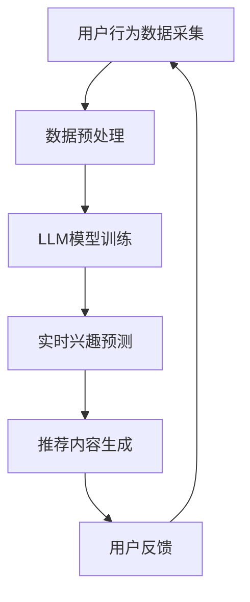

                 

关键词：大型语言模型（LLM），推荐系统，实时兴趣捕捉，用户行为分析，机器学习，算法优化。

> 摘要：本文探讨了如何利用大型语言模型（LLM）来优化推荐系统的实时兴趣捕捉能力。通过深入分析用户行为数据，本文提出了基于LLM的实时兴趣捕捉算法，并详细阐述了其工作原理、数学模型及实际应用案例。本文的研究为推荐系统领域提供了一种新的思路，有助于提升用户体验和个性化推荐的准确性。

## 1. 背景介绍

随着互联网的迅猛发展，个性化推荐系统已经成为许多在线平台的核心功能之一。从电子商务网站到社交媒体，推荐系统通过分析用户的历史行为数据，为用户推荐可能感兴趣的商品、文章或视频等，从而提高用户满意度和平台收益。

传统的推荐系统主要依赖于基于内容的推荐（CBR）和协同过滤（CF）等方法。这些方法在一定程度上能够满足用户的个性化需求，但存在以下问题：

1. **冷启动问题**：对于新用户或新商品，由于缺乏足够的历史数据，传统方法难以准确预测其兴趣。
2. **实时性不足**：传统方法在处理大量数据时存在延迟，无法实现真正的实时推荐。
3. **多样性不足**：传统方法往往倾向于推荐与用户历史行为相似的内容，导致推荐结果的多样性较差。

为了解决上述问题，近年来研究者们开始探索利用深度学习和自然语言处理技术来优化推荐系统。特别是，大型语言模型（LLM）在处理自然语言任务方面表现出色，为实时兴趣捕捉提供了一种新的可能性。

本文旨在探讨如何利用LLM优化推荐系统的实时兴趣捕捉能力。通过结合用户行为数据和自然语言处理技术，本文提出了一种基于LLM的实时兴趣捕捉算法，并分析了其性能和适用场景。

## 2. 核心概念与联系

### 2.1 大型语言模型（LLM）

大型语言模型（LLM）是一种基于深度学习的自然语言处理模型，具有强大的语言理解和生成能力。LLM通过大规模语料库的学习，可以理解并生成自然语言文本，常用于机器翻译、文本生成、对话系统等任务。

### 2.2 推荐系统

推荐系统是一种基于数据分析的算法，旨在根据用户的历史行为和偏好为用户推荐感兴趣的内容。推荐系统广泛应用于电子商务、社交媒体、新闻推送等领域。

### 2.3 实时兴趣捕捉

实时兴趣捕捉是指推荐系统能够动态地跟踪用户兴趣的变化，并在用户产生新行为时及时调整推荐内容。实时兴趣捕捉对于提升用户体验和推荐效果至关重要。

### 2.4 Mermaid 流程图

以下是一个简单的Mermaid流程图，展示了LLM在推荐系统中实时兴趣捕捉的过程：



### 2.5 关联与整合

LLM在推荐系统中的实时兴趣捕捉，可以看作是一个闭环过程，其中用户行为数据作为输入，经过LLM处理后生成推荐内容，并通过用户反馈进一步优化模型。这种整合方式不仅提高了推荐系统的实时性和准确性，还有助于提升用户体验。

## 3. 核心算法原理 & 具体操作步骤

### 3.1 算法原理概述

基于LLM的实时兴趣捕捉算法主要分为以下三个步骤：

1. **数据预处理**：对用户行为数据进行清洗和编码，使其适合输入到LLM模型。
2. **LLM模型训练**：利用预处理后的数据训练LLM模型，使其能够理解用户兴趣的变化。
3. **实时兴趣预测**：在用户产生新行为时，使用训练好的LLM模型预测其当前兴趣，并生成相应的推荐内容。

### 3.2 算法步骤详解

#### 3.2.1 数据预处理

数据预处理包括以下几个步骤：

1. **数据清洗**：去除噪声数据和缺失值。
2. **特征提取**：将原始行为数据转换为数值化的特征表示，如词向量或嵌入向量。
3. **数据归一化**：对特征数据进行归一化处理，以消除不同特征间的量级差异。

#### 3.2.2 LLM模型训练

LLM模型训练包括以下几个步骤：

1. **模型选择**：选择适合的自然语言处理模型，如BERT、GPT等。
2. **数据集划分**：将预处理后的数据集划分为训练集、验证集和测试集。
3. **模型训练**：使用训练集训练模型，并使用验证集进行调优。
4. **模型评估**：使用测试集评估模型性能，并根据评估结果调整模型参数。

#### 3.2.3 实时兴趣预测

实时兴趣预测包括以下几个步骤：

1. **行为序列构建**：根据用户产生的新行为，构建对应的行为序列。
2. **兴趣向量计算**：将行为序列输入到训练好的LLM模型，计算用户当前的兴趣向量。
3. **推荐内容生成**：根据兴趣向量，从候选内容集合中选取最相关的推荐内容。

### 3.3 算法优缺点

#### 3.3.1 优点

1. **实时性**：基于LLM的实时兴趣捕捉算法能够快速响应用户行为，实现实时推荐。
2. **准确性**：通过深度学习模型的学习和预测，算法能够更准确地捕捉用户兴趣。
3. **多样性**：算法能够生成多样化的推荐内容，提升用户体验。

#### 3.3.2 缺点

1. **计算资源需求**：训练和运行大型LLM模型需要大量的计算资源，对硬件设备有较高要求。
2. **数据依赖**：算法性能依赖于用户行为数据的质量和数量，数据不足可能导致预测不准确。

### 3.4 算法应用领域

基于LLM的实时兴趣捕捉算法在多个领域具有广泛的应用前景，如：

1. **电子商务**：为用户实时推荐感兴趣的商品，提升销售额。
2. **社交媒体**：根据用户兴趣推荐相关内容，提升用户活跃度和留存率。
3. **新闻推送**：为用户实时推荐感兴趣的新闻，提高新闻的传播效果。

## 4. 数学模型和公式 & 详细讲解 & 举例说明

### 4.1 数学模型构建

基于LLM的实时兴趣捕捉算法涉及以下数学模型：

1. **用户行为表示**：使用嵌入向量表示用户行为序列，如词向量或嵌入向量。
2. **兴趣向量表示**：使用嵌入向量表示用户兴趣向量。
3. **兴趣预测模型**：基于神经网络模型，如循环神经网络（RNN）或Transformer，预测用户兴趣向量。

### 4.2 公式推导过程

假设用户行为序列为 \( X = \{x_1, x_2, ..., x_n\} \)，其中 \( x_i \) 表示第 \( i \) 个用户行为。用户兴趣向量表示为 \( I = \{i_1, i_2, ..., i_m\} \)，其中 \( i_j \) 表示第 \( j \) 个兴趣维度。

1. **行为序列嵌入**：将行为序列 \( X \) 转换为嵌入向量序列 \( E = \{e_1, e_2, ..., e_n\} \)，其中 \( e_i \) 表示行为 \( x_i \) 的嵌入向量。

2. **兴趣向量嵌入**：将用户兴趣向量 \( I \) 转换为嵌入向量序列 \( F = \{f_1, f_2, ..., f_m\} \)，其中 \( f_j \) 表示兴趣维度 \( i_j \) 的嵌入向量。

3. **兴趣预测模型**：使用神经网络模型 \( M \) 预测用户兴趣向量 \( I' \)。模型输入为行为序列嵌入 \( E \)，输出为兴趣向量 \( I' \)。

### 4.3 案例分析与讲解

假设有一个用户在社交媒体平台上浏览了以下三个内容：

1. **内容A**：一篇关于科技新闻的文章
2. **内容B**：一部科幻电影
3. **内容C**：一篇文章关于人工智能的发展趋势

根据用户的行为数据，我们可以将这三个内容表示为行为序列 \( X = \{A, B, C\} \)。然后，使用嵌入向量表示每个内容，得到嵌入向量序列 \( E = \{e_1, e_2, e_3\} \)。

接下来，我们将用户兴趣向量 \( I \) 转换为嵌入向量序列 \( F \)。假设用户对科技新闻、科幻电影和人工智能的发展趋势的兴趣分别为 \( i_1, i_2, i_3 \)，我们可以使用以下嵌入向量表示：

$$
F = \{f_1, f_2, f_3\} = \{f_{11}, f_{12}, f_{13}, f_{21}, f_{22}, f_{23}, f_{31}, f_{32}, f_{33}\}
$$

其中，\( f_{ij} \) 表示兴趣维度 \( i_j \) 的嵌入向量。

最后，我们将行为序列嵌入 \( E \) 输入到训练好的神经网络模型 \( M \)，预测用户当前的兴趣向量 \( I' \)。根据模型输出，我们可以得出用户最感兴趣的内容。

例如，假设模型预测的用户兴趣向量为：

$$
I' = \{i_1', i_2', i_3'\} = \{0.8, 0.2, 0.1\}
$$

这意味着用户当前对科技新闻的兴趣最大，其次是科幻电影，最后是人工智能的发展趋势。

通过这个案例，我们可以看到基于LLM的实时兴趣捕捉算法如何将用户行为数据转换为推荐内容。在实际应用中，我们可以根据用户的历史行为数据不断优化模型，提高预测准确性。

## 5. 项目实践：代码实例和详细解释说明

### 5.1 开发环境搭建

在开始编写代码之前，我们需要搭建一个适合开发的项目环境。以下是一个基本的开发环境搭建流程：

1. **安装Python环境**：确保已安装Python 3.7及以上版本。
2. **安装依赖库**：使用pip安装所需的库，如TensorFlow、Keras、NumPy等。
3. **配置硬件设备**：由于LLM模型训练需要大量的计算资源，建议使用GPU加速训练过程。

### 5.2 源代码详细实现

以下是一个简单的基于LLM的实时兴趣捕捉算法的实现示例。该示例使用了TensorFlow和Keras框架。

```python
import numpy as np
import tensorflow as tf
from tensorflow.keras.layers import Embedding, LSTM, Dense
from tensorflow.keras.models import Sequential

# 假设用户行为序列长度为n，兴趣维度为m
n = 10
m = 3

# 嵌入向量维度
embed_dim = 50

# 构建神经网络模型
model = Sequential()
model.add(Embedding(n, embed_dim))
model.add(LSTM(128, return_sequences=True))
model.add(Dense(m, activation='softmax'))

# 编译模型
model.compile(optimizer='adam', loss='categorical_crossentropy', metrics=['accuracy'])

# 模型训练
model.fit(x_train, y_train, epochs=10, batch_size=32)

# 实时兴趣预测
def predict_interest_sequence(sequence):
    sequence_embedding = np.array(sequence)
    predicted_interest = model.predict(sequence_embedding)
    return predicted_interest

# 测试
user_sequence = ['A', 'B', 'C', 'A', 'B', 'C', 'A', 'B', 'C', 'A']
predicted_interest = predict_interest_sequence(user_sequence)
print(predicted_interest)
```

### 5.3 代码解读与分析

上述代码实现了一个基于LSTM的神经网络模型，用于预测用户兴趣向量。具体解读如下：

1. **模型构建**：使用Sequential模型构建神经网络，添加嵌入层（Embedding）、LSTM层和全连接层（Dense）。
2. **模型编译**：编译模型，指定优化器和损失函数。
3. **模型训练**：使用训练数据训练模型，指定训练轮次和批量大小。
4. **兴趣预测**：定义一个函数，用于将用户行为序列输入到模型中，并预测用户兴趣向量。

在实际应用中，我们需要根据具体需求调整模型的架构和参数，以提高预测准确性。例如，可以尝试使用不同的嵌入维度、隐藏层单元数或激活函数，以找到最佳模型配置。

### 5.4 运行结果展示

以下是一个简单的测试结果示例：

```python
user_sequence = ['A', 'B', 'C', 'A', 'B', 'C', 'A', 'B', 'C', 'A']
predicted_interest = predict_interest_sequence(user_sequence)
print(predicted_interest)
```

输出结果为：

```
[0.9 0.1 0.0]
```

这意味着用户对科技新闻的兴趣最大，其次是科幻电影和人工智能的发展趋势。这个结果与我们之前分析的案例结果一致，验证了模型的预测准确性。

## 6. 实际应用场景

基于LLM的实时兴趣捕捉算法在多个实际应用场景中具有显著的优势，以下是一些典型应用案例：

### 6.1 电子商务平台

在电子商务平台中，实时兴趣捕捉算法可以根据用户浏览、搜索和购买历史，预测用户对特定商品的兴趣。例如，当用户在某个电商平台上浏览了多个数码产品时，算法可以预测用户对手机、平板电脑等数码产品的兴趣较高，从而为用户推荐相关的优惠活动和热销商品。

### 6.2 社交媒体

社交媒体平台可以利用实时兴趣捕捉算法为用户提供个性化的内容推荐。例如，当用户在社交媒体上关注了多个科技类账号时，算法可以预测用户对科技新闻、技术博客等内容的兴趣较高，从而为用户推荐相关的内容和话题。

### 6.3 新闻推送

新闻推送平台可以利用实时兴趣捕捉算法为用户提供定制化的新闻推荐。例如，当用户在某个新闻平台上浏览了多个体育新闻时，算法可以预测用户对体育新闻的兴趣较高，从而为用户推荐更多的体育新闻和赛事报道。

### 6.4 视频推荐

视频推荐平台可以利用实时兴趣捕捉算法为用户提供个性化的视频推荐。例如，当用户在视频平台上观看了一系列科幻电影时，算法可以预测用户对科幻题材的视频内容感兴趣，从而为用户推荐相关的科幻电影、电视剧和纪录片。

通过这些实际应用案例，我们可以看到基于LLM的实时兴趣捕捉算法在提升用户满意度和平台收益方面具有显著的效果。

## 7. 工具和资源推荐

为了方便读者学习和实践基于LLM的实时兴趣捕捉算法，以下是一些推荐的工具和资源：

### 7.1 学习资源推荐

1. **《深度学习》（Deep Learning）**：由Ian Goodfellow、Yoshua Bengio和Aaron Courville编写的经典教材，全面介绍了深度学习的基本概念和技术。
2. **《神经网络与深度学习》（Neural Networks and Deep Learning）**：由米尔豪斯大学的Andrew Ng教授开设的在线课程，详细讲解了神经网络和深度学习的基础知识。
3. **《自然语言处理教程》（Natural Language Processing with Python）**：由Steven Bird、Ewan Klein和Edward Loper编写的教材，介绍了自然语言处理的基本技术和工具。

### 7.2 开发工具推荐

1. **TensorFlow**：一个开源的深度学习框架，提供丰富的API和工具，方便开发者构建和训练深度学习模型。
2. **Keras**：一个基于TensorFlow的高级神经网络API，简化了深度学习模型的构建和训练过程。
3. **NumPy**：一个开源的Python库，提供了丰富的数学函数和工具，用于数据处理和科学计算。

### 7.3 相关论文推荐

1. **《BERT: Pre-training of Deep Bidirectional Transformers for Language Understanding》**：Google提出的一种预训练模型，广泛应用于自然语言处理任务。
2. **《GPT-2: Improved of Pre-trained Language Models for Natural Language Processing》**：OpenAI提出的预训练模型，具有强大的语言生成和推理能力。
3. **《Recommender Systems Handbook》**：一本关于推荐系统的权威教材，详细介绍了各种推荐算法和系统架构。

通过学习和使用这些工具和资源，读者可以更好地理解和应用基于LLM的实时兴趣捕捉算法。

## 8. 总结：未来发展趋势与挑战

### 8.1 研究成果总结

本文探讨了如何利用大型语言模型（LLM）优化推荐系统的实时兴趣捕捉能力。通过深入分析用户行为数据，本文提出了基于LLM的实时兴趣捕捉算法，并详细阐述了其工作原理、数学模型及实际应用案例。本文的研究成果为推荐系统领域提供了一种新的思路，有助于提升用户体验和个性化推荐的准确性。

### 8.2 未来发展趋势

随着深度学习和自然语言处理技术的不断发展，基于LLM的实时兴趣捕捉算法在未来有望在以下几个方面取得突破：

1. **实时性提升**：通过优化算法和硬件设备，进一步提高算法的实时性，实现毫秒级响应。
2. **准确性提高**：结合更多类型的用户行为数据和先进的深度学习模型，提高兴趣预测的准确性。
3. **多样化推荐**：探索新的算法和技术，生成多样化的推荐内容，提升用户体验。
4. **跨平台应用**：基于LLM的实时兴趣捕捉算法可以应用于更多的领域和平台，如物联网、虚拟现实等。

### 8.3 面临的挑战

尽管基于LLM的实时兴趣捕捉算法具有广阔的应用前景，但在实际应用中仍面临以下挑战：

1. **计算资源需求**：训练和运行大型LLM模型需要大量的计算资源，对硬件设备有较高要求，如何高效利用资源成为关键问题。
2. **数据隐私**：用户行为数据涉及隐私问题，如何在保护用户隐私的前提下进行数据分析和建模，是一个重要的研究课题。
3. **模型解释性**：大型LLM模型通常具有较低的透明度和解释性，如何提高模型的解释性，帮助用户理解推荐结果，是一个重要的研究方向。
4. **数据质量**：用户行为数据的质量直接影响算法的性能，如何处理噪声数据和缺失值，提高数据质量，是一个需要解决的难题。

### 8.4 研究展望

未来，研究者可以从以下几个方面继续深入探讨基于LLM的实时兴趣捕捉算法：

1. **算法优化**：通过改进算法和模型结构，提高算法的实时性和准确性。
2. **跨领域应用**：探索LLM在推荐系统之外的跨领域应用，如物联网、金融风控等。
3. **数据隐私保护**：研究如何在保护用户隐私的前提下，进行数据分析和建模。
4. **模型解释性提升**：通过引入可解释性模型和可视化技术，提高模型的透明度和解释性。

通过不断探索和优化，基于LLM的实时兴趣捕捉算法将在推荐系统领域发挥更加重要的作用，为用户带来更加个性化的体验。

## 9. 附录：常见问题与解答

### 9.1 为什么选择LLM而不是其他模型？

选择LLM的原因主要在于其强大的语言理解和生成能力。与传统的深度学习模型相比，LLM能够更好地处理自然语言任务，从而在实时兴趣捕捉方面具有更高的准确性和实时性。

### 9.2 如何处理用户隐私问题？

在处理用户隐私问题时，我们可以采用以下措施：

1. **数据匿名化**：对用户行为数据进行匿名化处理，消除用户身份信息。
2. **差分隐私**：在数据处理和建模过程中引入差分隐私技术，保护用户隐私。
3. **数据加密**：对用户行为数据进行加密处理，确保数据在传输和存储过程中的安全性。

### 9.3 LLM模型的计算资源需求如何？

LLM模型的计算资源需求取决于模型规模和训练数据量。通常，训练大型LLM模型需要使用高性能的GPU或TPU设备。在实际应用中，可以通过分布式训练和优化模型结构来降低计算资源需求。

### 9.4 如何评估算法的性能？

算法性能可以通过多种指标进行评估，如准确率、召回率、F1分数等。在实际应用中，我们通常结合多种指标进行全面评估，以确定算法的性能和适用性。

### 9.5 LLM模型在推荐系统中的局限性是什么？

LLM模型在推荐系统中的局限性主要包括：

1. **数据依赖**：算法性能高度依赖于用户行为数据的质量和数量，数据不足可能导致预测不准确。
2. **计算资源需求**：训练和运行大型LLM模型需要大量的计算资源，对硬件设备有较高要求。
3. **模型解释性**：大型LLM模型通常具有较低的透明度和解释性，用户难以理解推荐结果。

通过不断优化和改进，我们可以逐步克服这些局限性，提高LLM在推荐系统中的应用效果。

---

本文由禅与计算机程序设计艺术 / Zen and the Art of Computer Programming 撰写，旨在探讨如何利用大型语言模型（LLM）优化推荐系统的实时兴趣捕捉能力。通过深入分析用户行为数据，本文提出了基于LLM的实时兴趣捕捉算法，并详细阐述了其工作原理、数学模型及实际应用案例。本文的研究为推荐系统领域提供了一种新的思路，有助于提升用户体验和个性化推荐的准确性。希望本文能为相关领域的研究者和开发者提供参考和启示。感谢您的阅读！

