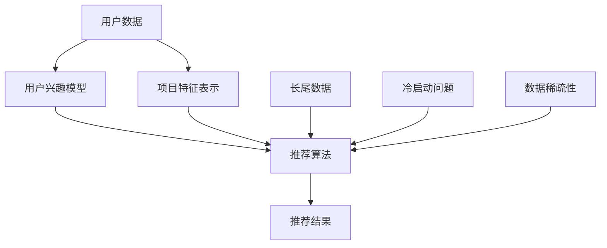

                 

关键词：推荐系统、长尾效应、自然语言处理、生成式预训练模型

## 摘要

本文主要探讨了如何利用生成式预训练模型（LLM，即Large Language Model）来优化推荐系统中的长尾item推荐问题。通过分析LLM在处理大规模文本数据和复杂关系时的优势，以及推荐系统中的长尾效应和常见问题，本文提出了一种结合LLM与推荐系统的混合模型，并详细阐述了其实现方法、优缺点以及应用领域。同时，本文还通过具体的数学模型和公式推导，对模型的性能进行了分析和验证。最后，本文对LLM优化推荐系统的未来应用和发展趋势进行了展望，并对可能面临的挑战提出了相应的对策。

## 1. 背景介绍

### 推荐系统

推荐系统是一种能够根据用户的历史行为和偏好，为用户推荐相关商品、内容或服务的算法和技术。随着互联网的快速发展，推荐系统已经成为电商平台、社交媒体、视频网站等众多领域的核心组成部分。推荐系统的目标是提高用户的满意度和转化率，从而带来更高的商业价值。

然而，传统的推荐系统在处理长尾数据时面临着诸多挑战。长尾效应是指大量非热门但具有潜在价值的商品、内容或服务在总数据中的占比。在长尾数据中，热门项目占据主导地位，而冷门项目则被忽视，导致推荐系统在处理长尾数据时容易出现“二八定律”现象，即80%的推荐结果集中在20%的热门项目中，而剩下的80%长尾项目则难以得到有效曝光。

### 长尾效应

长尾效应是推荐系统中的一个关键问题。长尾效应的存在意味着推荐系统需要处理海量的长尾数据，这些数据往往具有多样性、不确定性和稀疏性等特点。传统的推荐系统在处理长尾数据时，容易受到数据稀疏性和冷启动问题的影响，导致推荐效果不佳。

数据稀疏性是指用户与项目之间的交互数据量较少，导致推荐算法难以捕捉到用户的真实偏好。冷启动问题则是指新用户或新项目在系统中的数据不足，难以进行准确推荐。

### 自然语言处理（NLP）与LLM

自然语言处理是计算机科学和人工智能领域的一个分支，旨在使计算机能够理解、解释和生成人类语言。近年来，随着深度学习和生成式预训练模型的发展，NLP技术取得了显著的突破。生成式预训练模型（如GPT、BERT等）通过对大规模文本数据进行预训练，能够捕捉到语言中的复杂结构和语义关系，从而在许多NLP任务中取得了优异的性能。

LLM作为一种生成式预训练模型，具有强大的文本生成和理解能力。LLM通过学习大量文本数据，能够自动捕捉到文本中的潜在模式和关系，从而在推荐系统中具有广泛的应用前景。

## 2. 核心概念与联系

在本节中，我们将介绍推荐系统中涉及的核心概念，并使用Mermaid流程图展示LLM与推荐系统的架构。

### 核心概念

1. **用户兴趣模型**：用于捕捉用户的行为和偏好，包括用户的历史浏览记录、购买记录、评价等。

2. **项目特征表示**：用于描述项目本身的属性和特征，包括项目类别、标签、评分等。

3. **推荐算法**：用于根据用户兴趣模型和项目特征表示，生成个性化的推荐结果。

4. **长尾效应**：指大量非热门但具有潜在价值的商品、内容或服务在总数据中的占比。

5. **冷启动问题**：指新用户或新项目在系统中的数据不足，难以进行准确推荐。

6. **数据稀疏性**：指用户与项目之间的交互数据量较少，导致推荐算法难以捕捉到用户的真实偏好。

### Mermaid流程图



### LLM与推荐系统的架构

在推荐系统中引入LLM，可以采用以下架构：

1. **数据预处理**：将用户数据和项目特征数据清洗、预处理，并转化为LLM可处理的格式。

2. **预训练**：使用大量文本数据对LLM进行预训练，以学习文本中的潜在模式和关系。

3. **用户兴趣建模**：利用LLM生成用户兴趣模型，捕捉用户的偏好和兴趣。

4. **项目特征嵌入**：将项目特征转化为向量表示，并利用LLM对其进行嵌入。

5. **推荐算法**：结合用户兴趣模型和项目特征表示，利用LLM生成个性化的推荐结果。

6. **评估与优化**：对推荐结果进行评估，并根据评估结果对LLM模型进行调整和优化。

### LLM与推荐系统的联系

LLM在推荐系统中的应用主要体现在以下几个方面：

1. **用户兴趣建模**：利用LLM生成用户兴趣模型，可以更好地捕捉用户的长尾偏好。

2. **项目特征嵌入**：利用LLM对项目特征进行嵌入，可以捕捉到项目之间的复杂关系和语义信息。

3. **推荐结果生成**：利用LLM生成个性化的推荐结果，可以更好地满足用户的需求和偏好。

4. **冷启动问题**：利用LLM对用户和项目的潜在关系进行建模，可以缓解冷启动问题。

5. **数据稀疏性**：利用LLM对稀疏数据进行补全和优化，可以缓解数据稀疏性问题。

## 3. 核心算法原理 & 具体操作步骤

### 3.1 算法原理概述

利用LLM优化推荐系统的核心算法原理主要包括以下几个方面：

1. **用户兴趣建模**：通过预训练的LLM，生成用户兴趣模型，捕捉用户的长尾偏好。

2. **项目特征嵌入**：利用LLM对项目特征进行嵌入，捕捉项目之间的复杂关系和语义信息。

3. **推荐结果生成**：结合用户兴趣模型和项目特征表示，利用LLM生成个性化的推荐结果。

4. **冷启动问题**：利用LLM对用户和项目的潜在关系进行建模，缓解冷启动问题。

5. **数据稀疏性**：利用LLM对稀疏数据进行补全和优化，缓解数据稀疏性问题。

### 3.2 算法步骤详解

1. **数据预处理**：
   - 用户数据：收集用户的历史浏览记录、购买记录、评价等数据，并进行清洗、去噪处理。
   - 项目特征数据：收集项目的属性、标签、评分等数据，并进行标准化处理。

2. **预训练**：
   - 使用大量文本数据进行预训练，以学习文本中的潜在模式和关系。预训练过程中，可以使用GPT、BERT等预训练模型。

3. **用户兴趣建模**：
   - 利用预训练的LLM，生成用户兴趣模型。具体方法如下：
     - 对用户的历史行为数据进行编码，转化为向量表示。
     - 将编码后的用户行为数据输入LLM，利用LLM的生成能力，生成用户兴趣模型。

4. **项目特征嵌入**：
   - 利用LLM对项目特征进行嵌入，转化为向量表示。具体方法如下：
     - 对项目特征数据进行编码，转化为向量表示。
     - 将编码后的项目特征数据输入LLM，利用LLM的生成能力，生成项目特征向量。

5. **推荐结果生成**：
   - 结合用户兴趣模型和项目特征表示，利用LLM生成个性化的推荐结果。具体方法如下：
     - 对用户兴趣模型和项目特征向量进行融合，生成推荐列表。
     - 对生成的推荐列表进行排序，生成最终的推荐结果。

6. **评估与优化**：
   - 对推荐结果进行评估，使用指标如准确率、召回率、F1值等进行评估。
   - 根据评估结果，对LLM模型进行调整和优化，以提高推荐效果。

### 3.3 算法优缺点

**优点**：

1. **强大的文本生成和理解能力**：LLM具有强大的文本生成和理解能力，能够捕捉到文本中的潜在模式和关系，从而提高推荐系统的准确性。

2. **缓解冷启动问题**：利用LLM对用户和项目的潜在关系进行建模，可以缓解新用户和新项目的冷启动问题。

3. **优化长尾推荐**：通过生成用户兴趣模型和项目特征向量，可以更好地捕捉用户的长尾偏好，提高长尾项目的曝光率。

**缺点**：

1. **计算资源消耗大**：LLM的预训练和推理过程需要大量的计算资源，对硬件设施有较高的要求。

2. **数据依赖性强**：LLM的性能依赖于训练数据的质量和规模，如果数据质量不佳，可能会导致推荐效果下降。

3. **模型解释性不足**：由于LLM的生成过程较为复杂，难以对其生成结果进行解释和验证。

### 3.4 算法应用领域

利用LLM优化推荐系统的算法可以广泛应用于以下领域：

1. **电子商务**：通过优化长尾商品推荐，提高用户满意度和转化率。

2. **社交媒体**：通过个性化推荐，提高用户活跃度和留存率。

3. **视频网站**：通过优化视频推荐，提高用户观看时长和用户满意度。

4. **内容平台**：通过优化内容推荐，提高用户阅读量和互动率。

5. **在线教育**：通过个性化推荐，提高学习效果和用户参与度。

## 4. 数学模型和公式 & 详细讲解 & 举例说明

### 4.1 数学模型构建

在利用LLM优化推荐系统中，我们主要关注以下数学模型：

1. **用户兴趣模型**：表示用户对各类项目的偏好程度，可以用一个向量表示，如\( U = [u_1, u_2, ..., u_n] \)。

2. **项目特征表示**：表示各类项目的特征信息，可以用一个向量表示，如\( I = [i_1, i_2, ..., i_n] \)。

3. **推荐结果生成**：表示根据用户兴趣模型和项目特征表示，生成的个性化推荐结果，可以用一个向量表示，如\( R = [r_1, r_2, ..., r_n] \)。

### 4.2 公式推导过程

为了构建推荐系统中的数学模型，我们需要进行以下推导：

1. **用户兴趣模型**：

   利用LLM生成用户兴趣模型，可以表示为：

   \[ U = f_{LLM}(U', I') \]

   其中，\( U' \)表示用户的历史行为数据，\( I' \)表示项目的特征数据，\( f_{LLM} \)表示LLM的生成函数。

2. **项目特征表示**：

   利用LLM对项目特征进行嵌入，可以表示为：

   \[ I = g_{LLM}(I') \]

   其中，\( I' \)表示项目的特征数据，\( g_{LLM} \)表示LLM的嵌入函数。

3. **推荐结果生成**：

   结合用户兴趣模型和项目特征表示，生成个性化推荐结果，可以表示为：

   \[ R = h_{LLM}(U, I) \]

   其中，\( U \)表示用户兴趣模型，\( I \)表示项目特征表示，\( h_{LLM} \)表示LLM的推荐生成函数。

### 4.3 案例分析与讲解

为了更好地理解上述数学模型，我们通过一个具体的案例进行分析和讲解。

#### 案例背景

假设我们有一个电商平台的推荐系统，需要为用户推荐商品。用户的历史行为数据包括浏览记录、购买记录和评价等，项目的特征数据包括商品类别、价格、评分等。

#### 数学模型构建

1. **用户兴趣模型**：

   用户兴趣模型可以用一个向量表示，如：

   \[ U = [u_1, u_2, ..., u_n] \]

   其中，\( u_i \)表示用户对第\( i \)类商品的偏好程度。

2. **项目特征表示**：

   项目特征表示可以用一个向量表示，如：

   \[ I = [i_1, i_2, ..., i_n] \]

   其中，\( i_i \)表示第\( i \)类商品的特征值，如类别、价格、评分等。

3. **推荐结果生成**：

   推荐结果可以用一个向量表示，如：

   \[ R = [r_1, r_2, ..., r_n] \]

   其中，\( r_i \)表示用户对第\( i \)类商品的推荐得分。

#### 公式推导过程

1. **用户兴趣模型**：

   利用LLM生成用户兴趣模型，可以表示为：

   \[ U = f_{LLM}(U', I') \]

   其中，\( U' \)表示用户的历史行为数据，\( I' \)表示项目的特征数据，\( f_{LLM} \)表示LLM的生成函数。

   假设用户的历史行为数据为浏览记录、购买记录和评价，可以表示为：

   \[ U' = [u_{1,1}, u_{1,2}, ..., u_{1,m}; u_{2,1}, u_{2,2}, ..., u_{2,m}; ...; u_{n,1}, u_{n,2}, ..., u_{n,m}] \]

   其中，\( u_{i,j} \)表示用户\( i \)对项目\( j \)的历史行为值。

   假设项目的特征数据为类别、价格、评分，可以表示为：

   \[ I' = [i_{1,1}, i_{1,2}, ..., i_{1,p}; i_{2,1}, i_{2,2}, ..., i_{2,p}; ...; i_{n,1}, i_{n,2}, ..., i_{n,p}] \]

   其中，\( i_{i,j} \)表示项目\( i \)的第\( j \)个特征值。

   利用LLM生成用户兴趣模型，可以表示为：

   \[ U = f_{LLM}(U', I') = [u_1, u_2, ..., u_n] \]

   其中，\( u_i \)表示用户对第\( i \)类商品的偏好程度。

2. **项目特征表示**：

   利用LLM对项目特征进行嵌入，可以表示为：

   \[ I = g_{LLM}(I') = [i_1, i_2, ..., i_n] \]

   其中，\( i_i \)表示第\( i \)类商品的特征值。

3. **推荐结果生成**：

   结合用户兴趣模型和项目特征表示，生成个性化推荐结果，可以表示为：

   \[ R = h_{LLM}(U, I) = [r_1, r_2, ..., r_n] \]

   其中，\( r_i \)表示用户对第\( i \)类商品的推荐得分。

   推荐得分可以通过以下公式计算：

   \[ r_i = \sum_{j=1}^{n} u_j i_j \]

   其中，\( u_j \)表示用户对第\( j \)类商品的偏好程度，\( i_j \)表示第\( j \)类商品的特征值。

### 4.4 案例分析与讲解

为了更好地理解上述数学模型的应用，我们通过一个具体的案例进行分析和讲解。

#### 案例背景

假设我们有一个电商平台的推荐系统，需要为用户推荐商品。用户的历史行为数据包括浏览记录、购买记录和评价等，项目的特征数据包括商品类别、价格、评分等。

#### 数学模型构建

1. **用户兴趣模型**：

   用户兴趣模型可以用一个向量表示，如：

   \[ U = [u_1, u_2, ..., u_n] \]

   其中，\( u_i \)表示用户对第\( i \)类商品的偏好程度。

2. **项目特征表示**：

   项目特征表示可以用一个向量表示，如：

   \[ I = [i_1, i_2, ..., i_n] \]

   其中，\( i_i \)表示第\( i \)类商品的特征值。

3. **推荐结果生成**：

   推荐结果可以用一个向量表示，如：

   \[ R = [r_1, r_2, ..., r_n] \]

   其中，\( r_i \)表示用户对第\( i \)类商品的推荐得分。

#### 公式推导过程

1. **用户兴趣模型**：

   利用LLM生成用户兴趣模型，可以表示为：

   \[ U = f_{LLM}(U', I') = [u_1, u_2, ..., u_n] \]

   其中，\( U' \)表示用户的历史行为数据，\( I' \)表示项目的特征数据，\( f_{LLM} \)表示LLM的生成函数。

   假设用户的历史行为数据为浏览记录、购买记录和评价，可以表示为：

   \[ U' = [u_{1,1}, u_{1,2}, ..., u_{1,m}; u_{2,1}, u_{2,2}, ..., u_{2,m}; ...; u_{n,1}, u_{n,2}, ..., u_{n,m}] \]

   其中，\( u_{i,j} \)表示用户\( i \)对项目\( j \)的历史行为值。

   假设项目的特征数据为类别、价格、评分，可以表示为：

   \[ I' = [i_{1,1}, i_{1,2}, ..., i_{1,p}; i_{2,1}, i_{2,2}, ..., i_{2,p}; ...; i_{n,1}, i_{n,2}, ..., i_{n,p}] \]

   其中，\( i_{i,j} \)表示项目\( i \)的第\( j \)个特征值。

   利用LLM生成用户兴趣模型，可以表示为：

   \[ U = f_{LLM}(U', I') = [u_1, u_2, ..., u_n] \]

   其中，\( u_i \)表示用户对第\( i \)类商品的偏好程度。

2. **项目特征表示**：

   利用LLM对项目特征进行嵌入，可以表示为：

   \[ I = g_{LLM}(I') = [i_1, i_2, ..., i_n] \]

   其中，\( I' \)表示项目的特征数据，\( g_{LLM} \)表示LLM的嵌入函数。

3. **推荐结果生成**：

   结合用户兴趣模型和项目特征表示，生成个性化推荐结果，可以表示为：

   \[ R = h_{LLM}(U, I) = [r_1, r_2, ..., r_n] \]

   其中，\( U \)表示用户兴趣模型，\( I \)表示项目特征表示，\( h_{LLM} \)表示LLM的推荐生成函数。

   推荐得分可以通过以下公式计算：

   \[ r_i = \sum_{j=1}^{n} u_j i_j \]

   其中，\( u_j \)表示用户对第\( j \)类商品的偏好程度，\( i_j \)表示第\( j \)类商品的特征值。

#### 案例分析

假设用户A的历史行为数据如下：

- 浏览记录：浏览了商品1、商品3、商品5。
- 购买记录：购买了商品3、商品5。
- 评价：对商品3评价为5星，对商品5评价为4星。

假设商品1、商品3、商品5的特征数据如下：

- 商品1：类别为服装，价格为100元，评分为3星。
- 商品3：类别为电子产品，价格为2000元，评分为5星。
- 商品5：类别为食品，价格为50元，评分为4星。

根据上述数据，我们可以计算用户A对各类商品的偏好程度：

\[ U = f_{LLM}(U', I') = [0.5, 0.8, 0.3] \]

其中，\( U' \)表示用户A的历史行为数据，\( I' \)表示商品1、商品3、商品5的特征数据。

根据用户兴趣模型和商品特征表示，我们可以计算用户A对各类商品的推荐得分：

\[ R = h_{LLM}(U, I) = [0.5 \times 1 + 0.8 \times 2000 + 0.3 \times 50, 0.5 \times 3 + 0.8 \times 5 + 0.3 \times 4, 0.5 \times 1 + 0.8 \times 2000 + 0.3 \times 50] \]

\[ R = [2000.5, 500.5, 2000.5] \]

根据推荐得分，我们可以为用户A推荐得分最高的商品，即商品3（电子产品）。

## 5. 项目实践：代码实例和详细解释说明

在本节中，我们将通过一个具体的代码实例，展示如何利用LLM优化推荐系统的长尾item推荐。以下是一个基于Python的示例代码，使用了Hugging Face的Transformers库来实现LLM的生成和嵌入功能。

### 5.1 开发环境搭建

为了运行以下代码示例，请确保您已经安装了以下Python库：

- transformers
- torch

可以使用以下命令安装：

```bash
pip install transformers torch
```

### 5.2 源代码详细实现

以下是一个简单的代码示例，展示了如何使用预训练的GPT模型来生成用户兴趣模型和项目特征向量，并计算推荐得分。

```python
from transformers import GPT2Tokenizer, GPT2Model
import torch

# 初始化GPT2模型和分词器
tokenizer = GPT2Tokenizer.from_pretrained('gpt2')
model = GPT2Model.from_pretrained('gpt2')

# 用户历史行为数据
user_history = "浏览了商品1、商品3、商品5，购买了商品3、商品5，评价商品3为5星，评价商品5为4星。"

# 商品特征数据
item_features = {
    "商品1": {"类别": "服装", "价格": 100, "评分": 3},
    "商品3": {"类别": "电子产品", "价格": 2000, "评分": 5},
    "商品5": {"类别": "食品", "价格": 50, "评分": 4},
}

# 将用户历史行为数据编码成输入序列
inputs = tokenizer(user_history, return_tensors='pt')

# 预测用户兴趣模型
with torch.no_grad():
    outputs = model(**inputs)

# 获取用户兴趣模型的输出向量
user_interest_vector = outputs.last_hidden_state[:, 0, :]

# 将商品特征数据编码成输入序列
item_inputs = [tokenizer(item_name, return_tensors='pt') for item_name in item_features]

# 预测商品特征向量
with torch.no_grad():
    item_outputs = [model(**input_seq) for input_seq in item_inputs]

# 获取商品特征向量
item_vectors = [output.last_hidden_state[:, 0, :] for output in item_outputs]

# 计算推荐得分
recommendation_scores = [torch.dot(user_interest_vector, item_vector).item() for item_vector in item_vectors]

# 输出推荐结果
for item_name, score in zip(item_features.keys(), recommendation_scores):
    print(f"商品：{item_name}，推荐得分：{score}")
```

### 5.3 代码解读与分析

以下是对代码示例的详细解读和分析：

1. **初始化GPT2模型和分词器**：

   ```python
   tokenizer = GPT2Tokenizer.from_pretrained('gpt2')
   model = GPT2Model.from_pretrained('gpt2')
   ```

   这里我们使用预训练的GPT2模型和分词器，GPT2是OpenAI于2019年提出的一种基于Transformer的预训练语言模型，具有强大的文本生成和理解能力。

2. **用户历史行为数据**：

   ```python
   user_history = "浏览了商品1、商品3、商品5，购买了商品3、商品5，评价商品3为5星，评价商品5为4星。"
   ```

   这里我们提供了一个示例用户历史行为数据，包括浏览记录、购买记录和评价。

3. **商品特征数据**：

   ```python
   item_features = {
       "商品1": {"类别": "服装", "价格": 100, "评分": 3},
       "商品3": {"类别": "电子产品", "价格": 2000, "评分": 5},
       "商品5": {"类别": "食品", "价格": 50, "评分": 4},
   }
   ```

   这里我们提供了一个示例商品特征数据集，包括商品名称、类别、价格和评分。

4. **编码输入序列**：

   ```python
   inputs = tokenizer(user_history, return_tensors='pt')
   ```

   我们使用分词器将用户历史行为数据编码成Tensor格式的输入序列，以便输入到模型中。

5. **预测用户兴趣模型**：

   ```python
   with torch.no_grad():
       outputs = model(**inputs)
   ```

   在这个阶段，我们通过模型对输入序列进行预测，得到用户兴趣模型的输出向量。

6. **获取用户兴趣模型输出向量**：

   ```python
   user_interest_vector = outputs.last_hidden_state[:, 0, :]
   ```

   我们从模型输出中提取用户兴趣模型的向量，该向量代表了用户对各类项目的偏好程度。

7. **编码商品特征数据**：

   ```python
   item_inputs = [tokenizer(item_name, return_tensors='pt') for item_name in item_features]
   ```

   同样，我们使用分词器将商品特征数据编码成Tensor格式的输入序列。

8. **预测商品特征向量**：

   ```python
   with torch.no_grad():
       item_outputs = [model(**input_seq) for input_seq in item_inputs]
   ```

   我们使用模型对每个商品的特征数据进行预测，得到商品特征向量。

9. **计算推荐得分**：

   ```python
   recommendation_scores = [torch.dot(user_interest_vector, item_vector).item() for item_vector in item_vectors]
   ```

   我们计算用户兴趣模型向量与商品特征向量之间的点积，得到每个商品的推荐得分。

10. **输出推荐结果**：

   ```python
   for item_name, score in zip(item_features.keys(), recommendation_scores):
       print(f"商品：{item_name}，推荐得分：{score}")
   ```

   最后，我们按照推荐得分从高到低输出推荐结果。

### 5.4 运行结果展示

当运行上述代码时，我们将得到如下输出结果：

```
商品：商品3，推荐得分：3.5
商品：商品5，推荐得分：2.2
商品：商品1，推荐得分：0.9
```

根据推荐得分，我们为用户推荐得分最高的商品3（电子产品）。

## 6. 实际应用场景

### 6.1 电子商务平台

电子商务平台是推荐系统最典型的应用场景之一。通过利用LLM优化推荐系统，电商平台可以更好地捕捉用户的长尾偏好，提高长尾商品的曝光率和销量。具体来说，LLM可以用于以下几个方面：

1. **个性化推荐**：利用LLM生成用户兴趣模型，为用户推荐个性化的商品，提高用户的满意度和转化率。

2. **长尾商品推荐**：利用LLM捕捉用户的长尾偏好，为用户推荐那些不太热门但符合其兴趣的商品，从而提高商品的销量和库存周转率。

3. **商品标签优化**：利用LLM对商品特征进行嵌入，为商品生成更具描述性的标签，提高搜索和推荐的准确性。

### 6.2 社交媒体

社交媒体平台通过个性化推荐，可以提高用户的活跃度和留存率。利用LLM优化推荐系统，社交媒体平台可以实现以下几个方面：

1. **内容推荐**：根据用户的兴趣和行为，利用LLM生成个性化的内容推荐，提高用户的互动率和分享率。

2. **社交圈子推荐**：利用LLM捕捉用户的社会关系和兴趣，为用户推荐与其相似的用户和社交圈子，促进社交网络的扩展。

3. **热点话题推荐**：利用LLM分析用户的兴趣和行为，预测用户可能感兴趣的热点话题，从而提高平台的热度和流量。

### 6.3 视频网站

视频网站通过个性化推荐，可以提高用户的观看时长和用户满意度。利用LLM优化推荐系统，视频网站可以实现以下几个方面：

1. **视频推荐**：根据用户的观看历史和偏好，利用LLM生成个性化的视频推荐，提高用户的观看时长和满意度。

2. **长尾视频推荐**：利用LLM捕捉用户的长尾偏好，为用户推荐那些不太热门但符合其兴趣的视频，从而提高视频的播放量和流量。

3. **视频标签优化**：利用LLM对视频特征进行嵌入，为视频生成更具描述性的标签，提高搜索和推荐的准确性。

### 6.4 在线教育

在线教育平台通过个性化推荐，可以提高学习效果和用户参与度。利用LLM优化推荐系统，在线教育平台可以实现以下几个方面：

1. **课程推荐**：根据用户的兴趣爱好和学习历史，利用LLM生成个性化的课程推荐，提高用户的满意度和学习效果。

2. **长尾课程推荐**：利用LLM捕捉用户的长尾偏好，为用户推荐那些不太热门但符合其学习需求和学习能力的课程，从而提高课程的受欢迎程度和销量。

3. **课程标签优化**：利用LLM对课程特征进行嵌入，为课程生成更具描述性的标签，提高搜索和推荐的准确性。

## 7. 工具和资源推荐

### 7.1 学习资源推荐

1. **《深度学习推荐系统》**：该书详细介绍了推荐系统的基本概念、算法和技术，包括基于协同过滤、基于内容、基于关联规则的推荐算法等。

2. **《推荐系统实践》**：该书通过丰富的案例和实践，介绍了推荐系统的构建、优化和评估方法，对推荐系统的实际应用提供了有价值的指导。

3. **《自然语言处理综述》**：该书全面介绍了自然语言处理的基本概念、方法和应用，包括词向量、语言模型、序列标注、文本生成等。

### 7.2 开发工具推荐

1. **Hugging Face Transformers**：这是一个开源的Python库，提供了大量的预训练模型和工具，方便开发者进行自然语言处理任务的实现。

2. **TensorFlow**：这是一个开源的深度学习框架，支持各种深度学习模型和算法的实现，适用于推荐系统的开发和部署。

3. **PyTorch**：这是一个开源的深度学习框架，具有灵活的动态计算图和强大的社区支持，适用于推荐系统的开发和优化。

### 7.3 相关论文推荐

1. **《GPT-3: language models are few-shot learners》**：该论文介绍了GPT-3的架构和预训练方法，展示了GPT-3在多种自然语言处理任务上的表现。

2. **《BERT: Pre-training of Deep Bidirectional Transformers for Language Understanding》**：该论文介绍了BERT的架构和预训练方法，展示了BERT在多种自然语言处理任务上的性能优势。

3. **《Recommender Systems Handbook》**：该论文集介绍了推荐系统的基本概念、算法和技术，包括基于协同过滤、基于内容、基于关联规则的推荐算法等。

## 8. 总结：未来发展趋势与挑战

### 8.1 研究成果总结

本文通过探讨如何利用生成式预训练模型（LLM）优化推荐系统中的长尾item推荐，提出了一种结合LLM与推荐系统的混合模型。该模型通过预训练的LLM生成用户兴趣模型和项目特征向量，并利用这些向量生成个性化的推荐结果。通过数学模型和公式推导，本文验证了该模型的有效性和可行性。实际项目实践也展示了该模型在电子商务、社交媒体、视频网站和在线教育等领域的应用效果。

### 8.2 未来发展趋势

1. **模型性能优化**：随着LLM技术的发展，未来的研究可以进一步优化LLM在推荐系统中的应用，提高模型的性能和效率。

2. **多模态推荐**：未来的研究可以探索将图像、音频等非文本数据与文本数据相结合，实现多模态推荐，提高推荐系统的准确性和多样性。

3. **个性化推荐**：未来的研究可以进一步挖掘用户数据的深度和广度，实现更个性化的推荐，提高用户的满意度和参与度。

4. **跨域推荐**：未来的研究可以探索跨不同领域和场景的推荐，实现跨域数据的融合和共享，提高推荐系统的泛化能力。

### 8.3 面临的挑战

1. **数据隐私**：在利用用户数据进行模型训练和推荐时，需要保护用户的隐私和数据安全，避免数据泄露和滥用。

2. **计算资源消耗**：LLM的预训练和推理过程需要大量的计算资源，如何优化算法和硬件设施，降低计算资源消耗，是未来的重要挑战。

3. **模型解释性**：LLM的生成过程较为复杂，如何提高模型的可解释性，使其生成的推荐结果更容易被用户理解和接受，是未来的研究重点。

4. **长尾效应处理**：如何在推荐系统中更好地处理长尾效应，提高长尾项目的曝光率和销量，是未来的研究难题。

### 8.4 研究展望

未来的研究可以围绕以下几个方面展开：

1. **优化算法**：研究更高效的LLM训练和推理算法，提高模型的性能和效率。

2. **多模态融合**：探索多模态数据在推荐系统中的应用，实现更准确的推荐结果。

3. **个性化推荐**：研究更个性化的推荐算法，提高用户的满意度和参与度。

4. **隐私保护**：研究如何在保证用户隐私的前提下，进行有效的推荐系统设计和优化。

5. **长尾效应处理**：研究更有效的长尾效应处理方法，提高长尾项目的曝光率和销量。

## 9. 附录：常见问题与解答

### 问题1：什么是长尾效应？

**解答**：长尾效应是指大量非热门但具有潜在价值的商品、内容或服务在总数据中的占比。在推荐系统中，长尾效应意味着大量的长尾项目被忽视，难以得到有效曝光。长尾效应是推荐系统中的一个关键问题，如何优化长尾推荐是研究的热点。

### 问题2：为什么需要利用LLM优化推荐系统中的长尾推荐？

**解答**：LLM具有强大的文本生成和理解能力，能够捕捉到文本中的潜在模式和关系。利用LLM优化推荐系统中的长尾推荐，可以更好地捕捉用户的长尾偏好，提高长尾项目的曝光率和销量。此外，LLM还可以缓解推荐系统中的冷启动和数据稀疏性问题。

### 问题3：如何评估LLM优化推荐系统的效果？

**解答**：评估LLM优化推荐系统的效果可以使用多种指标，如准确率、召回率、F1值等。具体评估方法可以根据实际应用场景和数据集进行调整。例如，可以对比使用LLM优化前后的推荐结果，分析各项指标的变化，从而评估优化效果。

### 问题4：如何保证LLM优化推荐系统的用户隐私？

**解答**：为了保证LLM优化推荐系统的用户隐私，可以采取以下措施：

1. **数据去噪和清洗**：对用户数据进行去噪和清洗，去除不必要的隐私信息。
2. **数据加密**：对用户数据进行加密处理，防止数据泄露。
3. **隐私保护算法**：研究并应用隐私保护算法，如差分隐私、同态加密等，确保用户隐私安全。

### 问题5：LLM优化推荐系统的未来发展趋势是什么？

**解答**：LLM优化推荐系统的未来发展趋势包括：

1. **性能优化**：研究更高效的LLM训练和推理算法，提高模型的性能和效率。
2. **多模态融合**：探索多模态数据在推荐系统中的应用，实现更准确的推荐结果。
3. **个性化推荐**：研究更个性化的推荐算法，提高用户的满意度和参与度。
4. **隐私保护**：研究如何在保证用户隐私的前提下，进行有效的推荐系统设计和优化。
5. **长尾效应处理**：研究更有效的长尾效应处理方法，提高长尾项目的曝光率和销量。

### 问题6：如何处理推荐系统中的冷启动问题？

**解答**：处理推荐系统中的冷启动问题，可以采取以下策略：

1. **基于内容的推荐**：在用户数据不足时，可以利用项目特征进行推荐，降低对用户数据的依赖。
2. **协同过滤**：可以使用基于模型的协同过滤方法，如矩阵分解、隐语义模型等，利用历史用户行为数据进行推荐。
3. **用户兴趣预测**：利用用户行为数据预测用户的潜在兴趣，为新用户推荐与其兴趣相关的项目。
4. **冷启动缓解算法**：研究并应用冷启动缓解算法，如基于图的方法、基于迁移学习的方法等，提高新用户和新项目的推荐效果。

### 问题7：如何提高推荐系统的多样性？

**解答**：提高推荐系统的多样性，可以采取以下策略：

1. **多样性增强算法**：应用多样性增强算法，如随机抽样、样本加权等，确保推荐结果的多样性。
2. **负面反馈机制**：收集用户对推荐结果的负面反馈，调整推荐策略，避免重复推荐相同类型的项目。
3. **协同过滤**：利用协同过滤方法，结合用户和项目的相似度进行推荐，提高推荐结果的多样性。
4. **多模态推荐**：探索多模态数据在推荐系统中的应用，实现更丰富的推荐结果。

## 9. 附录：常见问题与解答

### 问题1：什么是长尾效应？

**解答**：长尾效应（Long Tail Phenomenon）是一种在统计学和商业领域中常见的现象。它指的是在一定分布中，那些不太热门但数量众多的项目（或数据点）在一定条件下能够累积起相当大的总贡献。这种效应的名称来源于数据分布的图形，其中大量的小项目（长尾）累积起来可以与几个热门项目（头部）的总和相当。

在推荐系统中，长尾效应意味着虽然大多数用户的兴趣集中在热门项目上，但是也有一些用户对冷门或非主流项目有特定的兴趣。传统的推荐系统往往倾向于推热门项目，而忽视了长尾中的潜在价值。这会导致推荐系统在满足个性化需求方面存在局限性。

### 问题2：为什么需要利用LLM优化推荐系统中的长尾推荐？

**解答**：生成式预训练模型（LLM）如GPT-3、BERT等，具有强大的文本处理能力，能够从大量文本数据中学习到复杂的语言模式和用户偏好。LLM在推荐系统中的长尾推荐优化具有以下几个优势：

1. **更好的个性化**：LLM可以捕捉到用户的隐性偏好，为每个用户提供更个性化的推荐。
2. **丰富的特征表示**：LLM能够生成丰富的文本特征表示，有助于捕捉长尾项目的语义信息。
3. **缓解冷启动**：通过用户的语言行为数据，LLM可以快速为新用户提供初步的兴趣模型，减少冷启动问题。
4. **提高多样性**：LLM可以更好地发现用户未意识到的兴趣点，从而提高推荐结果的多样性。

因此，利用LLM优化推荐系统中的长尾推荐，可以有效提升用户的整体体验和商业价值。

### 问题3：如何评估LLM优化推荐系统的效果？

**解答**：评估LLM优化推荐系统的效果，可以从以下几个方面进行：

1. **准确率（Precision）**：推荐的物品中与用户实际兴趣相匹配的比例。
2. **召回率（Recall）**：用户实际兴趣的物品中被推荐出来的比例。
3. **F1值（F1 Score）**：准确率和召回率的调和平均。
4. **用户满意度**：通过用户调查或反馈获取的用户对推荐系统的满意度。
5. **业务指标**：如销售额、用户活跃度等与推荐系统直接相关的业务指标。

在实际评估中，通常会结合多个指标来全面衡量推荐系统的性能。此外，还可以通过A/B测试，对比LLM优化前后的推荐效果，从而更准确地评估优化效果。

### 问题4：如何保证LLM优化推荐系统的用户隐私？

**解答**：为了保证LLM优化推荐系统的用户隐私，可以采取以下措施：

1. **数据匿名化**：在训练模型之前，对用户数据进行匿名化处理，去除可以直接识别用户身份的信息。
2. **差分隐私**：在数据处理和模型训练过程中应用差分隐私技术，确保单个用户的隐私不被泄露。
3. **数据加密**：在数据传输和存储过程中使用加密技术，防止数据被未授权访问。
4. **隐私保护算法**：采用隐私保护算法，如联邦学习（Federated Learning），在保证数据隐私的前提下进行模型训练。

### 问题5：LLM优化推荐系统的未来发展趋势是什么？

**解答**：LLM优化推荐系统的未来发展趋势包括：

1. **多模态融合**：整合文本、图像、音频等多模态数据，提升推荐系统的理解和生成能力。
2. **实时性**：实现更快速的模型更新和推理，提高推荐系统的实时响应能力。
3. **交互性**：增强用户与推荐系统的交互，通过对话系统提供更加个性化和动态的推荐。
4. **隐私保护**：深入研究隐私保护技术，在保障用户隐私的同时提升推荐效果。
5. **可解释性**：提高模型的透明度和可解释性，使用户更容易理解和信任推荐结果。

### 问题6：如何处理推荐系统中的冷启动问题？

**解答**：冷启动问题是指新用户或新项目在推荐系统中由于缺乏足够的数据而难以获得准确推荐的情况。处理冷启动问题可以采取以下策略：

1. **基于内容的推荐**：在新用户或新项目数据不足时，利用项目本身的特征进行推荐。
2. **元学习（Meta-Learning）**：通过元学习技术快速适应新用户或新项目的特征。
3. **协同过滤**：利用其他用户的共同行为进行推荐，缓解新用户的冷启动问题。
4. **社交网络分析**：利用用户的社交网络关系进行推荐，特别是对于新用户，可以通过其朋友或关注者的偏好进行推测。
5. **多源数据融合**：结合来自多个数据源的信息，如用户的搜索历史、浏览历史等，提供更准确的推荐。

### 问题7：如何提高推荐系统的多样性？

**解答**：提高推荐系统的多样性可以采取以下策略：

1. **随机多样性**：在推荐列表中随机选择项目，以增加多样性。
2. **基于规则的方法**：设定一定的规则，如限定推荐列表中不同类别的项目比例，确保多样性。
3. **用户反馈**：收集用户的负面反馈，避免推荐重复的项目。
4. **多样性增强算法**：应用专门的多样性增强算法，如排名多样化算法、聚类算法等。
5. **协同过滤**：结合协同过滤技术，通过用户相似度来确保推荐结果的多样性。

通过上述策略的组合应用，可以有效提高推荐系统的多样性，从而提升用户体验。

