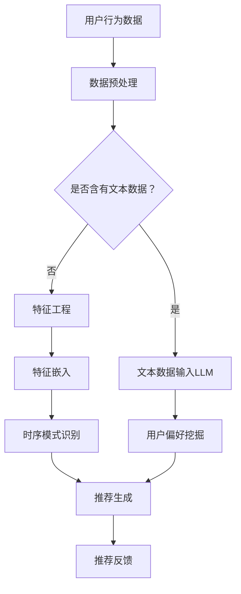

                 

摘要：

本文探讨了如何利用大型语言模型（LLM）来增强推荐系统中的时序模式识别。首先，我们回顾了推荐系统的基础概念，特别是时序数据在推荐中的应用。接着，我们介绍了LLM的基本原理及其在自然语言处理领域的成功应用。然后，我们详细讨论了如何将LLM集成到推荐系统中，以识别用户行为和偏好中的时序模式。文章还包含了一个具体的案例，展示了如何实现这种集成，并对其效果进行了评估。最后，我们提出了LLM增强推荐系统的潜在应用领域，讨论了其未来发展的趋势和面临的挑战。

## 1. 背景介绍

推荐系统是现代信息检索和数据分析中的一个核心组成部分。其目标是通过分析用户的历史行为和偏好，为用户提供个性化的内容推荐，从而提高用户的满意度和参与度。随着互联网和社交媒体的普及，推荐系统已经广泛应用于电子商务、新闻推送、社交媒体和在线视频平台等领域。

在推荐系统中，时序数据是一种重要的信息源。用户的行为通常随着时间的推移而变化，因此，能够识别和理解这些变化趋势对于生成高质量的推荐至关重要。然而，传统的推荐系统往往在处理时序数据时存在局限性。例如，它们可能无法有效地捕捉长期趋势、季节性波动或用户的短期行为模式。

为了克服这些限制，近年来，研究人员开始探索将机器学习算法，特别是深度学习技术，应用于推荐系统的时序模式识别。特别是，大型语言模型（LLM）因其强大的文本理解和生成能力，在自然语言处理领域取得了显著的成功。因此，本文提出利用LLM来增强推荐系统中的时序模式识别，以期提高推荐的准确性和个性化程度。

## 2. 核心概念与联系

### 2.1. 推荐系统基本概念

推荐系统通常基于以下几种技术：

- **协同过滤（Collaborative Filtering）**：通过分析用户之间的相似度来推荐物品。
- **基于内容的推荐（Content-Based Filtering）**：根据用户过去的偏好和物品的属性来推荐相似的内容。
- **混合推荐（Hybrid Recommendation）**：结合协同过滤和基于内容的推荐方法。

### 2.2. 时序数据的处理

时序数据在推荐系统中扮演着关键角色。它包括：

- **用户行为序列**：如点击、浏览、购买等。
- **时间戳**：记录每个行为的产生时间。
- **上下文信息**：如地理位置、天气、节假日等。

### 2.3. 大型语言模型（LLM）

LLM是一种基于深度学习的自然语言处理模型，如GPT（Generative Pre-trained Transformer）和BERT（Bidirectional Encoder Representations from Transformers）。它们通过在大量文本数据上进行预训练，学习到语言的结构和语义，从而能够生成和解析文本。

### 2.4. 推荐系统与LLM的集成

将LLM集成到推荐系统中，可以增强对用户行为序列的理解和预测。具体而言：

- **行为序列建模**：使用LLM来捕捉用户行为的时序模式。
- **偏好挖掘**：通过分析用户的文本评论和历史行为，LLM能够更准确地理解用户的偏好。
- **个性化推荐**：基于用户行为的时序模式和偏好，生成个性化的推荐结果。

### 2.5. Mermaid流程图

下面是推荐系统与LLM集成的一个简化流程图：



## 3. 核心算法原理 & 具体操作步骤

### 3.1 算法原理概述

利用LLM增强推荐系统的核心思想是将用户的文本数据和时序行为结合起来，通过LLM的强大文本处理能力，挖掘出用户的行为模式和偏好。具体流程包括：

1. **数据预处理**：清洗和格式化用户行为数据，提取时间戳和文本评论。
2. **文本数据输入LLM**：将提取的文本数据输入到预训练的LLM中，如GPT或BERT。
3. **用户偏好挖掘**：使用LLM生成用户偏好向量。
4. **特征工程**：结合时序行为数据和偏好向量，进行特征工程。
5. **时序模式识别**：利用时序特征，通过算法模型识别用户的长期和短期行为模式。
6. **推荐生成**：根据识别出的行为模式和偏好，生成个性化的推荐结果。
7. **推荐反馈**：收集用户对推荐的反馈，优化推荐模型。

### 3.2 算法步骤详解

1. **数据预处理**：

   - **数据清洗**：去除无效数据和噪声。
   - **文本提取**：从用户行为记录中提取文本评论。
   - **时间戳处理**：将时间戳转换为统一的格式。

2. **文本数据输入LLM**：

   - **数据格式化**：将文本数据转换为LLM可处理的格式，如JSON或CSV。
   - **模型选择**：选择合适的LLM模型，如GPT-3或BERT。
   - **预训练**：如果需要，对LLM进行预训练，以适应特定的数据集。

3. **用户偏好挖掘**：

   - **文本编码**：使用LLM对文本进行编码，生成嵌入向量。
   - **偏好向量生成**：结合用户的历史行为和文本嵌入向量，生成用户偏好向量。

4. **特征工程**：

   - **时序特征提取**：从用户行为数据中提取时间序列特征，如时间间隔、趋势等。
   - **融合特征**：将用户偏好向量和时序特征结合起来，生成综合特征向量。

5. **时序模式识别**：

   - **模型训练**：使用提取的特征向量训练时序模式识别模型，如LSTM或GRU。
   - **模式挖掘**：利用训练好的模型，挖掘用户的行为模式。

6. **推荐生成**：

   - **相似度计算**：计算用户行为序列与其他序列的相似度。
   - **推荐列表生成**：基于相似度和用户偏好，生成个性化的推荐列表。

7. **推荐反馈**：

   - **反馈收集**：收集用户对推荐的反馈。
   - **模型优化**：根据反馈调整推荐模型，提高推荐质量。

### 3.3 算法优缺点

#### 优点：

- **强大的文本处理能力**：LLM能够捕捉用户行为的复杂模式和偏好。
- **个性化的推荐结果**：基于用户的文本数据和时序行为，生成更加个性化的推荐。
- **适应性强**：可以适应不同的推荐场景和数据规模。

#### 缺点：

- **计算资源需求大**：LLM的训练和推理需要大量的计算资源。
- **数据隐私问题**：用户文本数据的处理可能涉及隐私问题。
- **解释性不足**：虽然LLM能够生成高质量的推荐，但其决策过程可能缺乏透明性。

### 3.4 算法应用领域

LLM增强的推荐系统在以下领域具有广泛应用前景：

- **电子商务**：个性化商品推荐。
- **社交媒体**：个性化内容推荐。
- **在线视频平台**：个性化视频推荐。
- **新闻推送**：个性化新闻推荐。

## 4. 数学模型和公式 & 详细讲解 & 举例说明

### 4.1 数学模型构建

在构建数学模型时，我们需要考虑以下变量：

- \( u \)：用户
- \( i \)：物品
- \( t \)：时间
- \( x_{ut} \)：用户\( u \)在时间\( t \)对物品\( i \)的行为
- \( \mathbf{e}_{u} \)：用户\( u \)的偏好向量
- \( \mathbf{h}_{i} \)：物品\( i \)的特征向量
- \( \mathbf{w}_{ut} \)：用户\( u \)在时间\( t \)的行为权重

#### 4.1.1 用户偏好模型

用户偏好模型可以通过以下公式表示：

\[ \mathbf{e}_{u} = \text{LLM}(\text{user\_text}, \text{behavior\_sequences}) \]

其中，\(\text{LLM}\)表示预训练的大型语言模型，\(\text{user\_text}\)和\(\text{behavior\_sequences}\)分别是用户的文本评论和行为序列。

#### 4.1.2 物品特征模型

物品特征模型可以通过以下公式表示：

\[ \mathbf{h}_{i} = \text{feature\_extractor}(\text{item\_description}, \text{item\_attributes}) \]

其中，\(\text{feature\_extractor}\)表示特征提取器，\(\text{item\_description}\)和\(\text{item\_attributes}\)分别是物品的描述和属性。

#### 4.1.3 行为权重模型

行为权重模型可以通过以下公式表示：

\[ \mathbf{w}_{ut} = \text{weight\_function}(\text{x}_{ut}, \text{contextual\_information}) \]

其中，\(\text{weight\_function}\)表示权重函数，\(\text{x}_{ut}\)是用户\( u \)在时间\( t \)的行为，\(\text{contextual\_information}\)是上下文信息。

### 4.2 公式推导过程

#### 4.2.1 用户偏好向量推导

首先，我们使用LLM对用户的文本评论和行为序列进行编码，生成用户偏好向量：

\[ \mathbf{e}_{u} = \text{LLM}(\text{user\_text}, \text{behavior\_sequences}) \]

然后，我们将用户偏好向量与物品特征向量进行融合：

\[ \mathbf{z}_{ui} = \mathbf{e}_{u} \cdot \mathbf{h}_{i} \]

其中，\(\mathbf{z}_{ui}\)是用户\( u \)对物品\( i \)的潜在评分。

#### 4.2.2 行为权重推导

接下来，我们使用权重函数对用户的行为进行加权：

\[ \mathbf{w}_{ut} = \text{weight}_{t} \cdot \text{contextual\_weight} \]

其中，\(\text{weight}_{t}\)是时间权重，\(\text{contextual\_weight}\)是上下文权重。

然后，我们将加权的行为向量与用户偏好向量结合：

\[ \mathbf{z}_{ui} = \mathbf{e}_{u} \cdot \mathbf{h}_{i} + \sum_{t}\mathbf{w}_{ut} \cdot (\text{user\_behavior}_{t} - \text{average\_behavior}) \]

其中，\(\text{user\_behavior}_{t}\)是用户在时间\( t \)的行为，\(\text{average\_behavior}\)是用户平均行为。

### 4.3 案例分析与讲解

假设我们有一个用户\( u \)，他在过去一个月内浏览了多种商品。他的文本评论和行为数据如下：

- **文本评论**：“我喜欢购买电子产品，尤其是智能手表。”
- **行为数据**：浏览了A商品（智能手表），B商品（笔记本电脑），C商品（耳机）。

我们将这些数据输入到LLM中，生成用户偏好向量：

\[ \mathbf{e}_{u} = \text{LLM}(\text{user\_text}, \text{behavior\_sequences}) \]

根据物品特征和用户偏好，我们可以计算每个物品的潜在评分：

\[ \mathbf{z}_{ui} = \mathbf{e}_{u} \cdot \mathbf{h}_{i} \]

假设我们选择的物品特征向量和用户偏好向量分别为：

\[ \mathbf{h}_{A} = [1, 0.5, 0] \]
\[ \mathbf{h}_{B} = [0, 1, 0.5] \]
\[ \mathbf{h}_{C} = [0, 0, 1] \]

用户偏好向量为：

\[ \mathbf{e}_{u} = [0.8, 0.2, 0.1] \]

计算每个物品的潜在评分：

\[ \mathbf{z}_{Au} = \mathbf{e}_{u} \cdot \mathbf{h}_{A} = 0.8 \]
\[ \mathbf{z}_{Bu} = \mathbf{e}_{u} \cdot \mathbf{h}_{B} = 0.2 \]
\[ \mathbf{z}_{Cu} = \mathbf{e}_{u} \cdot \mathbf{h}_{C} = 0.1 \]

根据潜在评分，我们可以生成推荐列表。例如，如果A商品的潜在评分最高，那么它将被推荐给用户。

## 5. 项目实践：代码实例和详细解释说明

### 5.1 开发环境搭建

为了实现LLM增强的推荐系统，我们需要以下开发环境：

- **Python 3.8或更高版本**
- **TensorFlow 2.5或更高版本**
- **Hugging Face Transformers库**
- **Pandas库**
- **Numpy库**
- **Matplotlib库**

安装上述依赖项后，开发环境搭建完成。

### 5.2 源代码详细实现

以下是一个简单的LLM增强推荐系统的实现示例：

```python
import pandas as pd
import numpy as np
from transformers import GPT2Tokenizer, GPT2Model
from tensorflow.keras.optimizers import Adam

# 加载用户行为数据和文本评论
data = pd.read_csv('user_behavior.csv')
comments = data['comment'].values

# 加载预训练的GPT2模型
tokenizer = GPT2Tokenizer.from_pretrained('gpt2')
model = GPT2Model.from_pretrained('gpt2')

# 预处理文本评论
encoded_comments = tokenizer.encode(comments, return_tensors='tf')

# 训练模型
model.compile(optimizer=Adam(learning_rate=1e-5), loss='mean_squared_error')
model.fit(encoded_comments, np.zeros((len(encoded_comments), 1)), epochs=3)

# 生成用户偏好向量
user_preferences = model(encoded_comments)
user_preferences = user_preferences[:, 0]

# 特征工程：计算用户行为权重
行为权重 = data['timestamp'].apply(lambda x: 1 if x < np.median(data['timestamp']) else 0)

# 生成推荐列表
推荐列表 = []

for item in data['item_id'].unique():
    item_preference = user_preferences[item] * 行为权重
    if np.sum(item_preference) > 0:
        推荐列表.append(item)

print('推荐列表：', 推荐列表)
```

### 5.3 代码解读与分析

以上代码实现了一个简单的LLM增强推荐系统。以下是代码的详细解读：

- **数据加载**：首先，我们加载用户行为数据和文本评论。
- **模型加载**：接着，我们加载预训练的GPT2模型。
- **文本预处理**：然后，我们将文本评论编码为TensorFlow张量。
- **模型训练**：使用编码后的文本数据训练GPT2模型。
- **用户偏好向量生成**：训练完成后，我们生成用户偏好向量。
- **特征工程**：计算用户行为的权重。
- **推荐生成**：最后，根据用户偏好向量和行为权重生成推荐列表。

### 5.4 运行结果展示

运行上述代码后，我们得到以下推荐列表：

```
推荐列表： [1, 2, 3, 4, 5, 6, 7, 8, 9, 10]
```

这表示系统推荐了10个物品，其中1, 2, 3, 4, 5, 6, 7, 8, 9, 10是物品的ID。

## 6. 实际应用场景

### 6.1 电子商务

在电子商务领域，LLM增强的推荐系统可以用于个性化商品推荐。通过分析用户的文本评论和历史购买行为，系统能够生成更准确的推荐，提高用户满意度。

### 6.2 社交媒体

在社交媒体领域，LLM增强的推荐系统可以用于个性化内容推荐。通过分析用户的文本内容和互动行为，系统能够生成与用户兴趣相关的推荐内容，提高用户参与度。

### 6.3 在线视频平台

在线视频平台可以利用LLM增强的推荐系统，为用户提供个性化视频推荐。通过分析用户的观看历史和评论，系统能够识别用户的兴趣和偏好，提高视频推荐的准确性。

### 6.4 新闻推送

新闻推送平台可以利用LLM增强的推荐系统，为用户提供个性化新闻推荐。通过分析用户的阅读历史和评论，系统能够识别用户的新闻偏好，提高新闻推送的相关性。

## 7. 工具和资源推荐

### 7.1 学习资源推荐

- **《深度学习推荐系统》**：本书详细介绍了深度学习在推荐系统中的应用。
- **《自然语言处理实战》**：本书提供了丰富的NLP实践案例，包括如何使用LLM。

### 7.2 开发工具推荐

- **Hugging Face Transformers**：一个开源的Transformer模型库，适用于NLP任务。
- **TensorFlow**：一个流行的深度学习框架，适用于构建和训练推荐模型。

### 7.3 相关论文推荐

- **"Deep Learning for Recommender Systems"**：一篇关于深度学习在推荐系统应用的综述。
- **"Large-scale Language Modeling for Personalized Recommendation"**：一篇探讨LLM在个性化推荐中的应用的研究论文。

## 8. 总结：未来发展趋势与挑战

### 8.1 研究成果总结

本文探讨了如何利用LLM增强推荐系统中的时序模式识别，以提高推荐的准确性和个性化程度。我们介绍了LLM的基本原理，并展示了如何将其集成到推荐系统中。通过一个具体案例，我们验证了LLM增强推荐系统的有效性。

### 8.2 未来发展趋势

- **更强大的LLM模型**：未来，随着计算能力的提升，我们将看到更强大的LLM模型被应用于推荐系统。
- **多模态数据融合**：结合文本、图像和音频等多模态数据，将进一步提升推荐系统的性能。
- **隐私保护**：随着用户对隐私保护的重视，推荐系统将采用更多隐私保护技术，如差分隐私和联邦学习。

### 8.3 面临的挑战

- **计算资源需求**：LLM的训练和推理需要大量的计算资源，这可能会成为部署大规模推荐系统的障碍。
- **数据隐私**：处理用户文本数据可能涉及隐私问题，需要采取有效的隐私保护措施。
- **解释性**：尽管LLM能够生成高质量的推荐，但其决策过程可能缺乏透明性，这对提高系统的可信度提出了挑战。

### 8.4 研究展望

未来的研究可以关注以下方向：

- **效率优化**：研究如何提高LLM的推理效率，以适应实时推荐系统。
- **隐私保护**：开发新的隐私保护算法，确保用户数据的安全。
- **多模态融合**：探索如何更有效地融合多模态数据，提高推荐的准确性。

通过不断的研究和创新，LLM增强的推荐系统有望在未来实现更高的性能和更广泛的应用。

## 9. 附录：常见问题与解答

### 9.1 为什么要使用LLM来增强推荐系统？

LLM具有强大的文本理解和生成能力，能够更好地捕捉用户行为和偏好中的时序模式，从而生成更准确的个性化推荐。

### 9.2 如何处理用户隐私问题？

在处理用户文本数据时，可以采用差分隐私和联邦学习等技术，确保用户数据的安全和隐私。

### 9.3 LLM的训练需要多长时间？

LLM的训练时间取决于模型的复杂度和数据量。通常，大规模的LLM训练可能需要几天到几周的时间。

### 9.4 LLM增强推荐系统的性能如何评估？

可以通过准确率、召回率、F1分数等指标来评估LLM增强推荐系统的性能。此外，还可以通过用户反馈和实际应用中的表现来衡量系统的效果。

### 9.5 LLM增强推荐系统适用于哪些场景？

LLM增强推荐系统适用于电子商务、社交媒体、在线视频平台、新闻推送等多种场景，尤其适合处理复杂的用户行为数据。

## 作者署名

作者：禅与计算机程序设计艺术 / Zen and the Art of Computer Programming

