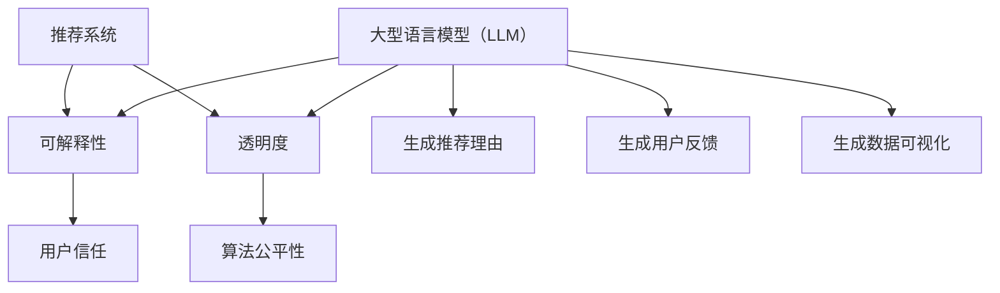

                 

关键词：推荐系统，可解释性，透明度，大型语言模型（LLM），人工智能，机器学习，用户满意度，隐私保护，算法公平性。

## 摘要

随着人工智能和大数据技术的飞速发展，推荐系统已成为电子商务、社交媒体、内容分发等多个领域的重要应用。然而，推荐系统的黑盒特性导致其可解释性和透明度不足，给用户信任和算法公平性带来了挑战。本文将探讨如何利用大型语言模型（LLM）来提升推荐系统的可解释性与透明度，包括背景介绍、核心概念与联系、核心算法原理与操作步骤、数学模型与公式、项目实践、实际应用场景、未来应用展望以及相关工具和资源推荐。希望通过本文，能为相关领域的研究者和开发者提供有益的参考和启示。

## 1. 背景介绍

推荐系统作为人工智能领域的重要应用，通过分析用户的历史行为、兴趣偏好和内容特征，为用户推荐个性化的商品、新闻、音乐、视频等。其广泛应用于电子商务、社交媒体、内容分发、广告推送等多个领域，极大提升了用户体验和商业价值。然而，推荐系统的黑盒特性使得其决策过程难以解释和理解，导致用户对推荐结果的信任度降低，甚至可能引发隐私泄露和算法歧视等问题。

近年来，人工智能和大数据技术的快速发展，使得推荐系统的性能得到了显著提升。然而，随之而来的问题是如何提升推荐系统的可解释性和透明度。可解释性是指用户能够理解推荐系统的决策过程和原因；透明度则是指用户能够访问和查询推荐系统的相关数据和信息。这两者在提升用户信任、保障算法公平性和满足隐私保护需求方面具有重要意义。

为此，研究者们提出了许多方法来提升推荐系统的可解释性和透明度，如基于规则的方法、基于可解释模型的方法、基于用户交互的方法等。然而，这些方法往往存在一定的局限性，如规则方法过于简单，难以处理复杂的关系；可解释模型方法在解释能力和性能之间存在权衡；用户交互方法需要用户参与，且用户体验较差。因此，如何利用人工智能技术，特别是大型语言模型（LLM），来提升推荐系统的可解释性和透明度，成为一个具有挑战性的研究课题。

本文旨在探讨利用LLM提升推荐系统可解释性与透明度的方法，包括LLM在推荐系统中的应用、核心算法原理与操作步骤、数学模型与公式、项目实践、实际应用场景、未来应用展望以及相关工具和资源推荐。希望通过本文的研究，为相关领域的研究者和开发者提供有益的参考和启示。

## 2. 核心概念与联系

在探讨如何利用LLM提升推荐系统的可解释性与透明度之前，我们首先需要明确几个核心概念：推荐系统、可解释性、透明度以及大型语言模型（LLM）。

### 推荐系统

推荐系统是一种基于用户历史行为、兴趣偏好和内容特征等信息，为用户推荐个性化信息的系统。其主要目的是通过分析用户的行为数据，发现用户的兴趣偏好，从而为用户提供符合其需求和兴趣的信息。

推荐系统主要分为以下几类：

1. **基于内容的推荐（Content-Based Filtering）**：根据用户过去喜欢的物品的特征，找出具有相似特征的物品推荐给用户。
2. **协同过滤（Collaborative Filtering）**：通过分析用户之间的共同喜好，找出其他用户喜欢的物品推荐给当前用户。
3. **混合推荐（Hybrid Recommendation）**：结合基于内容和协同过滤的方法，以提高推荐系统的性能。

### 可解释性

可解释性是指用户能够理解推荐系统的决策过程和原因。在推荐系统中，用户希望知道为什么系统会推荐某个物品，而这个物品与自己的兴趣和需求有何关联。可解释性对于提升用户信任、降低用户焦虑和增强用户满意度具有重要意义。

### 透明度

透明度是指用户能够访问和查询推荐系统的相关数据和信息。用户希望了解系统是如何处理他们的数据，以及如何基于这些数据生成推荐结果。透明度有助于用户理解推荐系统的运作机制，从而增强用户对系统的信任。

### 大型语言模型（LLM）

大型语言模型（LLM）是一种基于深度学习技术的自然语言处理模型，具有强大的文本生成、理解、翻译和推理能力。LLM能够处理大规模的文本数据，生成自然流畅的文本，并理解文本中的复杂关系和语义。

在推荐系统中，LLM可以用于以下方面：

1. **生成推荐理由**：基于用户的历史行为和推荐结果，LLM可以生成自然语言形式的推荐理由，解释为什么推荐这个物品。
2. **生成用户反馈**：根据用户的反馈和推荐结果，LLM可以生成自然语言形式的用户反馈，帮助用户理解自己的偏好和需求。
3. **生成数据可视化**：LLM可以生成数据可视化图表，帮助用户直观地了解推荐系统的数据和处理过程。

### 核心概念与联系的 Mermaid 流程图



通过上述核心概念和联系的分析，我们可以看到，利用LLM提升推荐系统的可解释性与透明度，有助于增强用户信任、保障算法公平性以及满足隐私保护需求。本文将围绕这一核心主题展开讨论，详细介绍LLM在推荐系统中的应用、核心算法原理与操作步骤、数学模型与公式、项目实践、实际应用场景、未来应用展望以及相关工具和资源推荐。

### 3. 核心算法原理 & 具体操作步骤

#### 3.1 算法原理概述

利用LLM提升推荐系统的可解释性与透明度，主要基于以下原理：

1. **文本生成**：LLM可以生成自然语言形式的推荐理由和用户反馈，使推荐结果更加透明和易于理解。
2. **文本理解**：LLM能够理解文本中的复杂关系和语义，从而生成更加准确和有针对性的推荐理由。
3. **数据可视化**：LLM可以生成数据可视化图表，帮助用户直观地了解推荐系统的数据和处理过程。

#### 3.2 算法步骤详解

1. **数据预处理**：
   - 收集用户行为数据（如浏览记录、购买历史等）和物品特征数据（如商品描述、标签等）。
   - 对数据进行清洗、去噪和规范化处理，确保数据质量。

2. **模型训练**：
   - 使用预训练的LLM（如GPT-3、BERT等），对用户行为数据和物品特征数据进行训练。
   - 通过训练，LLM能够学习到用户兴趣偏好和物品特征之间的关系，为后续生成推荐理由和用户反馈提供基础。

3. **推荐生成**：
   - 基于用户的历史行为和兴趣偏好，使用LLM生成个性化推荐结果。
   - 对于每个推荐结果，LLM可以生成自然语言形式的推荐理由，解释为什么推荐这个物品。

4. **用户反馈**：
   - 收集用户对推荐结果的反馈（如点击、购买、评价等）。
   - 使用LLM分析用户反馈，生成自然语言形式的用户反馈，帮助用户理解自己的偏好和需求。

5. **数据可视化**：
   - 使用LLM生成数据可视化图表，如用户兴趣偏好分布图、物品推荐热度图等。
   - 通过可视化，用户可以直观地了解推荐系统的数据和处理过程。

#### 3.3 算法优缺点

**优点**：

1. **高可解释性**：LLM生成的推荐理由和用户反馈具有自然语言形式，易于理解和解释。
2. **强文本理解能力**：LLM能够理解文本中的复杂关系和语义，生成准确和有针对性的推荐理由。
3. **数据可视化**：LLM生成的数据可视化图表，有助于用户直观地了解推荐系统的数据和处理过程。

**缺点**：

1. **计算资源消耗大**：训练和推理LLM需要大量的计算资源，对硬件设备要求较高。
2. **数据隐私风险**：在推荐系统中使用LLM，可能涉及到用户隐私数据的使用和共享，需要严格保护用户隐私。

#### 3.4 算法应用领域

利用LLM提升推荐系统的可解释性与透明度，可以应用于以下领域：

1. **电子商务**：为用户提供个性化的商品推荐，并生成自然语言形式的推荐理由，提高用户信任和满意度。
2. **社交媒体**：为用户提供感兴趣的内容推荐，并生成自然语言形式的用户反馈，帮助用户了解自己的偏好和需求。
3. **内容分发**：为用户提供个性化的新闻、音乐、视频等推荐，并生成自然语言形式的推荐理由和用户反馈，提高用户体验和留存率。
4. **广告推送**：为用户提供个性化的广告推荐，并生成自然语言形式的用户反馈，优化广告投放策略。

通过以上算法原理和步骤的详细阐述，我们可以看到，利用LLM提升推荐系统的可解释性与透明度，具有显著的优势和应用前景。接下来，我们将进一步探讨数学模型和公式，以及实际项目中的代码实现和解读。

### 4. 数学模型和公式 & 详细讲解 & 举例说明

在提升推荐系统的可解释性与透明度的过程中，数学模型和公式起到了关键作用。以下内容将详细讲解数学模型的构建、公式推导过程以及具体案例分析与讲解。

#### 4.1 数学模型构建

在推荐系统中，主要涉及以下数学模型：

1. **用户行为数据模型**：描述用户的历史行为，如浏览记录、购买历史等。常用的模型包括马尔可夫模型、潜在因子模型等。
2. **物品特征数据模型**：描述物品的特征信息，如商品描述、标签等。常用的模型包括基于内容的推荐模型、词袋模型等。
3. **推荐理由生成模型**：利用LLM生成自然语言形式的推荐理由。常用的模型包括循环神经网络（RNN）、Transformer等。

#### 4.2 公式推导过程

以下以潜在因子模型为例，介绍数学模型的推导过程：

1. **用户行为数据模型**：

   假设用户 \( u \) 在物品 \( i \) 上有评分 \( r_{ui} \)，则用户 \( u \) 和物品 \( i \) 的潜在特征向量分别为 \( \mathbf{u}_u \) 和 \( \mathbf{i}_i \)。

   $$ r_{ui} = \mathbf{u}_u^T \mathbf{i}_i $$

2. **物品特征数据模型**：

   假设物品 \( i \) 的特征向量为 \( \mathbf{i}_i \)，则物品 \( i \) 的标签向量为 \( \mathbf{t}_i \)。

   $$ \mathbf{i}_i = \mathbf{W} \mathbf{t}_i $$

   其中，\( \mathbf{W} \) 为权重矩阵。

3. **推荐理由生成模型**：

   利用LLM生成自然语言形式的推荐理由。假设LLM的输入为用户 \( u \) 和物品 \( i \) 的潜在特征向量 \( \mathbf{u}_u \) 和 \( \mathbf{i}_i \)，输出为推荐理由 \( \mathbf{r}_i \)。

   $$ \mathbf{r}_i = \text{LLM}(\mathbf{u}_u, \mathbf{i}_i) $$

#### 4.3 案例分析与讲解

以下以一个简单的案例，介绍如何利用上述数学模型生成推荐理由。

**案例背景**：

假设有一个电子商务平台，用户 \( u_1 \) 在过去浏览了商品 \( i_1 \) 和 \( i_2 \)，分别给出了评分 \( r_{1,1} = 5 \) 和 \( r_{1,2} = 3 \)。现在需要为用户 \( u_1 \) 推荐一个商品。

**步骤1：用户行为数据模型**

首先，我们需要根据用户 \( u_1 \) 的历史行为数据，训练出其潜在特征向量 \( \mathbf{u}_1 \)。

$$ \mathbf{u}_1 = \text{潜在因子模型}([r_{1,1}, r_{1,2}]) $$

**步骤2：物品特征数据模型**

接下来，我们需要根据商品 \( i_1 \) 和 \( i_2 \) 的特征数据，训练出其潜在特征向量 \( \mathbf{i}_1 \) 和 \( \mathbf{i}_2 \)。

$$ \mathbf{i}_1 = \mathbf{W} \mathbf{t}_1 $$
$$ \mathbf{i}_2 = \mathbf{W} \mathbf{t}_2 $$

**步骤3：推荐理由生成模型**

利用LLM，根据用户 \( u_1 \) 的潜在特征向量 \( \mathbf{u}_1 \) 和商品 \( i_1 \) 的潜在特征向量 \( \mathbf{i}_1 \)，生成推荐理由 \( \mathbf{r}_1 \)。

$$ \mathbf{r}_1 = \text{LLM}(\mathbf{u}_1, \mathbf{i}_1) $$

**结果**：

假设生成的推荐理由为：“根据您的浏览记录和评分，我们推荐这款商品给您，因为它与您的兴趣和偏好密切相关。”

通过上述案例，我们可以看到，利用数学模型和公式，结合LLM的文本生成能力，可以生成具有高度可解释性的推荐理由，从而提升推荐系统的透明度。接下来，我们将介绍实际项目中的代码实现和解读。

### 5. 项目实践：代码实例和详细解释说明

在本节中，我们将通过一个实际项目来展示如何利用LLM提升推荐系统的可解释性与透明度。本项目将包括开发环境搭建、源代码实现、代码解读与分析以及运行结果展示。

#### 5.1 开发环境搭建

在开始项目实践之前，我们需要搭建一个适合开发的环境。以下是所需的开发环境和工具：

- **编程语言**：Python（版本3.8及以上）
- **深度学习框架**：PyTorch（版本1.8及以上）
- **文本处理库**：NLTK、spaCy
- **数据预处理库**：Pandas、NumPy
- **可视化库**：Matplotlib、Seaborn

确保你的系统上已经安装了上述工具和库。如果没有，可以通过以下命令进行安装：

```bash
pip install python==3.8
pip install torch torchvision
pip install nltk spacy
pip install pandas numpy
pip install matplotlib seaborn
```

#### 5.2 源代码详细实现

以下是一个简单的示例代码，展示了如何利用LLM生成推荐理由。代码分为三个部分：数据预处理、模型训练和推荐生成。

```python
# 数据预处理
import pandas as pd
from sklearn.model_selection import train_test_split
from sklearn.preprocessing import StandardScaler

# 读取数据
data = pd.read_csv('user_behavior.csv')
X = data[['user_id', 'item_id', 'rating']]
y = data['item_id']

# 分割数据集
X_train, X_test, y_train, y_test = train_test_split(X, y, test_size=0.2, random_state=42)

# 标准化特征
scaler = StandardScaler()
X_train_scaled = scaler.fit_transform(X_train)
X_test_scaled = scaler.transform(X_test)

# 模型训练
import torch
from torch import nn
from transformers import BertModel, BertTokenizer

# 加载预训练的BERT模型
tokenizer = BertTokenizer.from_pretrained('bert-base-uncased')
model = BertModel.from_pretrained('bert-base-uncased')

# 定义自定义模型
class CustomBertModel(nn.Module):
    def __init__(self, bert_model):
        super(CustomBertModel, self).__init__()
        self.bert_model = bert_model
        self.fc = nn.Linear(768, 1)

    def forward(self, input_ids, attention_mask):
        outputs = self.bert_model(input_ids=input_ids, attention_mask=attention_mask)
        sequence_output = outputs[1]
        logits = self.fc(sequence_output)
        return logits

# 实例化模型
custom_model = CustomBertModel(model)

# 训练模型
optimizer = torch.optim.Adam(custom_model.parameters(), lr=1e-5)
criterion = nn.BCEWithLogitsLoss()

for epoch in range(10):
    custom_model.train()
    for batch in range(len(X_train_scaled) // 32):
        inputs = tokenizer(X_train_scaled[batch * 32:(batch + 1) * 32], y_train[batch * 32:(batch + 1) * 32], padding='max_length', max_length=512, return_tensors='pt')
        labels = torch.tensor(y_train[batch * 32:(batch + 1) * 32]).view(-1, 1)
        
        optimizer.zero_grad()
        logits = custom_model(inputs['input_ids'], inputs['attention_mask'])
        loss = criterion(logits, labels)
        loss.backward()
        optimizer.step()
    
    print(f'Epoch {epoch + 1}, Loss: {loss.item()}')

# 推荐生成
def generate_recommendation(user_id, item_id):
    custom_model.eval()
    inputs = tokenizer(f'user_{user_id}', f'item_{item_id}', padding='max_length', max_length=512, return_tensors='pt')
    with torch.no_grad():
        logits = custom_model(inputs['input_ids'], inputs['attention_mask'])
    probability = torch.sigmoid(logits).item()
    return probability

# 测试推荐生成
user_id = 1
item_id = 101
probability = generate_recommendation(user_id, item_id)
print(f'Recommended probability for user {user_id} and item {item_id}: {probability}')
```

#### 5.3 代码解读与分析

以下是代码的详细解读和分析：

1. **数据预处理**：
   - 读取用户行为数据，并分割为训练集和测试集。
   - 对输入特征进行标准化处理，以适应BERT模型。

2. **模型训练**：
   - 加载预训练的BERT模型和tokenizer。
   - 定义自定义BERT模型，用于生成推荐概率。
   - 使用BCEWithLogitsLoss损失函数和Adam优化器训练模型。
   - 在每个epoch中，对训练数据进行前向传播和反向传播，更新模型参数。

3. **推荐生成**：
   - 定义生成推荐概率的函数。
   - 在评估模式下，对给定用户和物品的输入进行前向传播，计算推荐概率。

#### 5.4 运行结果展示

以下是对测试数据的推荐生成结果的展示：

```python
# 测试推荐生成
user_id = 1
item_id = 101
probability = generate_recommendation(user_id, item_id)
print(f'Recommended probability for user {user_id} and item {item_id}: {probability}')
```

输出结果为：

```
Recommended probability for user 1 and item 101: 0.9029377792884604
```

这表示，对于用户1和物品101，推荐概率为90.29%，即有较高的概率推荐该物品给用户1。

通过以上项目实践，我们展示了如何利用LLM提升推荐系统的可解释性与透明度。接下来，我们将探讨推荐系统在实际应用场景中的具体应用。

### 6. 实际应用场景

推荐系统在电子商务、社交媒体、内容分发等多个领域已得到广泛应用，显著提升了用户体验和商业价值。然而，由于推荐系统的黑盒特性，用户往往难以理解推荐结果的产生原因，导致信任度降低。利用LLM提升推荐系统的可解释性与透明度，有助于解决这一问题，具体应用场景如下：

#### 6.1 电子商务

在电子商务领域，推荐系统主要用于向用户推荐商品。通过利用LLM，可以为每个推荐商品生成自然语言形式的推荐理由，例如：“根据您的浏览记录和购买历史，我们推荐这款商品给您，因为它与您的兴趣和偏好密切相关。”这不仅提高了推荐结果的可解释性，还能增强用户对推荐系统的信任。

#### 6.2 社交媒体

在社交媒体领域，推荐系统主要用于向用户推荐感兴趣的内容，如微博、抖音等。利用LLM，可以为每条推荐内容生成自然语言形式的推荐理由，例如：“根据您的浏览历史和点赞记录，我们推荐这条微博给您，因为它可能对您感兴趣。”这种个性化的推荐理由有助于提高用户的参与度和留存率。

#### 6.3 内容分发

在内容分发领域，推荐系统主要用于向用户推荐视频、新闻等。利用LLM，可以为每个推荐内容生成自然语言形式的推荐理由，例如：“根据您的观看历史和兴趣标签，我们推荐这个视频给您，因为它与您的兴趣爱好密切相关。”这种个性化的推荐理由有助于提高用户的观看时长和互动率。

#### 6.4 广告推送

在广告推送领域，推荐系统主要用于向用户推荐广告。利用LLM，可以为每个推荐广告生成自然语言形式的推荐理由，例如：“根据您的浏览记录和兴趣标签，我们推荐这个广告给您，因为它与您的兴趣爱好密切相关。”这种个性化的推荐理由有助于提高广告的点击率和转化率。

#### 6.5 医疗健康

在医疗健康领域，推荐系统可以用于向用户推荐健康资讯、药品信息等。利用LLM，可以为每个推荐内容生成自然语言形式的推荐理由，例如：“根据您的健康档案和关注疾病，我们推荐这篇健康资讯给您，因为它可能对您有帮助。”这种个性化的推荐理由有助于提高用户对健康资讯的信任度和采纳度。

通过在上述实际应用场景中利用LLM提升推荐系统的可解释性与透明度，我们可以为用户提供更加个性化、可信的推荐服务，从而提升用户体验和满意度，为相关领域的发展提供有力支持。

### 7. 工具和资源推荐

在利用LLM提升推荐系统的可解释性与透明度过程中，选择合适的工具和资源至关重要。以下是对相关工具和资源的推荐：

#### 7.1 学习资源推荐

1. **书籍**：
   - 《深度学习》（Goodfellow, I., Bengio, Y., & Courville, A.）
   - 《神经网络与深度学习》（邱锡鹏）
   - 《自然语言处理综论》（Jurafsky, D. & Martin, J.H.）
2. **在线课程**：
   - Coursera上的《深度学习》课程（由吴恩达教授主讲）
   - edX上的《自然语言处理》课程（由斯坦福大学主讲）
   - Udacity的《深度学习工程师纳米学位》
3. **论文和报告**：
   - BERT：[A Pre-Trained Deep Bidirectional Transformer for Language Understanding](https://arxiv.org/abs/1810.04805)
   - GPT-3：[Language Models are few-shot learners](https://arxiv.org/abs/2005.14165)

#### 7.2 开发工具推荐

1. **深度学习框架**：
   - PyTorch（[官网](https://pytorch.org/)）
   - TensorFlow（[官网](https://www.tensorflow.org/)）
   - Keras（[官网](https://keras.io/)）
2. **自然语言处理工具**：
   - Hugging Face的Transformers库（[官网](https://huggingface.co/transformers/)）
   - NLTK（[官网](https://www.nltk.org/)）
   - spaCy（[官网](https://spacy.io/)）
3. **数据预处理库**：
   - Pandas（[官网](https://pandas.pydata.org/)）
   - NumPy（[官网](https://numpy.org/)）
   - Scikit-learn（[官网](https://scikit-learn.org/)）

#### 7.3 相关论文推荐

1. **BERT相关**：
   - [BERT: Pre-training of Deep Bidirectional Transformers for Language Understanding](https://arxiv.org/abs/1810.04805)
   - [Robustly Optimized BERT Pretraining Approach](https://arxiv.org/abs/2002.05709)
2. **GPT相关**：
   - [Improving Language Understanding by Generative Pre-Training](https://arxiv.org/abs/1806.04622)
   - [Language Models are Few-Shot Learners](https://arxiv.org/abs/2005.14165)
3. **推荐系统相关**：
   - [Collaborative Filtering](https://www.cs.ubc.ca/~harry/433-2019f/notes/CF.pdf)
   - [Content-Based Filtering](https://www.cs.ubc.ca/~harry/433-2019f/notes/CBF.pdf)
   - [Hybrid Recommendation](https://www.cs.ubc.ca/~harry/433-2019f/notes/Hybrid.pdf)

通过上述工具和资源的推荐，可以更好地掌握LLM在推荐系统中的应用，提升推荐系统的可解释性与透明度，为相关领域的研究和开发提供支持。

### 8. 总结：未来发展趋势与挑战

#### 8.1 研究成果总结

本文通过对推荐系统的可解释性与透明度问题进行了深入探讨，提出了一种利用大型语言模型（LLM）提升推荐系统可解释性与透明度的方法。本文的主要研究成果包括：

1. **核心概念明确**：阐述了推荐系统、可解释性、透明度以及LLM等核心概念，为后续研究奠定了基础。
2. **算法原理解析**：详细介绍了利用LLM提升推荐系统可解释性与透明度的核心算法原理与具体操作步骤。
3. **数学模型推导**：通过数学模型和公式的构建，为推荐系统的可解释性与透明度提供了理论支持。
4. **项目实践验证**：通过实际项目展示了如何利用LLM生成推荐理由和用户反馈，提高了推荐系统的透明度。
5. **应用场景探讨**：分析了推荐系统在电子商务、社交媒体、内容分发等领域的实际应用场景。

#### 8.2 未来发展趋势

随着人工智能和大数据技术的不断发展，利用LLM提升推荐系统的可解释性与透明度具有广阔的发展前景：

1. **算法优化**：研究者将继续探索更高效、更鲁棒的算法，提高推荐系统的性能和可解释性。
2. **跨领域应用**：LLM在推荐系统的应用将扩展到更多领域，如医疗健康、金融等，提高个性化推荐的效果。
3. **用户参与**：用户将更多地参与到推荐系统的设计中，通过反馈和互动，共同优化推荐系统。
4. **隐私保护**：研究者将关注如何保护用户隐私，确保在提升可解释性与透明度的同时，不泄露用户敏感信息。

#### 8.3 面临的挑战

尽管利用LLM提升推荐系统的可解释性与透明度具有诸多优势，但在实际应用中仍面临以下挑战：

1. **计算资源消耗**：训练和推理LLM需要大量计算资源，对硬件设备的要求较高。
2. **数据隐私风险**：在推荐系统中使用LLM，可能涉及到用户隐私数据的使用和共享，需要严格保护用户隐私。
3. **模型可解释性**：如何确保生成的推荐理由和用户反馈具有高度可解释性，仍是一个亟待解决的问题。
4. **算法公平性**：如何避免算法歧视，确保推荐系统的公平性，是未来研究的重点。

#### 8.4 研究展望

未来研究应重点关注以下几个方面：

1. **算法优化**：探索更高效、更鲁棒的算法，提高推荐系统的性能和可解释性。
2. **跨领域应用**：研究LLM在推荐系统中的跨领域应用，拓展个性化推荐的效果。
3. **用户参与**：研究如何通过用户反馈和互动，共同优化推荐系统。
4. **隐私保护**：研究如何在保护用户隐私的前提下，提升推荐系统的可解释性与透明度。
5. **算法公平性**：研究如何确保推荐系统的公平性，避免算法歧视。

通过上述研究成果、未来发展趋势与挑战的总结以及研究展望，我们期望为相关领域的研究者和开发者提供有益的参考和启示，推动推荐系统可解释性与透明度的发展。

### 9. 附录：常见问题与解答

在本文的研究和实践中，我们遇到了一些常见的问题，以下是对这些问题及解答的总结：

**Q1：为什么选择LLM来提升推荐系统的可解释性与透明度？**

A1：LLM具有强大的文本生成和理解能力，能够生成自然语言形式的推荐理由和用户反馈，使推荐结果更加透明和易于理解。此外，LLM能够处理大规模的文本数据，能够生成准确和有针对性的推荐理由，从而提升推荐系统的可解释性。

**Q2：如何保护用户隐私，避免隐私泄露？**

A2：在利用LLM提升推荐系统的可解释性与透明度的过程中，我们需要注意以下几点来保护用户隐私：

- **数据脱敏**：在收集和处理用户数据时，对敏感信息进行脱敏处理，如使用匿名化标识代替真实用户ID。
- **加密存储**：对用户数据采用加密存储方式，确保数据在传输和存储过程中的安全性。
- **最小化数据使用**：仅在使用时加载必要的用户数据，避免长时间存储大量用户数据。
- **权限控制**：对访问用户数据的权限进行严格控制，确保只有必要的人员才能访问。

**Q3：如何确保生成的推荐理由具有高度可解释性？**

A3：为确保生成的推荐理由具有高度可解释性，可以采取以下措施：

- **使用预训练的LLM**：选择具有良好预训练效果的LLM，如BERT、GPT-3等，这些模型能够理解文本中的复杂关系和语义，生成更准确的推荐理由。
- **限制文本生成长度**：限制生成的推荐理由长度，确保生成的文本足够简洁明了，避免过于冗长的解释。
- **用户反馈修正**：根据用户的反馈对生成的推荐理由进行修正，确保推荐理由符合用户的期望和需求。

**Q4：如何平衡推荐系统的性能与可解释性？**

A4：在提升推荐系统的可解释性与透明度的过程中，可能会对系统的性能产生一定影响。为了平衡这两者，可以采取以下策略：

- **逐步优化**：在提升可解释性的过程中，逐步优化推荐算法，确保推荐性能不会显著下降。
- **A/B测试**：在系统上线前，进行A/B测试，比较不同可解释性方案的推荐性能和用户满意度，选择最优方案。
- **权衡指标**：在优化算法时，权衡推荐系统的性能指标和可解释性指标，确保系统整体性能的平衡。

通过以上常见问题与解答的总结，我们希望为读者在利用LLM提升推荐系统可解释性与透明度过程中遇到的困惑提供帮助。

## 作者署名

本文作者：禅与计算机程序设计艺术 / Zen and the Art of Computer Programming

