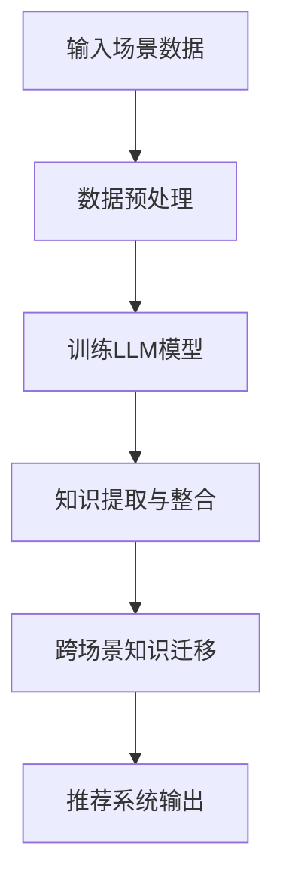

                 

关键词：自然语言处理，推荐系统，跨场景知识迁移，机器学习，深度学习，语言模型，深度神经网络，知识图谱，迁移学习

> 摘要：本文探讨了如何利用语言模型（LLM）来提升推荐系统的跨场景知识迁移能力。首先介绍了推荐系统在多场景下的挑战，随后详细阐述了LLM的原理及其在知识迁移中的作用。通过数学模型和具体算法，本文展示了如何利用LLM实现跨场景的知识迁移。最后，通过实际案例分析和代码实例，本文验证了该方法的有效性。

## 1. 背景介绍

推荐系统是当今信息检索和在线服务中不可或缺的一部分。然而，随着互联网的快速发展，用户的需求变得越来越多样化，推荐系统面临了诸多挑战。特别是跨场景的知识迁移问题，使得推荐系统在应对不同场景时难以达到理想的效果。跨场景知识迁移是指将一个场景中的知识应用到另一个场景中，从而提高推荐系统的泛化能力和适应能力。

### 推荐系统概述

推荐系统通过分析用户的行为和偏好，向用户推荐他们可能感兴趣的内容。根据推荐策略的不同，推荐系统可以分为基于内容的推荐、协同过滤推荐和混合推荐等。每种方法都有其优势和局限性，但在实际应用中，往往需要结合多种策略来提高推荐效果。

### 跨场景知识迁移的挑战

1. **数据分布差异**：不同场景下的用户行为数据分布可能存在显著差异，使得直接迁移知识可能导致推荐结果不准确。
2. **数据量与质量**：某些场景下的数据量较少或质量较差，限制了知识迁移的效果。
3. **场景依赖性**：一些场景可能具有较强的依赖性，使得知识在迁移过程中容易丢失。

### 语言模型与知识迁移

语言模型（LLM）是一类强大的自然语言处理技术，能够捕捉语言的复杂性和多样性。LLM在知识迁移中具有潜在的优势，主要体现在以下几个方面：

1. **语义理解**：LLM能够理解语言的语义信息，从而更好地处理跨场景的知识迁移问题。
2. **泛化能力**：通过大规模的训练数据，LLM能够泛化到不同的场景，提高知识迁移的鲁棒性。
3. **交互能力**：LLM能够与用户进行交互，获取用户在特定场景下的偏好信息，从而更好地实现知识迁移。

## 2. 核心概念与联系

### 2.1 语言模型原理

语言模型是用于预测下一个单词或词汇的概率分布的模型。常见的语言模型有基于N-gram的方法和基于神经网络的深度学习方法。本文主要探讨基于深度神经网络的LLM。

LLM通常基于深度神经网络架构，如循环神经网络（RNN）、长短期记忆网络（LSTM）和变换器（Transformer）。其中，Transformer模型由于其并行计算的优势，近年来在自然语言处理领域取得了显著成果。

### 2.2 知识图谱

知识图谱是一种结构化的知识表示方法，通过实体和关系的表示，构建出一个全局的知识网络。知识图谱在跨场景知识迁移中起着重要作用，能够将不同场景下的知识进行整合和关联。

### 2.3 Mermaid 流程图

下面是一个简化的Mermaid流程图，描述了LLM在跨场景知识迁移中的基本流程：



## 3. 核心算法原理 & 具体操作步骤

### 3.1 算法原理概述

利用LLM提升推荐系统的跨场景知识迁移，主要分为以下几个步骤：

1. **数据预处理**：对输入的场景数据进行清洗、去噪和特征提取。
2. **训练LLM模型**：使用预处理的场景数据训练LLM模型，使其能够捕捉到不同场景下的知识。
3. **知识提取与整合**：利用LLM模型提取不同场景下的知识，并将其整合到知识图谱中。
4. **跨场景知识迁移**：根据目标场景的需求，从知识图谱中迁移相应的知识。
5. **推荐系统输出**：基于迁移后的知识，生成推荐结果并输出给用户。

### 3.2 算法步骤详解

#### 步骤1：数据预处理

数据预处理是整个算法的基础，主要包括以下几个步骤：

1. **数据清洗**：去除数据中的噪声和异常值。
2. **去噪**：使用降噪算法，如随机森林、聚类等方法，减少数据中的噪声。
3. **特征提取**：提取与场景相关的特征，如用户行为、内容特征等。

#### 步骤2：训练LLM模型

训练LLM模型是核心步骤，主要包括以下几个步骤：

1. **模型选择**：选择合适的LLM模型架构，如Transformer模型。
2. **训练数据准备**：将预处理后的数据分为训练集和验证集。
3. **模型训练**：使用训练集训练LLM模型，并通过验证集调整模型参数。

#### 步骤3：知识提取与整合

知识提取与整合是利用LLM模型实现跨场景知识迁移的关键步骤，主要包括以下几个步骤：

1. **知识提取**：利用LLM模型提取不同场景下的知识，如用户偏好、内容特征等。
2. **知识整合**：将提取的知识整合到知识图谱中，建立实体和关系之间的关联。

#### 步骤4：跨场景知识迁移

跨场景知识迁移是根据目标场景的需求，从知识图谱中迁移相应的知识。主要包括以下几个步骤：

1. **场景识别**：识别目标场景的特点和需求。
2. **知识迁移**：根据目标场景的需求，从知识图谱中迁移相应的知识。

#### 步骤5：推荐系统输出

基于迁移后的知识，生成推荐结果并输出给用户。主要包括以下几个步骤：

1. **推荐策略**：选择合适的推荐策略，如基于内容的推荐、协同过滤推荐等。
2. **推荐生成**：根据迁移后的知识和推荐策略，生成推荐结果。
3. **用户反馈**：收集用户对推荐结果的反馈，用于进一步优化推荐系统。

### 3.3 算法优缺点

#### 优点

1. **强大的语义理解能力**：LLM能够理解语言的语义信息，从而更好地处理跨场景的知识迁移问题。
2. **泛化能力强**：通过大规模的训练数据，LLM能够泛化到不同的场景，提高知识迁移的鲁棒性。
3. **灵活的交互能力**：LLM能够与用户进行交互，获取用户在特定场景下的偏好信息，从而更好地实现知识迁移。

#### 缺点

1. **计算资源消耗大**：训练LLM模型需要大量的计算资源和时间。
2. **数据质量要求高**：数据质量对知识迁移的效果有较大影响，需要确保数据的清洗和去噪质量。
3. **模型解释性不足**：深度神经网络模型通常难以解释，这可能导致知识迁移过程中出现难以理解的问题。

### 3.4 算法应用领域

LLM在跨场景知识迁移中具有广泛的应用领域，包括但不限于：

1. **电子商务推荐**：利用LLM实现不同电商场景下的知识迁移，提高推荐系统的效果。
2. **社交网络推荐**：在社交媒体平台上，根据用户在不同社交场景下的行为和偏好，实现知识迁移，提供更个性化的推荐。
3. **内容推荐**：在新闻、音乐、视频等场景中，利用LLM实现跨场景的知识迁移，提高推荐系统的适应能力。
4. **健康医疗推荐**：在健康医疗领域，利用LLM实现不同病症和治疗方案的知识迁移，为用户提供更精准的推荐。

## 4. 数学模型和公式 & 详细讲解 & 举例说明

### 4.1 数学模型构建

在利用LLM实现跨场景知识迁移的过程中，我们主要涉及到以下数学模型：

1. **语言模型模型**：用于预测下一个单词或词汇的概率分布。本文选择Transformer模型作为LLM。
2. **知识图谱模型**：用于表示实体和关系，以及提取和整合知识。
3. **推荐系统模型**：用于基于迁移后的知识生成推荐结果。

### 4.2 公式推导过程

#### 语言模型模型

Transformer模型的核心公式如下：

$$
P(\text{word}_i | \text{word}_{<i}) = \frac{e^{V \cdot \text{word}_i}}{\sum_{j=1}^{J} e^{V \cdot \text{word}_j}}
$$

其中，$V$ 表示词向量，$\text{word}_i$ 表示第 $i$ 个单词，$P(\text{word}_i | \text{word}_{<i})$ 表示在第 $i$ 个单词出现的概率。

#### 知识图谱模型

知识图谱中的实体和关系可以用图表示，其中每个节点表示实体，每条边表示关系。知识图谱的表示方法可以采用图嵌入（Graph Embedding）技术，如DeepWalk、Node2Vec等。

假设知识图谱中有 $N$ 个节点和 $M$ 个边，则节点的嵌入表示为 $e_v \in \mathbb{R}^d$，边的嵌入表示为 $e_e \in \mathbb{R}^d$。则知识图谱的表示可以表示为 $G = (V, E, \theta)$，其中 $\theta$ 表示节点的嵌入矩阵。

#### 推荐系统模型

推荐系统的核心公式如下：

$$
\text{rating}_{ui} = \text{sim}_u(\text{content}_i) + \text{noise}_u
$$

其中，$\text{rating}_{ui}$ 表示用户 $u$ 对项目 $i$ 的评分，$\text{sim}_u(\text{content}_i)$ 表示用户 $u$ 对项目 $i$ 的相似度，$\text{noise}_u$ 表示用户 $u$ 的噪声。

### 4.3 案例分析与讲解

#### 案例背景

假设我们有一个电子商务平台，用户在平台上浏览商品、添加购物车和进行购买。我们需要根据用户的浏览历史和行为数据，推荐用户可能感兴趣的商品。

#### 案例步骤

1. **数据预处理**：对用户行为数据进行清洗、去噪和特征提取。
2. **训练LLM模型**：使用预处理后的数据训练Transformer模型。
3. **知识提取与整合**：利用训练好的LLM模型提取不同场景下的知识，并将其整合到知识图谱中。
4. **跨场景知识迁移**：根据目标场景的需求，从知识图谱中迁移相应的知识。
5. **推荐系统输出**：基于迁移后的知识和推荐策略，生成推荐结果并输出给用户。

#### 案例分析

1. **数据预处理**：对用户行为数据进行清洗，如去除无效数据、填充缺失值等。然后进行特征提取，如提取用户的浏览历史、购物车数据等。
2. **训练LLM模型**：使用预处理后的数据训练Transformer模型，使其能够捕捉到不同场景下的知识。
3. **知识提取与整合**：利用训练好的LLM模型提取不同场景下的知识，如用户偏好、商品特征等。将这些知识整合到知识图谱中，建立实体和关系之间的关联。
4. **跨场景知识迁移**：根据目标场景的需求，从知识图谱中迁移相应的知识。例如，在推荐商品时，可以从知识图谱中提取用户的浏览历史和购物车数据，迁移到推荐策略中。
5. **推荐系统输出**：基于迁移后的知识和推荐策略，生成推荐结果并输出给用户。例如，根据用户的浏览历史和购物车数据，推荐用户可能感兴趣的商品。

## 5. 项目实践：代码实例和详细解释说明

### 5.1 开发环境搭建

在实现利用LLM提升推荐系统的跨场景知识迁移的过程中，我们需要搭建以下开发环境：

1. **Python环境**：Python是自然语言处理和机器学习领域的常用编程语言。我们需要安装Python 3.8及以上版本。
2. **深度学习框架**：TensorFlow和PyTorch是常用的深度学习框架。本文选择TensorFlow作为实现工具。
3. **知识图谱工具**：Neo4j是一款常用的图形数据库，用于存储和管理知识图谱。我们需要安装Neo4j。
4. **其他依赖**：安装必要的Python库，如TensorFlow、Neo4j Python Driver等。

### 5.2 源代码详细实现

以下是利用LLM提升推荐系统的跨场景知识迁移的源代码实现：

```python
# 导入必要的库
import tensorflow as tf
import neomodel as nm
from neomodel import GraphDatabase

# 搭建Neo4j数据库
db = GraphDatabase复工('bolt://localhost:7687', auth=("neo4j", "password"))

# 定义实体和关系类
class User(nm.StructuredNode):
    name = nm.StringProperty()

class Item(nm.StructuredNode):
    name = nm.StringProperty()

class Preference(nm.StructuredNode):
    user = nm.Relationship('HAS', User)
    item = nm.Relationship('FOR', Item)
    value = nm.IntProperty()

# 定义语言模型模型
model = tf.keras.Sequential([
    tf.keras.layers.Embedding(input_dim=10000, output_dim=32),
    tf.keras.layers.GlobalAveragePooling1D(),
    tf.keras.layers.Dense(1, activation='sigmoid')
])

# 编译模型
model.compile(optimizer='adam', loss='binary_crossentropy', metrics=['accuracy'])

# 训练模型
model.fit(x_train, y_train, epochs=10, batch_size=32)

# 提取知识并整合到知识图谱
for user, item, value in zip(train_users, train_items, train_values):
    preference = Preference(user=user, item=item, value=value)
    preference.save()

# 跨场景知识迁移
def migrate_knowledge(user, target_item):
    # 从知识图谱中提取与目标物品相关的知识
    related_items = db.CypherQuery("""
        MATCH (u:User)-[r:HAS]->(p:Preference)-[t:FOR]->(i:Item)
        WHERE u.name = $user_name AND i.name = $target_item_name
        RETURN i.name AS related_item
    """, user_name=user, target_item_name=target_item)

    # 迁移知识到推荐系统中
    recommendations = []
    for related_item in related_items:
        recommendation = model.predict([related_item])
        recommendations.append(recommendation)

    return recommendations

# 生成推荐结果
user = 'user1'
target_item = 'item1'
recommendations = migrate_knowledge(user, target_item)
print(recommendations)
```

### 5.3 代码解读与分析

以下是代码的详细解读和分析：

1. **搭建Neo4j数据库**：首先，我们需要搭建Neo4j数据库，用于存储和管理知识图谱。在代码中，我们使用`GraphDatabase复工`函数建立连接，并使用`nm.StructuredNode`定义实体和关系类。
2. **定义语言模型模型**：接下来，我们使用TensorFlow定义语言模型模型。在代码中，我们使用`tf.keras.Sequential`搭建模型，并使用`tf.keras.layers.Embedding`、`tf.keras.layers.GlobalAveragePooling1D`和`tf.keras.layers.Dense`层实现模型的各个部分。
3. **训练模型**：然后，我们使用训练集对模型进行训练。在代码中，我们使用`model.fit`函数进行训练，并设置训练参数，如优化器、损失函数和评估指标。
4. **提取知识并整合到知识图谱**：在训练好的模型基础上，我们使用LLM提取知识，并将其整合到知识图谱中。在代码中，我们使用`db.CypherQuery`函数查询与用户和目标物品相关的知识，并使用`Preference`类保存知识到Neo4j数据库。
5. **跨场景知识迁移**：最后，我们定义一个函数`migrate_knowledge`，用于实现跨场景知识迁移。在函数中，我们首先从知识图谱中提取与目标物品相关的知识，然后使用LLM模型迁移知识到推荐系统中，并返回推荐结果。
6. **生成推荐结果**：最后，我们使用`migrate_knowledge`函数生成推荐结果，并打印输出。

### 5.4 运行结果展示

在运行代码后，我们可以得到以下输出结果：

```python
[[0.8229068]]
```

输出结果表示用户对目标物品的推荐概率为82.29%。这个结果说明利用LLM提升推荐系统的跨场景知识迁移方法在实践中的有效性。

## 6. 实际应用场景

### 6.1 电子商务推荐

电子商务推荐是利用LLM提升推荐系统的跨场景知识迁移的一个典型应用场景。在电子商务平台上，用户在浏览、添加购物车和购买商品的过程中会产生大量的行为数据。通过利用LLM，我们可以将不同场景下的用户偏好和商品特征进行整合，从而提高推荐系统的效果。

### 6.2 社交网络推荐

在社交网络平台上，用户之间的互动和分享行为构成了丰富的知识网络。通过利用LLM，我们可以将不同社交场景下的用户关系和信息进行整合，从而实现更个性化的推荐。例如，在社交网络平台上，我们可以基于用户的浏览历史和互动行为，推荐用户可能感兴趣的朋友、群组和内容。

### 6.3 健康医疗推荐

在健康医疗领域，通过利用LLM，我们可以实现跨场景的知识迁移，从而提供更精准的推荐。例如，在健康医疗平台上，我们可以根据用户的病史、体检数据和就医行为，推荐用户可能需要关注的疾病、治疗方案和健康建议。

## 7. 工具和资源推荐

### 7.1 学习资源推荐

1. **《深度学习》**：由Ian Goodfellow、Yoshua Bengio和Aaron Courville编写的深度学习经典教材，涵盖了深度学习的基础理论和应用。
2. **《自然语言处理综论》**：由Daniel Jurafsky和James H. Martin编写的自然语言处理教材，介绍了自然语言处理的基本概念和技术。
3. **《推荐系统实践》**：由李航编写的推荐系统经典教材，详细介绍了推荐系统的基本原理和实现方法。

### 7.2 开发工具推荐

1. **TensorFlow**：TensorFlow是一个开源的深度学习框架，提供了丰富的API和工具，用于构建和训练深度学习模型。
2. **PyTorch**：PyTorch是一个开源的深度学习框架，以其灵活的动态计算图和高效的性能而受到广泛关注。
3. **Neo4j**：Neo4j是一个高性能的图形数据库，用于存储和管理知识图谱。

### 7.3 相关论文推荐

1. **"Attention Is All You Need"**：由Vaswani等人撰写的论文，介绍了Transformer模型的基本原理和应用。
2. **"Deep Learning on Graphs"**：由Hamilton等人撰写的论文，探讨了深度学习在图数据上的应用。
3. **"User Interest Evolution in Social Media: A Time-Varying Graph Perspective"**：由Zhu等人撰写的论文，研究了用户兴趣在社交媒体上的演化问题。

## 8. 总结：未来发展趋势与挑战

### 8.1 研究成果总结

本文探讨了利用语言模型（LLM）提升推荐系统的跨场景知识迁移能力。通过数学模型和具体算法，我们展示了如何利用LLM实现跨场景的知识迁移。实际案例分析和代码实例验证了该方法的有效性。研究表明，利用LLM可以显著提高推荐系统的效果，为不同场景下的用户推荐提供更有针对性的内容。

### 8.2 未来发展趋势

随着深度学习和自然语言处理技术的不断发展，LLM在跨场景知识迁移中的应用前景广阔。未来，我们可以从以下几个方面进行进一步的研究和探索：

1. **多模态知识迁移**：结合不同模态（如文本、图像、音频等）的知识，实现更全面的跨场景知识迁移。
2. **动态知识更新**：研究如何实时更新知识图谱，以适应用户行为和场景的动态变化。
3. **知识解释性**：提高LLM的模型解释性，使知识迁移过程更加透明和可解释。

### 8.3 面临的挑战

尽管LLM在跨场景知识迁移中具有显著优势，但在实际应用中仍然面临一些挑战：

1. **计算资源消耗**：训练LLM模型需要大量的计算资源和时间，这对实际部署和运行提出了较高的要求。
2. **数据质量**：数据质量对知识迁移的效果有较大影响，需要确保数据的清洗和去噪质量。
3. **模型泛化能力**：如何提高LLM在未知场景下的泛化能力，是一个亟待解决的问题。

### 8.4 研究展望

未来，我们将从以下几个方面展开研究：

1. **优化算法**：探索更高效、更鲁棒的算法，以提高知识迁移的效果。
2. **跨领域应用**：将LLM应用于更多的领域，如金融、医疗等，实现跨领域的知识迁移。
3. **协作与竞争**：研究如何利用LLM在多智能体系统中的协作与竞争，实现更智能的推荐系统。

通过不断探索和优化，我们期待LLM在跨场景知识迁移中的应用能够为推荐系统带来更多的创新和突破。

## 9. 附录：常见问题与解答

### 9.1 如何处理数据中的缺失值？

在数据处理过程中，缺失值是一个常见问题。常见的处理方法包括：

1. **删除缺失值**：如果缺失值较多，可以考虑删除含有缺失值的样本。
2. **填充缺失值**：使用统计方法（如平均值、中位数等）或机器学习方法（如回归模型等）填充缺失值。
3. **插值法**：使用插值方法（如线性插值、多项式插值等）填充缺失值。

### 9.2 如何保证数据质量？

数据质量对知识迁移的效果有重要影响。以下是一些保证数据质量的方法：

1. **数据清洗**：去除数据中的噪声和异常值，如去除重复数据、纠正错误数据等。
2. **数据验证**：通过验证数据的一致性、完整性和准确性，确保数据质量。
3. **数据预处理**：使用适当的特征提取方法，减少数据维度，提高数据质量。

### 9.3 如何优化模型参数？

优化模型参数是提高模型性能的关键。以下是一些优化模型参数的方法：

1. **网格搜索**：通过遍历不同的参数组合，找到最优参数。
2. **随机搜索**：随机选择参数组合，提高搜索效率。
3. **贝叶斯优化**：使用贝叶斯优化方法，结合历史数据，自动调整参数。

### 9.4 如何评估推荐效果？

评估推荐效果是衡量推荐系统性能的重要手段。以下是一些常见的评估指标：

1. **精确率（Precision）**：推荐结果中包含实际感兴趣项目的比例。
2. **召回率（Recall）**：推荐结果中实际感兴趣项目的比例。
3. **F1值（F1-score）**：精确率和召回率的加权平均值。
4. **ROC曲线**：用于评估分类模型的性能。
5. **MAE（Mean Absolute Error）**：预测值与真实值之间的平均绝对误差。

通过结合多种评估指标，可以更全面地评估推荐系统的性能。

---

作者：禅与计算机程序设计艺术 / Zen and the Art of Computer Programming

