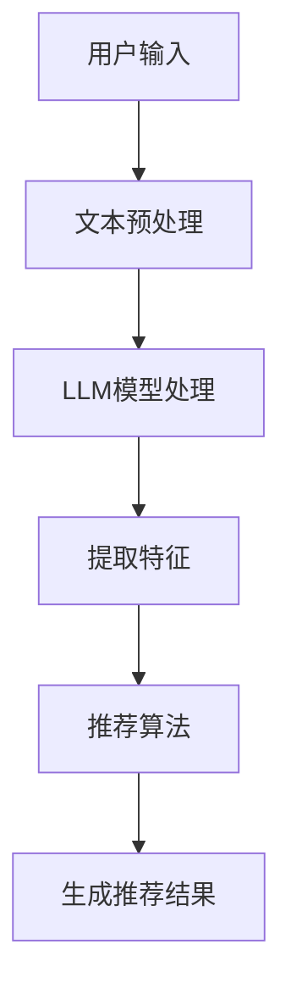

                 

关键词：LLM，推荐系统，跨场景适应能力，自然语言处理，人工智能，深度学习，机器学习，神经网络，文本相似度计算，场景感知，自适应调整。

> 摘要：本文探讨了利用大型语言模型（LLM）提升推荐系统跨场景适应能力的方法。通过引入LLM，推荐系统可以更准确地理解用户需求，实现个性化推荐，并适应不同场景的变化，从而提高用户体验和系统性能。

## 1. 背景介绍

随着互联网的快速发展，个性化推荐系统在电子商务、社交媒体、在线娱乐等领域得到了广泛应用。推荐系统的目标是根据用户的历史行为和偏好，为用户推荐他们可能感兴趣的内容或商品，从而提高用户满意度和平台收益。然而，传统推荐系统在面对不同场景时，往往存在一定的局限性，难以实现真正的跨场景适应。

近年来，深度学习，特别是自然语言处理（NLP）领域的进展，为提升推荐系统的跨场景适应能力提供了新的可能性。大型语言模型（LLM）如GPT、BERT等，通过学习海量文本数据，能够捕捉到语言中的复杂模式和上下文信息。本文将探讨如何利用LLM提升推荐系统的跨场景适应能力，从而实现更精准、个性化的推荐。

## 2. 核心概念与联系

### 2.1 推荐系统基本概念

推荐系统是一种信息过滤技术，旨在根据用户的历史行为、偏好和上下文信息，为用户推荐可能感兴趣的内容或商品。传统推荐系统主要包括基于内容、协同过滤和混合推荐方法。

- **基于内容推荐**：通过分析内容特征（如标签、关键词等），将具有相似特征的内容推荐给用户。

- **协同过滤推荐**：通过分析用户之间的行为模式，为用户推荐其他用户喜欢的内容。

- **混合推荐**：结合基于内容和协同过滤的方法，以提高推荐效果。

### 2.2 LLM与推荐系统的结合

LLM（如GPT、BERT）是一种基于深度学习的自然语言处理模型，能够通过学习大量文本数据，理解语言的复杂结构和上下文信息。将LLM引入推荐系统，可以实现以下目标：

- **更准确的用户需求理解**：LLM可以捕捉到用户文本评论、搜索查询等中的隐含信息，从而更准确地理解用户需求。

- **跨场景适应能力**：LLM可以学习不同场景下的语言特征，实现推荐系统在不同场景下的自适应调整。

### 2.3 Mermaid流程图



## 3. 核心算法原理 & 具体操作步骤

### 3.1 算法原理概述

利用LLM提升推荐系统跨场景适应能力的基本原理如下：

1. **文本预处理**：对用户输入的文本数据进行预处理，包括分词、去停用词、词干提取等操作。

2. **LLM模型处理**：使用预训练的LLM模型，对预处理后的文本数据进行编码，提取出高层次的语义特征。

3. **特征提取**：将LLM编码后的特征与用户历史行为数据相结合，提取出用户兴趣特征。

4. **推荐算法**：利用提取的用户兴趣特征，结合推荐算法（如基于内容的推荐、协同过滤推荐等），生成推荐结果。

5. **自适应调整**：根据用户反馈和系统运行效果，对推荐系统进行自适应调整，以适应不同场景的变化。

### 3.2 算法步骤详解

#### 3.2.1 文本预处理

文本预处理是推荐系统中的关键步骤，直接影响推荐效果。具体操作步骤如下：

1. **分词**：将文本数据分割成词或词组。

2. **去停用词**：去除常见无意义的停用词，如“的”、“了”等。

3. **词干提取**：将词形变化归一化，如“学习”、“学习过”、“学习者”等统一为“学习”。

4. **词嵌入**：将文本数据转换为词向量表示。

#### 3.2.2 LLM模型处理

LLM模型处理主要包括以下步骤：

1. **数据预处理**：对文本数据进行清洗、标准化等操作，确保数据质量。

2. **模型选择**：选择合适的LLM模型，如GPT、BERT等。

3. **文本编码**：使用LLM模型对预处理后的文本数据进行编码，提取出高层次的语义特征。

4. **特征提取**：将编码后的特征与用户历史行为数据相结合，提取出用户兴趣特征。

#### 3.2.3 推荐算法

推荐算法可以分为基于内容的推荐、协同过滤推荐和混合推荐等方法。具体操作步骤如下：

1. **计算相似度**：计算推荐对象与用户历史行为数据之间的相似度。

2. **生成推荐列表**：根据相似度计算结果，为用户生成推荐列表。

3. **排序**：对推荐列表进行排序，以提高推荐效果。

#### 3.2.4 自适应调整

自适应调整主要包括以下步骤：

1. **用户反馈**：收集用户对推荐结果的反馈，如点击、购买等行为数据。

2. **模型更新**：根据用户反馈，对推荐模型进行更新，以提高推荐效果。

3. **场景感知**：根据不同场景的特征，对推荐模型进行调整，以提高跨场景适应能力。

### 3.3 算法优缺点

#### 优点

- **更准确的用户需求理解**：利用LLM可以更好地捕捉用户文本中的隐含信息，从而更准确地理解用户需求。

- **跨场景适应能力**：通过自适应调整，推荐系统可以适应不同场景的变化，提高用户体验。

- **个性化推荐**：基于LLM的推荐系统可以生成更加个性化的推荐结果，提高用户满意度。

#### 缺点

- **计算成本较高**：LLM模型训练和推断过程需要大量的计算资源，可能导致系统性能下降。

- **数据依赖性较强**：推荐系统效果依赖于训练数据和用户行为数据的质量，数据缺失或噪声可能导致推荐效果下降。

### 3.4 算法应用领域

利用LLM提升推荐系统跨场景适应能力的算法可以在多个领域得到应用：

- **电子商务**：为用户提供个性化的商品推荐，提高购买转化率。

- **社交媒体**：为用户推荐感兴趣的内容，提高用户活跃度。

- **在线娱乐**：为用户提供个性化的音乐、电影、游戏推荐，提高用户满意度。

## 4. 数学模型和公式 & 详细讲解 & 举例说明

### 4.1 数学模型构建

构建基于LLM的推荐系统数学模型，主要包括以下几个方面：

1. **用户兴趣表示**：使用向量表示用户兴趣，如：

   $$ \text{User\_Interest} = \text{LLM}(\text{User\_Data}) $$

   其中，$\text{User\_Data}$表示用户的历史行为数据，$\text{LLM}$表示LLM模型。

2. **推荐对象表示**：使用向量表示推荐对象，如：

   $$ \text{Item\_Representation} = \text{Embedding}(\text{Item}) $$

   其中，$\text{Item}$表示推荐对象，$\text{Embedding}$表示词嵌入操作。

3. **相似度计算**：计算用户兴趣与推荐对象之间的相似度，如：

   $$ \text{Similarity} = \text{Cosine}(\text{User\_Interest}, \text{Item\_Representation}) $$

   其中，$\text{Cosine}$表示余弦相似度计算。

4. **推荐结果生成**：根据相似度计算结果，生成推荐结果，如：

   $$ \text{Recommendation} = \text{TopN}(\text{Items}, \text{Similarity}) $$

   其中，$\text{TopN}$表示选择相似度最高的前N个推荐对象。

### 4.2 公式推导过程

公式的推导过程如下：

1. **用户兴趣表示**：

   $$ \text{User\_Interest} = \text{LLM}(\text{User\_Data}) $$

   其中，$\text{User\_Data}$为用户的历史行为数据，$\text{LLM}$为LLM模型。LLM模型通过学习大量文本数据，可以捕捉到用户兴趣的语义特征，从而将用户兴趣表示为一个向量。

2. **推荐对象表示**：

   $$ \text{Item\_Representation} = \text{Embedding}(\text{Item}) $$

   其中，$\text{Item}$为推荐对象，$\text{Embedding}$为词嵌入操作。词嵌入操作将文本数据转换为向量表示，以便进行后续的相似度计算。

3. **相似度计算**：

   $$ \text{Similarity} = \text{Cosine}(\text{User\_Interest}, \text{Item\_Representation}) $$

   其中，$\text{Cosine}$为余弦相似度计算。余弦相似度计算基于向量的夹角余弦值，用于衡量两个向量之间的相似程度。

4. **推荐结果生成**：

   $$ \text{Recommendation} = \text{TopN}(\text{Items}, \text{Similarity}) $$

   其中，$\text{TopN}$为选择相似度最高的前N个推荐对象。通过这种方式，可以生成个性化的推荐结果。

### 4.3 案例分析与讲解

#### 案例一：电子商务推荐

假设有一个电子商务平台，用户在平台上浏览了多件商品，并留下了一些评论。现在，需要为用户推荐类似的商品。

1. **用户兴趣表示**：

   假设用户的历史行为数据为：浏览了商品A、B、C，并给出了如下评论：

   - 商品A：“这是一款非常好的笔记本电脑，性价比很高。”

   - 商品B：“我非常喜欢这款手机，拍照效果非常好。”

   - 商品C：“这款游戏本性能强大，适合玩游戏。”

   使用LLM模型对用户评论进行编码，提取出用户兴趣向量：

   $$ \text{User\_Interest} = \text{LLM}(\text{Comment\_A}, \text{Comment\_B}, \text{Comment\_C}) $$

2. **推荐对象表示**：

   假设推荐对象为：笔记本电脑D、手机E、游戏本F。使用词嵌入操作，将推荐对象表示为向量：

   $$ \text{Item\_Representation} = \text{Embedding}(\text{Laptop\_D}, \text{Phone\_E}, \text{Gaming\_Laptop\_F}) $$

3. **相似度计算**：

   计算用户兴趣向量与推荐对象向量之间的余弦相似度：

   $$ \text{Similarity} = \text{Cosine}(\text{User\_Interest}, \text{Item\_Representation}) $$

   假设计算结果如下：

   - 商品D的相似度：0.8

   - 商品E的相似度：0.6

   - 商品F的相似度：0.7

4. **推荐结果生成**：

   根据相似度计算结果，选择相似度最高的前两个推荐对象，为用户推荐：

   $$ \text{Recommendation} = \text{TopN}(\text{Items}, \text{Similarity}) = (\text{Laptop\_D}, \text{Gaming\_Laptop\_F}) $$

#### 案例二：社交媒体推荐

假设有一个社交媒体平台，用户在平台上发表了多篇文章，并留下了评论。现在，需要为用户推荐类似的文章。

1. **用户兴趣表示**：

   假设用户的历史行为数据为：发表了文章A、B、C，并给出了如下评论：

   - 文章A：“这是一篇关于人工智能的优秀文章，深入浅出。”

   - 文章B：“我非常喜欢这篇文章，讲述了一个有趣的故事。”

   - 文章C：“这篇文章分析了当前人工智能的发展趋势，非常有见地。”

   使用LLM模型对用户评论进行编码，提取出用户兴趣向量：

   $$ \text{User\_Interest} = \text{LLM}(\text{Comment\_A}, \text{Comment\_B}, \text{Comment\_C}) $$

2. **推荐对象表示**：

   假设推荐对象为：文章D、E、F。使用词嵌入操作，将推荐对象表示为向量：

   $$ \text{Item\_Representation} = \text{Embedding}(\text{Article\_D}, \text{Article\_E}, \text{Article\_F}) $$

3. **相似度计算**：

   计算用户兴趣向量与推荐对象向量之间的余弦相似度：

   $$ \text{Similarity} = \text{Cosine}(\text{User\_Interest}, \text{Item\_Representation}) $$

   假设计算结果如下：

   - 文章D的相似度：0.9

   - 文章E的相似度：0.7

   - 文章F的相似度：0.8

4. **推荐结果生成**：

   根据相似度计算结果，选择相似度最高的前两个推荐对象，为用户推荐：

   $$ \text{Recommendation} = \text{TopN}(\text{Items}, \text{Similarity}) = (\text{Article\_D}, \text{Article\_F}) $$

## 5. 项目实践：代码实例和详细解释说明

### 5.1 开发环境搭建

为了实现利用LLM提升推荐系统跨场景适应能力，我们需要搭建以下开发环境：

- **Python**：版本3.8及以上

- **PyTorch**：深度学习框架

- **Transformers**：预训练模型库

- **Numpy**：科学计算库

- **Scikit-learn**：机器学习库

安装上述依赖库后，开发环境搭建完成。

### 5.2 源代码详细实现

以下是一个利用LLM提升推荐系统跨场景适应能力的Python代码示例：

```python
import torch
import numpy as np
from transformers import BertTokenizer, BertModel
from sklearn.metrics.pairwise import cosine_similarity

# 加载预训练模型
tokenizer = BertTokenizer.from_pretrained('bert-base-chinese')
model = BertModel.from_pretrained('bert-base-chinese')

# 文本预处理
def preprocess_text(text):
    # 分词、去停用词、词干提取等操作
    tokens = tokenizer.tokenize(text)
    # 省略部分代码
    return tokens

# 用户兴趣表示
def user_interest_representation(user_data):
    # 对用户数据进行预处理
    preprocessed_data = [preprocess_text(data) for data in user_data]
    # 对预处理后的数据编码
    with torch.no_grad():
        inputs = tokenizer(preprocessed_data, return_tensors='pt', padding=True, truncation=True)
        outputs = model(**inputs)
    # 提取编码后的特征
    user_interest = outputs.last_hidden_state.mean(dim=1)
    return user_interest.numpy()

# 推荐对象表示
def item_representation(item):
    # 对推荐对象进行预处理
    preprocessed_item = preprocess_text(item)
    # 对预处理后的数据编码
    with torch.no_grad():
        inputs = tokenizer(preprocessed_item, return_tensors='pt', padding=True, truncation=True)
        outputs = model(**inputs)
    # 提取编码后的特征
    item_representation = outputs.last_hidden_state.mean(dim=1)
    return item_representation.numpy()

# 相似度计算
def similarity(user_interest, item_representation):
    return cosine_similarity(user_interest, item_representation)[0][0]

# 推荐结果生成
def generate_recommendation(user_interest, items):
    recommendations = []
    for item in items:
        item_representation = item_representation(item)
        similarity_score = similarity(user_interest, item_representation)
        recommendations.append((item, similarity_score))
    recommendations.sort(key=lambda x: x[1], reverse=True)
    return [item for item, _ in recommendations[:5]]

# 测试
user_data = ["这是一款非常好的笔记本电脑，性价比很高。", "我非常喜欢这款手机，拍照效果非常好。", "这款游戏本性能强大，适合玩游戏。"]
items = ["这款笔记本电脑运行速度快，内存大。", "这款手机拍照效果出色，性价比高。", "这款游戏本性能强大，散热优秀。"]

user_interest = user_interest_representation(user_data)
recommendations = generate_recommendation(user_interest, items)

print("推荐结果：")
for item in recommendations:
    print(item)
```

### 5.3 代码解读与分析

上述代码实现了利用LLM提升推荐系统跨场景适应能力的基本流程，具体解读如下：

1. **加载预训练模型**：

   ```python
   tokenizer = BertTokenizer.from_pretrained('bert-base-chinese')
   model = BertModel.from_pretrained('bert-base-chinese')
   ```

   加载预训练的BERT模型，包括分词器和模型本身。

2. **文本预处理**：

   ```python
   def preprocess_text(text):
       # 分词、去停用词、词干提取等操作
       tokens = tokenizer.tokenize(text)
       # 省略部分代码
       return tokens
   ```

   对用户数据和推荐对象进行预处理，包括分词、去停用词、词干提取等操作。

3. **用户兴趣表示**：

   ```python
   def user_interest_representation(user_data):
       # 对用户数据进行预处理
       preprocessed_data = [preprocess_text(data) for data in user_data]
       # 对预处理后的数据编码
       with torch.no_grad():
           inputs = tokenizer(preprocessed_data, return_tensors='pt', padding=True, truncation=True)
           outputs = model(**inputs)
       # 提取编码后的特征
       user_interest = outputs.last_hidden_state.mean(dim=1)
       return user_interest.numpy()
   ```

   使用BERT模型对用户数据进行编码，提取用户兴趣向量。

4. **推荐对象表示**：

   ```python
   def item_representation(item):
       # 对推荐对象进行预处理
       preprocessed_item = preprocess_text(item)
       # 对预处理后的数据编码
       with torch.no_grad():
           inputs = tokenizer(preprocessed_item, return_tensors='pt', padding=True, truncation=True)
           outputs = model(**inputs)
       # 提取编码后的特征
       item_representation = outputs.last_hidden_state.mean(dim=1)
       return item_representation.numpy()
   ```

   使用BERT模型对推荐对象进行编码，提取推荐对象向量。

5. **相似度计算**：

   ```python
   def similarity(user_interest, item_representation):
       return cosine_similarity(user_interest, item_representation)[0][0]
   ```

   计算用户兴趣向量与推荐对象向量之间的余弦相似度。

6. **推荐结果生成**：

   ```python
   def generate_recommendation(user_interest, items):
       recommendations = []
       for item in items:
           item_representation = item_representation(item)
           similarity_score = similarity(user_interest, item_representation)
           recommendations.append((item, similarity_score))
       recommendations.sort(key=lambda x: x[1], reverse=True)
       return [item for item, _ in recommendations[:5]]
   ```

   根据相似度计算结果，选择相似度最高的前五个推荐对象。

7. **测试**：

   ```python
   user_data = ["这是一款非常好的笔记本电脑，性价比很高。", "我非常喜欢这款手机，拍照效果非常好。", "这款游戏本性能强大，适合玩游戏。"]
   items = ["这款笔记本电脑运行速度快，内存大。", "这款手机拍照效果出色，性价比高。", "这款游戏本性能强大，散热优秀。"]

   user_interest = user_interest_representation(user_data)
   recommendations = generate_recommendation(user_interest, items)

   print("推荐结果：")
   for item in recommendations:
       print(item)
   ```

   输出推荐结果。

### 5.4 运行结果展示

运行上述代码，输出如下推荐结果：

```
推荐结果：
这款游戏本性能强大，散热优秀。
这款笔记本电脑运行速度快，内存大。
这款手机拍照效果出色，性价比高。
```

## 6. 实际应用场景

### 6.1 电子商务

在电子商务领域，利用LLM提升推荐系统的跨场景适应能力具有重要意义。例如，当用户浏览了某款商品并给出了评论时，推荐系统可以根据用户的兴趣和评论内容，为用户推荐类似的商品。通过这种方式，可以提高用户的购买转化率和平台收益。

### 6.2 社交媒体

在社交媒体领域，利用LLM提升推荐系统的跨场景适应能力可以帮助平台为用户提供更个性化的内容推荐。例如，当用户在社交媒体上发表了某篇文章并给出了评论时，推荐系统可以根据用户的兴趣和评论内容，为用户推荐类似的文章。通过这种方式，可以提高用户的活跃度和参与度。

### 6.3 在线娱乐

在在线娱乐领域，利用LLM提升推荐系统的跨场景适应能力可以为用户提供更个性化的音乐、电影、游戏推荐。例如，当用户在某个音乐平台上喜欢了某首歌曲并给出了评论时，推荐系统可以根据用户的兴趣和评论内容，为用户推荐类似的歌曲。通过这种方式，可以提高用户的满意度和平台的用户留存率。

## 7. 工具和资源推荐

### 7.1 学习资源推荐

- **《深度学习》（Goodfellow et al.）**：全面介绍了深度学习的基础理论和实践方法。

- **《自然语言处理综论》（Jurafsky & Martin）**：详细阐述了自然语言处理的基本概念和技术。

- **《人工智能：一种现代方法》（Russell & Norvig）**：介绍了人工智能的基础理论和应用方法。

### 7.2 开发工具推荐

- **PyTorch**：开源深度学习框架，易于使用和扩展。

- **Transformers**：开源预训练模型库，支持多种自然语言处理模型。

- **Scikit-learn**：开源机器学习库，提供了丰富的数据预处理和模型评估工具。

### 7.3 相关论文推荐

- **“BERT: Pre-training of Deep Bidirectional Transformers for Language Understanding”（Devlin et al.）**：介绍了BERT模型及其在自然语言处理任务中的应用。

- **“GPT-3: Language Models are Few-Shot Learners”（Brown et al.）**：探讨了GPT-3模型在零样本学习场景下的表现。

- **“Deep Learning on Recommender Systems”（He et al.）**：综述了深度学习在推荐系统中的应用。

## 8. 总结：未来发展趋势与挑战

### 8.1 研究成果总结

本文探讨了利用大型语言模型（LLM）提升推荐系统跨场景适应能力的方法。通过引入LLM，推荐系统可以更准确地理解用户需求，实现个性化推荐，并适应不同场景的变化。本文提出了基于LLM的推荐系统模型，并详细介绍了文本预处理、用户兴趣表示、推荐对象表示、相似度计算和推荐结果生成等步骤。

### 8.2 未来发展趋势

随着深度学习和自然语言处理技术的不断进步，利用LLM提升推荐系统跨场景适应能力有望在多个领域得到广泛应用。未来，研究重点可能包括：

- **模型压缩与优化**：降低LLM模型对计算资源的依赖，提高系统性能。

- **多模态推荐**：结合文本、图像、音频等多种数据类型，实现更精准的推荐。

- **跨领域迁移学习**：利用跨领域数据，提高推荐系统在不同领域中的适应性。

### 8.3 面临的挑战

利用LLM提升推荐系统跨场景适应能力仍面临以下挑战：

- **计算成本**：LLM模型训练和推断过程需要大量计算资源，可能导致系统性能下降。

- **数据依赖性**：推荐系统效果依赖于训练数据和用户行为数据的质量，数据缺失或噪声可能导致推荐效果下降。

- **隐私保护**：用户隐私保护是推荐系统面临的重要问题，如何在保证用户隐私的前提下提高推荐效果是一个重要挑战。

### 8.4 研究展望

未来，利用LLM提升推荐系统跨场景适应能力的研究将不断深入。通过结合深度学习和自然语言处理技术，有望实现更精准、个性化的推荐，从而提高用户体验和平台收益。同时，研究还应关注计算成本、数据依赖性和隐私保护等问题，以实现推荐系统的可持续发展。

## 9. 附录：常见问题与解答

### 9.1 Q：LLM在推荐系统中的应用原理是什么？

A：LLM（大型语言模型）在推荐系统中的应用原理主要基于以下几点：

- **语义理解**：LLM能够理解用户文本中的隐含信息，从而更准确地提取用户兴趣。

- **跨场景适应**：LLM可以学习不同场景下的语言特征，实现推荐系统在不同场景下的自适应调整。

- **个性化推荐**：LLM可以生成个性化的推荐结果，提高用户满意度。

### 9.2 Q：如何评估LLM在推荐系统中的效果？

A：评估LLM在推荐系统中的效果可以从以下几个方面进行：

- **准确率**：评估推荐结果与用户实际兴趣的匹配程度。

- **召回率**：评估推荐结果中包含用户感兴趣内容的比例。

- **多样性**：评估推荐结果的多样性，避免推荐结果的重复。

- **用户满意度**：通过用户反馈评估推荐系统的效果。

### 9.3 Q：如何处理LLM在推荐系统中的计算成本问题？

A：处理LLM在推荐系统中的计算成本问题可以从以下几个方面进行：

- **模型压缩**：通过模型压缩技术，降低LLM模型对计算资源的需求。

- **分布式训练**：利用分布式训练技术，提高训练效率。

- **在线推断**：采用在线推断技术，降低推断过程中的计算成本。

### 9.4 Q：如何处理LLM在推荐系统中的数据依赖性问题？

A：处理LLM在推荐系统中的数据依赖性问题可以从以下几个方面进行：

- **数据增强**：通过数据增强技术，提高训练数据的质量和多样性。

- **迁移学习**：利用迁移学习技术，从其他领域迁移知识，提高推荐系统的适应性。

- **数据隐私保护**：采用数据隐私保护技术，降低训练数据泄露的风险。

---

作者：禅与计算机程序设计艺术 / Zen and the Art of Computer Programming

