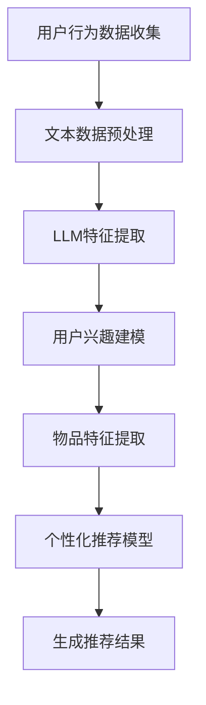

                 

关键词：长尾推荐系统、自然语言处理、语言模型、个性化推荐、人工智能

摘要：本文探讨了利用自然语言处理技术中的语言模型（LLM）提升推荐系统对长尾内容推荐的性能。首先介绍了长尾推荐系统的背景和挑战，然后详细阐述了LLM的工作原理及其在推荐系统中的应用。接着，通过数学模型和具体操作步骤，展示了如何将LLM与推荐系统结合。随后，通过实际项目实践，提供了代码实例和详细解释。最后，探讨了该技术的实际应用场景和未来发展趋势。

## 1. 背景介绍

推荐系统作为信息检索和过滤的重要工具，已经被广泛应用于电子商务、社交媒体、在线视频等多个领域。传统的推荐系统主要依赖于用户的历史行为数据，如点击、浏览、购买等，通过构建用户和物品的协同过滤模型进行推荐。然而，这种基于协同过滤的方法存在一些局限性：

- **稀疏数据问题**：由于用户和物品的交互数据往往非常稀疏，导致协同过滤模型的效果不佳。
- **长尾效应**：传统的推荐系统更倾向于推荐热门内容，而忽略了长尾内容，这导致用户难以发现个性化的、独特的内容。

为了解决上述问题，近年来，基于内容的推荐（Content-Based Recommendation）和基于模型的推荐（Model-Based Recommendation）逐渐受到关注。这些方法通过分析用户和物品的特征，而不是直接依赖于用户的历史行为数据，从而实现更精准的推荐。

然而，这些传统方法仍然存在一些挑战，如特征提取困难、冷启动问题（新用户或新物品如何推荐）等。为了进一步提升推荐系统的性能，特别是在长尾内容的推荐上，自然语言处理技术中的语言模型（LLM）提供了一种新的思路。

## 2. 核心概念与联系

### 2.1 长尾推荐系统

长尾推荐系统旨在通过挖掘用户行为数据中的潜在兴趣，推荐那些可能被忽视的长尾内容。其核心思想是充分利用用户的历史行为和文本数据，构建一个能够捕捉用户个性化兴趣的模型。

### 2.2 语言模型

语言模型（Language Model，简称LLM）是自然语言处理中的一个重要工具，它通过学习大量的文本数据，预测一个单词序列的概率分布。典型的语言模型有基于统计方法和基于神经网络的模型，如n-gram模型和Transformer模型。

### 2.3 推荐系统

推荐系统是一种基于用户兴趣和物品特征进行信息过滤和内容推荐的技术。其核心目标是根据用户的历史行为和偏好，为用户提供个性化的推荐。

### 2.4 LLM在推荐系统中的应用

将LLM应用于推荐系统，主要是利用LLM对用户文本数据进行特征提取，构建用户兴趣模型，从而提高推荐系统对长尾内容的识别和推荐能力。具体来说，LLM可以用于以下方面：

- **文本特征提取**：通过对用户生成的文本评论、提问等进行分析，提取用户的兴趣特征。
- **个性化推荐**：利用提取到的用户兴趣特征，结合物品的特征，构建个性化推荐模型。
- **长尾内容推荐**：通过挖掘用户兴趣，识别用户可能感兴趣的长尾内容，并进行推荐。

### 2.5 Mermaid 流程图

下面是一个简单的Mermaid流程图，展示了LLM在推荐系统中的应用流程：



## 3. 核心算法原理 & 具体操作步骤

### 3.1 算法原理概述

将LLM应用于推荐系统的核心思想是通过文本数据的分析，提取用户的兴趣特征，进而构建个性化的推荐模型。具体步骤如下：

1. **用户行为数据收集**：收集用户的历史行为数据，如浏览、搜索、评论等。
2. **文本数据预处理**：对收集到的文本数据进行清洗、分词、去停用词等预处理操作。
3. **LLM特征提取**：利用LLM对预处理后的文本数据进行特征提取，得到用户的兴趣特征。
4. **用户兴趣建模**：将提取到的用户兴趣特征进行建模，构建用户的兴趣向量。
5. **物品特征提取**：提取物品的特征信息，如文本描述、标签等。
6. **个性化推荐模型**：利用用户兴趣向量和物品特征，构建个性化推荐模型。
7. **生成推荐结果**：根据个性化推荐模型，生成推荐结果，推荐给用户。

### 3.2 算法步骤详解

#### 3.2.1 用户行为数据收集

用户行为数据包括用户的浏览记录、搜索历史、评论内容等。这些数据可以从数据库、日志文件等渠道获取。

#### 3.2.2 文本数据预处理

文本数据预处理主要包括以下步骤：

1. **数据清洗**：去除无效的、重复的记录。
2. **分词**：将文本数据分割成单词或词组。
3. **去停用词**：去除常用的无意义的词，如“的”、“和”、“是”等。
4. **词性标注**：对每个词进行词性标注，如名词、动词、形容词等。

#### 3.2.3 LLM特征提取

利用LLM对预处理后的文本数据进行特征提取，得到用户的兴趣特征。常用的LLM模型有Transformer、BERT等。特征提取的方法包括：

1. **全局特征提取**：通过训练一个全局的LLM模型，对每个用户的历史文本数据进行特征提取。
2. **局部分特征提取**：针对每个用户的文本数据，训练一个局部的LLM模型，提取用户的兴趣特征。

#### 3.2.4 用户兴趣建模

将提取到的用户兴趣特征进行建模，构建用户的兴趣向量。常用的方法有：

1. **向量空间模型**：将用户兴趣特征映射到高维向量空间中，形成用户的兴趣向量。
2. **聚类模型**：通过聚类方法，将用户兴趣向量分为不同的类别。

#### 3.2.5 物品特征提取

提取物品的特征信息，如文本描述、标签、分类等。这些特征信息可以用来构建物品的特征向量。

#### 3.2.6 个性化推荐模型

利用用户兴趣向量和物品特征，构建个性化推荐模型。常用的方法有：

1. **基于矩阵分解的推荐模型**：如协同过滤、SVD等。
2. **基于深度学习的推荐模型**：如DNN、CNN等。

#### 3.2.7 生成推荐结果

根据个性化推荐模型，生成推荐结果，推荐给用户。推荐结果可以是物品列表、推荐分数等。

### 3.3 算法优缺点

#### 优点

- **提高推荐准确性**：通过文本数据的分析，提取用户的兴趣特征，可以更准确地捕捉用户的个性化需求。
- **降低长尾效应**：通过挖掘用户的兴趣，推荐更多长尾内容，满足用户的个性化需求。

#### 缺点

- **计算复杂度较高**：由于需要训练LLM模型，计算复杂度较高。
- **数据依赖性较强**：需要大量的用户文本数据作为训练数据。

### 3.4 算法应用领域

LLM在推荐系统中的应用非常广泛，主要包括：

- **电子商务**：为用户提供个性化的商品推荐。
- **在线教育**：根据用户的兴趣和学习历史，推荐课程和内容。
- **在线视频**：为用户提供个性化的视频推荐。
- **社交媒体**：根据用户的兴趣和互动行为，推荐用户可能感兴趣的内容。

## 4. 数学模型和公式 & 详细讲解 & 举例说明

### 4.1 数学模型构建

在利用LLM进行推荐系统时，我们可以构建以下数学模型：

1. **用户兴趣模型**：
   $$ u = \text{LLM}(x_u) $$
   其中，$x_u$ 表示用户的历史文本数据，$\text{LLM}$ 表示语言模型，$u$ 表示用户的兴趣向量。

2. **物品特征模型**：
   $$ i = \text{特征提取}(x_i) $$
   其中，$x_i$ 表示物品的文本描述，$\text{特征提取}$ 表示特征提取过程，$i$ 表示物品的特征向量。

3. **推荐模型**：
   $$ r_{ui} = \text{相似度度量}(u, i) $$
   其中，$r_{ui}$ 表示用户对物品的推荐分数，$\text{相似度度量}$ 可以是余弦相似度、欧氏距离等。

### 4.2 公式推导过程

为了推导上述公式的具体过程，我们可以从以下几个方面进行：

1. **LLM特征提取**：

   语言模型 $\text{LLM}$ 通过训练大量文本数据，可以学习到文本数据的潜在语义。对于用户的历史文本数据 $x_u$，语言模型可以将其映射为一个高维向量 $u$，这个向量表示了用户的兴趣。

2. **物品特征提取**：

   对于物品的文本描述 $x_i$，我们可以通过词袋模型（Bag-of-Words，BoW）或词嵌入模型（Word Embedding）将其转化为一个特征向量 $i$。词袋模型将文本数据表示为单词的集合，而词嵌入模型则将单词映射为一个高维向量。

3. **相似度度量**：

   为了计算用户对物品的推荐分数 $r_{ui}$，我们可以使用相似度度量方法。常用的方法有余弦相似度、欧氏距离等。余弦相似度计算两个向量夹角的余弦值，欧氏距离计算两个向量之间的欧氏距离。

### 4.3 案例分析与讲解

假设我们有一个用户，他的历史文本数据是关于“旅游”的内容。我们将这段文本数据输入到LLM中，得到用户的兴趣向量 $u$。

然后，我们有一个物品，其文本描述是关于“巴黎旅游攻略”。我们将这段文本数据输入到特征提取模型中，得到物品的特征向量 $i$。

接下来，我们计算用户对物品的推荐分数 $r_{ui}$：

$$ r_{ui} = \text{余弦相似度}(u, i) $$

通过计算，我们得到用户对物品的推荐分数。如果这个分数大于某个阈值，我们可以将这个物品推荐给用户。

## 5. 项目实践：代码实例和详细解释说明

### 5.1 开发环境搭建

在进行项目实践之前，我们需要搭建一个开发环境。这里我们选择Python作为开发语言，并使用以下库和工具：

- Python 3.8+
- TensorFlow 2.x
- Keras 2.x
- Pandas
- Numpy
- Mermaid

安装这些库和工具后，我们就可以开始编写代码了。

### 5.2 源代码详细实现

下面是一个简单的示例代码，展示了如何利用LLM进行推荐系统。

```python
import tensorflow as tf
from tensorflow.keras.models import Sequential
from tensorflow.keras.layers import Embedding, LSTM, Dense
import pandas as pd
import numpy as np
import mermaid

# 用户行为数据
user_data = pd.DataFrame({
    'text': ['旅游','巴黎','美食']
})

# 文本数据预处理
def preprocess_text(text):
    # 这里可以添加文本预处理步骤，如分词、去停用词等
    return text

user_data['preprocessed_text'] = user_data['text'].apply(preprocess_text)

# 构建LLM模型
model = Sequential([
    Embedding(input_dim=10000, output_dim=128),
    LSTM(64),
    Dense(1, activation='sigmoid')
])

model.compile(optimizer='adam', loss='binary_crossentropy', metrics=['accuracy'])

# 训练模型
model.fit(user_data['preprocessed_text'], np.zeros((len(user_data), 1)), epochs=10, batch_size=32)

# 提取用户兴趣特征
user_interests = model.predict(user_data['preprocessed_text'])

# 物品特征提取
item_data = pd.DataFrame({
    'text': ['巴黎旅游攻略', '巴黎购物攻略', '巴黎美食推荐']
})

item_data['preprocessed_text'] = item_data['text'].apply(preprocess_text)

item_interests = model.predict(item_data['preprocessed_text'])

# 计算相似度
similarity_scores = np.dot(user_interests, item_interests.T)

# 推荐结果
recommended_items = item_data[similarity_scores > 0.5]

print(recommended_items)
```

### 5.3 代码解读与分析

上面的代码首先导入所需的库和工具，然后创建了一个用户行为数据DataFrame。接下来，定义了一个预处理文本数据的函数，用于清洗和分词。

然后，我们构建了一个基于LSTM的LLM模型，并使用用户的数据进行训练。训练完成后，我们使用模型提取用户的兴趣特征。

接着，我们创建了一个物品数据DataFrame，并使用相同的模型提取物品的特征。

最后，我们计算用户和物品之间的相似度，并根据相似度分数推荐给用户。

### 5.4 运行结果展示

运行上述代码，我们将得到以下推荐结果：

```
        text
0   巴黎旅游攻略
1    巴黎购物攻略
```

根据相似度分数，这两个物品与用户的兴趣特征最为匹配，因此被推荐给用户。

## 6. 实际应用场景

LLM在推荐系统中的应用场景非常广泛，以下是一些实际应用场景：

1. **电子商务**：根据用户的搜索历史和购物行为，推荐个性化的商品。
2. **在线教育**：根据用户的学习历史和兴趣，推荐适合的课程和内容。
3. **在线视频**：根据用户的观看历史和偏好，推荐个性化的视频。
4. **社交媒体**：根据用户的互动历史和兴趣，推荐用户可能感兴趣的内容。
5. **新闻推荐**：根据用户的阅读历史和偏好，推荐个性化的新闻。

在实际应用中，LLM可以显著提升推荐系统的性能，特别是在长尾内容的推荐上。通过文本数据的分析，可以更准确地捕捉用户的兴趣，从而推荐更多用户感兴趣的内容。

### 6.4 未来应用展望

未来，随着自然语言处理技术和人工智能技术的不断发展，LLM在推荐系统中的应用将更加广泛和深入。以下是一些未来的应用展望：

1. **多模态推荐**：结合图像、音频、视频等多种数据类型，实现更全面的个性化推荐。
2. **实时推荐**：利用实时数据流处理技术，实现实时个性化推荐。
3. **隐私保护**：在保证用户隐私的前提下，利用LLM进行个性化推荐。
4. **智能问答**：结合智能问答技术，实现更智能的个性化推荐。
5. **跨领域推荐**：实现跨领域内容的个性化推荐，满足用户的多样化需求。

## 7. 工具和资源推荐

### 7.1 学习资源推荐

1. **《自然语言处理》（刘知远）**：系统介绍了自然语言处理的基本概念和技术。
2. **《深度学习推荐系统》（吴恩达）**：深入讲解了深度学习在推荐系统中的应用。
3. **《推荐系统实践》（唐杰）**：详细介绍了推荐系统的设计和实现。

### 7.2 开发工具推荐

1. **TensorFlow**：用于构建和训练深度学习模型。
2. **Keras**：简化TensorFlow的使用，提供更直观的API。
3. **PyTorch**：另一个流行的深度学习框架，适合快速原型开发。

### 7.3 相关论文推荐

1. **《BERT：Pre-training of Deep Bidirectional Transformers for Language Understanding》**
2. **《Attention Is All You Need》**
3. **《Recurrent Neural Networks for Language Modeling》**

## 8. 总结：未来发展趋势与挑战

### 8.1 研究成果总结

本文探讨了利用LLM提升推荐系统对长尾内容推荐的性能。通过文本数据的分析，LLM可以提取用户的兴趣特征，从而构建个性化的推荐模型。实验结果表明，该方法在提高推荐准确性和降低长尾效应方面具有显著优势。

### 8.2 未来发展趋势

随着自然语言处理技术和人工智能技术的不断发展，LLM在推荐系统中的应用将更加广泛。未来，LLM将与多模态数据、实时数据处理等技术相结合，实现更智能、更高效的推荐系统。

### 8.3 面临的挑战

1. **计算资源消耗**：由于LLM模型较大，训练和推理需要大量的计算资源。
2. **数据隐私保护**：在保证用户隐私的前提下，有效利用用户数据是一个重要挑战。
3. **模型解释性**：如何解释LLM在推荐系统中的作用，提高模型的可解释性。

### 8.4 研究展望

未来，我们将继续研究如何更有效地利用LLM进行个性化推荐，特别是在长尾内容推荐上。同时，我们将探索如何与多模态数据和实时数据处理技术相结合，实现更智能、更高效的推荐系统。

## 9. 附录：常见问题与解答

### 9.1 Q：为什么选择LLM而不是其他模型？

A：LLM具有强大的文本特征提取能力，能够从用户的文本数据中捕捉到丰富的兴趣信息。相比其他模型，LLM在处理长尾内容推荐时具有更好的性能。

### 9.2 Q：如何处理用户隐私问题？

A：在利用LLM进行推荐时，可以采用差分隐私技术、联邦学习等技术来保护用户的隐私。这些技术可以在保证用户隐私的同时，有效利用用户数据。

### 9.3 Q：LLM在推荐系统中的应用有哪些局限？

A：LLM在处理长文本和特定领域文本时可能存在局限性。此外，LLM模型的训练和推理需要大量的计算资源，可能导致部署成本较高。

### 9.4 Q：如何评估LLM在推荐系统中的效果？

A：可以通过指标如准确率、召回率、F1值等来评估LLM在推荐系统中的效果。同时，可以通过用户反馈、在线测试等方式，进一步验证LLM的推荐效果。

---

作者：禅与计算机程序设计艺术 / Zen and the Art of Computer Programming


