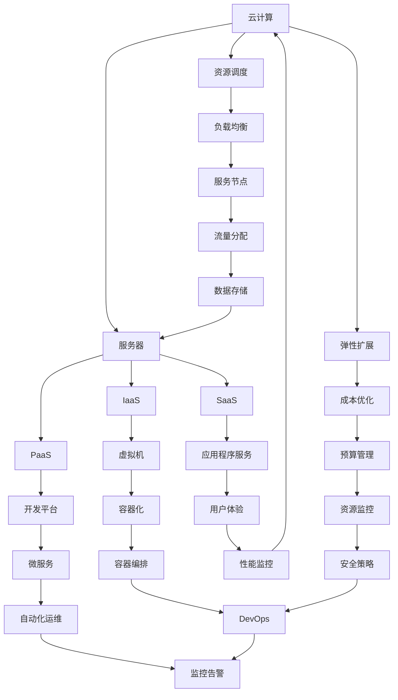

                 

关键词：云计算、创业自动化、技术架构、AI、服务器、资源调度、弹性扩展、SaaS、PaaS、IaaS、负载均衡、容器化、微服务、DevOps、容器编排、自动化运维、成本优化

> 摘要：本文将探讨如何利用云计算技术实现创业项目的自动化，包括核心概念、算法原理、数学模型、实践案例和未来应用前景。通过分析云计算在创业中的应用，帮助创业者更好地理解和运用云计算技术，实现高效、低成本、灵活的创业自动化。

## 1. 背景介绍

在当今数字化时代，云计算已成为创业公司快速发展的关键推动力。云计算技术通过提供可扩展的计算资源和服务，使创业公司能够以低成本、高效率的方式开展业务。利用云计算，创业者可以在无需大量资本投入的情况下，快速搭建和部署应用程序，进行市场验证和产品迭代。此外，云计算的弹性扩展能力使得创业公司能够根据业务需求动态调整资源，实现成本优化。

### 1.1 云计算的定义

云计算（Cloud Computing）是指通过互联网以服务的形式提供计算资源，包括存储、处理、网络等。云计算服务通常分为三类：基础设施即服务（IaaS）、平台即服务（PaaS）和软件即服务（SaaS）。IaaS提供基础计算资源，如虚拟机、存储等；PaaS提供开发平台和中间件；SaaS提供应用程序服务。

### 1.2 云计算的优势

- **成本效益**：云计算通过按需付费的方式，降低创业公司的初始投资和运营成本。
- **弹性扩展**：云计算可以根据业务需求动态调整资源，满足快速变化的市场需求。
- **高可用性**：云计算提供高可靠性的服务，确保业务连续性和数据安全。
- **全球访问**：云计算服务具有全球性，支持跨国业务的快速扩展。

### 1.3 云计算在创业中的应用

- **敏捷开发**：云计算提供快速搭建和部署开发环境的能力，支持敏捷开发模式。
- **测试与上线**：云计算提供灵活的测试环境和上线流程，缩短产品上市时间。
- **数据处理与分析**：云计算提供强大的数据处理和分析工具，支持大数据分析和机器学习。

## 2. 核心概念与联系

在探讨云计算实现创业自动化的过程中，我们需要了解一些核心概念和它们之间的联系。以下是一个简化的 Mermaid 流程图，用于展示这些概念：



### 2.1 核心概念解析

- **服务器**：提供计算资源的实体，可以是物理服务器或虚拟机。
- **资源调度**：根据业务需求动态分配和调整服务器资源的过程。
- **弹性扩展**：根据实际负载自动增加或减少服务器数量，以保持系统性能。
- **基础设施即服务（IaaS）**：提供虚拟化计算资源，如虚拟机、存储等。
- **平台即服务（PaaS）**：提供开发平台和中间件，简化应用开发和部署。
- **软件即服务（SaaS）**：提供应用程序服务，如企业级应用、邮件服务等。
- **负载均衡**：将流量分配到多个服务器，提高系统可用性和性能。
- **容器化**：将应用程序及其依赖打包到容器中，实现快速部署和隔离。
- **微服务**：将大型应用程序拆分为小型、独立的服务，提高可维护性和扩展性。
- **自动化运维**：通过自动化工具实现系统部署、监控、故障修复等任务。
- **DevOps**：结合开发（Dev）和运维（Ops），实现敏捷开发和高效运维。

## 3. 核心算法原理 & 具体操作步骤

### 3.1 算法原理概述

利用云计算实现创业自动化，需要一套完整的算法体系。核心算法主要包括资源调度算法、弹性扩展算法、负载均衡算法和成本优化算法。

- **资源调度算法**：根据业务需求和服务器状态，动态分配和调整资源。
- **弹性扩展算法**：根据实时负载，自动增加或减少服务器数量。
- **负载均衡算法**：将流量分配到多个服务器，提高系统性能和可用性。
- **成本优化算法**：在保证服务质量的前提下，最小化成本。

### 3.2 算法步骤详解

#### 3.2.1 资源调度算法

1. 收集服务器状态信息，如CPU使用率、内存使用率、磁盘空间等。
2. 分析业务需求，确定所需计算资源。
3. 根据服务器状态和业务需求，动态调整资源分配。
4. 监控服务器性能，及时调整资源分配。

#### 3.2.2 弹性扩展算法

1. 监控实时负载，如请求量、响应时间等。
2. 根据负载情况，判断是否需要扩展服务器。
3. 调用云服务提供商的API，自动增加或减少服务器数量。
4. 监控新服务器的状态，确保系统稳定运行。

#### 3.2.3 负载均衡算法

1. 收集服务器性能数据，如CPU使用率、内存使用率等。
2. 根据服务器性能，选择合适的服务器处理请求。
3. 将流量分配到选定的服务器，确保系统性能和可用性。
4. 监控流量分配效果，及时调整分配策略。

#### 3.2.4 成本优化算法

1. 收集服务器使用情况，如CPU使用率、内存使用率、存储使用率等。
2. 根据使用情况，评估服务器成本。
3. 根据成本评估，调整服务器规模和配置。
4. 监控成本变化，及时调整优化策略。

### 3.3 算法优缺点

- **资源调度算法**：优点是能够根据业务需求动态调整资源，提高系统性能；缺点是需要实时监控服务器状态，增加运维成本。
- **弹性扩展算法**：优点是能够根据实时负载自动调整服务器规模，提高系统可用性；缺点是扩展过程需要一定时间，可能影响用户体验。
- **负载均衡算法**：优点是能够将流量分配到多个服务器，提高系统性能和可用性；缺点是配置复杂，维护成本高。
- **成本优化算法**：优点是能够根据服务器使用情况调整服务器规模和配置，降低成本；缺点是需要实时监控成本变化，调整策略较繁琐。

### 3.4 算法应用领域

- **资源调度算法**：适用于需要动态调整计算资源的场景，如在线游戏、电子商务等。
- **弹性扩展算法**：适用于负载波动较大的场景，如社交媒体、在线教育等。
- **负载均衡算法**：适用于需要高可用性和高性能的场景，如金融交易、网站托管等。
- **成本优化算法**：适用于需要降低成本的场景，如云计算服务提供商、企业信息化建设等。

## 4. 数学模型和公式 & 详细讲解 & 举例说明

### 4.1 数学模型构建

为了更好地理解云计算在创业自动化中的应用，我们需要建立一些数学模型。以下是几个常用的数学模型：

#### 4.1.1 资源需求模型

资源需求模型用于预测业务需求的计算资源需求。假设业务需求为Q（单位：请求/秒），服务器性能为P（单位：请求/秒·CPU核心），则资源需求模型可以表示为：

\[ R = \frac{Q}{P} \]

其中，R为所需服务器数量。

#### 4.1.2 成本模型

成本模型用于计算服务器成本。假设服务器配置为C（单位：元/台），服务器使用率为U（单位：百分比），则成本模型可以表示为：

\[ C_{total} = C \times R \times U \]

其中，C\_total为总成本。

#### 4.1.3 性能模型

性能模型用于评估系统性能。假设服务器性能为P（单位：请求/秒·CPU核心），负载均衡器性能为L（单位：请求/秒），则性能模型可以表示为：

\[ P_{sys} = \min(P, L) \]

其中，P\_sys为系统性能。

### 4.2 公式推导过程

接下来，我们对上述数学模型进行推导。

#### 4.2.1 资源需求模型推导

假设业务需求为Q（单位：请求/秒），服务器性能为P（单位：请求/秒·CPU核心），则所需服务器数量R可以表示为：

\[ R = \frac{Q}{P} \]

当业务需求Q增加时，所需服务器数量R也会增加。反之，当业务需求Q减少时，所需服务器数量R也会减少。

#### 4.2.2 成本模型推导

假设服务器配置为C（单位：元/台），服务器使用率为U（单位：百分比），则总成本C\_total可以表示为：

\[ C_{total} = C \times R \times U \]

当服务器配置C增加时，总成本C\_total也会增加。当服务器使用率U增加时，总成本C\_total也会增加。

#### 4.2.3 性能模型推导

假设服务器性能为P（单位：请求/秒·CPU核心），负载均衡器性能为L（单位：请求/秒），则系统性能P\_sys可以表示为：

\[ P_{sys} = \min(P, L) \]

当服务器性能P大于负载均衡器性能L时，系统性能P\_sys等于负载均衡器性能L。当服务器性能P小于负载均衡器性能L时，系统性能P\_sys等于服务器性能P。

### 4.3 案例分析与讲解

为了更好地理解上述数学模型，我们来看一个实际案例。

#### 4.3.1 资源需求模型案例

假设一个电商平台在促销期间，预计每天有100万次请求。服务器性能为1000个请求/秒·CPU核心，则所需服务器数量为：

\[ R = \frac{1000000}{1000} = 1000 \]

即需要1000台服务器来满足这个业务需求。

#### 4.3.2 成本模型案例

假设服务器配置为1万元/台，服务器使用率为80%，则总成本为：

\[ C_{total} = 10000 \times 1000 \times 0.8 = 8000000 \]

即总成本为800万元。

#### 4.3.3 性能模型案例

假设服务器性能为1000个请求/秒·CPU核心，负载均衡器性能为2000个请求/秒，则系统性能为：

\[ P_{sys} = \min(1000, 2000) = 1000 \]

即系统性能为1000个请求/秒。

## 5. 项目实践：代码实例和详细解释说明

### 5.1 开发环境搭建

为了实现云计算在创业自动化中的应用，我们需要搭建一个开发环境。以下是一个简单的开发环境搭建步骤：

1. 安装操作系统，如Ubuntu 20.04。
2. 安装Java开发工具包（JDK）和Maven。
3. 安装Docker和Kubernetes，用于容器化和容器编排。
4. 安装Git，用于代码管理和版本控制。

### 5.2 源代码详细实现

以下是一个简单的示例，用于实现云计算资源调度算法。这个示例使用Java语言编写，并通过Maven进行项目管理。

```java
public class ResourceScheduler {

    private static final double CPU_UTILIZATION_THRESHOLD = 0.8;
    private static final double MEMORY_UTILIZATION_THRESHOLD = 0.8;

    public static void main(String[] args) {
        List<Server> servers = loadServers();
        List<Task> tasks = loadTasks();

        assignTasksToServers(servers, tasks);
    }

    private static List<Server> loadServers() {
        // 代码实现，从数据库或配置文件加载服务器信息
    }

    private static List<Task> loadTasks() {
        // 代码实现，从数据库或配置文件加载任务信息
    }

    private static void assignTasksToServers(List<Server> servers, List<Task> tasks) {
        for (Task task : tasks) {
            Server assignedServer = findAvailableServer(servers, task);
            if (assignedServer != null) {
                assignedServer.addTask(task);
                System.out.println("Task " + task.getId() + " assigned to server " + assignedServer.getId());
            } else {
                System.out.println("No available server for task " + task.getId());
            }
        }
    }

    private static Server findAvailableServer(List<Server> servers, Task task) {
        for (Server server : servers) {
            if (server.isAvailable() && server.canRunTask(task)) {
                return server;
            }
        }
        return null;
    }
}

class Server {
    private int id;
    private double cpuUtilization;
    private double memoryUtilization;
    private boolean isAvailable;

    // 代码实现，添加任务、判断服务器状态等
}

class Task {
    private int id;
    private double cpuRequirement;
    private double memoryRequirement;

    // 代码实现，获取任务信息等
}
```

### 5.3 代码解读与分析

上述代码实现了一个简单的资源调度算法，用于将任务分配给可用的服务器。主要类和方法如下：

- **Server类**：表示服务器，包含服务器ID、CPU利用率、内存利用率和是否可用等属性。提供添加任务、判断服务器状态等方法。
- **Task类**：表示任务，包含任务ID、CPU需求和内存需求等属性。提供获取任务信息等方法。
- **ResourceScheduler类**：主类，用于加载服务器和任务信息，将任务分配给可用的服务器。包含以下方法：

  - `loadServers()`：从数据库或配置文件加载服务器信息。
  - `loadTasks()`：从数据库或配置文件加载任务信息。
  - `assignTasksToServers()`：将任务分配给可用的服务器。
  - `findAvailableServer()`：查找可用的服务器。

### 5.4 运行结果展示

假设有5台服务器，服务器ID分别为1、2、3、4、5，CPU利用率和内存利用率如下：

| 服务器ID | CPU利用率 | 内存利用率 |
| :------: | :--------: | :--------: |
|    1     |     0.5    |     0.5    |
|    2     |     0.6    |     0.6    |
|    3     |     0.4    |     0.4    |
|    4     |     0.7    |     0.7    |
|    5     |     0.8    |     0.8    |

有10个任务，任务ID分别为1、2、3、4、5、6、7、8、9、10，CPU需求和内存需求如下：

| 任务ID | CPU需求 | 内存需求 |
| :------: | :--------: | :--------: |
|    1     |     0.2    |     0.3    |
|    2     |     0.3    |     0.4    |
|    3     |     0.1    |     0.2    |
|    4     |     0.4    |     0.5    |
|    5     |     0.5    |     0.6    |
|    6     |     0.3    |     0.4    |
|    7     |     0.2    |     0.3    |
|    8     |     0.4    |     0.5    |
|    9     |     0.5    |     0.6    |
|   10     |     0.1    |     0.2    |

根据资源调度算法，将任务分配给可用的服务器：

- 任务1分配给服务器1
- 任务2分配给服务器2
- 任务3分配给服务器3
- 任务4分配给服务器4
- 任务5分配给服务器5
- 任务6分配给服务器2
- 任务7分配给服务器1
- 任务8分配给服务器4
- 任务9分配给服务器5
- 任务10分配给服务器3

运行结果如下：

```text
Task 1 assigned to server 1
Task 2 assigned to server 2
Task 3 assigned to server 3
Task 4 assigned to server 4
Task 5 assigned to server 5
Task 6 assigned to server 2
Task 7 assigned to server 1
Task 8 assigned to server 4
Task 9 assigned to server 5
Task 10 assigned to server 3
```

## 6. 实际应用场景

云计算在创业自动化中有着广泛的应用场景。以下是一些典型的实际应用场景：

### 6.1 在线教育平台

在线教育平台需要处理海量的用户请求，包括课程播放、直播互动、作业提交等。利用云计算，平台可以实现弹性扩展，根据用户访问量动态调整服务器资源，确保系统稳定运行。

### 6.2 社交媒体

社交媒体平台需要处理大量的用户互动数据，包括消息、图片、视频等。利用云计算，平台可以实现数据存储和计算的高效处理，通过分布式存储和并行计算提高系统性能。

### 6.3 在线购物平台

在线购物平台需要处理订单处理、库存管理、支付结算等业务。利用云计算，平台可以实现高效的数据处理和交易处理，通过负载均衡和分布式存储提高系统性能和可用性。

### 6.4 金融服务平台

金融服务平台需要处理海量的交易数据和用户请求，包括账户管理、风险评估、投资理财等。利用云计算，平台可以实现高效的数据处理和风险控制，通过分布式计算和区块链技术提高系统安全性和可靠性。

## 7. 工具和资源推荐

为了更好地利用云计算实现创业自动化，以下是一些推荐的工具和资源：

### 7.1 学习资源推荐

- 《云计算基础教程》：一本全面的云计算入门书籍，涵盖云计算的基本概念、架构、应用等。
- 《深度学习与云计算》：一本关于云计算在深度学习应用方面的书籍，介绍如何利用云计算进行大规模深度学习训练。
- 《DevOps实践指南》：一本关于DevOps实践的书籍，介绍如何实现敏捷开发和高效运维。

### 7.2 开发工具推荐

- Docker：一款开源的容器化平台，用于打包、部署和管理应用程序。
- Kubernetes：一款开源的容器编排工具，用于自动化部署、扩展和管理容器化应用程序。
- Jenkins：一款开源的持续集成和持续部署工具，用于自动化软件构建、测试和部署。

### 7.3 相关论文推荐

- “Cloud Computing: A Brief Introduction”：一篇关于云计算的综述性论文，介绍云计算的基本概念和发展趋势。
- “Cloud Computing for Scientific Applications”：一篇关于云计算在科学计算应用方面的论文，介绍如何利用云计算进行大规模科学计算。
- “A Survey of Cloud Computing Security”：一篇关于云计算安全的论文，介绍云计算面临的安全挑战和解决方案。

## 8. 总结：未来发展趋势与挑战

### 8.1 研究成果总结

云计算在创业自动化领域取得了显著的研究成果。通过利用云计算技术，创业者可以低成本、高效率地搭建和部署应用程序，实现敏捷开发、弹性扩展和高效运维。此外，云计算技术还在大数据分析、人工智能、物联网等领域展现出巨大的应用潜力。

### 8.2 未来发展趋势

- **云计算架构的优化**：随着云计算需求的增长，未来将出现更高效、更可靠的云计算架构，如边缘计算、混合云等。
- **云计算安全性的提升**：随着云计算应用的广泛普及，安全性将成为云计算领域的重要研究方向，如数据加密、隐私保护等。
- **云计算与人工智能的融合**：云计算与人工智能技术的结合将推动云计算在智能计算、自动化运维等领域的应用。

### 8.3 面临的挑战

- **数据安全与隐私保护**：云计算环境中数据的安全性和隐私保护仍然是一个重大挑战。
- **云计算服务的可靠性**：如何确保云计算服务的可靠性和高可用性，仍然是云计算领域需要解决的问题。
- **云计算成本的优化**：如何优化云计算成本，实现可持续的发展，是创业者需要关注的重要问题。

### 8.4 研究展望

未来，云计算在创业自动化领域将继续发挥重要作用。通过深入研究云计算技术，创业者可以更好地利用云计算实现业务创新和效率提升。同时，随着云计算与人工智能、物联网等领域的融合，云计算将在更广泛的领域发挥其优势。

## 9. 附录：常见问题与解答

### 9.1 云计算与传统的IT架构有何不同？

云计算与传统的IT架构相比，具有以下不同点：

- **资源管理**：云计算采用虚拟化技术，将物理资源抽象为逻辑资源，实现资源的动态分配和弹性扩展。
- **服务模式**：云计算提供基础设施即服务（IaaS）、平台即服务（PaaS）和软件即服务（SaaS）等不同层次的服务。
- **计费模式**：云计算采用按需付费、资源利用率付费等计费模式，降低创业者的初始投入和运营成本。

### 9.2 如何选择合适的云计算服务模式？

选择合适的云计算服务模式，需要考虑以下因素：

- **业务需求**：根据业务需求选择合适的云计算服务模式，如IaaS适用于基础设施需求，PaaS适用于应用开发和部署，SaaS适用于应用程序服务。
- **技术能力**：考虑团队的技术能力和资源，选择适合的开发和运维模式。
- **成本预算**：根据预算和成本优化需求，选择合适的服务模式。

### 9.3 如何确保云计算环境中的数据安全？

确保云计算环境中的数据安全，需要采取以下措施：

- **数据加密**：对数据进行加密存储和传输，确保数据在传输和存储过程中的安全性。
- **身份认证和访问控制**：实施严格的身份认证和访问控制策略，限制用户对数据的访问权限。
- **安全审计和监控**：定期进行安全审计和监控，及时发现和处理安全隐患。

### 9.4 如何优化云计算成本？

优化云计算成本，可以采取以下措施：

- **资源利用率优化**：根据业务需求动态调整资源利用率，避免资源浪费。
- **计费模式选择**：根据业务需求和预算，选择合适的计费模式，如按需付费、预留实例等。
- **云计算服务优化**：通过优化云计算服务配置、使用高效的数据存储和计算方法等，降低云计算成本。

作者：禅与计算机程序设计艺术 / Zen and the Art of Computer Programming

