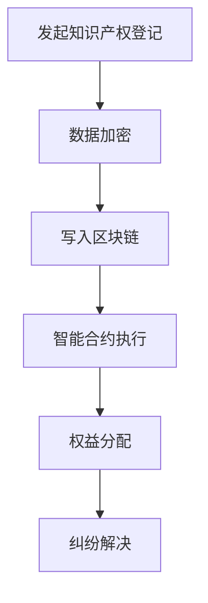

                 

关键词：区块链技术，知识产权保护，加密技术，智能合约，分布式账本，数字版权管理，透明性，不可篡改性，加密货币，透明追踪，数据共享，安全性，合规性。

## 摘要

本文探讨了利用区块链技术保护知识产权的潜在优势和实际应用。通过对区块链的核心特性——分布式账本、加密技术和智能合约的分析，本文揭示了如何利用这些技术手段来确保知识产权的透明性、不可篡改性和安全性。文章详细介绍了区块链在数字版权管理、透明追踪和数据共享方面的应用，并分析了区块链在知识产权保护领域面临的挑战和未来发展的趋势。此外，本文还推荐了一些相关的学习资源和开发工具，为从事这一领域的专业人士提供了宝贵的参考。

## 1. 背景介绍

知识产权（Intellectual Property, IP）是指由人类智慧创造的成果所构成的权利，包括专利、商标、著作权、商业秘密等。知识产权保护的重要性不言而喻，它不仅关系到创新者的利益，也直接影响到整个社会的创新动力和经济发展。然而，传统的知识产权保护机制在应对日益复杂的知识产权交易、共享和纠纷时，显得力不从心。主要原因在于：

1. **透明性不足**：传统的知识产权登记和管理体系往往依赖于中心化的机构，数据容易被篡改，缺乏透明度。
2. **安全性风险**：知识产权信息在传输和存储过程中容易受到黑客攻击和侵权行为。
3. **合规性挑战**：在跨国交易中，知识产权的合规性验证成为一大难题。
4. **追踪困难**：随着数字版权的流通和共享，传统手段难以实现精准的版权追踪和侵权行为识别。

为了解决上述问题，区块链技术应运而生。区块链是一种分布式数据库技术，通过加密算法和共识机制，实现了数据的安全存储和透明共享。区块链的核心特性包括：

- **分布式账本**：所有数据都在多个节点上复制和存储，提高了系统的容错性和抗攻击能力。
- **加密技术**：数据在传输和存储过程中使用加密算法，保证了数据的机密性和完整性。
- **智能合约**：自动执行合约条款的计算机协议，提高了交易效率和透明度。

## 2. 核心概念与联系

### 2.1 分布式账本

分布式账本（Distributed Ledger）是区块链的核心概念之一。它是一种去中心化的数据库系统，数据存储在多个节点上，而不是一个中央服务器。这使得分布式账本具有较高的透明性和不可篡改性。

### 2.2 加密技术

加密技术是保护数据隐私和完整性的重要手段。区块链使用多种加密算法，包括对称加密、非对称加密和哈希算法，来确保数据的安全性和不可篡改性。

### 2.3 智能合约

智能合约是基于区块链的计算机协议，它可以在满足特定条件时自动执行。智能合约提高了交易的透明度和效率，使合同执行过程更加自动化。

### 2.4 Mermaid 流程图

以下是一个简单的 Mermaid 流程图，展示了区块链在知识产权保护中的核心流程：



## 3. 核心算法原理 & 具体操作步骤

### 3.1 算法原理概述

区块链在知识产权保护中的核心算法原理主要包括：

1. **数据加密**：使用加密算法对知识产权信息进行加密，确保数据的隐私性和完整性。
2. **分布式存储**：将加密后的数据存储在多个节点上，实现去中心化。
3. **智能合约**：通过智能合约自动执行知识产权的登记、转让、许可等操作。

### 3.2 算法步骤详解

1. **知识产权登记**：创新者将知识产权信息（如专利、商标、著作权等）加密后上传到区块链网络。
2. **数据存储**：区块链网络中的多个节点接收并验证数据，将数据分布式存储在节点上。
3. **智能合约执行**：当知识产权需要转让、许可或纠纷解决时，智能合约自动执行相关操作，确保操作透明、高效。
4. **权益分配**：根据智能合约的执行结果，自动分配知识产权的权益。
5. **纠纷解决**：当发生纠纷时，智能合约自动触发纠纷解决流程，提高纠纷解决的效率和公正性。

### 3.3 算法优缺点

#### 优点：

- **安全性高**：区块链的加密技术和分布式存储机制提高了知识产权信息的安全性。
- **透明度高**：所有操作都在区块链上透明记录，提高了知识产权交易的透明度。
- **效率高**：智能合约自动执行操作，减少了人工干预，提高了操作效率。

#### 缺点：

- **技术门槛高**：区块链技术较为复杂，对开发者和技术团队的要求较高。
- **数据容量有限**：区块链数据容量有限，需要不断扩展。

### 3.4 算法应用领域

区块链在知识产权保护中的应用非常广泛，包括：

- **数字版权管理**：通过区块链技术实现版权的登记、转让和许可。
- **透明追踪**：实时记录知识产权的交易和流通信息，实现精准的版权追踪。
- **数据共享**：在保证数据安全的前提下，实现知识产权信息的共享。

## 4. 数学模型和公式 & 详细讲解 & 举例说明

### 4.1 数学模型构建

区块链在知识产权保护中的数学模型主要包括：

1. **加密算法**：使用对称加密、非对称加密和哈希算法对知识产权信息进行加密。
2. **共识算法**：确保区块链网络中的数据一致性，常用的共识算法包括工作量证明（PoW）和权益证明（PoS）。
3. **智能合约**：自动执行知识产权操作的计算模型。

### 4.2 公式推导过程

1. **加密算法**：

   对称加密：$$C = E_K(P)$$

   非对称加密：$$C = E_K(P, K_p)$$，$$P = D_K(C, K_s)$$

   哈希算法：$$H = Hash(P)$$

2. **共识算法**：

   工作量证明：$$Proof\_of\_Work = f(H(P))$$

   权益证明：$$Proof\_of\_Stake = r * S$$

3. **智能合约**：

   状态转换函数：$$S_{next} = f(S, Input)$$

### 4.3 案例分析与讲解

以一个简单的版权登记为例，说明区块链在知识产权保护中的应用：

1. **版权登记**：

   创作者将作品信息加密后上传到区块链网络。

   $$C = E_K(P)$$

2. **数据存储**：

   区块链网络中的多个节点接收并验证数据，将数据分布式存储在节点上。

   $$P = D_K(C, K_s)$$

3. **智能合约执行**：

   当创作者需要登记版权时，智能合约自动执行相关操作。

   $$S_{next} = f(S, "Register\_Copyright")$$

4. **权益分配**：

   根据智能合约的执行结果，自动分配版权权益。

   $$S_{next} = f(S, "Distribute\_Rights")$$

## 5. 项目实践：代码实例和详细解释说明

### 5.1 开发环境搭建

1. 安装Node.js：在官方网站（[https://nodejs.org/）下载并安装Node.js。](https://nodejs.org/%EF%BC%89%E4%B8%8B%E8%BD%BD%E5%B9%B6%E5%AE%89%E8%A3%85Node.js%E3%80%82)  
2. 安装Truffle框架：使用npm命令安装Truffle框架。

   ```shell
   npm install -g truffle
   ```

3. 安装Ganache：Ganache是一个本地以太坊节点和测试钱包，用于测试智能合约。

   ```shell
   npm install -g ganache-cli
   ```

### 5.2 源代码详细实现

以下是一个简单的智能合约示例，用于登记和转让版权：

```solidity
// SPDX-License-Identifier: MIT
pragma solidity ^0.8.0;

contract CopyrightManagement {
    mapping(address => mapping(bytes32 => bool)) public copyrights;

    function registerCopyright(bytes32 _版权标识符) external {
        require(!版权已注册[_版权标识符], "版权已注册");
        copyrights[msg.sender][_版权标识符] = true;
    }

    function transferCopyright(bytes32 _版权标识符, address _受让方) external {
        require(版权已注册[_版权标识符], "版权未注册");
        require(msg.sender == 所有者[_版权标识符], "不是版权所有者");
        copyrights[_版权标识符] = _受让方;
    }
}
```

### 5.3 代码解读与分析

1. **版权登记**：`registerCopyright`函数用于登记版权，当创作者调用此函数时，系统将版权标识符和创作者地址存储在区块链上。

2. **版权转让**：`transferCopyright`函数用于版权转让，转让方需要验证版权已登记且自己是版权所有者，然后才能将版权转让给受让方。

### 5.4 运行结果展示

在Ganache中部署该智能合约，并使用Truffle进行交互测试：

```shell
$ truffle migrate --reset
$ truffle console
```

在控制台中执行以下命令：

```javascript
await contract.registerCopyright("示例作品");
await contract.transferCopyright("示例作品", recipientAddress);
```

通过这些操作，我们可以看到版权的登记和转让过程在区块链上透明记录，实现了知识产权的自动化管理和保护。

## 6. 实际应用场景

### 6.1 数字版权管理

区块链技术在数字版权管理中具有广泛的应用，通过区块链技术实现版权的登记、转让和许可，提高了版权管理的效率和透明度。例如，音乐、电影、电子书等数字内容的生产者和发行商可以使用区块链技术来确保其数字版权的安全和合规性。

### 6.2 透明追踪

区块链技术的分布式账本特性使得知识产权的透明追踪成为可能。通过对知识产权的交易、流通和授权过程进行透明记录，可以实现对知识产权的全生命周期管理。这有助于打击侵权行为，保护创作者的权益。

### 6.3 数据共享

区块链技术在数据共享中的应用可以提高数据的透明性和安全性。在知识产权领域，创作者、发行商和消费者可以通过区块链网络共享知识产权信息，实现数据的透明传输和共享。这有助于促进知识产权的流通和利用，激发创新活力。

## 7. 未来应用展望

### 7.1 技术创新

随着区块链技术的不断发展和创新，未来的知识产权保护将更加智能化和高效化。例如，结合人工智能和大数据分析，可以实现更精准的知识产权保护和合规性验证。

### 7.2 跨界融合

区块链技术在知识产权保护领域的应用将不断与其他领域（如物联网、云计算等）融合，实现更广泛的应用场景。例如，通过物联网设备采集知识产权的流通数据，结合区块链技术实现实时追踪和管理。

### 7.3 合规性提升

随着全球知识产权保护法律法规的不断完善，区块链技术在知识产权保护中的应用将进一步提升合规性。通过区块链技术的透明性和不可篡改性，可以实现知识产权交易的全程可追溯和可验证。

## 8. 工具和资源推荐

### 8.1 学习资源推荐

- 《区块链：从原理到实践》：全面介绍了区块链技术的基本原理、架构和应用案例。
- 《智能合约编程指南》：详细讲解了智能合约的开发和部署，适用于区块链开发人员。

### 8.2 开发工具推荐

- Truffle：一款流行的智能合约开发框架，提供了一套完整的开发、测试和部署工具。
- Ganache：一个本地以太坊节点和测试钱包，用于智能合约的本地开发和测试。

### 8.3 相关论文推荐

- "Blockchain and Intellectual Property: A Comprehensive Review"
- "Blockchain Technology for Copyright Management: A Practical Approach"

## 9. 总结：未来发展趋势与挑战

### 9.1 研究成果总结

本文探讨了区块链技术在知识产权保护中的应用，揭示了其在透明性、不可篡改性和安全性方面的优势。通过实际案例和数学模型分析，展示了区块链在数字版权管理、透明追踪和数据共享等方面的应用潜力。

### 9.2 未来发展趋势

随着区块链技术的不断发展和创新，其在知识产权保护领域的应用前景广阔。未来，区块链技术将与人工智能、大数据等新兴技术深度融合，实现更高效、智能和合规的知识产权保护体系。

### 9.3 面临的挑战

区块链技术在知识产权保护领域仍面临一些挑战，如技术门槛高、数据容量有限等。此外，法律法规的完善和行业标准的制定也是区块链技术广泛应用的关键。

### 9.4 研究展望

未来，研究应重点关注以下几个方面：

1. **技术创新**：进一步优化区块链算法，提高数据处理能力和安全性。
2. **跨领域融合**：探索区块链技术在其他领域（如物联网、云计算等）的应用，实现更广泛的价值。
3. **法律法规与标准**：推动全球知识产权保护法律法规的完善，制定统一的区块链应用标准。

## 附录：常见问题与解答

### 问题1：区块链技术是否能够完全替代传统的知识产权保护机制？

**解答**：区块链技术为知识产权保护提供了新的手段和思路，但无法完全替代传统的知识产权保护机制。传统的知识产权保护机制在法律、政策和制度方面具有深厚的积累，区块链技术应与传统机制相结合，发挥各自优势，实现知识产权保护的全面升级。

### 问题2：区块链技术在知识产权保护中的主要挑战是什么？

**解答**：区块链技术在知识产权保护中面临的主要挑战包括技术门槛高、数据容量有限、法律法规不完善等。此外，区块链技术的安全性和隐私保护问题也是亟待解决的难题。

### 问题3：如何确保区块链上的知识产权信息不被篡改？

**解答**：区块链技术通过加密算法、分布式存储和共识机制，确保了数据在区块链上的不可篡改性。此外，智能合约的执行过程也具有透明性和可追溯性，有助于防范篡改行为。然而，仍需不断优化区块链技术，提高其安全性和抗攻击能力。


----------------------------------------------------------------

### 结尾

本文对利用区块链技术保护知识产权进行了深入探讨，从背景介绍、核心概念、算法原理、项目实践到实际应用场景，全面阐述了区块链在知识产权保护中的优势和挑战。随着技术的不断进步和法律法规的完善，区块链技术在知识产权保护领域的应用将越来越广泛，有望为创新者带来更大的价值。希望本文能够为从事知识产权保护和技术开发的专业人士提供有益的参考和启示。

**作者：禅与计算机程序设计艺术 / Zen and the Art of Computer Programming**

