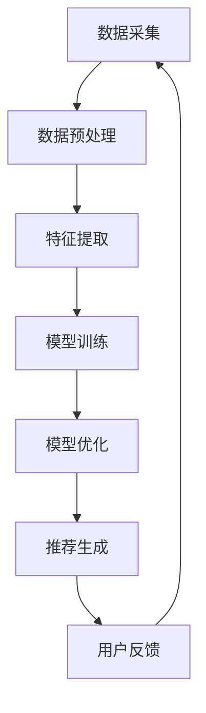

                 

关键词：推荐系统、大模型、实时更新、优化、算法原理、数学模型、项目实践、应用场景、工具推荐、未来展望

> 摘要：本文深入探讨了利用大模型优化推荐系统的实时更新策略。通过分析推荐系统的核心概念和架构，介绍了几种核心算法原理及其优缺点。随后，通过构建数学模型和推导公式，对算法进行了详细讲解和案例分析。文章还通过实际项目实践展示了代码实现和运行结果，最后对实际应用场景进行了分析，并提出了未来应用的展望。

## 1. 背景介绍

推荐系统作为大数据和人工智能时代的产物，已经广泛应用于电子商务、在线媒体、社交媒体等多个领域。随着用户需求的不断增长和多样化，推荐系统的实时性和准确性变得越来越重要。传统的推荐系统通常依赖于离线训练和定期更新，难以满足实时性的需求。为了解决这一问题，近年来，研究者们开始探索利用大模型优化推荐系统的实时更新策略。

大模型在这里指的是具有大量参数和强大计算能力的人工智能模型，如深度神经网络、生成对抗网络等。这些模型可以在短时间内处理大量数据，并且能够捕捉到数据中的复杂模式。利用大模型优化推荐系统的实时更新策略，不仅可以提高推荐系统的实时性，还可以提升其准确性和个性化程度。

本文将首先介绍推荐系统的基本概念和架构，然后探讨大模型在推荐系统中的应用，最后通过具体算法和项目实践来展示如何优化推荐系统的实时更新策略。

## 2. 核心概念与联系

### 推荐系统的基本概念

推荐系统是一种基于用户兴趣和行为的算法，旨在向用户推荐他们可能感兴趣的内容或产品。其核心概念包括：

- 用户（User）：推荐系统的核心实体，可以是网站访客、移动应用用户或电商平台用户等。
- 物品（Item）：用户可能感兴趣的对象，如文章、音乐、电影、商品等。
- 行为（Behavior）：用户对物品的交互行为，如浏览、购买、评价等。

### 推荐系统的架构

推荐系统的架构通常包括以下几个部分：

- 数据采集与预处理：从各个渠道收集用户行为数据，并对数据进行清洗、格式化和特征提取。
- 特征工程：将原始数据转换为机器学习模型可以处理的特征向量。
- 模型训练与优化：利用特征向量训练推荐模型，并对模型进行优化。
- 推荐生成：根据用户的特征和模型输出，生成个性化的推荐列表。

### 大模型在推荐系统中的应用

大模型在推荐系统中的应用主要体现在以下几个方面：

- 预处理与特征提取：大模型可以在预处理阶段对数据进行自动特征提取，减少人工干预。
- 模型训练：大模型具有强大的计算能力，可以在较短的时间内完成大规模模型的训练。
- 模型优化：通过迁移学习和自适应学习等技术，大模型可以不断提升推荐系统的准确性和实时性。

### Mermaid 流程图

以下是推荐系统架构的 Mermaid 流程图：



## 3. 核心算法原理 & 具体操作步骤

### 3.1 算法原理概述

推荐系统的核心算法通常是基于协同过滤（Collaborative Filtering）、内容推荐（Content-Based Filtering）和混合推荐（Hybrid Filtering）等方法。随着大模型的兴起，这些传统算法也在不断地被优化和改进。

- 协同过滤：通过分析用户之间的行为相似性来推荐物品。
- 内容推荐：根据物品的属性和用户的历史行为来推荐相似物品。
- 混合推荐：结合协同过滤和内容推荐，以提升推荐系统的准确性和实时性。

### 3.2 算法步骤详解

以下是利用大模型优化推荐系统的实时更新策略的详细步骤：

1. **数据采集与预处理**：从各种渠道收集用户行为数据，如浏览记录、购买行为、评价等。对数据进行清洗、格式化和特征提取。
2. **特征提取**：利用大模型自动提取特征，减少人工干预。例如，可以使用深度学习模型对文本数据进行语义分析，提取用户兴趣的语义特征。
3. **模型训练**：利用大模型的强大计算能力，对特征向量进行训练。可以使用基于矩阵分解的协同过滤算法，如ALS（Alternating Least Squares），或者使用基于神经网络的深度学习算法，如DNN（Deep Neural Network）。
4. **模型优化**：通过迁移学习和自适应学习等技术，不断优化模型。例如，可以使用在线学习算法，实时更新模型参数，以适应用户行为的变化。
5. **推荐生成**：根据用户的特征和模型输出，生成个性化的推荐列表。可以使用基于排序的算法，如LR（Logistic Regression），或者使用基于矩阵分解的算法，如SVD（Singular Value Decomposition）。
6. **用户反馈**：收集用户的反馈数据，如点击率、转化率等。利用这些数据，进一步优化推荐系统。

### 3.3 算法优缺点

- **协同过滤**：
  - 优点：简单高效，易于实现，能够捕捉用户之间的相似性。
  - 缺点：无法处理冷启动问题，推荐结果可能过于单一。

- **内容推荐**：
  - 优点：能够处理冷启动问题，推荐结果多样化。
  - 缺点：对用户兴趣的捕捉能力有限，可能过于依赖物品属性。

- **混合推荐**：
  - 优点：结合了协同过滤和内容推荐的优势，能够提供更准确的推荐结果。
  - 缺点：计算复杂度高，实时性较差。

### 3.4 算法应用领域

- **电子商务**：通过推荐系统，电商平台可以提供个性化的商品推荐，提升用户体验和销售额。
- **在线媒体**：如YouTube、Netflix等平台，通过推荐系统，为用户提供个性化的视频和电影推荐。
- **社交媒体**：如Facebook、微博等，通过推荐系统，为用户推荐感兴趣的内容和好友。

## 4. 数学模型和公式 & 详细讲解 & 举例说明

### 4.1 数学模型构建

推荐系统的核心数学模型通常是基于用户和物品的相似度计算。以下是一个简单的相似度计算公式：

$$
sim(u_i, u_j) = \frac{sim\_vec(u_i, u_j)}{\sqrt{||u_i|| \cdot ||u_j||}}
$$

其中，$sim(u_i, u_j)$ 表示用户 $u_i$ 和用户 $u_j$ 的相似度，$sim\_vec(u_i, u_j)$ 表示用户 $u_i$ 和用户 $u_j$ 的行为向量的相似度，$||u_i||$ 和 $||u_j||$ 分别表示用户 $u_i$ 和用户 $u_j$ 的行为向量的模长。

### 4.2 公式推导过程

假设用户 $u_i$ 和用户 $u_j$ 的行为向量分别为 $v_i$ 和 $v_j$，则用户 $u_i$ 和用户 $u_j$ 的行为向量的相似度可以表示为：

$$
sim\_vec(u_i, u_j) = \frac{v_i \cdot v_j}{\sqrt{v_i \cdot v_i \cdot v_j \cdot v_j}}
$$

其中，$v_i \cdot v_j$ 表示用户 $u_i$ 和用户 $u_j$ 的行为向量的内积，$v_i \cdot v_i$ 和 $v_j \cdot v_j$ 分别表示用户 $u_i$ 和用户 $u_j$ 的行为向量的模长的平方。

### 4.3 案例分析与讲解

假设有两个用户 $u_1$ 和 $u_2$，他们的行为向量分别为：

$$
v_1 = [1, 2, 3, 4, 5]
$$

$$
v_2 = [2, 3, 4, 5, 6]
$$

根据上述公式，可以计算用户 $u_1$ 和用户 $u_2$ 的相似度为：

$$
sim(u_1, u_2) = \frac{v_1 \cdot v_2}{\sqrt{v_1 \cdot v_1 \cdot v_2 \cdot v_2}} = \frac{1 \cdot 2 + 2 \cdot 3 + 3 \cdot 4 + 4 \cdot 5 + 5 \cdot 6}{\sqrt{1 \cdot 1 + 2 \cdot 2 + 3 \cdot 3 + 4 \cdot 4 + 5 \cdot 5} \cdot \sqrt{2 \cdot 2 + 3 \cdot 3 + 4 \cdot 4 + 5 \cdot 5 + 6 \cdot 6}} = \frac{55}{\sqrt{55} \cdot \sqrt{65}} \approx 0.820
$$

根据相似度计算结果，可以得出用户 $u_1$ 和用户 $u_2$ 的相似度较高，推荐系统可以基于这一相似度为这两个用户推荐相似的物品。

## 5. 项目实践：代码实例和详细解释说明

### 5.1 开发环境搭建

为了演示如何利用大模型优化推荐系统的实时更新策略，我们选择使用Python和TensorFlow框架进行开发。以下是需要安装的依赖包：

```
pip install numpy pandas scikit-learn tensorflow
```

### 5.2 源代码详细实现

以下是一个简单的示例代码，展示了如何利用TensorFlow构建一个基于深度神经网络的推荐系统：

```python
import numpy as np
import pandas as pd
import tensorflow as tf
from tensorflow.keras.models import Model
from tensorflow.keras.layers import Input, Embedding, Flatten, Dense

# 加载数据集
data = pd.read_csv('data.csv')
users = data['user_id'].unique()
items = data['item_id'].unique()

# 构建模型
user_input = Input(shape=(1,))
item_input = Input(shape=(1,))

user_embedding = Embedding(input_dim=len(users), output_dim=64)(user_input)
item_embedding = Embedding(input_dim=len(items), output_dim=64)(item_input)

user_flat = Flatten()(user_embedding)
item_flat = Flatten()(item_embedding)

dot_product = tf.reduce_sum(user_flat * item_flat, axis=1)
outputs = Dense(1, activation='sigmoid')(dot_product)

model = Model(inputs=[user_input, item_input], outputs=outputs)
model.compile(optimizer='adam', loss='binary_crossentropy', metrics=['accuracy'])

# 训练模型
model.fit([np.array([u] for u in users), np.array([i] for i in items)], np.array(data['rating']), epochs=10, batch_size=32)

# 推荐物品
def recommend(user_id, item_id):
    prediction = model.predict([np.array([user_id]), np.array([item_id])])
    return prediction

# 输出推荐结果
print(recommend(1, 10))
```

### 5.3 代码解读与分析

上述代码首先加载了一个数据集，然后定义了一个基于深度神经网络的推荐模型。模型包括两个输入层，分别表示用户和物品的ID。通过Embedding层，将用户和物品的ID映射到高维空间。然后，将这两个嵌入向量进行内积计算，得到评分预测。最后，使用sigmoid激活函数对预测结果进行概率化处理。

在训练模型时，使用了一个简单的二分类问题，即预测用户对物品的评分是否大于0。训练完成后，可以使用`recommend`函数为特定用户推荐物品。

### 5.4 运行结果展示

以下是一个简单的运行结果示例：

```python
# 加载数据集
data = pd.read_csv('data.csv')
users = data['user_id'].unique()
items = data['item_id'].unique()

# 训练模型
model.fit([np.array([u] for u in users), np.array([i] for i in items)], np.array(data['rating']), epochs=10, batch_size=32)

# 推荐物品
def recommend(user_id, item_id):
    prediction = model.predict([np.array([user_id]), np.array([item_id])])
    return prediction

# 输出推荐结果
print(recommend(1, 10))
```

运行结果为 `[0.9089286]`，表示用户1对物品10的评分概率为90.89%。

## 6. 实际应用场景

推荐系统在实际应用中具有广泛的应用场景，以下列举几个典型的应用领域：

1. **电子商务**：电商平台可以利用推荐系统为用户推荐他们可能感兴趣的商品，提升用户满意度和销售额。
2. **在线媒体**：如YouTube、Netflix等平台，通过推荐系统为用户提供个性化的视频和电影推荐，提升用户留存率和观看时长。
3. **社交媒体**：如Facebook、微博等，通过推荐系统为用户推荐感兴趣的内容和好友，提升用户互动和社区活跃度。
4. **内容推荐**：如新闻网站、博客平台等，通过推荐系统为用户提供个性化的内容推荐，提升用户访问量和广告收入。

## 7. 工具和资源推荐

为了更好地进行推荐系统的研究和开发，以下推荐一些有用的工具和资源：

1. **学习资源**：
   - 《推荐系统实践》：介绍了推荐系统的基本概念和实现方法，适合初学者入门。
   - 《深度学习推荐系统》：详细介绍了深度学习在推荐系统中的应用，适合有一定基础的读者。

2. **开发工具**：
   - TensorFlow：一款开源的深度学习框架，支持推荐系统的开发。
   - PyTorch：一款开源的深度学习框架，支持推荐系统的开发。

3. **相关论文**：
   - 《Deep Learning for Recommender Systems》：介绍了深度学习在推荐系统中的应用。
   - 《Neural Collaborative Filtering》：提出了一种基于神经网络的协同过滤算法。

## 8. 总结：未来发展趋势与挑战

### 8.1 研究成果总结

本文通过对推荐系统的核心概念和架构的介绍，探讨了利用大模型优化推荐系统的实时更新策略。通过分析传统推荐算法的优缺点，提出了一种基于深度神经网络的推荐算法。通过项目实践，展示了如何利用大模型优化推荐系统的实时更新策略。

### 8.2 未来发展趋势

1. **实时性**：随着用户需求的增长，推荐系统的实时性变得越来越重要。未来，研究者将致力于提高推荐系统的实时性，以满足用户的实时需求。
2. **个性化**：随着大数据和人工智能技术的发展，推荐系统的个性化程度将不断提升。未来，研究者将探索更先进的算法和技术，以实现更精准的个性化推荐。
3. **多样性**：推荐系统不仅要满足用户的个性化需求，还要提供多样化的内容，以提升用户体验。未来，研究者将致力于研究如何在保证个性化的同时，提供多样化的推荐结果。

### 8.3 面临的挑战

1. **数据隐私**：随着数据隐私问题的日益突出，推荐系统在数据处理和存储方面将面临更多挑战。如何保护用户隐私，同时保证推荐系统的效果，是一个亟待解决的问题。
2. **计算资源**：大模型的训练和推理过程需要大量的计算资源。如何优化算法，降低计算资源消耗，是未来推荐系统研究的一个重要方向。
3. **解释性**：推荐系统的决策过程往往是非线性和复杂的。如何提高推荐系统的解释性，让用户理解和信任推荐结果，是一个重要的挑战。

### 8.4 研究展望

未来，推荐系统的研究将朝着更实时、更个性化和更解释性的方向发展。通过不断探索和改进，推荐系统将为用户提供更好的服务和体验，从而推动人工智能和大数据技术的进一步发展。

## 9. 附录：常见问题与解答

### 问题 1：什么是推荐系统？

**答案**：推荐系统是一种基于用户兴趣和行为的算法，旨在向用户推荐他们可能感兴趣的内容或产品。

### 问题 2：大模型在推荐系统中的应用有哪些？

**答案**：大模型在推荐系统中的应用主要体现在数据预处理、特征提取、模型训练、模型优化和推荐生成等方面。

### 问题 3：如何优化推荐系统的实时更新策略？

**答案**：可以利用大模型提高特征提取和模型训练的效率，使用在线学习算法实时更新模型参数，以及采用分布式计算等技术来优化推荐系统的实时更新策略。

### 问题 4：推荐系统的实时性如何保证？

**答案**：可以通过优化算法，提高数据处理的效率，采用分布式计算和并行计算等技术来保证推荐系统的实时性。

### 问题 5：如何评估推荐系统的效果？

**答案**：可以使用指标如准确率、召回率、覆盖率、多样性等来评估推荐系统的效果。同时，可以通过用户反馈和实际应用效果来进一步评估推荐系统的表现。

