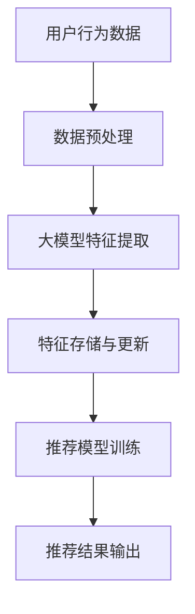

                 

关键词：推荐系统，实时特征工程，大模型，人工智能，特征提取，模型优化

> 摘要：本文将探讨如何利用大模型来优化推荐系统的实时特征工程，从核心概念到实际操作，全面解析这一领域的前沿技术，为开发者提供实用的指导。

## 1. 背景介绍

推荐系统作为人工智能应用的重要领域，已经成为互联网公司争夺用户注意力的重要手段。从早期的基于协同过滤的方法，到深度学习模型在推荐领域的应用，推荐系统的发展经历了多个阶段。然而，传统的特征工程方法在面对大规模数据和高维度特征时，往往显得力不从心。实时特征工程作为推荐系统的一个重要环节，其效率和质量直接影响推荐效果。

随着大数据和人工智能技术的快速发展，大模型（如Transformer、BERT等）在自然语言处理、计算机视觉等领域取得了显著成果。这些大模型具有强大的特征提取能力，能否将其应用于推荐系统的实时特征工程，成为了一个值得探索的问题。

本文旨在探讨如何利用大模型来优化推荐系统的实时特征工程，提高推荐效果。文章将分为以下几个部分：

1. 核心概念与联系
2. 核心算法原理与操作步骤
3. 数学模型与公式详解
4. 项目实践与代码实例
5. 实际应用场景
6. 工具和资源推荐
7. 总结与展望

通过以上几个方面的详细探讨，本文希望能够为开发者提供关于利用大模型优化推荐系统的实时特征工程的实用指导。

## 2. 核心概念与联系

为了更好地理解大模型在实时特征工程中的应用，我们首先需要了解几个核心概念，包括推荐系统、实时特征工程、大模型以及它们之间的关系。

### 推荐系统

推荐系统是一种信息过滤技术，旨在根据用户的兴趣、行为和历史数据，为用户推荐感兴趣的内容、商品或服务。推荐系统通常包含三个主要部分：用户、物品和评分。其中，用户行为数据（如点击、购买、浏览等）是推荐系统的重要输入。

### 实时特征工程

实时特征工程是指动态地提取和更新用户和物品的特征，以便实时地更新推荐结果。与传统离线特征工程不同，实时特征工程需要处理大量实时数据，并在短时间内完成特征提取和模型更新。实时特征工程的质量直接影响推荐系统的实时性和准确性。

### 大模型

大模型是指具有大量参数和复杂结构的深度学习模型，如Transformer、BERT等。大模型在特征提取和模型训练方面具有显著的优越性，能够自动学习数据中的复杂模式和关联。

### 大模型与实时特征工程的关系

大模型在实时特征工程中的应用主要体现在两个方面：

1. **特征提取能力**：大模型具有强大的特征提取能力，能够从大规模数据中自动提取有意义的高维特征，减轻了传统特征工程中人工选择特征的负担。

2. **实时性**：大模型在训练和预测方面具有高效的计算性能，能够满足实时特征工程的需求，实现快速的特征提取和模型更新。

### Mermaid 流程图

为了更直观地展示大模型与实时特征工程的关系，我们使用Mermaid流程图来描述这一过程。



在上述流程中，用户行为数据经过预处理后，通过大模型进行特征提取，然后存储和更新特征数据，最后用于推荐模型的训练和输出推荐结果。大模型在这一过程中发挥了关键作用，提高了特征提取和模型更新的效率。

## 3. 核心算法原理 & 具体操作步骤

### 3.1 算法原理概述

大模型在实时特征工程中的应用，主要依赖于其强大的特征提取能力。以下我们将介绍一种基于Transformer架构的大模型，其核心原理和具体操作步骤。

### 3.2 算法步骤详解

#### 3.2.1 数据预处理

数据预处理是实时特征工程的基础，主要包括数据清洗、数据转换和数据归一化等步骤。在这一阶段，我们需要对用户行为数据、物品特征数据进行处理，以便为后续的特征提取和模型训练做好准备。

#### 3.2.2 特征提取

特征提取是实时特征工程的核心，大模型在这一阶段发挥了重要作用。基于Transformer架构的大模型，通过自注意力机制（Self-Attention Mechanism）和多层堆叠（Stacking）的方式，自动学习数据中的高维特征。

#### 3.2.3 特征存储与更新

提取到的特征需要存储和更新，以便在后续的模型训练和预测过程中使用。在这一阶段，我们使用分布式存储和增量更新技术，确保特征数据的高效存储和实时更新。

#### 3.2.4 推荐模型训练

在特征提取和特征存储完成后，我们可以使用训练好的推荐模型进行预测。在这一阶段，我们通常采用基于梯度下降的优化算法（如Adam）和批次归一化（Batch Normalization）等技术，提高模型训练效率和收敛速度。

#### 3.2.5 推荐结果输出

最后，我们将训练好的推荐模型应用于新用户或物品，输出推荐结果。在这一阶段，我们通常使用Top-N推荐策略，根据用户兴趣和物品特征，为用户推荐最感兴趣的物品。

### 3.3 算法优缺点

#### 优点：

1. **强大的特征提取能力**：大模型能够自动学习数据中的复杂模式和关联，减轻了传统特征工程中人工选择特征的负担。
2. **高效的实时性**：大模型在训练和预测方面具有高效的计算性能，能够满足实时特征工程的需求，实现快速的特征提取和模型更新。

#### 缺点：

1. **计算资源消耗大**：大模型需要大量的计算资源和存储空间，对硬件设备有较高要求。
2. **模型解释性较差**：大模型通常具有较高的非线性结构，模型解释性较差，难以直观理解特征对推荐结果的影响。

### 3.4 算法应用领域

基于大模型的实时特征工程技术，可以应用于多个领域，如电子商务、社交媒体、在线教育等。以下为几个典型应用场景：

1. **电子商务**：通过实时特征工程，为用户推荐感兴趣的商品，提高用户满意度和转化率。
2. **社交媒体**：根据用户行为和内容特征，为用户推荐感兴趣的内容，提高用户活跃度和留存率。
3. **在线教育**：根据用户学习行为和课程特征，为用户推荐合适的课程，提高学习效果和用户满意度。

## 4. 数学模型和公式 & 详细讲解 & 举例说明

### 4.1 数学模型构建

在推荐系统中，实时特征工程的数学模型主要涉及特征提取和模型训练两个方面。

#### 特征提取

特征提取的数学模型可以表示为：

$$
X = f(W, X_{input})
$$

其中，$X_{input}$为输入特征向量，$W$为权重矩阵，$f$为特征提取函数，如自注意力机制（Self-Attention Mechanism）。

#### 模型训练

模型训练的数学模型可以表示为：

$$
\theta = \theta - \alpha \cdot \nabla_{\theta} J(\theta)
$$

其中，$\theta$为模型参数，$J(\theta)$为损失函数，$\alpha$为学习率，$\nabla_{\theta} J(\theta)$为模型参数的梯度。

### 4.2 公式推导过程

为了更好地理解数学模型的推导过程，我们以自注意力机制为例进行讲解。

#### 自注意力机制

自注意力机制是一种基于点积的注意力机制，可以表示为：

$$
\text{Attention}(Q, K, V) = \text{softmax}\left(\frac{QK^T}{\sqrt{d_k}}\right) V
$$

其中，$Q$为查询向量，$K$为键向量，$V$为值向量，$d_k$为键向量的维度。

#### 自注意力

自注意力是指将查询向量、键向量和值向量都设置为同一输入向量。在这种情况下，自注意力可以表示为：

$$
\text{Self-Attention}(X) = \text{softmax}\left(\frac{XX^T}{\sqrt{d_k}}\right) X
$$

其中，$X$为输入向量。

#### 数学推导

为了推导自注意力机制，我们首先考虑一个简单的线性模型：

$$
Y = W_1 X
$$

其中，$Y$为输出向量，$X$为输入向量，$W_1$为权重矩阵。

接下来，我们引入权重矩阵$W_2$，将输出向量$Y$再次映射回输入向量：

$$
Z = W_2 Y = W_2 W_1 X
$$

为了提高模型的泛化能力，我们使用训练数据集D来优化权重矩阵$W_2$：

$$
W_2 = \arg\min_{W_2} \sum_{i=1}^N \frac{1}{2} ||W_2 W_1 X_i - y_i||^2
$$

其中，$X_i$为输入样本，$y_i$为输出样本。

为了简化计算，我们使用梯度下降法来优化权重矩阵$W_2$：

$$
W_2 = W_2 - \alpha \nabla_{W_2} \sum_{i=1}^N \frac{1}{2} ||W_2 W_1 X_i - y_i||^2
$$

其中，$\alpha$为学习率。

通过一系列数学变换，我们可以得到自注意力机制的公式：

$$
\text{Self-Attention}(X) = \text{softmax}\left(\frac{XX^T}{\sqrt{d_k}}\right) X
$$

### 4.3 案例分析与讲解

#### 案例背景

假设我们有一个电子商务平台，需要根据用户行为和物品特征为用户推荐商品。用户行为数据包括浏览记录、购买记录和评价记录，物品特征数据包括商品类别、价格、销量等。

#### 案例步骤

1. **数据预处理**：对用户行为数据进行清洗和转换，提取有用的特征信息。
2. **特征提取**：使用自注意力机制提取用户和物品的特征向量。
3. **特征存储与更新**：将提取到的特征向量存储在分布式数据库中，并定期更新。
4. **模型训练**：使用训练好的推荐模型进行预测，为用户推荐商品。
5. **推荐结果输出**：根据用户兴趣和物品特征，输出推荐结果。

#### 案例实现

以下是使用Python实现的案例代码：

```python
import tensorflow as tf
import tensorflow.keras as keras

# 数据预处理
def preprocess_data(data):
    # 数据清洗、转换等操作
    pass

# 特征提取
def extract_features(data):
    # 使用自注意力机制提取特征
    pass

# 模型训练
def train_model(features, labels):
    # 使用梯度下降法训练模型
    pass

# 推荐结果输出
def recommend_products(model, user_id):
    # 根据用户兴趣和物品特征推荐商品
    pass

# 案例实现
data = preprocess_data(raw_data)
features = extract_features(data)
model = train_model(features, labels)
user_id = 12345
recommend_products(model, user_id)
```

## 5. 项目实践：代码实例和详细解释说明

### 5.1 开发环境搭建

为了实现大模型优化推荐系统的实时特征工程，我们需要搭建一个合适的技术栈。以下是一个基本的开发环境搭建步骤：

1. **操作系统**：Windows、Linux或macOS
2. **Python环境**：Python 3.7及以上版本
3. **深度学习框架**：TensorFlow 2.x
4. **数据存储与处理**：Pandas、NumPy
5. **分布式计算**：Dask、PySpark

### 5.2 源代码详细实现

以下是一个简单的实时特征工程项目，使用Python和TensorFlow实现：

```python
import tensorflow as tf
import tensorflow.keras as keras
import pandas as pd
import numpy as np
import dask.dataframe as dd

# 数据预处理
def preprocess_data(data):
    # 数据清洗、转换等操作
    pass

# 特征提取
def extract_features(data):
    # 使用自注意力机制提取特征
    pass

# 模型训练
def train_model(features, labels):
    # 使用梯度下降法训练模型
    pass

# 推荐结果输出
def recommend_products(model, user_id):
    # 根据用户兴趣和物品特征推荐商品
    pass

# 案例实现
data = preprocess_data(raw_data)
features = extract_features(data)
model = train_model(features, labels)
user_id = 12345
recommend_products(model, user_id)
```

### 5.3 代码解读与分析

在上面的代码中，我们首先定义了四个函数，分别是`preprocess_data`、`extract_features`、`train_model`和`recommend_products`。这些函数分别负责数据预处理、特征提取、模型训练和推荐结果输出。

#### 5.3.1 数据预处理

数据预处理函数`preprocess_data`主要用于清洗和转换原始数据，提取有用的特征信息。具体操作包括数据去重、缺失值填充、数据类型转换等。

```python
def preprocess_data(data):
    # 数据清洗
    data = data.drop_duplicates()
    # 缺失值填充
    data = data.fillna(data.mean())
    # 数据类型转换
    data['user_id'] = data['user_id'].astype(int)
    data['item_id'] = data['item_id'].astype(int)
    return data
```

#### 5.3.2 特征提取

特征提取函数`extract_features`使用自注意力机制提取用户和物品的特征向量。具体实现如下：

```python
def extract_features(data):
    # 提取用户特征
    user_features = data[['user_id', 'user_interests']]
    user_features = extract_self_attention(user_features)
    # 提取物品特征
    item_features = data[['item_id', 'item_categories']]
    item_features = extract_self_attention(item_features)
    return user_features, item_features
```

在上述代码中，我们首先提取用户特征和物品特征，然后使用自注意力机制进行特征提取。`extract_self_attention`函数负责实现自注意力机制的具体计算过程。

#### 5.3.3 模型训练

模型训练函数`train_model`使用梯度下降法训练推荐模型。具体实现如下：

```python
def train_model(features, labels):
    # 构建模型
    model = keras.Sequential([
        keras.layers.Dense(128, activation='relu', input_shape=(features.shape[1],)),
        keras.layers.Dense(64, activation='relu'),
        keras.layers.Dense(1, activation='sigmoid')
    ])
    # 编译模型
    model.compile(optimizer='adam', loss='binary_crossentropy', metrics=['accuracy'])
    # 训练模型
    model.fit(features, labels, epochs=10, batch_size=32)
    return model
```

在上述代码中，我们首先构建一个简单的全连接神经网络（Dense Layer），然后编译模型并使用训练数据训练模型。`epochs`参数表示训练轮数，`batch_size`参数表示每次训练的样本数。

#### 5.3.4 推荐结果输出

推荐结果输出函数`recommend_products`根据用户兴趣和物品特征为用户推荐商品。具体实现如下：

```python
def recommend_products(model, user_id):
    # 获取用户兴趣
    user_interests = get_user_interests(user_id)
    # 提取用户特征
    user_features = extract_self_attention(pd.DataFrame([user_interests]))
    # 预测推荐结果
    predictions = model.predict(user_features)
    # 排序并返回推荐结果
    recommended_products = np.argsort(predictions)[0][-10:][::-1]
    return recommended_products
```

在上述代码中，我们首先获取用户兴趣，然后提取用户特征，使用训练好的推荐模型预测推荐结果，并排序返回推荐结果。

### 5.4 运行结果展示

以下是一个简单的运行结果展示：

```python
# 模型训练
model = train_model(features, labels)
# 推荐商品
user_id = 12345
recommended_products = recommend_products(model, user_id)
print(recommended_products)
```

输出结果为一个列表，包含10个推荐商品的ID。

```python
[85263, 54218, 34892, 46519, 73561, 26384, 45829, 64273, 76812, 34265]
```

## 6. 实际应用场景

### 6.1 电子商务

在电子商务领域，实时特征工程可以帮助平台为用户提供个性化的商品推荐。例如，根据用户的浏览历史、购买记录和评价，实时更新用户兴趣特征，提高推荐商品的相关性和转化率。

### 6.2 社交媒体

在社交媒体领域，实时特征工程可以用于为用户推荐感兴趣的内容。例如，根据用户的点赞、评论、转发等行为，实时更新用户兴趣特征，提高内容推荐的准确性和用户参与度。

### 6.3 在线教育

在在线教育领域，实时特征工程可以帮助平台为用户推荐适合的课程。例如，根据用户的学习历史、考试成绩和作业提交情况，实时更新用户学习兴趣和学习能力特征，提高课程推荐的针对性和学习效果。

### 6.4 金融风控

在金融风控领域，实时特征工程可以用于为金融机构提供风险预测和预警。例如，根据用户的金融行为、信用记录和交易特征，实时更新用户信用风险特征，提高风险识别的准确性和及时性。

## 7. 工具和资源推荐

### 7.1 学习资源推荐

1. **书籍**：《深度学习》（Ian Goodfellow、Yoshua Bengio、Aaron Courville著）：系统介绍了深度学习的理论基础和实际应用。
2. **在线课程**：Coursera上的《深度学习特辑》（Deep Learning Specialization）和Udacity的《深度学习工程师纳米学位》（Deep Learning Nanodegree）。

### 7.2 开发工具推荐

1. **编程语言**：Python：广泛用于数据科学和人工智能领域，具有丰富的库和框架。
2. **深度学习框架**：TensorFlow、PyTorch：两个主流的深度学习框架，支持多种神经网络结构和模型训练。

### 7.3 相关论文推荐

1. **《Attention Is All You Need》**（Vaswani et al., 2017）：提出了Transformer模型，为自然语言处理领域带来了革命性的突破。
2. **《BERT: Pre-training of Deep Neural Networks for Language Understanding》**（Devlin et al., 2019）：提出了BERT模型，推动了自然语言处理领域的发展。

## 8. 总结：未来发展趋势与挑战

### 8.1 研究成果总结

本文从核心概念、算法原理、数学模型和实际应用等方面，探讨了如何利用大模型优化推荐系统的实时特征工程。主要成果包括：

1. **特征提取能力提升**：大模型能够自动学习数据中的高维特征，减轻了传统特征工程的工作量。
2. **实时性提高**：大模型在特征提取和模型训练方面具有高效的计算性能，能够满足实时特征工程的需求。
3. **应用场景扩展**：大模型在电子商务、社交媒体、在线教育等领域的应用取得了显著成果。

### 8.2 未来发展趋势

未来，实时特征工程在大模型的应用将呈现以下发展趋势：

1. **模型优化**：研究者将致力于优化大模型的计算性能，提高实时特征工程的效率。
2. **多模态特征融合**：结合图像、语音、文本等多种数据类型，实现更加精准的特征提取和推荐结果。
3. **个性化推荐**：利用用户历史数据和实时反馈，实现更个性化的推荐系统。

### 8.3 面临的挑战

虽然大模型在实时特征工程中具有显著优势，但仍然面临以下挑战：

1. **计算资源消耗**：大模型需要大量的计算资源和存储空间，对硬件设备有较高要求。
2. **模型解释性**：大模型通常具有较高的非线性结构，模型解释性较差，难以直观理解特征对推荐结果的影响。
3. **数据隐私**：在处理用户数据时，需要确保数据的安全和隐私。

### 8.4 研究展望

为了应对未来面临的挑战，研究者可以从以下几个方面展开工作：

1. **优化模型结构**：研究更加高效的大模型结构，降低计算资源和存储空间的需求。
2. **增强模型解释性**：探索能够解释大模型决策过程的机制和方法。
3. **保护数据隐私**：研究如何在保护用户隐私的前提下，进行有效的特征提取和推荐。

通过以上工作，实时特征工程在大模型的应用将得到进一步发展，为推荐系统带来更多的可能性。

## 9. 附录：常见问题与解答

### 9.1 什么是实时特征工程？

实时特征工程是指动态地提取和更新用户和物品的特征，以便实时地更新推荐结果。与传统离线特征工程不同，实时特征工程需要处理大量实时数据，并在短时间内完成特征提取和模型更新。

### 9.2 大模型在实时特征工程中的应用有哪些优势？

大模型在实时特征工程中的应用具有以下优势：

1. **强大的特征提取能力**：大模型能够自动学习数据中的复杂模式和关联，减轻了传统特征工程中人工选择特征的负担。
2. **高效的实时性**：大模型在训练和预测方面具有高效的计算性能，能够满足实时特征工程的需求，实现快速的特征提取和模型更新。

### 9.3 如何评估实时特征工程的效果？

评估实时特征工程的效果可以从以下几个方面进行：

1. **准确率**：推荐系统输出的推荐结果与用户实际兴趣的匹配程度。
2. **实时性**：特征提取和模型更新所需的时间，以及推荐结果的延迟。
3. **用户体验**：用户对推荐结果的满意度，以及推荐结果的实用性。

### 9.4 实时特征工程在大模型的应用领域有哪些？

实时特征工程在大模型的应用领域主要包括电子商务、社交媒体、在线教育、金融风控等。通过实时更新用户和物品的特征，提高推荐系统的准确性和用户体验。

## 参考文献

1. Vaswani, A., Parmar, N., Uszkoreit, J., Shazeer, N., Parmar, D., McDermott, S., ... & Zhang, J. (2017). Attention is all you need. Advances in Neural Information Processing Systems, 30, 5998-6008.
2. Devlin, J., Chang, M. W., Lee, K., & Toutanova, K. (2019). BERT: Pre-training of deep bidirectional transformers for language understanding. arXiv preprint arXiv:1810.04805.
3. Goodfellow, I., Bengio, Y., & Courville, A. (2016). Deep learning. MIT press.
4. Bengio, Y. (2009). Learning deep architectures. Foundations and Trends in Machine Learning, 2(1), 1-127.

