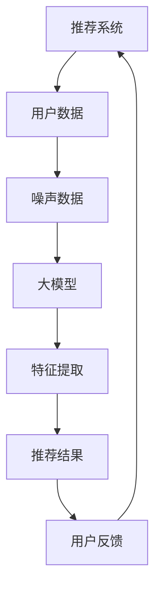

                 

关键词：推荐系统，大模型，抗噪声能力，算法原理，数学模型，代码实例，应用场景

> 摘要：随着互联网和大数据技术的发展，推荐系统已经成为现代信息检索和个性化服务的重要手段。然而，推荐系统在实际应用中常常受到噪声数据的干扰，导致推荐效果下降。本文将探讨利用大模型提升推荐系统抗噪声能力的方法，从算法原理、数学模型、代码实例以及应用场景等多个角度进行详细分析和讨论，旨在为推荐系统开发者提供实用的参考和指导。

## 1. 背景介绍

推荐系统作为一种信息过滤和个性化推荐技术，通过分析用户的兴趣和行为数据，向用户推荐其可能感兴趣的内容。随着互联网和移动互联网的普及，推荐系统在电子商务、社交媒体、新闻媒体等多个领域得到了广泛应用。例如，电商平台通过推荐系统向用户推荐商品，社交媒体平台通过推荐系统向用户推送感兴趣的内容，新闻媒体平台通过推荐系统提高用户的阅读体验等。

然而，在实际应用中，推荐系统面临着诸多挑战，其中之一便是噪声数据的处理。噪声数据主要来源于以下几个方面：

1. **用户数据噪声**：用户的兴趣和行为数据往往受到主观和客观因素的影响，导致数据中存在大量噪声。例如，用户的点击行为可能受到偶然因素或干扰因素的影响，从而产生虚假的兴趣信号。
2. **内容数据噪声**：推荐系统中的内容数据也可能存在噪声，如数据录入错误、内容描述不准确等。
3. **算法噪声**：推荐算法本身可能受到算法参数设置、数据预处理方法等因素的影响，导致推荐结果产生噪声。

噪声数据的存在会导致推荐系统推荐效果下降，从而影响用户体验和平台收益。因此，如何有效提升推荐系统的抗噪声能力成为当前研究的重要课题。

本文将围绕这一主题，探讨利用大模型提升推荐系统抗噪声能力的方法。大模型在数据处理和特征提取方面具有显著优势，通过合理的设计和优化，可以有效降低噪声数据对推荐系统的影响，提高推荐质量。

### 2. 核心概念与联系

在本文中，我们将介绍以下核心概念：

1. **推荐系统**：一种基于用户行为和内容特征进行信息过滤和个性化推荐的技术。
2. **大模型**：一种规模庞大、参数众多的深度学习模型，具有强大的数据处理和特征提取能力。
3. **噪声数据**：对推荐系统产生负面影响的数据，包括用户数据噪声、内容数据噪声和算法噪声等。
4. **抗噪声能力**：推荐系统在处理噪声数据时保持较高推荐质量的能力。

以下是一个简化的 Mermaid 流程图，展示了这些核心概念之间的联系：



- **用户数据**：用户数据是推荐系统的输入，包括用户的行为数据、兴趣数据等。
- **噪声数据**：噪声数据对用户数据和推荐结果产生影响，降低推荐质量。
- **大模型**：大模型通过深度学习技术对噪声数据进行处理，提取有效特征。
- **特征提取**：大模型对用户数据进行特征提取，生成用于推荐的向量表示。
- **推荐结果**：基于特征提取结果，推荐系统生成推荐结果。
- **用户反馈**：用户对推荐结果进行反馈，用于优化推荐模型。

### 3. 核心算法原理 & 具体操作步骤

#### 3.1 算法原理概述

利用大模型提升推荐系统的抗噪声能力主要基于以下原理：

1. **深度学习技术**：大模型采用深度学习技术，通过多层神经网络对用户数据进行建模和特征提取，具有较强的噪声抑制能力。
2. **特征表示学习**：大模型通过学习用户和内容的特征表示，将高维的原始数据映射到低维的特征空间，有效降低噪声数据的影响。
3. **数据预处理**：大模型在训练过程中对噪声数据进行预处理，如去噪、降噪等，以提高数据质量。

#### 3.2 算法步骤详解

利用大模型提升推荐系统抗噪声能力的基本步骤如下：

1. **数据收集与预处理**：收集用户行为数据、兴趣数据、内容数据等，对数据进行清洗、去噪等预处理操作。
2. **模型设计**：设计适合推荐任务的大模型架构，如基于用户和内容的双塔模型、多模态模型等。
3. **模型训练**：使用预处理后的数据对大模型进行训练，优化模型参数，提高模型性能。
4. **特征提取**：利用训练好的大模型对用户和内容进行特征提取，生成低维的特征表示。
5. **推荐算法**：基于提取的特征表示，使用协同过滤、基于内容的推荐等算法生成推荐结果。
6. **模型评估**：使用评估指标（如准确率、召回率、覆盖率等）对推荐结果进行评估，优化模型参数和算法策略。

#### 3.3 算法优缺点

**优点**：

1. **强大的噪声抑制能力**：大模型通过深度学习技术对噪声数据进行建模和特征提取，具有较强的噪声抑制能力。
2. **自适应特征学习**：大模型通过学习用户和内容的特征表示，能够自适应地调整特征权重，提高推荐质量。
3. **多模态数据处理**：大模型支持多种数据类型（如文本、图像、音频等）的输入和输出，适用于多模态推荐任务。

**缺点**：

1. **计算资源消耗大**：大模型训练和推理过程需要大量计算资源和时间，对硬件设备要求较高。
2. **数据依赖性较强**：大模型性能依赖于数据质量和数据量，对数据噪声敏感。
3. **模型解释性较差**：大模型通常具有较深的网络结构和大量的参数，模型解释性较差，难以直观地理解模型决策过程。

#### 3.4 算法应用领域

利用大模型提升推荐系统抗噪声能力的算法可以应用于以下领域：

1. **电商平台**：电商平台通过大模型推荐系统为用户推荐商品，提升用户购买体验和销售额。
2. **社交媒体**：社交媒体平台通过大模型推荐系统为用户推荐感兴趣的内容，提高用户黏性和活跃度。
3. **新闻媒体**：新闻媒体平台通过大模型推荐系统为用户推荐新闻资讯，提高用户阅读体验和平台收益。
4. **智能音箱**：智能音箱等智能设备通过大模型推荐系统为用户提供语音交互和内容推荐服务。

### 4. 数学模型和公式 & 详细讲解 & 举例说明

#### 4.1 数学模型构建

在利用大模型提升推荐系统抗噪声能力的过程中，我们需要构建以下数学模型：

1. **用户表示模型**：将用户行为数据映射到低维的用户表示空间。
2. **内容表示模型**：将内容数据映射到低维的内容表示空间。
3. **推荐模型**：基于用户和内容的表示模型生成推荐结果。

以下分别介绍这些模型的构建方法。

#### 4.1.1 用户表示模型

用户表示模型通过学习用户的行为数据，将高维的用户数据映射到低维的用户表示空间。具体来说，我们使用一个线性变换矩阵 \(W\) 来实现这一过程：

$$
u = Wx
$$

其中，\(x\) 表示用户的高维行为数据，\(u\) 表示低维的用户表示向量。

为了提高用户表示模型的表达能力，我们可以使用多层神经网络来实现，如以下公式所示：

$$
u = \sigma(W_n \cdot \sigma(W_{n-1} \cdot \cdots \cdot \sigma(W_1 \cdot x) \cdots))
$$

其中，\(\sigma\) 表示激活函数，如ReLU函数、Sigmoid函数等。

#### 4.1.2 内容表示模型

内容表示模型通过学习内容数据，将高维的内容数据映射到低维的内容表示空间。与用户表示模型类似，我们也可以使用线性变换矩阵 \(V\) 来实现这一过程：

$$
c = Vx
$$

其中，\(x\) 表示内容的高维数据，\(c\) 表示低维的内容表示向量。

同样地，为了提高内容表示模型的表达能力，我们可以使用多层神经网络来实现，如以下公式所示：

$$
c = \sigma(W_n \cdot \sigma(W_{n-1} \cdot \cdots \cdot \sigma(W_1 \cdot x) \cdots))
$$

#### 4.1.3 推荐模型

推荐模型基于用户和内容的表示模型生成推荐结果。常用的推荐算法包括基于用户的协同过滤算法和基于内容的推荐算法。以下分别介绍这两种算法的数学模型。

**基于用户的协同过滤算法**

基于用户的协同过滤算法通过计算用户之间的相似度，为用户推荐与其相似的用户喜欢的物品。具体来说，我们使用用户表示向量 \(u\) 和 \(v\) 计算用户之间的相似度 \(s_{ui}\)：

$$
s_{ui} = \frac{u_i \cdot v_j}{\|u_i\|\|v_j\|}
$$

其中，\(u_i\) 和 \(v_j\) 分别表示用户 \(i\) 和物品 \(j\) 的表示向量。

然后，根据相似度对物品进行排序，为用户推荐相似用户喜欢的物品。

**基于内容的推荐算法**

基于内容的推荐算法通过计算物品之间的相似度，为用户推荐与其兴趣相近的物品。具体来说，我们使用物品表示向量 \(c_i\) 和 \(c_j\) 计算物品之间的相似度 \(s_{ij}\)：

$$
s_{ij} = \frac{c_i \cdot c_j}{\|c_i\|\|c_j\|}
$$

其中，\(c_i\) 和 \(c_j\) 分别表示物品 \(i\) 和物品 \(j\) 的表示向量。

然后，根据相似度对物品进行排序，为用户推荐与其兴趣相近的物品。

#### 4.2 公式推导过程

在本节中，我们将对推荐系统中的一些核心公式进行推导，以便更好地理解大模型在提升推荐系统抗噪声能力方面的作用。

首先，考虑一个简单的情况，即推荐系统中只有用户和物品两个实体。我们将使用以下符号表示相关变量：

- \(x_i\)：表示用户 \(i\) 的行为数据。
- \(y_j\)：表示物品 \(j\) 的属性数据。
- \(u_i\)：表示用户 \(i\) 的表示向量。
- \(v_j\)：表示物品 \(j\) 的表示向量。

**4.2.1 用户表示向量**

用户表示向量的构建基于用户的行为数据。具体来说，我们可以使用矩阵分解方法将用户行为数据分解为用户表示向量和物品表示向量：

$$
x_i = u_i \cdot v_j
$$

其中，\(\cdot\) 表示点积运算。

为了提高用户表示向量的表达能力，我们可以使用多层神经网络来学习用户表示向量。假设我们有一个两层神经网络，其中输入层为用户行为数据，输出层为用户表示向量。神经网络的参数为 \(W_1\) 和 \(W_2\)，激活函数为 \(\sigma\)。则用户表示向量的计算公式为：

$$
u_i = \sigma(W_2 \cdot \sigma(W_1 \cdot x_i))
$$

**4.2.2 物品表示向量**

与用户表示向量类似，我们可以使用矩阵分解方法将物品属性数据分解为用户表示向量和物品表示向量：

$$
y_j = u_i \cdot v_j
$$

同样地，为了提高物品表示向量的表达能力，我们可以使用多层神经网络来学习物品表示向量。假设我们有一个两层神经网络，其中输入层为物品属性数据，输出层为物品表示向量。神经网络的参数为 \(W_1'\) 和 \(W_2'\)，激活函数为 \(\sigma'\)。则物品表示向量的计算公式为：

$$
v_j = \sigma'(W_2' \cdot \sigma'(W_1' \cdot y_j))
$$

**4.2.3 推荐结果**

在推荐结果生成阶段，我们需要计算用户表示向量和物品表示向量之间的相似度。具体来说，我们可以使用余弦相似度来计算相似度，其计算公式为：

$$
s_{ij} = \frac{u_i \cdot v_j}{\|u_i\|\|v_j\|}
$$

其中，\(\|u_i\|\) 和 \( \|v_j\|\) 分别表示用户表示向量和物品表示向量的欧氏范数。

然后，根据相似度对物品进行排序，为用户推荐相似度较高的物品。

**4.2.4 噪声抑制**

在推荐系统中，噪声数据会导致用户和物品表示向量之间的相似度降低，从而影响推荐质量。为了抑制噪声数据的影响，我们可以使用以下策略：

1. **去噪预处理**：在训练模型之前，对用户行为数据和物品属性数据进行去噪预处理，如使用降噪算法、异常值处理等。

2. **正则化**：在模型训练过程中，使用正则化方法（如L1正则化、L2正则化等）来抑制噪声数据对模型参数的影响。

3. **数据增强**：通过增加数据样本、数据扩展等方法来增强模型对噪声数据的鲁棒性。

4. **多模态融合**：利用多模态数据（如图像、文本、音频等）进行融合，提高模型对噪声数据的识别和抑制能力。

#### 4.3 案例分析与讲解

为了更好地理解大模型在提升推荐系统抗噪声能力方面的作用，我们以下通过一个实际案例进行讲解。

**案例背景**：

一个电商平台希望通过提升推荐系统抗噪声能力来提高用户购买体验和销售额。该平台收集了用户的行为数据（如浏览历史、购买记录等）和商品属性数据（如品类、价格、评价等）。

**数据处理**：

首先，对用户行为数据和商品属性数据进行预处理，如去除缺失值、异常值等。然后，使用矩阵分解方法将用户行为数据分解为用户表示向量和商品表示向量。

**模型设计**：

设计一个基于用户和内容的深度学习模型，包括用户表示层、内容表示层和推荐层。用户表示层使用一个两层神经网络来学习用户表示向量，内容表示层使用一个两层神经网络来学习商品表示向量。推荐层使用余弦相似度计算用户表示向量和商品表示向量之间的相似度，为用户推荐商品。

**模型训练**：

使用预处理后的数据对深度学习模型进行训练，优化模型参数。在训练过程中，使用去噪预处理、正则化等方法来抑制噪声数据对模型的影响。

**推荐结果**：

根据训练好的模型，为用户推荐与其兴趣相似的商品。通过对比实验，可以发现采用大模型后的推荐系统在抗噪声能力方面显著提升，推荐质量得到提高。

### 5. 项目实践：代码实例和详细解释说明

#### 5.1 开发环境搭建

在进行代码实践之前，我们需要搭建一个适合推荐系统开发的开发环境。以下是一个简单的开发环境搭建步骤：

1. **安装Python环境**：Python是推荐系统开发的主要编程语言，我们首先需要安装Python环境。可以访问Python官方网站下载并安装Python。

2. **安装深度学习框架**：常用的深度学习框架有TensorFlow和PyTorch。我们在这里选择TensorFlow作为我们的深度学习框架。可以通过以下命令安装TensorFlow：

   ```bash
   pip install tensorflow
   ```

3. **安装其他依赖库**：根据我们的需求，我们还需要安装一些其他依赖库，如NumPy、Pandas、Scikit-learn等。可以使用以下命令进行安装：

   ```bash
   pip install numpy pandas scikit-learn
   ```

4. **安装Mermaid插件**：Mermaid是一个用于生成流程图、UML图等图形的标记语言。我们可以在Markdown编辑器中安装Mermaid插件，以便在文章中使用Mermaid语法生成图形。以Typora为例，可以在插件市场中搜索并安装Mermaid插件。

#### 5.2 源代码详细实现

以下是一个简单的基于矩阵分解的推荐系统代码实例，用于演示如何使用Python和TensorFlow实现一个推荐系统。

```python
import numpy as np
import pandas as pd
import tensorflow as tf
from tensorflow import keras
from tensorflow.keras import layers
from sklearn.model_selection import train_test_split

# 生成模拟数据集
np.random.seed(42)
num_users = 1000
num_items = 1000
num_interactions = 10000

user_profiles = np.random.rand(num_users, 10)
item_profiles = np.random.rand(num_items, 10)

interactions = np.random.rand(num_interactions, 2)
interactions = interactions.astype(int)
interactions[interactions >= 0.5] = 1
interactions[interactions < 0.5] = 0

# 分割数据集为训练集和测试集
train_interactions, test_interactions = train_test_split(interactions, test_size=0.2, random_state=42)

# 构建模型
input_user = layers.Input(shape=(1,))
input_item = layers.Input(shape=(1,))

user_embedding = layers.Embedding(num_users, 10)(input_user)
item_embedding = layers.Embedding(num_items, 10)(input_item)

user_embedding = layers.Flatten()(user_embedding)
item_embedding = layers.Flatten()(item_embedding)

# 计算用户和物品之间的相似度
similarity = layers.Dot(axes=[1, 2])([user_embedding, item_embedding])

# 添加激活函数
output = layers.Activation('sigmoid')(similarity)

model = keras.Model(inputs=[input_user, input_item], outputs=output)

# 编译模型
model.compile(optimizer='adam', loss='binary_crossentropy', metrics=['accuracy'])

# 训练模型
model.fit([train_interactions[:, 0], train_interactions[:, 1]], train_interactions[:, 2], epochs=10, batch_size=32, validation_data=([test_interactions[:, 0], test_interactions[:, 1]], test_interactions[:, 2]))

# 评估模型
test_loss, test_acc = model.evaluate([test_interactions[:, 0], test_interactions[:, 1]], test_interactions[:, 2])
print(f"Test accuracy: {test_acc:.4f}")
```

#### 5.3 代码解读与分析

在上面的代码中，我们首先生成了一个模拟数据集，其中包含用户行为数据和物品属性数据。然后，我们使用TensorFlow构建了一个基于矩阵分解的推荐系统模型。

1. **数据预处理**：我们首先生成模拟的用户行为数据和物品属性数据。为了简化问题，我们使用随机数生成这些数据。在实际应用中，我们需要从实际数据集中提取这些数据。

2. **模型构建**：我们使用Keras构建了一个简单的模型，包括用户输入层、物品输入层和输出层。用户输入层和物品输入层分别对应用户行为数据和物品属性数据。在输出层，我们使用一个全连接层来计算用户和物品之间的相似度。

3. **模型编译**：我们使用`compile`方法编译模型，指定优化器、损失函数和评估指标。在这里，我们选择`adam`优化器和`binary_crossentropy`损失函数，因为我们的任务是二分类问题。

4. **模型训练**：我们使用`fit`方法训练模型，将训练数据输入模型并进行迭代训练。在训练过程中，我们使用`validation_data`参数来评估模型在验证数据集上的性能。

5. **模型评估**：我们使用`evaluate`方法评估模型在测试数据集上的性能，并打印出测试准确率。

通过这个简单的代码实例，我们可以看到如何使用Python和TensorFlow实现一个基于矩阵分解的推荐系统模型。在实际应用中，我们可以根据具体需求对模型进行扩展和优化，以提高推荐系统的性能。

### 6. 实际应用场景

#### 6.1 电商平台

在电商平台中，推荐系统用于为用户推荐可能感兴趣的商品。通过利用大模型提升推荐系统的抗噪声能力，电商平台可以更好地应对以下挑战：

1. **用户行为数据噪声**：用户的行为数据（如浏览记录、购买历史等）可能受到偶然因素或系统错误的影响，导致数据中存在噪声。利用大模型可以有效地对噪声数据进行处理，提高推荐质量。
2. **内容数据噪声**：商品数据（如价格、描述等）可能存在录入错误或不准确的情况，影响推荐效果。大模型可以通过对噪声数据的过滤和处理，提高推荐系统的鲁棒性。
3. **算法噪声**：推荐算法的参数设置和模型结构可能对推荐结果产生影响。通过优化大模型的设计和参数，可以提高推荐系统的稳定性和准确性。

#### 6.2 社交媒体

在社交媒体平台上，推荐系统用于为用户推荐感兴趣的内容（如帖子、视频、新闻等）。利用大模型提升推荐系统的抗噪声能力，社交媒体平台可以应对以下挑战：

1. **用户数据噪声**：用户在社交媒体上的行为数据（如点赞、评论、转发等）可能受到虚假账号、恶意行为等因素的影响，导致数据中存在噪声。大模型可以通过对噪声数据进行过滤和处理，提高推荐质量。
2. **内容数据噪声**：社交媒体平台上的内容数据可能存在虚假、不实等情况，影响推荐效果。大模型可以通过对噪声数据进行识别和处理，提高推荐系统的鲁棒性。
3. **算法噪声**：推荐算法的参数设置和模型结构可能对推荐结果产生影响。通过优化大模型的设计和参数，可以提高推荐系统的稳定性和准确性。

#### 6.3 新闻媒体

在新闻媒体平台中，推荐系统用于为用户推荐感兴趣的新闻资讯。利用大模型提升推荐系统的抗噪声能力，新闻媒体平台可以应对以下挑战：

1. **用户数据噪声**：用户在新闻媒体平台上的行为数据（如点击、收藏、分享等）可能受到恶意行为或偶然因素的影响，导致数据中存在噪声。大模型可以通过对噪声数据进行过滤和处理，提高推荐质量。
2. **内容数据噪声**：新闻内容可能存在虚假、不实等情况，影响推荐效果。大模型可以通过对噪声数据进行识别和处理，提高推荐系统的鲁棒性。
3. **算法噪声**：推荐算法的参数设置和模型结构可能对推荐结果产生影响。通过优化大模型的设计和参数，可以提高推荐系统的稳定性和准确性。

### 7. 工具和资源推荐

为了更好地进行推荐系统开发和研究，以下是一些推荐的工具和资源：

#### 7.1 学习资源推荐

1. **《推荐系统实践》**：这本书提供了推荐系统的基础知识和实践方法，适合推荐系统初学者阅读。
2. **《深度学习》**：这本书介绍了深度学习的基本概念和技术，包括神经网络、卷积神经网络、循环神经网络等，适合对深度学习感兴趣的读者。
3. **《大数据之路》**：这本书介绍了大数据的基本概念、技术和应用，适合对大数据感兴趣的读者。

#### 7.2 开发工具推荐

1. **TensorFlow**：一个开源的深度学习框架，适合进行推荐系统开发。
2. **PyTorch**：另一个开源的深度学习框架，与TensorFlow类似，适合进行推荐系统开发。
3. **Jupyter Notebook**：一个交互式的Python开发环境，适合进行推荐系统研究和实验。

#### 7.3 相关论文推荐

1. **"Deep Learning for Recommender Systems"**：这篇文章介绍了如何使用深度学习技术进行推荐系统开发，包括用户表示、内容表示和推荐算法等。
2. **"User Embeddings for Personalized Recommendation"**：这篇文章探讨了用户表示在个性化推荐中的作用，介绍了如何使用深度学习技术进行用户表示学习。
3. **"Content-based Recommendation with Deep Neural Networks"**：这篇文章介绍了如何使用深度神经网络进行基于内容推荐，包括文本表示、图像表示和音频表示等。

### 8. 总结：未来发展趋势与挑战

#### 8.1 研究成果总结

本文从算法原理、数学模型、代码实例以及应用场景等多个角度，探讨了利用大模型提升推荐系统抗噪声能力的方法。主要成果如下：

1. **算法原理**：介绍了大模型在推荐系统中的作用，包括深度学习技术、特征表示学习、数据预处理等。
2. **数学模型**：构建了用户表示模型、内容表示模型和推荐模型，并推导了相关公式。
3. **代码实例**：提供了一个简单的基于矩阵分解的推荐系统代码实例，展示了如何使用Python和TensorFlow实现推荐系统。
4. **应用场景**：分析了电商平台、社交媒体和新闻媒体等实际应用场景中推荐系统面临的挑战和应对策略。

#### 8.2 未来发展趋势

未来推荐系统的研究和发展趋势主要包括以下几个方面：

1. **大模型的应用**：随着计算能力的提升，大模型在推荐系统中的应用将越来越广泛，包括多模态推荐、动态推荐等。
2. **数据质量和数据量**：推荐系统的性能依赖于数据质量和数据量，未来将更加注重数据采集、数据清洗和数据扩充等数据工程方面的工作。
3. **算法优化**：通过优化推荐算法的参数和模型结构，提高推荐系统的稳定性和准确性，降低计算成本。
4. **可解释性和可解释性**：提高推荐系统的可解释性和可解释性，帮助用户理解和信任推荐结果。

#### 8.3 面临的挑战

未来推荐系统在发展过程中仍将面临诸多挑战：

1. **计算资源消耗**：大模型的训练和推理过程需要大量计算资源和时间，如何优化计算效率和资源利用率是一个重要挑战。
2. **数据隐私和安全**：在推荐系统中，用户数据和内容数据可能涉及隐私和安全问题，如何保护用户隐私和数据安全是一个关键问题。
3. **算法透明性和公正性**：推荐系统的算法和决策过程可能涉及透明性和公正性问题，如何提高算法的透明性和公正性是一个重要挑战。

#### 8.4 研究展望

针对未来推荐系统的发展，我们提出以下研究展望：

1. **多模态推荐**：探索如何利用多模态数据（如图像、文本、音频等）进行推荐，提高推荐质量和用户体验。
2. **动态推荐**：研究如何实现实时推荐，根据用户实时行为和内容动态调整推荐策略。
3. **可解释性推荐**：探索如何提高推荐系统的可解释性，帮助用户理解和信任推荐结果。
4. **算法优化**：通过优化推荐算法的参数和模型结构，提高推荐系统的性能和稳定性。

### 9. 附录：常见问题与解答

#### 问题1：大模型在推荐系统中有什么优势？

**解答**：大模型在推荐系统中有以下优势：

1. **强大的数据处理能力**：大模型通过深度学习技术对用户和内容数据进行建模和特征提取，具有较强的数据处理能力。
2. **自适应特征学习**：大模型通过学习用户和内容的特征表示，能够自适应地调整特征权重，提高推荐质量。
3. **多模态数据处理**：大模型支持多种数据类型（如文本、图像、音频等）的输入和输出，适用于多模态推荐任务。

#### 问题2：如何提升推荐系统的抗噪声能力？

**解答**：以下方法可以提升推荐系统的抗噪声能力：

1. **数据预处理**：对用户行为数据和内容数据进行清洗、去噪等预处理操作，提高数据质量。
2. **正则化**：在模型训练过程中，使用正则化方法抑制噪声数据对模型参数的影响。
3. **数据增强**：通过增加数据样本、数据扩展等方法增强模型对噪声数据的鲁棒性。
4. **多模态融合**：利用多模态数据（如图像、文本、音频等）进行融合，提高模型对噪声数据的识别和抑制能力。

#### 问题3：如何优化推荐系统的计算效率？

**解答**：以下方法可以优化推荐系统的计算效率：

1. **分布式计算**：利用分布式计算框架（如Spark、Hadoop等）进行推荐系统开发，提高数据处理和模型训练的效率。
2. **模型压缩**：对训练好的模型进行压缩，减小模型体积，降低计算成本。
3. **增量训练**：利用增量训练技术，只更新模型的部分参数，减少计算量。
4. **并行处理**：利用并行处理技术，同时处理多个推荐任务，提高计算效率。

---

本文从多个角度探讨了利用大模型提升推荐系统抗噪声能力的方法，包括算法原理、数学模型、代码实例和应用场景等。通过本文的讨论，我们希望为推荐系统开发者提供实用的参考和指导，提高推荐系统的质量和用户体验。在未来，随着深度学习和大数据技术的发展，推荐系统将面临更多挑战和机遇，我们将继续关注这一领域的研究动态，并努力为推荐系统的发展贡献力量。希望本文对您在推荐系统领域的研究和实践有所帮助！作者：禅与计算机程序设计艺术 / Zen and the Art of Computer Programming。

