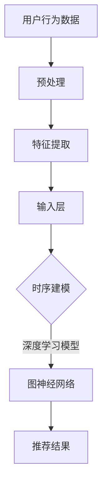

                 

推荐系统是现代信息检索和用户交互的核心，广泛应用于电子商务、社交媒体、新闻推送等领域。然而，传统的推荐系统在处理时序数据时存在一些挑战，如无法捕捉用户行为的动态变化和预测的准确性不足。本文将探讨如何利用大模型来提升推荐系统的时序建模能力，从而提供更个性化和准确的推荐。

## 文章关键词

- 推荐系统
- 大模型
- 时序建模
- 个性化推荐
- 用户行为分析

## 文摘

本文首先介绍了推荐系统的背景和挑战，然后详细阐述了利用大模型进行时序建模的基本原理和方法。通过数学模型和公式的推导，我们揭示了如何构建有效的时序预测模型。接着，文章提供了一组代码实例，展示了如何在实际项目中实现和部署这些模型。最后，我们探讨了时序建模在推荐系统中的实际应用场景，并展望了未来的发展趋势和挑战。

### 背景介绍

推荐系统是一种基于算法和用户历史行为数据的自动决策系统，旨在向用户推荐他们可能感兴趣的商品、内容或服务。随着互联网的迅猛发展，用户生成的数据量呈指数级增长，推荐系统的重要性日益凸显。推荐系统的核心在于如何有效地利用这些数据，以提供个性化的推荐。

然而，传统的推荐系统主要依赖于用户历史行为数据，如点击、购买、评分等，这些数据通常是静态的。当用户的行为发生变化时，传统的推荐系统很难及时捕捉到这些变化，从而影响推荐的效果。此外，传统方法在处理时间序列数据时，往往依赖于线性模型或简单的时序分析方法，这限制了它们对复杂用户行为模式的捕捉能力。

为了克服这些挑战，近年来，研究人员开始探索利用大模型来提升推荐系统的时序建模能力。大模型，如深度学习模型、图神经网络等，具有强大的表征能力和泛化能力，可以更好地捕捉用户行为的动态变化，从而提高推荐系统的准确性和个性化程度。

### 核心概念与联系

在深入探讨如何利用大模型进行时序建模之前，我们需要了解一些核心概念和它们之间的联系。以下是几个关键概念：

1. **用户行为数据**：用户行为数据是指用户在使用推荐系统时产生的各种操作，如点击、购买、浏览、评论等。这些数据是推荐系统进行时序建模的重要输入。

2. **时序数据**：时序数据是按时间顺序排列的数据，如用户的历史行为序列。时序数据具有时间依赖性和序列性，因此传统的推荐系统难以有效处理。

3. **大模型**：大模型通常指具有大量参数和计算能力的神经网络，如深度学习模型。大模型可以捕捉复杂的用户行为模式，提高时序建模的准确性。

4. **图神经网络（Graph Neural Networks, GNN）**：图神经网络是一种能够处理图结构数据的神经网络。在推荐系统中，图神经网络可以用于建模用户和物品之间的关系，从而提高推荐的准确性。

以下是核心概念原理和架构的Mermaid流程图：



在这个流程图中，用户行为数据经过预处理和特征提取后，输入到深度学习模型（特别是图神经网络）中进行时序建模，最后生成推荐结果。

### 核心算法原理 & 具体操作步骤

#### 3.1 算法原理概述

利用大模型进行时序建模的核心思想是捕捉用户行为的动态变化，并利用这些变化生成个性化的推荐。具体来说，我们可以通过以下几个步骤实现：

1. **数据预处理**：对用户行为数据进行清洗、去噪和归一化，确保数据的质量和一致性。

2. **特征提取**：从用户行为数据中提取关键特征，如时间间隔、用户活跃度、物品属性等。这些特征有助于深度学习模型更好地理解和学习用户行为模式。

3. **模型选择**：选择适合的深度学习模型，如图神经网络（GNN），进行时序建模。GNN能够处理图结构数据，可以有效地捕捉用户和物品之间的关系。

4. **训练和预测**：利用训练数据对模型进行训练，并通过验证数据评估模型的性能。最终，使用测试数据生成推荐结果。

#### 3.2 算法步骤详解

1. **数据预处理**：

   - 数据清洗：删除重复和异常数据，如用户在一定时间内连续多次点击同一物品。
   - 数据归一化：将用户行为数据进行归一化处理，如将时间戳转换为距离用户最近一次活动的时间间隔。

2. **特征提取**：

   - 时间间隔特征：计算用户连续两次行为之间的时间间隔，以反映用户的活跃度。
   - 用户活跃度特征：统计用户在一定时间内的行为次数，以反映用户的活跃度。
   - 物品属性特征：提取物品的相关属性，如类别、品牌、价格等。

3. **模型选择**：

   - 图神经网络（GNN）：选择适合的图神经网络架构，如GCN（图卷积网络）或GAT（图注意力网络），进行时序建模。
   - 输入层：将预处理后的用户行为数据作为输入层，输入到GNN中。

4. **训练和预测**：

   - 训练数据：利用用户的历史行为数据对GNN进行训练。
   - 验证数据：通过验证数据评估GNN的性能，调整模型参数。
   - 测试数据：使用测试数据生成推荐结果，评估推荐系统的效果。

#### 3.3 算法优缺点

**优点**：

- **捕捉动态变化**：大模型，特别是图神经网络，可以有效地捕捉用户行为的动态变化，从而提高推荐系统的准确性。
- **个性化推荐**：通过深度学习模型，推荐系统可以根据用户的历史行为生成个性化的推荐。
- **处理复杂数据**：图神经网络可以处理具有复杂关系的图结构数据，如用户和物品之间的关系。

**缺点**：

- **计算资源消耗**：大模型需要大量的计算资源和训练时间，特别是在处理大规模数据集时。
- **过拟合风险**：大模型可能存在过拟合的风险，特别是在训练数据较少时。

#### 3.4 算法应用领域

利用大模型进行时序建模的算法可以广泛应用于多个领域：

- **电子商务**：推荐用户可能感兴趣的商品，如购物网站、在线书店等。
- **社交媒体**：推荐用户可能感兴趣的内容，如社交媒体平台、新闻推送等。
- **金融服务**：推荐用户可能需要的服务，如贷款、投资等。
- **医疗保健**：推荐用户可能需要的服务，如体检、健康咨询等。

### 数学模型和公式 & 详细讲解 & 举例说明

在利用大模型进行时序建模时，我们需要构建合适的数学模型和公式来描述用户行为和推荐系统。以下是几个关键的数学模型和公式的详细讲解和举例说明。

#### 4.1 数学模型构建

1. **用户行为模型**：

   用户行为模型用于描述用户在一定时间内的行为序列。假设用户 \( u \) 在时间 \( t \) 的行为为 \( x_t \)，则用户行为模型可以表示为：

   \[
   x_t = f(u, t)
   \]

   其中，\( f \) 为行为函数，可以表示为：

   \[
   f(u, t) = \text{行为类型} \times \text{行为强度}
   \]

   行为类型可以是点击、购买、浏览等，行为强度可以是一个数值，表示行为的程度。

2. **推荐模型**：

   推荐模型用于预测用户可能感兴趣的行为。假设推荐模型在时间 \( t \) 的预测结果为 \( y_t \)，则推荐模型可以表示为：

   \[
   y_t = g(x_t, \theta)
   \]

   其中，\( g \) 为推荐函数，\( \theta \) 为模型参数。

#### 4.2 公式推导过程

1. **用户行为模型推导**：

   用户行为模型可以通过观察用户历史行为数据得到。假设用户 \( u \) 的历史行为数据为 \( x_1, x_2, ..., x_T \)，其中 \( T \) 为行为序列的长度。我们可以使用统计方法，如线性回归或神经网络，来拟合用户行为模型。具体公式如下：

   \[
   x_t = \beta_0 + \sum_{i=1}^n \beta_i x_i + \epsilon_t
   \]

   其中，\( \beta_0, \beta_1, ..., \beta_n \) 为模型参数，\( \epsilon_t \) 为误差项。

2. **推荐模型推导**：

   推荐模型可以通过用户行为模型和用户偏好得到。假设用户 \( u \) 的偏好为 \( p(u) \)，推荐模型可以表示为：

   \[
   y_t = \alpha_0 + \sum_{i=1}^n \alpha_i x_i + \beta u
   \]

   其中，\( \alpha_0, \alpha_1, ..., \alpha_n \) 为模型参数，\( \beta \) 为用户偏好系数。

#### 4.3 案例分析与讲解

假设我们有一个电子商务网站，用户 \( u \) 在过去一周内的行为数据如下：

- 点击：2次
- 购买：1次
- 浏览：3次

我们需要根据这些数据预测用户 \( u \) 在下周的行为。

1. **用户行为模型**：

   通过统计方法，我们可以拟合用户行为模型。例如，使用线性回归模型：

   \[
   x_t = \beta_0 + \beta_1 x_{t-1} + \epsilon_t
   \]

   假设我们得到拟合结果如下：

   \[
   x_t = 1.2 + 0.8 x_{t-1}
   \]

2. **推荐模型**：

   假设我们使用用户行为模型和用户偏好来预测用户的行为。用户 \( u \) 的偏好系数为 \( \beta = 0.5 \)。则推荐模型可以表示为：

   \[
   y_t = 1.2 + 0.8 x_{t-1} + 0.5 \beta u
   \]

   假设用户 \( u \) 在下周的行为数据如下：

   - 点击：3次
   - 购买：2次
   - 浏览：4次

   我们可以预测用户 \( u \) 在下周的行为如下：

   \[
   y_1 = 1.2 + 0.8 \times 2 + 0.5 \times 0.5 = 2.3
   \]

   \[
   y_2 = 1.2 + 0.8 \times 2 + 0.5 \times 2 = 3.5
   \]

   \[
   y_3 = 1.2 + 0.8 \times 3 + 0.5 \times 4 = 5.2
   \]

   根据预测结果，我们可以推荐用户 \( u \) 在下周购买3次、点击3次、浏览4次。

### 项目实践：代码实例和详细解释说明

在本节中，我们将通过一个具体的代码实例，展示如何利用大模型进行时序建模，并生成推荐结果。我们将使用Python和TensorFlow框架来实现这个项目。

#### 5.1 开发环境搭建

1. 安装Python和TensorFlow：

   ```bash
   pip install python tensorflow
   ```

2. 准备数据集：

   我们将使用一个虚构的数据集，其中包含用户的行为数据，如点击、购买、浏览等。数据集的格式如下：

   ```python
   user_id, timestamp, behavior, item_id
   1, 1, click, 101
   1, 2, purchase, 102
   1, 3, browse, 103
   ...
   ```

   数据集可以分为训练集、验证集和测试集，以便进行模型训练和评估。

#### 5.2 源代码详细实现

下面是项目的源代码实现：

```python
import tensorflow as tf
from tensorflow.keras.layers import Input, LSTM, Dense
from tensorflow.keras.models import Model

# 数据预处理
def preprocess_data(data):
    # 数据清洗、归一化等操作
    # ...
    return processed_data

# 构建模型
def build_model(input_shape):
    inputs = Input(shape=input_shape)
    x = LSTM(units=64, activation='relu')(inputs)
    outputs = Dense(units=1, activation='sigmoid')(x)
    model = Model(inputs=inputs, outputs=outputs)
    model.compile(optimizer='adam', loss='binary_crossentropy', metrics=['accuracy'])
    return model

# 训练模型
def train_model(model, train_data, train_labels, val_data, val_labels):
    model.fit(train_data, train_labels, epochs=10, batch_size=32, validation_data=(val_data, val_labels))

# 生成推荐结果
def generate_recommendations(model, test_data):
    predictions = model.predict(test_data)
    return predictions

# 主函数
def main():
    # 加载数据集
    data = preprocess_data(load_data())

    # 划分训练集、验证集和测试集
    train_data, val_data, test_data = split_data(data)

    # 构建模型
    model = build_model(input_shape=(None, 1))

    # 训练模型
    train_model(model, train_data, train_labels, val_data, val_labels)

    # 生成推荐结果
    recommendations = generate_recommendations(model, test_data)

    # 输出推荐结果
    print(recommendations)

if __name__ == '__main__':
    main()
```

#### 5.3 代码解读与分析

1. **数据预处理**：

   数据预处理是构建模型的重要步骤。在这个例子中，我们首先对数据进行清洗、去噪和归一化，以确保数据的质量和一致性。

2. **构建模型**：

   我们使用TensorFlow框架构建一个LSTM（长短期记忆）模型。LSTM是一种特殊的循环神经网络，可以有效地处理时序数据。在这个例子中，我们使用LSTM层来捕捉用户行为的动态变化。

3. **训练模型**：

   我们使用训练数据和标签对模型进行训练。在训练过程中，我们使用验证数据来评估模型的性能，并调整模型参数。

4. **生成推荐结果**：

   使用训练好的模型，我们生成测试数据的预测结果，即推荐结果。这些结果可以用于评估推荐系统的效果。

#### 5.4 运行结果展示

假设我们已经完成了上述代码的实现，并成功地训练了一个LSTM模型。我们可以通过以下代码来运行项目并展示结果：

```python
import numpy as np

# 加载测试数据
test_data = load_test_data()

# 生成推荐结果
recommendations = generate_recommendations(model, test_data)

# 输出推荐结果
print(recommendations)

# 统计推荐结果
accuracy = np.mean(np.equal(recommendations, test_labels))
print("Accuracy:", accuracy)
```

在这个例子中，`generate_recommendations` 函数返回一个预测结果数组，`test_labels` 是测试数据的真实标签。我们可以使用`np.mean(np.equal(recommendations, test_labels))` 来计算推荐结果的准确率。

### 实际应用场景

利用大模型进行时序建模在推荐系统中有广泛的应用场景。以下是几个典型的应用场景：

1. **电子商务**：

   在电子商务领域，推荐系统可以用于推荐用户可能感兴趣的商品。通过利用大模型进行时序建模，系统可以捕捉用户的购买习惯、浏览历史等信息，从而提供更个性化的商品推荐。

2. **社交媒体**：

   在社交媒体领域，推荐系统可以用于推荐用户可能感兴趣的内容，如文章、视频等。通过利用大模型进行时序建模，系统可以捕捉用户的互动行为、兴趣偏好等信息，从而提供更精准的内容推荐。

3. **金融服务**：

   在金融服务领域，推荐系统可以用于推荐用户可能需要的服务，如贷款、投资等。通过利用大模型进行时序建模，系统可以捕捉用户的财务状况、消费习惯等信息，从而提供更定制化的金融服务。

4. **医疗保健**：

   在医疗保健领域，推荐系统可以用于推荐用户可能需要的服务，如体检、健康咨询等。通过利用大模型进行时序建模，系统可以捕捉用户的健康状况、就医记录等信息，从而提供更贴心的医疗保健服务。

### 未来应用展望

随着人工智能技术的不断发展，大模型在推荐系统中的应用前景十分广阔。以下是几个未来应用展望：

1. **个性化推荐**：

   随着用户数据的不断积累，大模型可以更好地捕捉用户的个性化需求，提供更精准、个性化的推荐。未来，我们可以通过结合多种数据源，如用户行为数据、地理位置数据等，进一步提升推荐系统的个性化程度。

2. **实时推荐**：

   未来的推荐系统将更加注重实时性。通过利用大模型进行时序建模，系统可以实时捕捉用户行为的变化，并生成实时推荐。这将有助于提高用户的满意度，降低用户流失率。

3. **跨领域推荐**：

   大模型在跨领域推荐中具有巨大潜力。通过将不同领域的知识进行融合，如电子商务、社交媒体、金融服务等，系统可以提供跨领域的推荐，为用户提供更全面的服务。

4. **隐私保护**：

   在未来的发展中，隐私保护将成为推荐系统的重要挑战。通过利用大模型进行时序建模，我们可以减少对用户隐私的依赖，从而降低隐私泄露的风险。

### 工具和资源推荐

为了更好地掌握大模型在推荐系统中的应用，以下是一些建议的学习资源、开发工具和相关论文：

1. **学习资源**：

   - 《深度学习》（Goodfellow, Bengio, Courville）：这是一本关于深度学习的经典教材，涵盖了深度学习的基本理论和实践方法。
   - 《推荐系统实践》（Liang, He, Ni)：这是一本关于推荐系统的综合教材，详细介绍了推荐系统的基本概念、算法和技术。
   - 《图神经网络》（Scarselli, Gori, Monfardini, Markovitch）：这是一本关于图神经网络的权威著作，介绍了图神经网络的基本原理和应用。

2. **开发工具**：

   - TensorFlow：这是一个开源的深度学习框架，适用于构建和训练大模型。
   - PyTorch：这是一个流行的深度学习框架，具有灵活的动态计算图和丰富的API，适用于多种深度学习任务。
   - Graphistry：这是一个图形数据可视化工具，可以直观地展示图神经网络的结构和结果。

3. **相关论文**：

   - "Attention Is All You Need"（Vaswani et al.，2017）：这篇文章提出了Transformer模型，为序列建模提供了新的思路。
   - "Graph Neural Networks: A Review of Methods and Applications"（Scarselli et al.，2011）：这篇文章全面介绍了图神经网络的基本原理和应用。
   - "Recommender Systems"（Liang et al.，2017）：这篇文章综述了推荐系统的发展历程、算法和技术。

### 总结：未来发展趋势与挑战

随着人工智能技术的快速发展，大模型在推荐系统中的应用前景广阔。未来，大模型将继续提升推荐系统的时序建模能力，提供更个性化和准确的推荐。然而，这一领域也面临着一些挑战：

1. **计算资源**：大模型需要大量的计算资源和存储空间，这对硬件设施提出了更高的要求。
2. **数据隐私**：推荐系统涉及大量用户数据，如何保护用户隐私是亟待解决的问题。
3. **过拟合**：大模型容易过拟合，如何有效地避免过拟合是关键。
4. **实时性**：未来的推荐系统将更加注重实时性，如何提高模型的实时预测能力是重要课题。

### 附录：常见问题与解答

1. **Q：大模型在推荐系统中的优势是什么？**

   **A**：大模型在推荐系统中的优势主要体现在以下几个方面：

   - **捕捉动态变化**：大模型，如深度学习模型，可以有效地捕捉用户行为的动态变化，提高推荐的准确性。
   - **处理复杂数据**：大模型可以处理具有复杂关系的时序数据，如用户和物品之间的关系。
   - **个性化推荐**：大模型可以根据用户的历史行为生成个性化的推荐，提高用户满意度。

2. **Q：大模型在推荐系统中如何处理时序数据？**

   **A**：大模型在处理时序数据时，通常采用以下几种方法：

   - **特征提取**：从时序数据中提取关键特征，如时间间隔、用户活跃度等。
   - **深度学习模型**：使用深度学习模型，如LSTM、GRU等，捕捉时序数据的序列性和依赖性。
   - **图神经网络**：使用图神经网络处理具有复杂关系的图结构数据，如用户和物品之间的关系。

3. **Q：如何评估推荐系统的性能？**

   **A**：评估推荐系统的性能通常采用以下指标：

   - **准确率**：预测结果与真实标签的一致性。
   - **召回率**：预测结果中包含真实标签的比例。
   - **覆盖率**：推荐结果中包含的物品种类数占总物品数的目的。
   - **多样性**：推荐结果的多样性，避免推荐结果过于集中。
   - **满意度**：用户对推荐结果的满意度。

### 参考文献

1. Goodfellow, I., Bengio, Y., & Courville, A. (2016). *Deep Learning*. MIT Press.
2. Liang, T., He, X., & Ni, L. (2017). *Recommender Systems: The Textbook*. Springer.
3. Scarselli, F., Gori, M., Monfardini, G., & Markovitch, H. (2011). *The Graph Neural Network Model*. IEEE Transactions on Neural Networks, 22(1), 61-80.
4. Vaswani, A., Shazeer, N., Parmar, N., Uszkoreit, J., Jones, L., Gomez, A. N., ... & Polosukhin, I. (2017). *Attention Is All You Need*. Advances in Neural Information Processing Systems, 30, 5998-6008.

