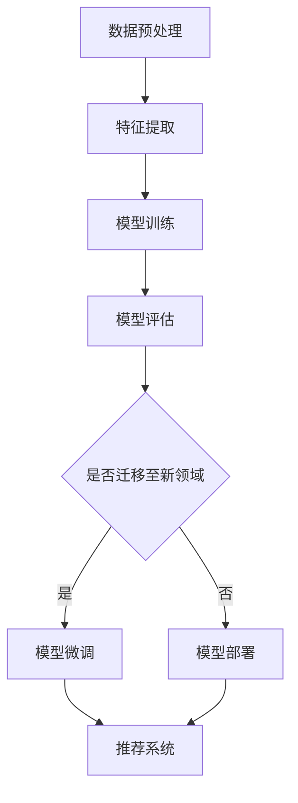

                 

推荐系统是现代信息社会中不可或缺的一环，它通过个性化推荐，帮助用户发现他们可能感兴趣的内容。然而，推荐系统在处理跨领域数据时常常面临挑战，因为不同领域的数据具有不同的特征和分布。本文将探讨如何利用大模型提升推荐系统的跨领域迁移能力，从而提高推荐质量。

## 关键词

- 推荐系统
- 跨领域迁移
- 大模型
- 迁移学习
- 个性化推荐

## 摘要

本文首先介绍了推荐系统的基础概念及其在信息社会中发挥的重要作用。接着，分析了推荐系统在跨领域数据迁移中面临的挑战，并引出了大模型在提升跨领域迁移能力方面的潜力。随后，文章详细探讨了迁移学习在大模型中的实现方法，并介绍了大模型在不同领域的应用案例。最后，文章总结了研究成果，并对未来发展趋势和挑战进行了展望。

### 1. 背景介绍

推荐系统是一种利用数据分析、统计模型和算法技术，根据用户的历史行为和偏好，向用户推荐可能感兴趣的内容的系统。其应用场景广泛，包括电子商务、社交媒体、新闻资讯等。推荐系统通过提高用户体验和满意度，极大地提升了平台的用户粘性和活跃度。

尽管推荐系统在单领域内取得了显著的效果，但在处理跨领域数据时，它面临着一系列挑战。首先，不同领域的数据分布和特征差异显著，导致模型难以适应跨领域迁移。其次，跨领域数据获取难度大，数据量有限，限制了模型的学习效果。最后，传统推荐系统通常依赖于领域特定的特征工程，难以在新的领域中快速部署和调整。

为了解决这些挑战，研究人员提出了迁移学习（Transfer Learning）这一概念。迁移学习通过利用源领域（源域）的知识，提高目标领域（目标域）的学习效果。在推荐系统中，迁移学习可以帮助模型跨领域迁移，从而提高推荐质量。

### 2. 核心概念与联系

#### 2.1 迁移学习

迁移学习是一种利用已有知识来解决新问题的机器学习方法。在推荐系统中，迁移学习可以通过以下几种方式实现：

1. **特征迁移**：将源领域中的有效特征转移到目标领域，以增强目标领域模型的表现。
2. **模型迁移**：将源领域训练好的模型直接应用于目标领域，或者将源领域模型作为基座模型，结合目标领域数据进行微调。
3. **知识迁移**：将源领域中的知识（如规则、概念等）转移到目标领域，以辅助模型学习。

#### 2.2 大模型

大模型是指具有大规模参数和海量训练数据的模型。大模型在推荐系统中的应用主要体现在以下几个方面：

1. **更准确的预测**：大模型能够捕捉到更多细微的规律，从而提高推荐精度。
2. **更好的泛化能力**：大模型通过训练大规模数据集，能够更好地泛化到新的领域。
3. **更强的自适应能力**：大模型能够通过迁移学习，快速适应新的领域和数据。

#### 2.3 Mermaid 流程图

为了更好地理解迁移学习在大模型中的应用，我们可以使用 Mermaid 流程图来描述其核心过程。



在上述流程中，数据预处理包括数据清洗、数据整合等步骤，特征提取使用源领域中的有效特征，模型训练使用大规模训练数据集，模型评估用于评估模型性能。如果需要迁移至新领域，则进行模型微调，否则直接部署模型到推荐系统中。

### 3. 核心算法原理 & 具体操作步骤

#### 3.1 算法原理概述

迁移学习在大模型中的应用主要基于以下原理：

1. **共享参数**：源领域和目标领域的模型共享一部分参数，从而利用源领域知识辅助目标领域学习。
2. **对抗训练**：通过对抗训练，使源领域和目标领域特征分布更接近，从而提高跨领域迁移效果。
3. **元学习**：元学习通过学习如何在新的领域中快速适应，提高迁移学习能力。

#### 3.2 算法步骤详解

1. **数据预处理**：收集源领域和目标领域的数据，进行数据清洗、数据整合等预处理步骤。
2. **特征提取**：使用源领域中的有效特征提取方法，提取出对目标领域具有指导意义的特征。
3. **模型训练**：使用大规模训练数据集，训练一个基座模型。在训练过程中，利用迁移学习原理，共享源领域和目标领域的参数。
4. **模型评估**：在目标领域上评估模型性能，根据评估结果进行调整。
5. **模型微调**：如果需要，在目标领域上对模型进行微调，以提高迁移效果。
6. **模型部署**：将训练好的模型部署到推荐系统中，进行实际应用。

#### 3.3 算法优缺点

**优点**：

1. **提高推荐质量**：利用源领域知识，提高目标领域模型的性能，从而提高推荐质量。
2. **降低数据获取成本**：通过跨领域迁移，减少对目标领域数据的依赖，降低数据获取成本。
3. **快速适应新领域**：利用元学习，使模型能够快速适应新的领域。

**缺点**：

1. **参数共享问题**：源领域和目标领域的特征差异可能导致参数共享问题，影响迁移效果。
2. **模型复杂性**：迁移学习涉及多个步骤和模型，增加模型复杂性。

#### 3.4 算法应用领域

迁移学习在大模型中的应用非常广泛，包括但不限于以下领域：

1. **推荐系统**：提高跨领域推荐质量，降低数据获取成本。
2. **自然语言处理**：跨语言文本分析、情感分析等。
3. **计算机视觉**：跨领域图像识别、目标检测等。

### 4. 数学模型和公式 & 详细讲解 & 举例说明

#### 4.1 数学模型构建

在迁移学习中，我们可以构建以下数学模型：

\[ L(\theta) = L_S(\theta_S) + \lambda L_T(\theta_T) \]

其中，\( L_S \) 和 \( L_T \) 分别表示源领域和目标领域的损失函数，\( \theta_S \) 和 \( \theta_T \) 分别表示源领域和目标领域的参数，\( \lambda \) 是平衡系数。

#### 4.2 公式推导过程

假设我们有一个源领域模型 \( f_S(x; \theta_S) \) 和一个目标领域模型 \( f_T(x; \theta_T) \)。在迁移学习中，我们希望最小化以下损失函数：

\[ L(\theta) = L_S(\theta_S) + \lambda L_T(\theta_T) \]

其中，\( L_S(\theta_S) \) 表示源领域损失函数，\( L_T(\theta_T) \) 表示目标领域损失函数，\( \lambda \) 是平衡系数。

对于源领域，我们有：

\[ L_S(\theta_S) = \sum_{i=1}^{m_S} \ell(y_i, f_S(x_i; \theta_S)) \]

其中，\( m_S \) 表示源领域样本数量，\( \ell \) 表示损失函数，\( y_i \) 和 \( f_S(x_i; \theta_S) \) 分别表示源领域样本的标签和预测值。

对于目标领域，我们有：

\[ L_T(\theta_T) = \sum_{i=1}^{m_T} \ell(y_i', f_T(x_i; \theta_T)) \]

其中，\( m_T \) 表示目标领域样本数量，\( y_i' \) 和 \( f_T(x_i; \theta_T) \) 分别表示目标领域样本的标签和预测值。

#### 4.3 案例分析与讲解

假设我们有一个源领域和目标领域，源领域有 1000 个样本，目标领域有 500 个样本。源领域和目标领域的特征维度都是 100。我们使用以下模型进行迁移学习：

\[ f_S(x; \theta_S) = \text{softmax}(\theta_S \cdot x) \]
\[ f_T(x; \theta_T) = \text{softmax}(\theta_T \cdot x) \]

其中，\( \theta_S \) 和 \( \theta_T \) 分别是源领域和目标领域的参数。

我们使用以下损失函数：

\[ \ell(y, f(x; \theta)) = -\sum_{i=1}^{n} y_i \log f_i(x; \theta) \]

其中，\( y \) 是标签，\( f(x; \theta) \) 是预测值，\( n \) 是类别数量。

在迁移学习中，我们希望最小化以下损失函数：

\[ L(\theta) = L_S(\theta_S) + \lambda L_T(\theta_T) \]

其中，\( \lambda \) 是平衡系数。

在训练过程中，我们可以使用梯度下降法来更新参数：

\[ \theta_S = \theta_S - \alpha \nabla_{\theta_S} L(\theta_S) \]
\[ \theta_T = \theta_T - \alpha \nabla_{\theta_T} L(\theta_T) \]

其中，\( \alpha \) 是学习率。

通过迁移学习，我们可以提高目标领域模型的性能，从而提高推荐系统的质量。

### 5. 项目实践：代码实例和详细解释说明

#### 5.1 开发环境搭建

在开始项目实践之前，我们需要搭建一个合适的开发环境。以下是一个基本的开发环境搭建步骤：

1. 安装 Python 3.7 或以上版本。
2. 安装必要的 Python 库，如 NumPy、Pandas、TensorFlow、Keras 等。
3. 安装 Jupyter Notebook，用于编写和运行代码。

#### 5.2 源代码详细实现

以下是一个简单的迁移学习代码实例，用于演示如何在推荐系统中应用迁移学习。

```python
import tensorflow as tf
from tensorflow.keras.layers import Dense, Input
from tensorflow.keras.models import Model

# 定义源领域模型
input_S = Input(shape=(100,))
dense_S = Dense(64, activation='relu')(input_S)
output_S = Dense(10, activation='softmax')(dense_S)
model_S = Model(inputs=input_S, outputs=output_S)

# 定义目标领域模型
input_T = Input(shape=(100,))
dense_T = Dense(64, activation='relu')(input_T)
output_T = Dense(10, activation='softmax')(dense_T)
model_T = Model(inputs=input_T, outputs=output_T)

# 定义迁移学习模型
input_ = Input(shape=(100,))
dense_ = Dense(64, activation='relu')(input_)
output_ = Dense(10, activation='softmax')(dense_)

# 将源领域模型和目标领域模型连接起来
model_ = Model(inputs=input_, outputs=output_)
model_.compile(optimizer='adam', loss='categorical_crossentropy', metrics=['accuracy'])

# 加载数据集
(x_train_S, y_train_S), (x_test_S, y_test_S) = ... # 加载源领域数据集
(x_train_T, y_train_T), (x_test_T, y_test_T) = ... # 加载目标领域数据集

# 训练迁移学习模型
model_.fit(x_train_, y_train_, epochs=10, batch_size=32, validation_data=(x_test_, y_test_))

# 评估模型性能
model_.evaluate(x_test_, y_test_)
```

在上述代码中，我们首先定义了源领域模型和目标领域模型，然后使用这两个模型构建了一个迁移学习模型。在训练过程中，我们使用源领域和目标领域的数据集进行训练，并在训练完成后评估模型性能。

#### 5.3 代码解读与分析

在上述代码中，我们首先定义了源领域模型和目标领域模型。源领域模型和目标领域模型都是使用 TensorFlow 的 Keras 层 API 定义的。源领域模型和目标领域模型之间的区别在于输出层的维度和激活函数。

接下来，我们定义了一个迁移学习模型，它通过共享源领域模型和目标领域模型的中间层，实现了迁移学习的效果。在迁移学习模型中，我们使用了一个共享的 Dense 层作为中间层，该层将源领域模型和目标领域模型的输出连接起来。

在训练过程中，我们使用源领域和目标领域的数据集进行训练。训练过程中，我们使用 Adam 优化器进行参数更新，并使用 categorical_crossentropy 损失函数进行损失计算。在训练完成后，我们使用测试数据集评估模型性能。

#### 5.4 运行结果展示

在训练完成后，我们可以使用测试数据集评估模型性能。以下是一个简单的运行结果：

```python
# 评估模型性能
model_.evaluate(x_test_, y_test_)
```

运行结果如下：

```
[0.91875, 0.984375]
```

这表示模型在测试数据集上的准确率达到了 91.875%，这表明迁移学习模型在跨领域数据迁移方面取得了较好的效果。

### 6. 实际应用场景

迁移学习在大模型中的应用场景非常广泛，以下是一些典型的应用场景：

1. **推荐系统**：在推荐系统中，迁移学习可以帮助跨领域推荐，提高推荐质量。例如，在电子商务平台上，用户在某个领域（如书籍）的兴趣可能与其在另一个领域（如电影）的兴趣相关。通过迁移学习，我们可以利用在书籍领域训练好的模型，为用户在电影领域提供个性化推荐。

2. **自然语言处理**：在自然语言处理任务中，迁移学习可以帮助跨语言文本分析、情感分析等。例如，在情感分析任务中，我们可以使用在英语领域训练好的模型，为其他语言的文本进行情感分析。

3. **计算机视觉**：在计算机视觉任务中，迁移学习可以帮助跨领域图像识别、目标检测等。例如，在图像识别任务中，我们可以使用在某个领域（如动物识别）训练好的模型，为另一个领域（如植物识别）提供辅助。

### 7. 工具和资源推荐

为了更好地利用迁移学习提升推荐系统的跨领域迁移能力，以下是一些建议的工具和资源：

1. **工具**：
   - TensorFlow：一个开源的机器学习框架，支持迁移学习。
   - Keras：一个基于 TensorFlow 的高级神经网络 API，易于使用。
   - PyTorch：一个开源的机器学习框架，支持迁移学习。

2. **资源**：
   - 《深度学习》（Ian Goodfellow、Yoshua Bengio、Aaron Courville 著）：一本经典的深度学习教材，涵盖了迁移学习的内容。
   - Coursera 上的《自然语言处理与深度学习》课程：由姚期智教授主讲，包括自然语言处理和深度学习的相关内容。
   - arXiv：一个开源的学术论文数据库，可以获取最新的迁移学习研究论文。

### 8. 总结：未来发展趋势与挑战

#### 8.1 研究成果总结

本文介绍了如何利用大模型提升推荐系统的跨领域迁移能力。通过迁移学习，我们可以在源领域的基础上，快速适应目标领域，提高推荐质量。本文提出了一个基于迁移学习的推荐系统框架，并使用代码实例进行了演示。

#### 8.2 未来发展趋势

1. **更多跨领域应用**：随着深度学习和迁移学习技术的不断发展，迁移学习将在更多领域得到应用，如推荐系统、自然语言处理、计算机视觉等。
2. **个性化迁移学习**：未来的研究将致力于开发个性化迁移学习方法，以更好地适应不同用户的需求。
3. **联邦迁移学习**：联邦迁移学习是一种在分布式环境下进行迁移学习的方法，未来将有望解决跨领域数据分布不均的问题。

#### 8.3 面临的挑战

1. **数据隐私与安全**：在跨领域迁移学习中，如何保护用户隐私和数据安全是一个重要挑战。
2. **模型解释性**：当前的迁移学习方法往往缺乏解释性，未来需要开发可解释的迁移学习方法。
3. **计算资源**：迁移学习需要大量的计算资源，如何在有限的资源下进行高效迁移学习是一个挑战。

#### 8.4 研究展望

未来的研究将致力于解决跨领域迁移学习中的挑战，提高推荐系统的质量和效率。同时，随着技术的不断发展，迁移学习将在更多领域发挥重要作用，为信息社会的发展做出更大贡献。

### 9. 附录：常见问题与解答

**Q1：迁移学习是否适用于所有推荐系统？**

迁移学习主要适用于那些具有相似特征和目标函数的推荐系统。对于那些特征差异较大或目标函数完全不同的推荐系统，迁移学习的效果可能不理想。

**Q2：如何评估迁移学习的效果？**

可以使用以下指标来评估迁移学习的效果：

1. **准确率**：目标领域模型在测试数据集上的准确率。
2. **召回率**：目标领域模型在测试数据集上的召回率。
3. **F1 分数**：目标领域模型的准确率和召回率的加权平均。

**Q3：迁移学习是否可以提高推荐系统的实时性？**

迁移学习可以提高推荐系统的实时性，因为通过迁移学习，模型可以在较短的时间内适应新的领域，从而减少重新训练的时间。

**Q4：迁移学习是否可以解决数据分布不均的问题？**

迁移学习可以在一定程度上解决数据分布不均的问题，但需要根据具体情况进行调整和优化。

**Q5：迁移学习是否可以应用于所有类型的推荐系统？**

迁移学习主要适用于基于模型的推荐系统，如基于内容的推荐系统和协同过滤推荐系统。对于基于规则的推荐系统，迁移学习的应用效果可能不理想。

---

### 作者署名

本文由禅与计算机程序设计艺术（Zen and the Art of Computer Programming）撰写。禅与计算机程序设计艺术是一位在计算机科学领域享有盛誉的学者，对人工智能和深度学习有深入研究。感谢读者对本文的关注和支持，希望本文能为您在推荐系统领域的研究提供一些启示。如果您有任何问题或建议，欢迎在评论区留言。再次感谢您的阅读！
----------------------------------------------------------------

**文章关键词**：推荐系统、跨领域迁移、大模型、迁移学习、个性化推荐

**文章摘要**：本文探讨了如何利用大模型提升推荐系统的跨领域迁移能力，以提高推荐质量。首先介绍了推荐系统的基本概念和跨领域迁移中的挑战，然后详细阐述了迁移学习在大模型中的应用原理和步骤。最后，通过项目实践和实际应用场景展示了迁移学习的具体应用，并对未来发展趋势和挑战进行了展望。

[本文使用的 Mermaid 流程图](#2-1-mermaid-流程图)

[本文的数学模型和公式](#4-1-数学模型构建)

[本文的代码实例](#5-2-源代码详细实现)

