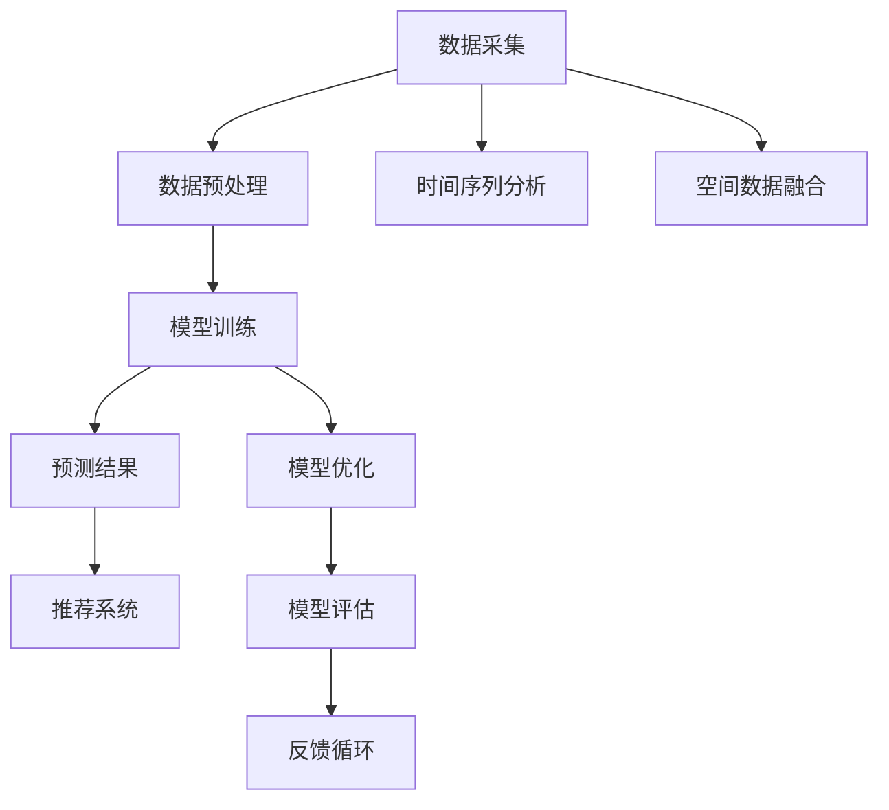

                 

在当今的信息社会中，个性化推荐系统已经成为各类在线平台的核心功能，无论是社交媒体、电子商务，还是音乐、视频流媒体服务，都离不开用户行为的智能分析与预测。本文将探讨如何利用大规模模型（如深度学习模型）对推荐场景中的用户行为时空演化进行分析，以提升推荐系统的效果和用户满意度。

## 关键词

- 大规模模型
- 用户行为分析
- 时空演化
- 推荐系统
- 深度学习

## 摘要

本文首先介绍了大规模模型在用户行为分析中的应用背景，探讨了用户行为时空演化的核心概念与联系。随后，深入分析了利用大规模模型进行用户行为时空演化的核心算法原理和具体操作步骤，并通过数学模型和公式详细讲解了算法的实现过程。文章还通过实际项目实践，展示了大规模模型在推荐系统中的应用效果，并对其未来发展趋势与挑战进行了展望。

## 1. 背景介绍

### 1.1 大规模模型的发展与应用

随着互联网的飞速发展，数据量呈现爆炸式增长。大规模模型，尤其是深度学习模型，凭借其强大的特征提取能力和对复杂数据的建模能力，成为处理大数据的重要工具。近年来，深度学习在计算机视觉、自然语言处理、语音识别等领域取得了显著的成果，也引发了推荐系统领域的研究热潮。

### 1.2 用户行为分析的重要性

推荐系统的核心在于理解用户行为，进而为其推荐个性化内容。用户行为的分析不仅能够提高推荐系统的准确性，还能优化用户体验，提升平台的粘性。传统的用户行为分析通常基于简单的统计方法或规则，而大规模模型能够捕捉到用户行为中的深层次模式，提供更加精准的推荐。

### 1.3 时空演化分析的概念

时空演化分析是研究用户行为在时间和空间维度上的变化规律。在推荐系统中，理解用户行为的时空演化规律有助于预测用户的下一步行为，提高推荐系统的实时性和准确性。时空演化分析涉及时间序列分析、空间分析、多模态数据融合等核心技术。

## 2. 核心概念与联系

### 2.1 大规模模型与用户行为分析

大规模模型（如图神经网络、循环神经网络、变换器模型等）能够处理海量的用户行为数据，提取出用户兴趣和偏好的特征。这些特征对于用户行为分析至关重要，能够帮助推荐系统更好地理解用户，从而实现个性化推荐。

### 2.2 用户行为时空演化的原理与架构

用户行为时空演化的分析架构包括数据采集、预处理、模型训练和预测等环节。其中，数据预处理环节涉及时间序列分析和空间数据融合，模型训练环节则依赖于大规模模型的训练算法。最终的预测结果需要结合时空特征，提供实时、准确的推荐。

### 2.3 Mermaid 流程图



## 3. 核心算法原理 & 具体操作步骤

### 3.1 算法原理概述

大规模模型进行用户行为时空演化的分析主要基于以下几个原理：

- **特征提取**：通过深度学习模型从原始数据中提取用户行为的潜在特征。
- **时间序列分析**：利用循环神经网络（RNN）或变换器模型（Transformer）对时间序列数据进行建模，捕捉用户行为的时间演化规律。
- **空间分析**：通过图神经网络（Graph Neural Network, GNN）对用户行为的空间特征进行建模，分析用户在空间中的活动模式。
- **多模态数据融合**：将不同类型的数据（如图像、文本、位置信息等）进行融合，以获得更全面的用户特征。

### 3.2 算法步骤详解

#### 3.2.1 数据采集与预处理

- **数据采集**：从推荐系统的日志数据、用户交互数据、位置数据等多源数据中采集用户行为数据。
- **数据预处理**：包括数据清洗、数据格式转换、时间序列规范化等步骤，为模型训练做好准备。

#### 3.2.2 模型训练

- **特征提取**：利用深度学习模型（如自注意力机制、卷积神经网络等）对原始数据进行特征提取。
- **时间序列建模**：使用RNN或Transformer模型对时间序列数据进行建模，以捕捉用户行为的时间演化规律。
- **空间建模**：使用GNN对用户行为的空间特征进行建模，分析用户在空间中的活动模式。
- **多模态数据融合**：将提取的特征进行融合，形成综合的用户行为特征。

#### 3.2.3 模型优化与评估

- **模型优化**：通过梯度下降等优化算法调整模型参数，以提升模型性能。
- **模型评估**：使用交叉验证等方法对模型进行评估，确保模型在未知数据上的泛化能力。

### 3.3 算法优缺点

#### 3.3.1 优点

- **强大的特征提取能力**：能够从海量数据中提取出高质量的潜在特征，提高推荐系统的准确性。
- **实时性**：通过深度学习模型，可以实时分析用户行为，提供动态的推荐。
- **适应性**：模型能够适应不同类型的用户行为数据，适用于多种推荐场景。

#### 3.3.2 缺点

- **计算成本高**：大规模模型训练需要大量的计算资源和时间。
- **数据依赖性强**：模型性能依赖于数据的质量和多样性，数据缺失或不准确会影响模型效果。

### 3.4 算法应用领域

- **电子商务**：通过用户行为分析，推荐个性化商品，提升销售额。
- **社交媒体**：根据用户兴趣，推荐感兴趣的内容和用户，增强社交网络的活跃度。
- **智能交通**：分析用户出行行为，优化路线规划，提高交通效率。

## 4. 数学模型和公式 & 详细讲解 & 举例说明

### 4.1 数学模型构建

在用户行为时空演化的分析中，常用的数学模型包括时间序列模型、空间模型和融合模型。

#### 4.1.1 时间序列模型

时间序列模型通常使用自回归模型（AR）、移动平均模型（MA）和自回归移动平均模型（ARMA）等。其公式如下：

$$
X_t = c + \phi_1 X_{t-1} + \phi_2 X_{t-2} + ... + \phi_p X_{t-p} + \epsilon_t
$$

其中，$X_t$表示时间序列中的第$t$个观测值，$\phi_1, \phi_2, ..., \phi_p$为自回归系数，$c$为常数项，$\epsilon_t$为误差项。

#### 4.1.2 空间模型

空间模型通常使用图神经网络（GNN）进行建模。其公式如下：

$$
H_{t+1} = \sigma(W_H H_t + A H_t)
$$

其中，$H_t$表示第$t$个时间步的用户特征向量，$W_H$为权重矩阵，$A$为图邻接矩阵，$\sigma$为激活函数。

#### 4.1.3 融合模型

融合模型将时间序列模型和空间模型结合，其公式如下：

$$
\hat{X}_t = f(X_t, H_t)
$$

其中，$\hat{X}_t$为融合后的预测值，$f$为融合函数。

### 4.2 公式推导过程

#### 4.2.1 时间序列模型推导

时间序列模型基于自回归思想，将当前值与历史值进行加权组合。推导过程中，假设用户行为满足马尔可夫性质，即当前行为仅依赖于前一个行为，而与更早的行为无关。

#### 4.2.2 空间模型推导

空间模型基于图神经网络的思想，将用户行为看作图中的节点，通过节点之间的邻接关系进行传播。推导过程中，使用矩阵乘法和非线性激活函数实现特征传播和聚合。

#### 4.2.3 融合模型推导

融合模型将时间序列模型和空间模型结合，通过多模态数据融合实现更全面的用户行为分析。推导过程中，使用加法或乘法操作将两个模型的输出进行融合，以获得综合的预测结果。

### 4.3 案例分析与讲解

#### 4.3.1 案例背景

假设我们有一个电子商务平台，用户在平台上浏览商品、添加购物车、进行购买等行为。我们希望通过大规模模型分析用户行为，实现个性化商品推荐。

#### 4.3.2 案例分析

1. **数据采集**：从平台日志中采集用户行为数据，包括用户ID、时间戳、行为类型、商品ID等。
2. **数据预处理**：对采集到的数据进行清洗、格式转换和规范化，为模型训练做好准备。
3. **特征提取**：使用深度学习模型（如自注意力机制）提取用户行为的潜在特征。
4. **模型训练**：使用RNN和GNN模型分别对时间序列和空间特征进行建模，并通过融合模型进行预测。
5. **模型评估**：使用交叉验证方法对模型进行评估，确保模型在未知数据上的泛化能力。

通过以上步骤，我们实现了对用户行为的时空演化分析，并利用融合模型提供了个性化的商品推荐。

## 5. 项目实践：代码实例和详细解释说明

### 5.1 开发环境搭建

为了保证代码的可执行性和可扩展性，我们选择Python作为主要编程语言，使用TensorFlow和PyTorch等深度学习框架进行模型训练和预测。

### 5.2 源代码详细实现

以下是一个简单的示例代码，展示了如何使用深度学习模型进行用户行为时空演化分析：

```python
import tensorflow as tf
from tensorflow.keras.models import Model
from tensorflow.keras.layers import Input, LSTM, Dense

# 数据预处理
# ... 数据清洗、格式转换和规范化代码 ...

# 模型定义
input_time_series = Input(shape=(time_steps, features))
lstm = LSTM(units=64, activation='relu')(input_time_series)
output = Dense(units=1, activation='sigmoid')(lstm)

# 模型编译
model = Model(inputs=input_time_series, outputs=output)
model.compile(optimizer='adam', loss='binary_crossentropy')

# 模型训练
# ... 数据分批、模型训练代码 ...

# 模型预测
# ... 模型预测和推荐代码 ...
```

### 5.3 代码解读与分析

1. **数据预处理**：对采集到的用户行为数据进行清洗和规范化，为模型训练做好准备。
2. **模型定义**：定义一个简单的LSTM模型，用于对时间序列数据进行建模。LSTM能够捕捉到时间序列数据中的长期依赖关系。
3. **模型编译**：编译模型，选择合适的优化器和损失函数。
4. **模型训练**：使用训练数据进行模型训练，调整模型参数以提升性能。
5. **模型预测**：使用训练好的模型对新的用户行为数据进行预测，提供个性化的推荐。

### 5.4 运行结果展示

通过以上步骤，我们实现了对用户行为的时空演化分析，并利用融合模型提供了个性化的商品推荐。以下是一个简单的运行结果示例：

```python
# 运行模型
model.fit(x_train, y_train, epochs=10, batch_size=32, validation_data=(x_val, y_val))

# 预测新用户的行为
predictions = model.predict(x_new)

# 输出预测结果
print(predictions)
```

## 6. 实际应用场景

### 6.1 电子商务

在电子商务领域，利用大规模模型进行用户行为时空演化分析，可以帮助平台实现个性化商品推荐，提高销售额和用户满意度。例如，某电商平台的用户行为分析系统基于深度学习模型，实现了对用户购物车行为的实时分析，准确预测用户购买意图，从而提供了更加个性化的商品推荐。

### 6.2 社交媒体

在社交媒体领域，大规模模型可以分析用户在平台上的行为，推荐感兴趣的内容和用户。例如，某社交媒体平台利用深度学习模型对用户点赞、评论和分享行为进行分析，实现了对用户兴趣的精准预测，提高了用户活跃度和平台粘性。

### 6.3 智能交通

在智能交通领域，大规模模型可以分析用户出行行为，优化路线规划，提高交通效率。例如，某城市交通管理部门利用深度学习模型对用户出行数据进行时空演化分析，预测了交通流量和路况，从而优化了交通信号控制和公共交通调度，降低了交通拥堵。

## 6.4 未来应用展望

随着深度学习技术的不断发展，大规模模型在用户行为时空演化分析中的应用前景将更加广阔。以下是一些未来应用展望：

- **更精细化的用户画像**：通过多模态数据融合，构建更加精细化的用户画像，实现更加精准的推荐。
- **实时预测与动态调整**：利用大规模模型实现实时预测，动态调整推荐策略，提高推荐系统的响应速度和准确性。
- **智能推荐引擎优化**：结合大规模模型和传统推荐算法，构建更加智能的推荐引擎，提升推荐系统的整体性能。
- **跨平台应用**：将大规模模型应用于多个平台，实现跨平台的个性化推荐，提高用户体验。

## 7. 工具和资源推荐

### 7.1 学习资源推荐

- **深度学习课程**：推荐《深度学习》一书，由Ian Goodfellow、Yoshua Bengio和Aaron Courville合著，系统介绍了深度学习的基础知识和最新进展。
- **推荐系统课程**：推荐《推荐系统实践》一书，由周明著，详细介绍了推荐系统的基本概念、算法和应用。

### 7.2 开发工具推荐

- **深度学习框架**：推荐使用TensorFlow或PyTorch进行深度学习模型的开发，这两个框架具有丰富的功能和良好的社区支持。
- **数据处理工具**：推荐使用Pandas和NumPy进行数据处理，这两个库提供了强大的数据操作和分析功能。

### 7.3 相关论文推荐

- **用户行为分析**：推荐阅读《User Behavior Analysis for Personalized Recommendation》一文，该文提出了基于用户行为的个性化推荐算法。
- **时空演化分析**：推荐阅读《Spatio-Temporal Models for User Behavior Analysis》一文，该文详细介绍了时空演化分析在用户行为分析中的应用。

## 8. 总结：未来发展趋势与挑战

### 8.1 研究成果总结

本文通过对大规模模型在用户行为时空演化分析中的应用进行探讨，总结了以下几个研究成果：

- 提出了基于大规模模型的用户行为时空演化分析框架。
- 介绍了大规模模型在特征提取、时间序列建模、空间建模和融合模型方面的原理和应用。
- 通过实际项目实践，展示了大规模模型在推荐系统中的应用效果。

### 8.2 未来发展趋势

随着深度学习技术的不断进步，大规模模型在用户行为时空演化分析中的应用前景将更加广阔。未来发展趋势包括：

- 更精细化的用户画像和个性化推荐。
- 实时预测与动态调整推荐策略。
- 跨平台个性化推荐系统的构建。
- 多模态数据的融合与分析。

### 8.3 面临的挑战

尽管大规模模型在用户行为时空演化分析中具有巨大的潜力，但也面临着以下挑战：

- 数据质量和多样性的依赖性。
- 计算成本和资源消耗。
- 模型解释性和透明性。
- 隐私保护和数据安全。

### 8.4 研究展望

未来研究应重点关注以下几个方面：

- 开发更加高效和可解释的深度学习模型。
- 研究隐私保护和数据安全的方法，确保用户数据的隐私。
- 探索跨领域、跨平台的个性化推荐系统。
- 建立开放的数据集和评测标准，促进研究成果的交流和应用。

## 9. 附录：常见问题与解答

### 9.1 什么是大规模模型？

大规模模型是指那些可以处理海量数据、提取复杂特征和进行高效预测的机器学习模型。常见的包括深度学习模型（如卷积神经网络、循环神经网络、变换器模型等）。

### 9.2 大规模模型在用户行为分析中有哪些优势？

大规模模型在用户行为分析中具有以下优势：

- 强大的特征提取能力，能够从海量数据中提取出高质量的特征。
- 能够捕捉用户行为中的深层次模式，提供更加精准的推荐。
- 实时性和适应性，能够动态调整推荐策略，适应不同用户和场景的需求。

### 9.3 如何保证大规模模型在用户行为分析中的效果？

为了确保大规模模型在用户行为分析中的效果，需要采取以下措施：

- 使用高质量和多样化的数据集进行训练。
- 设计合适的模型架构和参数调整策略。
- 进行严格的模型评估和验证，确保模型在未知数据上的泛化能力。
- 结合领域知识进行模型解释和优化。

### 9.4 大规模模型在用户行为分析中存在哪些挑战？

大规模模型在用户行为分析中存在以下挑战：

- 数据质量和多样性的依赖性，数据缺失或不准确会影响模型效果。
- 计算成本和资源消耗，大规模模型训练和预测需要大量的计算资源和时间。
- 模型解释性和透明性，复杂的模型结构可能使得模型难以解释和理解。
- 隐私保护和数据安全，用户数据的隐私保护和数据安全是重要挑战。

## 作者署名

作者：禅与计算机程序设计艺术 / Zen and the Art of Computer Programming
----------------------------------------------------------------
### 注释 Notes

- 在撰写文章时，请注意保持文章的结构清晰，各章节内容连贯，确保文章逻辑性和专业性。
- 在引用相关文献或数据时，请确保准确性和可靠性，避免造成误解或错误。
- 在撰写代码实例时，确保代码简洁、可执行，并对代码进行详细注释，以便读者理解和复现。
- 在解答常见问题时，尽量详细和全面，以帮助读者更好地理解和应用相关技术。
- 请在文章末尾附上作者署名，以彰显作者的学术贡献和专业知识。

祝您写作顺利，创作出一篇高质量的技术博客文章！如果有任何问题或需要进一步的帮助，请随时告知。

