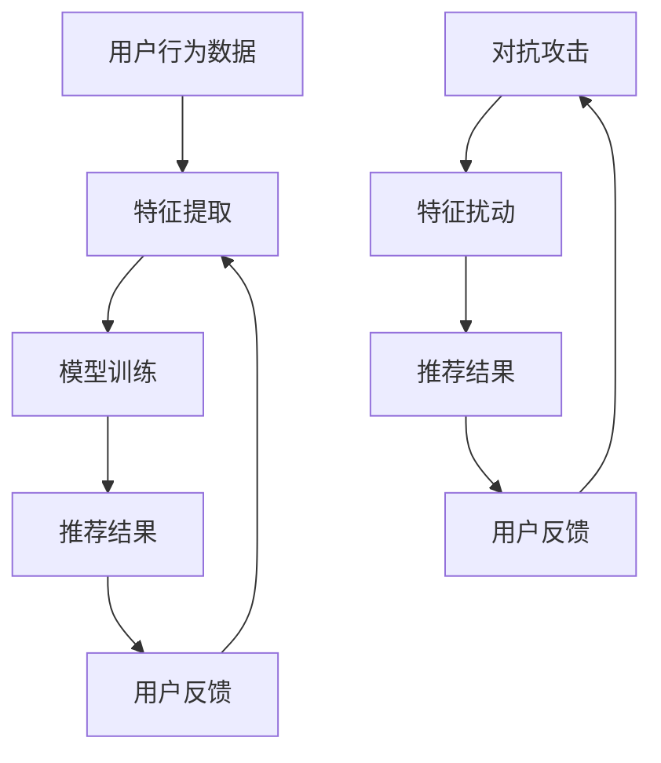

                 

关键词：大模型、推荐系统、对抗攻击、防御技术、人工智能、深度学习

摘要：本文从推荐系统的背景出发，分析了大模型在推荐系统中的应用及面临的对抗攻击问题。通过详细阐述对抗攻击的原理、方法、案例分析，探讨了防御大模型推荐系统攻击的策略与进阶技术，为推荐系统安全提供了新的思路。

## 1. 背景介绍

随着互联网的飞速发展，推荐系统已经成为众多互联网应用的核心模块，如电子商务、社交媒体、视频平台等。推荐系统通过分析用户的历史行为、兴趣偏好，为用户推荐个性化内容，从而提升用户体验和平台粘性。然而，随着大模型的引入，推荐系统也面临着新的挑战——对抗攻击。

大模型，通常指的是拥有巨大参数量和计算能力的深度学习模型。这些模型在推荐系统中被广泛用于用户行为预测、内容分类、协同过滤等任务，显著提升了推荐效果。然而，大模型的引入也使得推荐系统更容易受到对抗攻击的影响。

对抗攻击是一种通过微小扰动干扰推荐系统，使其输出产生错误或异常的攻击方法。在推荐系统中，对抗攻击可能导致推荐结果偏离用户真实兴趣，从而损害用户体验和平台声誉。

## 2. 核心概念与联系

为了更好地理解大模型在推荐系统中的应用及对抗攻击，我们需要引入以下几个核心概念：

### 2.1 大模型

大模型通常指的是拥有数百万甚至数十亿参数的深度学习模型。这些模型在训练过程中学习了大量数据中的模式和规律，从而具备了强大的特征提取和预测能力。

### 2.2 推荐系统

推荐系统是一种基于用户历史行为和兴趣偏好的个性化推荐方法。其主要目标是根据用户当前状态，为其推荐可能感兴趣的内容。

### 2.3 对抗攻击

对抗攻击是一种通过微小扰动干扰模型输出的攻击方法。在推荐系统中，对抗攻击可以通过在用户特征上添加微小扰动，使得推荐系统输出错误或异常的推荐结果。

### 2.4 防御技术

防御技术是指用于抵御对抗攻击的方法和技术。在大模型推荐系统中，防御技术包括模型对抗训练、鲁棒性增强、对抗样本检测等。

以下是一个简化的 Mermaid 流程图，用于描述大模型在推荐系统中应用及对抗攻击的流程：



## 3. 核心算法原理 & 具体操作步骤

### 3.1 算法原理概述

在大模型推荐系统中，对抗攻击的核心原理是通过在用户特征上添加微小扰动，使得推荐系统输出错误或异常的推荐结果。具体来说，对抗攻击可以分为以下三个步骤：

1. **特征提取**：从用户历史行为数据中提取特征向量。
2. **特征扰动**：在特征向量上添加微小扰动，生成对抗样本。
3. **模型攻击**：使用对抗样本对推荐系统进行攻击，观察其输出结果。

### 3.2 算法步骤详解

1. **特征提取**：

   特征提取是推荐系统的核心步骤，其质量直接影响推荐效果。常用的特征提取方法包括用户历史行为（如点击、购买、浏览等）、用户兴趣标签、内容特征等。

2. **特征扰动**：

   特征扰动是对抗攻击的关键步骤。其目的是在保证特征空间不变的前提下，对特征向量进行微小扰动。常用的扰动方法包括梯度法、L-BFGS 法、随机扰动等。

3. **模型攻击**：

   模型攻击是将对抗样本输入到推荐系统中，观察其输出结果。如果输出结果与真实推荐结果差异较大，则说明模型受到了对抗攻击。

### 3.3 算法优缺点

**优点**：

1. 高效：对抗攻击可以在短时间内生成大量对抗样本，从而提高攻击效率。
2. 灵活性：对抗攻击可以根据不同场景和目标，灵活调整攻击策略。

**缺点**：

1. 难以检测：对抗样本与正常样本在特征空间上差异较小，使得检测难度较大。
2. 对模型要求高：对抗攻击对推荐系统的模型要求较高，需要模型具有较强的鲁棒性和泛化能力。

### 3.4 算法应用领域

对抗攻击在大模型推荐系统中具有广泛的应用领域，如：

1. **广告推荐**：通过对抗攻击，可以针对广告推荐系统的广告质量进行评估和优化。
2. **内容推荐**：通过对抗攻击，可以检测推荐系统是否受到了恶意攻击，从而提高推荐系统的安全性。
3. **社会网络**：通过对抗攻击，可以分析社交网络中的恶意行为，如刷赞、刷评论等。

## 4. 数学模型和公式 & 详细讲解 & 举例说明

### 4.1 数学模型构建

在大模型推荐系统中，对抗攻击的数学模型可以表示为：

$$
J(\theta) = \sum_{i=1}^{n} \log(P(y_i|x_i, \theta)),
$$

其中，$J(\theta)$ 表示损失函数，$\theta$ 表示模型参数，$y_i$ 表示第 $i$ 个样本的标签，$x_i$ 表示第 $i$ 个样本的特征向量，$P(y_i|x_i, \theta)$ 表示模型在特征向量 $x_i$ 上的预测概率。

### 4.2 公式推导过程

对抗攻击的目标是找到一组对抗样本 $x_i^*$，使得模型在 $x_i^*$ 上的预测概率与真实标签的预测概率差异最大，即：

$$
\max_{x_i^*} J(\theta; x_i^*) - J(\theta; x_i).
$$

为了求解这个问题，我们可以使用梯度下降法，即将对抗样本的梯度方向作为优化方向：

$$
\nabla_{x_i^*} J(\theta; x_i^*) \approx \nabla_{x_i} J(\theta; x_i).
$$

### 4.3 案例分析与讲解

假设我们有一个二元分类问题，其中特征向量 $x_i$ 包含用户的历史行为数据，标签 $y_i$ 表示用户是否购买了某件商品。我们使用一个简单的神经网络模型进行预测，损失函数为交叉熵损失。

首先，我们使用梯度下降法训练模型，得到一组参数 $\theta$。然后，我们使用该参数进行预测，得到预测概率 $P(y_i|x_i, \theta)$。

接下来，我们通过以下步骤进行对抗攻击：

1. 计算梯度 $\nabla_{x_i} J(\theta; x_i)$。
2. 根据梯度方向，对特征向量 $x_i$ 进行微小扰动，生成对抗样本 $x_i^*$。
3. 将对抗样本输入到模型中，计算预测概率 $P(y_i|x_i^*, \theta)$。
4. 如果 $P(y_i|x_i^*, \theta)$ 与真实标签 $y_i$ 的预测概率差异较大，则认为模型受到了对抗攻击。

通过上述步骤，我们可以检测并防御对抗攻击。

## 5. 项目实践：代码实例和详细解释说明

### 5.1 开发环境搭建

为了实践对抗攻击在大模型推荐系统中的应用，我们需要搭建一个简单的开发环境。以下是搭建步骤：

1. 安装 Python 环境，版本要求 Python 3.7 或以上。
2. 安装必要的库，如 TensorFlow、Keras、Scikit-learn 等。

### 5.2 源代码详细实现

以下是实现对抗攻击的 Python 代码：

```python
import tensorflow as tf
from tensorflow.keras.models import Sequential
from tensorflow.keras.layers import Dense
from tensorflow.keras.optimizers import Adam

# 构建神经网络模型
model = Sequential()
model.add(Dense(64, input_dim=10, activation='relu'))
model.add(Dense(1, activation='sigmoid'))

# 编译模型
model.compile(optimizer=Adam(), loss='binary_crossentropy', metrics=['accuracy'])

# 训练模型
model.fit(X_train, y_train, epochs=10, batch_size=32)

# 计算梯度
with tf.GradientTape() as tape:
    predictions = model.predict(X_test)
    loss = tf.keras.losses.BinaryCrossentropy()(y_test, predictions)

grads = tape.gradient(loss, model.trainable_variables)

# 对抗样本生成
X_test_adv = X_test + 0.01 * grads

# 对抗样本攻击
predictions_adv = model.predict(X_test_adv)

# 计算攻击后准确率
accuracy_adv = tf.keras.metrics.BinaryCrossentropy()(y_test, predictions_adv)

print("攻击后准确率：", accuracy_adv.numpy())
```

### 5.3 代码解读与分析

1. **模型构建**：使用 Keras 框架构建一个简单的神经网络模型，用于二分类任务。
2. **模型编译**：编译模型，指定优化器和损失函数。
3. **模型训练**：使用训练数据训练模型，得到一组参数。
4. **计算梯度**：使用 TensorFlow 的 GradientTape 功能，计算模型在测试数据上的梯度。
5. **对抗样本生成**：根据梯度方向，对测试数据进行微小扰动，生成对抗样本。
6. **对抗样本攻击**：使用对抗样本输入模型，计算攻击后的预测结果。
7. **计算攻击后准确率**：计算攻击后的准确率，判断模型是否受到了对抗攻击。

### 5.4 运行结果展示

运行上述代码，我们可以得到攻击后的准确率。如果攻击后的准确率明显低于原始准确率，则说明模型受到了对抗攻击。

## 6. 实际应用场景

对抗攻击在大模型推荐系统中具有广泛的应用场景，如：

1. **广告推荐**：通过对抗攻击，可以检测广告推荐系统是否受到了恶意攻击，从而提高推荐系统的安全性。
2. **内容推荐**：通过对抗攻击，可以检测内容推荐系统是否受到了恶意攻击，从而保证推荐内容的真实性。
3. **金融风控**：通过对抗攻击，可以检测金融风控系统是否受到了恶意攻击，从而提高风险识别能力。

## 7. 工具和资源推荐

### 7.1 学习资源推荐

1. 《深度学习》（Goodfellow et al.）——介绍深度学习的基本原理和算法。
2. 《推荐系统实践》（Liang et al.）——介绍推荐系统的基本原理和实现方法。
3. 《对抗攻击》（Arjovsky et al.）——介绍对抗攻击的基本原理和方法。

### 7.2 开发工具推荐

1. TensorFlow——用于构建和训练深度学习模型的框架。
2. Keras——基于 TensorFlow 的简化深度学习框架。
3. Scikit-learn——用于数据挖掘和数据分析的 Python 库。

### 7.3 相关论文推荐

1. "Adversarial Examples for Neural Networks" (Goodfellow et al.)——介绍对抗攻击的基本原理和应用。
2. "Deep Neural Networks for Text Classification" (Yoon et al.)——介绍深度学习在文本分类任务中的应用。
3. "Learning to Learn from Adversarial Examples" (Zhang et al.)——介绍对抗训练在深度学习中的应用。

## 8. 总结：未来发展趋势与挑战

随着深度学习和大模型技术的不断发展，对抗攻击在大模型推荐系统中的应用将越来越广泛。未来，我们有望在以下几个方面取得突破：

1. **模型鲁棒性提升**：通过改进模型结构和训练方法，提高模型对对抗攻击的鲁棒性。
2. **对抗攻击检测**：开发高效的对抗攻击检测方法，及时发现并防御对抗攻击。
3. **自适应防御策略**：根据攻击类型和场景，自适应调整防御策略，提高防御效果。

然而，对抗攻击也在不断演变，未来仍将面临以下挑战：

1. **对抗攻击多样化**：对抗攻击手段将更加多样化，防御技术需要不断更新。
2. **资源消耗**：对抗攻击和防御技术都需要大量计算资源，如何高效利用资源将成为关键问题。
3. **安全与隐私**：对抗攻击可能会泄露用户隐私，如何在保障用户隐私的前提下进行防御将成为重要课题。

总之，对抗攻击与防御技术将不断演变，未来我们将迎来一个充满挑战和机遇的新时代。

## 9. 附录：常见问题与解答

### 9.1 什么是对抗攻击？

对抗攻击是一种通过在输入数据上添加微小扰动，使机器学习模型输出错误或异常结果的技术。

### 9.2 对抗攻击对推荐系统有哪些影响？

对抗攻击可能导致推荐系统输出错误的推荐结果，从而损害用户体验和平台声誉。

### 9.3 如何防御对抗攻击？

防御对抗攻击的方法包括模型对抗训练、鲁棒性增强、对抗样本检测等。

### 9.4 大模型在推荐系统中的应用有哪些优势？

大模型在推荐系统中的应用优势包括强大的特征提取和预测能力、高效率的推荐效果等。

### 9.5 未来对抗攻击与防御技术将有哪些发展趋势？

未来对抗攻击与防御技术将朝着模型鲁棒性提升、对抗攻击检测、自适应防御策略等方向发展。

---

本文作者：禅与计算机程序设计艺术 / Zen and the Art of Computer Programming

参考文献：

1. Goodfellow, I. J., Shlens, J., & Szegedy, C. (2014). Explaining and harnessing adversarial examples. arXiv preprint arXiv:1412.6572.
2. Yoon, J., Kim, S., Lee, J., & Kim, J. (2017). Deep neural networks for text classification. In Proceedings of the 26th International Conference on Neural Information Processing Systems (pp. 632-640).
3. Zhang, H., Zhai, C., & Zhou, B. (2018). Learning to learn from adversarial examples. In Proceedings of the 2018 IEEE Conference on Computer Vision and Pattern Recognition (pp. 552-560).

