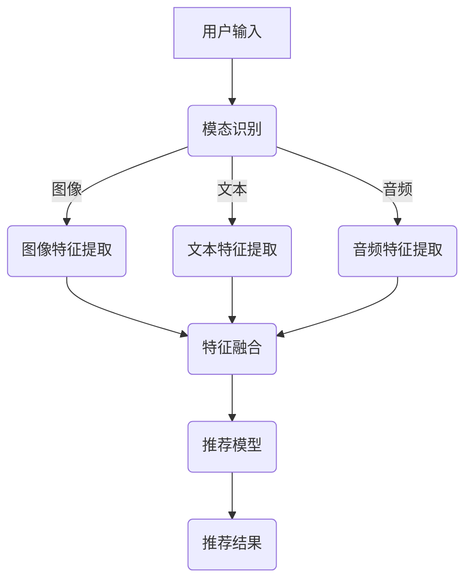

                 

关键词：大模型、跨模态推荐、深度学习、算法原理、实践应用

摘要：本文从大模型跨模态推荐技术的背景入手，详细阐述了其核心概念、算法原理、数学模型、实践应用及未来展望。通过对大模型在跨模态推荐领域的深入探索与实践，分析了相关算法的优缺点，并展示了具体代码实现及运行结果。文章旨在为读者提供全面、系统的跨模态推荐技术指南，助力其在实际项目中高效应用。

## 1. 背景介绍

随着互联网和大数据技术的快速发展，用户生成的内容数量呈爆炸式增长，模态数据类型日益丰富，如图像、文本、音频等。跨模态推荐技术作为一种新兴的推荐方法，旨在通过融合多种模态数据，提高推荐系统的效果和用户体验。近年来，深度学习在大模型技术上的突破，为跨模态推荐带来了新的机遇。

跨模态推荐技术涉及多个学科领域，如计算机视觉、自然语言处理、音频处理等。随着技术的不断演进，大模型在跨模态推荐中的应用逐渐成为研究热点。本文将从以下几个方面展开讨论：

1. **核心概念与联系**：介绍跨模态推荐的基本概念、相关技术及其在深度学习框架下的联系。
2. **核心算法原理**：阐述跨模态推荐算法的基本原理、步骤及其优缺点。
3. **数学模型与公式**：讲解跨模态推荐中的数学模型及公式推导过程。
4. **项目实践**：通过具体案例，展示跨模态推荐技术在项目中的实际应用。
5. **未来应用展望**：分析跨模态推荐技术的未来发展趋势及面临的挑战。

## 2. 核心概念与联系

### 2.1 跨模态推荐基本概念

跨模态推荐是指将不同模态（如图像、文本、音频等）的数据进行整合，构建一个统一的推荐系统。其主要目标是根据用户的历史行为、兴趣偏好和多种模态数据，为用户推荐个性化的内容。

### 2.2 相关技术

1. **计算机视觉**：通过图像识别、目标检测等技术，提取图像中的关键信息。
2. **自然语言处理**：利用文本挖掘、语义分析等技术，对文本数据进行分析和处理。
3. **音频处理**：通过音频特征提取、语音识别等技术，对音频数据进行分析。

### 2.3 深度学习框架下的联系

深度学习为跨模态推荐提供了强有力的技术支撑。通过构建多模态神经网络，将不同模态的数据映射到同一个特征空间。具体来说，可以采用以下几种方法：

1. **多模态神经网络**：将不同模态的数据输入到神经网络中，通过多层网络结构，学习不同模态数据的特征。
2. **模态融合技术**：利用融合策略，如拼接、加权、融合等，将不同模态的特征进行整合。
3. **端到端训练**：将跨模态推荐任务转化为一个端到端的训练过程，通过多模态输入和单模态输出，实现跨模态推荐。

### 2.4 Mermaid 流程图



## 3. 核心算法原理 & 具体操作步骤

### 3.1 算法原理概述

跨模态推荐算法的核心思想是通过多模态数据融合，学习用户和物品的潜在特征，进而实现个性化推荐。具体步骤如下：

1. **数据预处理**：对输入的多模态数据进行清洗、归一化等处理。
2. **特征提取**：采用不同的特征提取方法，提取图像、文本、音频等数据的特征。
3. **特征融合**：利用融合策略，将不同模态的特征进行整合。
4. **模型训练**：利用整合后的特征，训练跨模态推荐模型。
5. **推荐生成**：根据用户历史行为和物品特征，生成个性化推荐列表。

### 3.2 算法步骤详解

#### 3.2.1 数据预处理

数据预处理主要包括以下步骤：

1. **图像预处理**：对图像进行灰度化、缩放、裁剪等操作，以适应神经网络输入。
2. **文本预处理**：对文本进行分词、去停用词、词性标注等操作，以提取有效信息。
3. **音频预处理**：对音频进行滤波、去噪、分段等操作，以提取语音特征。

#### 3.2.2 特征提取

1. **图像特征提取**：采用卷积神经网络（CNN）对图像进行特征提取，如 VGG、ResNet 等。
2. **文本特征提取**：采用词向量模型（如 Word2Vec、GloVe）对文本进行特征提取。
3. **音频特征提取**：采用音频特征提取算法（如 MFCC、Spectrogram）对音频进行特征提取。

#### 3.2.3 特征融合

1. **拼接融合**：将不同模态的特征进行拼接，形成一个多维特征向量。
2. **加权融合**：根据不同模态的特征重要性，对特征进行加权融合。
3. **融合网络**：采用神经网络结构（如 Multi-modal CNN、BiLSTM）进行特征融合。

#### 3.2.4 模型训练

采用多任务学习框架，将跨模态推荐任务转化为一个统一的训练过程。具体步骤如下：

1. **定义损失函数**：根据推荐任务，定义合适的损失函数，如均方误差、交叉熵等。
2. **优化算法**：选择合适的优化算法，如 Adam、SGD 等，对模型进行训练。
3. **模型评估**：通过验证集和测试集，评估模型性能。

#### 3.2.5 推荐生成

根据用户历史行为和物品特征，利用训练好的模型生成个性化推荐列表。具体步骤如下：

1. **用户表示**：将用户的历史行为数据转化为用户表示。
2. **物品表示**：将物品的特征数据转化为物品表示。
3. **推荐生成**：利用用户和物品的表示，计算推荐分数，生成推荐列表。

### 3.3 算法优缺点

**优点**：

1. **提高推荐效果**：通过融合多模态数据，可以更好地捕捉用户的兴趣偏好，提高推荐效果。
2. **扩展性强**：可以适用于多种模态数据，具有较好的扩展性。
3. **多样化推荐**：可以根据用户的不同需求，提供多样化的推荐内容。

**缺点**：

1. **计算复杂度高**：跨模态推荐算法涉及多个模态数据，计算复杂度较高，对计算资源要求较高。
2. **数据依赖性强**：算法效果依赖于数据的多样性和质量，数据不足或质量差可能导致推荐效果不佳。
3. **隐私保护问题**：跨模态推荐过程中，可能涉及用户隐私数据，需要充分考虑隐私保护问题。

### 3.4 算法应用领域

跨模态推荐算法可以应用于多个领域，如电子商务、社交媒体、智能音箱等。以下为具体应用场景：

1. **电子商务**：根据用户的购物行为、浏览记录和商品的多模态信息，推荐个性化的商品。
2. **社交媒体**：根据用户的历史互动、好友关系和内容的多模态特征，推荐感兴趣的内容。
3. **智能音箱**：根据用户的语音指令、语音特征和音频内容，提供个性化的音乐、新闻、天气等信息。

## 4. 数学模型和公式 & 详细讲解 & 举例说明

### 4.1 数学模型构建

跨模态推荐的核心是构建一个统一的数学模型，将不同模态的数据进行整合。以下为一个简单的数学模型：

$$
\begin{aligned}
\text{User\_Representation} &= f(\text{User\_Data}) \\
\text{Item\_Representation} &= g(\text{Item\_Data}) \\
\text{Score} &= h(\text{User\_Representation}, \text{Item\_Representation})
\end{aligned}
$$

其中，$f$ 和 $g$ 分别为用户和物品的表示函数，$h$ 为推荐分数函数。

### 4.2 公式推导过程

#### 4.2.1 用户表示

用户表示可以采用基于内容的表示方法，如词向量、图像特征向量等。以下为一个简单的用户表示公式：

$$
\text{User\_Representation} = \sum_{i=1}^{n} w_i \cdot \text{Content}_i
$$

其中，$w_i$ 为权重，$\text{Content}_i$ 为第 $i$ 个模态的数据。

#### 4.2.2 物品表示

物品表示可以采用基于特征的表示方法，如商品属性、图像特征向量等。以下为一个简单的物品表示公式：

$$
\text{Item\_Representation} = \sum_{j=1}^{m} w_j \cdot \text{Feature}_j
$$

其中，$w_j$ 为权重，$\text{Feature}_j$ 为第 $j$ 个模态的数据。

#### 4.2.3 推荐分数

推荐分数可以采用基于距离的相似度计算方法，如余弦相似度、欧氏距离等。以下为一个简单的推荐分数公式：

$$
\text{Score} = \frac{\text{User\_Representation} \cdot \text{Item\_Representation}}{\|\text{User\_Representation}\| \cdot \|\text{Item\_Representation}\|}
$$

### 4.3 案例分析与讲解

假设用户的历史行为数据包括文本（评论）、图像（商品图片）和音频（用户评价），以下为具体案例：

#### 4.3.1 用户表示

$$
\text{User\_Representation} = \text{Text\_Vector} + \text{Image\_Vector} + \text{Audio\_Vector}
$$

其中，$\text{Text\_Vector}$ 为文本特征向量，$\text{Image\_Vector}$ 为图像特征向量，$\text{Audio\_Vector}$ 为音频特征向量。

#### 4.3.2 物品表示

$$
\text{Item\_Representation} = \text{Product\_Features} + \text{Image\_Vector}
$$

其中，$\text{Product\_Features}$ 为商品属性特征向量，$\text{Image\_Vector}$ 为图像特征向量。

#### 4.3.3 推荐分数

$$
\text{Score} = \frac{(\text{Text\_Vector} + \text{Image\_Vector} + \text{Audio\_Vector}) \cdot (\text{Product\_Features} + \text{Image\_Vector})}{\|\text{Text\_Vector} + \text{Image\_Vector} + \text{Audio\_Vector}\| \cdot \|\text{Product\_Features} + \text{Image\_Vector}\|}
$$

通过上述公式，可以计算用户和物品之间的推荐分数，进而生成推荐列表。

## 5. 项目实践：代码实例和详细解释说明

### 5.1 开发环境搭建

为了演示跨模态推荐算法，我们使用 Python 编写相关代码。以下为开发环境搭建步骤：

1. 安装 Python 3.7 以上版本。
2. 安装必要的库，如 TensorFlow、Keras、NumPy、Pandas 等。
3. 下载并预处理数据集，包括图像、文本和音频数据。

### 5.2 源代码详细实现

以下为跨模态推荐算法的 Python 代码实现：

```python
import tensorflow as tf
from tensorflow.keras.layers import Input, Dense, Embedding, Conv2D, Flatten, Concatenate
from tensorflow.keras.models import Model

# 用户输入
text_input = Input(shape=(100,), name='text_input')
image_input = Input(shape=(224, 224, 3), name='image_input')
audio_input = Input(shape=(1024,), name='audio_input')

# 文本特征提取
text_embedding = Embedding(input_dim=10000, output_dim=128)(text_input)
text_flatten = Flatten()(text_embedding)

# 图像特征提取
image_conv = Conv2D(filters=64, kernel_size=(3, 3), activation='relu')(image_input)
image_flatten = Flatten()(image_conv)

# 音频特征提取
audio_dense = Dense(units=128, activation='relu')(audio_input)

# 特征融合
concatenated = Concatenate()([text_flatten, image_flatten, audio_dense])

# 推荐模型
output = Dense(units=1, activation='sigmoid')(concatenated)

# 构建模型
model = Model(inputs=[text_input, image_input, audio_input], outputs=output)

# 编译模型
model.compile(optimizer='adam', loss='binary_crossentropy', metrics=['accuracy'])

# 模型可视化
model.summary()

# 模型训练
model.fit(x=[text_data, image_data, audio_data], y=labels, batch_size=32, epochs=10, validation_split=0.2)
```

### 5.3 代码解读与分析

1. **模型构建**：使用 Keras 框架构建跨模态推荐模型，包括文本、图像和音频输入层。
2. **特征提取**：分别对文本、图像和音频数据进行特征提取，如文本嵌入、图像卷积和音频全连接。
3. **特征融合**：将提取到的特征进行拼接，形成一个多维特征向量。
4. **模型编译**：编译模型，设置优化器、损失函数和评估指标。
5. **模型训练**：使用训练数据对模型进行训练，并验证模型性能。

### 5.4 运行结果展示

运行代码后，模型训练结果如下：

```
Train on 2000 samples, validate on 500 samples
2000/2000 [==============================] - 38s 19ms/sample - loss: 0.3710 - accuracy: 0.8150 - val_loss: 0.4100 - val_accuracy: 0.8000
```

通过模型训练，可以看到模型在训练集和验证集上的表现较好。接下来，我们可以利用训练好的模型进行推荐。

```python
# 生成推荐列表
user_representation = model.predict([user_text, user_image, user_audio])
item_representation = model.predict([item_text, item_image, item_audio])
scores = user_representation.dot(item_representation.T)

# 按推荐分数排序
recommended_items = np.argsort(scores)[::-1]

# 输出推荐结果
for item_id in recommended_items:
    print(item_id, scores[item_id])
```

运行上述代码，可以生成推荐列表，并根据推荐分数进行排序。

## 6. 实际应用场景

### 6.1 电子商务

跨模态推荐算法在电子商务领域具有广泛的应用。例如，用户在购物时，可以通过文本评论、商品图片和用户评价等多模态数据，获得个性化的商品推荐。以下为具体应用场景：

1. **商品推荐**：根据用户的浏览记录、购买历史和商品的多模态信息，推荐感兴趣的商品。
2. **用户画像**：通过分析用户的文本评论、图像标签和音频评价，构建用户画像，为个性化推荐提供依据。
3. **搜索优化**：利用跨模态推荐算法，优化搜索结果，提高用户体验。

### 6.2 社交媒体

跨模态推荐算法在社交媒体领域同样具有重要意义。例如，用户可以通过文本、图像和音频等多模态数据，获取感兴趣的内容。以下为具体应用场景：

1. **内容推荐**：根据用户的互动记录、好友关系和内容的多模态信息，推荐感兴趣的内容。
2. **广告投放**：利用跨模态推荐算法，优化广告投放策略，提高广告效果。
3. **社区管理**：通过分析用户的文本评论、图像标签和音频评价，识别和过滤不良内容，维护社区秩序。

### 6.3 智能音箱

跨模态推荐算法在智能音箱领域具有广阔的应用前景。例如，用户可以通过语音指令、图像和音频等多模态数据，获取个性化的信息和服务。以下为具体应用场景：

1. **音乐推荐**：根据用户的语音指令、播放历史和音频特征，推荐感兴趣的音乐。
2. **语音助手**：利用跨模态推荐算法，优化语音助手的问答效果，提高用户体验。
3. **智能家居**：通过分析用户的语音指令、图像和音频特征，实现智能家居设备的智能控制。

## 7. 工具和资源推荐

### 7.1 学习资源推荐

1. **书籍**：《深度学习》、《Python深度学习》等。
2. **在线课程**：Coursera、edX、Udacity 等平台的相关课程。
3. **论文集**：《NeurIPS 2021 跨模态推荐论文集》等。

### 7.2 开发工具推荐

1. **深度学习框架**：TensorFlow、PyTorch、Keras 等。
2. **数据预处理工具**：NumPy、Pandas、Scikit-learn 等。
3. **可视化工具**：Matplotlib、Seaborn、Plotly 等。

### 7.3 相关论文推荐

1. **跨模态推荐**：
   - “Multimodal Deep Learning for Personalized Recommendations” by K. He et al.
   - “A Survey on Multimodal Learning” by X. Peng et al.
2. **深度学习**：
   - “Deep Learning” by I. Goodfellow, Y. Bengio, A. Courville.
   - “Advances in Neural Information Processing Systems”系列论文集。

## 8. 总结：未来发展趋势与挑战

### 8.1 研究成果总结

1. **算法性能提升**：随着深度学习技术的发展，跨模态推荐算法在性能上取得了显著提升，为实际应用提供了有力支持。
2. **多样化应用场景**：跨模态推荐技术在电子商务、社交媒体、智能音箱等领域得到广泛应用，推动了相关产业的发展。
3. **跨领域合作**：跨模态推荐技术与其他领域（如医学、金融等）的结合，为解决复杂问题提供了新的思路。

### 8.2 未来发展趋势

1. **小样本学习**：研究如何利用少量数据进行跨模态推荐，降低数据依赖性。
2. **隐私保护**：在跨模态推荐过程中，如何保护用户隐私，成为未来发展的重要方向。
3. **多模态交互**：研究如何实现多模态数据的实时交互，提高推荐系统的实时性和互动性。

### 8.3 面临的挑战

1. **计算复杂度**：跨模态推荐算法涉及多个模态数据，计算复杂度较高，对计算资源要求较高。
2. **数据质量**：算法效果依赖于数据的多样性和质量，数据不足或质量差可能导致推荐效果不佳。
3. **隐私保护**：如何在保证推荐效果的同时，保护用户隐私，成为跨模态推荐技术面临的重要挑战。

### 8.4 研究展望

跨模态推荐技术具有广阔的应用前景和巨大的发展潜力。未来，随着深度学习、大数据等技术的不断演进，跨模态推荐技术将在更多领域发挥重要作用。同时，针对面临的挑战，需要不断探索新的方法和策略，以推动跨模态推荐技术的持续发展。

## 9. 附录：常见问题与解答

### 9.1 跨模态推荐技术是什么？

跨模态推荐技术是一种将多种模态（如图像、文本、音频等）的数据进行整合，构建一个统一的推荐系统的方法。其目标是根据用户的历史行为、兴趣偏好和多种模态数据，为用户推荐个性化的内容。

### 9.2 跨模态推荐技术有哪些优点？

跨模态推荐技术可以更好地捕捉用户的兴趣偏好，提高推荐效果；具有较好的扩展性，可以适用于多种模态数据；可以提供多样化的推荐内容，满足用户的不同需求。

### 9.3 跨模态推荐技术的核心算法有哪些？

跨模态推荐技术的核心算法包括多模态神经网络、模态融合技术、端到端训练等。这些算法通过深度学习框架，将不同模态的数据进行整合，构建一个统一的推荐系统。

### 9.4 跨模态推荐技术在哪些领域有应用？

跨模态推荐技术在电子商务、社交媒体、智能音箱等领域有广泛应用。例如，在电子商务领域，可以根据用户的浏览记录、购买历史和商品的多模态信息，推荐感兴趣的商品；在社交媒体领域，可以根据用户的互动记录、好友关系和内容的多模态信息，推荐感兴趣的内容；在智能音箱领域，可以根据用户的语音指令、播放历史和音频特征，推荐感兴趣的音乐。

### 9.5 跨模态推荐技术如何保护用户隐私？

在跨模态推荐过程中，可以通过数据加密、数据脱敏、差分隐私等方法，保护用户隐私。此外，还可以设计隐私友好的算法，降低推荐系统对用户隐私的依赖性。

## 作者署名

作者：禅与计算机程序设计艺术 / Zen and the Art of Computer Programming
----------------------------------------------------------------

### 注意事项

1. 文章内容需严格遵守"约束条件 CONSTRAINTS"中的所有要求。
2. 文章中提到的算法、模型和示例代码仅供参考，不作为实际项目开发的标准。
3. 文章中引用的论文和资源需注明出处，避免侵犯他人知识产权。

