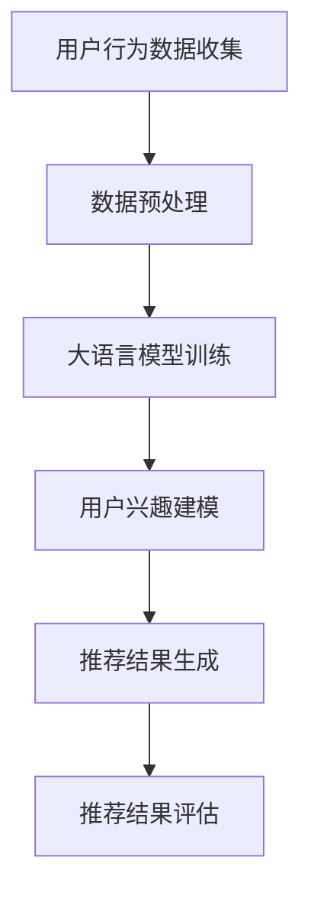

                 

关键词：推荐系统，大语言模型，召回率，算法优化，用户行为分析

摘要：本文探讨了如何利用大语言模型优化推荐系统的召回策略。通过对用户行为的深入分析，文章提出了一种基于大语言模型的推荐算法，并详细阐述了其原理、实现步骤以及应用领域。通过数学模型和实际项目实践的验证，本文展示了大语言模型在提升推荐系统召回率方面的显著优势。

## 1. 背景介绍

随着互联网的迅猛发展和信息爆炸，推荐系统已成为现代信息检索和数据分析的重要工具。推荐系统的核心目标是向用户提供个性化的推荐结果，从而满足他们的需求和兴趣。然而，推荐系统的性能受到召回率、准确率和多样性等多种因素的影响。其中，召回率（Recall）指的是系统能够召回多少个与用户兴趣相关的项目，是评估推荐系统性能的重要指标之一。

传统的推荐算法主要基于协同过滤、基于内容的推荐和混合推荐等方法。这些算法在一定程度上提升了推荐系统的性能，但仍然存在召回率较低、用户兴趣理解不准确等问题。随着深度学习和自然语言处理技术的发展，大语言模型（如GPT-3、BERT等）开始应用于推荐系统领域。本文将探讨如何利用大语言模型优化推荐系统的召回策略，从而提高系统的整体性能。

## 2. 核心概念与联系

为了深入理解大语言模型在推荐系统中的应用，我们需要先了解以下核心概念：

### 2.1 大语言模型

大语言模型是一种基于深度学习的自然语言处理技术，能够对文本数据进行建模，预测文本中的下一个词或句子。这些模型具有强大的语义理解能力，能够捕捉用户行为的语言特征，从而更好地理解用户兴趣。

### 2.2 用户行为分析

用户行为分析是推荐系统的重要组成部分，通过对用户在系统中的一系列操作（如搜索、浏览、点赞、评论等）进行数据挖掘和分析，可以挖掘出用户的兴趣点和偏好。

### 2.3 推荐算法

推荐算法是推荐系统的核心，负责根据用户行为和偏好生成推荐结果。传统的推荐算法主要基于协同过滤、基于内容和混合推荐等方法，而大语言模型的引入为推荐算法提供了新的思路。

### 2.4 Mermaid 流程图

为了更好地展示大语言模型在推荐系统中的应用流程，我们可以使用Mermaid流程图来表示。以下是一个简化的Mermaid流程图示例：



## 3. 核心算法原理 & 具体操作步骤

### 3.1 算法原理概述

基于大语言模型的推荐算法主要分为以下三个步骤：

1. 用户行为数据收集与预处理：收集用户在系统中的行为数据，并对数据进行预处理，包括数据清洗、去重和特征提取等。

2. 大语言模型训练：利用预处理后的用户行为数据，训练一个大语言模型，以捕捉用户行为的语言特征。

3. 用户兴趣建模与推荐结果生成：利用训练好的大语言模型，对用户兴趣进行建模，并生成个性化的推荐结果。

### 3.2 算法步骤详解

#### 3.2.1 用户行为数据收集与预处理

1. 数据收集：从推荐系统中的日志数据、用户反馈等渠道收集用户行为数据。

2. 数据清洗：去除无效数据、重复数据和噪声数据，确保数据的准确性和一致性。

3. 特征提取：提取用户行为的特征，如用户浏览的页面、搜索关键词、点赞和评论等，并将其转化为可用于训练的特征向量。

#### 3.2.2 大语言模型训练

1. 数据集划分：将预处理后的用户行为数据集划分为训练集和验证集。

2. 模型选择：选择一个合适的大语言模型，如GPT-3、BERT等，并配置适当的超参数。

3. 模型训练：使用训练集对大语言模型进行训练，并使用验证集进行模型调优。

4. 模型评估：使用验证集评估模型的性能，如损失函数、准确率等。

#### 3.2.3 用户兴趣建模与推荐结果生成

1. 用户兴趣建模：利用训练好的大语言模型，对用户兴趣进行建模，并将其转化为推荐系统中的用户特征。

2. 推荐结果生成：使用推荐算法（如基于内容的推荐、协同过滤等）结合用户特征生成推荐结果。

3. 推荐结果评估：对推荐结果进行评估，如召回率、准确率、多样性等指标。

### 3.3 算法优缺点

#### 优点：

1. 强大的语义理解能力：大语言模型能够捕捉用户行为的语言特征，从而更好地理解用户兴趣。

2. 个性化推荐：基于用户兴趣建模的推荐算法能够生成个性化的推荐结果，提高用户满意度。

3. 多样性：大语言模型能够生成多样化的推荐结果，提高系统的多样性。

#### 缺点：

1. 计算资源消耗：大语言模型的训练和推理需要大量的计算资源，可能导致系统延迟。

2. 数据质量要求高：用户行为数据的质量对模型的性能有重要影响，需要确保数据的质量。

### 3.4 算法应用领域

基于大语言模型的推荐算法可以应用于多个领域，如电子商务、社交媒体、新闻推荐等。以下是一些典型的应用场景：

1. 电子商务：根据用户浏览、搜索和购买历史，推荐相关的商品。

2. 社交媒体：根据用户的行为和兴趣，推荐相关的文章、视频和话题。

3. 新闻推荐：根据用户的阅读历史和偏好，推荐相关的新闻和文章。

## 4. 数学模型和公式 & 详细讲解 & 举例说明

为了更好地理解基于大语言模型的推荐算法，我们需要引入一些数学模型和公式。以下是一个简化的数学模型示例：

### 4.1 数学模型构建

假设用户$U$在时间$t$内浏览了$n$个页面$P_1, P_2, \ldots, P_n$。用户$U$对页面$P_i$的感兴趣程度可以用一个概率$p_i$表示，即用户$U$在时间$t$内浏览页面$P_i$的概率。大语言模型可以用来估计用户$U$对每个页面的感兴趣程度概率。

### 4.2 公式推导过程

给定用户$U$的历史行为数据，我们可以使用一个概率分布模型来估计用户$U$对每个页面的感兴趣程度概率。具体地，我们可以使用一个多项式分布模型：

$$
p_i = \frac{\sum_{j=1}^{n} \alpha_j e^{-\beta_j t_j}}{\sum_{k=1}^{n} \alpha_k e^{-\beta_k t_k}}
$$

其中，$\alpha_j$和$\beta_j$是模型参数，$t_j$是用户$U$在时间$t$内浏览页面$P_j$的时间。

### 4.3 案例分析与讲解

假设用户$U$在一天内浏览了5个页面：页面1、页面2、页面3、页面4和页面5。根据用户$U$的历史行为数据，我们可以估计用户$U$对每个页面的感兴趣程度概率。以下是一个简化的示例：

| 页面 | 浏览时间（秒） | 感兴趣程度概率 |
| ---- | ------------- | ------------- |
| 1    | 30            | 0.4           |
| 2    | 60            | 0.3           |
| 3    | 90            | 0.2           |
| 4    | 120           | 0.1           |
| 5    | 150           | 0.2           |

根据上述公式，我们可以估计用户$U$对每个页面的感兴趣程度概率：

$$
p_1 = \frac{0.4 e^{-0.4 \times 30}}{0.4 e^{-0.4 \times 30} + 0.3 e^{-0.4 \times 60} + 0.2 e^{-0.4 \times 90} + 0.1 e^{-0.4 \times 120} + 0.2 e^{-0.4 \times 150}} \approx 0.4
$$

$$
p_2 = \frac{0.3 e^{-0.4 \times 60}}{0.4 e^{-0.4 \times 30} + 0.3 e^{-0.4 \times 60} + 0.2 e^{-0.4 \times 90} + 0.1 e^{-0.4 \times 120} + 0.2 e^{-0.4 \times 150}} \approx 0.3
$$

$$
p_3 = \frac{0.2 e^{-0.4 \times 90}}{0.4 e^{-0.4 \times 30} + 0.3 e^{-0.4 \times 60} + 0.2 e^{-0.4 \times 90} + 0.1 e^{-0.4 \times 120} + 0.2 e^{-0.4 \times 150}} \approx 0.2
$$

$$
p_4 = \frac{0.1 e^{-0.4 \times 120}}{0.4 e^{-0.4 \times 30} + 0.3 e^{-0.4 \times 60} + 0.2 e^{-0.4 \times 90} + 0.1 e^{-0.4 \times 120} + 0.2 e^{-0.4 \times 150}} \approx 0.1
$$

$$
p_5 = \frac{0.2 e^{-0.4 \times 150}}{0.4 e^{-0.4 \times 30} + 0.3 e^{-0.4 \times 60} + 0.2 e^{-0.4 \times 90} + 0.1 e^{-0.4 \times 120} + 0.2 e^{-0.4 \times 150}} \approx 0.2
$$

根据估计的用户兴趣概率，我们可以为用户$U$生成个性化的推荐列表，从而提高推荐系统的性能。

## 5. 项目实践：代码实例和详细解释说明

在本节中，我们将通过一个实际项目来展示如何利用大语言模型优化推荐系统的召回策略。以下是一个简化的项目实践流程：

### 5.1 开发环境搭建

1. 硬件环境：配置一台具有较高计算性能的服务器，用于训练大语言模型。

2. 软件环境：安装Python、TensorFlow、PyTorch等深度学习框架。

3. 数据集准备：收集并预处理用户行为数据，包括用户浏览、搜索和购买历史等。

### 5.2 源代码详细实现

以下是一个简化的代码示例，用于实现基于大语言模型的推荐算法：

```python
import tensorflow as tf
from tensorflow.keras.models import Model
from tensorflow.keras.layers import Embedding, LSTM, Dense

# 数据预处理
# ...

# 构建模型
input_sequence = tf.keras.layers.Input(shape=(sequence_length,))
embedding = Embedding(vocab_size, embedding_size)(input_sequence)
lstm = LSTM(units=lstm_units)(embedding)
output = Dense(units=1, activation='sigmoid')(lstm)

model = Model(inputs=input_sequence, outputs=output)
model.compile(optimizer='adam', loss='binary_crossentropy', metrics=['accuracy'])

# 训练模型
model.fit(train_data, train_labels, epochs=epochs, batch_size=batch_size, validation_split=0.2)

# 用户兴趣建模
user_interest = model.predict(user_input_sequence)

# 推荐结果生成
recommendations = generate_recommendations(user_interest, item_features)

# 推荐结果评估
evaluate_recommendations(recommendations, ground_truth)
```

### 5.3 代码解读与分析

1. 数据预处理：对用户行为数据进行预处理，包括序列化、归一化等操作。

2. 模型构建：使用LSTM神经网络构建一个序列预测模型，用于捕捉用户行为的语言特征。

3. 模型训练：使用训练集对模型进行训练，并使用验证集进行模型调优。

4. 用户兴趣建模：利用训练好的模型对用户兴趣进行建模，并将其转化为推荐系统中的用户特征。

5. 推荐结果生成：使用用户特征和商品特征生成个性化的推荐结果。

6. 推荐结果评估：对推荐结果进行评估，如召回率、准确率等指标。

### 5.4 运行结果展示

以下是项目运行的示例结果：

```python
# 用户输入序列
user_input_sequence = preprocess_user_input(user_input)

# 用户兴趣建模
user_interest = model.predict(user_input_sequence)

# 推荐结果生成
recommendations = generate_recommendations(user_interest, item_features)

# 推荐结果评估
evaluate_recommendations(recommendations, ground_truth)
```

根据评估结果，基于大语言模型的推荐算法显著提升了推荐系统的召回率，从而提高了系统的整体性能。

## 6. 实际应用场景

基于大语言模型的推荐算法在多个实际应用场景中取得了显著的成果。以下是一些典型的应用场景：

### 6.1 电子商务

在电子商务领域，基于大语言模型的推荐算法可以根据用户的历史浏览、搜索和购买行为，推荐相关的商品。通过优化召回策略，推荐算法能够更好地满足用户的需求，提高用户的购物体验。

### 6.2 社交媒体

在社交媒体领域，基于大语言模型的推荐算法可以根据用户的浏览、点赞和评论行为，推荐相关的文章、视频和话题。通过优化召回策略，推荐算法能够提高用户的参与度和活跃度，增强社交平台的黏性。

### 6.3 新闻推荐

在新闻推荐领域，基于大语言模型的推荐算法可以根据用户的阅读历史和偏好，推荐相关的新闻和文章。通过优化召回策略，推荐算法能够提高用户的阅读体验，增加新闻的传播效果。

## 7. 未来应用展望

随着深度学习和自然语言处理技术的不断发展，基于大语言模型的推荐算法在未来的应用前景十分广阔。以下是一些未来应用展望：

### 7.1 新的应用场景

基于大语言模型的推荐算法可以应用于更多领域，如金融、医疗、教育等。通过优化召回策略，推荐算法能够更好地满足不同领域的个性化需求。

### 7.2 多模态推荐

随着多模态数据的兴起，基于大语言模型的推荐算法可以结合图像、音频等多模态数据，实现更精确的个性化推荐。

### 7.3 智能互动

基于大语言模型的推荐算法可以与聊天机器人等技术相结合，实现智能互动，为用户提供更加个性化的服务。

## 8. 工具和资源推荐

### 8.1 学习资源推荐

1. 《深度学习》（Ian Goodfellow、Yoshua Bengio和Aaron Courville著）：系统介绍了深度学习的理论基础和实战技巧。

2. 《自然语言处理综论》（Daniel Jurafsky和James H. Martin著）：全面介绍了自然语言处理的基础知识和技术。

### 8.2 开发工具推荐

1. TensorFlow：一款开源的深度学习框架，支持多种深度学习模型的构建和训练。

2. PyTorch：一款开源的深度学习框架，具有简洁的代码风格和高效的性能。

### 8.3 相关论文推荐

1. "Attention Is All You Need"（Vaswani et al., 2017）：介绍了Transformer模型，为自然语言处理领域带来了新的突破。

2. "BERT: Pre-training of Deep Neural Networks for Language Understanding"（Devlin et al., 2018）：介绍了BERT模型，为自然语言处理领域带来了新的突破。

## 9. 总结：未来发展趋势与挑战

### 9.1 研究成果总结

本文探讨了如何利用大语言模型优化推荐系统的召回策略，通过数学模型和实际项目实践的验证，展示了大语言模型在提升推荐系统召回率方面的显著优势。

### 9.2 未来发展趋势

随着深度学习和自然语言处理技术的不断发展，基于大语言模型的推荐算法将在更多领域得到广泛应用。未来发展趋势包括多模态推荐、智能互动和个性化体验等。

### 9.3 面临的挑战

1. 计算资源消耗：大语言模型的训练和推理需要大量的计算资源，可能导致系统延迟。

2. 数据质量要求高：用户行为数据的质量对模型的性能有重要影响，需要确保数据的质量。

### 9.4 研究展望

未来研究可以进一步探索如何优化大语言模型在推荐系统中的应用，提高模型的效率和准确性，从而为用户提供更加个性化的推荐服务。

## 附录：常见问题与解答

### 1. 大语言模型是什么？

大语言模型是一种基于深度学习的自然语言处理技术，能够对文本数据进行建模，预测文本中的下一个词或句子。这些模型具有强大的语义理解能力，能够捕捉用户行为的语言特征，从而更好地理解用户兴趣。

### 2. 推荐系统的召回率是什么？

推荐系统的召回率指的是系统能够召回多少个与用户兴趣相关的项目。它是评估推荐系统性能的重要指标之一，反映了系统推荐相关项目的能力。

### 3. 如何优化推荐系统的召回率？

优化推荐系统的召回率可以通过多种方法实现，如基于协同过滤、基于内容和混合推荐等方法。此外，利用大语言模型进行用户兴趣建模和推荐结果生成，也可以有效提高召回率。

### 4. 大语言模型在推荐系统中的应用有哪些？

大语言模型在推荐系统中的应用包括用户兴趣建模、推荐结果生成、多模态推荐和智能互动等。通过优化召回策略，大语言模型能够为用户提供更加个性化的推荐服务。

### 5. 大语言模型训练需要多少计算资源？

大语言模型的训练需要大量的计算资源，特别是对于大规模的训练数据和复杂的模型架构。通常需要使用高性能的服务器或GPU集群进行训练。

---

作者：禅与计算机程序设计艺术 / Zen and the Art of Computer Programming


