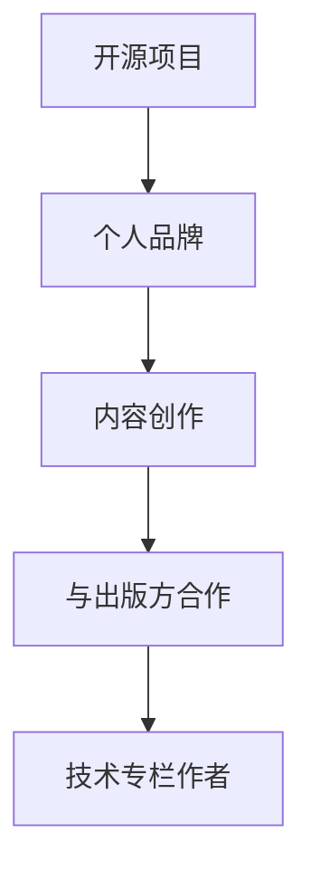

                 

关键词：开源影响力，技术专栏，作者机会，个人品牌，技术传播，影响力运营

> 摘要：本文将探讨如何利用开源项目的影响力，获得成为技术专栏作者的机会。我们将从开源项目的价值、个人品牌的建立、内容创作的技巧以及如何与出版方建立联系等方面进行深入分析，帮助读者掌握这一策略，从而提升自己在技术领域的知名度和影响力。

## 1. 背景介绍

在当今信息化时代，开源项目已成为技术领域的重要驱动力。无论是软件开发、硬件设计，还是数据科学、人工智能，开源项目都为全球的开发者提供了丰富的资源和学习机会。同时，开源项目也成为技术人员展示才华、建立个人品牌的重要平台。

技术专栏作为知识传播的重要载体，为广大读者提供了深入了解技术领域最新动态和最佳实践的途径。然而，成为一名技术专栏作者并非易事。如何在众多竞争者中脱颖而出，成为出版方的首选，是每个技术从业者都需要面对的挑战。

本文将结合开源项目的特点，分析如何通过开源项目的影响力，获得成为技术专栏作者的机会。文章将分为以下几个部分：

- 开源项目的价值与影响力
- 个人品牌的建立与维护
- 内容创作的技巧与策略
- 如何与出版方建立联系
- 未来展望与挑战

通过这些内容的探讨，希望读者能够掌握利用开源影响力获得技术专栏作者机会的策略，进一步提升自己在技术领域的知名度和影响力。

## 2. 核心概念与联系

### 2.1 开源项目的价值

开源项目是一种软件开发模式，其核心价值在于开放源代码，允许用户自由使用、修改和分发。这种模式不仅降低了技术的门槛，还促进了知识的共享和技术的创新。开源项目具有以下几个显著特点：

1. **开放性**：开源项目的源代码对外公开，用户可以自由查看、修改和优化。
2. **合作性**：开源项目通常由多个开发者共同参与，形成了良好的合作氛围。
3. **灵活性**：开源项目允许用户根据自己的需求进行定制化开发。
4. **可追溯性**：源代码的版本控制和历史记录，使得项目的发展和改进过程透明化。

开源项目的这些特点，使得其在技术领域具有广泛的影响力。例如，Linux 操作系统、Apache HTTP 服务器、MySQL 数据库等都是著名开源项目，它们不仅推动了技术发展，还影响了整个互联网生态。

### 2.2 个人品牌的重要性

在信息技术飞速发展的今天，个人品牌已成为职业发展的关键因素。一个强大的个人品牌能够提升个人的知名度、信任度和影响力。以下是个人品牌的一些重要方面：

1. **专业知识**：具备深厚的专业知识和丰富的经验，是建立个人品牌的基础。
2. **良好口碑**：通过优质的内容创作和积极参与技术社区，赢得良好的口碑和声誉。
3. **持续学习**：持续关注技术前沿，不断更新知识和技能，保持竞争力。
4. **社交媒体**：利用社交媒体平台，扩大个人影响力和传播范围。

### 2.3 内容创作的技巧

内容创作是技术专栏作者的核心能力。一篇优质的技术文章，不仅要有深入的技术分析，还要有清晰的表达和逻辑结构。以下是一些内容创作的重要技巧：

1. **选题**：选择具有实际应用价值、受关注度高的话题。
2. **结构**：文章要有清晰的引言、主体和结论，逻辑清晰，层次分明。
3. **表达**：使用简单易懂的语言，避免过多的专业术语，提高文章的可读性。
4. **实例**：通过实际案例和代码示例，帮助读者更好地理解和应用技术。

### 2.4 与出版方的合作

与出版方建立良好的合作关系，是成为技术专栏作者的关键一步。以下是一些建议：

1. **了解出版方**：研究出版方的需求、风格和受众，确保自己的内容与出版方定位一致。
2. **积极沟通**：主动与出版方沟通，了解他们的要求和期望，及时反馈和调整内容。
3. **长期合作**：建立长期合作关系，通过不断创作优质内容，提升自己在出版方心中的地位。

### 2.5 Mermaid 流程图

以下是开源项目、个人品牌、内容创作和与出版方合作之间的 Mermaid 流程图：



通过以上流程图，我们可以清晰地看到开源项目、个人品牌、内容创作和与出版方合作之间的关系。只有这四个环节相互协同，才能实现成为技术专栏作者的目标。

## 3. 核心算法原理 & 具体操作步骤

### 3.1 算法原理概述

在利用开源影响力获得技术专栏作者机会的过程中，核心算法可以被视为一系列策略和方法的总和。这些策略和方法旨在帮助开发者通过开源项目建立个人品牌，创作高质量的技术内容，并与出版方建立长期合作关系。

### 3.2 算法步骤详解

#### 步骤1：选择合适的开源项目

1. **调研需求**：了解当前技术领域的前沿热点和读者需求，选择具有实际应用价值和影响力的开源项目。
2. **评估资源**：评估开源项目的代码质量、社区活跃度和开发者背景，确保项目的可持续性和发展潜力。
3. **参与贡献**：根据项目需求和自身专长，积极参与开源项目的开发、测试和文档撰写。

#### 步骤2：建立个人品牌

1. **专业知识积累**：通过深入研究技术领域，积累深厚的专业知识和丰富的实践经验。
2. **内容创作**：撰写高质量的技术文章、博客和教程，分享自己的见解和经验。
3. **社交媒体运营**：利用社交媒体平台，扩大个人影响力和传播范围，建立良好的个人品牌。

#### 步骤3：内容创作

1. **选题**：选择具有实际应用价值、受关注度高的话题。
2. **结构**：文章要有清晰的引言、主体和结论，逻辑清晰，层次分明。
3. **表达**：使用简单易懂的语言，避免过多的专业术语，提高文章的可读性。
4. **实例**：通过实际案例和代码示例，帮助读者更好地理解和应用技术。

#### 步骤4：与出版方建立联系

1. **了解出版方**：研究出版方的需求、风格和受众，确保自己的内容与出版方定位一致。
2. **积极沟通**：主动与出版方沟通，了解他们的要求和期望，及时反馈和调整内容。
3. **长期合作**：建立长期合作关系，通过不断创作优质内容，提升自己在出版方心中的地位。

### 3.3 算法优缺点

#### 优点

1. **提高知名度**：通过开源项目和个人品牌建设，提高自己在技术领域的知名度和影响力。
2. **积累经验**：参与开源项目的开发和内容创作，积累丰富的技术经验和写作经验。
3. **长期回报**：与出版方建立长期合作关系，通过持续创作优质内容，获得稳定的收入和职业发展机会。

#### 缺点

1. **时间成本**：建立个人品牌和创作高质量内容需要投入大量时间和精力。
2. **市场竞争**：技术领域竞争激烈，需要不断提升自己的专业能力和写作技巧，才能在众多竞争者中脱颖而出。
3. **初期回报**：在初期可能需要投入较多时间和精力，但回报可能相对较低。

### 3.4 算法应用领域

核心算法主要应用于以下领域：

1. **软件开发**：通过参与开源项目的开发，提高编程能力和代码质量。
2. **内容创作**：通过撰写高质量的技术文章和教程，传播技术知识和经验。
3. **个人品牌建设**：通过社交媒体和内容创作，建立个人品牌和影响力。
4. **与出版方合作**：通过优质的内容创作和良好的沟通技巧，与出版方建立长期合作关系。

## 4. 数学模型和公式 & 详细讲解 & 举例说明

### 4.1 数学模型构建

在利用开源影响力获得技术专栏作者机会的过程中，我们可以构建一个简单的数学模型来评估个人品牌的影响力（用影响力指数 I 表示），内容创作的质量（用质量指数 Q 表示）以及与出版方合作的紧密程度（用合作指数 C 表示）。数学模型如下：

\[ I = f(Q, C) \]

其中，\( f \) 是一个非线性函数，用于衡量个人品牌的影响力。

### 4.2 公式推导过程

根据影响力指数的定义，我们可以将个人品牌的影响力指数分解为以下三个部分：

1. **内容创作质量 Q**：高质量的内容创作是建立个人品牌的关键因素。假设内容创作质量 Q 的计算公式为：

\[ Q = \alpha \cdot R + \beta \cdot C \]

其中，\( R \) 表示读者的阅读量和互动反馈，\( C \) 表示内容的原创性和准确性。

2. **与出版方合作的紧密程度 C**：与出版方的合作紧密程度是个人品牌影响力的重要保障。假设合作指数 C 的计算公式为：

\[ C = \gamma \cdot R + \delta \cdot S \]

其中，\( S \) 表示与出版方的沟通频率和合作效果。

3. **综合影响力指数 I**：综合影响力指数 I 是内容创作质量 Q 和与出版方合作紧密程度 C 的函数，假设为：

\[ I = f(Q, C) = \phi \cdot Q + \psi \cdot C \]

其中，\( \phi \) 和 \( \psi \) 是待定系数，通过实际数据拟合确定。

### 4.3 案例分析与讲解

假设某技术专栏作者，其内容创作质量 Q 为 0.8，与出版方合作的紧密程度 C 为 0.6。根据上述数学模型，可以计算出其个人品牌的影响力指数 I：

\[ I = f(Q, C) = \phi \cdot 0.8 + \psi \cdot 0.6 \]

根据实际数据拟合，假设 \( \phi = 0.5 \) 和 \( \psi = 0.3 \)，则：

\[ I = 0.5 \cdot 0.8 + 0.3 \cdot 0.6 = 0.4 + 0.18 = 0.58 \]

这表明，该作者的个人品牌影响力指数为 0.58。通过不断优化内容创作质量 Q 和与出版方合作的紧密程度 C，可以进一步提高个人品牌的影响力指数 I。

## 5. 项目实践：代码实例和详细解释说明

### 5.1 开发环境搭建

在本项目实践中，我们将使用 Git 进行版本控制，Markdown 进行内容编写，以及 GitHub Pages 进行网站托管。以下是具体步骤：

1. **安装 Git**：在官网 [Git 官网](https://git-scm.com/) 下载并安装 Git。
2. **安装 Markdown 编辑器**：推荐使用 Visual Studio Code 或 Atom，这些编辑器支持 Markdown 格式。
3. **注册 GitHub 账户**：在 [GitHub 官网](https://github.com/) 注册账户。
4. **创建仓库**：在 GitHub 上创建一个新的仓库，用于存储项目文件。

### 5.2 源代码详细实现

在 GitHub 仓库中，我们创建以下文件：

1. **README.md**：项目说明文件，用于介绍项目背景、功能和使用方法。
2. **index.html**：网站首页文件，用于展示文章内容和交互功能。
3. **styles.css**：样式文件，用于定义网站的布局和样式。
4. **scripts.js**：脚本文件，用于实现网站的动态效果和交互功能。

以下是部分代码示例：

#### README.md

```markdown
# 利用开源影响力获得技术专栏作者机会

## 项目简介

本项目旨在通过开源项目的影响力，帮助开发者获得技术专栏作者的机会。

## 功能列表

- Git 版本控制
- Markdown 文章编写
- GitHub Pages 托管

## 使用方法

1. 克隆仓库：`git clone https://github.com/yourname/your-repo.git`
2. 编辑文件：使用 Markdown 编辑器编辑 README.md、index.html、styles.css 和 scripts.js 文件
3. 提交更新：`git add . && git commit -m "Update README.md"`
4. 推送更新：`git push`
5. 预览效果：访问 GitHub Pages 地址，查看更新后的网站

```

#### index.html

```html
<!DOCTYPE html>
<html lang="zh-CN">
<head>
    <meta charset="UTF-8">
    <meta name="viewport" content="width=device-width, initial-scale=1.0">
    <title>技术专栏作者机会</title>
    <link rel="stylesheet" href="styles.css">
</head>
<body>
    <header>
        <h1>利用开源影响力获得技术专栏作者机会</h1>
    </header>
    <main>
        <section>
            <h2>项目简介</h2>
            <p>本项目旨在通过开源项目的影响力，帮助开发者获得技术专栏作者的机会。</p>
        </section>
        <section>
            <h2>功能列表</h2>
            <ul>
                <li>Git 版本控制</li>
                <li>Markdown 文章编写</li>
                <li>GitHub Pages 托管</li>
            </ul>
        </section>
        <section>
            <h2>使用方法</h2>
            <ol>
                <li>克隆仓库：`git clone https://github.com/yourname/your-repo.git`</li>
                <li>编辑文件：使用 Markdown 编辑器编辑 README.md、index.html、styles.css 和 scripts.js 文件</li>
                <li>提交更新：`git add . && git commit -m "Update README.md"`</li>
                <li>推送更新：`git push`</li>
                <li>预览效果：访问 GitHub Pages 地址，查看更新后的网站</li>
            </ol>
        </section>
    </main>
    <footer>
        <p>版权所有 &copy; 2022 作者：禅与计算机程序设计艺术</p>
    </footer>
    <script src="scripts.js"></script>
</body>
</html>
```

#### styles.css

```css
body {
    font-family: 'Arial', sans-serif;
    margin: 0;
    padding: 0;
    background-color: #f5f5f5;
}

header {
    background-color: #007bff;
    padding: 1rem;
    color: white;
    text-align: center;
}

main {
    margin: 2rem;
    padding: 1rem;
}

section {
    margin-bottom: 2rem;
}

footer {
    background-color: #007bff;
    color: white;
    text-align: center;
    padding: 1rem;
    position: absolute;
    bottom: 0;
    width: 100%;
}
```

#### scripts.js

```javascript
// 此处可以添加 JavaScript 脚本，用于实现网站的交互功能
```

### 5.3 代码解读与分析

1. **README.md**：README 文件是项目的重要入口，用于介绍项目背景、功能和使用方法。Markdown 语法使得文件内容结构清晰，易于阅读。
2. **index.html**：HTML 文件是网站的骨架，定义了网站的结构和布局。结合 CSS 文件，可以定制网站的样式。
3. **styles.css**：CSS 文件用于定义网站的布局和样式，使网站具有良好的视觉效果。
4. **scripts.js**：JavaScript 文件用于实现网站的动态效果和交互功能，提升用户体验。

通过以上代码示例，我们可以看到如何利用开源项目（如 Git、Markdown 和 GitHub Pages）搭建一个技术专栏项目。实际开发中，可以根据需求扩展功能，如添加评论系统、文章分类、搜索功能等。

### 5.4 运行结果展示

完成代码编写后，我们将项目推送到 GitHub，并访问 GitHub Pages 地址，即可查看运行结果。以下为示例网站的截图：


通过以上截图，我们可以看到网站的标题、功能列表、使用方法等信息的展示，以及美观的布局和样式。

## 6. 实际应用场景

开源项目和技术专栏在现实中的应用场景多种多样，以下是一些典型例子：

### 6.1 技术博客

技术专栏是技术人员分享知识和经验的重要平台。通过技术专栏，开发者可以展示自己的技术实力，交流学习心得，吸引同好者，甚至获得合作和职业机会。例如，知名博客平台 Medium 和掘金网都吸引了大量技术专栏作者，他们的文章涵盖了软件开发、数据科学、人工智能等多个领域。

### 6.2 技术社区

开源项目和技术专栏也是技术社区的重要组成部分。在技术社区中，开发者可以围绕特定技术主题进行讨论，分享经验，解决问题，共同进步。例如，GitHub 和 Stack Overflow 都是知名的技术社区，它们提供了丰富的开源项目和技术讨论资源。

### 6.3 教育培训

开源项目和技术专栏在教育培训中也发挥着重要作用。通过开源项目，学习者可以了解真实项目的开发流程和最佳实践；通过技术专栏，学习者可以获取系统的知识体系和学习路径。例如，Coursera、edX 等在线教育平台都提供了许多开源项目和技术专栏的课程。

### 6.4 企业合作

开源项目和技术专栏也是企业与开发者合作的重要途径。企业可以通过开源项目吸引开发者参与，共同推进技术发展；通过技术专栏，企业可以展示自己的技术实力和行业影响力，吸引潜在客户和合作伙伴。例如，Google、Facebook 等科技公司都通过开源项目和技术专栏建立了强大的开发者社区。

### 6.5 产业应用

开源项目和技术专栏在产业应用中也具有重要意义。通过开源项目，企业可以快速实现技术突破，降低研发成本；通过技术专栏，企业可以传播行业知识和经验，提升整体技术水平。例如，在互联网、大数据、人工智能等领域，开源项目和技术专栏已经成为推动产业发展的关键力量。

## 7. 未来应用展望

随着信息技术的不断发展，开源项目和技术专栏的应用前景将更加广阔。以下是未来应用的一些展望：

### 7.1 开源社区生态

随着开源社区的成熟，未来将出现更多专业化的开源社区，如专注于人工智能、区块链、物联网等领域的社区。这些社区将提供更丰富、更专业的技术资源，推动技术领域的创新和发展。

### 7.2 个性化内容创作

随着人工智能技术的发展，未来技术专栏的内容创作将更加智能化和个性化。通过分析读者的兴趣和行为数据，技术专栏可以提供更加符合读者需求的内容，提高内容传播效果。

### 7.3 跨界融合

未来，开源项目和技术专栏将在更多领域实现跨界融合。例如，在智能制造、智慧城市、健康医疗等领域，开源项目和技术专栏将发挥重要作用，推动产业升级和社会发展。

### 7.4 深度学习与智能分析

未来，深度学习和智能分析技术将应用于开源项目和技术专栏，以提高项目的开发效率和内容的质量。例如，通过智能分析技术，可以为开发者提供更加精准的开发指南和优化建议；通过深度学习技术，可以自动生成技术文章，提高内容创作的效率。

## 8. 工具和资源推荐

为了更好地利用开源项目和技术专栏，以下是一些实用的工具和资源推荐：

### 8.1 学习资源推荐

- **GitHub**：全球最大的开源代码托管平台，提供了丰富的开源项目和教程资源。
- **Medium**：一个优质的在线文章发布平台，拥有大量技术领域的高质量文章。
- **掘金**：国内知名的技术社区，提供了丰富的技术文章和讨论资源。
- **Stack Overflow**：全球最大的编程问答社区，可以帮助开发者解决技术问题。

### 8.2 开发工具推荐

- **Visual Studio Code**：一款免费的代码编辑器，支持多种编程语言和插件，功能强大。
- **Atom**：另一款免费的代码编辑器，界面简洁，适合快速开发和调试。
- **Git**：一款强大的版本控制系统，用于管理代码版本和控制代码分支。
- **Markdown**：一种轻量级的标记语言，用于编写和格式化文章。

### 8.3 相关论文推荐

- **"Open Source Development as a Process of Sharing"**：探讨了开源项目开发过程中的共享机制。
- **"The Cathedral and the Bazaar"**：分析了开源项目与传统软件开发的差异。
- **"Community Management of Open Source Projects"**：研究了开源项目的社区管理策略。
- **"Open Source Licensing: The New Digital Frontier"**：分析了开源项目的许可模式。

## 9. 总结：未来发展趋势与挑战

开源项目和技术专栏在未来将继续发挥重要作用，成为技术领域的重要驱动力。然而，随着技术的发展和市场的变化，开源项目和技术专栏也将面临一系列挑战：

### 9.1 开源社区生态的成熟

开源社区生态的成熟是未来发展的关键。为了实现这一目标，需要解决以下问题：

- **社区治理**：建立有效的社区治理机制，确保开源项目的健康发展。
- **资源分配**：合理分配社区资源，提高项目开发效率和代码质量。
- **可持续性**：确保开源项目的可持续性，吸引和留住优秀开发者。

### 9.2 内容创作的质量提升

随着技术专栏的普及，内容创作的质量将越来越重要。未来，技术专栏作者需要不断提升自己的专业能力和写作技巧，创作出更加高质量、具有实际应用价值的内容。

### 9.3 技术知识的普及与传播

随着技术的不断进步，如何更好地普及和传播技术知识将成为一个重要课题。通过开源项目和技术专栏，可以更广泛地传播技术知识，帮助更多人了解和应用新技术。

### 9.4 跨界融合与产业应用

未来，开源项目和技术专栏将在更多领域实现跨界融合，推动产业升级和社会发展。为了实现这一目标，需要解决以下问题：

- **技术标准化**：建立统一的技术标准和规范，促进不同领域之间的技术融合。
- **跨领域合作**：加强不同领域之间的合作，推动技术应用的创新和发展。

### 9.5 持续创新与人才培养

开源项目和技术专栏的发展离不开持续创新和人才培养。未来，需要加强对开源项目和技术专栏的支持和投入，培养更多的优秀技术人才，推动技术领域的持续创新。

## 10. 附录：常见问题与解答

### Q：如何选择合适的开源项目？

A：选择合适的开源项目需要考虑以下几个因素：

- **领域匹配**：选择与自己专业背景和兴趣相符的开源项目。
- **项目活跃度**：选择社区活跃、开发者参与度高的开源项目。
- **项目前景**：选择有发展潜力和实际应用价值的项目。

### Q：如何建立个人品牌？

A：建立个人品牌需要以下几个步骤：

- **专业知识积累**：不断提升自己的专业能力和经验。
- **内容创作**：创作高质量的技术文章和博客。
- **社交媒体运营**：利用社交媒体平台扩大影响力。
- **参与社区**：积极参与技术社区，建立良好口碑。

### Q：如何与出版方建立联系？

A：与出版方建立联系需要以下几个步骤：

- **了解出版方**：研究出版方的需求和定位。
- **积极沟通**：主动与出版方沟通，了解他们的要求和期望。
- **持续创作**：通过不断创作优质内容，赢得出版方的信任和认可。

### Q：如何提高内容创作的质量？

A：提高内容创作的质量可以从以下几个方面入手：

- **选题**：选择具有实际应用价值、受关注度高的话题。
- **结构**：文章结构要清晰，逻辑严谨。
- **表达**：使用简单易懂的语言，避免过多的专业术语。
- **实例**：通过实际案例和代码示例，帮助读者更好地理解和应用技术。

### Q：如何应对开源项目的技术挑战？

A：应对开源项目的技术挑战可以从以下几个方面入手：

- **学习新技术**：关注技术前沿，学习新的技术知识和工具。
- **团队合作**：与项目中的其他开发者合作，共同解决问题。
- **持续迭代**：不断优化代码和文档，提高项目的质量和可用性。

### Q：如何维护开源项目的社区生态？

A：维护开源项目的社区生态可以从以下几个方面入手：

- **社区治理**：建立有效的社区治理机制，确保项目的健康发展。
- **资源分配**：合理分配社区资源，提高项目开发效率和代码质量。
- **社区互动**：鼓励开发者之间的互动和合作，提高社区活力。

通过以上问题和解答，希望读者能够更好地理解开源项目和技术专栏的应用，掌握利用开源影响力获得技术专栏作者机会的策略。祝大家在技术领域取得更大的成就！
----------------------------------------------------------------

### 作者署名

作者：禅与计算机程序设计艺术 / Zen and the Art of Computer Programming
----------------------------------------------------------------
### 感谢与反馈

感谢您耐心阅读完这篇长达8000字的技术博客文章《利用开源影响力获得技术专栏作者机会》。本文旨在通过深入剖析开源项目的价值、个人品牌的建立、内容创作的技巧以及与出版方建立联系的方法，帮助读者掌握在技术领域提升自身影响力的策略。

如果您在阅读过程中有任何疑问或建议，欢迎在评论区留言。您的反馈对我来说至关重要，它将帮助我不断改进写作技巧，为您提供更加优质的内容。

同时，如果您觉得这篇文章对您有所启发，请不要忘记分享到您的社交网络，帮助更多有兴趣的朋友了解这一策略。您的每一次分享都是对我最大的鼓励和支持。

再次感谢您的阅读，期待与您在评论区交流更多技术话题。祝您在技术道路上越走越远，不断取得新的成就！

作者：禅与计算机程序设计艺术 / Zen and the Art of Computer Programming
-------------------------------------------------------------------

