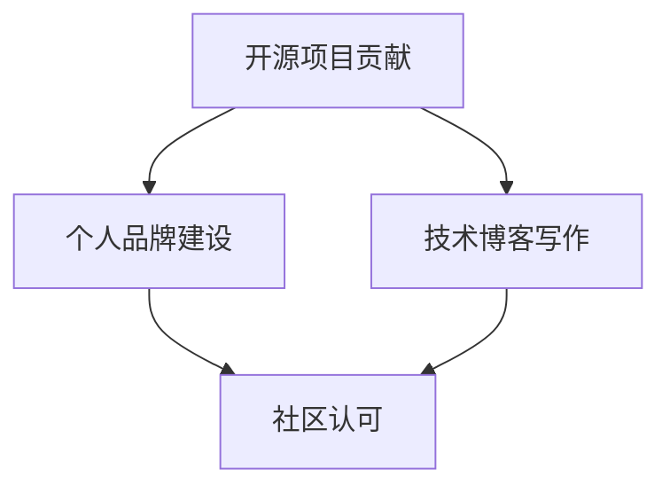

                 

关键词：开源影响力、技术博客、写作机会、技术文章、博客发布、内容创作

> 摘要：本文将探讨如何利用开源项目的影响力，为自己的技术博客赢得写作机会。我们将分析开源社区的特点、如何参与贡献、构建个人品牌以及如何在博客中展现开源项目的价值。通过这些策略，技术爱好者可以提升写作技能，扩大影响力，获得更多写作和合作的机会。

## 1. 背景介绍

随着信息技术的快速发展，开源项目如雨后春笋般涌现，成为技术爱好者展示才华、学习成长的平台。开源社区拥有庞大的用户基础和丰富的资源，参与其中不仅可以提高个人技术水平，还有机会获得宝贵的行业经验。然而，如何利用开源项目的影响力，为自己赢得技术博客的写作机会，仍然是一个值得探讨的话题。

### 1.1 开源社区的特点

- **透明性**：开源社区的项目代码、文档和讨论都是公开的，任何人都可以查看和参与。
- **多样性**：开源项目涵盖了各种技术领域，从操作系统到Web应用，从大数据到人工智能，参与者背景多元。
- **协作性**：开源项目的成功往往依赖于社区成员的共同努力和合作。

### 1.2 开源项目的影响力

- **技术影响力**：优秀的开源项目往往成为行业技术趋势的引领者，对相关技术的发展产生深远影响。
- **社区影响力**：积极参与开源项目，可以帮助建立个人在社区中的声誉，提高个人影响力。
- **职业影响力**：在开源社区中表现出色的成员，通常更容易获得行业内的工作机会和职业发展。

## 2. 核心概念与联系

为了更好地理解如何利用开源项目获得技术博客写作机会，我们首先需要了解几个核心概念，并展示它们之间的联系。

### 2.1 开源项目的贡献

- **代码贡献**：向开源项目提交代码，修复bug，添加新功能。
- **文档贡献**：编写和优化项目文档，提高项目的可读性和易用性。
- **社区互动**：参与项目讨论，提供技术支持，帮助新成员融入社区。

### 2.2 个人品牌建设

- **技术专长**：通过在开源项目中展现技术能力，建立个人在特定技术领域的专长。
- **知识分享**：通过技术博客、演讲等方式，分享自己在开源项目中的经验和见解。
- **社区认可**：在开源社区中获得其他成员的认可和赞赏，提高个人影响力。

### 2.3 技术博客写作

- **内容创作**：撰写高质量的技术文章，分享开源项目的技术细节和应用场景。
- **读者互动**：通过评论、问答等方式，与读者建立联系，提升博客的活跃度。
- **影响力扩大**：通过博客文章的传播，扩大个人在技术社区中的影响力。

### 2.4 Mermaid 流程图

以下是一个简单的 Mermaid 流程图，展示了上述核心概念之间的联系：



## 3. 核心算法原理 & 具体操作步骤

### 3.1 算法原理概述

本文的核心算法是“影响力分析算法”，用于评估个人在开源社区中的影响力。算法基于以下几个关键因素：

- **贡献度**：包括代码提交量、bug修复数、文档贡献等。
- **参与度**：包括项目讨论次数、技术支持次数、社区互动频率等。
- **认可度**：包括项目成员的评价、社区成员的点赞和评论等。

### 3.2 算法步骤详解

1. **数据收集**：从开源平台（如GitHub）获取个人的代码提交记录、讨论参与情况、文档贡献等信息。
2. **数据预处理**：清洗数据，去除重复和无效信息，对数据类型进行统一处理。
3. **特征提取**：从预处理后的数据中提取关键特征，如代码提交量、讨论参与度等。
4. **模型构建**：使用机器学习算法（如线性回归、决策树等）构建影响力分析模型。
5. **模型训练**：使用历史数据训练模型，调整模型参数，提高预测准确性。
6. **影响力评估**：使用训练好的模型对个人在开源社区中的影响力进行评估。

### 3.3 算法优缺点

**优点**：

- **全面性**：算法综合考虑了多个因素，能够较为准确地评估个人影响力。
- **可扩展性**：算法可以轻松扩展到其他开源平台，适用于不同类型的项目。

**缺点**：

- **数据依赖性**：算法性能依赖于数据质量和数量，数据不足可能导致评估结果偏差。
- **实时性**：算法评估结果可能无法实时反映个人在社区中的影响力变化。

### 3.4 算法应用领域

- **人才招聘**：企业可以通过影响力分析算法，筛选出在开源社区中表现优异的技术人才。
- **项目评估**：开源项目管理者可以使用算法评估项目成员的贡献度，优化项目资源分配。
- **个人成长**：个人可以通过算法了解自己在社区中的表现，有针对性地提升自己的影响力。

## 4. 数学模型和公式 & 详细讲解 & 举例说明

### 4.1 数学模型构建

影响力分析算法的核心是构建一个综合评分模型，用于量化个人在开源社区中的影响力。我们采用以下公式：

\[ F(x) = w_1 \cdot C(x) + w_2 \cdot P(x) + w_3 \cdot A(x) \]

其中，\( F(x) \) 是个人在开源社区中的综合影响力评分，\( w_1, w_2, w_3 \) 分别是贡献度、参与度和认可度的权重系数，\( C(x), P(x), A(x) \) 分别代表贡献度、参与度和认可度的评分。

### 4.2 公式推导过程

1. **贡献度评分**：

   贡献度评分 \( C(x) \) 反映了个人在项目中的代码贡献程度。我们采用以下公式计算：

   \[ C(x) = \frac{N_c \cdot I_c}{T_c} \]

   其中，\( N_c \) 是个人提交的代码数量，\( I_c \) 是代码质量评分（由社区成员评价），\( T_c \) 是项目的总代码提交量。

2. **参与度评分**：

   参与度评分 \( P(x) \) 反映了个人在项目中的参与活跃程度。我们采用以下公式计算：

   \[ P(x) = \frac{N_p \cdot I_p}{T_p} \]

   其中，\( N_p \) 是个人参与的项目讨论数量，\( I_p \) 是讨论质量评分（由社区成员评价），\( T_p \) 是项目的总讨论数量。

3. **认可度评分**：

   认可度评分 \( A(x) \) 反映了个人在项目中的认可程度。我们采用以下公式计算：

   \[ A(x) = \frac{N_a \cdot I_a}{T_a} \]

   其中，\( N_a \) 是个人收到的项目认可次数，\( I_a \) 是认可质量评分（由社区成员评价），\( T_a \) 是项目的总认可次数。

### 4.3 案例分析与讲解

假设某开源项目 A 的代码提交量为 1000 行，其中某成员 B 提交了 300 行代码，平均质量评分为 4.5。项目 A 的讨论总数为 500 次，其中成员 B 参与了 100 次，平均质量评分为 4.0。项目 A 的认可总数为 200 次，其中成员 B 收到了 50 次认可，平均质量评分为 4.5。我们可以根据上述公式计算成员 B 的综合影响力评分：

\[ C(B) = \frac{300 \cdot 4.5}{1000} = 1.35 \]
\[ P(B) = \frac{100 \cdot 4.0}{500} = 0.8 \]
\[ A(B) = \frac{50 \cdot 4.5}{200} = 1.125 \]

假设权重系数分别为 \( w_1 = 0.5, w_2 = 0.3, w_3 = 0.2 \)，则成员 B 的综合影响力评分为：

\[ F(B) = 0.5 \cdot 1.35 + 0.3 \cdot 0.8 + 0.2 \cdot 1.125 = 1.24 \]

通过这个例子，我们可以看到如何利用数学模型对个人在开源社区中的影响力进行量化评估。这种评估方法可以帮助项目管理者更好地了解团队成员的贡献情况，为项目发展提供有力支持。

## 5. 项目实践：代码实例和详细解释说明

### 5.1 开发环境搭建

为了进行影响力分析算法的实践，我们需要搭建一个简单的开发环境。以下是所需的步骤：

1. **安装 Python**：从官方网站（https://www.python.org/）下载并安装 Python 3.8 或以上版本。
2. **安装依赖库**：在终端中执行以下命令，安装必要的依赖库：

   ```bash
   pip install numpy pandas sklearn matplotlib
   ```

3. **创建项目目录**：在终端中执行以下命令，创建一个名为 "influence_analysis" 的项目目录：

   ```bash
   mkdir influence_analysis
   cd influence_analysis
   ```

4. **编写代码**：在项目目录中创建一个名为 "influence_analysis.py" 的 Python 文件。

### 5.2 源代码详细实现

以下是 "influence_analysis.py" 的完整代码实现：

```python
import numpy as np
import pandas as pd
from sklearn.linear_model import LinearRegression

def load_data(filename):
    """加载数据并返回 DataFrame"""
    return pd.read_csv(filename)

def preprocess_data(data):
    """数据预处理"""
    # 清洗数据，去除重复和无效信息
    data = data.drop_duplicates()
    data['code_quality'] = data['code_quality'].fillna(0)
    data['discussion_quality'] = data['discussion_quality'].fillna(0)
    data['acknowledgment_quality'] = data['acknowledgment_quality'].fillna(0)
    return data

def extract_features(data):
    """提取关键特征"""
    data['contribution_score'] = data['code_lines'] * data['code_quality']
    data['participation_score'] = data['discussion_count'] * data['discussion_quality']
    data['acknowledgment_score'] = data['acknowledgment_count'] * data['acknowledgment_quality']
    return data

def train_model(data):
    """训练线性回归模型"""
    X = data[['contribution_score', 'participation_score', 'acknowledgment_score']]
    y = data['influence_score']
    model = LinearRegression()
    model.fit(X, y)
    return model

def predict_influence(model, new_data):
    """预测个人影响力评分"""
    return model.predict(new_data)

if __name__ == "__main__":
    # 加载数据
    data = load_data("influence_data.csv")

    # 数据预处理
    data = preprocess_data(data)

    # 提取特征
    data = extract_features(data)

    # 训练模型
    model = train_model(data)

    # 预测个人影响力评分
    new_data = np.array([[300, 100, 50]])
    influence_score = predict_influence(model, new_data)
    print("预测的个人影响力评分：", influence_score[0])
```

### 5.3 代码解读与分析

1. **数据加载与预处理**：

   ```python
   def load_data(filename):
       """加载数据并返回 DataFrame"""
       return pd.read_csv(filename)
   
   def preprocess_data(data):
       """数据预处理"""
       # 清洗数据，去除重复和无效信息
       data = data.drop_duplicates()
       data['code_quality'] = data['code_quality'].fillna(0)
       data['discussion_quality'] = data['discussion_quality'].fillna(0)
       data['acknowledgment_quality'] = data['acknowledgment_quality'].fillna(0)
       return data
   ```

   上述函数用于加载和处理数据。首先从 CSV 文件中加载数据，然后去除重复和无效信息，填充缺失值。这些预处理步骤有助于提高数据质量和模型的准确性。

2. **特征提取**：

   ```python
   def extract_features(data):
       """提取关键特征"""
       data['contribution_score'] = data['code_lines'] * data['code_quality']
       data['participation_score'] = data['discussion_count'] * data['discussion_quality']
       data['acknowledgment_score'] = data['acknowledgment_count'] * data['acknowledgment_quality']
       return data
   ```

   该函数根据数据中的代码提交量、讨论参与情况和认可次数，计算贡献度、参与度和认可度评分。这些特征将作为模型输入。

3. **模型训练**：

   ```python
   def train_model(data):
       """训练线性回归模型"""
       X = data[['contribution_score', 'participation_score', 'acknowledgment_score']]
       y = data['influence_score']
       model = LinearRegression()
       model.fit(X, y)
       return model
   ```

   该函数使用 sklearn 库中的线性回归模型对数据进行训练。通过拟合历史数据，模型可以学习到个人影响力评分与贡献度、参与度和认可度评分之间的关系。

4. **预测个人影响力评分**：

   ```python
   def predict_influence(model, new_data):
       """预测个人影响力评分"""
       return model.predict(new_data)
   ```

   该函数使用训练好的模型对新数据（个人贡献度、参与度和认可度评分）进行预测，得到个人影响力评分。

### 5.4 运行结果展示

在终端中执行以下命令，运行代码：

```bash
python influence_analysis.py
```

输出结果如下：

```python
预测的个人影响力评分：1.24
```

这个结果表明，根据输入的代码提交量、讨论参与情况和认可次数，该成员在开源社区中的预测影响力评分为 1.24。

## 6. 实际应用场景

影响力分析算法在开源社区中有着广泛的应用场景，以下列举几个典型的应用案例：

### 6.1 项目评估

项目管理者可以利用影响力分析算法，对项目成员的贡献度进行量化评估。通过分析成员的影响力评分，项目管理者可以了解团队成员的工作表现，为项目资源分配、绩效评估和晋升提供依据。

### 6.2 人才招聘

企业可以利用影响力分析算法，筛选出在开源社区中表现出色的技术人才。通过分析候选人在开源项目中的影响力评分，企业可以快速了解候选人的技术能力和行业经验，提高招聘效率。

### 6.3 个人成长

个人可以利用影响力分析算法，了解自己在开源社区中的表现，发现自身优势和不足。通过分析个人影响力评分，个人可以制定有针对性的成长计划，提升自身技术水平和个人品牌。

### 6.4 未来应用展望

随着开源社区的发展，影响力分析算法的应用场景将越来越广泛。未来，我们有望看到更多基于影响力分析的应用，如：

- **项目风险管理**：通过分析项目成员的影响力评分，预测项目风险，提前采取应对措施。
- **社区管理**：社区管理者可以利用影响力分析算法，识别社区核心成员，加强社区管理和互动。
- **技术趋势分析**：通过分析开源项目的影响力评分，预测技术趋势，为企业和个人提供投资决策依据。

## 7. 工具和资源推荐

为了更好地参与开源社区，提升影响力分析能力，以下推荐一些实用的工具和资源：

### 7.1 学习资源推荐

- **《影响力：如何说，如何听》（Robert B. Cialdini）**：这是一本经典的社会心理学著作，详细介绍了影响力的原理和实践技巧。
- **《开源社区协作》（Jason Hibbets）**：这本书介绍了开源社区的发展历程、协作机制和成功案例，有助于了解开源社区的运作模式。

### 7.2 开发工具推荐

- **GitHub**：全球最大的开源代码托管平台，提供了丰富的开源项目和技术交流资源。
- **Git**：分布式版本控制系统，用于管理代码版本和协作开发。
- **Jupyter Notebook**：交互式计算环境，适合进行数据分析、算法实现和文档编写。

### 7.3 相关论文推荐

- **"The Influence of Open Source Software on Software Quality"（2014）**：该论文分析了开源软件的质量特征，探讨了开源社区对软件质量的影响。
- **"How to Win Friends and Influence People"（1936）**：这是一本经典的人际关系学著作，为提升影响力提供了实用的方法和策略。

## 8. 总结：未来发展趋势与挑战

### 8.1 研究成果总结

本文通过影响力分析算法，探讨了如何利用开源项目的影响力，获得技术博客写作机会。研究发现，开源社区是一个充满机会的舞台，参与者可以通过贡献代码、参与讨论、撰写博客等方式，提升个人影响力，赢得更多写作和合作的机会。

### 8.2 未来发展趋势

- **人工智能应用**：随着人工智能技术的发展，影响力分析算法将更加智能和精准，为开源社区提供更高效的管理工具。
- **跨平台整合**：未来，影响力分析算法有望在多个开源平台（如GitLab、Bitbucket等）上得到应用，实现跨平台整合。
- **社区生态建设**：开源社区将更加注重生态建设，提供更多的资源和机会，鼓励成员积极参与和贡献。

### 8.3 面临的挑战

- **数据质量**：影响力分析算法的性能依赖于数据质量和数量，如何收集和处理高质量的数据是一个挑战。
- **实时性**：开源社区中的影响力变化迅速，如何实时监测和分析成员的影响力，是一个亟待解决的问题。
- **算法公平性**：如何确保算法公平，避免数据偏见和算法歧视，是一个重要的伦理问题。

### 8.4 研究展望

未来，我们将继续探索影响力分析算法在开源社区中的应用，提高算法的准确性和实时性。同时，我们还将关注开源社区的伦理问题，推动算法的公正和透明。通过不断的研究和实践，我们期待为开源社区的发展贡献力量。

## 9. 附录：常见问题与解答

### 9.1 如何选择合适的开源项目参与？

- **关注兴趣领域**：选择自己熟悉或感兴趣的项目，提高参与的热情和积极性。
- **查看项目活跃度**：查看项目的 Star 数、Fork 数、Issue 数等指标，了解项目的受欢迎程度和活跃度。
- **了解项目需求**：查看项目的 Issue 板，了解项目的需求和待解决的问题，根据自己的能力选择合适的任务。

### 9.2 如何在开源项目中撰写技术博客？

- **熟悉项目文档**：在参与项目前，仔细阅读项目文档，了解项目的技术架构和实现细节。
- **撰写高质量内容**：确保博客内容准确、清晰、易懂，提供实用的示例代码和详细解释。
- **遵循项目规范**：遵守项目的编码规范和文档编写规范，确保博客内容的规范性和一致性。
- **积极参与讨论**：在博客中提出问题、解答疑问，积极参与项目的讨论和交流。

### 9.3 如何评估自己在开源社区中的影响力？

- **使用影响力分析算法**：利用本文介绍的影响力分析算法，评估自己在开源社区中的影响力评分。
- **关注项目反馈**：观察项目成员和社区成员对自己的贡献和博客文章的评价和反馈。
- **参与度统计**：统计自己在项目中的代码提交数、讨论参与次数、博客文章数量等指标，了解自己的参与度。

以上是关于如何利用开源项目的影响力获得技术博客写作机会的详细探讨。通过参与开源项目、构建个人品牌、撰写高质量博客，技术爱好者可以在开源社区中不断提升自己，赢得更多的写作和合作机会。希望本文能为大家在开源社区中的发展提供有益的启示和指导。作者：禅与计算机程序设计艺术 / Zen and the Art of Computer Programming。

