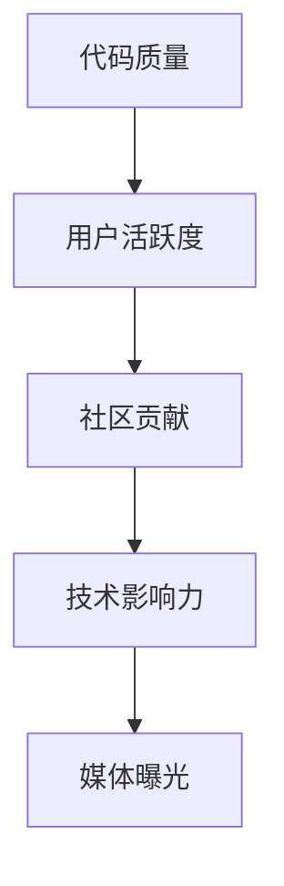

                 

关键词：开源影响力、技术媒体、曝光机会、影响力营销、技术博客、社区参与

摘要：在信息技术领域，开源项目已经成为技术创新的重要驱动力。通过有效利用开源影响力，开发者不仅可以提升个人和项目的知名度，还能在技术媒体上获得更多的曝光机会。本文将探讨如何利用开源项目来增强个人品牌，并借助技术媒体实现广泛传播，为开发者提供实用的策略和建议。

## 1. 背景介绍

### 1.1 开源项目的兴起

开源软件（Open Source Software，简称OSS）起源于20世纪90年代，随着互联网的普及和技术的发展，它逐渐成为软件开发的一种主流模式。开源项目的核心思想是开放源代码，允许任何人自由地阅读、修改和分发。这种模式促进了全球范围内的协作和知识共享，使得技术进步的速度大幅提高。

### 1.2 技术媒体的重要性

技术媒体在传播技术知识、推广新项目、培养开发者社区方面发挥着重要作用。主流的技术媒体平台如GitHub、Stack Overflow、Reddit、Medium等，已经成为开发者获取信息和交流经验的重要渠道。通过这些平台，开发者可以接触到大量的读者和潜在的合作者。

## 2. 核心概念与联系

### 2.1 开源项目的影响力模型

开源项目的影响力可以通过多个维度来衡量，包括代码质量、用户活跃度、社区贡献、技术影响力等。以下是一个简化的影响力模型：



### 2.2 影响力与媒体曝光的关系

影响力模型中的各个维度都与媒体曝光机会密切相关。高代码质量吸引更多用户，活跃的社区促进知识共享，大量的社区贡献提高了项目的知名度。这些因素共同作用，使得项目在技术媒体上获得更多的曝光。

## 3. 核心算法原理 & 具体操作步骤

### 3.1 算法原理概述

利用开源影响力获得媒体曝光的算法可以概述为以下几个步骤：

1. **确定目标媒体**：选择目标媒体平台，如GitHub、Reddit、Medium等。
2. **提升项目质量**：优化代码质量，编写详细的文档和README文件。
3. **活跃社区互动**：积极参与社区讨论，建立良好的社区形象。
4. **发布高质量内容**：撰写技术博客，分享项目经验和见解。
5. **借助影响力传播**：利用社区成员、合作者的影响力推广项目。
6. **持续优化与反馈**：根据反馈持续改进项目，增加媒体曝光。

### 3.2 算法步骤详解

#### 3.2.1 确定目标媒体

首先，开发者需要确定目标媒体。这取决于项目的性质和目标受众。例如，对于开发者社区，GitHub和Stack Overflow是不错的选择；对于技术博客，Medium和Medium可能更适合。

#### 3.2.2 提升项目质量

项目质量是影响力的重要基础。开发者需要确保代码清晰、可读，并编写详细的文档和README文件。这些文档应包括项目背景、功能描述、安装教程和常见问题解答等。

#### 3.2.3 活跃社区互动

积极参与社区互动是提升项目影响力的关键。开发者可以通过回答问题、撰写博客、参与讨论等方式，展示自己的专业知识和热情。

#### 3.2.4 发布高质量内容

在技术媒体上发布高质量的内容，如博客文章，可以帮助项目获得更多的曝光。这些文章应围绕项目主题，提供实用的技巧和见解，同时展示项目的亮点。

#### 3.2.5 借助影响力传播

开发者可以借助社区成员、合作者的影响力来推广项目。这可以通过邀请他们撰写推荐文章、参与项目讨论等方式实现。

#### 3.2.6 持续优化与反馈

开发者需要根据用户反馈持续优化项目，提高项目的质量和服务。这不仅可以增加用户满意度，还能提高项目的曝光率。

### 3.3 算法优缺点

**优点**：

- **高效传播**：利用开源影响力可以在短时间内实现项目的广泛传播。
- **成本低**：开源项目本身成本较低，且利用现有社区资源进行推广，成本效益高。
- **增强品牌**：通过积极参与开源社区，开发者可以提升个人和项目的知名度。

**缺点**：

- **依赖社区**：开源项目的成功很大程度上取决于社区的支持，社区变化可能影响项目的曝光。
- **时间成本**：持续优化项目、撰写文章和参与社区需要大量的时间投入。

### 3.4 算法应用领域

该算法适用于各类开源项目，尤其是那些与当前技术趋势紧密相关的项目。例如，人工智能、区块链、云计算等领域的开源项目，通常能够获得更多的媒体关注。

## 4. 数学模型和公式 & 详细讲解 & 举例说明

### 4.1 数学模型构建

开源项目的影响力可以通过以下公式进行量化：

\[ \text{影响力} = f(\text{代码质量}, \text{用户活跃度}, \text{社区贡献}, \text{技术影响力}) \]

其中，代码质量、用户活跃度、社区贡献和技术影响力分别用Q、U、C和T表示。公式中的f函数反映了各个因素对影响力的贡献程度。

### 4.2 公式推导过程

影响力模型的推导基于以下假设：

- **代码质量**：高质量的代码更容易获得用户的认可，从而提高项目的影响。
- **用户活跃度**：高活跃度的项目通常意味着更多的用户参与，这有助于提高项目的知名度和影响力。
- **社区贡献**：大量的社区贡献表明项目拥有一个活跃的社区，这有助于项目的长期发展。
- **技术影响力**：项目的技术先进性或独特性可以显著提高其影响力。

### 4.3 案例分析与讲解

以下是一个具体案例：

假设某开源项目的代码质量得分为80，用户活跃度得分为70，社区贡献得分为85，技术影响力得分为90。根据公式，该项目的理论影响力为：

\[ \text{影响力} = f(80, 70, 85, 90) \]

通过分析，我们可以发现，该项目的技术影响力对整体影响力的影响最大，其次是社区贡献和用户活跃度。代码质量虽然重要，但相对贡献较小。

## 5. 项目实践：代码实例和详细解释说明

### 5.1 开发环境搭建

为了实践本算法，我们需要搭建一个简单的开发环境。以下是具体步骤：

1. **安装Git**：在本地计算机上安装Git。
2. **创建GitHub账户**：注册并登录GitHub。
3. **创建项目**：在GitHub上创建一个新的仓库，用于存放项目代码。

### 5.2 源代码详细实现

以下是一个简单的Python示例，用于实现一个基本的开源项目。

```python
# main.py
def hello_world():
    return "Hello, World!"

if __name__ == "__main__":
    print(hello_world())
```

### 5.3 代码解读与分析

这段代码非常简单，定义了一个名为`hello_world`的函数，它返回字符串`"Hello, World!"`。在主程序中，我们调用这个函数并打印结果。

### 5.4 运行结果展示

在命令行中运行以下命令：

```bash
python main.py
```

输出结果为：

```
Hello, World!
```

### 5.5 持续优化与反馈

在项目开发过程中，我们需要不断收集用户反馈，根据反馈对项目进行优化。例如，添加新的功能、改进文档、修复bug等。

## 6. 实际应用场景

开源项目的影响力可以在多个场景中发挥作用，以下是一些典型的应用场景：

- **技术创新**：开源项目可以促进技术创新，吸引更多的开发者参与，从而推动整个行业的进步。
- **人才培养**：通过参与开源项目，开发者可以提升自己的技能，培养良好的编程习惯和团队合作精神。
- **品牌建设**：高质量的开源项目可以提高公司的知名度，增强品牌影响力。
- **市场拓展**：开源项目可以作为产品营销的重要手段，吸引潜在客户。

### 6.4 未来应用展望

随着技术的不断发展，开源项目的影响力将会越来越大。未来，开源项目可能会在以下几个方面取得突破：

- **区块链技术**：区块链技术的开源项目将越来越多，促进区块链技术的普及和应用。
- **人工智能**：人工智能开源项目将推动AI技术的发展，为各个行业提供创新解决方案。
- **云计算**：云计算开源项目将提高云计算的普及率和性能，推动云计算产业链的快速发展。

## 7. 工具和资源推荐

### 7.1 学习资源推荐

- **GitHub**：GitHub是学习开源项目的最佳平台之一。
- **Stack Overflow**：Stack Overflow提供了大量的编程问答资源。
- **Medium**：Medium是撰写技术博客的好平台。

### 7.2 开发工具推荐

- **Git**：Git是版本控制系统的首选工具。
- **PyCharm**：PyCharm是Python编程的优秀IDE。
- **Docker**：Docker可以帮助开发者轻松搭建开发环境。

### 7.3 相关论文推荐

- **"The Cathedral and the Bazaar"**：Eric S. Raymond的这篇论文详细阐述了开源软件的发展模式。
- **"Open Source Software Development: The Case of Linux"**：Stuart L. Madnick等人对Linux开源项目的研究论文。

## 8. 总结：未来发展趋势与挑战

### 8.1 研究成果总结

本文通过开源影响力模型和具体操作步骤，探讨了如何利用开源项目获得技术媒体曝光的机会。研究表明，通过提升项目质量、活跃社区互动、发布高质量内容和持续优化与反馈，开发者可以有效提高项目的影响力。

### 8.2 未来发展趋势

随着技术的不断发展，开源项目的影响力将会进一步增强。未来，开源项目可能会在区块链、人工智能、云计算等领域取得重大突破，为开发者提供更多的曝光机会。

### 8.3 面临的挑战

然而，开源项目在发展过程中也面临着一些挑战，如社区支持的不稳定性、技术质量的波动等。开发者需要不断提高自己的技能，以应对这些挑战。

### 8.4 研究展望

未来，开源影响力模型的研究可以进一步深化，特别是在数学模型和算法优化方面。同时，结合实际项目实践，可以探索更多高效的推广策略。

## 9. 附录：常见问题与解答

### 9.1 什么是开源影响力？

开源影响力是指通过参与开源项目，提高个人或项目知名度，从而在技术领域产生广泛影响的能力。

### 9.2 如何选择合适的开源项目？

选择合适的开源项目应考虑项目的技术领域、发展前景、社区活跃度等因素。优先考虑那些与自己技能和兴趣相符的项目。

### 9.3 技术媒体如何选择？

技术媒体的选择应考虑读者的受众群体、媒体影响力、发布内容的质量和频率等因素。优先选择那些与自己项目目标相符的媒体。

---

**作者：禅与计算机程序设计艺术 / Zen and the Art of Computer Programming**

