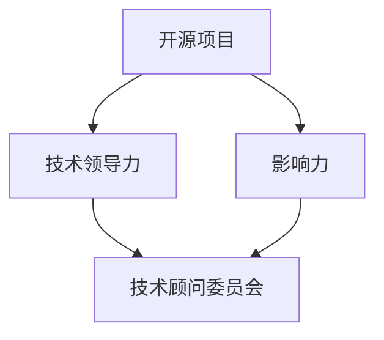

                 

关键词：开源影响力、技术顾问委员会、技术领导力、职业发展、项目案例、策略实施

摘要：本文旨在探讨如何通过开源项目的影响力，提升个人的技术领导力，并最终获得技术顾问委员会的职位。文章首先介绍开源社区的现状及其对职业发展的影响，接着详细阐述了如何构建和推广有影响力的开源项目，如何利用这些项目获得技术顾问委员会的职位，并提供了实际案例和策略。最后，文章对未来的发展趋势和面临的挑战进行了展望。

## 1. 背景介绍

在当今数字化时代，技术社区和开源项目已经成为技术人才展示和提升技能的重要平台。随着开源文化的普及，越来越多的企业和机构开始重视开源项目和技术社区，这为技术人才提供了丰富的职业发展机会。特别是技术顾问委员会（Technical Advisory Committee, TAC）这样的职位，它们不仅要求个人具备深厚的技术功底，还要求其具备良好的领导力和影响力。

技术顾问委员会通常由一群技术领域的专家组成，他们的职责是就技术战略、研发方向和行业标准等方面提供专业建议。成为技术顾问委员会的成员，不仅是对个人技术能力的认可，更是其在行业内影响力的象征。然而，如何获得这样的职位，尤其是在竞争激烈的技术领域，成为许多技术人才关心的问题。

本文将探讨如何通过积极参与开源项目，利用开源影响力，获得技术顾问委员会的职位。我们将详细分析开源项目的构建、推广、和维护，以及如何利用这些项目来提升个人的技术领导力和职业发展。

### 1.1 开源社区的发展

开源社区起源于计算机领域，最早的代表性项目是Linux操作系统。自2000年代以来，随着互联网和云计算的兴起，开源社区得到了前所未有的发展。如今，开源已经成为技术领域的重要趋势，许多企业和机构都将开源项目作为其技术战略的重要组成部分。

开源社区的发展不仅推动了技术的创新和普及，也为技术人才提供了广阔的发展空间。在开源社区中，技术人才可以通过参与项目，展示自己的技能和才华，获取宝贵的实践经验，同时结识业界同行，拓宽职业网络。

### 1.2 技术顾问委员会的重要性

技术顾问委员会在企业和机构中扮演着重要角色。他们通常由一群技术领域的专家组成，负责就技术战略、研发方向、产品创新等方面提供专业建议。技术顾问委员会的成员不仅需要具备深厚的专业知识和丰富的实践经验，还需要具备良好的沟通能力和领导力。

成为技术顾问委员会的成员，意味着个人在技术领域的影响力得到了认可。这不仅有助于提升个人的职业地位，还能为其职业生涯带来更多的机会。此外，技术顾问委员会的成员通常会参与项目的决策过程，这对个人职业发展具有重要意义。

## 2. 核心概念与联系

在探讨如何通过开源影响力获得技术顾问委员会职位之前，我们需要理解几个核心概念，并展示它们之间的联系。

### 2.1 开源项目

开源项目是指那些开放源代码、允许用户自由查看、修改和分发的软件项目。开源项目是技术人才展示技术能力和领导力的最佳平台。通过参与开源项目，个人不仅可以提升技能，还可以积累宝贵的实践经验，同时结识业界同行。

### 2.2 技术领导力

技术领导力是指技术人才在团队中发挥的领导作用，包括技术方向规划、团队管理、技术决策等方面。技术领导力不仅要求个人具备深厚的技术功底，还需要其具备良好的沟通能力、团队合作精神和战略眼光。

### 2.3 影响力

影响力是指个人在特定领域或社区中产生的影响力，包括技术见解、实践经验、演讲能力、写作能力等。影响力是获得技术顾问委员会职位的关键因素之一。

### 2.4 技术顾问委员会

技术顾问委员会是由一群技术领域的专家组成的组织，其成员通常在技术战略、研发方向和行业标准等方面提供专业建议。技术顾问委员会的成员不仅需要具备深厚的专业知识和丰富的实践经验，还需要具备良好的领导力和影响力。

### 2.5 核心概念联系

开源项目、技术领导力、影响力和技术顾问委员会之间存在着密切的联系。通过参与开源项目，个人可以展示其技术能力和领导力，从而提升个人影响力。而影响力则是获得技术顾问委员会职位的关键因素之一。此外，技术顾问委员会通常会对开源项目产生兴趣，因为开源项目是技术人才展示其技术能力的重要平台。



## 3. 核心算法原理 & 具体操作步骤

### 3.1 算法原理概述

要利用开源影响力获得技术顾问委员会职位，需要遵循一系列策略和步骤。这个过程可以看作是一种“影响力算法”，它包括以下几个关键步骤：

1. **构建有影响力的开源项目**：选择一个具有实际应用价值且能够引起业界关注的问题，并构建一个高质量的、易于贡献的开源项目。
2. **推广开源项目**：通过各种渠道，如社交媒体、技术社区、博客等，积极推广开源项目，提高其知名度和影响力。
3. **参与开源社区**：积极参与开源社区的活动，与其他开源项目合作，建立广泛的技术人脉。
4. **提升个人影响力**：通过撰写技术博客、发表演讲、参与技术标准的制定等方式，提升个人在技术领域的影响力。
5. **建立技术领导力**：通过在开源项目中的领导和贡献，展示自己的技术领导力。
6. **获得技术顾问委员会职位**：利用开源项目的影响力，联系相关企业和机构，争取成为技术顾问委员会的成员。

### 3.2 算法步骤详解

#### 3.1.1 构建有影响力的开源项目

- **选择问题领域**：选择一个具有实际应用价值且在业界有一定关注度的问题领域。例如，人工智能、区块链、云计算等。
- **确定项目目标**：明确项目的目标，包括解决的问题、期望达到的效果等。
- **构建原型**：快速构建一个原型，验证项目的可行性。
- **编写高质量的文档**：编写详尽的文档，包括项目介绍、使用指南、贡献指南等，确保项目易于理解和贡献。

#### 3.1.2 推广开源项目

- **社交媒体宣传**：利用社交媒体平台，如Twitter、LinkedIn、GitHub等，宣传项目，吸引潜在的贡献者和用户。
- **技术社区活动**：参与技术社区的活动，如Meetup、Stack Overflow等，与社区成员交流，推广项目。
- **博客和文章**：撰写技术博客和文章，详细介绍项目的原理、应用场景和贡献方式，吸引读者的关注。
- **视频演示**：制作项目演示视频，通过YouTube等平台分享，提高项目的知名度。

#### 3.1.3 参与开源社区

- **贡献其他项目**：积极参与其他开源项目的贡献，建立良好的技术人脉。
- **组织开源活动**：组织或参与开源活动，如黑客马拉松、开源大会等，扩大影响力。
- **建立合作**：与其他开源项目建立合作关系，共同推广开源文化。

#### 3.1.4 提升个人影响力

- **撰写技术博客**：定期撰写技术博客，分享技术见解和实践经验，提升个人知名度。
- **发表演讲**：参加技术会议和研讨会，发表演讲，展示自己的技术能力和见解。
- **参与标准制定**：参与技术标准的制定和讨论，为行业发展贡献自己的力量。
- **开源贡献**：在开源项目中积极贡献代码和文档，提高项目的质量。

#### 3.1.5 建立技术领导力

- **担任项目维护者**：在开源项目中担任维护者，负责项目的日常运营和管理。
- **培养贡献者**：培养其他贡献者，提升团队的协作能力和技术水平。
- **组织技术活动**：组织或参与技术活动，如内部培训、代码评审等，提升团队成员的技术水平。

#### 3.1.6 获得技术顾问委员会职位

- **建立联系**：通过开源项目的影响力，与相关企业和机构的负责人建立联系。
- **展示价值**：通过技术博客、演讲、开源项目等方式，展示自己的技术能力和影响力。
- **主动申请**：主动向企业和机构申请成为技术顾问委员会的成员，或通过推荐的方式获得邀请。
- **持续贡献**：在获得技术顾问委员会职位后，继续为开源项目和企业的发展做出贡献，巩固自己的地位。

### 3.3 算法优缺点

#### 优点：

- **提升个人技术能力**：通过参与开源项目，可以深入学习相关技术，提升个人技术能力。
- **增强职业竞争力**：开源项目的影响力可以显著提升个人的职业竞争力，增加获得高薪职位的机会。
- **建立广泛人脉**：开源项目是一个连接全球技术人才的平台，通过参与开源项目，可以结识来自世界各地的技术同行。
- **提升个人影响力**：通过开源项目的影响力，可以提升个人在技术领域的影响力，增加在行业内的话语权。

#### 缺点：

- **时间投入**：参与开源项目需要投入大量的时间和精力，可能影响个人的工作和生活平衡。
- **风险与不确定性**：开源项目可能面临技术风险和市场不确定性，需要持续投入和调整。
- **竞争激烈**：技术顾问委员会的职位竞争激烈，需要具备强大的技术能力和影响力，不是所有人都能成功获得。

### 3.4 算法应用领域

#### 3.4.1 企业技术战略

开源项目和技术顾问委员会在企业的技术战略中发挥着重要作用。企业可以通过开源项目吸引优秀的技术人才，提升企业的技术实力。同时，技术顾问委员会可以为企业提供技术战略和研发方向的专业建议，帮助企业在技术领域保持竞争力。

#### 3.4.2 行业标准制定

技术顾问委员会在行业标准制定中扮演着关键角色。他们可以参与技术标准的讨论和制定，推动行业的发展。通过开源项目，技术人才可以积累丰富的实践经验，为行业标准制定提供有价值的参考。

#### 3.4.3 技术人才培养

开源项目和技术顾问委员会也是培养技术人才的重要平台。通过参与开源项目，技术人才可以提升自己的技术能力和领导力，为职业生涯的发展打下坚实基础。技术顾问委员会可以为技术人才提供指导和反馈，帮助他们成长为行业专家。

## 4. 数学模型和公式 & 详细讲解 & 举例说明

在开源项目的影响力提升过程中，我们可以使用一些数学模型和公式来量化影响力和技术领导力的提升。以下是一些常见的数学模型和公式：

### 4.1 数学模型构建

#### 4.1.1 影响力模型

影响力模型可以用来量化个人在技术领域的影响力。一个简单的影响力模型可以表示为：

\[ I = f(A, C, R) \]

其中：

- \( I \) 表示影响力（Influence）
- \( A \) 表示活跃度（Activity），包括参与开源项目、撰写技术博客、发表演讲等
- \( C \) 表示连接度（Connection），包括在技术社区的活动、参与开源合作等
- \( R \) 表示认可度（Recognition），包括获得奖项、推荐信等

#### 4.1.2 技术领导力模型

技术领导力模型可以用来量化个人在技术团队中的领导力。一个简单的技术领导力模型可以表示为：

\[ L = f(E, M, T) \]

其中：

- \( L \) 表示技术领导力（Leadership）
- \( E \) 表示经验（Experience），包括在技术领域的经验和项目经验
- \( M \) 表示管理能力（Management），包括团队管理、项目管理等
- \( T \) 表示技术能力（Technical Skills），包括技术深度和广度

### 4.2 公式推导过程

#### 4.2.1 影响力模型推导

影响力的公式可以通过以下方式推导：

\[ I = \frac{A \times C \times R}{1000} \]

其中，\( A, C, R \) 分别代表活跃度、连接度和认可度，分母1000是一个常数，用于将影响力值标准化。

#### 4.2.2 技术领导力模型推导

技术领导力的公式可以通过以下方式推导：

\[ L = \frac{E \times M \times T}{1000} \]

其中，\( E, M, T \) 分别代表经验、管理能力和技术能力，分母1000是一个常数，用于将领导力值标准化。

### 4.3 案例分析与讲解

#### 4.3.1 影响力案例分析

假设一个人在技术领域的活跃度 \( A = 10 \)，连接度 \( C = 8 \)，认可度 \( R = 5 \)，我们可以使用影响力模型计算其影响力：

\[ I = \frac{10 \times 8 \times 5}{1000} = 0.4 \]

这意味着该个人在技术领域的影响力为0.4。

#### 4.3.2 技术领导力案例分析

假设一个人在技术领域的经验 \( E = 10 \)，管理能力 \( M = 8 \)，技术能力 \( T = 7 \)，我们可以使用技术领导力模型计算其技术领导力：

\[ L = \frac{10 \times 8 \times 7}{1000} = 0.56 \]

这意味着该个人在技术团队中的领导力为0.56。

### 4.4 案例应用

假设有两个人，A和B，他们在技术领域的活跃度、连接度和认可度如下表：

| 人   | 活跃度 \( A \) | 连接度 \( C \) | 认可度 \( R \) |
|------|----------------|----------------|----------------|
| A    | 10             | 9              | 7              |
| B    | 8              | 10             | 6              |

我们可以使用影响力模型计算他们的影响力：

\[ I_A = \frac{10 \times 9 \times 7}{1000} = 0.63 \]
\[ I_B = \frac{8 \times 10 \times 6}{1000} = 0.48 \]

这意味着A的影响力（0.63）高于B（0.48）。

对于技术领导力，我们使用以下数据：

| 人   | 经验 \( E \) | 管理能力 \( M \) | 技术能力 \( T \) |
|------|--------------|------------------|------------------|
| A    | 9            | 8                | 7                |
| B    | 7            | 9                | 8                |

使用技术领导力模型计算：

\[ L_A = \frac{9 \times 8 \times 7}{1000} = 0.504 \]
\[ L_B = \frac{7 \times 9 \times 8}{1000} = 0.504 \]

这意味着A和B的技术领导力相等（0.504）。

通过这些案例，我们可以看到，影响力模型和技术领导力模型可以帮助我们量化个人在技术领域的影响力和领导力，从而更好地理解他们的职业发展潜力。

## 5. 项目实践：代码实例和详细解释说明

### 5.1 开发环境搭建

在开始构建开源项目之前，我们需要搭建一个合适的开发环境。以下是一个基于Linux操作系统的开发环境搭建步骤：

1. **安装Git**：Git是版本控制工具，用于管理代码仓库。在大多数Linux发行版中，可以使用包管理器直接安装Git。
   ```bash
   sudo apt-get update
   sudo apt-get install git
   ```

2. **安装Python**：Python是一种常用的编程语言，许多开源项目都是用Python编写的。同样，可以使用包管理器安装Python。
   ```bash
   sudo apt-get install python3
   ```

3. **安装虚拟环境**：虚拟环境可以帮助我们隔离项目依赖，避免依赖冲突。
   ```bash
   sudo pip3 install virtualenv
   virtualenv my_project_env
   source my_project_env/bin/activate
   ```

4. **安装项目依赖**：在激活虚拟环境后，我们可以安装项目所需的依赖。
   ```bash
   pip install -r requirements.txt
   ```

### 5.2 源代码详细实现

以下是一个简单的开源项目示例，用于实现一个简单的Web服务：

```python
# app.py

from flask import Flask, jsonify

app = Flask(__name__)

@app.route('/api', methods=['GET'])
def get_api():
    return jsonify({'message': 'Hello, World!'})

if __name__ == '__main__':
    app.run(host='0.0.0.0', port=5000)
```

**代码解析**：

- 首先，我们从`flask`库中导入`Flask`类，用于创建Web应用。
- 接着，我们创建一个名为`app`的`Flask`实例。
- 我们定义了一个名为`get_api`的路由函数，用于处理/api端点的GET请求。该函数返回一个JSON格式的响应。
- 最后，我们确保当脚本直接运行时，启动Web服务。

### 5.3 代码解读与分析

- **结构**：这个项目是一个典型的Flask Web应用，结构简单，易于理解和维护。
- **功能**：项目的主要功能是提供一个/api端点，接受GET请求并返回一个简单的JSON响应。
- **扩展性**：这个项目可以通过添加更多的路由和处理函数来扩展其功能。

### 5.4 运行结果展示

要运行这个Web服务，我们需要在终端中执行以下命令：

```bash
python app.py
```

执行后，服务将在本地5000端口上运行。我们可以通过浏览器或curl工具访问/api端点：

```bash
curl http://localhost:5000/api
```

输出结果应为：

```json
{
  "message": "Hello, World!"
}
```

这表明Web服务已经成功运行并返回预期的响应。

### 5.5 项目部署

为了部署这个项目到生产环境，我们需要做以下几步：

1. **选择部署平台**：例如，我们选择使用Heroku进行部署。
2. **创建Heroku应用**：在Heroku网站上创建一个新的应用。
3. **配置环境变量**：在Heroku应用中配置环境变量，如数据库连接信息等。
4. **部署代码**：使用Git将项目推送到Heroku仓库。
5. **运行数据库迁移**：如果项目使用数据库，需要运行迁移脚本。
6. **启动Web服务**：确保Web服务在Heroku上正常运行。

通过这些步骤，我们可以将开源项目部署到生产环境，使其可供全球用户访问。

### 5.6 维护和更新

开源项目的维护和更新是持续性的工作。以下是一些维护和更新的最佳实践：

- **定期更新依赖**：定期检查项目依赖的更新，并确保兼容性。
- **修复漏洞**：及时修复项目中的安全漏洞。
- **响应反馈**：积极回应社区成员的反馈和问题报告。
- **文档更新**：定期更新文档，确保其与项目版本同步。

通过这些措施，我们可以确保项目的稳定性和可靠性，提高用户满意度。

## 6. 实际应用场景

### 6.1 企业技术战略

开源项目和技术顾问委员会在企业技术战略中发挥着关键作用。企业可以通过开源项目吸引顶尖技术人才，提升自身的研发能力。此外，技术顾问委员会可以为企业提供战略指导，帮助其把握技术发展趋势，制定有效的技术路线图。

例如，某大型科技公司通过发起一个开源大数据处理项目，吸引了全球顶尖的数据科学家和工程师参与。该项目不仅提升了公司的技术实力，还帮助公司在大数据处理领域建立了领导地位。同时，公司聘请了多位开源项目的核心贡献者成为技术顾问委员会成员，为公司的技术战略提供了专业建议。

### 6.2 行业标准制定

在技术领域，开源项目和技术顾问委员会在行业标准制定中也发挥着重要作用。技术顾问委员会成员通常来自各个领域的技术专家，他们可以参与技术标准的制定和讨论，为行业发展贡献自己的智慧。

例如，某国际标准化组织在制定区块链技术标准时，邀请了一批技术顾问委员会成员，包括区块链开源项目的创始人、研究人员和企业高管。这些成员为标准的制定提供了宝贵的意见和建议，确保了标准的科学性和实用性。

### 6.3 技术人才培养

开源项目和技术顾问委员会也是培养技术人才的重要平台。通过参与开源项目，技术人员可以提升自己的技术能力和领导力。而技术顾问委员会可以为技术人才提供指导和支持，帮助他们成长为行业专家。

例如，某科技公司通过组织内部开源项目，鼓励技术人员参与贡献。这些技术人员在项目的实践中，不仅提升了自己的技术水平，还积累了宝贵的项目经验。同时，公司聘请了多位技术顾问委员会成员，为内部技术人才的培养提供了指导和帮助。

### 6.4 未来应用展望

随着技术的不断发展，开源项目和技术顾问委员会在未来将继续发挥重要作用。以下是一些未来应用展望：

- **人工智能与开源**：随着人工智能技术的快速发展，开源项目将更加重要。企业可以通过开源人工智能项目，吸引全球顶尖的人工智能人才，推动技术进步。
- **区块链与开源**：区块链技术的兴起为开源项目提供了新的应用场景。未来，开源区块链项目将成为企业竞争的重要手段，技术顾问委员会将在区块链标准的制定和推广中发挥关键作用。
- **云计算与开源**：云计算技术的普及为开源项目提供了广阔的应用空间。未来，开源云计算项目将帮助企业实现业务数字化转型，技术顾问委员会将在云计算技术战略和研发方向上提供专业建议。

总之，开源项目和技术顾问委员会在技术领域的重要性和影响力将越来越大。通过积极参与开源项目，提升个人技术领导力和影响力，将成为技术人员获得职业发展的重要途径。

## 7. 工具和资源推荐

为了帮助您更好地构建和推广开源项目，以下是一些推荐的工具和资源：

### 7.1 学习资源推荐

1. **《Open Source Guide》**：这是一本由GitHub发布的指南，涵盖了开源项目的创建、维护和推广等方面的最佳实践。
2. **《The Art of Community》**：由Jono Bacon撰写的这本书提供了关于如何建立和维护开源社区的有用建议。
3. **《Producing Open Source Software》**：这是一本由Chris Ball和Jason Hibbets等作者编写的开源软件开发指南。

### 7.2 开发工具推荐

1. **GitHub**：作为全球最大的开源代码托管平台，GitHub提供了强大的代码管理、协作和推广功能。
2. **GitLab**：GitLab是一个自托管的开源代码仓库，提供了与GitHub类似的功能，适用于企业内部项目。
3. **Jenkins**：Jenkins是一个开源的持续集成工具，可以帮助自动化测试和部署流程。

### 7.3 相关论文推荐

1. **"The Success of Open Source"**：这篇论文探讨了开源项目成功的因素，包括社区建设、领导力等。
2. **"The Economics of Open Source"**：这篇论文分析了开源项目的经济模型，探讨了开源项目对企业的影响。
3. **"How to Win Friends and Influence People"**：虽然这是一本经典的人际关系指南，但其中的许多原则同样适用于开源项目管理和社区建设。

通过利用这些工具和资源，您可以更有效地构建和推广开源项目，提升个人在技术领域的影响力和职业发展。

## 8. 总结：未来发展趋势与挑战

### 8.1 研究成果总结

本文探讨了如何通过开源项目的影响力，提升个人的技术领导力，并最终获得技术顾问委员会的职位。我们详细分析了开源项目的构建、推广、和维护，以及如何利用这些项目来提升个人的技术领导力和职业发展。通过数学模型和具体案例，我们展示了开源项目的影响力评估方法，并提出了实际应用场景和策略。

### 8.2 未来发展趋势

1. **开源项目的数量和质量将继续增长**：随着开源文化的普及，越来越多的企业和开发者将参与开源项目，开源项目的数量和质量将不断提升。
2. **开源项目将成为企业竞争力的重要标志**：企业通过开源项目吸引顶尖技术人才，提升自身的技术实力，开源项目将成为企业竞争的重要手段。
3. **技术顾问委员会的职能将更加多样化**：随着技术的发展，技术顾问委员会将在技术战略、研发方向、行业标准制定等方面发挥更加重要的作用。
4. **跨领域合作将更加紧密**：不同领域的技术顾问委员会将加强合作，共同推动技术的创新和普及。

### 8.3 面临的挑战

1. **开源项目的可持续性**：随着开源项目的增多，如何确保项目的可持续性成为一个挑战。开发者需要投入更多的时间和精力来维护项目。
2. **社区管理的复杂性**：开源项目通常需要处理来自全球的贡献者，如何有效地管理社区，处理分歧和冲突，是项目成功的关键。
3. **隐私和安全问题**：开源项目涉及大量的代码和数据，如何确保项目的隐私和安全，防止泄露和滥用，是开发者需要面对的挑战。
4. **知识产权保护**：开源项目涉及大量的知识产权，如何平衡开源精神和知识产权保护，是企业和开发者需要关注的问题。

### 8.4 研究展望

未来的研究可以重点关注以下几个方面：

1. **开源项目的影响力和价值评估方法**：进一步研究如何更准确地评估开源项目的影响力和价值，为企业和开发者提供更有针对性的建议。
2. **开源项目的可持续性机制**：探索如何建立可持续的机制，确保开源项目的长期发展。
3. **开源社区管理和冲突解决**：研究如何更有效地管理开源社区，解决社区中的冲突和分歧。
4. **开源项目的隐私和安全保护**：研究如何更好地保护开源项目的隐私和安全，确保项目的可靠性和可信度。
5. **开源项目与商业模式的融合**：探索开源项目如何与商业模式相结合，实现商业成功和社会价值的最大化。

通过持续的研究和实践，开源项目和技术顾问委员会将在未来的技术发展中发挥更加重要的作用，为全球技术创新和合作提供强大的动力。

## 9. 附录：常见问题与解答

### 9.1 什么是技术顾问委员会？

技术顾问委员会（Technical Advisory Committee, TAC）是由一群在技术领域有深厚经验和影响力的专家组成的组织。其成员通常来自学术界、产业界和开源社区，负责就技术战略、研发方向和行业标准等方面提供专业建议。

### 9.2 如何加入技术顾问委员会？

加入技术顾问委员会通常有以下途径：

1. **通过开源项目**：通过积极参与开源项目，展示自己的技术能力和领导力，吸引相关企业和机构的注意。
2. **通过行业会议和活动**：参加行业会议和活动，与潜在的技术顾问委员会成员建立联系。
3. **通过个人网络**：利用已有的行业人脉，寻求推荐和邀请。
4. **直接申请**：一些技术顾问委员会会公开招募成员，可以直接按照规定流程申请。

### 9.3 开源项目如何提升个人影响力？

开源项目可以通过以下方式提升个人影响力：

1. **技术贡献**：在开源项目中做出显著的技术贡献，提升项目的质量和影响力。
2. **社区参与**：积极参与开源社区的活动，与其他贡献者合作，建立良好的声誉。
3. **技术写作**：撰写技术博客和文章，分享技术见解和经验，扩大个人知名度。
4. **演讲和授课**：在技术会议和研讨会上发表演讲，传授知识和经验。
5. **开源项目推广**：通过各种渠道推广开源项目，提高项目的知名度和影响力。

### 9.4 开源项目如何对企业发展有帮助？

开源项目对企业发展的帮助主要体现在以下几个方面：

1. **技术积累**：开源项目为企业提供了宝贵的技术积累，可以提升企业的技术实力。
2. **人才吸引**：通过开源项目，企业可以吸引全球顶尖的技术人才，增强团队实力。
3. **研发协作**：开源项目可以促进企业间的技术协作，共同推动技术的发展。
4. **品牌宣传**：通过参与开源项目，企业可以提高其技术影响力和品牌知名度。
5. **商业模式创新**：开源项目可以为企业提供新的商业模式和创新机会，实现商业成功。

### 9.5 开源项目如何确保可持续性？

开源项目的可持续性可以通过以下措施确保：

1. **明确的愿景和目标**：确保项目有明确的愿景和目标，使其具有持续发展的动力。
2. **合适的治理结构**：建立合理的治理结构，确保项目的长期稳定运行。
3. **积极参与者**：鼓励更多的开发者参与项目，共同维护和改进项目。
4. **社区参与机制**：建立有效的社区参与机制，促进项目的持续发展。
5. **资源投入**：企业或组织可以为开源项目投入必要的资源，确保项目的长期运营。

通过以上措施，开源项目可以确保其可持续性，为技术社区和行业发展做出长期贡献。

