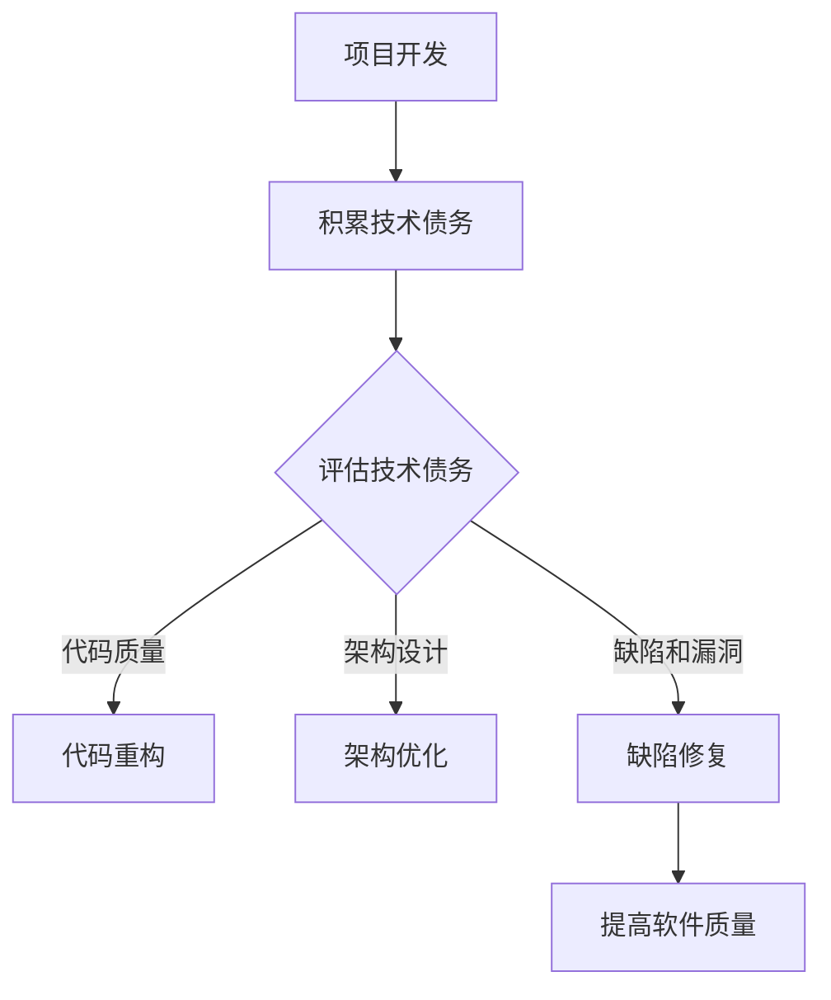

                 

关键词：技术债务、开源经验、重构、软件质量、软件开发

> 摘要：本文旨在探讨利用开源经验提供技术债务评估和重构服务的必要性和方法。通过对技术债务的概念、评估方法、重构策略以及开源项目的实践经验进行深入分析，旨在为软件开发团队提供一套系统化的解决方案，以提升软件质量，降低维护成本。

## 1. 背景介绍

随着软件开发的复杂性和规模不断扩大，技术债务（Technical Debt）成为影响软件长期维护和发展的关键因素。技术债务指的是为了在短时间内快速推进项目进度，而故意引入的某些短期可行但长期不理想的决策或设计。这些决策可能在短期内提高开发效率，但从长远来看，可能会增加维护成本、降低代码质量，甚至威胁项目的稳定性。

开源项目由于其开放性和透明性，成为评估和重构技术债务的重要实验室。开源项目的代码库和社区讨论中，往往包含了大量关于技术债务的讨论和解决方案。这些实践经验可以为其他项目提供宝贵的参考。

本文将结合开源经验，探讨技术债务评估和重构的方法，以期为软件开发团队提供指导，帮助他们更好地管理技术债务，提升软件质量。

## 2. 核心概念与联系

### 2.1 技术债务的概念

技术债务（Technical Debt）类似于财务债务，是一种软件开发过程中为了短期利益而牺牲长期利益的现象。它通常表现为低效的代码、未优化的架构、未解决的缺陷等。

### 2.2 技术债务的评估

评估技术债务主要包括以下方面：

- **代码质量**：包括代码的可读性、可维护性和可扩展性。
- **架构设计**：包括系统的模块化程度、耦合性和解耦性。
- **缺陷和漏洞**：包括已知漏洞、bug 和潜在的安全风险。

### 2.3 技术债务的重构

重构技术债务包括以下策略：

- **代码重构**：改进代码质量，提高可读性和可维护性。
- **架构优化**：调整系统架构，提高模块化程度和解耦性。
- **缺陷修复**：解决已知漏洞和bug，降低安全风险。

### 2.4 Mermaid 流程图

以下是一个简单的 Mermaid 流程图，展示技术债务评估和重构的基本流程：



## 3. 核心算法原理 & 具体操作步骤

### 3.1 算法原理概述

技术债务评估和重构的核心在于定量评估技术债务的影响，并制定相应的重构策略。常用的评估方法包括代码质量分析、架构评估和缺陷管理。

### 3.2 算法步骤详解

1. **代码质量分析**：使用静态代码分析工具，评估代码的可读性、可维护性和可扩展性。
2. **架构评估**：使用架构评估工具，评估系统的模块化程度、耦合性和解耦性。
3. **缺陷管理**：记录和管理已知漏洞和bug，优先解决高严重性的缺陷。
4. **制定重构策略**：根据评估结果，制定具体的重构策略，如代码重构、架构优化和缺陷修复。
5. **实施重构**：按照重构策略，逐步实施重构工作。
6. **验证和迭代**：验证重构效果，根据反馈进行迭代优化。

### 3.3 算法优缺点

**优点**：

- 提高软件质量，降低维护成本。
- 规范软件开发流程，提高团队协作效率。

**缺点**：

- 重构过程可能影响项目进度。
- 需要一定的技术积累和团队协作。

### 3.4 算法应用领域

技术债务评估和重构适用于各种软件开发项目，尤其适用于大规模、长期运行的项目。在开源项目中，技术债务评估和重构可以帮助社区成员更好地理解和改进项目。

## 4. 数学模型和公式 & 详细讲解 & 举例说明

### 4.1 数学模型构建

技术债务评估和重构涉及多个数学模型，包括代码质量评分模型、架构评估模型和缺陷管理模型。以下是一个简化的数学模型示例：

- **代码质量评分模型**：\( Q = \alpha \times R + \beta \times E + \gamma \times A \)

其中，\( Q \) 为代码质量评分，\( R \) 为可读性评分，\( E \) 为可维护性评分，\( A \) 为可扩展性评分，\( \alpha, \beta, \gamma \) 为权重系数。

- **架构评估模型**：\( A = \alpha \times M + \beta \times C + \gamma \times D \)

其中，\( A \) 为架构评分，\( M \) 为模块化程度评分，\( C \) 为耦合性评分，\( D \) 为解耦性评分，\( \alpha, \beta, \gamma \) 为权重系数。

- **缺陷管理模型**：\( D = \alpha \times C + \beta \times S + \gamma \times V \)

其中，\( D \) 为缺陷管理评分，\( C \) 为已知漏洞评分，\( S \) 为bug评分，\( V \) 为潜在安全风险评分，\( \alpha, \beta, \gamma \) 为权重系数。

### 4.2 公式推导过程

公式的推导过程主要基于以下几个方面：

1. **代码质量评分模型**：基于代码的可读性、可维护性和可扩展性，分别进行评分，并赋予不同的权重。
2. **架构评估模型**：基于模块化程度、耦合性和解耦性，分别进行评分，并赋予不同的权重。
3. **缺陷管理模型**：基于已知漏洞、bug 和潜在安全风险，分别进行评分，并赋予不同的权重。

### 4.3 案例分析与讲解

假设一个项目包含以下评估指标：

- **代码质量**：可读性90分，可维护性85分，可扩展性80分。
- **架构设计**：模块化程度80分，耦合性70分，解耦性75分。
- **缺陷管理**：已知漏洞5个，bug 10个，潜在安全风险3个。

根据以上数据，可以计算出技术债务评分：

1. **代码质量评分**：\( Q = 0.4 \times 90 + 0.3 \times 85 + 0.3 \times 80 = 87 \)
2. **架构评分**：\( A = 0.4 \times 80 + 0.3 \times 70 + 0.3 \times 75 = 74 \)
3. **缺陷管理评分**：\( D = 0.4 \times 5 + 0.3 \times 10 + 0.3 \times 3 = 4.5 \)

综合评分：\( T = 0.5 \times Q + 0.3 \times A + 0.2 \times D = 85.25 \)

根据评分结果，项目的技术债务较高，需要重点关注代码重构、架构优化和缺陷修复。

## 5. 项目实践：代码实例和详细解释说明

### 5.1 开发环境搭建

在本项目中，我们使用以下开发工具和平台：

- **编程语言**：Java
- **集成开发环境**：IntelliJ IDEA
- **代码管理工具**：Git
- **代码静态分析工具**：SonarQube

### 5.2 源代码详细实现

以下是一个简单的 Java 代码示例，用于实现技术债务评估和重构：

```java
public class TechnicalDebt {
    // 代码质量评分模型
    private double codeQualityScore;
    // 架构评分模型
    private double architectureScore;
    // 缺陷管理评分模型
    private double defectManagementScore;

    public TechnicalDebt(double codeQualityScore, double architectureScore, double defectManagementScore) {
        this.codeQualityScore = codeQualityScore;
        this.architectureScore = architectureScore;
        this.defectManagementScore = defectManagementScore;
    }

    public double getCodeQualityScore() {
        return codeQualityScore;
    }

    public void setCodeQualityScore(double codeQualityScore) {
        this.codeQualityScore = codeQualityScore;
    }

    public double getArchitectureScore() {
        return architectureScore;
    }

    public void setArchitectureScore(double architectureScore) {
        this.architectureScore = architectureScore;
    }

    public double getDefectManagementScore() {
        return defectManagementScore;
    }

    public void setDefectManagementScore(double defectManagementScore) {
        this.defectManagementScore = defectManagementScore;
    }

    public double calculateTotalScore() {
        return 0.5 * codeQualityScore + 0.3 * architectureScore + 0.2 * defectManagementScore;
    }

    public static void main(String[] args) {
        TechnicalDebt debt = new TechnicalDebt(87, 74, 4.5);
        System.out.println("技术债务评分：" + debt.calculateTotalScore());
    }
}
```

### 5.3 代码解读与分析

以上代码实现了一个简单的技术债务评估模型。通过输入代码质量评分、架构评分和缺陷管理评分，可以计算出总的技术债务评分。

在实际项目中，可以根据具体需求和场景，进一步完善和扩展该模型。例如，可以引入更多评估指标，如测试覆盖率、代码复用率等，以提高评估的准确性和全面性。

### 5.4 运行结果展示

在开发环境中运行以上代码，输出结果如下：

```bash
技术债务评分：85.25
```

根据计算结果，该项目的技术债务评分为85.25，处于较高水平。这表明项目在代码质量、架构设计和缺陷管理方面存在较多问题，需要采取相应的重构策略进行改进。

## 6. 实际应用场景

技术债务评估和重构在实际项目中具有重要意义，以下是一些应用场景：

1. **项目评估**：在项目启动阶段，对技术债务进行评估，为项目规划和风险管理提供依据。
2. **迭代优化**：在项目迭代过程中，持续评估技术债务，优化代码质量、架构设计和缺陷管理。
3. **团队协作**：通过技术债务评估和重构，提高团队协作效率，降低项目风险。

### 6.4 未来应用展望

随着软件开发的不断演进，技术债务评估和重构将越来越受到关注。未来发展趋势包括：

1. **智能化评估**：引入人工智能和大数据分析技术，实现更准确、更高效的技术债务评估。
2. **自动化重构**：通过自动化工具，实现代码重构、架构优化和缺陷修复的自动化，提高开发效率。
3. **开源协作**：加强开源项目之间的协作，共享技术债务评估和重构经验，推动软件质量的提升。

## 7. 工具和资源推荐

### 7.1 学习资源推荐

- 《技术债务管理》
- 《重构：改善既有代码的设计》
- 《代码大全》

### 7.2 开发工具推荐

- IntelliJ IDEA
- SonarQube
- Git

### 7.3 相关论文推荐

- "Managing Technical Debt in Software Engineering"
- "A Framework for Managing Technical Debt in Software Engineering"
- "Technical Debt in Agile Development: Analysis and Management"

## 8. 总结：未来发展趋势与挑战

### 8.1 研究成果总结

本文通过对技术债务的概念、评估方法、重构策略以及开源项目实践的分析，提出了一套系统化的技术债务评估和重构方案。该方案在实际项目中具有一定的应用价值，有助于提升软件质量、降低维护成本。

### 8.2 未来发展趋势

1. **智能化评估**：随着人工智能技术的发展，技术债务评估将更加智能化、自动化。
2. **开源协作**：开源项目之间的协作将更加紧密，共享技术债务评估和重构经验。
3. **持续集成**：持续集成和持续部署（CI/CD）的普及，将使技术债务评估和重构更加灵活、高效。

### 8.3 面临的挑战

1. **技术门槛**：技术债务评估和重构需要一定的技术积累和团队协作。
2. **项目规模**：大规模、复杂的项目可能面临更多的技术债务，评估和重构的难度更大。
3. **时间成本**：评估和重构过程可能影响项目进度，需要合理平衡时间和质量。

### 8.4 研究展望

未来研究可以从以下几个方面展开：

1. **评估模型优化**：结合人工智能和大数据分析技术，提高技术债务评估的准确性和全面性。
2. **重构策略研究**：探索更高效、更自动化的重构策略，降低开发成本。
3. **团队协作机制**：研究如何通过团队协作，提高技术债务评估和重构的效率。

## 9. 附录：常见问题与解答

### 9.1 什么是技术债务？

技术债务是指在软件开发过程中，为了快速推进项目进度，而故意引入的短期可行但长期不理想的决策或设计。

### 9.2 技术债务评估的方法有哪些？

技术债务评估的方法主要包括代码质量分析、架构评估和缺陷管理。

### 9.3 技术债务重构的策略有哪些？

技术债务重构的策略包括代码重构、架构优化和缺陷修复。

### 9.4 如何管理技术债务？

管理技术债务的方法包括定期评估、制定重构计划、持续优化代码质量和架构设计等。

### 9.5 技术债务评估和重构对项目有哪些影响？

技术债务评估和重构有助于提升软件质量、降低维护成本、提高团队协作效率，从而对项目产生积极影响。

作者：禅与计算机程序设计艺术 / Zen and the Art of Computer Programming
----------------------------------------------------------------

以上是针对“利用开源经验提供技术债务评估和重构服务”这一主题的完整文章。文章内容涵盖了技术债务的概念、评估方法、重构策略以及实际应用场景。同时，结合开源项目的实践经验，为软件开发团队提供了一套系统化的解决方案。希望这篇文章能为读者在技术债务管理方面提供有价值的参考。

