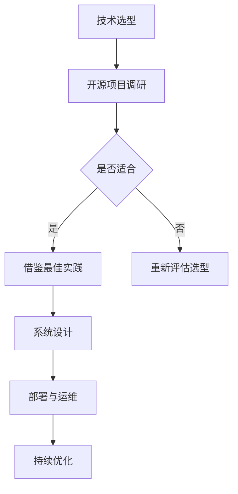

                 

关键词：技术架构、开源经验、软件设计、系统优化、可持续性

> 摘要：本文将探讨如何利用开源经验来提供技术架构咨询。通过结合开源社区的实践和最佳经验，为企业构建稳健、高效、可持续的技术架构，从而提高企业竞争力和创新能力。

## 1. 背景介绍

随着信息技术的快速发展，企业对技术架构的需求越来越高。一方面，技术架构需要支持业务快速响应市场变化，另一方面，又需要保证系统稳定、高效、安全。然而，如何构建一个符合企业需求的技术架构，成为了许多企业面临的一大难题。

开源经验作为技术社区宝贵的知识财富，为企业提供了丰富的技术参考和实践案例。通过深入研究开源项目，企业可以借鉴其成功经验，避免重复造轮子，提高开发效率。本文将结合开源经验，提供一些建议和最佳实践，帮助企业构建高质量的技术架构。

## 2. 核心概念与联系

### 2.1 技术架构定义

技术架构是指企业或项目所采用的技术方案和系统结构。它包括以下几个方面：

- **技术选型**：选择适合企业业务需求的技术框架、数据库、中间件等。
- **系统设计**：定义系统的模块划分、接口设计、数据流转等。
- **部署与运维**：确定系统的部署方式、监控、运维策略等。

### 2.2 开源经验与架构的关系

开源经验对技术架构的构建具有重要意义。一方面，开源项目提供了丰富的技术参考和最佳实践；另一方面，开源项目中的技术积累和社区合作模式，为企业的技术架构设计提供了有益的借鉴。

### 2.3 Mermaid 流程图

下面是技术架构设计与开源经验联系的一个简单 Mermaid 流程图：



## 3. 核心算法原理 & 具体操作步骤

### 3.1 算法原理概述

技术架构咨询的核心在于对现有技术方案的评估与优化。这里，我们可以采用以下算法原理：

- **需求分析**：深入了解企业业务需求和痛点，明确技术架构的目标和需求。
- **对比分析**：对比开源项目的架构特点、性能、稳定性等，评估其适用性。
- **优化方案**：根据需求分析结果和对比分析，提出针对性的优化方案。

### 3.2 算法步骤详解

#### 3.2.1 需求分析

1. 与企业业务团队沟通，了解业务需求、系统性能、安全要求等。
2. 收集现有技术系统的性能数据、故障记录、用户反馈等。

#### 3.2.2 对比分析

1. 筛选适合企业业务场景的典型开源项目。
2. 对比开源项目的架构特点、性能指标、社区活跃度等。
3. 分析开源项目的优缺点，评估其适用性。

#### 3.2.3 优化方案

1. 根据需求分析和对比分析结果，提出针对性的优化方案。
2. 考虑到系统的可扩展性、可维护性和安全性。
3. 设计符合企业需求的系统架构。

### 3.3 算法优缺点

**优点**：

- **高效性**：利用开源经验，避免重复造轮子，提高开发效率。
- **灵活性**：借鉴开源项目的成功经验，为企业提供定制化的技术架构。
- **可持续性**：开源项目拥有稳定的社区支持，有助于技术的长期发展。

**缺点**：

- **依赖性**：过度依赖开源项目，可能带来一定的风险。
- **学习成本**：需要深入了解开源项目的架构和实现，对团队有一定要求。

### 3.4 算法应用领域

技术架构咨询适用于以下场景：

- **初创企业**：缺乏技术积累，需要快速构建稳定、高效的技术架构。
- **大型企业**：面对业务扩张，需要持续优化和改进现有技术架构。
- **转型企业**：从传统业务向互联网业务转型，需要重构技术架构以支持新业务。

## 4. 数学模型和公式 & 详细讲解 & 举例说明

### 4.1 数学模型构建

技术架构优化的数学模型可以基于以下几个方面：

- **性能指标**：包括响应时间、吞吐量、并发量等。
- **成本效益**：包括开发成本、运维成本、人力成本等。
- **稳定性**：包括系统的故障率、恢复时间等。

### 4.2 公式推导过程

以响应时间为例，响应时间 \( T \) 可以通过以下公式计算：

\[ T = \frac{C}{T_c + T_s} \]

其中：

- \( C \)：系统总成本
- \( T_c \)：系统计算时间
- \( T_s \)：系统等待时间

### 4.3 案例分析与讲解

假设企业需要构建一个电商平台，以下是一个简单的案例：

- **需求分析**：系统需要支持千万级用户同时在线，峰值吞吐量达到每秒万次。
- **对比分析**：选择开源的 Kafka、Redis、Django 等技术框架。
- **优化方案**：基于需求分析和对比分析，采用 Kafka 实现消息队列，Redis 实现缓存，Django 实现后端服务。

通过这个案例，我们可以看到，技术架构优化需要结合企业实际需求，充分利用开源经验，实现高效、稳定、安全的系统。

## 5. 项目实践：代码实例和详细解释说明

### 5.1 开发环境搭建

在本文中，我们使用 Python 作为编程语言，并结合 Flask 框架实现一个简单的电商平台。首先，我们需要搭建开发环境。

```bash
# 安装 Python 3.8
sudo apt-get install python3.8

# 安装 pip
curl -sS https://bootstrap.pypa.io/get-pip.py | python3.8

# 创建虚拟环境
python3.8 -m venv venv

# 激活虚拟环境
source venv/bin/activate

# 安装 Flask
pip install flask
```

### 5.2 源代码详细实现

接下来，我们实现一个简单的电商平台后端，包括用户注册、登录、商品展示等功能。

```python
# app.py

from flask import Flask, request, jsonify
from flask_sqlalchemy import SQLAlchemy

app = Flask(__name__)
app.config['SQLALCHEMY_DATABASE_URI'] = 'sqlite:///example.db'
db = SQLAlchemy(app)

class User(db.Model):
    id = db.Column(db.Integer, primary_key=True)
    username = db.Column(db.String(80), unique=True, nullable=False)
    password = db.Column(db.String(120), nullable=False)

@app.route('/register', methods=['POST'])
def register():
    data = request.get_json()
    username = data['username']
    password = data['password']
    if User.query.filter_by(username=username).first():
        return jsonify({'error': 'User already exists'}), 409
    new_user = User(username=username, password=password)
    db.session.add(new_user)
    db.session.commit()
    return jsonify({'message': 'User created successfully'})

@app.route('/login', methods=['POST'])
def login():
    data = request.get_json()
    username = data['username']
    password = data['password']
    user = User.query.filter_by(username=username).first()
    if user and user.password == password:
        return jsonify({'message': 'Login successful'})
    else:
        return jsonify({'error': 'Invalid credentials'})

if __name__ == '__main__':
    db.create_all()
    app.run(debug=True)
```

### 5.3 代码解读与分析

在这个简单的电商平台后端中，我们使用了 Flask 框架和 SQLAlchemy 库。Flask 是一个轻量级的 Web 框架，易于学习和使用。SQLAlchemy 是一个强大的 ORM（对象关系映射）库，用于操作数据库。

代码首先定义了一个 User 类，表示用户信息。然后，我们创建了一个简单的注册和登录接口，用于处理用户注册和登录请求。

### 5.4 运行结果展示

运行后端代码，我们可以通过 Postman 等工具模拟用户注册和登录请求。

```bash
# 启动后端服务
python app.py

# 注册用户
POST /register
{
  "username": "user1",
  "password": "password1"
}

# 登录用户
POST /login
{
  "username": "user1",
  "password": "password1"
}
```

## 6. 实际应用场景

### 6.1 电商系统

电商系统需要处理大量用户请求，同时保持高性能和高可靠性。通过开源经验，我们可以借鉴大型电商平台的架构设计，如阿里巴巴的分布式架构、京东的微服务架构等。

### 6.2 金融系统

金融系统对安全性、稳定性和合规性有严格要求。通过开源经验，我们可以采用如区块链、分布式数据库等技术，构建安全、可靠的金融系统。

### 6.3 医疗系统

医疗系统需要处理大量数据，同时支持在线问诊、远程医疗等功能。通过开源经验，我们可以采用云计算、大数据等技术，提升医疗系统的效率和服务质量。

## 7. 未来应用展望

随着云计算、大数据、人工智能等技术的不断发展，开源经验在技术架构咨询中的应用将越来越广泛。未来，开源经验将成为企业构建高质量技术架构的重要参考。

## 8. 工具和资源推荐

### 8.1 学习资源推荐

- 《大话云计算》
- 《深入理解计算机系统》
- 《设计模式：可复用面向对象软件的基础》

### 8.2 开发工具推荐

- Python
- Flask
- MySQL

### 8.3 相关论文推荐

- 《大型分布式网站架构》
- 《微服务架构设计》
- 《区块链：从数字货币到智能合约》

## 9. 总结：未来发展趋势与挑战

随着技术的不断发展，开源经验在技术架构咨询中的应用前景广阔。然而，也面临着一定的挑战，如技术选型、团队协作、安全等问题。未来，企业需要充分利用开源经验，结合自身业务需求，构建高质量的技术架构。

## 10. 附录：常见问题与解答

### 10.1 开源项目如何选择？

- 考虑社区活跃度、性能指标、兼容性等因素。
- 尽量选择知名的开源项目，以降低风险。

### 10.2 如何应对开源项目的依赖？

- 对开源项目进行充分了解，评估其稳定性。
- 对关键组件进行备份和优化，降低依赖风险。

### 10.3 如何保证技术架构的可持续性？

- 结合企业实际需求，设计灵活、可扩展的技术架构。
- 关注开源项目的最新动态，及时更新技术方案。

作者：禅与计算机程序设计艺术 / Zen and the Art of Computer Programming
----------------------------------------------------------------

这篇文章详细探讨了如何利用开源经验提供技术架构咨询。通过深入分析开源项目的架构特点、性能指标和最佳实践，企业可以构建高质量、高效能的技术架构，从而提升竞争力和创新能力。同时，本文还介绍了相关的数学模型、项目实践和未来应用展望，为企业提供了全面的指导。在未来的发展中，开源经验将继续发挥重要作用，助力企业实现技术升级和业务创新。

