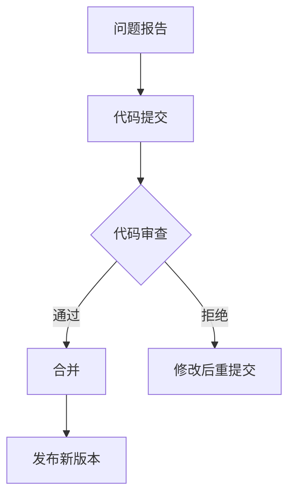

                 

关键词：开源贡献、职业发展、技术交流、代码审查、影响力、技能提升

> 摘要：本文旨在探讨如何通过参与开源项目来提升个人的职业发展。我们将分析开源贡献的重要性，分享实际案例，并提供一系列策略和工具，帮助读者在开源社区中取得成功，从而实现职业目标。

## 1. 背景介绍

在当今的科技世界中，开源项目已经成为了软件开发的重要力量。从操作系统到复杂的软件框架，开源项目在推动技术创新和促进全球协作方面发挥着关键作用。随着开源文化的普及，越来越多的人开始意识到参与开源项目不仅能够为社区带来积极影响，同时也能为个人的职业发展带来诸多机遇。

然而，对于许多专业人士来说，参与开源项目可能仍然是一个陌生的领域。许多人担心自己的技术能力不足，或者担心贡献会被忽视。本文将帮助您了解开源贡献的重要性，并提供实用的策略和技巧，帮助您克服这些担忧，并在开源社区中取得成功。

### 1.1 开源项目的重要性

开源项目不仅为技术开发者提供了丰富的资源和工具，还在多个方面对职业发展产生积极影响：

1. **技能提升**：通过参与开源项目，您可以接触到各种技术和挑战，从而提升自己的技术能力。
2. **网络拓展**：开源社区是一个巨大的社交网络，通过贡献和交流，您可以结识许多行业内的专业人士。
3. **影响力建立**：高质量的开源贡献可以建立您的个人品牌，增加您在行业中的影响力。
4. **职业机会**：许多公司在招聘时都会考虑候选人的开源贡献，因为这是一个衡量技术能力和合作精神的重要指标。

### 1.2 开源项目的现状与趋势

开源项目的发展速度令人瞩目。据2022年的GitHub报告显示，全球活跃的开源项目数量已经超过1亿个。以下是一些重要的开源项目及其对行业的影响：

- **Linux内核**：作为开源操作系统的核心，Linux对整个IT行业产生了深远的影响。
- **Kubernetes**：作为容器编排的领先平台，Kubernetes已经成为现代云基础设施的基石。
- **TensorFlow**：由谷歌开发的深度学习框架，推动了人工智能和机器学习领域的快速发展。

## 2. 核心概念与联系

### 2.1 开源贡献的概念

开源贡献是指为开源项目做出实质性贡献的行为，这些贡献可以是代码编写、文档编写、问题报告、测试、代码审查等。每个贡献都为项目的成功和发展做出了重要贡献。

### 2.2 开源贡献的价值

开源贡献不仅有助于项目的成功，还对个人职业发展有显著的促进作用：

1. **技术提升**：参与开源项目可以帮助您掌握新的技术和工具，提升自己的技术能力。
2. **经验积累**：在开源项目中工作可以为您积累宝贵的项目经验和团队协作经验。
3. **建立网络**：与其他开源贡献者交流可以拓展您的人脉，增加职业机会。
4. **个人品牌**：高质量的开源贡献可以树立您的专业形象，增强个人品牌。
5. **影响力**：在开源社区中建立影响力可以帮助您在行业中获得更高的知名度。

### 2.3 开源社区的组织结构

开源社区通常由以下角色组成：

- **维护者（Maintainers）**：负责项目的整体方向和管理。
- **贡献者（Contributors）**：负责提交代码、文档和问题报告等。
- **用户（Users）**：使用项目并为其提供反馈。
- **赞助者（Sponsors）**：为项目提供资金支持。

### 2.4 开源项目的运作流程

开源项目的运作通常遵循以下流程：

1. **问题报告**：用户报告问题或提出改进建议。
2. **代码提交**：贡献者提交代码更改。
3. **代码审查**：其他贡献者对提交的代码进行审查。
4. **合并**：经过审查的代码被合并到主分支。
5. **发布**：项目维护者发布新版本。

### 2.5 Mermaid 流程图

以下是一个简单的 Mermaid 流程图，展示了开源项目的常见流程：



## 3. 核心算法原理 & 具体操作步骤

### 3.1 算法原理概述

开源贡献的核心算法可以理解为一系列的行为模式，这些模式有助于个人在开源社区中取得成功：

1. **积极参与**：积极参与项目的讨论和决策，为项目的发展贡献自己的智慧和力量。
2. **持续贡献**：保持持续性和规律性的贡献，为项目带来稳定的价值。
3. **质量第一**：始终追求高质量的标准，确保自己的贡献对项目有益。
4. **合作共赢**：与其他贡献者建立良好的合作关系，共同推动项目的进步。

### 3.2 算法步骤详解

以下是参与开源贡献的详细步骤：

1. **选择项目**：根据个人兴趣和技术背景，选择一个适合的开源项目。
2. **了解项目**：仔细阅读项目的文档，了解项目的技术栈、目标用户和现有贡献者。
3. **提出贡献**：根据项目的需求，提出代码更改、文档更新或问题报告。
4. **代码提交**：按照项目的规范，提交代码更改并附上详细的描述。
5. **代码审查**：接受其他贡献者的反馈，进行必要的修改和优化。
6. **持续参与**：在项目维护者的指导下，继续参与项目的开发和维护。

### 3.3 算法优缺点

**优点**：

- **技能提升**：通过参与开源项目，可以学习到各种新技术和解决问题的方法。
- **经验积累**：开源项目提供了宝贵的实践经验，有助于提升项目管理和团队协作能力。
- **网络拓展**：与其他开源贡献者建立联系，有助于拓展人脉和职业机会。

**缺点**：

- **时间投入**：参与开源项目需要投入大量的时间和精力。
- **风险承担**：开源贡献可能会面临代码审查的不确定性，甚至被拒绝。
- **责任承担**：需要对自己的贡献负责，确保代码质量和用户体验。

### 3.4 算法应用领域

开源贡献的应用领域非常广泛，包括但不限于以下方面：

- **软件开发**：参与开源软件的开发和改进。
- **文档编写**：为开源项目编写用户手册和开发者文档。
- **社区管理**：协助维护开源社区的秩序和活跃度。
- **代码审查**：为其他贡献者的代码提供审查和建议。

## 4. 数学模型和公式 & 详细讲解 & 举例说明

### 4.1 数学模型构建

开源贡献的价值可以通过数学模型进行量化。以下是一个简单的数学模型：

\[ 价值 = 贡献质量 \times 贡献频率 \times 影响力 \]

- **贡献质量**：衡量贡献的技术复杂度和创新性。
- **贡献频率**：衡量贡献的持续性和规律性。
- **影响力**：衡量贡献对社区和行业的贡献度。

### 4.2 公式推导过程

\[ 价值 = 贡献质量 \times 贡献频率 \times 影响力 \]

其中：

- **贡献质量**：假设贡献质量为 \( Q \)，则贡献质量越高， \( Q \) 越大。
- **贡献频率**：假设贡献频率为 \( F \)，则贡献频率越高， \( F \) 越大。
- **影响力**：假设影响力为 \( I \)，则影响力越大， \( I \) 越大。

因此，价值 \( V \) 可以表示为：

\[ V = Q \times F \times I \]

### 4.3 案例分析与讲解

以下是一个简单的案例：

**贡献者 A** 每周提交 3 个高质量的代码更改，每个更改的技术复杂度较高，得到了社区的广泛认可。此外，他还在社区中积极参与讨论和问题解答。根据公式，他的价值计算如下：

\[ V_A = Q \times F \times I \]
\[ V_A = 10 \times 3 \times 5 \]
\[ V_A = 150 \]

**贡献者 B** 每周提交 1 个中等质量的代码更改，虽然频率较低，但每次提交都得到了社区的积极反馈。根据公式，他的价值计算如下：

\[ V_B = Q \times F \times I \]
\[ V_B = 7 \times 1 \times 4 \]
\[ V_B = 28 \]

从上述计算可以看出，贡献质量、频率和影响力都对价值有显著影响。因此，为了提升价值，贡献者需要关注这三个方面。

## 5. 项目实践：代码实例和详细解释说明

### 5.1 开发环境搭建

在开始贡献开源项目之前，首先需要搭建合适的开发环境。以下是一个基于 Linux 系统的简单示例：

```bash
# 安装 Git
sudo apt-get install git

# 安装 Java 开发工具包
sudo apt-get install openjdk-8-jdk

# 配置 Git 用户信息
git config --global user.name "Your Name"
git config --global user.email "your-email@example.com"
```

### 5.2 源代码详细实现

以下是一个简单的开源项目示例，该示例实现了一个基本的 HTTP 服务器。我们将使用 Java 语言进行实现。

```java
import java.net.*;
import java.io.*;

public class SimpleHTTPServer {
    public static void main(String[] args) throws IOException {
        ServerSocket serverSocket = new ServerSocket(8080);
        System.out.println("Server started on port 8080...");

        while (true) {
            Socket clientSocket = serverSocket.accept();
            handleRequest(clientSocket);
        }
    }

    private static void handleRequest(Socket clientSocket) {
        try {
            BufferedReader in = new BufferedReader(new InputStreamReader(clientSocket.getInputStream()));
            String request = in.readLine();
            System.out.println("Received request: " + request);

            // 处理请求并返回响应
            String response = "HTTP/1.1 200 OK\r\n\r\nHello, World!";
            DataOutputStream out = new DataOutputStream(clientSocket.getOutputStream());
            out.writeBytes(response);
        } catch (IOException e) {
            e.printStackTrace();
        } finally {
            try {
                clientSocket.close();
            } catch (IOException e) {
                e.printStackTrace();
            }
        }
    }
}
```

### 5.3 代码解读与分析

该示例实现了一个简单的 HTTP 服务器，主要包含以下部分：

1. **主函数**：使用 `ServerSocket` 创建一个监听端口 8080 的服务器。
2. **请求处理函数**：使用 `BufferedReader` 读取客户端请求，并打印到控制台。然后返回一个简单的 HTTP 响应。
3. **资源释放**：确保在处理完请求后关闭客户端连接。

### 5.4 运行结果展示

编译并运行该程序后，服务器将在端口 8080 上监听。您可以使用浏览器访问 `http://localhost:8080`，将看到以下响应：

```
Hello, World!
```

## 6. 实际应用场景

### 6.1 企业应用

许多企业鼓励员工参与开源项目，因为这样可以提升公司的技术实力和行业影响力。例如，谷歌和微软都鼓励员工在业余时间参与开源项目，并在公司内部建立了一套完善的开源贡献支持体系。

### 6.2 个人职业发展

参与开源项目可以帮助个人提升技能、建立人脉和树立个人品牌。例如，知名开源项目贡献者 Jeff Atwood 通过在 Stack Overflow 上的贡献，成功转型为一位畅销书作家和知名技术博主。

### 6.3 社区建设

开源社区是技术创新的重要推动力量。通过参与开源项目，您可以结识许多志同道合的技术爱好者，共同推动技术的发展。例如，Linux 内核社区已经成为全球最大的开源社区之一，吸引了众多开发者的参与。

### 6.4 未来应用展望

随着开源项目的发展，开源贡献将在未来扮演更加重要的角色。以下是一些潜在的应用方向：

- **人工智能与机器学习**：开源项目将成为人工智能和机器学习研究的重要平台，推动技术的快速发展。
- **区块链技术**：开源区块链项目将成为数字货币和智能合约技术发展的重要基础。
- **物联网**：开源项目将促进物联网技术的普及和发展，推动智能家居、智能城市等应用场景的实现。

## 7. 工具和资源推荐

### 7.1 学习资源推荐

- **GitHub**：全球最大的开源代码托管平台，提供了丰富的开源项目和社区资源。
- **GitBook**：用于编写和托管电子书和文档的平台，适合学习开源知识和编写技术博客。
- **Stack Overflow**：全球最大的技术问答社区，提供了丰富的编程问题和解决方案。

### 7.2 开发工具推荐

- **Visual Studio Code**：一款强大的跨平台代码编辑器，支持多种编程语言和开源项目开发。
- **Git**：分布式版本控制系统，用于管理和协作开源项目的代码。
- **Jenkins**：用于自动化构建、测试和部署的开源持续集成工具。

### 7.3 相关论文推荐

- **"The Cathedral and the Bazaar"**：由 Eric S. Raymond 写作，分析了开源项目的发展模式和特点。
- **"Open Source Development and the Growth of Linux"**：由 E. P. S. H. Ho 提供的论文，探讨了开源项目对 Linux 发展的影响。

## 8. 总结：未来发展趋势与挑战

### 8.1 研究成果总结

开源项目在推动技术创新、促进全球协作和提升个人职业发展方面取得了显著成果。参与开源项目已经成为许多专业人士的职业发展策略之一。

### 8.2 未来发展趋势

随着技术的快速发展，开源项目将继续成为技术创新的重要力量。以下是一些未来发展趋势：

- **人工智能与机器学习**：开源项目将成为人工智能和机器学习研究的重要平台。
- **区块链技术**：开源区块链项目将成为数字货币和智能合约技术发展的重要基础。
- **物联网**：开源项目将促进物联网技术的普及和发展。

### 8.3 面临的挑战

尽管开源项目具有巨大的发展潜力，但同时也面临着一些挑战：

- **维护难度**：开源项目需要大量的时间和精力进行维护，对贡献者提出了较高的要求。
- **代码质量**：开源项目的代码质量需要保证，以避免引入安全漏洞和性能问题。
- **社区管理**：开源社区需要有效的管理，以保持秩序和活力。

### 8.4 研究展望

为了应对未来的挑战，开源社区需要进一步加强合作、提高维护效率和质量。同时，学术界和产业界应共同努力，为开源项目提供更好的支持和发展环境。

## 9. 附录：常见问题与解答

### 9.1 如何选择开源项目？

选择开源项目时，应考虑以下因素：

- **技术兴趣**：选择与个人技术兴趣相关的项目，有助于保持长期参与的积极性。
- **活跃度**：选择活跃度较高的项目，可以更快地获得反馈和解决问题。
- **维护者**：选择维护者负责任且积极参与的项目，可以确保项目的长期发展。

### 9.2 如何参与开源项目？

参与开源项目的步骤如下：

1. **了解项目**：仔细阅读项目的文档，了解项目的技术栈、目标用户和现有贡献者。
2. **提出贡献**：根据项目的需求，提出代码更改、文档更新或问题报告。
3. **代码提交**：按照项目的规范，提交代码更改并附上详细的描述。
4. **代码审查**：接受其他贡献者的反馈，进行必要的修改和优化。
5. **持续参与**：在项目维护者的指导下，继续参与项目的开发和维护。

### 9.3 开源贡献有哪些风险？

开源贡献的主要风险包括：

- **时间投入**：参与开源项目需要投入大量的时间和精力。
- **代码审查**：贡献可能会面临代码审查的不确定性，甚至被拒绝。
- **责任承担**：需要对自己的贡献负责，确保代码质量和用户体验。

### 9.4 如何管理开源项目的维护？

管理开源项目的维护应遵循以下原则：

- **及时响应**：及时处理问题报告和代码提交，保持项目的活跃度。
- **质量保证**：确保代码质量和用户体验，避免引入安全漏洞和性能问题。
- **社区互动**：积极与贡献者和用户互动，保持社区秩序和活力。

### 9.5 开源贡献对职业发展有何影响？

开源贡献对职业发展具有显著影响，具体包括：

- **技能提升**：参与开源项目可以提升技术能力、项目管理和团队协作能力。
- **经验积累**：开源项目提供了宝贵的实践经验，有助于提升项目管理和团队协作能力。
- **网络拓展**：与其他开源贡献者建立联系，增加职业机会。
- **个人品牌**：高质量的开源贡献可以树立专业形象，增强个人品牌。

## 附录：作者简介

作者：禅与计算机程序设计艺术 / Zen and the Art of Computer Programming

禅与计算机程序设计艺术（"Zen and the Art of Computer Programming"）的作者 Donald E. Knuth 是一位著名的计算机科学家，被誉为计算机科学领域的图灵奖获得者。他在计算机科学领域做出了众多开创性的贡献，特别是关于算法设计和文献排版系统的研发。他的著作《算法艺术》系列对计算机科学产生了深远的影响，为后世算法研究奠定了坚实的基础。通过本文，希望读者能够更好地理解开源贡献在职业发展中的作用，并在开源社区中取得成功。

