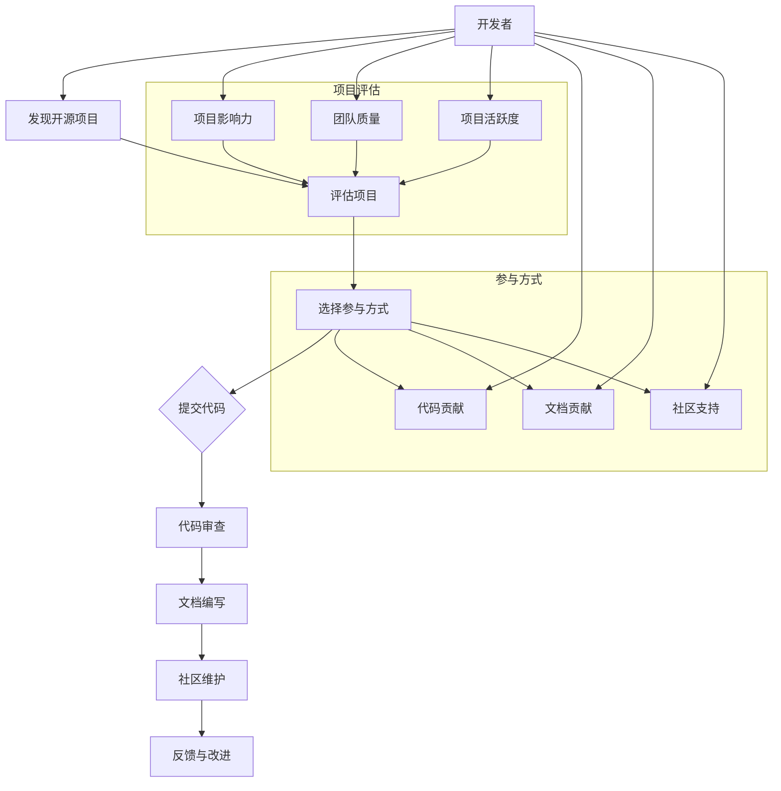

                 

关键词：开源贡献、职业发展、技术技能、代码审查、项目协作、影响力、领导力、面试技巧

## 摘要

开源项目在现代软件开发中扮演着至关重要的角色。通过参与开源项目，开发者不仅能够提升自身的技术能力，还能够拓展职业发展空间，增强个人品牌影响力。本文将深入探讨如何通过开源贡献来提升职业发展空间，包括选择合适的开源项目、积极参与代码审查和项目协作、提升领导力和影响力，以及如何将这些经验应用到面试和职业发展中。通过本文的阅读，开发者可以找到适合自己的开源项目，充分利用开源贡献来提升个人职业素养。

## 1. 背景介绍

开源软件（Open Source Software，简称OSS）是一种许可协议允许软件的源代码被公众访问、使用、研究、修改和分发。这种模式促进了全球范围内的技术交流和合作，催生了大量优秀的软件项目。如今，开源项目已经成为软件开发的主要驱动力之一，许多企业甚至直接基于开源软件进行商业运作。

随着开源运动的兴起，越来越多的开发者投身于开源项目的贡献。据统计，GitHub 上活跃的贡献者数量已经超过 2700 万人，这证明了开源社区的繁荣和活力。然而，并非所有的开发者都意识到开源贡献对个人职业发展的深远影响。本文旨在揭示开源贡献如何成为职业发展的利器，并帮助开发者更好地利用这一资源。

### 1.1 开源项目的优点

开源项目具有以下几个显著的优点：

- **知识共享**：开源项目鼓励知识共享，开发者可以学习并应用其他开发者的经验。
- **技术提升**：参与开源项目可以提升编程技能和解决问题的能力。
- **个人品牌**：通过高质量的贡献，开发者可以建立良好的个人品牌，增加在行业内的知名度。
- **就业机会**：许多公司在招聘时偏好有开源贡献经验的候选人，因为这意味着他们具备解决问题的能力和团队协作精神。
- **职业网络**：开源项目提供了一个平台，开发者可以结识来自世界各地的同行，建立有价值的职业联系。

### 1.2 开源项目的种类

开源项目可以分为多种类型，包括：

- **商业项目**：一些公司会将内部项目开源，以吸引开发者参与并提高项目的知名度。
- **个人项目**：开发者个人发起和维护的项目，可能用于展示技术能力或解决特定问题。
- **社区项目**：由多个志愿者共同维护的项目，通常具有较高的社区活跃度。
- **学术项目**：学术机构和大学参与的项目，旨在推动学术研究和知识共享。

### 1.3 开源社区的重要性

开源社区是开源项目得以持续发展的基础。社区中的成员通常具有共同的兴趣和目标，他们通过协作和分享来推动项目的进展。开源社区不仅促进了技术的进步，也为开发者提供了一个交流和学习的平台。在开源社区中，开发者可以：

- **获取反馈**：社区成员可以提供宝贵的反馈，帮助改进代码和项目。
- **学习经验**：社区成员分享的经验和教训，可以帮助开发者避免走弯路。
- **建立联系**：通过参与社区活动，开发者可以结识志同道合的人，拓展职业网络。
- **贡献代码**：开源社区的成员通常愿意接受贡献，这为开发者提供了实践和展示能力的机会。

## 2. 核心概念与联系

### 2.1 开源贡献的核心概念

开源贡献包括但不限于以下核心概念：

- **代码提交**：开发者将自己的代码修改或新功能添加到开源项目中。
- **代码审查**：其他开发者对提交的代码进行审核，确保代码的质量和符合项目规范。
- **文档编写**：编写项目文档，包括用户手册、API 文档和开发指南等。
- **社区维护**：参与项目维护，回复社区成员的问题和反馈，协助解决问题。

### 2.2 开源贡献的架构图

### 2.3 开源贡献的优势

- **技能提升**：通过参与开源项目，开发者可以学习新技能和工具，提高编程能力。
- **经验积累**：参与开源项目可以积累宝贵的实践经验，包括项目管理、团队协作和问题解决。
- **个人品牌**：高质量的开源贡献可以提升个人品牌，增加在行业内的知名度。
- **职业发展**：开源贡献可以作为简历中的重要亮点，提高面试成功率。
- **社区网络**：参与开源社区可以结识来自世界各地的开发者，建立有价值的职业联系。

## 3. 核心算法原理 & 具体操作步骤

### 3.1 算法原理概述

开源贡献的核心算法可以看作是一种“社交网络效应”。通过在开源项目中建立良好的社交关系，开发者可以获得以下收益：

- **知识共享**：与其他开发者分享经验和知识，促进个人和社区的成长。
- **技能提升**：通过解决实际问题和开发新功能，不断提升技术能力。
- **个人品牌**：高质量的开源贡献可以树立个人专业形象，增加影响力。
- **职业发展**：开源贡献可以作为职业发展的跳板，提高面试和晋升的机会。

### 3.2 算法步骤详解

#### 3.2.1 发现合适的开源项目

1. **确定兴趣领域**：根据自己的技术专长和职业规划，选择感兴趣的开源项目。
2. **搜索开源项目**：使用 GitHub、GitLab 等平台，通过关键词搜索找到感兴趣的项目。
3. **评估项目**：查看项目的影响

