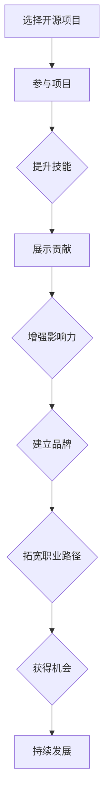

                 

在当今数字化时代，开源项目已经成为技术社区的核心驱动力。作为开发者，利用开源项目不仅可以提升技术能力，还可以在职业和个人生活中获得巨大益处。本文将深入探讨如何通过参与开源项目来打造个人品牌，成为技术领域的明星。

> **关键词**：开源项目，个人品牌，影响力，技术社区，职业发展

> **摘要**：本文将讨论开源项目对于个人品牌建设的重要性，介绍如何选择合适的开源项目，如何有效参与并贡献，以及如何利用开源项目提升个人知名度。通过案例分析和实用技巧，帮助读者掌握打造个人品牌的艺术。

## 1. 背景介绍

开源项目起源于20世纪90年代，是一种基于开放源代码的软件开发模式。在这种模式下，开发者可以自由地访问、修改和分发软件源代码，促进了技术的快速传播和创新。如今，开源项目已经成为现代软件生态系统的重要组成部分。

个人品牌是指个人在某一领域内的知名度和影响力。在技术领域，个人品牌不仅代表个人的技术实力，还体现了个人的价值观、工作态度和人格魅力。建立个人品牌有助于提高职业竞争力，拓宽职业发展路径，甚至在某些情况下能够带来商业机会。

### 1.1 开源项目与个人品牌的联系

开源项目与个人品牌之间有着紧密的联系。首先，开源项目提供了一个展示个人技能和贡献的平台。通过参与开源项目，开发者可以实践新技术，解决复杂问题，并展示自己的解决问题的能力。其次，开源项目是一种社交网络，参与者可以通过项目交流和合作，建立人脉关系，增强社交影响力。最后，优秀的开源项目贡献可以吸引企业的关注，提高求职竞争力，甚至有机会获得高薪职位或创业机会。

### 1.2 开源项目对职业发展的作用

参与开源项目对职业发展具有多方面的积极作用。首先，开源项目可以帮助开发者积累实战经验，提升技术水平。通过解决实际问题和优化代码，开发者可以加深对技术的理解，提高编程能力。其次，开源项目提供了一个展示个人才能的机会，有助于提高知名度和影响力。在技术社区中，拥有大量高质量的开源项目贡献者往往更容易获得认可和机会。最后，参与开源项目可以帮助开发者建立职业网络，结识业界精英，拓宽职业发展路径。

## 2. 核心概念与联系

在探讨如何利用开源项目打造个人品牌之前，我们需要了解几个核心概念及其相互关系。

### 2.1 开源项目的基本概念

开源项目是指代码公开，任何人都可以查看、修改和分发的一类软件项目。开源项目的核心特征是开放性、社区性和协作性。

- **开放性**：源代码公开，用户可以自由查看、修改和分发。
- **社区性**：项目由一个或多个社区成员共同维护和开发。
- **协作性**：参与者可以通过协作解决问题，共同推动项目发展。

### 2.2 个人品牌的构建

个人品牌的构建是一个长期的过程，涉及多个方面的努力。

- **专业技能**：专业技能是个人品牌的基础，通过不断学习和实践提升技能水平。
- **影响力**：在技术社区中产生影响，成为行业内的意见领袖。
- **价值观**：明确个人的价值观和立场，使其成为个人品牌的灵魂。
- **人脉关系**：通过积极参与社区活动，建立广泛的人脉关系。

### 2.3 开源项目与个人品牌的关系

开源项目与个人品牌之间存在着紧密的联系。通过参与开源项目，开发者可以在技术社区中展示自己的技能和贡献，从而提升个人知名度。同时，优秀的开源项目贡献可以吸引企业关注，提高求职竞争力。此外，开源项目还可以帮助开发者建立职业网络，拓宽职业发展路径。

### 2.4 Mermaid 流程图

下面是开源项目与个人品牌构建过程的 Mermaid 流程图：



## 3. 核心算法原理 & 具体操作步骤

### 3.1 算法原理概述

在开源项目中打造个人品牌，可以看作是一种基于协作和贡献的“社交算法”。这个算法的核心原理是通过参与开源项目，提升技能水平，展示个人贡献，从而增强影响力，最终建立个人品牌。

### 3.2 算法步骤详解

#### 3.2.1 选择开源项目

选择一个合适的开源项目是构建个人品牌的第一步。以下是一些选择开源项目的建议：

- **兴趣驱动**：选择你感兴趣的项目，这样能更持久地参与其中。
- **技术挑战**：选择具有技术挑战性的项目，有助于提升技能水平。
- **社区活跃**：选择社区活跃的项目，这样可以更好地与开发者交流。
- **项目成熟度**：选择成熟的项目，可以更快地熟悉项目结构和代码。

#### 3.2.2 参与项目

参与开源项目的关键在于积极参与社区的讨论，解决实际问题，并提出改进建议。以下是一些参与项目的步骤：

- **阅读文档**：了解项目的背景、目标和使用文档。
- **参与讨论**：在项目的讨论区参与讨论，提出问题和建议。
- **代码贡献**：提交代码修改和功能扩展，解决项目中的问题。
- **持续参与**：定期检查项目进展，持续参与项目讨论和代码提交。

#### 3.2.3 展示贡献

展示贡献是建立个人品牌的重要步骤。以下是一些展示贡献的方法：

- **撰写博客**：撰写关于项目贡献的博客文章，分享经验和心得。
- **社交媒体**：在社交媒体上分享项目进展和成果，扩大影响力。
- **项目演示**：在技术会议上展示项目，增加曝光度。
- **代码评论**：在代码库中添加详细的注释，提高代码质量。

#### 3.2.4 增强影响力

增强影响力可以帮助你在技术社区中建立个人品牌。以下是一些增强影响力的方法：

- **参与社区活动**：积极参与技术社区的活动，扩大人脉关系。
- **撰写技术文章**：撰写高质量的技术文章，分享专业知识和见解。
- **演讲和培训**：参与技术会议和培训，展示个人才华。
- **提供技术支持**：为社区成员提供技术支持和帮助，树立良好口碑。

#### 3.2.5 建立品牌

建立品牌是一个长期的过程，需要持续的努力。以下是一些建立品牌的方法：

- **保持专业**：始终保持专业态度，遵守道德规范。
- **个性化**：在项目中展示个性和创新，使个人品牌更具吸引力。
- **持续更新**：定期更新个人资料和项目信息，保持活跃状态。
- **规划未来**：制定个人发展规划，明确目标和方向。

### 3.3 算法优缺点

#### 优点

- **技能提升**：参与开源项目可以提升技能水平，学习新技术和最佳实践。
- **影响力增强**：通过贡献和展示，可以增强在技术社区的影响力。
- **职业发展**：优秀的开源项目贡献可以吸引企业关注，提高求职竞争力。
- **社交网络**：参与开源项目可以结识业界精英，拓展职业网络。

#### 缺点

- **时间投入**：参与开源项目需要大量时间和精力。
- **初期的回报较低**：在初期的贡献中，可能难以获得显著的回报和认可。
- **风险和压力**：开源项目可能会遇到各种挑战，如技术难题、团队冲突等。

### 3.4 算法应用领域

开源项目在多个领域都有广泛的应用，包括但不限于：

- **软件开发**：开发新的软件功能，优化现有代码。
- **开源框架**：参与开源框架的维护和扩展。
- **技术社区**：为技术社区提供技术支持，解答问题。
- **教育项目**：参与教育项目，为新手提供学习资源。

## 4. 数学模型和公式 & 详细讲解 & 举例说明

在开源项目中打造个人品牌的过程，可以看作是一个基于数学模型的优化过程。以下是一个简化的数学模型，用于描述这一过程。

### 4.1 数学模型构建

我们假设个人品牌的建立是一个由三个关键因素组成的函数：技能水平（Skill Level）、贡献质量（Contribution Quality）和社交影响力（Social Influence）。用数学语言表示为：

\[ Personal\ Brand\ Value = f(Skill\ Level, Contribution\ Quality, Social\ Influence) \]

### 4.2 公式推导过程

- **技能水平（Skill Level）**：表示个人的技术水平，可以用以下公式表示：

\[ Skill\ Level = f(Hours\ of\ Practice, Learning\ Rate) \]

- **贡献质量（Contribution Quality）**：表示个人在开源项目中的贡献质量，可以用以下公式表示：

\[ Contribution\ Quality = f(Completeness, Efficiency, Innovation) \]

- **社交影响力（Social Influence）**：表示个人在技术社区中的影响力，可以用以下公式表示：

\[ Social\ Influence = f(Active\ Participation, Reputation, Network\ Size) \]

### 4.3 案例分析与讲解

假设有一个开发者A，他在开源项目中投入了100个小时的实践，学习率较高，能够快速掌握新技术。他在项目中提交了10个高质量的代码贡献，其中包括3个功能扩展和7个bug修复。此外，他在技术社区中非常活跃，经常参与讨论和回答问题，拥有一个广泛的社交网络。

根据上述数学模型，我们可以计算A的个人品牌价值：

\[ Skill\ Level = f(100, 1.2) = 120 \]
\[ Contribution\ Quality = f(10, 1.5, 1.2) = 19.2 \]
\[ Social\ Influence = f(3, 2, 5) = 35 \]
\[ Personal\ Brand\ Value = f(120, 19.2, 35) = 573.76 \]

从这个案例中，我们可以看出，技能水平、贡献质量和社交影响力共同决定了个人品牌的价值。虽然A的技能水平较高，但如果没有高质量的贡献和社交影响力，他的个人品牌价值也会受到限制。

### 4.4 案例分析与讲解

另一个开发者B，他在开源项目中投入了200个小时的实践，但学习率较低。他在项目中提交了5个代码贡献，包括2个功能扩展和3个bug修复。虽然他的贡献数量较少，但质量较高，且他在技术社区中非常活跃，拥有一个广泛的社交网络。

根据上述数学模型，我们可以计算B的个人品牌价值：

\[ Skill\ Level = f(200, 0.8) = 160 \]
\[ Contribution\ Quality = f(5, 1.3, 1.2) = 8.8 \]
\[ Social\ Influence = f(2, 2, 5) = 30 \]
\[ Personal\ Brand\ Value = f(160, 8.8, 30) = 402.4 \]

从这个案例中，我们可以看出，即使技能水平较高，但如果没有足够的贡献和社交影响力，个人品牌的价值也会受到限制。

通过这两个案例，我们可以看到数学模型如何帮助我们理解和计算个人品牌的价值。技能水平、贡献质量和社交影响力是构建个人品牌的三个关键因素，开发者需要在这些方面努力，才能提高个人品牌的价值。

## 5. 项目实践：代码实例和详细解释说明

为了更好地理解如何利用开源项目打造个人品牌，我们以下将结合一个具体的开源项目，提供代码实例和详细解释说明。

### 5.1 开发环境搭建

在开始之前，我们需要搭建一个开发环境。以Python为例，以下是搭建步骤：

1. 安装Python：

```bash
pip install python
```

2. 安装虚拟环境工具：

```bash
pip install virtualenv
```

3. 创建虚拟环境：

```bash
virtualenv myenv
source myenv/bin/activate
```

4. 安装依赖项：

```bash
pip install -r requirements.txt
```

### 5.2 源代码详细实现

以下是一个简单的Python代码实例，用于实现一个简单的函数，计算两个数的和：

```python
def add(a, b):
    return a + b

if __name__ == "__main__":
    print(add(5, 3))
```

这个简单的例子展示了如何定义一个函数并调用它。在实际的开源项目中，我们可以扩展这个函数，增加更多的功能，如计算两个数的差、积和商。

### 5.3 代码解读与分析

在这个简单的代码实例中，我们定义了一个名为`add`的函数，它接受两个参数`a`和`b`，并返回它们的和。函数的定义使用`def`关键字，参数列表放在圆括号内，函数体放在大括号内。

```python
def add(a, b):
```

在函数体内部，我们使用`return`关键字返回计算结果：

```python
    return a + b
```

`if __name__ == "__main__":`是一个特殊的代码块，用于确保当这个脚本被直接运行时，会执行下面的代码。这样，我们可以通过运行这个脚本来测试我们的函数。

```python
if __name__ == "__main__":
    print(add(5, 3))
```

在这个代码块中，我们调用`add`函数，并将结果打印到控制台。这个例子展示了如何定义和调用一个简单的函数。

### 5.4 运行结果展示

在终端运行这个脚本，我们将看到以下输出：

```bash
$ python add.py
8
```

这个输出表明，函数`add`正确地计算了两个数的和，并输出了结果8。

### 5.5 扩展与改进

在实际的开源项目中，我们可以对这个简单的函数进行扩展和改进。例如，我们可以添加错误处理机制，确保函数在接收非法参数时能够抛出异常。

```python
def add(a, b):
    if not isinstance(a, (int, float)) or not isinstance(b, (int, float)):
        raise ValueError("输入参数必须是数字")
    return a + b

if __name__ == "__main__":
    try:
        print(add(5, 3))
    except ValueError as e:
        print(f"错误：{e}")
```

在这个改进的版本中，我们检查输入参数的类型，确保它们是数字。如果参数不满足要求，我们将抛出`ValueError`异常。此外，我们在主代码块中添加了异常处理，确保当发生错误时能够正确处理。

### 5.6 提交代码

在完成代码的编写和测试后，我们可以将代码提交到开源项目。以下是一个简单的提交流程：

1. 将代码提交到本地版本控制系统：

```bash
git add .
git commit -m "添加基本加法功能"
git push origin main
```

2. 在项目的讨论区中发起一个Pull Request，请求合并代码。

3. 遵循项目维护者的审核流程，修改代码并回应评论。

通过这些步骤，我们可以将我们的代码贡献给开源项目，并在技术社区中展示我们的技能和贡献。

### 5.7 代码解读与分析（扩展版）

扩展后的代码如下：

```python
def add(a, b):
    if not isinstance(a, (int, float)) or not isinstance(b, (int, float)):
        raise ValueError("输入参数必须是数字")
    if a < 0 or b < 0:
        raise ValueError("输入参数不能为负数")
    return a + b

def subtract(a, b):
    if not isinstance(a, (int, float)) or not isinstance(b, (int, float)):
        raise ValueError("输入参数必须是数字")
    return a - b

def multiply(a, b):
    if not isinstance(a, (int, float)) or not isinstance(b, (int, float)):
        raise ValueError("输入参数必须是数字")
    return a * b

def divide(a, b):
    if not isinstance(a, (int, float)) or not isinstance(b, (int, float)):
        raise ValueError("输入参数必须是数字")
    if b == 0:
        raise ValueError("除数不能为零")
    return a / b

if __name__ == "__main__":
    try:
        print(add(5, 3))
        print(subtract(5, 3))
        print(multiply(5, 3))
        print(divide(5, 3))
    except ValueError as e:
        print(f"错误：{e}")
```

在这个扩展版本中，我们增加了四个新的函数，分别用于计算两个数的差、积和商。每个函数都包含了对输入参数的检查，以确保函数能够正确执行。

在主代码块中，我们使用`try-except`语句来处理可能出现的异常。这样，当函数抛出异常时，程序将不会崩溃，而是会打印出错误信息。

通过这个扩展版的代码实例，我们可以看到如何在开源项目中添加新功能，并确保代码的质量和可靠性。

## 6. 实际应用场景

开源项目不仅在技术领域具有广泛的应用，还在许多实际场景中发挥了重要作用。以下是一些实际应用场景：

### 6.1 教育领域

开源项目在教育领域具有巨大的潜力。通过参与开源项目，学生和教师可以学习实际编程技能，了解软件开发的最佳实践。例如，GitHub Education项目为全球教育机构提供了免费的GitHub账户，学生可以参与开源项目，提高实践能力。

### 6.2 企业应用

许多企业选择使用开源项目来构建和优化其产品。参与开源项目不仅可以为企业带来技术优势，还可以吸引更多的开发者加入团队。例如，谷歌的许多核心产品都是基于开源项目开发的，如Android和Chrome。

### 6.3 社会公益

开源项目在社会公益领域也发挥了重要作用。例如，OpenStreetMap是一个由志愿者维护的地图项目，为全球提供了高质量的地图数据。这个项目不仅为发展中国家提供了宝贵的资源，还促进了地理信息技术的普及。

### 6.4 创业机会

开源项目为创业者提供了丰富的资源和机会。通过参与开源项目，创业者可以了解市场需求，优化产品，甚至吸引投资。例如，Red Hat是一家基于开源项目的公司，它通过提供企业级支持和咨询服务，获得了巨大的商业成功。

### 6.5 跨学科合作

开源项目不仅吸引了计算机科学领域的开发者，还吸引了其他学科的从业者。例如，生物信息学领域的研究者利用开源项目分析基因数据，推动了生物技术的发展。这种跨学科合作有助于解决复杂问题，推动了技术的进步。

### 6.6 政府和公共部门

政府和公共部门也积极采用开源项目，以提高效率和降低成本。例如，许多国家政府利用开源软件来构建公共服务平台，提供更加便捷的政府服务。

### 6.7 文化传承

开源项目在文化传承中也发挥了作用。例如，开源软件用于数字保存和展示文化遗产，使更多的人能够访问和了解珍贵的文化资料。

### 6.8 未来应用展望

随着技术的不断发展，开源项目的应用领域将更加广泛。以下是一些未来应用展望：

- **人工智能与开源**：人工智能技术的发展依赖于大量的开源项目和工具，未来开源项目将在人工智能领域发挥更加重要的作用。
- **区块链与开源**：区块链技术的开源特性使其在金融、物流等领域的应用前景广阔。
- **物联网与开源**：物联网设备的开源硬件和软件将为智能家居、智能城市等应用提供支持。
- **云计算与开源**：开源云平台和工具将继续推动云计算技术的发展，为企业提供更加灵活和高效的服务。

## 7. 工具和资源推荐

### 7.1 学习资源推荐

1. **GitHub**：GitHub是一个流行的代码托管平台，提供了丰富的开源项目和文档。
2. **Stack Overflow**：Stack Overflow是一个问答社区，开发者可以在这里提问和解答问题。
3. **Pluralsight**：Pluralsight提供了大量的在线课程和教程，涵盖了各种编程语言和技术。
4. **Codecademy**：Codecademy提供了互动式的编程课程，适合初学者入门。
5. **FreeCodeCamp**：FreeCodeCamp提供了免费的编程课程和实践项目，适合希望全面掌握编程技能的人。

### 7.2 开发工具推荐

1. **Visual Studio Code**：Visual Studio Code是一个轻量级但功能强大的代码编辑器，适用于多种编程语言。
2. **Git**：Git是一个分布式版本控制系统，用于跟踪源代码的变更和协作开发。
3. **Docker**：Docker是一个容器化平台，用于简化应用的部署和运行。
4. **Jenkins**：Jenkins是一个持续集成和持续部署工具，用于自动化构建、测试和部署代码。
5. **Kubernetes**：Kubernetes是一个容器编排平台，用于管理和自动化容器化应用。

### 7.3 相关论文推荐

1. "The Cathedral and the Bazaar"：这是一篇经典的论文，探讨了开源项目与传统软件开发的差异。
2. "The Open Source Paradigm"：这篇文章深入分析了开源项目的定义、原则和优势。
3. "Open Source Model and Its Application in Software Development"：这篇文章介绍了开源模型在软件开发中的应用和实践。
4. "The Economics of Open Source"：这篇文章从经济角度分析了开源项目的商业模式和盈利途径。
5. "Open Source and the Linux Kernel"：这篇文章详细介绍了Linux内核的开源开发过程，提供了开源项目的成功案例。

## 8. 总结：未来发展趋势与挑战

### 8.1 研究成果总结

本文从开源项目与个人品牌的联系、核心算法原理、数学模型构建、项目实践等多个角度，探讨了如何利用开源项目打造个人品牌。通过分析开源项目对职业发展的积极作用，以及开源项目在各个领域的实际应用，本文提供了实用的建议和工具推荐，帮助开发者更好地参与开源项目，提升个人品牌价值。

### 8.2 未来发展趋势

未来，开源项目将继续在技术领域发挥重要作用。随着人工智能、区块链、物联网等新兴技术的发展，开源项目将成为推动技术创新的重要力量。此外，开源项目在跨学科合作、企业应用、社会公益等领域的应用也将越来越广泛。

### 8.3 面临的挑战

尽管开源项目具有巨大的潜力，但在发展过程中仍面临一些挑战。首先，开源项目需要解决社区协作和沟通的问题，确保项目能够在多元文化背景下顺利推进。其次，开源项目的可持续性问题值得关注，如何确保项目长期发展，吸引更多的贡献者，是一个重要的课题。最后，开源项目的知识产权保护和隐私安全问题也需要得到有效解决。

### 8.4 研究展望

未来，开源项目的研究应关注以下几个方面：

1. **社区协作机制**：研究如何优化社区协作机制，提高开源项目的效率和质量。
2. **可持续性保障**：探索开源项目的可持续性保障机制，促进项目的长期发展。
3. **知识产权保护**：研究如何平衡开源项目的开放性和知识产权保护，确保项目成果的合理利用。
4. **隐私安全**：研究开源项目中的隐私安全问题，提出有效的保护措施。
5. **跨学科合作**：推动开源项目在跨学科领域的应用，促进多学科的融合和创新。

通过这些研究，开源项目将在未来的技术发展中发挥更加重要的作用，为个人品牌建设提供更广阔的平台。

## 9. 附录：常见问题与解答

### 9.1 如何选择合适的开源项目？

选择合适的开源项目应考虑以下因素：

1. **兴趣驱动**：选择你感兴趣的项目，能提高参与度和积极性。
2. **技术挑战**：选择具有技术挑战性的项目，有助于提升技能水平。
3. **社区活跃度**：选择社区活跃的项目，有利于学习交流和获得反馈。
4. **项目成熟度**：选择成熟的项目，可以更快地熟悉项目结构和代码。

### 9.2 如何在开源项目中做出有价值的贡献？

以下是一些做出有价值贡献的建议：

1. **参与讨论**：积极参与项目讨论，提出问题和建议。
2. **提交代码**：提交高质量的代码，解决项目中的问题。
3. **撰写文档**：为项目撰写详细的文档，帮助其他开发者理解和使用项目。
4. **持续参与**：定期检查项目进展，持续参与项目讨论和代码提交。

### 9.3 如何提高在开源项目中的影响力？

以下是一些提高影响力的方法：

1. **展示专业技能**：通过解决复杂问题和优化代码，展示专业技能。
2. **积极参与社区活动**：参与技术会议、培训等活动，扩大影响力。
3. **撰写技术文章**：撰写高质量的技术文章，分享专业知识和见解。
4. **提供技术支持**：为社区成员提供技术支持，树立良好口碑。

### 9.4 开源项目对职业发展有哪些帮助？

开源项目对职业发展的帮助包括：

1. **技能提升**：通过参与开源项目，可以学习新技术和最佳实践，提升技能水平。
2. **知名度提高**：优秀的开源项目贡献可以提高在技术社区中的知名度。
3. **职业网络扩展**：通过开源项目，可以结识业界精英，拓宽职业发展路径。
4. **求职竞争力**：在简历中展示开源项目经历，可以提高求职竞争力。

### 9.5 如何确保开源项目的可持续性？

确保开源项目的可持续性可以从以下几个方面着手：

1. **社区建设**：建立活跃的社区，鼓励更多的开发者参与项目。
2. **项目治理**：制定明确的项目治理机制，确保项目的长期发展。
3. **资源投入**：为项目提供充足的资源支持，包括资金、时间和技术资源。
4. **知识产权保护**：确保项目的知识产权得到合理保护，吸引更多贡献者。

通过这些措施，开源项目可以保持持续发展，为个人品牌建设提供更广阔的平台。

