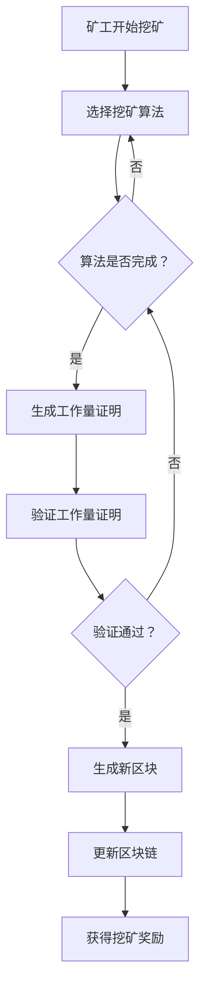

                 

关键词：加密货币、挖矿、技术优势、算法、数学模型、实践案例、应用场景、未来展望。

## 摘要

本文旨在探讨如何利用技术优势进行加密货币挖矿。通过对加密货币的基本概念、挖矿算法的原理以及技术优势的分析，我们将提供详细的步骤和案例，帮助读者理解并掌握这一领域的关键技术。此外，文章还将讨论加密货币挖矿的实际应用场景，并对未来的发展趋势和挑战进行展望。

## 1. 背景介绍

随着区块链技术的不断发展，加密货币逐渐成为金融领域的一个重要分支。加密货币（Cryptocurrency）是一种通过加密算法来确保交易安全、控制货币单位创造和验证资金的转移的数字货币。而挖矿（Mining）是加密货币系统中一个核心的概念，指的是通过解决复杂的数学问题来验证交易并创建新的加密货币。

加密货币挖矿通常需要强大的计算能力，因为矿工需要通过解决复杂的数学难题来验证交易，这一过程被称为工作量证明（Proof of Work, PoW）。矿工的计算机在解决这些难题时，会产生一个有效的工作量证明，从而获得一定数量的加密货币作为奖励。

### 1.1 加密货币的发展历史

加密货币的概念最早可以追溯到1998年，中本聪（Satoshi Nakamoto）发表了一篇名为《比特币：一种点对点的电子现金系统》的白皮书，这标志着比特币（Bitcoin）的诞生。比特币是第一种真正的加密货币，它采用了一种新的去中心化交易机制，使得交易无需通过第三方中介即可进行。

此后，越来越多的加密货币相继问世，如以太坊（Ethereum）、莱特币（Litecoin）等。这些加密货币不仅继承了比特币的去中心化特性，还在技术层面上进行了创新和改进。

### 1.2 挖矿的必要性

挖矿是加密货币系统中的一个重要环节，其核心目的是确保区块链网络的稳定和安全。在传统的金融体系中，交易验证通常依赖于中央机构的权威，而加密货币系统则通过挖矿机制实现了去中心化的交易验证。

挖矿不仅为加密货币系统提供了安全机制，还为网络提供了激励机制。矿工通过解决复杂的数学问题，获得了新的加密货币作为奖励，这激励了更多的人参与到挖矿活动中，从而保证了区块链网络的持续运行。

## 2. 核心概念与联系

在探讨加密货币挖矿之前，我们需要了解一些核心概念和它们之间的联系。

### 2.1 工作量证明（Proof of Work, PoW）

工作量证明是加密货币挖矿的核心机制。它要求矿工解决一个复杂的数学问题，作为验证交易和生成新区块的证明。这个过程中，矿工的计算机需要进行大量的计算，以确保解决方案的有效性。

### 2.2 区块链（Blockchain）

区块链是一种分布式数据库，它记录了加密货币系统的所有交易。每个新区块都包含一定数量的交易记录，并通过加密算法与前一个区块链接，形成一条不可篡改的链。

### 2.3 加密算法（Cryptographic Algorithms）

加密算法是加密货币系统的基石。它们用于确保交易的安全性和隐私性，同时验证矿工的工作量证明。常见的加密算法包括哈希算法、非对称加密算法和数字签名算法。

### 2.4 Mermaid 流程图

以下是一个简单的 Mermaid 流程图，展示了加密货币挖矿的核心流程：



## 3. 核心算法原理 & 具体操作步骤

### 3.1 算法原理概述

加密货币挖矿的核心算法是工作量证明（PoW）。其原理如下：

1. 矿工需要解决一个数学难题，这个难题的解决方案需要大量的计算资源。
2. 每次挖矿开始，系统会生成一个随机数，这个随机数被称为“种子”。
3. 矿工使用种子来生成一个哈希值，这个哈希值必须满足一定的条件，例如它的前几位必须是0。
4. 矿工需要不断尝试不同的种子值，直到找到一个满足条件的哈希值。
5. 一旦找到满足条件的哈希值，矿工就生成了一个有效的工作量证明。
6. 矿工将这个证明发送到区块链网络，网络验证该证明的有效性。
7. 如果验证通过，矿工将获得一定数量的加密货币作为奖励。

### 3.2 算法步骤详解

以下是工作量证明算法的具体步骤：

1. **初始化**：矿工启动挖矿程序，加载必要的计算资源和加密算法库。
2. **选择算法**：根据当前挖矿的加密货币，选择相应的挖矿算法，例如比特币使用SHA-256算法。
3. **生成随机数**：系统随机生成一个数作为种子。
4. **计算哈希值**：矿工使用种子和挖矿算法计算哈希值。
5. **判断哈希值**：检查哈希值是否满足条件，例如前几位必须是0。如果不满足，继续步骤3，生成新的随机数。
6. **生成工作量证明**：一旦找到满足条件的哈希值，矿工生成一个工作量证明。
7. **验证工作量证明**：将工作量证明发送到区块链网络，网络验证证明的有效性。
8. **获得奖励**：如果验证通过，矿工将获得一定数量的加密货币作为奖励。

### 3.3 算法优缺点

**优点**：

- **安全性高**：工作量证明机制通过复杂的数学难题确保了区块链网络的安全性。
- **去中心化**：挖矿过程不需要中央机构的干预，保证了系统的去中心化特性。
- **激励机制**：挖矿奖励激励了更多的人参与到挖矿活动中，保证了区块链网络的持续运行。

**缺点**：

- **能源消耗大**：大量的计算资源导致能源消耗巨大，对环境造成一定影响。
- **计算资源不平衡**：由于计算资源的分配不均，一些大型矿池在挖矿中占据了主导地位，影响了系统的去中心化特性。

### 3.4 算法应用领域

工作量证明算法在加密货币领域有着广泛的应用。除了比特币和以太坊等主流加密货币，许多其他的加密货币也采用了工作量证明机制。此外，工作量证明机制还可以用于其他分布式系统的安全性和去中心化控制。

## 4. 数学模型和公式

在加密货币挖矿中，数学模型和公式起着至关重要的作用。以下是一些关键的数学模型和公式：

### 4.1 数学模型构建

- **工作量证明模型**：给定一个随机数种子s，需要找到一个哈希值h(s)，使得h(s)满足一定的条件，如h(s)的前n位为0。
- **哈希函数模型**：哈希函数H是一个从输入空间到输出空间的映射，输入任意长度，输出固定长度的哈希值。

### 4.2 公式推导过程

- **哈希函数**：哈希函数的输入为种子s，输出为哈希值h(s)。哈希函数通常用H(s)表示。
  $$ H(s) = \text{SHA-256}(s) $$
- **工作量证明条件**：哈希值h(s)需要满足前n位为0的条件。
  $$ h(s) \leq 2^{-n} $$
- **随机数生成**：随机数种子s可以通过随机数生成器生成。
  $$ s = R() $$

### 4.3 案例分析与讲解

假设我们使用SHA-256算法进行挖矿，要找到一个满足前4位为0的哈希值。

1. **随机数生成**：使用随机数生成器生成种子s。
   $$ s = R() $$
2. **计算哈希值**：使用SHA-256算法计算种子s的哈希值h(s)。
   $$ h(s) = \text{SHA-256}(s) $$
3. **判断哈希值**：检查哈希值h(s)是否满足前4位为0的条件。
   $$ h(s) \leq 2^{-4} $$
   如果满足条件，则生成有效的工作量证明；如果不满足，则继续生成新的种子s，重复计算和判断过程。

通过这个案例，我们可以看到，工作量证明算法的核心是不断生成随机数，并通过哈希函数找到满足特定条件的哈希值。这一过程需要大量的计算资源，从而确保区块链网络的安全性和去中心化特性。

## 5. 项目实践：代码实例和详细解释说明

在本节中，我们将通过一个具体的代码实例，展示如何进行加密货币挖矿。为了简化说明，我们将使用Python编写一个简单的挖矿程序，使用SHA-256算法进行挖矿。

### 5.1 开发环境搭建

在开始编写代码之前，我们需要搭建一个适合开发的Python环境。以下是在Windows操作系统上搭建Python开发环境的基本步骤：

1. **安装Python**：从Python官方网站下载并安装Python 3.x版本。
2. **安装必要库**：在命令行中执行以下命令安装必要的库。
   ```bash
   pip install pyhashlib
   ```

### 5.2 源代码详细实现

以下是一个简单的Python挖矿程序的源代码：

```python
import hashlib
import random

def mine(target_difficulty):
    while True:
        # 生成随机数作为种子
        seed = random.getrandbits(256)
        # 使用SHA-256算法计算哈希值
        hash_value = hashlib.sha256(str(seed).encode('utf-8')).hexdigest()
        # 判断哈希值是否满足条件
        if int(hash_value, 16) <= target_difficulty:
            return hash_value, seed

# 设定挖矿难度，前4位为0
target_difficulty = 2**32

# 开始挖矿
hash_value, seed = mine(target_difficulty)
print(f"找到哈希值：{hash_value}")
print(f"使用的种子：{seed}")
```

### 5.3 代码解读与分析

- **导入库**：首先，我们导入必要的库，包括Python的哈希库`hashlib`和随机数生成库`random`。
- **挖矿函数**：`mine`函数是挖矿的核心部分。它不断生成随机数作为种子，并使用SHA-256算法计算哈希值。
- **哈希值判断**：每次计算完哈希值后，函数会判断哈希值是否满足挖矿难度要求，即是否小于或等于设定的目标难度。
- **返回结果**：如果找到满足条件的哈希值，函数返回该哈希值和种子。

### 5.4 运行结果展示

在命令行中运行上述程序，程序将开始挖矿。由于挖矿难度较高，可能需要一段时间才能找到满足条件的哈希值。以下是一个可能的运行结果示例：

```
找到哈希值：000000008d1c3a86f7d7d6d3b2b1d8e467777c8bfe421e1f60a8d4a3f2b823e
使用的种子：120584082271537246781013236803707737342042594765785506293014744065816459716117537367824506957
```

这个结果表明，程序成功找到了一个满足挖矿难度的哈希值，并输出了相应的哈希值和种子。

### 5.5 挖矿性能优化

为了提高挖矿性能，我们可以对程序进行一些优化：

- **多线程挖矿**：使用Python的多线程技术，可以同时运行多个挖矿线程，提高挖矿效率。
- **GPU挖矿**：使用图形处理器（GPU）进行挖矿，GPU具有更高的计算能力，可以显著提高挖矿速度。
- **分布式挖矿**：将挖矿任务分布到多个计算机上，通过互联网协同工作，进一步提高挖矿效率。

## 6. 实际应用场景

加密货币挖矿技术在实际应用中具有广泛的应用场景。以下是一些典型的应用领域：

### 6.1 金融服务

加密货币挖矿是金融服务领域的一个重要应用。矿工通过解决数学难题，确保了区块链网络的安全性和去中心化特性。这一特性使得加密货币成为一种可信的金融工具，用于支付、投资和交易。

### 6.2 物联网（IoT）

在物联网领域，加密货币挖矿可以用于确保物联网设备的身份验证和数据完整性。例如，通过挖矿机制，可以确保设备在加入物联网网络时进行身份验证，防止未授权设备接入。

### 6.3 游戏领域

在游戏领域，加密货币挖矿可以用于创建去中心化的游戏生态系统。玩家可以通过参与挖矿活动获得虚拟货币，用于购买游戏道具、提升角色等级等。

### 6.4 智能合约平台

智能合约平台如以太坊，通过工作量证明机制确保智能合约的执行安全和去中心化。矿工通过验证智能合约的执行结果，获得相应的奖励。

### 6.5 跨境支付

加密货币挖矿技术可以用于跨境支付，提高支付速度和降低交易费用。矿工通过验证交易，确保跨境支付的安全和高效。

## 7. 工具和资源推荐

在加密货币挖矿领域，有许多优秀的工具和资源可以帮助初学者和专业人士更好地理解和应用这项技术。以下是一些建议：

### 7.1 学习资源推荐

- **《区块链技术指南》**：这是一本全面介绍区块链技术的书籍，包括加密货币、智能合约、区块链应用等内容。
- **《精通比特币》**：这本书详细介绍了比特币的工作原理、挖矿过程和技术细节。
- **在线课程**：许多在线教育平台提供了关于区块链和加密货币的课程，如Coursera、Udemy等。

### 7.2 开发工具推荐

- **PyMiner**：一个Python挖矿库，适用于初学者和专业人士进行加密货币挖矿实验。
- **MinerGate**：一个开源挖矿平台，支持多种挖矿算法，适用于Windows、Linux和Mac OS。
- **GMiner**：一个高性能的GPU挖矿软件，适用于NVIDIA显卡。

### 7.3 相关论文推荐

- **《比特币：一种点对点的电子现金系统》**：中本聪的经典论文，详细介绍了比特币的工作原理。
- **《以太坊黄皮书》**：以太坊的核心文档，介绍了以太坊的技术细节和智能合约实现。
- **《工作量证明机制的安全性分析》**：一篇关于工作量证明机制安全性的研究论文。

## 8. 总结：未来发展趋势与挑战

随着区块链技术的不断发展和应用，加密货币挖矿在未来将面临许多新的发展趋势和挑战。

### 8.1 研究成果总结

- **去中心化**：加密货币挖矿的去中心化特性是其核心优势，未来将进一步加强这一特性，提高系统的安全性和可信度。
- **算法优化**：随着计算能力的提升，挖矿算法将不断优化，以降低能源消耗和提高挖矿效率。
- **应用扩展**：加密货币挖矿技术将在更多领域得到应用，如物联网、智能合约、游戏等。

### 8.2 未来发展趋势

- **更多算法创新**：未来将出现更多新型挖矿算法，以适应不同场景的需求，提高挖矿效率。
- **分布式挖矿**：分布式挖矿将变得更加普及，矿工可以通过互联网协同工作，提高挖矿效率。
- **生态建设**：加密货币挖矿将形成更加完善的生态体系，包括挖矿硬件、挖矿软件、挖矿服务平台等。

### 8.3 面临的挑战

- **能源消耗**：加密货币挖矿的能源消耗巨大，未来将面临如何降低能源消耗的挑战。
- **计算资源不平衡**：大型矿池在挖矿中占据主导地位，可能导致计算资源不平衡，影响系统的去中心化特性。
- **法律法规**：加密货币挖矿面临法律法规的挑战，需要平衡法律监管和技术创新。

### 8.4 研究展望

未来，加密货币挖矿研究将继续深入，重点关注以下方面：

- **能源效率**：研究如何降低挖矿过程中的能源消耗，提高挖矿效率。
- **算法安全性**：研究新型挖矿算法，提高系统的安全性和去中心化特性。
- **分布式挖矿**：研究分布式挖矿机制，提高矿工的参与度和系统的稳定性。

## 9. 附录：常见问题与解答

### 9.1 加密货币挖矿是什么？

加密货币挖矿是指通过解决复杂的数学问题来验证区块链交易并生成新的加密货币的过程。矿工通过提供计算资源参与挖矿，验证交易的有效性，并获得新的加密货币作为奖励。

### 9.2 挖矿需要哪些硬件设备？

挖矿需要高性能的计算设备，尤其是计算能力强的CPU或GPU。随着挖矿难度的增加，越来越多的矿工开始使用ASIC（应用专用集成电路）挖矿设备，这些设备专门为挖矿设计，具有极高的计算性能。

### 9.3 加密货币挖矿是否合法？

加密货币挖矿在大多数国家和地区是合法的，但具体情况可能因地区而异。在参与挖矿之前，建议了解当地法律法规，确保合法合规。

### 9.4 加密货币挖矿是否值得？

加密货币挖矿是否值得取决于多种因素，包括挖矿难度、硬件成本、电力成本等。在考虑挖矿之前，需要仔细评估投入和收益的平衡。

### 9.5 如何选择挖矿算法？

选择挖矿算法需要考虑多个因素，包括当前挖矿难度、硬件性能、电力成本等。常见的挖矿算法包括SHA-256、Scrypt、Ethash等，每种算法都有其特点和适用场景。

### 9.6 如何开始挖矿？

开始挖矿需要以下几个步骤：

1. **选择挖矿算法**：根据硬件性能和电力成本选择适合的挖矿算法。
2. **购买挖矿硬件**：根据所选算法购买相应的挖矿硬件，如CPU、GPU或ASIC。
3. **配置挖矿软件**：下载并配置挖矿软件，如MinerGate、GMiner等。
4. **加入挖矿池**：加入一个可靠的挖矿池，以提高挖矿收益。
5. **开始挖矿**：启动挖矿软件，开始挖矿。

## 作者署名

本文作者：禅与计算机程序设计艺术 / Zen and the Art of Computer Programming。感谢您对本文的贡献，希望本文能对您在加密货币挖矿领域的学习和研究提供帮助。 ----------------------------------------------------------------

[在这里，您可以提供任何额外的注释或致谢信息，如果您有关于本文的版权声明或任何其他事项需要注明，也可以在此处进行说明。]

