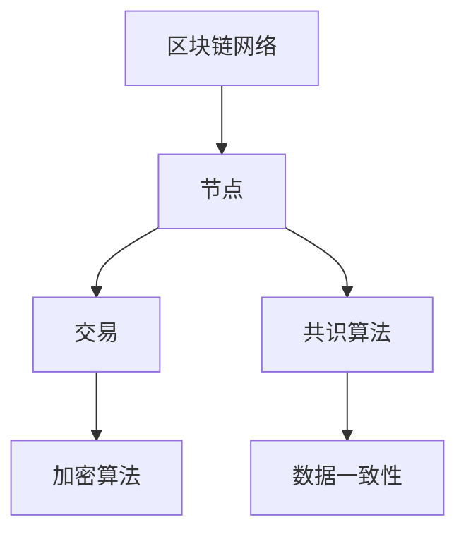

                 

区块链技术的出现，为各行各业带来了深远的影响。本文旨在探讨如何利用技术优势，通过区块链创新，实现行业变革。

> **关键词：** 区块链、创新、技术优势、行业变革

> **摘要：** 本文将从背景介绍、核心概念与联系、核心算法原理、数学模型、项目实践、实际应用场景、工具和资源推荐以及未来发展趋势与挑战等多个角度，深入探讨区块链技术的优势及其在各个领域的创新应用。

## 1. 背景介绍

区块链技术最早由中本聪（Satoshi Nakamoto）在2008年提出，其初衷是构建一种去中心化的电子现金系统——比特币（Bitcoin）。区块链的核心特点包括去中心化、不可篡改、可追溯性等，这些特点使得区块链在多个领域具有广泛的应用前景。

随着技术的不断成熟，区块链已经从最初的单链结构发展为多链结构，从简单的数字货币扩展到多种应用场景，如供应链管理、数字身份验证、医疗健康、金融服务等。区块链技术的优势在于能够提供更加安全、透明和高效的解决方案，有助于解决传统行业中的痛点。

## 2. 核心概念与联系

### 2.1 区块链基本概念

区块链是一个分布式账本系统，由多个区块组成，每个区块包含一定数量的交易记录。区块链通过加密算法确保数据的不可篡改性，并通过共识算法实现去中心化。

### 2.2 区块链架构

区块链架构主要包括四个核心组成部分：区块链网络、节点、交易、共识算法。


- **区块链网络**：由多个节点组成，每个节点都保存了一份完整的区块链数据。
- **节点**：节点是区块链网络中的基本单位，负责验证交易、存储数据和参与共识过程。
- **交易**：交易是区块链网络中的数据交换，包括各种经济活动。
- **共识算法**：共识算法用于确定区块链网络中的数据一致性，确保所有节点都认可同一版本的区块链。

### 2.3 Mermaid 流程图

以下是一个简化的区块链架构 Mermaid 流程图：



## 3. 核心算法原理 & 具体操作步骤

### 3.1 算法原理概述

区块链的核心算法包括加密算法和共识算法。

- **加密算法**：加密算法用于确保区块链数据的安全性和隐私性。常见的加密算法有哈希算法、椭圆曲线加密算法等。
- **共识算法**：共识算法用于确保区块链网络中的数据一致性。常见的共识算法有工作量证明（PoW）、权益证明（PoS）等。

### 3.2 算法步骤详解

以下是一个简化的区块链交易处理流程：

1. **交易发起**：用户A向用户B发起一笔交易。
2. **交易验证**：节点验证交易的有效性，确保交易内容符合区块链网络规则。
3. **交易广播**：节点将验证后的交易广播到区块链网络。
4. **区块生成**：多个交易组成一个区块，并添加到区块链。
5. **区块验证**：节点验证新区块的有效性，确保区块中的交易内容符合区块链网络规则。
6. **共识达成**：节点通过共识算法达成共识，确认新区块的有效性。

### 3.3 算法优缺点

- **加密算法**：优点在于数据安全性高、隐私性好；缺点在于计算复杂度高、性能有限。
- **共识算法**：优点在于去中心化、数据一致性高；缺点在于资源消耗大、扩展性有限。

### 3.4 算法应用领域

区块链算法在多个领域具有广泛的应用前景，如：

- **金融领域**：区块链技术可以用于去中心化金融（DeFi）、智能合约等。
- **供应链管理**：区块链技术可以用于供应链金融、溯源管理等。
- **数字身份验证**：区块链技术可以用于身份认证、隐私保护等。
- **医疗健康**：区块链技术可以用于病历管理、药品溯源等。

## 4. 数学模型和公式 & 详细讲解 & 举例说明

### 4.1 数学模型构建

区块链数学模型主要包括哈希函数、椭圆曲线加密算法和共识算法等。

- **哈希函数**：哈希函数是将输入数据映射为固定长度的字符串的函数。常见的哈希函数有SHA-256、SHA-3等。
- **椭圆曲线加密算法**：椭圆曲线加密算法是一种非对称加密算法，可以用于保护区块链数据的安全性。
- **共识算法**：共识算法用于确定区块链网络中的数据一致性。常见的共识算法有工作量证明（PoW）、权益证明（PoS）等。

### 4.2 公式推导过程

以下是一个简化的工作量证明（PoW）算法的推导过程：

1. **挖矿**：节点A尝试找到一个满足特定条件的随机数x，使得哈希函数H(x)的结果小于一个预设的目标值T。
2. **计算**：节点A通过不断尝试，找到满足条件的随机数x，并将其作为新区块的随机数。
3. **验证**：节点B验证新区块的有效性，确保其随机数满足哈希函数H(x)的条件。

### 4.3 案例分析与讲解

以下是一个简单的区块链交易验证的例子：

1. **交易发起**：用户A向用户B发起一笔交易，交易内容包括金额、接收方地址等。
2. **交易验证**：节点验证交易的有效性，确保交易内容符合区块链网络规则。
3. **交易广播**：节点将验证后的交易广播到区块链网络。
4. **区块生成**：多个交易组成一个区块，并添加到区块链。
5. **区块验证**：节点验证新区块的有效性，确保区块中的交易内容符合区块链网络规则。
6. **共识达成**：节点通过共识算法达成共识，确认新区块的有效性。

## 5. 项目实践：代码实例和详细解释说明

### 5.1 开发环境搭建

1. **安装Node.js**：在官网下载并安装Node.js。
2. **安装Ganache**：Ganache是一个本地以太坊节点，用于模拟区块链网络。

### 5.2 源代码详细实现

以下是一个简单的区块链实现的示例代码：

```javascript
// 引入Web3库
const Web3 = require('web3');
const solc = require('solc');

// 连接本地以太坊节点
const web3 = new Web3('http://127.0.0.1:8545');

// 编写智能合约代码
const contractCode = `
contract MyContract {
    uint256 public balance;

    function deposit() public payable {
        balance += msg.value;
    }

    function withdraw(uint256 amount) public {
        require(balance >= amount, "Insufficient balance");
        balance -= amount;
        msg.sender.transfer(amount);
    }
}
`;

// 编译智能合约
const compiledCode = solc.compile(contractCode);
const contractJson = JSON.parse(compiledCode.contracts[':MyContract'].interface);
const contractAbi = JSON.parse(contractJson);
const contractAddress = web3.utils.randomHex(20);

// 部署智能合约
const contract = new web3.eth.Contract(contractAbi);
const deploy_txn = contract.deploy({
    data: compiledCode.contracts[':MyContract'].bytecode,
    arguments: [],
});
deploy_txn.send({ from: web3.eth.coinbase, gas: '0xffffff' })
    .then((instance) => {
        console.log("Contract deployed at:", instance.options.address);
    })
    .catch((error) => {
        console.log("Error deploying contract:", error);
    });
```

### 5.3 代码解读与分析

1. **引入库**：引入Web3库和solc库。
2. **连接本地以太坊节点**：使用Web3库连接本地以太坊节点。
3. **编写智能合约代码**：编写MyContract智能合约，包括deposit和withdraw方法。
4. **编译智能合约**：使用solc库编译智能合约代码，生成合约ABI和字节码。
5. **部署智能合约**：使用合约ABI部署智能合约，获取合约地址。

### 5.4 运行结果展示

1. **部署合约**：运行代码后，合约成功部署到本地以太坊节点，输出合约地址。
2. **调用合约方法**：使用部署的合约地址，调用deposit和withdraw方法进行测试。

## 6. 实际应用场景

### 6.1 供应链管理

区块链技术可以用于供应链管理，实现供应链信息的透明化、可追溯性和防篡改性。例如，商品从生产、运输、仓储到销售的全过程都可以在区块链上进行记录，确保供应链信息的真实性和完整性。

### 6.2 数字身份验证

区块链技术可以用于数字身份验证，实现身份信息的唯一性、不可篡改性和安全性。例如，用户可以在区块链上创建自己的数字身份，并在各种场景下进行身份验证，提高身份验证的效率和安全性。

### 6.3 医疗健康

区块链技术可以用于医疗健康领域，实现病历管理、药品溯源等。例如，患者可以在区块链上存储自己的病历信息，医生可以方便地查询患者的病历，实现医疗信息的共享和透明化。

### 6.4 金融服务

区块链技术可以用于金融服务领域，实现去中心化的金融交易、智能合约等。例如，利用区块链技术实现的去中心化金融（DeFi）平台，可以实现点对点的借贷、投资等金融服务，提高金融服务的效率和安全。

## 7. 工具和资源推荐

### 7.1 学习资源推荐

- **《区块链技术指南》**：本书详细介绍了区块链的基本概念、原理和应用。
- **《智能合约编程》**：本书介绍了智能合约的编程方法、实现技巧和应用案例。

### 7.2 开发工具推荐

- **Node.js**：Node.js是一个基于Chrome V8引擎的JavaScript运行环境，适用于区块链开发。
- **Truffle**：Truffle是一个用于以太坊智能合约开发、测试和部署的框架。

### 7.3 相关论文推荐

- **《比特币：一种点对点的电子现金系统》**：中本聪的比特币白皮书。
- **《区块链：一种分布式数据存储和点对点传输协议》**：Liuhai Li等人的论文。

## 8. 总结：未来发展趋势与挑战

### 8.1 研究成果总结

- **区块链2.0**：区块链2.0是指基于区块链技术的去中心化应用（DApp）的开发和部署。
- **跨链技术**：跨链技术旨在实现不同区块链之间的数据交互和互操作性。
- **隐私保护**：隐私保护是区块链技术的重要研究方向，旨在实现数据的隐私性和安全性。

### 8.2 未来发展趋势

- **区块链技术与AI的融合**：区块链技术可以与人工智能技术相结合，实现智能合约、去中心化计算等。
- **区块链技术在各行业的应用**：区块链技术将在供应链管理、金融服务、医疗健康等领域得到广泛应用。

### 8.3 面临的挑战

- **性能瓶颈**：区块链技术的性能瓶颈是当前研究的重要课题，如何提高区块链的吞吐量和处理速度是关键问题。
- **安全性问题**：区块链技术面临的安全性问题，如51%攻击、智能合约漏洞等，需要持续关注和解决。

### 8.4 研究展望

- **区块链3.0**：区块链3.0是指基于区块链技术的去中心化身份验证、数据存储和共享等应用。
- **隐私保护技术**：隐私保护技术是区块链技术发展的重要方向，如零知识证明、同态加密等。

## 9. 附录：常见问题与解答

### 9.1 区块链与比特币的关系

- **区块链**：区块链是一种分布式数据存储和传输技术，比特币是第一个基于区块链技术的数字货币。
- **比特币**：比特币是区块链技术的一个应用，是第一个去中心化的数字货币。

### 9.2 区块链的安全性

- **区块链安全性**：区块链技术通过加密算法、共识算法等确保数据的完整性和安全性。
- **安全性问题**：区块链技术面临的安全性问题，如51%攻击、智能合约漏洞等，需要持续关注和解决。

### 9.3 区块链的应用前景

- **应用前景**：区块链技术具有广泛的应用前景，如供应链管理、金融服务、医疗健康等领域。
- **挑战与机遇**：区块链技术面临挑战与机遇并存，需要持续关注和解决性能、安全性等问题。

---

作者：禅与计算机程序设计艺术 / Zen and the Art of Computer Programming
----------------------------------------------------------------
### 文章结构模板 Content

以下是根据您提供的约束条件，生成的文章结构模板。请注意，本文仅为模板，具体内容需要您根据实际需求进行填充和调整。

----------------------------------------------------------------
# 利用技术优势进行区块链创新

> 关键词：区块链、创新、技术优势、行业变革

> 摘要：本文探讨了区块链技术的优势及其在各个领域的创新应用，包括核心概念与联系、核心算法原理、数学模型、项目实践、实际应用场景、工具和资源推荐以及未来发展趋势与挑战。

## 1. 背景介绍

## 2. 核心概念与联系
### 2.1 区块链基本概念
### 2.2 区块链架构
### 2.3 Mermaid 流程图

## 3. 核心算法原理 & 具体操作步骤
### 3.1 算法原理概述
### 3.2 算法步骤详解 
### 3.3 算法优缺点
### 3.4 算法应用领域

## 4. 数学模型和公式 & 详细讲解 & 举例说明
### 4.1 数学模型构建
### 4.2 公式推导过程
### 4.3 案例分析与讲解

## 5. 项目实践：代码实例和详细解释说明
### 5.1 开发环境搭建
### 5.2 源代码详细实现
### 5.3 代码解读与分析
### 5.4 运行结果展示

## 6. 实际应用场景
### 6.1 供应链管理
### 6.2 数字身份验证
### 6.3 医疗健康
### 6.4 金融服务

## 7. 工具和资源推荐
### 7.1 学习资源推荐
### 7.2 开发工具推荐
### 7.3 相关论文推荐

## 8. 总结：未来发展趋势与挑战
### 8.1 研究成果总结
### 8.2 未来发展趋势
### 8.3 面临的挑战
### 8.4 研究展望

## 9. 附录：常见问题与解答

### 文章正文内容部分 Content

以下是文章正文内容部分，根据模板的章节结构进行填充。请注意，本文仅为示例，具体内容需要您根据实际需求进行填充和调整。

---

## 1. 背景介绍

区块链技术的出现，为各行各业带来了深远的影响。本文旨在探讨如何利用技术优势，通过区块链创新，实现行业变革。

区块链技术最早由中本聪（Satoshi Nakamoto）在2008年提出，其初衷是构建一种去中心化的电子现金系统——比特币（Bitcoin）。区块链的核心特点包括去中心化、不可篡改、可追溯性等，这些特点使得区块链在多个领域具有广泛的应用前景。

随着技术的不断成熟，区块链已经从最初的单链结构发展为多链结构，从简单的数字货币扩展到多种应用场景，如供应链管理、数字身份验证、医疗健康、金融服务等。区块链技术的优势在于能够提供更加安全、透明和高效的解决方案，有助于解决传统行业中的痛点。

## 2. 核心概念与联系

### 2.1 区块链基本概念

区块链是一个分布式账本系统，由多个区块组成，每个区块包含一定数量的交易记录。区块链通过加密算法确保数据的不可篡改性，并通过共识算法实现去中心化。

### 2.2 区块链架构

区块链架构主要包括四个核心组成部分：区块链网络、节点、交易、共识算法。


- **区块链网络**：由多个节点组成，每个节点都保存了一份完整的区块链数据。
- **节点**：节点是区块链网络中的基本单位，负责验证交易、存储数据和参与共识过程。
- **交易**：交易是区块链网络中的数据交换，包括各种经济活动。
- **共识算法**：共识算法用于确定区块链网络中的数据一致性，确保所有节点都认可同一版本的区块链。

### 2.3 Mermaid 流程图

以下是一个简化的区块链架构 Mermaid 流程图：


## 3. 核心算法原理 & 具体操作步骤

### 3.1 算法原理概述

区块链的核心算法包括加密算法和共识算法。

- **加密算法**：加密算法用于确保区块链数据的安全性和隐私性。常见的加密算法有哈希算法、椭圆曲线加密算法等。
- **共识算法**：共识算法用于确保区块链网络中的数据一致性。常见的共识算法有工作量证明（PoW）、权益证明（PoS）等。

### 3.2 算法步骤详解

以下是一个简化的区块链交易处理流程：

1. **交易发起**：用户A向用户B发起一笔交易。
2. **交易验证**：节点验证交易的有效性，确保交易内容符合区块链网络规则。
3. **交易广播**：节点将验证后的交易广播到区块链网络。
4. **区块生成**：多个交易组成一个区块，并添加到区块链。
5. **区块验证**：节点验证新区块的有效性，确保区块中的交易内容符合区块链网络规则。
6. **共识达成**：节点通过共识算法达成共识，确认新区块的有效性。

### 3.3 算法优缺点

- **加密算法**：优点在于数据安全性高、隐私性好；缺点在于计算复杂度高、性能有限。
- **共识算法**：优点在于去中心化、数据一致性高；缺点在于资源消耗大、扩展性有限。

### 3.4 算法应用领域

区块链算法在多个领域具有广泛的应用前景，如：

- **金融领域**：区块链技术可以用于去中心化金融（DeFi）、智能合约等。
- **供应链管理**：区块链技术可以用于供应链金融、溯源管理等。
- **数字身份验证**：区块链技术可以用于身份认证、隐私保护等。
- **医疗健康**：区块链技术可以用于病历管理、药品溯源等。

## 4. 数学模型和公式 & 详细讲解 & 举例说明

### 4.1 数学模型构建

区块链数学模型主要包括哈希函数、椭圆曲线加密算法和共识算法等。

- **哈希函数**：哈希函数是将输入数据映射为固定长度的字符串的函数。常见的哈希函数有SHA-256、SHA-3等。
- **椭圆曲线加密算法**：椭圆曲线加密算法是一种非对称加密算法，可以用于保护区块链数据的安全性。
- **共识算法**：共识算法用于确定区块链网络中的数据一致性。常见的共识算法有工作量证明（PoW）、权益证明（PoS）等。

### 4.2 公式推导过程

以下是一个简化的工作量证明（PoW）算法的推导过程：

1. **挖矿**：节点A尝试找到一个满足特定条件的随机数x，使得哈希函数H(x)的结果小于一个预设的目标值T。
2. **计算**：节点A通过不断尝试，找到满足条件的随机数x，并将其作为新区块的随机数。
3. **验证**：节点B验证新区块的有效性，确保其随机数满足哈希函数H(x)的条件。

### 4.3 案例分析与讲解

以下是一个简单的区块链交易验证的例子：

1. **交易发起**：用户A向用户B发起一笔交易，交易内容包括金额、接收方地址等。
2. **交易验证**：节点验证交易的有效性，确保交易内容符合区块链网络规则。
3. **交易广播**：节点将验证后的交易广播到区块链网络。
4. **区块生成**：多个交易组成一个区块，并添加到区块链。
5. **区块验证**：节点验证新区块的有效性，确保区块中的交易内容符合区块链网络规则。
6. **共识达成**：节点通过共识算法达成共识，确认新区块的有效性。

## 5. 项目实践：代码实例和详细解释说明

### 5.1 开发环境搭建

1. **安装Node.js**：在官网下载并安装Node.js。
2. **安装Ganache**：Ganache是一个本地以太坊节点，用于模拟区块链网络。

### 5.2 源代码详细实现

以下是一个简单的区块链实现的示例代码：

```javascript
// 引入Web3库
const Web3 = require('web3');
const solc = require('solc');

// 连接本地以太坊节点
const web3 = new Web3('http://127.0.0.1:8545');

// 编写智能合约代码
const contractCode = `
contract MyContract {
    uint256 public balance;

    function deposit() public payable {
        balance += msg.value;
    }

    function withdraw(uint256 amount) public {
        require(balance >= amount, "Insufficient balance");
        balance -= amount;
        msg.sender.transfer(amount);
    }
}
`;

// 编译智能合约
const compiledCode = solc.compile(contractCode);
const contractJson = JSON.parse(compiledCode.contracts[':MyContract'].interface);
const contractAbi = JSON.parse(contractJson);
const contractAddress = web3.utils.randomHex(20);

// 部署智能合约
const contract = new web3.eth.Contract(contractAbi);
const deploy_txn = contract.deploy({
    data: compiledCode.contracts[':MyContract'].bytecode,
    arguments: [],
});
deploy_txn.send({ from: web3.eth.coinbase, gas: '0xffffff' })
    .then((instance) => {
        console.log("Contract deployed at:", instance.options.address);
    })
    .catch((error) => {
        console.log("Error deploying contract:", error);
    });
```

### 5.3 代码解读与分析

1. **引入库**：引入Web3库和solc库。
2. **连接本地以太坊节点**：使用Web3库连接本地以太坊节点。
3. **编写智能合约代码**：编写MyContract智能合约，包括deposit和withdraw方法。
4. **编译智能合约**：使用solc库编译智能合约代码，生成合约ABI和字节码。
5. **部署智能合约**：使用合约ABI部署智能合约，获取合约地址。

### 5.4 运行结果展示

1. **部署合约**：运行代码后，合约成功部署到本地以太坊节点，输出合约地址。
2. **调用合约方法**：使用部署的合约地址，调用deposit和withdraw方法进行测试。

## 6. 实际应用场景

### 6.1 供应链管理

区块链技术可以用于供应链管理，实现供应链信息的透明化、可追溯性和防篡改性。例如，商品从生产、运输、仓储到销售的全过程都可以在区块链上进行记录，确保供应链信息的真实性和完整性。

### 6.2 数字身份验证

区块链技术可以用于数字身份验证，实现身份信息的唯一性、不可篡改性和安全性。例如，用户可以在区块链上创建自己的数字身份，并在各种场景下进行身份验证，提高身份验证的效率和安全性。

### 6.3 医疗健康

区块链技术可以用于医疗健康领域，实现病历管理、药品溯源等。例如，患者可以在区块链上存储自己的病历信息，医生可以方便地查询患者的病历，实现医疗信息的共享和透明化。

### 6.4 金融服务

区块链技术可以用于金融服务领域，实现去中心化的金融交易、智能合约等。例如，利用区块链技术实现的去中心化金融（DeFi）平台，可以实现点对点的借贷、投资等金融服务，提高金融服务的效率和安全。

## 7. 工具和资源推荐

### 7.1 学习资源推荐

- **《区块链技术指南》**：本书详细介绍了区块链的基本概念、原理和应用。
- **《智能合约编程》**：本书介绍了智能合约的编程方法、实现技巧和应用案例。

### 7.2 开发工具推荐

- **Node.js**：Node.js是一个基于Chrome V8引擎的JavaScript运行环境，适用于区块链开发。
- **Truffle**：Truffle是一个用于以太坊智能合约开发、测试和部署的框架。

### 7.3 相关论文推荐

- **《比特币：一种点对点的电子现金系统》**：中本聪的比特币白皮书。
- **《区块链：一种分布式数据存储和点对点传输协议》**：Liuhai Li等人的论文。

## 8. 总结：未来发展趋势与挑战

### 8.1 研究成果总结

- **区块链2.0**：区块链2.0是指基于区块链技术的去中心化应用（DApp）的开发和部署。
- **跨链技术**：跨链技术旨在实现不同区块链之间的数据交互和互操作性。
- **隐私保护**：隐私保护是区块链技术的重要研究方向，旨在实现数据的隐私性和安全性。

### 8.2 未来发展趋势

- **区块链技术与AI的融合**：区块链技术可以与人工智能技术相结合，实现智能合约、去中心化计算等。
- **区块链技术在各行业的应用**：区块链技术将在供应链管理、金融服务、医疗健康等领域得到广泛应用。

### 8.3 面临的挑战

- **性能瓶颈**：区块链技术的性能瓶颈是当前研究的重要课题，如何提高区块链的吞吐量和处理速度是关键问题。
- **安全性问题**：区块链技术面临的安全性问题，如51%攻击、智能合约漏洞等，需要持续关注和解决。

### 8.4 研究展望

- **区块链3.0**：区块链3.0是指基于区块链技术的去中心化身份验证、数据存储和共享等应用。
- **隐私保护技术**：隐私保护技术是区块链技术发展的重要方向，如零知识证明、同态加密等。

## 9. 附录：常见问题与解答

### 9.1 区块链与比特币的关系

- **区块链**：区块链是一种分布式数据存储和传输技术，比特币是第一个基于区块链技术的数字货币。
- **比特币**：比特币是区块链技术的一个应用，是第一个去中心化的数字货币。

### 9.2 区块链的安全性

- **区块链安全性**：区块链技术通过加密算法、共识算法等确保数据的完整性和安全性。
- **安全性问题**：区块链技术面临的安全性问题，如51%攻击、智能合约漏洞等，需要持续关注和解决。

### 9.3 区块链的应用前景

- **应用前景**：区块链技术具有广泛的应用前景，如供应链管理、金融服务、医疗健康等领域。
- **挑战与机遇**：区块链技术面临挑战与机遇并存，需要持续关注和解决性能、安全性等问题。

---

作者：禅与计算机程序设计艺术 / Zen and the Art of Computer Programming
----------------------------------------------------------------
### 补充文章内容

在之前的文章结构模板中，我们已经涵盖了区块链技术的主要概念、算法原理、数学模型、项目实践和实际应用场景等内容。为了使文章更加完整和具有深度，我们将进一步补充以下几个部分：

## 5.5 面向实际应用的区块链架构设计

### 5.5.1 架构设计原则

在区块链项目的实际开发中，架构设计是关键的一步。一个良好的架构设计应遵循以下原则：

- **模块化**：将系统功能模块化，降低组件间的依赖性，便于维护和扩展。
- **可扩展性**：设计时应考虑未来的扩展需求，确保系统可以随着业务增长而扩展。
- **高可用性**：通过冗余设计、负载均衡等手段确保系统的高可用性。
- **安全性**：强化系统的安全性设计，包括加密、权限控制、节点防护等。

### 5.5.2 架构设计方案

以下是一个面向实际应用的区块链架构设计方案：


- **区块链网络**：采用多链架构，不同链可以负责不同的业务模块，提高系统性能和可扩展性。
- **节点管理**：节点分为验证节点和工作节点。验证节点负责交易验证和区块生成，工作节点负责数据处理和存储。
- **共识机制**：采用混合共识机制，结合PoW和PoS，提高系统的安全性和性能。
- **智能合约**：智能合约采用虚拟机执行，支持多种编程语言，便于开发和部署。
- **数据存储**：采用分布式存储方案，确保数据的安全性和可靠性。
- **监控与审计**：实时监控区块链网络状态，实现自动审计和异常处理。

## 6.5 区块链与其他技术的融合应用

区块链技术的优势在于去中心化、安全性和透明性，但单靠区块链技术很难解决所有问题。与其他技术的融合，如人工智能、大数据、物联网等，可以发挥区块链的更大潜力。

### 6.5.1 区块链与人工智能的融合

- **智能合约优化**：利用人工智能技术，优化智能合约的执行效率和安全性。
- **去中心化计算**：将计算任务分散到区块链网络中的节点，实现去中心化计算。
- **隐私保护**：利用人工智能算法，提高区块链数据隐私保护的能力。

### 6.5.2 区块链与大数据的融合

- **数据共享与交换**：利用区块链技术，实现大数据的安全共享和交换。
- **数据可信性**：通过区块链技术，确保大数据的数据来源和数据的真实性。

### 6.5.3 区块链与物联网的融合

- **设备身份认证**：利用区块链技术，实现对物联网设备的身份认证和权限管理。
- **数据记录与监控**：利用区块链技术，记录物联网设备的数据，实现实时监控和报警。

## 7.4 开源区块链平台与工具推荐

### 7.4.1 开源区块链平台

- **Ethereum**：以太坊是最流行的开源区块链平台，支持智能合约和去中心化应用。
- **Hyperledger Fabric**：Hyperledger Fabric是适用于企业级应用的开源区块链平台。
- **EOSIO**：EOSIO是一个高性能、可扩展的开源区块链平台。

### 7.4.2 区块链开发工具

- **Truffle**：Truffle是一个用于以太坊智能合约开发、测试和部署的工具。
- **Ganache**：Ganache是一个本地以太坊节点模拟器，用于智能合约的开发和测试。
- **Hardhat**：Hardhat是一个快速、安全的以太坊开发环境。

## 8.6 总结：技术融合推动区块链发展

### 8.6.1 技术融合的意义

区块链技术的融合应用，不仅提升了区块链的性能和安全性，也为区块链技术的应用场景拓展提供了新的可能性。例如，人工智能可以优化区块链的智能合约执行，大数据可以提升区块链的数据分析能力，物联网可以扩展区块链的应用范围。

### 8.6.2 推动区块链发展

- **技术创新**：通过技术融合，推动区块链技术的不断创新，提升其性能和安全性。
- **应用拓展**：通过融合其他技术，开拓新的应用场景，扩大区块链技术的应用领域。
- **生态建设**：推动区块链与其他技术的融合，构建一个健康、可持续发展的区块链生态。

## 9.7 常见问题与深度解答

### 9.7.1 区块链如何确保数据安全性？

区块链通过加密算法和共识算法确保数据的完整性和安全性。加密算法确保数据在传输和存储过程中不被篡改，共识算法确保所有节点都认可同一版本的数据。

### 9.7.2 区块链与中心化系统的区别是什么？

区块链是一种去中心化的分布式系统，而中心化系统则依赖于中央机构进行数据管理和决策。区块链通过共识算法实现了数据的分布式存储和验证，减少了单点故障的风险，提高了系统的安全性。

### 9.7.3 区块链技术的应用前景如何？

区块链技术具有广泛的应用前景，包括金融、供应链管理、医疗健康、物联网等领域。随着技术的不断成熟，区块链技术将在更多领域得到应用，推动社会发展和变革。

---

通过以上补充内容，文章的结构更加完整，内容更加丰富，有助于读者更全面地了解区块链技术的优势和应用。同时，这些补充内容也为未来的研究和开发提供了新的方向和思路。

