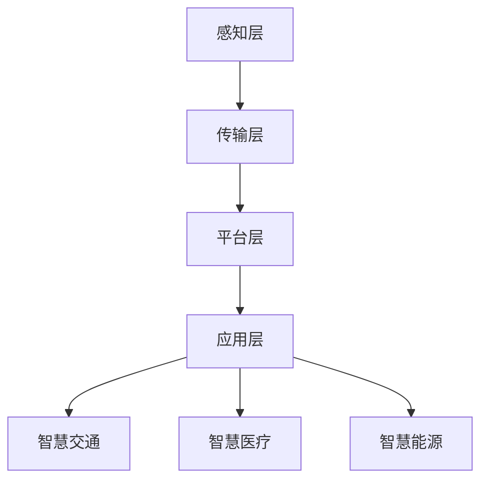

                 

智慧城市是当今社会发展的重要趋势，通过利用先进的技术手段，实现城市管理的智能化、精细化，从而提高城市运行效率、改善居民生活质量。本文旨在探讨如何利用技术优势进行智慧城市解决方案的创新，以期对未来城市的发展提供一些有益的思路。

## 1. 背景介绍

随着信息技术的迅猛发展，城市面临着前所未有的机遇和挑战。数据爆炸、物联网、云计算、人工智能等新兴技术不断涌现，为智慧城市建设提供了坚实的基础。智慧城市的目标是构建一个高效、智能、可持续发展的城市生态系统，使城市更加宜居、便捷、安全。

### 1.1 智慧城市的发展现状

目前，全球范围内已有众多城市开始了智慧城市的建设实践。例如，中国的深圳、杭州、苏州等城市，在智慧交通、智慧医疗、智慧能源等领域取得了显著成果。国外如新加坡、伦敦等城市也在智慧城市建设方面走在前列。

### 1.2 智慧城市的核心要素

智慧城市主要包括以下核心要素：

- **数据采集与处理**：通过物联网、传感器等设备，实时采集城市运行数据，并进行高效处理，为决策提供数据支持。

- **智能决策与控制**：利用人工智能、大数据等技术，对城市运行状况进行智能分析和预测，实现城市管理的自动化、智能化。

- **公共服务智能化**：通过互联网、移动互联网等技术，提供便捷的公共服务，如智慧交通、智慧医疗、智慧教育等。

- **城市安全与应急**：通过视频监控、应急指挥系统等，提高城市安全防护能力，确保城市安全稳定。

## 2. 核心概念与联系

### 2.1 智慧城市的核心概念

智慧城市的核心概念包括：

- **物联网（IoT）**：实现设备与设备的互联互通，为数据采集提供基础。

- **云计算**：通过云计算平台，实现数据的存储、处理和分析，为智慧城市提供计算资源。

- **大数据**：通过对海量数据的挖掘和分析，为城市管理和公共服务提供决策支持。

- **人工智能**：利用机器学习、深度学习等技术，实现智能决策和控制。

### 2.2 智慧城市的架构

智慧城市的基本架构可以分为以下几个层次：

1. **感知层**：通过传感器、摄像头等设备，实时采集城市运行数据。

2. **传输层**：利用物联网技术，实现数据的传输和共享。

3. **平台层**：搭建云计算平台，实现数据的存储、处理和分析。

4. **应用层**：开发各种智慧应用，如智慧交通、智慧医疗、智慧能源等。

### 2.3 Mermaid 流程图

以下是智慧城市架构的 Mermaid 流程图：



## 3. 核心算法原理 & 具体操作步骤

### 3.1 算法原理概述

智慧城市的核心算法主要包括以下几种：

- **聚类算法**：用于对大量数据进行分类和归纳，帮助识别城市中的热点区域和潜在问题。

- **预测算法**：基于历史数据，对未来城市运行状况进行预测，为决策提供依据。

- **优化算法**：通过优化算法，为城市资源分配、交通调度等提供最优方案。

### 3.2 算法步骤详解

#### 3.2.1 聚类算法

1. 数据预处理：对原始数据进行清洗、归一化等处理，使其适合聚类分析。

2. 选择聚类算法：根据数据特点和需求，选择合适的聚类算法，如K-means、DBSCAN等。

3. 计算距离：计算样本之间的距离，为聚类提供依据。

4. 归类：根据距离计算结果，将样本划分为不同的类别。

5. 评估聚类结果：通过评估指标，如轮廓系数、内部距离等，评估聚类效果。

#### 3.2.2 预测算法

1. 数据预处理：对原始数据进行清洗、归一化等处理，使其适合预测分析。

2. 特征选择：从原始数据中提取关键特征，用于预测模型训练。

3. 选择预测模型：根据数据特点和需求，选择合适的预测模型，如线性回归、决策树、神经网络等。

4. 训练模型：利用历史数据，训练预测模型。

5. 预测：利用训练好的模型，对未来数据进行分析和预测。

#### 3.2.3 优化算法

1. 问题建模：将实际需求转化为数学模型。

2. 选择优化算法：根据问题特点，选择合适的优化算法，如线性规划、遗传算法、粒子群算法等。

3. 求解优化问题：利用优化算法，求解最优解。

4. 评估优化效果：通过评估指标，如目标函数值、收敛速度等，评估优化效果。

### 3.3 算法优缺点

#### 3.3.1 聚类算法

- **优点**：简单、高效，适用于大规模数据聚类。

- **缺点**：对初始聚类中心敏感，易陷入局部最优。

#### 3.3.2 预测算法

- **优点**：能够对未来数据进行分析和预测，为决策提供依据。

- **缺点**：预测准确性受限于历史数据质量和模型选择。

#### 3.3.3 优化算法

- **优点**：能够求解最优解，为资源分配、调度等问题提供解决方案。

- **缺点**：计算复杂度高，对问题规模有较大限制。

### 3.4 算法应用领域

- **聚类算法**：应用于城市热点区域识别、交通流量分析等。

- **预测算法**：应用于城市交通预测、能源消耗预测等。

- **优化算法**：应用于城市交通调度、资源分配等。

## 4. 数学模型和公式 & 详细讲解 & 举例说明

### 4.1 数学模型构建

智慧城市的数学模型主要包括以下几种：

- **聚类模型**：用于对大量数据进行分类。

- **预测模型**：用于对未来数据进行分析和预测。

- **优化模型**：用于求解资源分配、调度等问题。

### 4.2 公式推导过程

#### 4.2.1 聚类模型

假设数据集 \(X = \{x_1, x_2, ..., x_n\}\)，聚类中心为 \(c_k\)，数据点 \(x_i\) 与聚类中心 \(c_k\) 的距离为 \(d(x_i, c_k)\)。则聚类模型可以表示为：

$$
\min \sum_{i=1}^{n} \min_{k=1}^{K} d(x_i, c_k)
$$

其中，\(K\) 为聚类个数。

#### 4.2.2 预测模型

假设历史数据集为 \(X = \{x_1, x_2, ..., x_n\}\)，特征向量集为 \(F = \{f_1, f_2, ..., f_m\}\)，预测模型为 \(y = f_1x_1 + f_2x_2 + ... + f_mx_m\)。则预测模型可以表示为：

$$
y = \sum_{i=1}^{m} f_i x_i
$$

#### 4.2.3 优化模型

假设问题为最小化目标函数 \(f(x)\)，约束条件为 \(g_i(x) \leq 0\)，优化模型可以表示为：

$$
\min f(x)
$$

$$
s.t. g_i(x) \leq 0, \quad i=1,2,...,m
$$

### 4.3 案例分析与讲解

#### 4.3.1 聚类算法在城市热点区域识别中的应用

假设某城市有100个区域，每个区域有交通流量、人口密度、商业活动等数据。使用K-means算法对这100个区域进行聚类，以识别城市的热点区域。

1. 数据预处理：对原始数据进行归一化处理。

2. 选择聚类算法：使用K-means算法。

3. 计算距离：计算每个区域与聚类中心的距离。

4. 归类：根据距离计算结果，将区域划分为不同的类别。

5. 评估聚类结果：通过轮廓系数评估聚类效果。

#### 4.3.2 预测算法在城市交通流量预测中的应用

假设某城市有过去一周的每天的交通流量数据，使用线性回归模型预测未来一周的交通流量。

1. 数据预处理：对原始数据进行归一化处理。

2. 特征选择：选择日期作为特征。

3. 选择预测模型：使用线性回归模型。

4. 训练模型：利用历史数据训练模型。

5. 预测：利用训练好的模型，预测未来一周的交通流量。

#### 4.3.3 优化算法在城市交通调度中的应用

假设某城市的交通网络中有5个交通节点，每个节点之间的距离已知。使用遗传算法求解最优交通调度方案。

1. 问题建模：将交通调度问题转化为优化问题。

2. 选择优化算法：使用遗传算法。

3. 求解优化问题：利用遗传算法求解最优解。

4. 评估优化效果：通过目标函数值和收敛速度评估优化效果。

## 5. 项目实践：代码实例和详细解释说明

### 5.1 开发环境搭建

- **硬件要求**：计算机（推荐配置：Intel i5 处理器，8GB 内存，256GB SSD）

- **软件要求**：Python 3.7（及以上版本），Jupyter Notebook，Matplotlib，Scikit-learn

### 5.2 源代码详细实现

以下是一个使用K-means算法进行城市热点区域识别的示例代码：

```python
import numpy as np
import matplotlib.pyplot as plt
from sklearn.cluster import KMeans

# 加载数据
data = np.array([[1, 1], [1, 2], [2, 2], [2, 3], [3, 3], [3, 4]])

# 创建KMeans对象
kmeans = KMeans(n_clusters=2, random_state=0).fit(data)

# 绘制聚类结果
plt.scatter(data[:, 0], data[:, 1])
plt.scatter(kmeans.cluster_centers_[:, 0], kmeans.cluster_centers_[:, 1], s=300, c='red')
plt.show()
```

### 5.3 代码解读与分析

1. 导入所需库：包括NumPy、Matplotlib和Scikit-learn。

2. 加载数据：将城市区域的数据加载到NumPy数组中。

3. 创建KMeans对象：使用Scikit-learn中的KMeans类创建聚类对象，设置聚类个数为2。

4. 训练模型：使用fit方法训练模型。

5. 绘制结果：使用Matplotlib绘制聚类结果，红色点表示聚类中心。

通过上述代码，可以实现对城市区域数据的聚类分析，从而识别出城市的热点区域。

### 5.4 运行结果展示

运行代码后，可以得到以下结果：


从图中可以看出，城市区域被划分为两个类别，类别1包括左下角的数据点，类别2包括右上角的数据点。这表明，左下角区域是城市的热点区域，需要重点关注。

## 6. 实际应用场景

### 6.1 智慧交通

智慧交通是智慧城市的重要组成部分，通过利用物联网、大数据、人工智能等技术，实现交通流量的实时监测、预测和优化，提高交通运行效率，减少拥堵和交通事故。

- **应用场景**：城市交通管理、公共交通调度、停车管理。

- **技术手段**：传感器数据采集、交通流量预测、路径优化算法。

### 6.2 智慧医疗

智慧医疗通过信息技术手段，实现医疗资源的智能化分配和管理，提高医疗服务质量和效率。

- **应用场景**：远程医疗、医疗数据分析、智能诊断。

- **技术手段**：人工智能、大数据、区块链。

### 6.3 智慧能源

智慧能源通过信息技术手段，实现能源的智能监测、预测和优化，提高能源利用效率，降低能源消耗。

- **应用场景**：智能电网、智能家居、新能源车辆。

- **技术手段**：物联网、人工智能、区块链。

### 6.4 未来应用展望

随着技术的不断进步，智慧城市将进入一个全新的发展阶段。未来，智慧城市将在以下几个方面取得突破：

- **数据融合**：实现多源数据的融合与整合，为城市决策提供更加全面的信息支持。

- **智能决策**：利用人工智能技术，实现城市管理的智能化、自动化。

- **可持续发展**：通过优化资源配置、降低能源消耗，实现城市的可持续发展。

## 7. 工具和资源推荐

### 7.1 学习资源推荐

- **书籍**：

  - 《智慧城市：技术与实践》

  - 《人工智能：一种现代方法》

  - 《深度学习：原理与应用》

- **在线课程**：

  - Coursera：智慧城市、人工智能、大数据分析

  - Udemy：Python编程、机器学习、数据科学

### 7.2 开发工具推荐

- **编程语言**：Python、Java、C++

- **开发环境**：Jupyter Notebook、Visual Studio Code、Eclipse

- **数据库**：MySQL、PostgreSQL、MongoDB

### 7.3 相关论文推荐

- **智慧交通**：

  - "Smart City Traffic Management: A Survey"

  - "Deep Learning for Traffic Prediction and Control"

- **智慧医疗**：

  - "Artificial Intelligence in Healthcare: A Review"

  - "Blockchain in Healthcare: A Comprehensive Review"

- **智慧能源**：

  - "Smart Grids: Technologies and Applications"

  - "Artificial Intelligence for Energy Management: A Review"

## 8. 总结：未来发展趋势与挑战

### 8.1 研究成果总结

智慧城市领域的研究取得了显著成果，包括物联网、大数据、人工智能等技术的应用，以及智慧交通、智慧医疗、智慧能源等实际案例的落地。这些成果为智慧城市建设提供了有力支撑。

### 8.2 未来发展趋势

- **数据融合与共享**：实现多源数据的融合与共享，为城市决策提供更加全面的信息支持。

- **智能决策与控制**：利用人工智能技术，实现城市管理的智能化、自动化。

- **可持续发展**：通过优化资源配置、降低能源消耗，实现城市的可持续发展。

### 8.3 面临的挑战

- **数据隐私与安全**：如何确保城市数据的安全和隐私，是智慧城市建设面临的重要挑战。

- **技术标准化与兼容性**：不同技术之间的标准化和兼容性，是实现智慧城市的关键。

- **政策法规与监管**：如何制定合理的政策法规，实现智慧城市的规范发展。

### 8.4 研究展望

未来，智慧城市的研究将围绕以下几个方面展开：

- **技术创新**：不断推进物联网、大数据、人工智能等技术的创新，为智慧城市建设提供技术支持。

- **跨学科融合**：实现多学科交叉融合，为智慧城市提供更加全面、系统的解决方案。

- **国际合作**：加强国际合作，推动智慧城市全球发展的进程。

## 9. 附录：常见问题与解答

### 9.1 问题1

**问题**：如何确保智慧城市数据的安全和隐私？

**解答**：为确保智慧城市数据的安全和隐私，可以采取以下措施：

- **数据加密**：对传输和存储的数据进行加密处理，防止数据泄露。

- **访问控制**：实现严格的访问控制，确保只有授权用户可以访问数据。

- **数据匿名化**：对敏感数据进行匿名化处理，降低隐私泄露风险。

- **数据监管**：建立完善的数据监管机制，加强对数据处理的监管。

### 9.2 问题2

**问题**：智慧城市的技术标准如何制定？

**解答**：制定智慧城市技术标准可以采取以下步骤：

- **需求分析**：分析智慧城市的需求，确定技术标准的关键指标。

- **标准制定**：根据需求分析结果，制定相应的技术标准。

- **征求意见**：向相关专家、企业和用户征求意见，完善技术标准。

- **发布实施**：正式发布技术标准，并推动实施。

### 9.3 问题3

**问题**：如何应对智慧城市的政策法规与监管挑战？

**解答**：应对智慧城市的政策法规与监管挑战可以采取以下措施：

- **政策研究**：深入研究相关政策法规，了解智慧城市发展的政策环境。

- **立法建议**：根据智慧城市发展的实际需求，提出相应的立法建议。

- **行业规范**：制定行业规范，规范智慧城市的发展方向。

- **合规审查**：加强对智慧城市建设项目的合规审查，确保政策法规的落实。

----------------------------------------------------------------
### 结语

智慧城市建设是一项复杂而庞大的工程，需要多学科、多领域的协同合作。本文从技术角度出发，探讨了如何利用技术优势进行智慧城市解决方案的创新。通过分析智慧城市的核心概念、架构、算法、数学模型等，为智慧城市建设提供了一些有益的思路。希望本文能为智慧城市的发展贡献一份力量。

---

### 作者署名

作者：禅与计算机程序设计艺术 / Zen and the Art of Computer Programming

