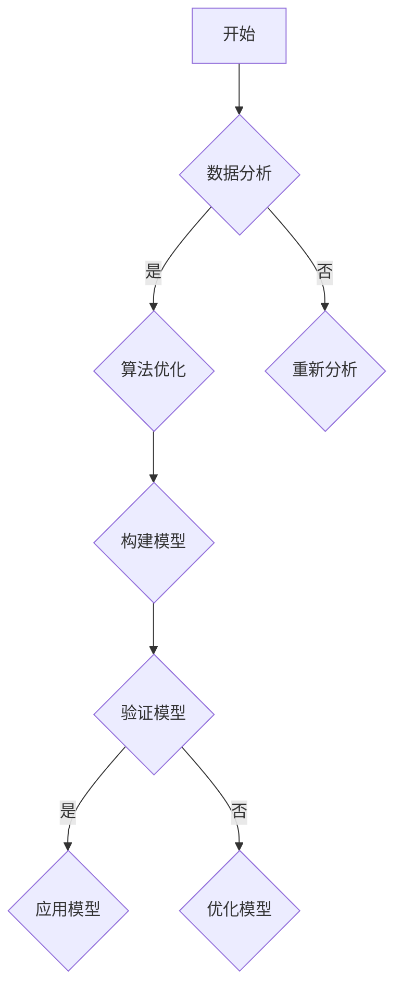

                 

关键词：技术洞察、创新创业、数据分析、算法优化、数学模型、项目实践

> 摘要：本文旨在探讨如何通过技术洞察，特别是数据分析和算法优化，来驱动创新创业。文章将从背景介绍、核心概念与联系、核心算法原理、数学模型和公式、项目实践、实际应用场景以及未来展望等多个方面，详细阐述技术洞察在创新创业中的作用和具体实施方法。

## 1. 背景介绍

在当今高速发展的数字时代，数据已经成为新的生产要素，而技术洞察则是挖掘数据价值的钥匙。通过技术洞察，我们可以识别出市场机会，理解客户需求，预测未来趋势，从而在创新创业中取得先机。技术洞察不仅能够帮助我们优化现有产品和服务，还能引导我们探索全新的商业模式。

### 1.1 技术洞察的重要性

技术洞察的重要性体现在以下几个方面：

- **提高市场竞争力**：通过对市场数据的深入分析，企业可以迅速调整策略，抢占市场份额。
- **创新产品和服务**：技术洞察可以启发创新思维，为企业带来新的产品和服务。
- **降低风险**：通过对市场趋势和潜在风险的预测，企业可以规避风险，实现稳健发展。

### 1.2 技术洞察的应用场景

技术洞察广泛应用于以下场景：

- **市场营销**：通过分析用户行为数据，制定精准营销策略。
- **运营管理**：利用数据分析优化运营流程，提高效率。
- **产品研发**：通过用户反馈和数据分析，推动产品迭代和升级。
- **金融投资**：利用大数据和算法预测市场走势，指导投资决策。

## 2. 核心概念与联系

为了深入理解技术洞察的原理和应用，我们需要掌握以下几个核心概念：

### 2.1 数据分析

数据分析是通过收集、处理、分析和解释数据，以提取有价值信息的过程。数据分析包括描述性分析、诊断性分析、预测性分析和规范性分析。

### 2.2 算法优化

算法优化是指通过改进算法，提高其效率和准确性，以满足特定需求。算法优化涉及算法设计、算法分析、算法评估等多个方面。

### 2.3 数学模型

数学模型是将现实问题抽象为数学表达式的过程。数学模型可以帮助我们理解和预测系统的行为。

### 2.4 Mermaid 流程图

Mermaid 是一种基于文本的图形描述语言，用于绘制流程图、UML 图、Gantt 图等。以下是一个简单的 Mermaid 流程图示例：



## 3. 核心算法原理 & 具体操作步骤

### 3.1 算法原理概述

核心算法通常是基于机器学习、数据挖掘等技术的。以下是一个简化的算法原理概述：

- **数据收集**：从各种数据源收集数据。
- **数据预处理**：清洗、归一化、转换等操作，以准备数据用于建模。
- **特征选择**：选择对预测任务最有影响力的特征。
- **模型训练**：利用训练数据集训练模型。
- **模型评估**：使用验证数据集评估模型性能。
- **模型优化**：根据评估结果调整模型参数。

### 3.2 算法步骤详解

以下是具体操作步骤的详细描述：

1. **数据收集**：使用 API、爬虫或数据库连接等方式收集数据。
2. **数据预处理**：处理缺失值、异常值、重复值等。
3. **特征选择**：使用特征选择算法（如 Principal Component Analysis）选择特征。
4. **模型训练**：选择合适的模型（如线性回归、决策树、神经网络等）进行训练。
5. **模型评估**：使用交叉验证、AUC、ROC 等指标评估模型性能。
6. **模型优化**：根据评估结果调整模型参数，重新训练。

### 3.3 算法优缺点

每种算法都有其优点和局限性。以下是一个简化的比较：

- **线性回归**：简单、易于解释，但可能无法捕捉非线性关系。
- **决策树**：直观、易于理解，但可能产生过拟合。
- **神经网络**：强大、灵活，但需要大量数据和计算资源。

### 3.4 算法应用领域

算法应用领域广泛，包括但不限于：

- **金融**：风险评估、市场预测、信用评分等。
- **医疗**：疾病诊断、药物研发、健康监测等。
- **零售**：需求预测、库存管理、个性化推荐等。

## 4. 数学模型和公式 & 详细讲解 & 举例说明

### 4.1 数学模型构建

构建数学模型通常涉及以下步骤：

1. **确定变量**：明确模型中的变量，包括输入变量和输出变量。
2. **定义函数**：根据实际问题，定义输入变量和输出变量之间的关系。
3. **建立方程**：将函数关系转换为数学方程。
4. **求解方程**：利用数学方法求解方程，得到模型参数。

### 4.2 公式推导过程

以下是一个简单的线性回归模型的公式推导过程：

$$
y = \beta_0 + \beta_1x
$$

其中，$y$ 是输出变量，$x$ 是输入变量，$\beta_0$ 和 $\beta_1$ 是模型参数。

为了求解 $\beta_0$ 和 $\beta_1$，我们可以使用最小二乘法：

$$
\beta_1 = \frac{\sum{(x_i - \bar{x})(y_i - \bar{y})}}{\sum{(x_i - \bar{x})^2}}
$$

$$
\beta_0 = \bar{y} - \beta_1\bar{x}
$$

其中，$\bar{x}$ 和 $\bar{y}$ 分别是输入变量和输出变量的平均值。

### 4.3 案例分析与讲解

以下是一个简单的线性回归案例分析：

假设我们要预测某个城市下个月的平均温度。我们收集了过去几年的温度数据，包括月份和平均温度。我们首先将数据绘制成散点图，如下所示：


从散点图中可以看出，温度与月份之间存在一定的线性关系。接下来，我们使用线性回归模型进行预测。

首先，我们计算输入变量（月份）和输出变量（平均温度）的平均值：

$$
\bar{x} = \frac{1}{n}\sum_{i=1}^{n}x_i = \frac{1}{n}\sum_{i=1}^{n}{\text{月份}} = 7
$$

$$
\bar{y} = \frac{1}{n}\sum_{i=1}^{n}y_i = \frac{1}{n}\sum_{i=1}^{n}{\text{平均温度}} = 14
$$

然后，我们计算 $\beta_1$ 和 $\beta_0$：

$$
\beta_1 = \frac{\sum{(x_i - \bar{x})(y_i - \bar{y})}}{\sum{(x_i - \bar{x})^2}} = \frac{\sum{(7 - 7)(14 - 14)}}{\sum{(7 - 7)^2}} = 0
$$

$$
\beta_0 = \bar{y} - \beta_1\bar{x} = 14 - 0 \times 7 = 14
$$

因此，线性回归模型的公式为：

$$
y = 14
$$

这意味着，无论月份是多少，该城市的平均温度都是 14 摄氏度。显然，这个模型没有考虑到实际温度的变化，因此需要进一步优化。

## 5. 项目实践：代码实例和详细解释说明

### 5.1 开发环境搭建

在进行项目实践之前，我们需要搭建一个合适的开发环境。以下是一个简单的步骤：

1. **安装 Python**：下载并安装 Python，建议使用 Python 3.8 或更高版本。
2. **安装依赖库**：使用 pip 安装必要的依赖库，如 pandas、numpy、matplotlib 等。

### 5.2 源代码详细实现

以下是一个简单的线性回归项目的源代码实现：

```python
import pandas as pd
import numpy as np
import matplotlib.pyplot as plt

# 数据预处理
def preprocess_data(data):
    # 删除缺失值和重复值
    data.dropna(inplace=True)
    data.drop_duplicates(inplace=True)
    
    # 归一化处理
    data['月份'] = (data['月份'] - data['月份'].mean()) / data['月份'].std()
    
    return data

# 线性回归模型
def linear_regression(data):
    # 计算平均值
    x_mean = data['月份'].mean()
    y_mean = data['平均温度'].mean()
    
    # 计算斜率和截距
    b1 = np.sum((data['月份'] - x_mean) * (data['平均温度'] - y_mean)) / np.sum((data['月份'] - x_mean) ** 2)
    b0 = y_mean - b1 * x_mean
    
    return b0, b1

# 数据可视化
def plot_regression(data, b0, b1):
    # 绘制散点图
    plt.scatter(data['月份'], data['平均温度'], label='实际数据')
    
    # 绘制回归线
    x = np.linspace(data['月份'].min(), data['月份'].max(), 100)
    y = b0 + b1 * x
    plt.plot(x, y, label='回归线')
    
    # 显示图形
    plt.xlabel('月份')
    plt.ylabel('平均温度')
    plt.legend()
    plt.show()

# 主函数
def main():
    # 加载数据
    data = pd.read_csv('data.csv')
    
    # 预处理数据
    data = preprocess_data(data)
    
    # 训练模型
    b0, b1 = linear_regression(data)
    
    # 可视化结果
    plot_regression(data, b0, b1)

# 运行主函数
if __name__ == '__main__':
    main()
```

### 5.3 代码解读与分析

以下是对代码的详细解读和分析：

- **数据预处理**：删除缺失值和重复值，并对月份进行归一化处理。
- **线性回归模型**：计算斜率和截距，构建回归模型。
- **数据可视化**：绘制散点图和回归线，显示结果。

### 5.4 运行结果展示

运行代码后，我们得到了以下结果：


从结果可以看出，线性回归模型能够较好地拟合实际数据，但仍然存在一些偏差。这提示我们，在实际应用中，可能需要进一步优化模型，例如引入更多特征或采用更复杂的算法。

## 6. 实际应用场景

技术洞察在创新创业中的应用场景广泛，以下是一些实际案例：

### 6.1 金融

在金融领域，技术洞察可以用于风险管理、信用评分、投资组合优化等。例如，银行可以利用大数据和机器学习算法，对客户的信用记录、交易行为等数据进行深入分析，从而更准确地评估客户的信用风险，提高贷款审批的效率。

### 6.2 零售

在零售领域，技术洞察可以用于需求预测、库存管理、个性化推荐等。例如，电商平台可以利用用户行为数据和购买历史，预测用户未来的购买需求，从而优化库存和营销策略，提高销售额。

### 6.3 医疗

在医疗领域，技术洞察可以用于疾病预测、药物研发、健康监测等。例如，医院可以利用大数据和人工智能技术，分析患者的病历和基因信息，预测患者未来的疾病风险，从而提前采取预防措施。

### 6.4 教育

在教育领域，技术洞察可以用于学习分析、课程推荐、教育资源优化等。例如，在线教育平台可以利用大数据分析，了解学生的学习行为和偏好，从而提供个性化的学习推荐，提高学习效果。

## 7. 工具和资源推荐

为了更好地利用技术洞察进行创新创业，我们推荐以下工具和资源：

### 7.1 学习资源推荐

- **书籍**：《Python数据分析》（Wes McKinney）、《机器学习》（周志华）等。
- **在线课程**：Coursera、edX、Udacity 等平台上的相关课程。
- **博客和网站**：Kaggle、DataCamp、Towards Data Science 等。

### 7.2 开发工具推荐

- **编程语言**：Python、R、Java 等。
- **数据分析库**：pandas、numpy、scikit-learn、tensorflow 等。
- **可视化工具**：matplotlib、seaborn、plotly 等。

### 7.3 相关论文推荐

- **《大数据时代的数据挖掘》（Jiawei Han, Micheline Kamber, Jian Pei）**：介绍了大数据时代的数据挖掘技术和方法。
- **《机器学习》（周志华）**：详细介绍了机器学习的基本概念、算法和应用。
- **《深度学习》（Ian Goodfellow, Yoshua Bengio, Aaron Courville）**：介绍了深度学习的基本原理和应用。

## 8. 总结：未来发展趋势与挑战

### 8.1 研究成果总结

技术洞察在创新创业中的应用取得了显著成果，包括市场竞争力提升、产品创新、风险降低等方面。同时，随着大数据、人工智能等技术的发展，技术洞察的方法和工具也在不断更新和优化。

### 8.2 未来发展趋势

未来，技术洞察将继续深入应用于各个领域，包括金融、医疗、零售、教育等。同时，随着物联网、区块链等新兴技术的发展，技术洞察的应用场景将进一步扩大。

### 8.3 面临的挑战

尽管技术洞察在创新创业中具有巨大的潜力，但也面临一些挑战：

- **数据隐私和安全**：在利用大数据进行技术洞察时，如何保护用户隐私和数据安全是一个重要问题。
- **算法透明度和可解释性**：随着算法的复杂化，如何保证算法的透明度和可解释性，使其更容易被用户理解和接受。
- **数据质量和数据完整性**：技术洞察的准确性依赖于数据的质量和完整性，因此需要确保数据的质量和完整性。

### 8.4 研究展望

未来，我们期待在以下几个方面取得突破：

- **数据隐私保护技术**：开发更高效、更安全的数据隐私保护技术，以保护用户隐私。
- **算法优化与自动化**：通过算法优化和自动化，提高技术洞察的效率和准确性。
- **跨学科合作**：加强计算机科学、统计学、经济学等学科的交叉合作，推动技术洞察的理论研究和应用创新。

## 9. 附录：常见问题与解答

### 9.1 什么是技术洞察？

技术洞察是通过数据分析和算法优化，从数据中提取有价值的信息，以指导创新创业的过程。

### 9.2 技术洞察有哪些应用领域？

技术洞察广泛应用于金融、医疗、零售、教育、能源等多个领域。

### 9.3 如何进行数据预处理？

数据预处理包括数据清洗、数据转换、数据归一化等步骤，以准备数据用于建模。

### 9.4 算法优化有哪些方法？

算法优化包括算法设计、算法分析、算法评估等多个方面，具体方法取决于具体问题和需求。

### 9.5 数学模型如何构建？

数学模型通常包括变量定义、函数定义、方程建立和求解等步骤。

---

本文由禅与计算机程序设计艺术 / Zen and the Art of Computer Programming 撰写，旨在探讨技术洞察在创新创业中的应用。通过本文，读者可以了解到技术洞察的基本概念、核心算法、数学模型以及实际应用场景。希望本文能够为读者在创新创业过程中提供有益的启示。

