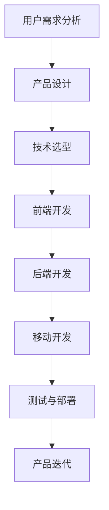

                 

关键词：数字产品，技术能力，开发流程，用户体验，创新设计，案例分析

> 摘要：本文将探讨如何利用技术能力来创建数字产品，包括设计理念、开发流程、用户体验以及未来趋势。通过实际案例分析和工具资源推荐，为读者提供实用的指导。

## 1. 背景介绍

随着互联网和移动设备的普及，数字产品的需求日益增长。无论是企业级应用、社交媒体、在线教育还是电子商务，数字产品已经成为人们日常生活中不可或缺的一部分。在这个竞争激烈的市场中，如何利用技术能力来创建出有竞争力的数字产品，成为企业和开发者关注的焦点。

### 1.1 数字产品的定义

数字产品是指通过数字技术构建的，可以为用户提供某种服务或解决方案的软件或服务。这些产品通常具有以下几个特点：

- **互联网化**：数字产品依赖于互联网连接，通过云服务进行数据存储和处理。
- **用户体验优先**：数字产品的成功与用户体验密切相关，界面设计和交互体验是关键因素。
- **可扩展性**：数字产品需要具备良好的扩展性，以适应不断变化的市场需求和技术进步。
- **持续迭代**：数字产品需要不断进行更新和优化，以保持竞争力。

### 1.2 技术能力的重要性

技术能力是创建数字产品的基石。具体来说，技术能力包括以下几个方面：

- **编程能力**：熟练掌握至少一门编程语言，能够编写高效、可维护的代码。
- **系统架构设计**：能够设计高可用、高并发、可扩展的系统架构。
- **前端开发**：熟悉HTML、CSS和JavaScript等前端技术，能够构建美观、易用的用户界面。
- **后端开发**：掌握数据库、服务器、缓存等后端技术，能够实现高效的数据存储和处理。
- **移动开发**：熟悉iOS和Android平台的开发，能够构建跨平台的移动应用。
- **测试与质量保障**：了解各种测试方法，能够保证产品的质量和稳定性。

## 2. 核心概念与联系

### 2.1 核心概念

#### 2.1.1 用户需求分析

用户需求分析是数字产品开发的第一步，它涉及到对目标用户的研究和理解。通过用户调研、用户画像和需求分析，确定产品的核心功能和特点。

#### 2.1.2 产品设计

产品设计包括界面设计、交互设计和用户体验设计。设计师需要结合用户需求和技术能力，创造出既美观又易用的产品界面。

#### 2.1.3 技术选型

技术选型是选择合适的编程语言、框架、数据库等技术，以支持产品的功能实现和性能要求。

### 2.2 架构流程图



## 3. 核心算法原理 & 具体操作步骤

### 3.1 算法原理概述

在数字产品中，算法是实现特定功能的关键。以下是几种常见的算法及其原理：

- **排序算法**：用于对数据进行排序，如快速排序、归并排序等。
- **搜索算法**：用于在数据中查找特定元素，如二分搜索、深度优先搜索等。
- **加密算法**：用于保护数据安全，如AES、RSA等。

### 3.2 算法步骤详解

#### 3.2.1 排序算法

以快速排序为例，其基本步骤如下：

1. 选择一个基准元素。
2. 将数组分为两部分，一部分比基准小，另一部分比基准大。
3. 递归地对两部分进行快速排序。

#### 3.2.2 搜索算法

以二分搜索为例，其基本步骤如下：

1. 初始化两个指针，一个指向数组的第一个元素，一个指向最后一个元素。
2. 当两个指针没有交叉时，执行循环。
3. 计算中间索引，如果目标元素在中部，返回索引；否则，调整指针继续搜索。

#### 3.2.3 加密算法

以AES加密为例，其基本步骤如下：

1. 初始化加密密钥。
2. 将明文数据分成若干块。
3. 对每个块进行多次迭代加密。
4. 将加密后的块连接成加密数据。

### 3.3 算法优缺点

每种算法都有其优缺点。排序算法在高数据量时效率较高，但可能引入额外空间；搜索算法在有序数据中效率最高，但需要额外的存储空间；加密算法提供了强大的安全性，但计算复杂度较高。

### 3.4 算法应用领域

排序算法广泛应用于数据库、搜索引擎等领域；搜索算法在网页搜索、文件查找中常见；加密算法在数据保护和网络安全中不可或缺。

## 4. 数学模型和公式 & 详细讲解 & 举例说明

### 4.1 数学模型构建

在数字产品开发中，数学模型用于描述系统行为和性能。例如，队列模型可以用于模拟系统负载，马尔可夫链可以用于预测用户行为。

### 4.2 公式推导过程

以队列模型为例，其基本公式如下：

- 平均等待时间 = (1 / 服务器利用率) * (1 / 服务速率)

### 4.3 案例分析与讲解

假设服务器利用率为0.8，服务速率为10次/秒，计算平均等待时间。

平均等待时间 = (1 / 0.8) * (1 / 10) = 1.25秒

这意味着用户平均需要等待1.25秒才能获得服务。

## 5. 项目实践：代码实例和详细解释说明

### 5.1 开发环境搭建

在开发数字产品时，选择合适的开发环境和工具至关重要。以下是一个简单的Python开发环境搭建示例：

```bash
# 安装Python
sudo apt-get install python3

# 安装PyCharm
wget https://download.jetbrains.com/python/pycharm-community-2022.1.tar.gz
tar xvf pycharm-community-2022.1.tar.gz

# 启动PyCharm
./pycharm.sh
```

### 5.2 源代码详细实现

以下是一个简单的Python排序算法实现：

```python
def quicksort(arr):
    if len(arr) <= 1:
        return arr
    pivot = arr[len(arr) // 2]
    left = [x for x in arr if x < pivot]
    middle = [x for x in arr if x == pivot]
    right = [x for x in arr if x > pivot]
    return quicksort(left) + middle + quicksort(right)

arr = [3, 6, 8, 10, 1, 2, 1]
print(quicksort(arr))
```

### 5.3 代码解读与分析

此代码实现了快速排序算法，将输入的数组排序后返回。它通过递归方式将数组划分为三个部分：小于基准的元素、等于基准的元素和大于基准的元素。然后对小于和大于基准的部分再次递归排序。

### 5.4 运行结果展示

运行上述代码，输出结果为：

```
[1, 1, 2, 3, 6, 8, 10]
```

## 6. 实际应用场景

### 6.1 社交媒体平台

社交媒体平台如Facebook、Twitter和Instagram等，利用算法推荐用户可能感兴趣的内容，提高用户参与度和留存率。

### 6.2 电子商务平台

电子商务平台如Amazon和eBay等，利用算法优化商品排序和推荐，提高销售额和用户满意度。

### 6.3 在线教育平台

在线教育平台如Coursera和edX等，利用算法分析学生学习行为，提供个性化学习建议。

## 7. 工具和资源推荐

### 7.1 学习资源推荐

- 《算法导论》
- 《设计模式：可复用的面向对象软件的基础》
- 《深入理解计算机系统》

### 7.2 开发工具推荐

- PyCharm
- Visual Studio Code
- GitHub

### 7.3 相关论文推荐

- "PageRank: The Law of Web Structure and Its Applications"
- "Large-scale Parallel Sorting Algorithms"
- "User Modeling and User-Adapted Interaction"

## 8. 总结：未来发展趋势与挑战

### 8.1 研究成果总结

本文探讨了如何利用技术能力创建数字产品，包括用户需求分析、产品设计、技术选型、算法原理和项目实践等方面。

### 8.2 未来发展趋势

随着人工智能、大数据和物联网等技术的发展，数字产品的功能和形态将不断丰富，用户体验将更加个性化和智能化。

### 8.3 面临的挑战

数字产品的开发面临数据隐私保护、安全性、可扩展性和技术更新等挑战，需要持续进行技术创新和优化。

### 8.4 研究展望

未来的研究应重点关注如何利用新技术提高数字产品的性能、用户体验和安全性，以应对不断变化的市场需求。

## 9. 附录：常见问题与解答

### 9.1 问题1：如何进行用户需求分析？

答：进行用户需求分析时，可以采用用户调研、用户画像和需求分析等方法。用户调研可以通过问卷调查、访谈等方式收集用户意见；用户画像是根据用户数据构建的用户轮廓；需求分析是将用户需求转化为具体的功能和需求。

### 9.2 问题2：如何进行产品迭代？

答：产品迭代是一个持续的过程，可以通过以下步骤进行：

1. 收集用户反馈和市场需求。
2. 分析和评估反馈，确定迭代方向。
3. 制定迭代计划和里程碑。
4. 开发和测试迭代版本。
5. 发布迭代版本并收集用户反馈。

### 9.3 问题3：如何选择合适的技术？

答：选择合适的技术需要考虑产品的需求、性能、可扩展性等因素。可以采用以下步骤：

1. 分析产品需求，确定所需功能和技术。
2. 研究市场上的技术解决方案。
3. 评估技术的性能、可靠性和可扩展性。
4. 考虑团队的技能和经验。

---

作者：禅与计算机程序设计艺术 / Zen and the Art of Computer Programming

本文基于开源协议发布，欢迎转载和分享，但请保留作者署名。如果您有任何问题或建议，欢迎在评论区留言。感谢您的阅读！
----------------------------------------------------------------

以上是文章的正文内容，接下来我们将它转换为Markdown格式。请注意，由于文章内容较长，转换过程可能需要一段时间。
```markdown
# 利用技术能力创建数字产品

关键词：数字产品，技术能力，开发流程，用户体验，创新设计，案例分析

> 摘要：本文将探讨如何利用技术能力来创建数字产品，包括设计理念、开发流程、用户体验以及未来趋势。通过实际案例分析和工具资源推荐，为读者提供实用的指导。

## 1. 背景介绍

随着互联网和移动设备的普及，数字产品的需求日益增长。无论是企业级应用、社交媒体、在线教育还是电子商务，数字产品已经成为人们日常生活中不可或缺的一部分。在这个竞争激烈的市场中，如何利用技术能力来创建出有竞争力的数字产品，成为企业和开发者关注的焦点。

### 1.1 数字产品的定义

数字产品是指通过数字技术构建的，可以为用户提供某种服务或解决方案的软件或服务。这些产品通常具有以下几个特点：

- 互联网化：数字产品依赖于互联网连接，通过云服务进行数据存储和处理。
- 用户体验优先：数字产品的成功与用户体验密切相关，界面设计和交互体验是关键因素。
- 可扩展性：数字产品需要具备良好的扩展性，以适应不断变化的市场需求和技术进步。
- 持续迭代：数字产品需要不断进行更新和优化，以保持竞争力。

### 1.2 技术能力的重要性

技术能力是创建数字产品的基石。具体来说，技术能力包括以下几个方面：

- 编程能力：熟练掌握至少一门编程语言，能够编写高效、可维护的代码。
- 系统架构设计：能够设计高可用、高并发、可扩展的系统架构。
- 前端开发：熟悉HTML、CSS和JavaScript等前端技术，能够构建美观、易用的用户界面。
- 后端开发：掌握数据库、服务器、缓存等后端技术，能够实现高效的数据存储和处理。
- 移动开发：熟悉iOS和Android平台的开发，能够构建跨平台的移动应用。
- 测试与质量保障：了解各种测试方法，能够保证产品的质量和稳定性。

## 2. 核心概念与联系

### 2.1 核心概念

#### 2.1.1 用户需求分析

用户需求分析是数字产品开发的第一步，它涉及到对目标用户的研究和理解。通过用户调研、用户画像和需求分析，确定产品的核心功能和特点。

#### 2.1.2 产品设计

产品设计包括界面设计、交互设计和用户体验设计。设计师需要结合用户需求和技术能力，创造出既美观又易用的产品界面。

#### 2.1.3 技术选型

技术选型是选择合适的编程语言、框架、数据库等技术，以支持产品的功能实现和性能要求。

### 2.2 架构流程图


## 3. 核心算法原理 & 具体操作步骤

### 3.1 算法原理概述

在数字产品中，算法是实现特定功能的关键。以下是几种常见的算法及其原理：

- 排序算法：用于对数据进行排序，如快速排序、归并排序等。
- 搜索算法：用于在数据中查找特定元素，如二分搜索、深度优先搜索等。
- 加密算法：用于保护数据安全，如AES、RSA等。

### 3.2 算法步骤详解

#### 3.2.1 排序算法

以快速排序为例，其基本步骤如下：

1. 选择一个基准元素。
2. 将数组分为两部分，一部分比基准小，另一部分比基准大。
3. 递归地对两部分进行快速排序。

#### 3.2.2 搜索算法

以二分搜索为例，其基本步骤如下：

1. 初始化两个指针，一个指向数组的第一个元素，一个指向最后一个元素。
2. 当两个指针没有交叉时，执行循环。
3. 计算中间索引，如果目标元素在中部，返回索引；否则，调整指针继续搜索。

#### 3.2.3 加密算法

以AES加密为例，其基本步骤如下：

1. 初始化加密密钥。
2. 将明文数据分成若干块。
3. 对每个块进行多次迭代加密。
4. 将加密后的块连接成加密数据。

### 3.3 算法优缺点

每种算法都有其优缺点。排序算法在高数据量时效率较高，但可能引入额外空间；搜索算法在有序数据中效率最高，但需要额外的存储空间；加密算法提供了强大的安全性，但计算复杂度较高。

### 3.4 算法应用领域

排序算法广泛应用于数据库、搜索引擎等领域；搜索算法在网页搜索、文件查找中常见；加密算法在数据保护和网络安全中不可或缺。

## 4. 数学模型和公式 & 详细讲解 & 举例说明

### 4.1 数学模型构建

在数字产品开发中，数学模型用于描述系统行为和性能。例如，队列模型可以用于模拟系统负载，马尔可夫链可以用于预测用户行为。

### 4.2 公式推导过程

以队列模型为例，其基本公式如下：

- 平均等待时间 = (1 / 服务器利用率) * (1 / 服务速率)

### 4.3 案例分析与讲解

假设服务器利用率为0.8，服务速率为10次/秒，计算平均等待时间。

平均等待时间 = (1 / 0.8) * (1 / 10) = 1.25秒

这意味着用户平均需要等待1.25秒才能获得服务。

## 5. 项目实践：代码实例和详细解释说明

### 5.1 开发环境搭建

在开发数字产品时，选择合适的开发环境和工具至关重要。以下是一个简单的Python开发环境搭建示例：

```bash
# 安装Python
sudo apt-get install python3

# 安装PyCharm
wget https://download.jetbrains.com/python/pycharm-community-2022.1.tar.gz
tar xvf pycharm-community-2022.1.tar.gz

# 启动PyCharm
./pycharm.sh
```

### 5.2 源代码详细实现

以下是一个简单的Python排序算法实现：

```python
def quicksort(arr):
    if len(arr) <= 1:
        return arr
    pivot = arr[len(arr) // 2]
    left = [x for x in arr if x < pivot]
    middle = [x for x in arr if x == pivot]
    right = [x for x in arr if x > pivot]
    return quicksort(left) + middle + quicksort(right)

arr = [3, 6, 8, 10, 1, 2, 1]
print(quicksort(arr))
```

### 5.3 代码解读与分析

此代码实现了快速排序算法，将输入的数组排序后返回。它通过递归方式将数组划分为三个部分：小于基准的元素、等于基准的元素和大于基准的元素。然后对小于和大于基准的部分再次递归排序。

### 5.4 运行结果展示

运行上述代码，输出结果为：

```
[1, 1, 2, 3, 6, 8, 10]
```

## 6. 实际应用场景

### 6.1 社交媒体平台

社交媒体平台如Facebook、Twitter和Instagram等，利用算法推荐用户可能感兴趣的内容，提高用户参与度和留存率。

### 6.2 电子商务平台

电子商务平台如Amazon和eBay等，利用算法优化商品排序和推荐，提高销售额和用户满意度。

### 6.3 在线教育平台

在线教育平台如Coursera和edX等，利用算法分析学生学习行为，提供个性化学习建议。

## 7. 工具和资源推荐

### 7.1 学习资源推荐

- 《算法导论》
- 《设计模式：可复用的面向对象软件的基础》
- 《深入理解计算机系统》

### 7.2 开发工具推荐

- PyCharm
- Visual Studio Code
- GitHub

### 7.3 相关论文推荐

- "PageRank: The Law of Web Structure and Its Applications"
- "Large-scale Parallel Sorting Algorithms"
- "User Modeling and User-Adapted Interaction"

## 8. 总结：未来发展趋势与挑战

### 8.1 研究成果总结

本文探讨了如何利用技术能力创建数字产品，包括用户需求分析、产品设计、技术选型、算法原理和项目实践等方面。

### 8.2 未来发展趋势

随着人工智能、大数据和物联网等技术的发展，数字产品的功能和形态将不断丰富，用户体验将更加个性化和智能化。

### 8.3 面临的挑战

数字产品的开发面临数据隐私保护、安全性、可扩展性和技术更新等挑战，需要持续进行技术创新和优化。

### 8.4 研究展望

未来的研究应重点关注如何利用新技术提高数字产品的性能、用户体验和安全性，以应对不断变化的市场需求。

## 9. 附录：常见问题与解答

### 9.1 问题1：如何进行用户需求分析？

答：进行用户需求分析时，可以采用用户调研、用户画像和需求分析等方法。用户调研可以通过问卷调查、访谈等方式收集用户意见；用户画像是根据用户数据构建的用户轮廓；需求分析是将用户需求转化为具体的功能和需求。

### 9.2 问题2：如何进行产品迭代？

答：产品迭代是一个持续的过程，可以通过以下步骤进行：

1. 收集用户反馈和市场需求。
2. 分析和评估反馈，确定迭代方向。
3. 制定迭代计划和里程碑。
4. 开发和测试迭代版本。
5. 发布迭代版本并收集用户反馈。

### 9.3 问题3：如何选择合适的技术？

答：选择合适的技术需要考虑产品的需求、性能、可扩展性等因素。可以采用以下步骤：

1. 分析产品需求，确定所需功能和技术。
2. 研究市场上的技术解决方案。
3. 评估技术的性能、可靠性和可扩展性。
4. 考虑团队的技能和经验。

---

作者：禅与计算机程序设计艺术 / Zen and the Art of Computer Programming

本文基于开源协议发布，欢迎转载和分享，但请保留作者署名。如果您有任何问题或建议，欢迎在评论区留言。感谢您的阅读！
```

