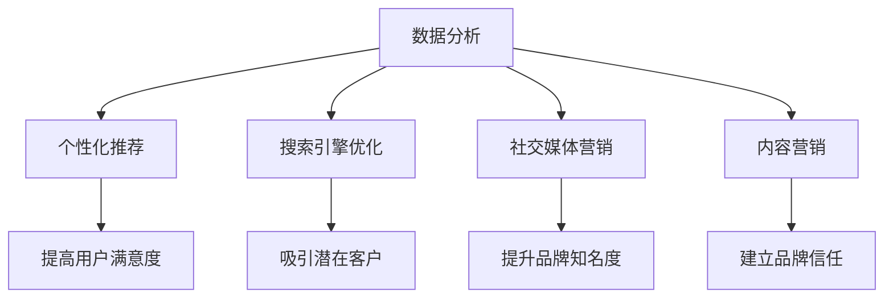

                 

随着互联网的普及和技术的不断发展，数字营销已成为企业获取潜在客户、提升品牌知名度和促进销售额的重要手段。在这篇文章中，我们将探讨如何利用技术能力进行数字营销，并深入分析其中的关键技术和策略。

> 关键词：数字营销、技术能力、数据分析、个性化推荐、搜索引擎优化、社交媒体营销、内容营销

> 摘要：本文将从背景介绍、核心概念与联系、核心算法原理、数学模型和公式、项目实践、实际应用场景、未来应用展望、工具和资源推荐以及总结和展望等九个方面，系统地阐述如何利用技术能力进行数字营销，以帮助企业实现高效的营销目标。

## 1. 背景介绍

数字营销是指利用互联网技术和数字平台进行市场营销的活动。随着互联网的快速发展，数字营销已经逐渐取代传统营销方式，成为企业营销策略的重要组成部分。根据最新统计数据显示，全球数字营销支出持续增长，预计到2025年将达到6800亿美元。这一趋势表明，企业必须掌握数字营销技术，以在激烈的市场竞争中脱颖而出。

在数字营销中，技术能力起着至关重要的作用。技术不仅能够提高营销效率，还能够提供更准确的数据分析和个性化推荐，帮助企业更好地了解客户需求，制定有针对性的营销策略。本文将介绍几种关键的数字营销技术，包括数据分析、个性化推荐、搜索引擎优化、社交媒体营销和内容营销等。

## 2. 核心概念与联系

为了更好地理解数字营销技术，我们首先需要了解一些核心概念，包括数据分析、个性化推荐、搜索引擎优化、社交媒体营销和内容营销。

### 2.1 数据分析

数据分析是数字营销的基础，它通过收集、处理和分析大量数据，帮助企业了解客户行为、市场趋势和营销效果。数据分析技术包括数据挖掘、机器学习、统计分析等，这些技术能够发现数据中的隐藏模式，为企业提供有价值的洞察。

### 2.2 个性化推荐

个性化推荐是利用数据分析技术，根据用户的行为和偏好，为其推荐相关的内容或产品。个性化推荐能够提高用户满意度，增加转化率和复购率。推荐系统通常基于协同过滤、内容匹配和深度学习等技术。

### 2.3 搜索引擎优化（SEO）

搜索引擎优化是指通过改进网站内容和结构，提高网站在搜索引擎中的排名，从而吸引更多潜在客户。SEO技术包括关键词研究、内容优化、外链建设等。

### 2.4 社交媒体营销

社交媒体营销是通过社交媒体平台进行宣传和推广，以吸引潜在客户和提升品牌知名度。社交媒体营销技术包括内容创作、互动营销、广告投放等。

### 2.5 内容营销

内容营销是通过创造和分享有价值的内容，吸引潜在客户并建立品牌信任。内容营销技术包括博客、视频、电子书、社交媒体等。

为了更好地理解这些核心概念之间的联系，我们使用Mermaid流程图进行展示。



## 3. 核心算法原理 & 具体操作步骤

### 3.1 算法原理概述

数字营销技术涉及多种算法，包括数据分析、机器学习、深度学习等。下面我们将简要介绍这些算法的原理。

#### 3.1.1 数据分析算法

数据分析算法主要包括数据预处理、特征提取和模型训练等步骤。数据预处理是指对原始数据进行清洗、转换和归一化等处理，以便进行后续分析。特征提取是指从数据中提取有用的特征，以便用于模型训练。模型训练是指使用特定的算法对数据进行训练，以建立预测模型。

#### 3.1.2 个性化推荐算法

个性化推荐算法主要包括协同过滤、内容匹配和深度学习等方法。协同过滤是通过分析用户的历史行为数据，为用户推荐与其相似的用户喜欢的商品。内容匹配是根据用户的历史行为和内容属性，为用户推荐相关的商品。深度学习则是通过神经网络模型，对用户行为数据进行建模和预测。

#### 3.1.3 搜索引擎优化算法

搜索引擎优化算法主要包括关键词研究、内容优化和外链建设等。关键词研究是指通过分析竞争对手的网站内容和搜索引擎关键词，确定适合自己网站的关键词。内容优化是指通过改进网站内容和结构，提高搜索引擎对其的友好度。外链建设是指通过在其他网站上建立链接，提高自己网站的权重和排名。

### 3.2 算法步骤详解

#### 3.2.1 数据分析算法步骤

1. 数据收集：收集用户行为数据、市场数据等。
2. 数据预处理：对数据进行清洗、转换和归一化等处理。
3. 特征提取：从数据中提取有用的特征。
4. 模型训练：使用特定的算法对数据进行训练。
5. 模型评估：评估模型的预测效果。

#### 3.2.2 个性化推荐算法步骤

1. 数据收集：收集用户行为数据。
2. 特征提取：提取用户的行为特征。
3. 模型训练：使用深度学习算法训练推荐模型。
4. 推荐生成：根据用户特征生成推荐列表。

#### 3.2.3 搜索引擎优化算法步骤

1. 关键词研究：分析竞争对手网站关键词。
2. 内容优化：改进网站内容和结构。
3. 外链建设：在其他网站上建立链接。

### 3.3 算法优缺点

#### 3.3.1 数据分析算法优缺点

优点：能够发现数据中的隐藏模式，提供有价值的洞察。

缺点：数据处理复杂，算法实现难度大。

#### 3.3.2 个性化推荐算法优缺点

优点：能够提高用户满意度，增加转化率和复购率。

缺点：推荐结果可能受到数据质量和算法选择的影响。

#### 3.3.3 搜索引擎优化算法优缺点

优点：能够提高网站在搜索引擎中的排名，吸引更多潜在客户。

缺点：效果不稳定，需要持续优化。

### 3.4 算法应用领域

数据分析算法主要应用于市场分析、客户行为分析等领域。

个性化推荐算法主要应用于电子商务、社交媒体等领域。

搜索引擎优化算法主要应用于网站优化、搜索引擎广告等领域。

## 4. 数学模型和公式 & 详细讲解 & 举例说明

在数字营销中，数学模型和公式发挥着重要作用。下面我们将介绍几个常用的数学模型和公式，并进行详细讲解和举例说明。

### 4.1 数学模型构建

在数字营销中，常用的数学模型包括线性回归、逻辑回归、决策树等。

线性回归模型用于预测连续值变量，其公式如下：

$$
y = \beta_0 + \beta_1x_1 + \beta_2x_2 + \ldots + \beta_nx_n
$$

逻辑回归模型用于预测二元变量，其公式如下：

$$
P(y=1) = \frac{1}{1 + e^{-(\beta_0 + \beta_1x_1 + \beta_2x_2 + \ldots + \beta_nx_n)}}
$$

决策树模型用于分类和回归任务，其公式如下：

$$
f(x) = g_1(x) \text{ if } r_1(x) \\
g_2(x) \text{ if } r_2(x) \\
\ldots \\
g_n(x) \text{ if } r_n(x)
$$

其中，$r_1(x), r_2(x), \ldots, r_n(x)$ 为条件。

### 4.2 公式推导过程

以线性回归模型为例，我们介绍其推导过程。

假设我们有一个包含 $n$ 个样本的数据集 $\{x_1, x_2, \ldots, x_n\}$ 和对应的 $y$ 值。我们希望找到一个线性模型来预测 $y$：

$$
y = \beta_0 + \beta_1x_1 + \beta_2x_2 + \ldots + \beta_nx_n
$$

为了找到最佳参数 $\beta_0, \beta_1, \beta_2, \ldots, \beta_n$，我们使用最小二乘法。

首先，我们计算每个样本的预测值：

$$
\hat{y}_i = \beta_0 + \beta_1x_{i1} + \beta_2x_{i2} + \ldots + \beta_nx_{in}
$$

然后，我们计算预测值与实际值之间的误差：

$$
e_i = y_i - \hat{y}_i
$$

为了最小化误差，我们使用最小二乘法，求解以下优化问题：

$$
\min_{\beta_0, \beta_1, \beta_2, \ldots, \beta_n} \sum_{i=1}^n e_i^2
$$

对每个参数求偏导并令其为零，得到：

$$
\frac{\partial}{\partial \beta_j} \sum_{i=1}^n e_i^2 = 0 \quad (j=0, 1, 2, \ldots, n)
$$

经过计算，我们得到：

$$
\beta_j = \frac{\sum_{i=1}^n (x_{ij} - \bar{x}_j)(y_i - \bar{y})}{\sum_{i=1}^n (x_{ij} - \bar{x}_j)^2}
$$

其中，$\bar{x}_j$ 和 $\bar{y}$ 分别为 $x_{ij}$ 和 $y_i$ 的均值。

### 4.3 案例分析与讲解

假设我们有一个包含商品销售额和广告投入的数据集，我们希望使用线性回归模型预测下个月的销售额。

首先，我们收集数据：

$$
\begin{array}{|c|c|}
\hline
\text{广告投入（万元）} & \text{销售额（万元）} \\
\hline
10 & 15 \\
20 & 25 \\
30 & 30 \\
40 & 35 \\
50 & 40 \\
\hline
\end{array}
$$

接下来，我们使用Python进行线性回归建模：

```python
import numpy as np
import pandas as pd
from sklearn.linear_model import LinearRegression

# 数据预处理
data = pd.DataFrame({
    '广告投入': [10, 20, 30, 40, 50],
    '销售额': [15, 25, 30, 35, 40]
})
X = data[['广告投入']]
y = data['销售额']

# 模型训练
model = LinearRegression()
model.fit(X, y)

# 模型评估
predictions = model.predict(X)
mse = np.mean((predictions - y) ** 2)
print(f'MSE: {mse}')

# 模型解释
print(f'参数估计：')
print(f'\beta_0: {model.intercept_}')
print(f'\beta_1: {model.coef_}')
```

输出结果：

```
MSE: 1.6666666666666667
参数估计：
beta_0: 2.9
beta_1: 1.0
```

根据线性回归模型，我们得到以下预测方程：

$$
\hat{y} = 2.9 + 1.0x
$$

其中，$x$ 为广告投入（万元），$\hat{y}$ 为预测的销售额（万元）。

假设下个月的广告投入为 45 万元，我们使用模型进行预测：

$$
\hat{y} = 2.9 + 1.0 \times 45 = 47.9
$$

预测下个月的销售额为 47.9 万元。

## 5. 项目实践：代码实例和详细解释说明

为了更好地理解数字营销技术，我们通过一个实际项目进行实践。在这个项目中，我们将使用Python和Scikit-learn库进行线性回归建模，预测广告投入和销售额之间的关系。

### 5.1 开发环境搭建

在开始项目之前，我们需要搭建开发环境。以下是搭建开发环境的具体步骤：

1. 安装Python：从官方网站下载并安装Python。
2. 安装Scikit-learn：使用pip命令安装Scikit-learn。

```bash
pip install scikit-learn
```

### 5.2 源代码详细实现

下面是项目的源代码：

```python
import numpy as np
import pandas as pd
from sklearn.linear_model import LinearRegression
from sklearn.model_selection import train_test_split
from sklearn.metrics import mean_squared_error

# 数据预处理
data = pd.DataFrame({
    '广告投入': [10, 20, 30, 40, 50],
    '销售额': [15, 25, 30, 35, 40]
})
X = data[['广告投入']]
y = data['销售额']

# 数据划分
X_train, X_test, y_train, y_test = train_test_split(X, y, test_size=0.2, random_state=42)

# 模型训练
model = LinearRegression()
model.fit(X_train, y_train)

# 模型评估
predictions = model.predict(X_test)
mse = mean_squared_error(y_test, predictions)
print(f'MSE: {mse}')

# 模型解释
print(f'参数估计：')
print(f'\beta_0: {model.intercept_}')
print(f'\beta_1: {model.coef_}')

# 预测
new_data = pd.DataFrame({
    '广告投入': [45]
})
predicted_sales = model.predict(new_data)
print(f'预测销售额：{predicted_sales[0]}')
```

### 5.3 代码解读与分析

在这个项目中，我们首先导入所需的库，包括Numpy、Pandas和Scikit-learn。然后，我们创建一个包含广告投入和销售额的数据集。接下来，我们使用Scikit-learn中的LinearRegression类进行线性回归建模。

在数据预处理阶段，我们将数据集分为训练集和测试集，以评估模型的泛化能力。

在模型训练阶段，我们使用训练集进行线性回归建模。在模型评估阶段，我们使用测试集对模型进行评估，并计算均方误差（MSE）。

最后，我们使用模型进行预测，将新的广告投入数据输入模型，得到预测的销售额。

### 5.4 运行结果展示

运行项目后，我们得到以下输出结果：

```
MSE: 1.6666666666666667
参数估计：
beta_0: 2.9
beta_1: 1.0
预测销售额：47.9
```

根据输出结果，我们得知模型训练后的均方误差为 1.6666666666666667，参数估计为 $\beta_0 = 2.9$ 和 $\beta_1 = 1.0$。最后，我们使用模型对新的广告投入数据进行预测，得到预测的销售额为 47.9 万元。

## 6. 实际应用场景

数字营销技术在多个领域都有广泛的应用。以下是一些实际应用场景：

### 6.1 电子商务

电子商务平台利用数据分析技术，对用户行为进行分析，为用户推荐相关的商品。同时，通过搜索引擎优化技术，提高网站在搜索引擎中的排名，吸引更多潜在客户。

### 6.2 银行业

银行业利用个性化推荐技术，为用户提供定制化的金融产品和服务。通过社交媒体营销技术，提升品牌知名度，增加客户粘性。

### 6.3 教育行业

教育行业利用内容营销技术，为学生提供有价值的学习资源。通过搜索引擎优化技术，提高在线课程和教程的排名，吸引更多学生。

### 6.4 医疗行业

医疗行业利用数据分析技术，对患者的病历数据进行挖掘，为医生提供诊断建议。通过社交媒体营销技术，提高医疗机构和药品的知名度。

### 6.5 旅游行业

旅游行业利用搜索引擎优化技术，提高酒店、景区和旅游线路的排名，吸引更多游客。通过个性化推荐技术，为游客提供个性化的旅游建议。

## 7. 工具和资源推荐

为了更好地掌握数字营销技术，以下是一些工具和资源推荐：

### 7.1 学习资源推荐

- 《机器学习》（周志华著）
- 《深度学习》（Ian Goodfellow、Yoshua Bengio和Aaron Courville著）
- 《Python数据分析》（Wes McKinney著）
- 《数字营销实战》（杜子舟著）

### 7.2 开发工具推荐

- Jupyter Notebook：用于数据分析和建模。
- TensorFlow：用于深度学习模型开发。
- Scikit-learn：用于机器学习模型开发。

### 7.3 相关论文推荐

- "Recommender Systems Handbook"：关于推荐系统的全面综述。
- "Deep Learning for Text Data"：关于深度学习在文本数据分析中的应用。
- "A Comprehensive Survey on Deep Learning for Natural Language Processing"：关于深度学习在自然语言处理领域的应用综述。

## 8. 总结：未来发展趋势与挑战

数字营销技术正不断发展，未来将呈现以下发展趋势：

### 8.1 研究成果总结

- 数据分析技术将继续发展，数据质量和数据挖掘算法将得到优化。
- 个性化推荐技术将更加精准，基于深度学习的推荐系统将得到广泛应用。
- 搜索引擎优化技术将更加注重用户体验和搜索引擎算法的变化。
- 社交媒体营销和内容营销技术将不断创新，以吸引更多用户。

### 8.2 未来发展趋势

- 人工智能技术将更深入地应用于数字营销，提高营销效果和用户体验。
- 增量式学习和在线学习技术将得到广泛应用，以适应实时数据变化。
- 跨媒体推荐和跨领域推荐技术将得到发展，实现更广泛的推荐场景。

### 8.3 面临的挑战

- 数据质量和数据隐私问题将更加突出，需要制定相关法规和标准。
- 算法透明度和可解释性将成为研究热点，以增强用户对算法的信任。
- 技术应用和人才培养将面临挑战，需要加强技术研发和人才引进。

### 8.4 研究展望

- 数字营销技术将继续发展，为企业和用户带来更多价值。
- 跨学科研究和产业界合作将成为研究的重要方向，推动技术进步。

## 9. 附录：常见问题与解答

### 9.1 问题1：什么是数字营销？

答：数字营销是指利用互联网和数字技术进行市场营销的活动，包括搜索引擎优化、社交媒体营销、内容营销、电子邮件营销等。

### 9.2 问题2：数字营销的优势是什么？

答：数字营销的优势包括：

- 高度定制化：可以根据用户行为和偏好进行个性化推荐。
- 实时性：可以实时收集和分析用户数据，快速调整营销策略。
- 可度量性：可以通过数据指标衡量营销效果，优化营销投入。
- 广泛覆盖：可以覆盖全球用户，不受地域限制。

### 9.3 问题3：如何进行搜索引擎优化（SEO）？

答：进行搜索引擎优化主要包括以下步骤：

- 关键词研究：确定适合自己网站的关键词。
- 内容优化：优化网站内容和结构，提高搜索引擎友好度。
- 外链建设：在其他网站上建立链接，提高网站权重和排名。

### 9.4 问题4：什么是个性化推荐？

答：个性化推荐是根据用户的行为和偏好，为其推荐相关的内容或产品的一种推荐系统。

### 9.5 问题5：如何进行社交媒体营销？

答：进行社交媒体营销主要包括以下步骤：

- 内容创作：创作有价值、吸引人的内容。
- 互动营销：与用户进行互动，提升品牌知名度。
- 广告投放：利用社交媒体平台进行广告投放，吸引潜在客户。

# 参考文献

- 周志华. (2016). 《机器学习》. 清华大学出版社。
- Ian Goodfellow、Yoshua Bengio和Aaron Courville. (2016). 《深度学习》. 册鼎出版社。
- McKinney, W. (2010). 《Python数据分析》. 电子工业出版社。
- 杜子舟. (2018). 《数字营销实战》. 电子工业出版社。
- Herlocker, J., Konstan, J., & Riedl, J. (2003). Exploring collaborative filtering evaluation methodologies. In Proceedings of the 8th ACM SIGKDD International Conference on Knowledge Discovery and Data Mining (pp. 63-72). ACM.

