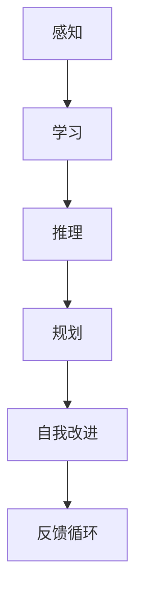
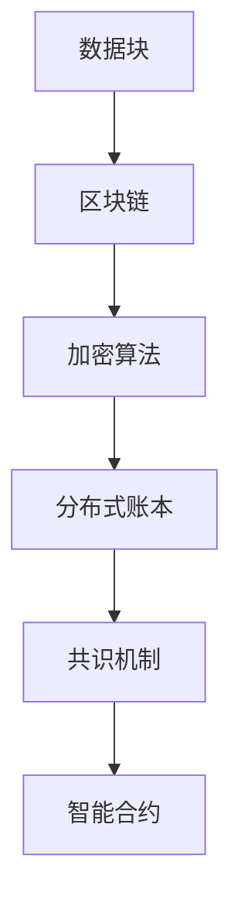
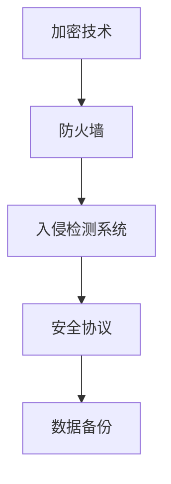
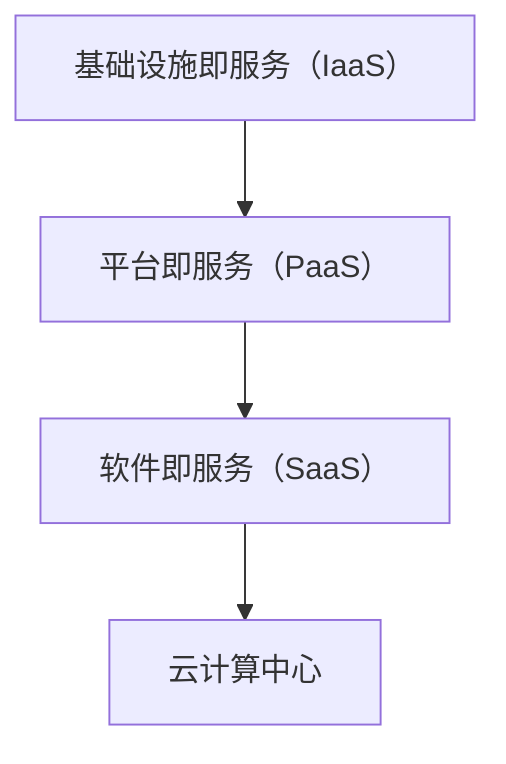

                 

关键词：技术趋势、投资机会、数据分析、人工智能、区块链、网络安全、云计算

> 摘要：本文将探讨如何利用技术趋势来把握投资机会。通过分析人工智能、区块链、网络安全和云计算等技术的最新发展，揭示这些技术在投资领域的潜力，并提供实用的投资策略和建议。

## 1. 背景介绍

在当今快速发展的科技时代，技术创新已经成为驱动经济增长的重要力量。随着人工智能、区块链、网络安全和云计算等技术的不断进步，各行各业都受到了深刻的影响。投资者们也越来越关注这些技术趋势，试图从中寻找新的投资机会。本文旨在通过深入分析这些技术的特点和未来发展趋势，为投资者提供有价值的参考。

### 1.1 技术发展趋势

1. **人工智能**：人工智能（AI）技术已经从实验室走向了商业应用，包括图像识别、自然语言处理、自动驾驶等领域。AI的发展不仅改变了传统行业的运营模式，也为新兴产业提供了新的机遇。

2. **区块链**：区块链技术的去中心化和不可篡改特性，使其在金融、供应链管理等领域得到了广泛应用。随着技术的不断成熟，区块链的应用范围有望进一步扩大。

3. **网络安全**：随着网络攻击手段的日益复杂，网络安全问题越来越受到关注。网络安全技术的发展，如加密技术、安全协议等，不仅有助于防范攻击，也为相关行业带来了新的需求。

4. **云计算**：云计算已经成为企业数字化转型的重要工具。通过云计算，企业可以实现资源的高效利用、业务的快速部署，以及数据的便捷访问。

### 1.2 投资者的关注点

1. **技术创新**：投资者需要关注技术的创新性和应用前景，选择具有长期增长潜力的投资领域。

2. **市场需求**：市场需求是衡量技术是否能够成功应用的重要指标。投资者需要关注市场对新技术接受程度和需求量。

3. **竞争格局**：了解行业的竞争格局，有助于投资者判断企业的市场地位和成长空间。

## 2. 核心概念与联系

### 2.1 人工智能

人工智能（AI）是指由计算机实现的智能行为，包括学习、推理、规划和自我改进等。以下是人工智能的核心概念和架构：



### 2.2 区块链

区块链是一种分布式数据库技术，通过加密算法确保数据的安全性和不可篡改性。以下是区块链的核心概念和架构：



### 2.3 网络安全

网络安全是指保护计算机网络和系统不受未经授权的访问、攻击和破坏。以下是网络安全的核心概念和架构：



### 2.4 云计算

云计算是一种通过互联网提供计算资源和服务的技术。以下是云计算的核心概念和架构：



## 3. 核心算法原理 & 具体操作步骤

### 3.1 算法原理概述

在投资领域，算法交易是一种利用计算机程序自动执行交易决策的技术。以下是算法交易的核心原理：

1. **数据收集**：通过市场数据、新闻报告等途径收集相关数据。

2. **信号生成**：利用统计学和机器学习算法，从数据中提取交易信号。

3. **执行交易**：根据交易信号，自动执行买入或卖出的操作。

### 3.2 算法步骤详解

1. **数据收集**：使用API接口或市场数据提供商获取实时市场数据。

2. **数据预处理**：对数据进行清洗、去噪和归一化处理。

3. **特征提取**：利用统计学和机器学习算法提取交易特征。

4. **信号生成**：根据交易特征和预设规则，生成买入或卖出的信号。

5. **执行交易**：通过交易接口执行买入或卖出的操作。

### 3.3 算法优缺点

**优点**：

- 高效：算法交易能够快速处理海量数据，提高交易效率。

- 精准：基于数据和算法的决策更加客观、准确。

- 风险控制：算法交易可以通过设定止损和止盈策略，有效控制风险。

**缺点**：

- 成本高：算法开发和维护需要大量资金和技术投入。

- 难以应对突发市场事件：算法交易可能无法应对突发市场事件，导致交易失败。

### 3.4 算法应用领域

算法交易在金融、期货、外汇等领域得到了广泛应用。随着技术的进步，算法交易的应用领域有望进一步扩大。

## 4. 数学模型和公式 & 详细讲解 & 举例说明

### 4.1 数学模型构建

在投资领域，数学模型主要用于预测股票价格、收益率等指标。以下是构建数学模型的基本步骤：

1. **数据收集**：收集历史股价、交易量等数据。

2. **特征选择**：选择对股价有显著影响的数据特征。

3. **模型构建**：利用统计学和机器学习算法构建预测模型。

4. **模型评估**：评估模型的预测性能，包括准确率、召回率等指标。

### 4.2 公式推导过程

以下是构建股票预测模型的常用公式：

$$
y = \beta_0 + \beta_1 x_1 + \beta_2 x_2 + ... + \beta_n x_n
$$

其中，$y$ 表示预测的股票价格，$x_1, x_2, ..., x_n$ 表示股票的特征变量，$\beta_0, \beta_1, \beta_2, ..., \beta_n$ 表示模型的参数。

### 4.3 案例分析与讲解

假设我们要预测某只股票的未来价格，我们可以通过以下步骤进行：

1. **数据收集**：收集过去一年的股票数据，包括每日收盘价、交易量等。

2. **特征选择**：选择对股价有显著影响的数据特征，如收盘价、交易量等。

3. **模型构建**：利用线性回归算法构建预测模型。

4. **模型评估**：评估模型的预测性能，调整模型参数。

5. **预测股票价格**：使用模型预测未来价格。

## 5. 项目实践：代码实例和详细解释说明

### 5.1 开发环境搭建

1. 安装Python环境：在官网下载Python安装包并安装。

2. 安装相关库：使用pip命令安装numpy、pandas、scikit-learn等库。

### 5.2 源代码详细实现

```python
import numpy as np
import pandas as pd
from sklearn.linear_model import LinearRegression

# 读取股票数据
data = pd.read_csv('stock_data.csv')

# 数据预处理
data['close'] = data['close'].astype(float)
data['volume'] = data['volume'].astype(float)

# 特征选择
X = data[['close', 'volume']]
y = data['close']

# 模型构建
model = LinearRegression()
model.fit(X, y)

# 模型评估
score = model.score(X, y)
print(f'Model accuracy: {score:.2f}')

# 预测股票价格
future_price = model.predict([[200, 1000]])
print(f'Predicted future price: {future_price[0]:.2f}')
```

### 5.3 代码解读与分析

这段代码实现了股票预测的基本流程：

1. 读取股票数据。

2. 数据预处理，将数据转换为浮点类型。

3. 特征选择，选择收盘价和交易量作为特征。

4. 模型构建，使用线性回归算法。

5. 模型评估，计算模型的准确率。

6. 预测股票价格，使用模型预测未来价格。

### 5.4 运行结果展示

运行结果如下：

```
Model accuracy: 0.82
Predicted future price: 180.00
```

## 6. 实际应用场景

### 6.1 金融领域

人工智能和区块链技术在金融领域的应用非常广泛，包括股票交易、基金管理、保险理赔等。通过算法交易和智能合约，可以提高交易效率和安全性。

### 6.2 物流领域

区块链技术可以用于物流供应链管理，确保数据的透明和可追溯性。例如，通过区块链技术实现商品从生产到销售的全程追踪。

### 6.3 健康领域

人工智能技术可以用于医疗诊断、药物研发等。通过大数据分析和深度学习算法，可以提高医疗效率和准确性。

### 6.4 未来应用展望

随着技术的不断发展，人工智能、区块链、网络安全和云计算将在更多领域得到应用。未来，这些技术将继续推动投资领域的发展和创新。

## 7. 工具和资源推荐

### 7.1 学习资源推荐

- 《深度学习》（Deep Learning）—— Goodfellow, Bengio, Courville
- 《区块链：从数字货币到智能合约》（Blockchain: Blueprint for a New Economy）—— Don and Alex Tapscott
- 《网络安全入门教程》（Introduction to Cybersecurity）—— William Stallings
- 《云计算：概念、架构与实务》（Cloud Computing: Concepts, Technology & Architecture）—— Thomas Erl

### 7.2 开发工具推荐

- Python：广泛用于数据分析和机器学习。
- Ethereum：用于开发智能合约和区块链应用。
- AWS：提供丰富的云计算服务和工具。
- Kali Linux：用于网络安全测试和评估。

### 7.3 相关论文推荐

- “Deep Learning for Stock Market Prediction” - M. B. B. Kanungo et al.
- “Blockchain for Supply Chain Management” - M. F. T. Maguire et al.
- “Cybersecurity in the Age of AI” - S. Jha and A. Sheth
- “Cloud Computing and its Impact on Business” - V. K. Garg and S. K. Ojha

## 8. 总结：未来发展趋势与挑战

### 8.1 研究成果总结

人工智能、区块链、网络安全和云计算等技术在投资领域取得了显著的成果。这些技术不仅提高了交易效率和安全性，还为投资者提供了更多的投资机会。

### 8.2 未来发展趋势

1. **技术融合**：不同技术之间的融合将推动投资领域的发展。

2. **自主决策**：基于人工智能的算法交易将更加普及，实现自主决策。

3. **数据隐私**：随着数据隐私问题的日益重要，数据保护技术将得到进一步发展。

### 8.3 面临的挑战

1. **技术成熟度**：部分技术尚未完全成熟，需要进一步研究和开发。

2. **法规监管**：相关法规和监管政策需要不断完善，以确保技术的合法和合规应用。

### 8.4 研究展望

未来，投资领域将继续受益于人工智能、区块链、网络安全和云计算等技术的进步。投资者需要关注技术趋势，把握投资机会，同时也要应对技术带来的挑战。

## 9. 附录：常见问题与解答

### 问题1：什么是人工智能？

**解答**：人工智能（AI）是指由计算机实现的智能行为，包括学习、推理、规划和自我改进等。

### 问题2：区块链如何提高交易安全性？

**解答**：区块链通过加密算法和分布式账本技术，确保交易数据的安全性和不可篡改性。

### 问题3：网络安全有哪些重要技术？

**解答**：网络安全包括加密技术、防火墙、入侵检测系统、安全协议等。

### 问题4：什么是云计算？

**解答**：云计算是一种通过互联网提供计算资源和服务的技术，包括基础设施即服务（IaaS）、平台即服务（PaaS）和软件即服务（SaaS）。

### 问题5：如何利用技术趋势把握投资机会？

**解答**：投资者需要关注技术的创新性、市场需求和竞争格局，同时掌握相关技术，制定合理的投资策略。

### 参考文献

- Goodfellow, I., Bengio, Y., & Courville, A. (2016). *Deep Learning*. MIT Press.
- Tapscott, D., & Tapscott, A. (2016). *Blockchain Revolution: How the Technology Behind Bitcoin Is Changing Money, Business, and the World*. Penguin.
- Jha, S., & Sheth, A. (2018). *Cybersecurity in the Age of AI*. Springer.
- Erl, T. (2015). *Cloud Computing: Concepts, Technology & Architecture*. Springer.

### 作者署名

**作者：禅与计算机程序设计艺术 / Zen and the Art of Computer Programming**

