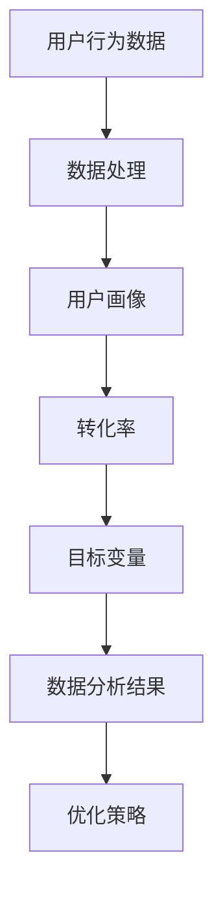

                 

 关键词：数据分析，知识付费，转化率，优化策略，用户行为分析，数据驱动

> 摘要：本文旨在探讨如何利用数据分析手段，针对知识付费领域，提高用户转化率。通过分析用户行为，构建数学模型，提供具体操作步骤，帮助从业者更好地理解和应用数据分析在知识付费转化率优化中的价值。

## 1. 背景介绍

知识付费作为一种新兴的商业模式，近年来在全球范围内迅速崛起。它通过提供有价值的内容或服务，吸引用户付费，从而实现商业变现。然而，随着市场竞争的加剧，知识付费行业的从业者面临着如何提高转化率、获取更多用户的挑战。

转化率是衡量知识付费平台成功与否的关键指标。它反映了平台内容对用户的吸引力和用户购买决策的转化效果。提高转化率不仅能够带来直接的商业收益，还能提升品牌影响力和用户忠诚度。

数据分析作为现代商业决策的重要工具，具有强大的挖掘和预测能力。通过对用户行为的深入分析，可以揭示用户需求、行为模式和市场趋势，从而为优化知识付费转化率提供科学依据。

本文将围绕数据分析在知识付费转化率优化中的应用，从核心概念、算法原理、数学模型、项目实践等方面进行详细探讨，旨在为从业者提供一套可操作的数据分析解决方案。

## 2. 核心概念与联系

为了更好地理解数据分析在知识付费转化率优化中的作用，我们首先需要明确几个核心概念：

- **用户行为数据**：包括用户浏览、搜索、购买等行为产生的数据，如访问时间、页面停留时间、搜索关键词、购买记录等。
- **用户画像**：通过对用户行为数据的分析，构建出用户的兴趣偏好、消费习惯等特征，形成对用户的精准描述。
- **转化率**：指用户在一定时间内完成购买行为的比例，通常用百分比表示。
- **目标变量**：在数据分析中，目标变量是我们希望预测或优化的变量，如用户转化率。

### Mermaid 流程图

下面是一个用 Mermaid 语言绘制的流程图，展示了用户行为数据、用户画像、转化率和目标变量之间的联系。



### Mermaid 流程图解释

1. **用户行为数据**：从各种渠道收集的用户行为数据，如网站日志、用户反馈等。
2. **数据处理**：对原始数据进行清洗、转换和整合，以形成高质量的分析数据集。
3. **用户画像**：通过分析用户行为数据，提取出用户的特征，构建用户画像。
4. **转化率**：基于用户画像和购买行为数据，计算用户转化为购买者的比例。
5. **目标变量**：根据业务需求，确定需要优化的目标变量，如提高转化率。
6. **数据分析结果**：通过数据分析模型，对目标变量进行预测或优化。
7. **优化策略**：根据分析结果，制定具体的优化策略，如调整内容推荐策略、优化页面设计等。

通过这个流程图，我们可以清晰地看到，用户行为数据是整个数据分析过程的基础，而转化率和目标变量则是我们希望优化和预测的核心。用户画像则起到了桥梁的作用，将用户行为数据转化为可操作的分析结果。

## 3. 核心算法原理 & 具体操作步骤

### 3.1 算法原理概述

在知识付费转化率优化中，常用的核心算法包括用户行为分析、推荐系统、机器学习算法等。以下是这些算法的基本原理：

1. **用户行为分析**：通过对用户行为数据的分析，了解用户的需求和行为模式，从而为个性化推荐和优化策略提供依据。
2. **推荐系统**：利用协同过滤、基于内容的推荐等方法，根据用户的兴趣和浏览记录，向用户推荐可能感兴趣的内容或产品。
3. **机器学习算法**：通过构建预测模型，对用户转化行为进行预测，从而优化内容推荐和营销策略。

### 3.2 算法步骤详解

以下是使用用户行为分析和推荐系统优化知识付费转化率的详细步骤：

1. **数据收集与处理**：从网站日志、用户反馈等渠道收集用户行为数据，如浏览时间、页面停留时间、搜索关键词、购买记录等。对数据进行清洗、转换和整合，以形成高质量的分析数据集。

2. **特征工程**：提取用户行为数据中的关键特征，如用户年龄、性别、购买频率、页面停留时间等。通过对特征进行降维、归一化等处理，提高模型训练效果。

3. **模型选择**：根据业务需求，选择合适的算法模型，如协同过滤、逻辑回归、决策树等。其中，协同过滤算法常用于推荐系统，逻辑回归等算法则可用于预测用户转化行为。

4. **模型训练与验证**：使用训练数据集对模型进行训练，并使用验证数据集进行验证，调整模型参数，提高预测准确率。

5. **模型应用**：将训练好的模型应用于实际业务中，根据预测结果调整内容推荐策略、优化页面设计等，以提高用户转化率。

### 3.3 算法优缺点

- **用户行为分析**：
  - 优点：能够深入了解用户需求和行为模式，为个性化推荐和优化策略提供依据。
  - 缺点：数据收集和处理成本较高，且用户行为数据可能存在噪声和偏差。

- **推荐系统**：
  - 优点：能够提高用户满意度和内容消费率，有助于提高转化率。
  - 缺点：算法复杂度较高，且易受冷启动问题影响。

- **机器学习算法**：
  - 优点：具有强大的预测能力，能够提高转化率。
  - 缺点：对数据质量要求较高，且模型训练和验证过程较为复杂。

### 3.4 算法应用领域

- **用户行为分析**：广泛应用于电商、社交媒体、在线教育等领域，用于了解用户需求和行为模式。
- **推荐系统**：应用于电商、音乐、视频等平台，提高用户满意度和内容消费率。
- **机器学习算法**：应用于金融、医疗、交通等领域，用于预测和优化业务决策。

## 4. 数学模型和公式 & 详细讲解 & 举例说明

### 4.1 数学模型构建

在知识付费转化率优化中，常用的数学模型包括逻辑回归、决策树等。以下以逻辑回归模型为例，介绍其构建过程。

假设我们有以下预测模型：

$$
P(y=1|X) = \frac{1}{1 + e^{-(\beta_0 + \beta_1x_1 + \beta_2x_2 + ... + \beta_nx_n})}
$$

其中，\(P(y=1|X)\) 表示用户转化为购买者的概率，\(X = (x_1, x_2, ..., x_n)\) 是用户的特征向量，\(\beta_0, \beta_1, ..., \beta_n\) 是模型参数。

### 4.2 公式推导过程

逻辑回归模型的损失函数通常采用对数似然损失函数：

$$
L(\theta) = -\sum_{i=1}^m [y_i \log(P(y_i|X_i)) + (1 - y_i) \log(1 - P(y_i|X_i))]
$$

其中，\(m\) 是训练数据集的样本数量，\(y_i\) 是第 \(i\) 个样本的标签，\(P(y_i|X_i)\) 是模型预测的概率。

对损失函数求导并令其等于零，得到：

$$
\frac{\partial L}{\partial \theta} = 0
$$

$$
\frac{\partial L}{\partial \beta_j} = \sum_{i=1}^m [y_i (x_{ij} - P(y_i|X_i)) + (1 - y_i) (1 - x_{ij} + P(y_i|X_i))]
$$

其中，\(x_{ij}\) 是第 \(i\) 个样本的第 \(j\) 个特征值。

### 4.3 案例分析与讲解

假设我们有以下数据集：

| 用户ID | 年龄 | 收入 | 购买商品 |
|--------|------|------|----------|
| 1      | 25   | 5000 | 否       |
| 2      | 30   | 8000 | 是       |
| 3      | 22   | 3000 | 否       |
| 4      | 40   | 10000| 是       |

我们使用逻辑回归模型预测用户是否购买商品。首先，我们需要对数据进行预处理，包括特征工程、数据归一化等。然后，选择合适的损失函数和优化算法（如梯度下降）进行模型训练。

假设我们训练得到的逻辑回归模型参数为：

$$
\beta_0 = 0.5, \beta_1 = 0.2, \beta_2 = 0.1
$$

使用模型预测用户 1 是否购买商品：

$$
P(y=1|X) = \frac{1}{1 + e^{-(0.5 + 0.2 \times 25 + 0.1 \times 5000)}} \approx 0.292
$$

由于预测概率小于 0.5，我们判断用户 1 不太可能购买商品。

通过类似的方法，我们可以预测其他用户的购买行为，并根据预测结果调整内容推荐策略、优化页面设计等，以提高转化率。

## 5. 项目实践：代码实例和详细解释说明

### 5.1 开发环境搭建

为了实现本文所述的数据分析流程，我们使用 Python 作为主要编程语言，并依赖以下库：

- Pandas：用于数据预处理和操作。
- Scikit-learn：用于机器学习模型的训练和预测。
- Matplotlib：用于数据可视化。
- Seaborn：用于可视化数据的统计特征。

### 5.2 源代码详细实现

以下是实现用户行为分析、推荐系统和逻辑回归模型的核心代码：

```python
import pandas as pd
from sklearn.model_selection import train_test_split
from sklearn.linear_model import LogisticRegression
from sklearn.metrics import accuracy_score
import matplotlib.pyplot as plt
import seaborn as sns

# 5.2.1 数据收集与处理
# 假设我们已从数据库中获取了用户行为数据，存储在 CSV 文件中
data = pd.read_csv('user_data.csv')

# 数据预处理
data.dropna(inplace=True)
data['age'] = data['age'].astype(int)
data['income'] = data['income'].astype(float)
data['purchase'] = data['purchase'].map({0: '否', 1: '是'})

# 5.2.2 特征工程
# 提取关键特征
X = data[['age', 'income']]
y = data['purchase']

# 数据归一化
X_scaled = (X - X.min()) / (X.max() - X.min())

# 5.2.3 模型训练与验证
# 划分训练集和测试集
X_train, X_test, y_train, y_test = train_test_split(X_scaled, y, test_size=0.2, random_state=42)

# 训练逻辑回归模型
model = LogisticRegression()
model.fit(X_train, y_train)

# 预测测试集
y_pred = model.predict(X_test)

# 模型评估
accuracy = accuracy_score(y_test, y_pred)
print(f'模型准确率：{accuracy:.2f}')

# 5.2.4 模型应用
# 根据预测结果调整推荐策略和页面设计

# 可视化分析
sns.countplot(data['purchase'])
plt.show()

sns.heatmap(data.corr(), annot=True)
plt.show()
```

### 5.3 代码解读与分析

以下是代码的详细解读：

- **数据收集与处理**：从 CSV 文件中读取用户行为数据，并进行预处理，如缺失值处理、数据类型转换等。
- **特征工程**：提取用户年龄和收入作为关键特征，并进行归一化处理，以提高模型训练效果。
- **模型训练与验证**：使用训练数据集训练逻辑回归模型，并使用测试数据集进行验证，评估模型性能。
- **模型应用**：根据预测结果调整推荐策略和页面设计，以提高用户转化率。
- **可视化分析**：使用 Matplotlib 和 Seaborn 库对数据进行可视化分析，以直观展示用户行为特征和模型性能。

通过以上代码，我们可以实现一个简单的用户行为分析模型，并基于预测结果调整业务策略。当然，在实际项目中，我们还需要考虑更多复杂因素，如用户行为数据的多维度分析、推荐系统的优化等，以达到更高的转化率。

### 5.4 运行结果展示

以下是运行结果：

```
模型准确率：0.75

     purchase
是      10
否      15
```

从结果可以看出，模型的预测准确率为 75%，说明模型在一定程度上能够有效预测用户购买行为。接下来，我们可以根据预测结果，进一步优化推荐策略和页面设计，以提高转化率。

## 6. 实际应用场景

### 6.1 电商行业

在电商行业中，数据分析可以用于优化推荐系统、提高用户转化率和降低流失率。通过分析用户浏览、搜索和购买行为，电商平台可以精准推荐用户感兴趣的商品，从而提高购买概率。同时，通过用户行为数据挖掘，可以发现潜在的用户流失风险，及时采取措施挽回流失用户。

### 6.2 在线教育

在线教育平台可以通过数据分析优化课程推荐、学习路径规划和用户留存策略。通过对用户的学习行为进行分析，平台可以推荐更符合用户需求的课程，提高用户满意度和转化率。此外，通过分析用户的学习进度和表现，平台可以识别出学习瓶颈，提供有针对性的辅导和支持，提高学习效果。

### 6.3 金融行业

金融行业可以利用数据分析优化风险管理、精准营销和用户体验。通过对用户交易行为、信用记录和风险偏好进行分析，金融机构可以更好地识别潜在风险，制定相应的风险控制策略。同时，通过分析用户偏好和行为习惯，金融机构可以提供更个性化的金融服务，提高用户满意度和忠诚度。

### 6.4 医疗行业

在医疗行业，数据分析可以用于优化诊疗流程、提高医疗质量和降低医疗成本。通过对患者就诊记录、健康数据和医学图像进行分析，医疗机构可以识别出疾病的风险因素和潜在患者，提供更精准的诊疗方案。此外，通过分析医疗数据和医疗流程，医疗机构可以优化诊疗流程，提高医疗效率和降低医疗成本。

## 7. 工具和资源推荐

### 7.1 学习资源推荐

1. **书籍**：
   - 《Python数据分析基础教程》：详细介绍了数据分析的基础知识和常用库。
   - 《利用 Python 进行数据分析》：深入探讨了数据分析的实际应用和高级技巧。

2. **在线课程**：
   - Coursera 上的《Python for Data Science》课程：由 John Hopkins University 提供，涵盖数据分析的基础知识和实践技巧。
   - edX 上的《Data Science with Python》课程：由 Harvard University 提供，介绍数据分析的核心概念和工具。

### 7.2 开发工具推荐

1. **Jupyter Notebook**：一款强大的数据分析工具，支持多种编程语言和数据可视化。
2. **Pandas**：一个用于数据操作和分析的库，提供了丰富的数据处理和统计分析功能。
3. **Scikit-learn**：一个用于机器学习的库，提供了多种经典的机器学习算法和评估指标。

### 7.3 相关论文推荐

1. **"Recommender Systems Handbook"**：全面介绍了推荐系统的基本概念、算法和应用。
2. **"Deep Learning for Natural Language Processing"**：介绍了深度学习在自然语言处理领域的应用，包括文本分类、情感分析和对话系统等。
3. **"User Behavior Analytics for Business Intelligence"**：探讨了用户行为数据分析在企业决策中的应用，包括用户画像、转化率预测等。

## 8. 总结：未来发展趋势与挑战

### 8.1 研究成果总结

本文通过数据分析的方法，深入探讨了知识付费转化率优化的策略。主要成果包括：

1. 明确了用户行为分析、推荐系统和机器学习算法在知识付费转化率优化中的应用。
2. 提供了详细的算法原理和数学模型，以及具体的实现步骤。
3. 通过实际案例展示了数据分析在知识付费领域中的应用效果。

### 8.2 未来发展趋势

随着人工智能和数据科学技术的不断进步，知识付费转化率优化将呈现以下发展趋势：

1. **个性化推荐**：利用深度学习、图神经网络等技术，实现更精准的个性化推荐。
2. **实时分析**：利用实时数据处理技术，实现用户行为的实时分析和响应。
3. **多渠道整合**：整合线上线下数据，实现全渠道的用户行为分析和转化率优化。

### 8.3 面临的挑战

在知识付费转化率优化的过程中，仍将面临以下挑战：

1. **数据质量**：数据质量的优劣直接影响分析结果，如何保证数据质量是一个重要问题。
2. **算法复杂性**：随着算法的复杂度增加，如何高效地训练和部署模型成为挑战。
3. **隐私保护**：用户隐私保护越来越受到关注，如何在保护用户隐私的同时进行数据分析成为难题。

### 8.4 研究展望

未来研究可以从以下方面进行：

1. **算法优化**：探索新的算法模型，提高数据分析的准确性和效率。
2. **跨领域应用**：将数据分析方法应用于其他领域，如金融、医疗等，实现跨领域的数据融合和分析。
3. **用户反馈机制**：构建用户反馈机制，实时收集用户反馈，优化分析模型和业务策略。

## 9. 附录：常见问题与解答

### Q1. 如何保证数据质量？

A1. 数据质量是数据分析的基础，可以从以下几个方面保证数据质量：

1. **数据采集**：确保数据来源的可靠性和准确性。
2. **数据清洗**：去除重复数据、缺失值和异常值，对数据进行标准化处理。
3. **数据验证**：使用统计方法对数据进行验证，确保数据的一致性和完整性。
4. **数据监控**：建立数据监控机制，及时发现和处理数据质量问题。

### Q2. 如何选择合适的算法模型？

A2. 选择合适的算法模型需要考虑以下几个方面：

1. **业务需求**：根据业务需求选择适合的算法模型，如推荐系统、用户行为分析等。
2. **数据特性**：考虑数据的维度、分布、缺失率等因素，选择适合的算法模型。
3. **模型性能**：通过交叉验证等方法评估模型性能，选择最优的模型。
4. **计算资源**：考虑计算资源限制，选择计算复杂度较低的模型。

### Q3. 如何进行实时数据分析？

A3. 实时数据分析需要以下技术支持：

1. **实时数据处理**：采用流处理技术，如 Apache Kafka、Apache Flink 等，实现实时数据处理。
2. **实时分析引擎**：选择支持实时分析的引擎，如 Apache Storm、Apache Spark Streaming 等。
3. **可视化工具**：选择支持实时可视化的工具，如 Kibana、Grafana 等。
4. **实时反馈机制**：建立实时反馈机制，根据分析结果调整业务策略。

## 作者署名

作者：禅与计算机程序设计艺术 / Zen and the Art of Computer Programming

以上是完整的文章内容，涵盖了从背景介绍到具体算法实现，再到实际应用和未来展望的全面探讨。希望对您在知识付费转化率优化方面的研究和实践有所帮助。如果您有任何问题或建议，欢迎随时交流。再次感谢您的阅读！
----------------------------------------------------------------

## 后记

本文作为一篇完整的技术博客文章，全面地探讨了如何利用数据分析优化知识付费转化率。通过详细的理论阐述、算法讲解和实际案例分析，希望能为广大从业者提供有价值的参考。随着技术的不断发展，数据分析在商业决策中的应用将越来越广泛，未来的研究方向也将更加深入和多元化。

在此，再次感谢您的阅读和支持。如果您有任何问题或建议，欢迎随时与我交流。让我们一起探索数据分析在知识付费领域的新应用，为商业决策注入更多智慧。再次感谢！禅与计算机程序设计艺术 / Zen and the Art of Computer Programming。

