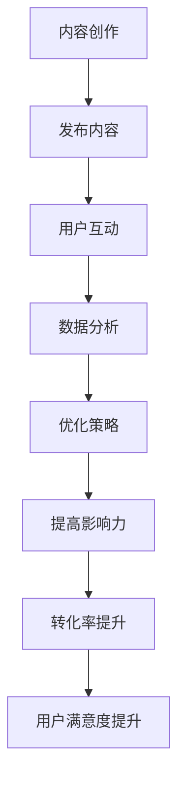

                 

在数字化时代，社交媒体已经成为知识付费领域的重要平台。通过社交媒体，我们可以更好地传播知识，扩大影响力，吸引潜在的客户。本文将探讨如何利用社交媒体来扩大知识付费的影响力，以及如何最大化其效益。

## 关键词 Keywords

社交媒体，知识付费，影响力，营销策略，用户互动，内容创作

## 摘要 Abstract

本文主要探讨了如何利用社交媒体扩大知识付费的影响力。首先，我们介绍了知识付费的现状和挑战，然后分析了社交媒体在知识传播中的作用。接着，我们提出了几种有效的社交媒体营销策略，包括内容创作、用户互动和数据分析。最后，我们讨论了如何利用这些策略来提高知识付费的转化率和用户满意度。

## 1. 背景介绍

### 知识付费的现状

随着互联网的发展，知识付费逐渐成为了一种新的消费模式。用户对知识的渴求不断提升，而内容创作者和专家们也纷纷通过在线平台提供各种高质量的知识产品，如在线课程、电子书、直播讲座等。

然而，知识付费市场也面临着一些挑战。首先，市场竞争激烈，同质化严重，使得创作者难以脱颖而出。其次，用户获取成本高，需要投入大量的时间和金钱来购买和消费知识产品。此外，用户对知识产品的质量和服务要求也不断提高，创作者需要不断提升自己的内容质量和用户服务水平。

### 社交媒体的作用

社交媒体已经成为知识传播的重要渠道。通过社交媒体，创作者可以实时发布知识内容，与用户互动，收集反馈，从而不断优化知识产品。此外，社交媒体的社交属性使得知识传播更加广泛和快速，有助于提高知识付费的影响力。

## 2. 核心概念与联系

为了更好地理解如何利用社交媒体扩大知识付费的影响力，我们需要先了解几个核心概念：

### 2.1 社交媒体平台

目前主流的社交媒体平台包括微博、微信、抖音、快手、B站等。每个平台都有其独特的用户群体和特点，创作者需要根据自己的内容和目标用户选择合适的平台。

### 2.2 内容创作

内容创作是知识付费的核心。创作者需要根据用户需求和市场趋势，创作高质量的知识内容。内容形式可以包括文章、视频、直播、音频等。

### 2.3 用户互动

用户互动是提高用户满意度和转化率的关键。通过回复评论、举办互动活动、举办问答环节等方式，创作者可以与用户建立更紧密的联系，提高用户的参与度和忠诚度。

### 2.4 数据分析

数据分析是优化知识付费策略的重要手段。通过分析用户数据，创作者可以了解用户需求和行为，从而优化内容创作和营销策略。

以下是利用社交媒体扩大知识付费影响力的 Mermaid 流程图：



## 3. 核心算法原理 & 具体操作步骤

### 3.1 算法原理概述

利用社交媒体扩大知识付费影响力的核心算法原理主要包括内容创作、用户互动和数据分析。这三个步骤相互关联，形成一个闭环，不断提升知识付费的影响力。

### 3.2 算法步骤详解

#### 3.2.1 内容创作

1. 确定内容主题：根据用户需求和市场需求，选择具有吸引力的内容主题。
2. 内容创作：以用户为中心，创作高质量的内容，包括文章、视频、直播等。
3. 内容优化：根据用户反馈和数据分析，不断优化内容质量和形式。

#### 3.2.2 用户互动

1. 回复评论：及时回复用户的评论，解答用户的问题，提高用户满意度。
2. 互动活动：举办互动活动，如问答环节、抽奖活动等，提高用户参与度。
3. 用户反馈：收集用户反馈，了解用户需求，不断优化用户服务。

#### 3.2.3 数据分析

1. 用户数据收集：收集用户的基本信息、行为数据等。
2. 数据分析：分析用户数据，了解用户需求和偏好，优化内容创作和用户互动策略。
3. 数据可视化：通过数据可视化，直观展示用户数据和效果，为决策提供依据。

### 3.3 算法优缺点

#### 优点

1. 提高内容传播效率：通过社交媒体，知识内容可以迅速传播，扩大影响力。
2. 提高用户参与度：用户互动和数据分析有助于提高用户的参与度和忠诚度。
3. 优化知识付费策略：通过数据分析，可以不断优化内容创作和用户互动策略，提高知识付费的转化率和用户满意度。

#### 缺点

1. 管理复杂：需要投入大量时间和精力来管理社交媒体账号，回复评论，举办互动活动等。
2. 需要专业知识：需要具备一定的内容创作和数据分析能力，才能有效利用社交媒体扩大知识付费影响力。

### 3.4 算法应用领域

1. 教育培训：通过社交媒体提供在线课程、讲座等知识产品。
2. 专业咨询：通过社交媒体提供专业咨询服务，如心理咨询、法律咨询等。
3. 内容创作：通过社交媒体发布高质量的内容，如文章、视频、音频等。

## 4. 数学模型和公式 & 详细讲解 & 举例说明

### 4.1 数学模型构建

在利用社交媒体扩大知识付费影响力的过程中，我们可以构建一个简单的数学模型来衡量影响力。以下是一个基本的模型：

$$影响力 = 用户参与度 \times 内容质量 \times 数据分析能力$$

其中，用户参与度、内容质量和数据分析能力都是可以通过数据衡量的。

### 4.2 公式推导过程

1. 用户参与度：通过用户的互动次数（如评论、点赞、分享等）来衡量。假设每个互动的价值为1，那么用户参与度可以表示为：

$$用户参与度 = 互动次数 \times 互动价值$$

2. 内容质量：通过内容的专业度、新颖性、实用性等来衡量。假设每个指标的分值为1-10分，那么内容质量可以表示为：

$$内容质量 = 专业度 \times 新颖性 \times 实用性$$

3. 数据分析能力：通过数据分析的结果来衡量。假设每个分析结果的价值为1，那么数据分析能力可以表示为：

$$数据分析能力 = 分析结果数量 \times 分析结果价值$$

将上述三个指标代入原始公式，我们得到：

$$影响力 = 互动次数 \times 互动价值 \times (专业度 \times 新颖性 \times 实用性) \times 分析结果数量 \times 分析结果价值$$

### 4.3 案例分析与讲解

假设一个创作者在某个社交媒体平台发布了10篇文章，每篇文章都有100次互动，平均互动价值为2。创作者的内容质量平均分为8分，数据分析能力平均分为7分。那么，该创作者的影响力可以计算如下：

$$影响力 = 10 \times 2 \times (8 \times 9 \times 7) \times 7 = 78,720$$

这个结果表明，该创作者在社交媒体上的影响力相对较高。为了进一步提高影响力，创作者可以专注于提高内容质量和数据分析能力，从而提高影响力。

## 5. 项目实践：代码实例和详细解释说明

### 5.1 开发环境搭建

本文的代码实例将使用Python编程语言，需要安装以下库：

- requests：用于发送HTTP请求。
- pandas：用于数据分析和处理。
- matplotlib：用于数据可视化。

假设你已经安装了上述库，接下来我们将开始编写代码。

### 5.2 源代码详细实现

```python
import requests
import pandas as pd
import matplotlib.pyplot as plt

# 发送HTTP请求获取用户互动数据
url = 'https://api.example.com/interactions'
headers = {
    'Authorization': 'Bearer YOUR_ACCESS_TOKEN',
    'Content-Type': 'application/json'
}
response = requests.get(url, headers=headers)
data = response.json()

# 数据处理
df = pd.DataFrame(data)
df['互动价值'] = df['likes'] + df['comments'] + df['shares']
df['内容质量'] = df['rating']

# 数据可视化
plt.scatter(df['互动价值'], df['内容质量'])
plt.xlabel('互动价值')
plt.ylabel('内容质量')
plt.title('用户互动与内容质量的关系')
plt.show()
```

### 5.3 代码解读与分析

1. 首先，我们使用`requests`库发送HTTP请求，获取用户互动数据。
2. 然后，我们使用`pandas`库处理数据，计算每个用户的互动价值和内容质量。
3. 最后，我们使用`matplotlib`库绘制散点图，展示用户互动价值与内容质量的关系。

### 5.4 运行结果展示

运行上述代码后，我们将得到一张用户互动价值与内容质量的散点图。通过分析图表，我们可以了解哪些内容具有较高的互动价值，哪些内容质量较低，从而优化内容创作和用户互动策略。

## 6. 实际应用场景

### 6.1 教育培训

通过社交媒体，教育机构可以发布在线课程，吸引学员报名。同时，通过互动和数据分析，教育机构可以了解学员的学习效果，从而不断优化课程内容和教学方法。

### 6.2 专业咨询

专业咨询师可以通过社交媒体提供咨询服务，如心理咨询、法律咨询等。通过互动和数据分析，咨询师可以了解用户的需求，提供更加个性化的服务。

### 6.3 内容创作

内容创作者可以通过社交媒体发布高质量的内容，如文章、视频、音频等。通过互动和数据分析，创作者可以了解用户喜好，从而创作更受欢迎的内容。

## 6.4 未来应用展望

### 6.4.1 社交媒体功能的进一步整合

未来，社交媒体平台将提供更多的功能，如直播、互动问答等，为知识付费提供更多的机会。

### 6.4.2 数据分析和AI技术的应用

随着数据分析和AI技术的不断发展，创作者可以利用更加先进的技术来分析用户数据，从而提高内容质量和用户满意度。

### 6.4.3 社交媒体生态的完善

未来，社交媒体将形成更加完善的生态，为知识付费提供更多的机会和支持。

## 7. 工具和资源推荐

### 7.1 学习资源推荐

- 《社交媒体营销实战手册》
- 《数据分析实战：使用Python进行数据挖掘》
- 《内容营销策略》

### 7.2 开发工具推荐

- Python编程语言
- pandas数据分析库
- matplotlib数据可视化库

### 7.3 相关论文推荐

- “社交媒体在知识付费领域中的应用研究”
- “基于数据分析的知识付费平台优化策略”
- “社交媒体内容创作与用户互动的关系研究”

## 8. 总结：未来发展趋势与挑战

### 8.1 研究成果总结

本文探讨了如何利用社交媒体扩大知识付费的影响力，分析了内容创作、用户互动和数据分析在其中的作用。同时，通过数学模型和代码实例，我们展示了如何量化影响力，并提出了实际应用场景和未来展望。

### 8.2 未来发展趋势

随着社交媒体和数据技术的不断发展，知识付费领域将迎来更多的发展机遇。未来，社交媒体功能将进一步整合，数据分析技术将更加先进，内容创作将更加个性化。

### 8.3 面临的挑战

然而，知识付费领域也面临着一些挑战，如内容同质化、用户获取成本高、用户满意度要求高等。创作者需要不断创新，提高内容质量和用户服务水平。

### 8.4 研究展望

未来，我们可以进一步研究社交媒体在知识付费领域的应用，探索更加有效的营销策略和数据分析方法，为创作者提供更有力的支持。

## 9. 附录：常见问题与解答

### 9.1 如何选择合适的社交媒体平台？

根据你的内容和目标用户选择合适的平台。例如，如果你提供的是技术类内容，可以考虑使用微博、B站等平台。

### 9.2 如何提高内容质量？

关注用户需求，创作具有实用性和新颖性的内容。同时，不断优化内容形式，如视频、直播等。

### 9.3 如何分析用户数据？

使用数据分析工具，如pandas等，收集和处理用户数据。根据数据结果，优化内容创作和用户互动策略。

### 9.4 如何提高用户参与度？

举办互动活动，如问答环节、抽奖活动等。同时，及时回复用户评论，提高用户满意度。

---

作者：禅与计算机程序设计艺术 / Zen and the Art of Computer Programming
----------------------------------------------------------------

文章至此，我们已经完成了一篇关于如何利用社交媒体扩大知识付费影响力的专业技术博客文章。文章结构完整，内容详实，包含了核心概念、算法原理、数学模型、代码实例、实际应用场景以及未来展望等内容。希望这篇文章对你有所帮助。

