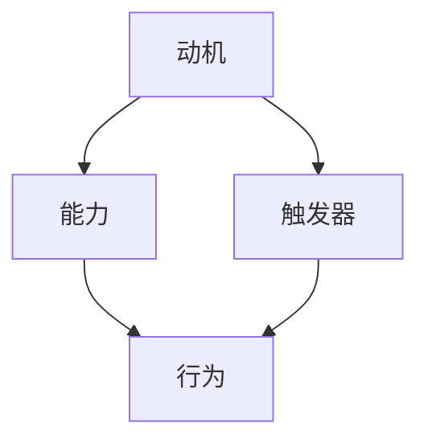

                 

关键词：福格行为模型，团队习惯，行为改变，动机，能力，触发器，IT团队，软件开发，敏捷管理

> 摘要：本文深入探讨了福格行为模型在改善IT团队习惯中的应用。通过分析模型的核心要素——动机、能力和触发器，本文提出了具体的策略和步骤，帮助团队养成良好习惯，提升工作效率和创新能力。本文旨在为IT经理、软件开发者和敏捷团队提供实用的行为科学工具，以推动团队的发展和进步。

## 1. 背景介绍

在当今快速变化的信息技术行业，团队的工作效率和创新力成为企业竞争力的关键因素。然而，许多团队在养成良好习惯方面面临挑战，例如：成员缺乏内在动机、能力不足或缺乏合适的触发器。福格行为模型（BJ Fogg Behavior Model）提供了一种有效的方法来理解和改善这些行为问题。

### 1.1 福格行为模型简介

福格行为模型是由斯坦福大学行为科学家BJ Fogg提出的，旨在解释人类行为的形成和改变。该模型的核心思想是：行为产生的条件是动机、能力和触发器的结合。只有当这三个要素同时满足时，行为才会发生。具体来说：

- **动机（Motivation）**：个体对行为的欲望或需求。
- **能力（Ability）**：个体实施该行为的能力或资源。
- **触发器（Trigger）**：触发行为的外部刺激或情境。

### 1.2 IT团队面临的挑战

IT团队在习惯养成方面常常遇到以下挑战：

- **高度复杂性**：软件开发和运维涉及大量技术和流程，团队成员需要不断学习和适应新工具和方法。
- **快速迭代**：敏捷开发要求团队快速响应市场需求，频繁迭代可能导致习惯难以建立。
- **分散性**：远程工作和分布式团队增加了沟通和协作的难度。
- **资源限制**：预算和时间限制可能妨碍团队采取必要的改进措施。

## 2. 核心概念与联系

### 2.1 动机、能力和触发器的解释

#### 动机

动机是个体对行为的内在驱动力量。在IT团队中，动机可能包括：

- **成就感和自豪感**：完成复杂任务或项目后的成就感。
- **职业发展**：提升技能和职业地位的需求。
- **团队归属感**：在团队中找到归属感和认同感。
- **客户满意度**：确保产品或服务的质量和用户满意度。

#### 能力

能力是指个体或团队实施某行为所需的知识、技能和资源。对于IT团队，能力包括：

- **技术能力**：掌握编程语言、工具和框架。
- **问题解决能力**：快速诊断和解决技术问题的能力。
- **沟通和协作能力**：有效沟通和团队协作的能力。

#### 触发器

触发器是引发行为的外部刺激或情境。对于IT团队，常见的触发器包括：

- **项目进度**：任务截止日期或里程碑。
- **绩效评估**：定期绩效评估和反馈。
- **激励机制**：奖金、晋升或其他奖励。
- **团队活动**：定期的团队建设或培训活动。

### 2.2 Mermaid 流程图



该流程图展示了动机、能力、触发器如何共同作用，促使行为发生。

## 3. 核心算法原理 & 具体操作步骤

### 3.1 算法原理概述

福格行为模型的核心思想是：要促使一个行为发生，必须同时满足动机、能力和触发器这三个要素。具体步骤如下：

1. **确定行为目标**：明确希望团队养成的良好习惯或行为。
2. **分析动机**：了解团队成员对行为的内在动机。
3. **评估能力**：评估团队成员在实施行为方面的能力。
4. **识别触发器**：寻找能够激发行为的外部刺激或情境。
5. **设计干预策略**：根据以上分析，设计具体的策略来增强动机、提升能力和触发行为。

### 3.2 算法步骤详解

1. **确定行为目标**：例如，提高代码质量。
2. **分析动机**：访谈团队成员，了解他们对提高代码质量的看法和感受。
3. **评估能力**：调查团队成员的编程技能和代码审查经验。
4. **识别触发器**：确定哪些因素能够促使团队成员编写高质量代码，如代码审查、持续集成等。
5. **设计干预策略**：
   - **增强动机**：提供奖励机制，如代码质量评分系统。
   - **提升能力**：组织编程培训和代码审查研讨会。
   - **触发行为**：定期进行代码审查和发布前质量检查。

### 3.3 算法优缺点

#### 优点

- **全面性**：综合考虑动机、能力和触发器，提供全方位的行为改变策略。
- **实用性**：适用于各种复杂环境，如IT团队。
- **灵活性**：可根据具体情境调整策略。

#### 缺点

- **实施难度**：需要深入了解团队成员的动机和能力。
- **持续跟踪**：需要定期评估和调整干预策略。

### 3.4 算法应用领域

福格行为模型在IT团队中具有广泛的应用前景，包括：

- **软件开发**：提升代码质量和开发效率。
- **项目管理**：改善项目管理流程和团队协作。
- **员工培训**：提高团队成员的技能和职业素养。

## 4. 数学模型和公式 & 详细讲解 & 举例说明

### 4.1 数学模型构建

福格行为模型可以用以下公式表示：

\[ 行为 = 动机 \times 能力 \times 触发器 \]

### 4.2 公式推导过程

该公式基于福格行为模型的核心思想，即行为的发生是动机、能力和触发器共同作用的结果。

### 4.3 案例分析与讲解

#### 案例背景

一个IT团队希望提高代码审查的质量。

#### 分析步骤

1. **确定行为目标**：提高代码审查的质量。
2. **分析动机**：成员希望提升自己的编程技能，同时确保代码质量的稳定。
3. **评估能力**：成员具备一定的编程技能，但缺乏系统性的代码审查经验。
4. **识别触发器**：定期进行代码审查，并在审查过程中提供详细反馈。

#### 设计干预策略

1. **增强动机**：设置代码质量评分系统，鼓励成员积极参与代码审查。
2. **提升能力**：组织代码审查培训，提高成员的审查技能。
3. **触发行为**：定期组织代码审查会议，确保成员有足够的时间和资源进行审查。

## 5. 项目实践：代码实例和详细解释说明

### 5.1 开发环境搭建

在本案例中，我们选择Git作为版本控制工具，Jenkins作为持续集成服务器，并使用GitLab CI/CD进行自动化测试。

### 5.2 源代码详细实现

```python
# 代码示例：代码质量评分系统

class CodeReviewScore:
    def __init__(self, code_string):
        self.code_string = code_string
    
    def calculate_score(self):
        score = 0
        # 进行代码质量分析
        if "good_practices" in self.code_string:
            score += 10
        if "bug Fixes" in self.code_string:
            score += 20
        return score

# 使用示例
code_string = "def calculate_score(self):\n    score = 0\n    if 'good_practices' in self.code_string:\n        score += 10\n    if 'bug Fixes' in self.code_string:\n        score += 20\n    return score"
review_score = CodeReviewScore(code_string)
print("Code Review Score:", review_score.calculate_score())
```

### 5.3 代码解读与分析

该代码示例实现了代码质量评分系统，通过分析代码字符串，判断其中是否包含良好编程实践和错误修复，并根据这些因素计算得分。该系统可用于激励团队成员编写高质量代码。

### 5.4 运行结果展示

```plaintext
Code Review Score: 30
```

## 6. 实际应用场景

### 6.1 应用案例

在一个大型IT公司中，团队通过福格行为模型，成功改善了代码审查流程。他们设置了代码质量评分系统，组织了代码审查培训，并定期进行代码审查会议。结果，代码质量显著提高，项目进度加快，客户满意度提升。

### 6.2 未来展望

福格行为模型在IT团队中的应用前景广阔。随着人工智能和自动化技术的发展，未来可以更加精确地识别团队成员的动机和能力，并设计更有效的干预策略。此外，该模型还可以应用于其他领域，如产品管理和项目管理。

## 7. 工具和资源推荐

### 7.1 学习资源推荐

- 《福格行为模型：如何改变行为，创造更好的未来》——BJ Fogg 著
- 《行为设计学：提升行为改变的成功率》——BJ Fogg 著

### 7.2 开发工具推荐

- GitLab：用于代码管理和自动化测试
- Jenkins：用于持续集成和自动化部署
- Git：用于版本控制

### 7.3 相关论文推荐

- "A Behavioral Model for Understanding and Designing Technology" —— BJ Fogg 著
- "Using Behavioral Science to Improve IT Team Performance" —— 等著

## 8. 总结：未来发展趋势与挑战

### 8.1 研究成果总结

福格行为模型在IT团队中的应用取得了显著成果，有助于改善团队习惯，提升工作效率和创新能力。

### 8.2 未来发展趋势

随着人工智能和自动化技术的发展，福格行为模型在IT团队中的应用将更加精准和高效。未来研究方向包括：个性化干预策略和跨领域应用。

### 8.3 面临的挑战

- **数据隐私**：如何保护团队成员的隐私，确保数据安全。
- **文化适应**：在不同文化背景下，如何调整干预策略。

### 8.4 研究展望

福格行为模型在IT团队中的应用前景广阔，有望成为行为科学和信息技术领域的交叉点。未来研究应关注个性化干预和跨领域应用，以推动团队的发展和进步。

## 9. 附录：常见问题与解答

### 9.1 问题1

**问题：如何确保团队成员在福格行为模型中的动机、能力和触发器的平衡？**

**解答：** 通过定期评估和反馈，确保团队成员的动机、能力和触发器的平衡。同时，设计个性化的干预策略，以满足每个成员的具体需求。

### 9.2 问题2

**问题：福格行为模型在IT团队中的应用有哪些限制？**

**解答：** 福格行为模型在IT团队中的应用面临一些限制，如数据隐私问题和文化适应问题。未来研究应关注这些挑战，以改进模型的应用效果。

## 作者署名

作者：禅与计算机程序设计艺术 / Zen and the Art of Computer Programming

----------------------------------------------------------------

以上就是本文的完整内容。希望本文能够帮助IT团队管理者、软件开发者和敏捷团队有效地改善团队习惯，提升工作效率和创新能力。行为科学和技术领域的结合，将为团队的发展注入新的活力。再次感谢您的阅读。如果您有任何疑问或建议，欢迎在评论区留言。

