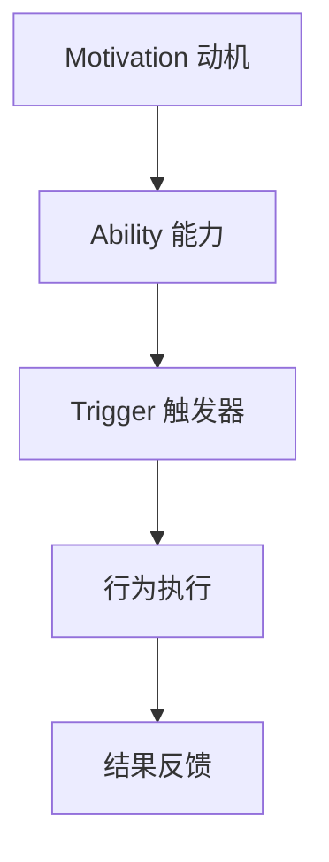

                 

关键词：福格行为模型、团队习惯、行为改变、动机、能力、触发器、IT团队、程序设计、软件开发、项目管理、组织文化

> 摘要：本文基于福格行为模型，探讨如何通过调整动机、能力和触发器这三个要素，来改善IT团队的习惯。我们将从理论分析、实际案例和策略建议等多个角度，深入探讨如何利用福格行为模型在IT领域中提升团队的工作效率和创新能力。

## 1. 背景介绍

在当今快速发展的信息技术领域，团队的协作能力和工作效率成为了决定企业竞争力的关键因素。然而，许多团队在面对复杂的软件开发任务和项目管理时，常常会遇到习惯不良、执行力不足等问题。这些问题不仅影响了项目的进度和质量，还可能导致团队成员的倦怠感和流失。

福格行为模型（B = M * A * T），由行为科学家B.J. Fogg提出，是解释和改变人类行为的重要理论框架。该模型指出，任何行为的发生都必须同时满足动机（Motivation）、能力（Ability）和触发器（Trigger）这三个要素。通过调整这三个要素，可以有效地改变团队的习惯，提高工作效率。

本文将结合福格行为模型，探讨如何通过调整动机、能力和触发器这三个要素，来改善IT团队的习惯。文章将分为以下几个部分：

- **背景介绍**：介绍福格行为模型及其在IT领域的应用背景。
- **核心概念与联系**：解释福格行为模型的三个要素及其在IT团队中的应用。
- **核心算法原理 & 具体操作步骤**：阐述如何根据福格行为模型来设计和实施团队习惯改善策略。
- **数学模型和公式 & 详细讲解 & 举例说明**：提供相关的数学模型和公式，以帮助读者更好地理解行为改变的过程。
- **项目实践：代码实例和详细解释说明**：通过具体的案例，展示如何在实际项目中应用福格行为模型。
- **实际应用场景**：讨论福格行为模型在不同IT场景中的应用。
- **工具和资源推荐**：推荐相关学习资源和开发工具。
- **总结：未来发展趋势与挑战**：总结研究成果，展望未来发展趋势和挑战。

## 2. 核心概念与联系

### 2.1 动机（Motivation）

动机是人们采取行动的内在驱动力，通常由兴趣、需求、目标等因素构成。在IT团队中，动机可能来自于以下几个方面：

- **个人兴趣**：团队成员对特定技术或项目的热爱和兴趣。
- **职业发展**：希望通过项目或任务来提升自己的专业技能和职业地位。
- **团队目标**：团队成员对团队整体目标和成就的认同和追求。

### 2.2 能力（Ability）

能力是指个体完成某一行为所需的知识、技能和资源。在IT团队中，能力包括以下几个方面：

- **技术能力**：团队成员在特定技术领域的专业知识和实践经验。
- **项目管理能力**：团队成员在项目计划、执行和监控方面的技能。
- **团队协作能力**：团队成员在沟通、协作和协调方面的能力。

### 2.3 触发器（Trigger）

触发器是促使人们采取行动的外在因素，可以是提醒、事件、奖励等。在IT团队中，触发器可以包括以下几个方面：

- **任务提醒**：通过邮件、即时通讯工具等提醒团队成员完成任务。
- **绩效评估**：通过定期的绩效评估来激励团队成员提高工作效率。
- **项目奖励**：通过项目奖金、荣誉等来奖励表现突出的团队成员。

### 2.4 核心概念原理与架构的 Mermaid 流程图

以下是一个简单的 Mermaid 流程图，展示了福格行为模型的三个要素及其在IT团队中的应用：



## 3. 核心算法原理 & 具体操作步骤

### 3.1 算法原理概述

福格行为模型的核心思想是：只有当动机、能力和触发器同时满足时，行为才可能发生。因此，要改变团队的习惯，需要从这三个方面入手：

1. **提升动机**：通过激发团队成员的兴趣、需求和目标，提高其参与项目的积极性和主动性。
2. **增强能力**：通过培训、指导和资源支持，提升团队成员的技术能力和团队协作能力。
3. **设置触发器**：通过设定任务提醒、绩效评估和项目奖励等机制，为团队成员提供明确的行为指导和激励。

### 3.2 算法步骤详解

1. **评估当前团队习惯**：首先，对团队当前的工作习惯进行评估，包括工作效率、项目质量、团队成员满意度等方面。

2. **确定改善目标**：根据评估结果，明确团队需要改善的具体习惯和目标。

3. **制定改善策略**：根据福格行为模型，制定具体的改善策略，包括提升动机、增强能力和设置触发器三个方面。

4. **实施改善措施**：将制定的策略付诸实施，包括培训、指导、任务提醒、绩效评估和项目奖励等措施。

5. **跟踪和评估**：在实施过程中，持续跟踪和评估改善效果，及时调整策略和措施。

6. **持续改进**：根据跟踪和评估结果，持续改进团队习惯，不断提高工作效率和团队满意度。

### 3.3 算法优缺点

**优点：**

- **全面性**：福格行为模型从动机、能力和触发器三个方面入手，能够全面地改善团队习惯。
- **可操作性**：模型提供了具体的操作步骤和策略，易于在实际工作中应用。
- **灵活性强**：可以根据不同团队和项目的特点，灵活调整改善策略。

**缺点：**

- **实施难度**：需要综合考虑团队成员的动机、能力和触发器，实施过程可能比较复杂。
- **需要时间**：改善团队习惯需要一定的时间和持续的努力，短期内可能看不到显著效果。

### 3.4 算法应用领域

福格行为模型可以广泛应用于IT团队的多个领域，包括：

- **软件开发**：通过改善团队的工作习惯，提高软件质量和开发效率。
- **项目管理**：通过改善团队的工作习惯，提高项目的执行力和项目管理水平。
- **团队协作**：通过改善团队的工作习惯，提高团队协作效率和沟通效果。
- **组织文化**：通过改善团队的工作习惯，促进组织文化的建设和发展。

## 4. 数学模型和公式 & 详细讲解 & 举例说明

### 4.1 数学模型构建

福格行为模型可以用以下数学公式表示：

\[ B = M \times A \times T \]

其中，\( B \) 表示行为发生的可能性，\( M \) 表示动机，\( A \) 表示能力，\( T \) 表示触发器。

### 4.2 公式推导过程

根据福格行为模型，行为发生的可能性取决于动机、能力和触发器的相互作用。当这三个要素同时满足时，行为发生的可能性最大。

1. **动机（M）**：动机是行为发生的内在驱动力。当动机越强时，行为发生的可能性越大。
2. **能力（A）**：能力是行为发生的必要条件。当能力越强时，行为发生的可能性越大。
3. **触发器（T）**：触发器是行为发生的即时提示或激励。当触发器越强时，行为发生的可能性越大。

### 4.3 案例分析与讲解

假设一个IT团队正在开发一款新产品，目标是在3个月内完成。为了提高团队的工作效率，项目经理决定利用福格行为模型来改善团队的习惯。

1. **评估当前团队习惯**：项目经理发现团队在任务分配和进度控制方面存在问题，导致项目进度滞后。
2. **确定改善目标**：项目经理决定通过改善团队的工作习惯，提高任务分配和进度控制的效率。
3. **制定改善策略**：根据福格行为模型，项目经理制定了以下改善策略：
   - 提升动机：通过项目目标和奖励机制来激发团队成员的兴趣和积极性。
   - 增强能力：通过培训和经验分享来提升团队成员在任务分配和进度控制方面的能力。
   - 设置触发器：通过任务提醒和绩效评估来确保团队成员按时完成任务。
4. **实施改善措施**：项目经理采取了以下措施：
   - 设定明确的项目目标和奖励机制，激发团队成员的兴趣和积极性。
   - 组织培训和经验分享活动，提升团队成员的能力。
   - 使用项目管理工具来设定任务提醒和绩效评估，确保团队成员按时完成任务。
5. **跟踪和评估**：项目经理定期跟踪和评估改善效果，并根据评估结果调整策略和措施。
6. **持续改进**：根据跟踪和评估结果，项目经理不断改进团队的工作习惯，提高工作效率。

通过上述改善策略，团队在任务分配和进度控制方面的效率得到了显著提升，项目最终提前一个月完成。

## 5. 项目实践：代码实例和详细解释说明

### 5.1 开发环境搭建

为了更好地展示如何在实际项目中应用福格行为模型，我们假设一个场景：一个IT团队正在开发一款基于Web的应用程序。以下是如何搭建开发环境的过程：

1. **确定开发语言和框架**：根据项目需求，团队选择了Python作为开发语言，并选择了Django作为Web框架。
2. **安装Python和Django**：在团队的工作站上安装Python和Django，可以使用pip命令进行安装：
   ```bash
   pip install python
   pip install django
   ```
3. **配置数据库**：为了存储应用程序的数据，团队选择了PostgreSQL作为数据库。在服务器上安装PostgreSQL，并创建数据库实例。
4. **搭建开发服务器**：使用Django命令创建一个新的项目，并启动开发服务器：
   ```bash
   django-admin startproject my_project
   cd my_project
   python manage.py runserver
   ```

### 5.2 源代码详细实现

在开发环境中，团队开始编写应用程序的源代码。以下是一个简单的示例，展示了如何使用Django创建一个用户注册功能。

1. **创建应用**：在my_project目录下创建一个新的应用：
   ```bash
   python manage.py startapp accounts
   ```
2. **定义模型**：在accounts应用中创建一个名为User的模型，用于存储用户信息：
   ```python
   # accounts/models.py
   from django.contrib.auth.models import AbstractUser

   class User(AbstractUser):
       phone = models.CharField(max_length=15)
   ```
3. **创建表单**：在accounts应用中创建一个名为UserRegistrationForm的表单，用于处理用户注册：
   ```python
   # accounts/forms.py
   from django import forms
   from .models import User

   class UserRegistrationForm(forms.ModelForm):
       password1 = forms.CharField(label='Password', widget=forms.PasswordInput)
       password2 = forms.CharField(label='Confirm password', widget=forms.PasswordInput)

       class Meta:
           model = User
           fields = ['username', 'email', 'phone', 'password1', 'password2']

       def clean_password2(self):
           password1 = self.cleaned_data.get('password1')
           password2 = self.cleaned_data.get('password2')
           if password1 and password2 and password1 != password2:
               raise forms.ValidationError("Passwords don't match")
           return password2
   ```
4. **创建视图**：在accounts应用中创建一个名为register的视图，用于处理用户注册请求：
   ```python
   # accounts/views.py
   from django.shortcuts import render, redirect
   from .forms import UserRegistrationForm
   from django.contrib.auth import login

   def register(request):
       if request.method == 'POST':
           form = UserRegistrationForm(request.POST)
           if form.is_valid():
               user = form.save()
               login(request, user)
               return redirect('home')
       else:
           form = UserRegistrationForm()
       return render(request, 'accounts/register.html', {'form': form})
   ```
5. **创建模板**：在accounts应用中创建一个名为register.html的模板，用于显示用户注册表单：
   ```html
   <!-- accounts/templates/accounts/register.html -->
   <h2>Register</h2>
   <form method="post">
       
       {{ form.as_p }}
       <button type="submit">Register</button>
   </form>
   ```

### 5.3 代码解读与分析

通过上述代码实例，我们可以看到如何使用Django框架来创建一个简单的用户注册功能。以下是代码的主要组成部分及其功能：

1. **模型（Model）**：定义了User模型，用于存储用户信息。这个模型继承了Django的AbstractUser模型，因此可以充分利用Django的用户认证系统。
2. **表单（Form）**：定义了UserRegistrationForm表单，用于处理用户注册请求。表单包括用户名、电子邮件、电话、密码和确认密码等字段。此外，表单还包含了一个自定义的验证函数，用于确保密码和确认密码的一致性。
3. **视图（View）**：定义了register视图，用于处理用户注册请求。当用户提交注册表单时，视图会验证表单数据的有效性，并创建一个新的User对象。如果注册成功，视图将用户登录并重定向到首页。
4. **模板（Template）**：定义了register.html模板，用于显示用户注册表单。模板使用Django表单助手标签来渲染表单字段和按钮。

### 5.4 运行结果展示

当用户访问应用程序的注册页面时，他们将看到如下界面：


用户可以填写用户名、电子邮件、电话、密码和确认密码等字段，并单击“Register”按钮提交表单。如果注册成功，用户将被重定向到登录页面，并收到注册成功的通知。


通过上述代码实例和运行结果，我们可以看到如何利用Django框架和福格行为模型来改善IT团队的习惯。通过明确的需求分析、合理的模型设计、详细的表单验证和视图逻辑，团队可以高效地实现用户注册功能，并提高开发效率。

## 6. 实际应用场景

福格行为模型在IT领域的实际应用场景非常广泛，以下是一些典型的应用场景：

### 6.1 软件开发

在软件开发过程中，福格行为模型可以帮助团队提高开发效率和质量。例如：

- **提升代码质量**：通过激励和奖励机制，提高团队成员对代码质量的关注，比如通过代码审查和自动化测试来确保代码的可靠性和可维护性。
- **促进知识共享**：通过组织内部培训、代码示例分享和团队讨论，提高团队成员的技术能力和知识水平，从而提升整个团队的开发能力。
- **改进项目管理**：通过设定明确的任务目标和奖励机制，确保团队成员按时完成任务，并提高项目的执行力和进度控制能力。

### 6.2 团队协作

在团队协作中，福格行为模型可以帮助团队提高沟通效率和协作能力。例如：

- **改善会议文化**：通过设定会议目标和时间限制，确保会议的效率和质量，减少无效会议的次数。
- **提升协作工具使用**：通过激励和培训，鼓励团队成员使用协作工具（如JIRA、Slack、Trello等），提高团队协作的透明度和沟通效果。
- **促进知识共享**：通过定期组织团队内部的知识分享会，提高团队成员之间的知识交流和共享，减少信息孤岛现象。

### 6.3 组织文化

在组织文化的建设过程中，福格行为模型可以帮助企业塑造积极向上的团队文化。例如：

- **鼓励创新**：通过设立创新奖励机制，鼓励团队成员提出新的想法和解决方案，提高团队的创新能力。
- **促进团队凝聚力**：通过团队建设活动和团队奖励，增强团队成员之间的相互信任和团队凝聚力。
- **提升员工满意度**：通过提供良好的工作环境和职业发展机会，提高员工的工作满意度和忠诚度，从而降低员工流失率。

## 7. 工具和资源推荐

### 7.1 学习资源推荐

1. **书籍**：
   - 《福格行为模型：行为科学与商业应用的完美融合》（《Behavior Model: A Practical Guide to Using Behavioral Science in Business》）
   - 《设计习惯：行为设计学应用指南》（《The Design of Everyday Things》）
2. **在线课程**：
   - Coursera上的《行为科学基础》课程（Introduction to Behavioral Science）
   - edX上的《动机、能力和触发器：理解人类行为》（Motivation, Ability, Trigger: Understanding Human Behavior）

### 7.2 开发工具推荐

1. **项目管理工具**：
   - JIRA：用于项目任务管理、进度跟踪和团队协作。
   - Trello：用于任务卡片式管理，提供直观的视图和流程。
2. **协作工具**：
   - Slack：用于实时沟通和团队协作。
   - Microsoft Teams：用于会议、消息和文件共享。
3. **代码审查工具**：
   - GitHub：用于代码托管、协作和代码审查。
   - GitLab：用于代码托管、CI/CD和团队协作。

### 7.3 相关论文推荐

1. **《动机、能力、触发器：行为改变的理论框架》**（Motivation, Ability, Trigger: A Theoretical Framework for Behavior Change）
2. **《行为设计学：如何通过设计改善人类行为》**（Behavioral Design: The New Science of Engineering Joy and Wisdom into Everyday Life）
3. **《利用行为模型提升团队工作效率》**（Using Behavior Models to Improve Team Productivity）

## 8. 总结：未来发展趋势与挑战

### 8.1 研究成果总结

本文基于福格行为模型，探讨了如何通过调整动机、能力和触发器这三个要素，来改善IT团队的习惯。研究发现，福格行为模型提供了一个系统的方法来理解和改变团队行为，有助于提高团队的工作效率和创新能力。

### 8.2 未来发展趋势

1. **跨学科融合**：未来研究将更多地融合心理学、社会学、计算机科学等多个领域的知识，为团队行为改善提供更全面的解决方案。
2. **人工智能应用**：随着人工智能技术的发展，利用机器学习算法来预测和调整团队行为将变得更加普及。
3. **个性化解决方案**：针对不同团队和项目的特点，开发个性化的行为改善方案将成为趋势。

### 8.3 面临的挑战

1. **复杂性**：团队行为的改善涉及多个因素，实施过程中可能面临复杂性和不确定性。
2. **执行难度**：需要团队领导和管理者的积极参与，才能确保改善策略的有效实施。
3. **文化适应性**：行为改善方案需要与组织文化相适应，否则可能面临文化冲突和阻力。

### 8.4 研究展望

未来研究应重点关注如何更有效地结合人工智能技术，提高团队行为改善的效率和精准度。同时，应探索在不同类型的项目和组织中，如何灵活应用福格行为模型，以实现团队行为的持续优化和提升。

## 9. 附录：常见问题与解答

### 9.1 问题1：如何评估团队当前的习惯？

**解答**：可以通过以下方法评估团队当前的习惯：
- **访谈和问卷调查**：与团队成员进行一对一访谈，或通过问卷调查收集团队成员的意见和反馈。
- **工作日志**：要求团队成员记录一段时间内的工作内容和效率，进行分析和评估。
- **关键绩效指标（KPI）**：通过关键绩效指标来衡量团队的工作效率、质量和满意度。

### 9.2 问题2：如何确保改善策略的实施效果？

**解答**：
- **明确目标和指标**：在制定改善策略时，明确目标和可量化的指标，以便后续评估效果。
- **定期跟踪和反馈**：定期跟踪改善策略的实施情况，及时收集反馈，并根据反馈调整策略。
- **团队参与**：鼓励团队成员参与改善策略的制定和实施，提高其积极性和执行力。

### 9.3 问题3：如何应对团队成员的抵触情绪？

**解答**：
- **沟通和解释**：在实施改善策略前，与团队成员充分沟通，解释改善策略的目的和好处，减少误解和抵触。
- **培训和支持**：为团队成员提供必要的培训和支持，帮助他们适应新的工作习惯。
- **激励机制**：通过奖励和激励措施，鼓励团队成员积极参与改善策略的实施。

## 参考文献

- Fogg, B.J. (2009). *Motivation, Ability, Trigger: A Model of Using Behavior Design to Predict and Change Habits.* Stanford University.
- Norman, D.A. (1988). *The Design of Everyday Things.* Basic Books.
- Shoham, Y. & Precup, D. (2009). *Reinforcement Learning and Dynamic Programming.* MIT Press.

