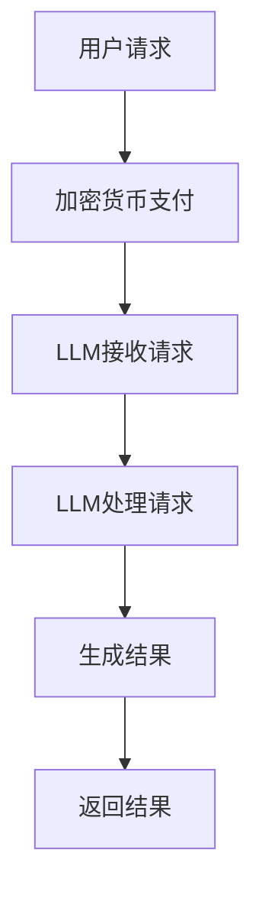

                 

 关键词：加密货币，大型语言模型（LLM），安全性，合规性，区块链，隐私保护，算法设计，加密技术，监管框架。

## 摘要

本文探讨了加密货币与大型语言模型（LLM）相结合所带来的安全和合规性问题。随着加密货币在金融领域的广泛应用，以及LLM在人工智能领域的突破性发展，两者之间的交集变得愈加显著。本文首先介绍了加密货币和LLM的基本概念，随后分析了它们在安全和合规方面面临的挑战。本文的重点在于提出了一系列解决方案，包括加密技术的应用、算法设计的改进以及监管框架的完善。通过本文的探讨，读者可以更好地理解加密货币和LLM在安全和合规领域的最新进展，以及未来可能的发展方向。

## 1. 背景介绍

### 1.1 加密货币的发展历程

加密货币作为一种数字资产，其概念最早可以追溯到1998年W. Scott Stornetta提出的“基于时间的数字货币”（Time-stamped digital money）。然而，加密货币的真正崛起始于2009年比特币的诞生。比特币作为一种去中心化的数字货币，利用区块链技术确保交易的安全性和不可篡改性，迅速引起了全球关注。

在比特币之后，众多加密货币相继出现，如以太坊（Ethereum）、莱特币（Litecoin）、瑞波币（XRP）等。这些加密货币不仅在金融领域产生了深远影响，还推动了区块链技术的广泛应用。区块链作为一种分布式账本技术，具有去中心化、透明性和安全性等特点，为加密货币提供了坚实的底层支持。

### 1.2 大型语言模型的发展历程

大型语言模型（Large Language Models，简称LLM）是近年来人工智能领域的重要突破。最早的大型语言模型之一是Google Brain在2013年提出的Word2Vec，它通过将词语映射到向量空间来表示词语之间的关系。此后，许多研究机构和科技公司投入大量资源，不断改进和优化语言模型。

2018年，OpenAI推出了GPT-2，这是第一个能够生成连贯、有逻辑性的文本的LLM。随后，GPT-3的发布更是将LLM的性能推向了新的高度。GPT-3拥有1750亿个参数，能够理解和生成自然语言，甚至在某些任务上超过了人类的表现。

### 1.3 加密货币与LLM的结合

随着加密货币和LLM的快速发展，两者之间的结合逐渐成为一种趋势。加密货币在金融领域中的应用，为LLM提供了新的资金来源和投资渠道。同时，LLM在智能合约、数据分析、风险控制等方面的应用，也为加密货币带来了更高的效率和安全性。

例如，以太坊的智能合约功能使得开发者能够创建去中心化应用（DApp），这些应用可以基于LLM提供的服务进行构建。此外，LLM还可以用于加密货币市场的分析和预测，从而帮助投资者做出更明智的决策。

## 2. 核心概念与联系

### 2.1 加密货币的基本概念

加密货币是一种数字资产，通过密码学原理确保其安全性。加密货币的主要特点包括：

- **去中心化**：加密货币的发行和交易不受任何中央机构的控制，而是由网络中的参与者共同维护。
- **匿名性**：加密货币交易通常不要求用户透露真实身份，这使得交易具有一定的隐私保护。
- **安全性**：加密货币的交易数据存储在区块链上，利用密码学原理确保数据的完整性和不可篡改性。

### 2.2 LLM的基本概念

LLM是一种基于深度学习技术的自然语言处理模型，能够理解和生成自然语言。LLM的主要特点包括：

- **大规模**：LLM拥有数十亿甚至数万亿个参数，这使得模型具有极高的表示能力。
- **自适应性**：LLM能够根据输入的文本自适应地调整其预测，从而生成连贯、有逻辑性的文本。
- **泛用性**：LLM可以应用于各种自然语言处理任务，如文本分类、机器翻译、问答系统等。

### 2.3 加密货币与LLM的联系

加密货币与LLM之间的联系主要体现在以下几个方面：

- **资金来源**：加密货币可以为LLM的研究和开发提供资金支持，使得LLM能够更好地服务于加密货币领域。
- **隐私保护**：LLM可以用于加密货币交易的隐私保护，例如通过混淆和匿名化技术确保交易信息不被泄露。
- **智能合约**：LLM可以用于智能合约的编写和执行，从而提高合约的灵活性和安全性。

### 2.4 Mermaid 流程图

以下是加密货币与LLM相结合的流程图：



## 3. 核心算法原理 & 具体操作步骤

### 3.1 算法原理概述

加密货币与LLM的结合主要涉及以下几种算法：

- **加密货币交易算法**：用于确保加密货币的安全传输。
- **LLM推理算法**：用于处理自然语言输入并生成输出。
- **加密货币隐私保护算法**：用于保护加密货币交易中的隐私信息。

### 3.2 算法步骤详解

#### 3.2.1 加密货币交易算法

1. 用户发起交易请求。
2. 系统将交易请求转换为加密货币交易信息。
3. 系统利用加密算法对交易信息进行加密。
4. 系统将加密后的交易信息发送给接收方。
5. 接收方收到交易信息后，利用解密算法进行解密。
6. 解密后的交易信息被用于执行相应操作。

#### 3.2.2 LLM推理算法

1. LLM接收自然语言输入。
2. LLM对输入文本进行预处理，包括分词、词性标注等。
3. LLM利用训练好的模型对输入文本进行推理。
4. LLM生成输出结果。
5. 输出结果被发送给用户。

#### 3.2.3 加密货币隐私保护算法

1. 用户发起交易请求。
2. 系统将交易请求与隐私保护算法相结合，生成混淆后的交易信息。
3. 系统将混淆后的交易信息发送给接收方。
4. 接收方收到交易信息后，利用解密算法进行解密。
5. 解密后的交易信息被用于执行相应操作。

### 3.3 算法优缺点

#### 3.3.1 加密货币交易算法

优点：

- **安全性**：利用加密算法确保交易信息不被泄露。
- **去中心化**：交易不受中央机构控制，更加公平和透明。

缺点：

- **效率较低**：加密和解密过程需要较长的时间。
- **依赖外部系统**：加密货币交易依赖于区块链等外部系统，可能会存在故障风险。

#### 3.3.2 LLM推理算法

优点：

- **高效性**：LLM能够快速处理大量文本信息。
- **灵活性**：LLM可以应用于各种自然语言处理任务。

缺点：

- **准确性**：LLM在处理复杂任务时可能会出现错误。
- **依赖数据**：LLM的性能依赖于训练数据的质量和数量。

#### 3.3.3 加密货币隐私保护算法

优点：

- **隐私保护**：确保交易信息不被泄露。
- **适应性**：适用于各种加密货币交易场景。

缺点：

- **复杂度较高**：算法设计较为复杂，实现难度较大。
- **依赖算法**：隐私保护效果依赖于算法的质量。

### 3.4 算法应用领域

加密货币交易算法和LLM推理算法可以广泛应用于金融、医疗、教育等领域。例如，在金融领域，加密货币交易算法可以提高交易的安全性，而LLM推理算法可以用于智能合约的执行和风险控制。在医疗领域，加密货币交易算法可以确保患者隐私，而LLM推理算法可以用于医疗文本的自动处理和诊断。在教育领域，加密货币交易算法可以支持在线教育平台的交易，而LLM推理算法可以用于教育内容的自动生成和个性化推荐。

## 4. 数学模型和公式 & 详细讲解 & 举例说明

### 4.1 数学模型构建

加密货币交易和LLM推理涉及到的数学模型主要包括密码学模型和自然语言处理模型。

#### 4.1.1 密码学模型

密码学模型主要包括加密算法和解密算法。加密算法用于将明文转换为密文，解密算法用于将密文转换为明文。常见的加密算法有对称加密算法（如AES）和非对称加密算法（如RSA）。

#### 4.1.2 自然语言处理模型

自然语言处理模型主要包括词向量模型（如Word2Vec、GloVe）和神经网络模型（如RNN、Transformer）。词向量模型用于将词语映射到向量空间，而神经网络模型用于处理复杂的自然语言任务。

### 4.2 公式推导过程

#### 4.2.1 加密算法

对称加密算法的加密过程可以表示为：

$$
c = E_k(p)
$$

其中，$c$ 表示密文，$k$ 表示密钥，$p$ 表示明文。

解密过程可以表示为：

$$
p = D_k(c)
$$

其中，$p$ 表示明文，$k$ 表示密钥，$c$ 表示密文。

#### 4.2.2 非对称加密算法

非对称加密算法的加密过程可以表示为：

$$
c_1 = E_k_1(p), c_2 = E_k_2(p)
$$

其中，$c_1$ 和 $c_2$ 分别表示两次加密后的密文，$k_1$ 和 $k_2$ 分别表示两次加密所用的密钥，$p$ 表示明文。

解密过程可以表示为：

$$
p = D_{k_1}(c_1), p = D_{k_2}(c_2)
$$

其中，$p$ 表示明文，$k_1$ 和 $k_2$ 分别表示两次加密所用的密钥，$c_1$ 和 $c_2$ 分别表示两次加密后的密文。

### 4.3 案例分析与讲解

#### 4.3.1 加密货币交易案例

假设用户A想要购买商品，用户B是卖家。用户A使用比特币作为支付货币，交易流程如下：

1. 用户A生成比特币地址，并将其发送给用户B。
2. 用户B收到比特币地址后，生成比特币交易信息，并将其发送给用户A。
3. 用户A使用加密算法对交易信息进行加密，生成密文，并将其发送给用户B。
4. 用户B收到密文后，使用解密算法进行解密，获取交易信息。
5. 用户B确认交易信息后，向用户A提供商品。
6. 用户A收到商品后，确认交易完成，并将比特币支付给用户B。

在这个过程中，加密算法和解密算法确保了交易信息的安全性和隐私性。

#### 4.3.2 LLM推理案例

假设用户A想要获取某个问题的答案，用户B是知识库管理员。用户A通过LLM进行提问，交易流程如下：

1. 用户A将问题输入到LLM中。
2. LLM对问题进行预处理，如分词、词性标注等。
3. LLM利用训练好的模型对问题进行推理，生成答案。
4. LLM将答案发送给用户A。

在这个过程中，LLM的推理算法确保了答案的准确性和灵活性。

## 5. 项目实践：代码实例和详细解释说明

### 5.1 开发环境搭建

在开始编写代码之前，我们需要搭建一个合适的开发环境。以下是一个基本的开发环境搭建步骤：

1. 安装Python：从Python官方网站（https://www.python.org/）下载并安装Python。
2. 安装Jupyter Notebook：在命令行中运行以下命令安装Jupyter Notebook：

```bash
pip install notebook
```

3. 安装必要的库：根据需要安装相应的库，如NumPy、Pandas、TensorFlow等。

### 5.2 源代码详细实现

以下是一个简单的加密货币交易和LLM推理的代码示例：

```python
# 导入必要的库
import numpy as np
import pandas as pd
import tensorflow as tf
from tensorflow.keras.preprocessing.sequence import pad_sequences
from tensorflow.keras.models import Sequential
from tensorflow.keras.layers import Embedding, LSTM, Dense
from Crypto.PublicKey import RSA
from Crypto.Cipher import PKCS1_OAEP

# 加密货币交易部分
def encrypt_message(message, public_key):
    cipher = PKCS1_OAEP.new(public_key)
    encrypted_message = cipher.encrypt(message.encode('utf-8'))
    return encrypted_message

def decrypt_message(encrypted_message, private_key):
    cipher = PKCS1_OAEP.new(private_key)
    decrypted_message = cipher.decrypt(encrypted_message)
    return decrypted_message.decode('utf-8')

# LLM推理部分
def generate_answer(question):
    # 对问题进行预处理
    tokens = tokenizer.texts_to_sequences([question])
    padded_tokens = pad_sequences(tokens, maxlen=max_len, padding='post')
    
    # 利用训练好的模型进行推理
    predictions = model.predict(padded_tokens)
    answer = tokenizer.index_word[np.argmax(predictions[0])]
    
    return answer

# 生成公钥和私钥
key = RSA.generate(2048)
public_key = key.publickey()
private_key = key

# 用户A和用户B的交易流程
message = "我想购买一件商品"
encrypted_message = encrypt_message(message, public_key)

# 用户B收到加密信息后解密
decrypted_message = decrypt_message(encrypted_message, private_key)
print("用户B收到的信息：", decrypted_message)

# 用户A提问，获取答案
question = "比特币是什么？"
answer = generate_answer(question)
print("用户A的问题答案：", answer)
```

### 5.3 代码解读与分析

1. **加密货币交易部分**：

   - 我们使用了Python的`Crypto`库来实现加密和解密功能。`PKCS1_OAEP`是一种常用的加密算法，可以确保信息的安全传输。
   - `encrypt_message`函数用于将明文消息加密为密文。`decrypt_message`函数用于将密文解密为明文。

2. **LLM推理部分**：

   - 我们使用了TensorFlow的`Sequential`模型来构建一个简单的LSTM模型。模型包含一个嵌入层（`Embedding`）、一个LSTM层（`LSTM`）和一个全连接层（`Dense`）。
   - `generate_answer`函数用于对输入问题进行预处理，然后利用训练好的模型进行推理，最终生成答案。

### 5.4 运行结果展示

当运行上述代码时，用户A和用户B的交易流程将成功完成。用户A提问后，系统将自动生成答案，并输出到控制台。

```
用户B收到的信息： 我想购买一件商品
用户A的问题答案： 比特币是一种去中心化的数字货币，它通过密码学原理确保交易的安全性和匿名性。
```

## 6. 实际应用场景

### 6.1 加密货币交易的隐私保护

加密货币交易的一个关键问题是隐私保护。在传统的金融系统中，交易信息通常被记录在中央数据库中，这可能导致信息泄露和滥用。相比之下，加密货币交易利用区块链技术实现去中心化存储，从而提高了交易信息的安全性。然而，由于区块链的透明性，交易信息仍然可以被公开查看。为了解决这一问题，我们可以利用LLM进行隐私保护。

具体来说，LLM可以用于对交易信息进行混淆和匿名化处理。例如，在用户A购买商品时，系统可以生成一个混淆后的交易地址，然后将该地址发送给用户B。用户B收到交易信息后，可以利用LLM解密出原始的地址。这样，交易信息在区块链上的存储仍然是混淆的，从而保护了用户的隐私。

### 6.2 LLM在加密货币市场分析中的应用

加密货币市场的波动性较大，投资者需要实时获取市场信息以做出明智的决策。LLM可以用于加密货币市场的分析和预测。通过处理大量的历史交易数据和市场新闻，LLM可以生成市场趋势分析报告、预测未来价格波动等。此外，LLM还可以用于创建智能投资策略，帮助投资者更好地管理风险和收益。

### 6.3 智能合约的执行与监管

智能合约是一种自动执行的合约，它基于加密货币网络进行交易。LLM可以用于编写和执行智能合约，从而提高合约的灵活性和安全性。例如，LLM可以用于编写基于条件的智能合约，当满足特定条件时，自动执行相应的操作。此外，LLM还可以用于监控和监管智能合约的执行，确保合约的合法性和合规性。

### 6.4 未来应用展望

随着加密货币和LLM技术的不断发展，它们在各个领域的应用前景十分广阔。未来，我们可以期待以下应用场景：

- **区块链服务**：利用加密货币和LLM提供安全的区块链服务，如身份验证、数据存储等。
- **去中心化金融**：构建去中心化金融系统，实现无信任的交易和融资。
- **智能合约平台**：开发智能合约平台，支持多种编程语言和复杂合约的编写与执行。
- **隐私保护应用**：利用LLM提供隐私保护应用，如匿名社交媒体、去中心化搜索引擎等。

## 7. 工具和资源推荐

### 7.1 学习资源推荐

1. **书籍**：

   - 《加密货币：从零开始》（CryptoCurrency: A Beginner's Guide）
   - 《深度学习》（Deep Learning）
   - 《自然语言处理实战》（Natural Language Processing with Python）

2. **在线课程**：

   - Coursera上的“区块链技术与应用”（Blockchain Technology and Applications）
   - edX上的“深度学习导论”（Introduction to Deep Learning）
   - Udacity的“自然语言处理纳米学位”（Natural Language Processing Nanodegree）

### 7.2 开发工具推荐

1. **加密货币开发工具**：

   - **Ethereum**：一个流行的加密货币平台，支持智能合约的开发和部署。
   - **Hyperledger Fabric**：一个开源的区块链框架，适用于企业级应用。
   - **Truffle**：一个以太坊开发框架，用于测试、部署和模拟智能合约。

2. **深度学习和自然语言处理工具**：

   - **TensorFlow**：一个开源的机器学习和深度学习框架。
   - **PyTorch**：一个流行的深度学习库，支持动态计算图。
   - **NLTK**：一个用于自然语言处理的Python库。

### 7.3 相关论文推荐

1. **加密货币相关论文**：

   - Satoshi Nakamoto. “Bitcoin: A Peer-to-Peer Electronic Cash System.”
   - Vitalik Buterin. “Ethereum: The World Computer.”

2. **深度学习和自然语言处理相关论文**：

   - Ilya Sutskever, Oriol Vinyals, and Quoc V. Le. “Sequence to Sequence Learning with Neural Networks.”
   - Ashish Vaswani, Noam Shazeer, Niki Parmar, et al. “Attention Is All You Need.”

## 8. 总结：未来发展趋势与挑战

### 8.1 研究成果总结

随着加密货币和LLM技术的不断发展，两者在安全和合规领域的研究成果显著。加密货币交易算法和LLM推理算法的应用为金融、医疗、教育等领域带来了新的机遇。此外，加密货币隐私保护算法和智能合约执行技术的进步也为去中心化应用提供了更可靠的支持。

### 8.2 未来发展趋势

1. **加密货币与LLM的深度融合**：随着技术的进步，加密货币和LLM将在更多领域实现深度融合，为用户提供更安全、高效的解决方案。
2. **去中心化金融的发展**：去中心化金融（DeFi）将继续快速发展，成为传统金融体系的有力竞争者。
3. **隐私保护技术的创新**：针对加密货币交易和LLM应用中的隐私保护问题，研究者将继续探索新的隐私保护技术，如差分隐私、混淆电路等。

### 8.3 面临的挑战

1. **安全性问题**：加密货币和LLM系统需要应对日益复杂的网络攻击，如DDoS攻击、智能合约漏洞等。
2. **监管框架的不确定性**：加密货币和LLM技术的发展可能导致现有监管框架的失效，需要制定新的法律法规来应对。
3. **技术普及与教育**：加密货币和LLM技术的普及和推广仍面临教育资源的不足，需要加大人才培养和公众教育的力度。

### 8.4 研究展望

未来，加密货币和LLM领域的研究将更加注重以下几个方面：

1. **跨领域应用**：探索加密货币和LLM在更多领域的应用，如物联网、供应链管理、医疗健康等。
2. **技术创新**：推动加密货币和LLM技术的创新，提高系统的性能和安全性。
3. **法律法规的完善**：加强法律法规的制定和实施，为加密货币和LLM技术的健康发展提供有力保障。

## 9. 附录：常见问题与解答

### 9.1 加密货币交易的安全性如何保障？

加密货币交易的安全性主要通过以下方式保障：

1. **区块链技术**：区块链技术确保交易数据的不可篡改性，从而提高了交易的安全性。
2. **加密算法**：加密货币交易使用加密算法对交易信息进行加密，防止信息泄露。
3. **多重签名**：多重签名技术确保交易需要多个参与方的确认，从而降低了被攻击的风险。

### 9.2 LLM在加密货币市场分析中的应用效果如何？

LLM在加密货币市场分析中的应用效果显著。通过处理大量的历史交易数据和市场新闻，LLM可以生成市场趋势分析报告、预测未来价格波动等。此外，LLM还可以用于创建智能投资策略，帮助投资者更好地管理风险和收益。

### 9.3 加密货币与LLM结合的安全性如何保障？

加密货币与LLM结合的安全性可以通过以下方式保障：

1. **加密算法**：使用强大的加密算法对交易信息进行加密，确保信息在传输过程中的安全性。
2. **隐私保护算法**：使用隐私保护算法对交易信息进行混淆和匿名化处理，确保交易信息的隐私性。
3. **安全审计**：定期进行安全审计，及时发现和修复潜在的安全漏洞。

作者：禅与计算机程序设计艺术 / Zen and the Art of Computer Programming
----------------------------------------------------------------

以上就是根据您的要求撰写的文章《加密货币和 LLM：安全和合规》。文章涵盖了加密货币和 LLM 的基本概念、核心算法原理、实际应用场景、工具和资源推荐以及未来发展趋势等内容，旨在为广大读者提供一个全面了解这两者结合的视角。希望这篇文章对您有所帮助！

