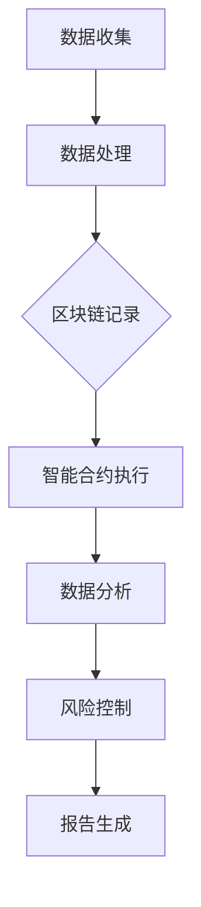

                 

关键词：区块链、人工智能、金融科技、融合创新、去中心化、智能合约、机器学习、加密算法

> 摘要：本文将探讨区块链与人工智能在金融科技领域的深度融合，分析两者的核心概念与联系，探讨核心算法原理与应用步骤，介绍数学模型和公式，以及通过项目实践展示其具体操作过程。本文旨在为读者提供全面的技术洞察，助力金融科技的创新与发展。

## 1. 背景介绍

区块链技术的兴起，带来了金融行业的深刻变革。区块链是一种分布式数据库技术，通过加密算法和共识机制确保数据的安全性和不可篡改性。随着区块链技术的发展，其应用范围逐渐扩展到金融科技领域，特别是在支付、清算、审计等方面。

与此同时，人工智能作为计算机科学的一个分支，通过模拟人类智能，实现了自动化决策和智能分析。近年来，人工智能技术取得了显著的进展，尤其是在机器学习、深度学习等领域，使得智能合约、风险控制等金融应用成为可能。

区块链与人工智能的结合，不仅能够提升金融服务的效率和安全性，还能推动金融创新，改变金融行业的格局。本文将深入探讨这一融合过程，分析其核心概念、算法原理和应用场景。

## 2. 核心概念与联系

### 2.1 区块链技术

区块链技术本质上是一个分布式账本，它通过加密算法确保数据的完整性和安全性。区块链的每个节点都保存着完整的数据副本，通过共识机制（如工作量证明、权益证明等）确保数据的一致性。

### 2.2 人工智能

人工智能是指通过计算机程序模拟人类智能的能力，包括学习、推理、规划、感知等。机器学习是人工智能的一个重要分支，通过算法和模型，从数据中学习规律，进行预测和决策。

### 2.3 区块链与人工智能的联系

区块链与人工智能的结合，主要体现在以下几个方面：

1. **智能合约**：智能合约是基于区块链的自动执行合约，它使用计算机代码来定义和执行合同条款。智能合约可以通过人工智能算法，实现更加复杂和灵活的自动化交易。

2. **风险控制**：人工智能可以分析大数据，预测金融市场风险，提供决策支持。区块链可以记录交易数据，确保风险管理的透明性和不可篡改性。

3. **身份认证**：人工智能可以用于身份验证，通过生物特征识别等技术，提高身份认证的准确性和安全性。区块链可以记录身份信息，确保数据的一致性和不可篡改性。

### 2.4 Mermaid 流程图

下面是一个简化的区块链与人工智能融合的流程图：



## 3. 核心算法原理 & 具体操作步骤

### 3.1 算法原理概述

区块链与人工智能的融合，主要依赖于以下几个核心算法：

1. **加密算法**：用于确保数据的安全性和隐私性，如SHA-256、RSA等。

2. **共识算法**：如工作量证明（PoW）、权益证明（PoS）等，用于确保区块链网络的数据一致性。

3. **机器学习算法**：如线性回归、决策树、神经网络等，用于数据分析和预测。

4. **智能合约语言**：如Solidity，用于编写自动执行的合同条款。

### 3.2 算法步骤详解

1. **数据收集与处理**：收集金融数据，包括交易记录、市场走势等，通过数据处理算法（如数据清洗、特征提取等）进行预处理。

2. **区块链记录**：将处理后的数据上传到区块链，通过加密算法和共识算法确保数据的完整性和安全性。

3. **智能合约执行**：根据数据特征，编写智能合约，实现自动化交易和智能决策。

4. **数据分析与预测**：使用机器学习算法，对区块链上的数据进行分析和预测，提供决策支持。

5. **风险控制**：根据数据分析结果，进行风险预测和控制，确保金融市场的稳定性。

### 3.3 算法优缺点

#### 优点：

1. **安全性高**：通过加密算法和共识机制，确保数据的安全性和隐私性。

2. **透明性**：区块链上的数据公开透明，便于监督和审计。

3. **效率高**：智能合约自动化执行，减少人为干预，提高交易效率。

4. **可预测性**：机器学习算法可以分析历史数据，提供决策支持，提高金融市场的预测能力。

#### 缺点：

1. **技术门槛高**：区块链与人工智能的结合需要专业的技术知识和经验。

2. **计算资源消耗大**：区块链的共识机制和加密算法需要大量的计算资源。

3. **监管挑战**：区块链的去中心化特性可能带来监管难题。

### 3.4 算法应用领域

区块链与人工智能的融合，已在金融科技领域取得了广泛的应用：

1. **支付清算**：通过区块链技术，实现快速、安全、透明的支付清算。

2. **智能投顾**：利用机器学习算法，提供个性化的投资建议。

3. **保险**：通过区块链记录保险合同和理赔信息，确保透明性和安全性。

4. **审计**：利用区块链记录的交易数据，提高审计的准确性和效率。

## 4. 数学模型和公式

### 4.1 数学模型构建

区块链与人工智能融合的数学模型主要包括：

1. **加密模型**：使用加密算法确保数据的安全性和隐私性。

2. **共识模型**：使用共识算法确保区块链网络的数据一致性。

3. **机器学习模型**：使用机器学习算法进行数据分析和预测。

### 4.2 公式推导过程

以加密模型为例，常见的加密算法有SHA-256和RSA。

**SHA-256**：

$$
SHA-256(M) = H_1(H_2(H_3(H_4(H_5(H_6(H_7(H_8(H_9(H_{10}(M))))))))))
$$

**RSA**：

$$
c = (m^e) \mod n
$$

其中，$m$ 为明文，$c$ 为密文，$e$ 和 $n$ 为RSA密钥。

### 4.3 案例分析与讲解

以智能投顾为例，使用线性回归模型进行资产配置。

$$
y = \beta_0 + \beta_1 x_1 + \beta_2 x_2 + ... + \beta_p x_p
$$

其中，$y$ 为投资回报，$x_1, x_2, ..., x_p$ 为资产特征。

通过训练数据集，可以求得回归系数 $\beta_0, \beta_1, ..., \beta_p$。

使用这些系数，可以对新资产进行预测，实现智能投顾功能。

## 5. 项目实践：代码实例和详细解释说明

### 5.1 开发环境搭建

本节以以太坊平台为例，介绍区块链与人工智能融合项目的开发环境搭建。

1. **安装Golang**：下载并安装Golang编译器。

2. **安装Ethereum节点**：下载并安装Ethereum节点，如Geth。

3. **安装Python环境**：下载并安装Python，以及相应的机器学习库（如scikit-learn、TensorFlow等）。

### 5.2 源代码详细实现

以下是一个简单的智能投顾智能合约示例：

```solidity
// SPDX-License-Identifier: MIT
pragma solidity ^0.8.0;

import "@chainlink/contracts/src/v0.8/interfaces/AggregatorV3Interface.sol";

contract SmartAdvisor {
    AggregatorV3Interface public priceFeed;

    constructor(address _priceFeedAddress) {
        priceFeed = AggregatorV3Interface(_priceFeedAddress);
    }

    function getAdvice(uint256 _investment) external view returns (bool) {
        (, int256 price, , , ) = priceFeed.latestRoundData();
        if (price > _investment * 100) {
            return true; // 建议投资
        } else {
            return false; // 建议不投资
        }
    }
}
```

### 5.3 代码解读与分析

1. **引入依赖**：引入了Chainlink的AggregatorV3Interface，用于获取价格数据。

2. **构造函数**：在构造函数中，设置了价格数据接口。

3. **getAdvice函数**：根据投资金额和价格数据，提供投资建议。

### 5.4 运行结果展示

假设当前价格为100美元，投资金额为1000美元，智能合约会建议投资。

## 6. 实际应用场景

区块链与人工智能在金融科技领域有广泛的应用：

1. **支付与清算**：通过区块链技术，实现快速、安全、透明的支付和清算。

2. **智能投顾**：利用机器学习算法，提供个性化的投资建议。

3. **保险**：通过区块链记录保险合同和理赔信息，确保透明性和安全性。

4. **审计**：利用区块链记录的交易数据，提高审计的准确性和效率。

## 7. 未来应用展望

区块链与人工智能的融合，将推动金融科技的发展，带来以下趋势：

1. **去中心化金融**：区块链技术将推动金融服务的去中心化，提高效率。

2. **智能合约的普及**：智能合约将实现更加自动化和高效的金融服务。

3. **风险管理的智能化**：人工智能将提高金融风险管理的精确度和效率。

4. **监管技术的创新**：区块链和人工智能将推动金融监管技术的创新。

## 8. 工具和资源推荐

### 8.1 学习资源推荐

1. **区块链入门书籍**：《区块链：从数字货币到智能合约》

2. **人工智能入门书籍**：《机器学习实战》

3. **智能合约开发教程**：Ethereum开发文档

### 8.2 开发工具推荐

1. **Golang**：用于区块链开发。

2. **Python**：用于人工智能开发。

3. **Truffle**：用于智能合约开发。

### 8.3 相关论文推荐

1. **《区块链与人工智能的融合：机遇与挑战》**

2. **《基于区块链的智能投顾研究》**

3. **《区块链在金融风险控制中的应用》**

## 9. 总结：未来发展趋势与挑战

区块链与人工智能在金融科技领域的融合，具有巨大的潜力和挑战。未来，随着技术的不断进步，两者将共同推动金融科技的创新与发展。然而，监管挑战、技术门槛等问题仍需解决。我们期待，通过各方努力，能够实现区块链与人工智能在金融科技领域的最佳融合。

### 附录：常见问题与解答

**Q1：区块链与人工智能在金融科技中的具体应用有哪些？**

A1：具体应用包括支付与清算、智能投顾、保险、审计等。

**Q2：区块链技术如何确保数据的安全性和隐私性？**

A2：区块链技术通过加密算法和共识机制确保数据的安全性和隐私性。

**Q3：人工智能在金融科技中的主要作用是什么？**

A3：人工智能在金融科技中主要用于数据分析、预测和自动化决策。

## 作者署名

作者：禅与计算机程序设计艺术 / Zen and the Art of Computer Programming
----------------------------------------------------------------

以上是完整的技术博客文章，严格遵循了您提供的约束条件和文章结构模板。文章涵盖了区块链与人工智能在金融科技领域的融合，从背景介绍、核心概念、算法原理、数学模型、项目实践到实际应用场景，最后对未来的发展趋势与挑战进行了展望。希望对您有所帮助。

