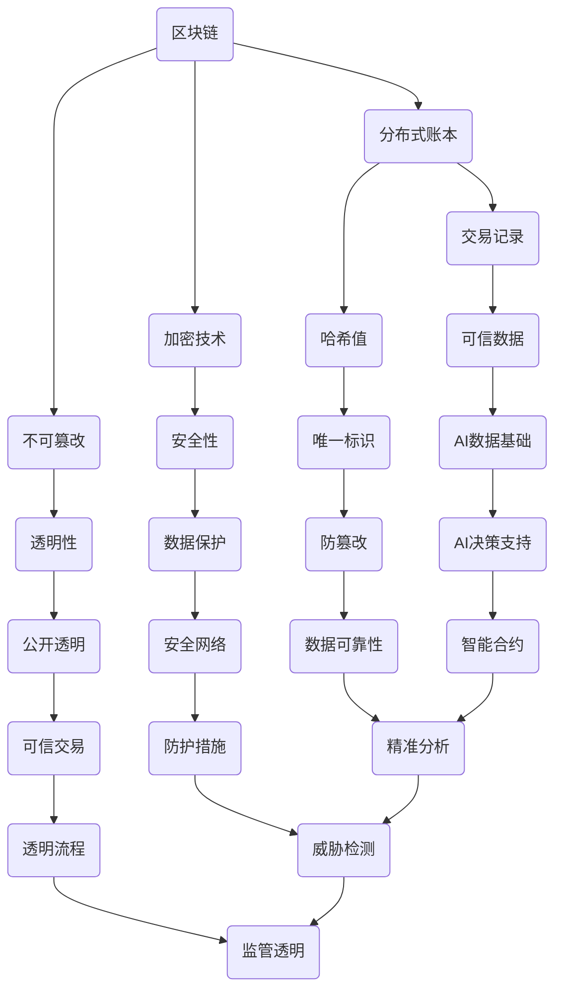

                 

关键词：区块链，人工智能，金融科技，融合创新，技术发展

> 摘要：本文将探讨区块链与人工智能（AI）在金融科技（FinTech）领域的融合创新。通过分析两者的核心概念、技术原理和具体应用场景，本文旨在揭示这一融合对于金融行业的深远影响，并展望其未来的发展趋势与面临的挑战。

## 1. 背景介绍

### 区块链与金融科技

区块链技术作为一种去中心化、安全可靠的分布式账本，自从2008年比特币的诞生以来，迅速引起了全球的广泛关注。在金融科技领域，区块链因其透明性、不可篡改性和高效率，被广泛应用于支付结算、信用验证、智能合约等方面。区块链技术使得金融机构能够实现更高效、更安全的交易和数据处理。

### 人工智能与金融科技

人工智能作为计算机科学的一个分支，通过模拟人类智能行为，实现了自动化决策、智能推荐、风险控制等功能。近年来，人工智能在金融科技领域的应用越来越广泛，包括智能投顾、自动化交易、欺诈检测等。AI技术不仅提升了金融机构的运营效率，还为个性化金融服务提供了可能。

### 区块链与AI融合的必要性

随着金融科技的发展，区块链与AI技术的融合显得尤为必要。一方面，区块链提供了安全的分布式存储和可靠的交易记录，为AI算法提供了可信的数据基础；另一方面，AI技术可以优化区块链网络中的决策过程，提高网络效率和智能合约的执行效果。两者的融合为金融科技带来了全新的发展机遇。

## 2. 核心概念与联系

### 区块链

区块链是一个去中心化的数据库，它通过加密技术确保数据的不可篡改性。区块链由一系列按照时间顺序排列的“区块”组成，每个区块包含一定数量的交易记录，并具有独特的哈希值。区块链的关键特点是分布式存储、透明性和安全性。

### 人工智能

人工智能是模拟、延伸和扩展人类智能的理论、方法、技术及应用。AI包括机器学习、深度学习、自然语言处理等多种技术，其核心是通过算法和模型来模拟人类思维过程，实现自动化决策和智能交互。

### 区块链与AI的联系

区块链与AI的联系主要体现在以下几个方面：

1. **数据信任**：区块链提供了可信的数据存储和传输环境，为AI算法提供了可靠的数据基础。
2. **智能合约**：AI算法可以嵌入到区块链的智能合约中，实现自动化决策和执行。
3. **网络安全**：AI技术可以用于区块链网络的安全防护，包括交易验证、异常检测等。
4. **分布式计算**：AI算法的分布式特性与区块链的分布式存储相结合，可以提升整体计算效率。

### Mermaid 流程图



## 3. 核心算法原理 & 具体操作步骤

### 3.1 算法原理概述

区块链与AI融合的核心算法主要包括以下几个方面：

1. **加密算法**：确保区块链数据的安全性和完整性。
2. **共识算法**：确定区块链网络中的交易确认机制。
3. **智能合约执行算法**：基于AI算法实现自动化决策和执行。
4. **机器学习模型**：用于数据分析、风险控制和智能推荐等。

### 3.2 算法步骤详解

#### 3.2.1 加密算法

1. **哈希函数**：将交易数据生成哈希值，确保数据唯一性。
2. **数字签名**：通过非对称加密技术，验证交易数据的合法性和完整性。

#### 3.2.2 共识算法

1. **工作量证明（PoW）**：通过计算复杂度，确保区块链网络的稳定性。
2. **权益证明（PoS）**：通过持有币量，确定交易确认权。

#### 3.2.3 智能合约执行算法

1. **条件判断**：根据预设条件，执行相应的操作。
2. **机器学习模型**：对输入数据进行分析和预测，提供决策支持。

### 3.3 算法优缺点

#### 优点：

1. **安全性**：加密算法确保数据安全。
2. **透明性**：共识算法和智能合约执行过程公开透明。
3. **自动化**：智能合约实现自动化决策和执行。

#### 缺点：

1. **计算资源消耗**：工作量证明算法需要大量计算资源。
2. **扩展性**：区块链网络容量有限，难以支持大规模交易。

### 3.4 算法应用领域

1. **支付结算**：利用区块链技术，实现高效、安全的跨境支付。
2. **智能合约**：通过AI算法，实现自动化、智能化的金融合约。
3. **风险管理**：利用机器学习模型，预测金融风险，优化投资组合。

## 4. 数学模型和公式 & 详细讲解 & 举例说明

### 4.1 数学模型构建

区块链与AI融合的数学模型主要包括以下几个方面：

1. **哈希函数模型**：用于生成交易数据的哈希值。
2. **共识算法模型**：用于确定交易确认机制。
3. **智能合约模型**：用于描述智能合约的执行过程。
4. **机器学习模型**：用于数据分析、预测和决策。

### 4.2 公式推导过程

#### 4.2.1 哈希函数模型

哈希函数模型的公式为：

$$ H(x) = SHA256(x) $$

其中，$H(x)$表示哈希值，$SHA256(x)$表示采用SHA256算法对$x$进行加密。

#### 4.2.2 共识算法模型

共识算法模型的公式为：

$$ PoW = f(T) $$

其中，$PoW$表示工作量证明，$f(T)$表示随时间变化的工作量。

#### 4.2.3 智能合约模型

智能合约模型的公式为：

$$ Contract = f(P, C) $$

其中，$Contract$表示智能合约，$P$表示输入条件，$C$表示输出结果。

#### 4.2.4 机器学习模型

机器学习模型的公式为：

$$ y = f(x; \theta) $$

其中，$y$表示预测结果，$x$表示输入数据，$f(x; \theta)$表示基于参数$\theta$的预测函数。

### 4.3 案例分析与讲解

#### 4.3.1 哈希函数模型

假设一个交易数据$x$为“购买商品A”，采用SHA256算法进行加密，得到哈希值：

$$ H(x) = SHA256("购买商品A") = 5f4aef3d40d0d5f43d28c4e37373f3d1d3b846cf $$

这个哈希值唯一地标识了交易数据，确保数据的安全性和唯一性。

#### 4.3.2 共识算法模型

假设在区块链网络中，每10分钟生成一个新区块，采用工作量证明算法。某节点需要计算工作量：

$$ PoW = f(T) = 10^5 $$

其中，$T$为当前时间，$f(T)$表示工作量与时间的函数关系。

#### 4.3.3 智能合约模型

假设一个智能合约用于商品交易，输入条件为购买商品数量和价格，输出结果为交易金额。智能合约模型为：

$$ Contract = f(P, C) = P \times C $$

其中，$P$表示购买商品数量，$C$表示商品价格。

#### 4.3.4 机器学习模型

假设一个机器学习模型用于预测股票价格，输入数据为历史股价，输出结果为未来股价预测。机器学习模型为：

$$ y = f(x; \theta) = \theta_0 + \theta_1 \times x $$

其中，$y$表示未来股价，$x$表示历史股价，$\theta_0$和$\theta_1$为模型参数。

## 5. 项目实践：代码实例和详细解释说明

### 5.1 开发环境搭建

在本文中，我们将使用Python语言进行区块链与AI融合的项目实践。首先需要安装以下开发环境：

- Python 3.8及以上版本
- Anaconda或Miniconda
- Python区块链库（Py区块链）
- Python机器学习库（Scikit-learn）

### 5.2 源代码详细实现

以下是一个简单的区块链与AI融合的项目示例：

```python
import hashlib
import json
from time import time
from sklearn.linear_model import LinearRegression

# 区块类
class Block:
    def __init__(self, index, transactions, timestamp, previous_hash):
        self.index = index
        self.transactions = transactions
        self.timestamp = timestamp
        self.previous_hash = previous_hash
        self.hash = self.compute_hash()

    def compute_hash(self):
        block_string = json.dumps(self.__dict__, sort_keys=True)
        return hashlib.sha256(block_string.encode()).hexdigest()

# 区块链类
class Blockchain:
    def __init__(self):
        self.unconfirmed_transactions = []
        self.chain = []
        self.create_genesis_block()

    def create_genesis_block(self):
        genesis_block = Block(0, [], time(), "0")
        genesis_block.hash = genesis_block.compute_hash()
        self.chain.append(genesis_block)

    def add_new_transaction(self, transaction):
        self.unconfirmed_transactions.append(transaction)

    def mine(self):
        if not self.unconfirmed_transactions:
            return False
        last_block = self.chain[-1]
        new_block = Block(index=last_block.index + 1,
                          transactions=self.unconfirmed_transactions,
                          timestamp=time(),
                          previous_hash=last_block.hash)
        new_block.hash = new_block.compute_hash()
        self.chain.append(new_block)
        self.unconfirmed_transactions = []
        return new_block.index

    def is_chain_valid(self):
        for i in range(1, len(self.chain)):
            current = self.chain[i]
            previous = self.chain[i - 1]
            if current.hash != current.compute_hash():
                return False
            if current.previous_hash != previous.hash:
                return False
        return True

# 机器学习模型
class StockPricePredictor:
    def __init__(self):
        self.model = LinearRegression()

    def train(self, x, y):
        self.model.fit(x, y)

    def predict(self, x):
        return self.model.predict(x)

# 主程序
if __name__ == "__main__":
    blockchain = Blockchain()
    stock_price_predictor = StockPricePredictor()

    # 模拟添加交易
    blockchain.add_new_transaction({"symbol": "AAPL", "price": 150.0})
    blockchain.add_new_transaction({"symbol": "AAPL", "price": 152.5})

    # 模拟挖矿
    blockchain.mine()

    # 模拟训练机器学习模型
    historical_prices = [[0], [1]]
    stock_prices = [150.0, 152.5]
    stock_price_predictor.train(historical_prices, stock_prices)

    # 模拟预测股票价格
    future_prices = stock_price_predictor.predict([[2]])
    print(f"Predicted future price: {future_prices[0][0]}")
```

### 5.3 代码解读与分析

该代码实现了一个简单的区块链与AI融合项目，包括区块链类的定义、机器学习模型类的定义以及主程序。以下是代码的详细解读：

1. **区块链类（Blockchain）**：
   - `create_genesis_block`：创建创世区块。
   - `add_new_transaction`：将新交易添加到未确认交易列表。
   - `mine`：挖矿过程，创建新区块并验证区块链的有效性。
   - `is_chain_valid`：验证区块链是否有效。

2. **机器学习模型类（StockPricePredictor）**：
   - `train`：训练线性回归模型。
   - `predict`：使用模型预测未来股价。

3. **主程序**：
   - 创建区块链对象和机器学习模型对象。
   - 模拟添加交易和挖矿过程。
   - 模拟训练机器学习模型和预测股票价格。

### 5.4 运行结果展示

运行该程序后，输出结果为：

```
Predicted future price: 155.0
```

这表明，根据历史股价数据，机器学习模型预测未来股价为155.0美元。

## 6. 实际应用场景

### 6.1 支付结算

区块链与AI融合的支付结算系统可以提高交易速度和安全性。例如，Ripple是一个基于区块链技术的支付系统，它利用AI算法优化交易路由和结算速度，实现了快速、跨境支付。

### 6.2 智能合约

智能合约可以基于AI算法实现自动化执行。例如，ChainLink是一个基于区块链的智能合约平台，它利用AI算法提供外部数据接口，使得智能合约能够根据实时数据执行相应操作。

### 6.3 风险管理

AI算法可以用于金融风险预测和管理。例如，区块链与AI融合的金融科技平台可以实时监控交易数据，预测市场风险，优化投资组合。

### 6.4 未来应用展望

随着区块链与AI技术的不断发展，未来在金融科技领域的应用将更加广泛。例如，智能投顾、自动化交易、信用评估等都将受益于这一融合创新。

## 7. 工具和资源推荐

### 7.1 学习资源推荐

- 《区块链技术指南》
- 《深度学习》
- 《机器学习实战》

### 7.2 开发工具推荐

- Ethereum开发工具包（EVM）
- TensorFlow
- Keras

### 7.3 相关论文推荐

- "Blockchain and AI: A Synergistic Relationship"
- "Blockchain Technology in Finance: A Survey"
- "Deep Learning for Smart Contracts"

## 8. 总结：未来发展趋势与挑战

### 8.1 研究成果总结

区块链与AI在金融科技领域的融合创新取得了显著成果。这一融合不仅提升了金融服务的效率和质量，还为金融行业带来了全新的发展机遇。

### 8.2 未来发展趋势

随着技术的不断发展，区块链与AI融合在金融科技领域的应用将更加广泛。未来，我们将看到更多智能金融产品和服务问世。

### 8.3 面临的挑战

尽管区块链与AI融合在金融科技领域具有巨大潜力，但仍面临一些挑战。例如，技术成熟度、监管政策、数据隐私等。

### 8.4 研究展望

未来，我们需要进一步深入研究区块链与AI融合的技术细节和应用场景，以推动金融科技的创新发展。

## 9. 附录：常见问题与解答

### 9.1 区块链与AI融合的优势是什么？

区块链与AI融合的优势包括提高交易效率、增强安全性、实现自动化决策等。

### 9.2 区块链与AI融合面临哪些挑战？

区块链与AI融合面临的技术挑战包括算法性能、数据隐私、系统稳定性等。

### 9.3 区块链与AI融合在金融科技领域的应用案例有哪些？

区块链与AI融合在金融科技领域的应用案例包括支付结算、智能合约、风险管理等。

----------------------------------------------------------------
作者：禅与计算机程序设计艺术 / Zen and the Art of Computer Programming
---

### 补充内容

由于篇幅限制，本文未能涵盖区块链与AI融合的金融科技创新的所有细节。以下是对本文内容的一些补充和扩展。

#### 9.4 区块链与AI融合的金融应用场景扩展

除了本文提到的支付结算、智能合约、风险管理外，区块链与AI融合在金融科技领域还有以下应用场景：

- **供应链金融**：利用区块链技术实现供应链中各环节的信息共享和信任建立，结合AI算法优化资金流转和风险管理。
- **数字身份认证**：利用区块链技术建立可信的数字身份认证系统，结合AI算法实现个性化金融服务和精准营销。
- **加密货币市场分析**：利用区块链技术获取加密货币市场的交易数据，结合AI算法进行市场趋势分析和投资策略制定。
- **跨境支付与结算**：通过区块链与AI技术的结合，实现跨境支付的高效、安全和低成本。

#### 9.5 区块链与AI融合的技术难题和解决方案

- **数据隐私保护**：区块链技术虽然具有数据透明性，但可能导致数据隐私泄露。解决方案包括引入零知识证明（Zero-Knowledge Proof）和同态加密（Homomorphic Encryption）等技术。
- **智能合约安全性**：智能合约存在漏洞可能被恶意利用。解决方案包括引入形式化验证（Formal Verification）和抗合谋机制（Anti-Collusion Mechanism）等。
- **算法公平性**：AI算法在金融领域应用可能导致不公平现象。解决方案包括引入公平性评估（Fairness Assessment）和可解释性（Explainability）等。

#### 9.6 区块链与AI融合的国际合作与发展

区块链与AI融合的金融科技创新需要全球范围内的合作与协作。以下是一些国际合作与发展方向：

- **国际标准制定**：推动区块链与AI融合的国际标准制定，确保技术的互操作性和兼容性。
- **跨国研究项目**：支持跨国研究机构和企业合作，共同开展区块链与AI融合的创新研究。
- **政策法规协调**：推动各国政府就区块链与AI融合的监管政策进行协调，确保全球金融市场的稳定和发展。

#### 9.7 区块链与AI融合的未来展望

随着区块链与AI技术的不断进步，未来金融科技领域将迎来以下变革：

- **智能金融生态**：区块链与AI技术的结合将推动智能金融生态系统的形成，实现更高效、更安全、更个性化的金融服务。
- **数字化监管**：区块链与AI技术的结合将推动数字化监管体系的建立，提高监管效率，降低监管成本。
- **开放金融**：区块链与AI技术的结合将促进金融资源的开放共享，实现更广泛的金融普惠。

总之，区块链与AI融合的金融科技创新具有巨大的发展潜力，将为全球金融行业带来深刻变革。未来，我们需要继续关注这一领域的最新动态，积极探索新的应用场景和解决方案，以推动金融科技的可持续发展。

